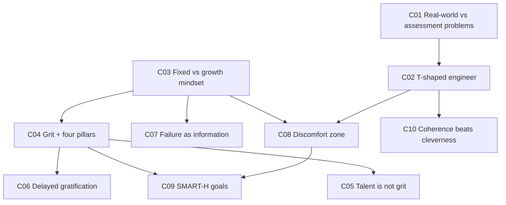

# ENGGEN403 Lecture 1 — What can ENGGEN 403 do for me?

**Why this matters:** After this lecture you can name the difference between a fixed and a growth mindset and spot which one you're operating from in a specific moment; you can define grit and break it into its four components; and you can set a goal that is deliberately hard rather than safely achievable. These are the lecture's three stated learning outcomes, and they're the raw material for the individual goal-setting assignment.

**Prerequisites from earlier lectures:** none — this is Lecture 1.

**⚠ Diagram gap.** `pdftoppm` was not installed when these notes were written, so slides that are image-only could not be viewed. Affected pages: **17–18** (the "jigsaw" map of how course components assemble), **19, 20, 22** (image-only, no extractable text), and **24** (the success-vs-career graph the lecturer described as "my last slide"). Text-derived reconstruction for 17–18 and 24 is marked below. Install Poppler and re-ingest to close this.

## Concept map

---

## [L1-C01] Real-world problems vs assessment problems

**Cue questions**
- What specifically distinguishes a real-world problem from a problem set in a course?
- Why does that distinction change what skills you need?

**In plain language**
Every problem you've been given at university arrived pre-chewed. Someone decided what the question was, checked it had an answer, and sized it so a student could finish it. Real problems arrive raw: nobody has decided what the question is, and some of them simply have no solution. That's not a flaw in the problem — it's the normal condition.

**Precisely**
The lecturer's distinguishing criterion is that real-world problems "haven't been nicely framed and put into an assessment format that gives you a challenge that's a solvable problem." Two consequences follow: (i) framing the problem becomes part of the work rather than a given, and (ii) solvability is not guaranteed.

Examples raised from the room: unemployment, reliability of AI, and energy demand (with the chain: data centres and AI → higher energy demand → higher prices → cost of living → back to unemployment). The lecturer's point about that chain is that these problems are interconnected, which is the hook into systems thinking in Lecture 2.

The consequence the course is built around: "engineering alone is not going to solve all those." Technical skill is necessary and insufficient.

**Common traps**
- Treating "no clean solution exists" as a sign you've misunderstood the problem. Sometimes it just means the problem is real.
- Assuming the problem statement you're handed is the problem. The interconnection above is why it usually isn't.

*Source: slides p.2; transcript — opening section and the "big problem New Zealand's got" exchange*

---

## [L1-C02] The T-shaped engineer

**Cue questions**
- Draw the T. What does the vertical stroke represent? The horizontal?
- Why is "more engineering" not the answer to needing better engineers?

**In plain language**
Picture the letter T. The long vertical stroke is how deep you go in one subject — your actual discipline, the thing you're expert in. The short horizontal bar across the top is how wide you reach across other disciplines: enough breadth to talk to people who aren't you and get an idea built. A pure specialist is a vertical line with no bar — brilliant and unable to ship anything that needs other people. The bar is what this course adds.

**Precisely**
Slide definition: T-shaped people "[have] a depth of knowledge in at least one discipline and a breadth of knowledge about innovation that allows them to work effectively with professionals of other disciplines to bring their ideas to life."

- **Vertical (depth):** discipline knowledge — what your degree already gave you.
- **Horizontal (breadth):** innovation and collaboration — knowing when to step forward, when to step back, and whose ideas to rely on in a team.

The supporting argument comes from Richard Miller of the US National Academy of Engineering: teaching engineering fundamentals "is important, but it's not enough"; the planet's Grand Challenges need engineering expertise "but they won't be solved by engineers alone"; and critically, **"doubling down on even more hard sciences and math will not help."** The requirement is both a *skillset* and a *mindset*.

The lecturer added that these skills are embedded in professional degrees internationally, and that via Engineering New Zealand's participation in the **Washington Accord** they form part of being signed off as a professional engineer. She described them as "a critical path" to that sign-off.

**Worked example — the lecturer as her own case**
She trained in chemistry, drifted to biology, knows a lot about proteins, and spent 2018–2024 as the Prime Minister's Chief Science Advisor. Her stated reading of that: "None of that helped me in the Chief Science Advisor role. What helped me was all the soft skills." The deep stroke got her the credibility to be in the room; the horizontal bar was what the job actually consumed.

**Common traps**
- Reading "T-shaped" as *generalist*. It isn't — the deep stroke is mandatory. A person with breadth and no depth is a dash, not a T.
- Assuming breadth means learning other disciplines' technical content. The slide says breadth "about innovation… to work effectively with professionals of other disciplines" — it's the ability to *work with* them, not to *be* them.

*Source: slides p.15–16; transcript — T-shaped section*

---

## [L1-C03] Fixed mindset vs growth mindset

`priority: high` — a named learning outcome on slide 14.

**Cue questions**
- Who developed this, and what exactly is claimed to be fixed or growable?
- Name five situations where the two mindsets produce opposite behaviour.
- Is a person "a fixed-mindset person"? Why is that phrasing wrong?

**In plain language**
Two ways of answering the question "can I get better at this?" One says your ability is basically the amount you were issued at birth — so effort is just evidence you weren't issued much, and criticism is an insult. The other says ability is what practice builds — so effort is the mechanism and criticism is free information. The catch: these aren't two boxes people live in. It's a sliding scale, and you sit at different points on it for different skills.

**Precisely**
Attributed to **Carol Dweck**, who "uses the term mindset to describe the way people think about ability and talent." The two mindsets "exist on a continuum" — the lecturer stressed this twice: "These are not either or. This is a continuum."

- **Fixed mindset:** abilities are innate and unchangeable.
- **Growth mindset:** ability is "something you can improve through practice."

The contrast, dimension by dimension:

| Dimension | Fixed mindset | Growth mindset |
|---|---|---|
| Failure | Viewed as permanent | A chance to learn, and even to pivot |
| Critical feedback | Received as a personal attack | A chance to improve and develop new systems |
| Task choice | Chooses easier tasks, minimal effort | Embraces challenging tasks, works hard to improve |
| Obstacles | Likely to give up | A chance to experiment and problem-solve |
| Focus | Measurable accomplishments | The journey of continual improvement |
| Creative risk | Less likely to take it | A way to innovate and improve |

The fixed-mindset logic is internally consistent, which is why it's sticky: "if talent is fixed, why bother improving? Why even try?"

**Biological basis.** The lecturer explicitly pushed back on this being pop-psychology: forcing yourself to learn new things, "especially as you get older," builds new neural pathways — **neuroplasticity**. Her illustration: it's the mechanism behind a stroke patient's slow recovery, and it "is happening in healthy brains all the time." Claim: trying new things makes the brain "more resilient and more useful."

**Limits — she named them herself.** She called some growth-mindset material "a bit self-help guide, cheesy in places" and said "there is obviously a limit." Her example: at 14 she bought figure skates, is "possibly the most uncoordinated person I know," and never became a figure skater — a physical ceiling. Her counter-example: finishing her PhD she hated public speaking, left academia partly because of it, realised she wanted an academic career after all, and got over it. So: some ceilings are real, and most of the ones you assume are real aren't.

**Common traps**
- **Treating it as a personality type.** "I'm a growth-mindset person" is a category error — it's a continuum, and it's per-skill. Slide 14's outcome is deliberately worded "identify *some areas* in which you have a fixed mindset."
- Hearing "growth mindset" as "anyone can do anything." The lecturer pre-empted this with the figure-skating example.
- Collapsing it into positive thinking. The claim is about beliefs regarding the *malleability of ability*, not about optimism (that's a grit pillar — C04).

*Source: slides p.14, 23–24; transcript — Dweck video and surrounding commentary*

---

## [L1-C04] Grit and its four pillars

`priority: high` — a named learning outcome on slide 14.

**Cue questions**
- Give the two-part definition of grit. What does the second part add that the first doesn't?
- List the four pillars. For each, say what it does for you when things get hard.

**In plain language**
Grit is caring about something enough to keep going at it long after it stopped being fun. Note it needs both halves: wanting it badly (passion) and continuing anyway (perseverance), sustained over a long stretch. Enthusiasm that burns out in three weeks isn't grit. Grinding at something you don't care about isn't either.

**Precisely**
Attributed to **Angela Duckworth** (author of *Grit* — the book Caleb recommended). Slide 21 definition: "To succeed you need **passion and perseverance for your goals, over a sustained period of time**." The time clause is load-bearing — it's what separates grit from motivation.

**The four pillars** (slide 21):

1. **Passion and interest** — "It's really hard to be determined about something that you are not interested in." The lecturer's gloss: you might want to get rich, but you're more likely to deliver if you get rich doing something that interests you day to day.
2. **Deliberate practice** — "You won't be able to do it first time. You need that patience, that resilience, that determination to keep doing it."
3. **Sense of purpose** — carries you through the days you don't enjoy: "even if the thing that you are doing day to day, you don't enjoy, if you can see that you're moving towards a greater goal, then that might increase your grit."
4. **Sense of hope / optimism** — for when the thing looks unfinishable: "if you've got that resilience and that optimism, then you may well be able to overcome and achieve your goal anyway."

Slide 23's consequences: perseverance, resilience, mental toughness and determination lead to success in achieving life goals; people with high grit "are better able to find solutions when problems and challenges arise."

**Worked example — the hope curve**
The lecturer's own observation of Systems Week: teams "come in all excited and ready to go," and "by about Wednesday afternoon there's a little bit of despair creeping in." That dip is where the pillars get tested — specifically hope, when everyone is tired and short of sleep and the end isn't visible. Notice this maps pillar 4 onto an observable point in time rather than leaving it abstract.

**Common traps**
- Reducing grit to perseverance. Drop passion and you've described stubbornness; drop the sustained-period clause and you've described a burst of effort.
- Confusing pillar 2 (deliberate practice) with just doing the thing repeatedly. The word *deliberate* is in the slide.

*Source: slides p.21, 23; transcript — grit section*

---

## [L1-C05] Talent is not grit — and may be inversely related

**Cue questions**
- What's the claimed relationship between talent and grit, and what's the proposed mechanism?

**In plain language**
Being good at things early can cost you the ability to keep going when you're bad at something — because you never had to build it.

**Precisely**
Slide 21: "Having talent doesn't mean you have grit — they are unrelated, maybe inversely related." The lecturer's proposed mechanism: "talented people have always found things easy and they haven't learnt to fail, and they haven't come up with the kind of perseverance tools to make themselves try and do something that's difficult."

Two consequences she drew: some less talented people are likely to have *more* grit, and grit "is something that you can really work on" — i.e. it's trainable, not a fixed endowment. (Which is itself a growth-mindset claim about grit — see C03.)

**Common traps**
- Overstating this as "talent makes you worse." The slide's primary claim is *unrelated*; inverse relation is hedged ("maybe", "in some studies").

*Source: slides p.21; transcript — grit section*

---

## [L1-C06] Delayed gratification as a predictor

**Cue questions**
- Describe the marshmallow test. What does it actually measure?
- What's the stated caveat?

**In plain language**
Put a four-year-old alone with a marshmallow and tell them: don't eat it until I come back and you get two. Whether they wait turns out to predict a surprising amount about their later life. What's being measured isn't willpower about sweets — it's whether you can hold out for a bigger prize.

**Precisely**
Slide 23: "Ability to delay instant gratification in favour of long-term success." The lecturer linked this to the **Dunedin study** — a New Zealand longitudinal study following a cohort born (in her recollection) about 52 years ago, assessed every year of their lives to see what predicted success. She reported the **marshmallow test** as "one of the best predictors of overall career success later in life."

What it measures: "that impulse control, that willingness to really strive for a bigger goal."

**Caveat she gave herself:** it's "also a predictor of people who don't like marshmallows. But all tests have their flaws." Take that as a genuine methodological point — the measure conflates the trait with a preference for the reward.

> ⚠ **thin — spoken only, and hedged.** The 52-year figure was prefaced with "I think," and the marshmallow test is not originally part of the Dunedin study (it's Mischel's, Stanford). The lecture presents them together. If this comes up in assessment, use the slide's wording (delayed gratification → long-term success) rather than the specific study attribution.

*Source: slides p.23; transcript — punchlines section*

---

## [L1-C07] Failure as information

**Cue questions**
- What's the argued benefit of failing *earlier* rather than later?

**In plain language**
Failure is data about where you're weak. That only helps if you look at it instead of flinching away. And there's a timing argument: the first serious failure of your life is much easier to absorb at 22 than at 50, because by 50 you've built an identity that assumes it doesn't happen.

**Precisely**
The lecturer's framing: for many people failure is "upsetting, damaging to their self-esteem, something that they'd rather forget about and not reflect on, but actually thinking about *why* you fail and *when* you fail can be one of the best ways to get better professionally."

**Worked example — her own**
Applying for a university lectureship, she failed three times and got it on the fourth. Her account of the mechanism: "each time I learnt from the experience, I could see where my weak spots were and I tried harder to fill those gaps." Note the sequence — failure → diagnosis of a specific gap → targeted effort. That's what distinguishes learning from failure from merely surviving it.

**The timing argument:** "the earlier you fail, the more resilient you might end up being in the long term." Her observation: people who hit their first failure at 45–55 "find it much harder than people that set ambitious goals and failed a bit earlier and bounced back."

This is the same claim as the fixed/growth split on the failure dimension (C03) — permanent verdict vs. chance to learn — with an added claim about *when* the practice should happen.

*Source: transcript — grit and failure section; connects to slides p.23–24*

---

## [L1-C08] The discomfort zone — where learning actually happens

**Cue questions**
- Sketch the three difficulty bands and say what happens in each.
- Why does this justify a course design that feels unpleasant?

**In plain language**
Three bands. Too easy: you complete it and learn nothing. Too hard: you can't do it, so you also learn nothing. In between — hard enough to be uncomfortable, not so hard you're stuck — is the only band where you actually grow. The discomfort isn't a side effect of learning; it's the signal you're in the right band.

**Precisely**
The lecturer's statement: "if something's easy and you do it, you don't learn anything. If something's hard, you can't do it. So it's hard to learn anything… when it's just hard enough but not too hard. That's when you can actually start to learn."

The term comes from a student's end-of-course reflection she quoted approvingly: "professional growth often happens in the **discomfort zone** and when we take small but deliberate actions to change ingrained habits."

This is the course's design rationale, stated explicitly: "when you're feeling uncomfortable learning those skills, that's when you're actually learning the most," and later, of Systems Week, "because it's so hard and so challenging, that's why you get to learn a lot."

**Common traps**
- Reading it as "harder is always better." The upper band is explicitly a failure mode too.
- Assuming discomfort alone certifies learning. The student quote pairs it with "small but deliberate actions" — the discomfort has to be attached to a specific habit you're changing.

*Source: transcript — opening and reflections sections; slides p.8*

---

## [L1-C09] SMART goals, and the argument for making them hard

**Cue questions**
- Expand SMART. What letter does the lecturer want to add, and why does it cut against one of the existing letters?

**In plain language**
The standard recipe for a goal you can actually check: say exactly what it is, how you'd measure it, that it's doable, that it's worth doing, and by when. The lecturer's twist is that "achievable" quietly encourages you to aim low, so she wants an H for hard bolted on.

**Precisely**
**SMART** as given: **S**pecific, **M**easurable, **A**chievable, **R**elevant, **T**ime-bound ("you'd do something by Friday, or by the end of the course — you won't leave it open ended").

Her proposed addition: "I'm thinking of putting an **H** there to make them SMART**H** goals, because what this lecture is all about is trying to persuade you to push yourself to do really stretchy, ambitious goals."

**Note the tension, because it's the interesting bit:** *Achievable* and *Hard* pull against each other. The whole lecture — mindset (C03), grit (C04), the discomfort zone (C08) — is an argument for resolving that tension toward Hard. A goal you're confident of meeting sits in the "too easy" band where nothing is learned.

**Common traps**
- Setting a goal you already know you'll hit. That's optimising for the wrong thing given everything else in this lecture.

*Source: transcript — goal-setting section. See `context/admin-and-dates.md` for how this assignment is actually marked.*

---

## [L1-C10] Coherence beats cleverness

**Cue questions**
- What does a decision-maker do when parts of a submission don't line up?
- What does this imply about how to spend the last day of a team project?

**In plain language**
If the different sections of a team's report tell slightly different stories, the reader stops evaluating your recommendation and starts picking at the inconsistencies. A merely-good report that hangs together beats a report of brilliant, mutually contradictory parts.

**Precisely**
From a student's end-of-course reflection, quoted on slide 10:

> "**Lesson 1: Coherence beats cleverness.** A solution only gains credibility when the strategic case, options analysis, CBA metrics, and rollout plan tell the same story; otherwise decision-makers fixate on inconsistencies.
> **Lesson 2: Evidence is a team sport.**"

The lecturer's endorsement: teams discover that "making sure all the bits of the project are coherent and tell the same story is much more important for nailing those good grades than having each individual bit be brilliant in its own right." Her metaphor: your piece has to produce "an overall jigsaw that makes sense to the reader, in this case, the government."

Note the named artefacts — strategic case, options analysis, CBA metrics, rollout plan — are the components you'll actually produce later in the course. Coherence is a property *across* them, so it can only be checked by someone looking at the whole.

**Related, from the same set of reflections:** communication style is an *input* to system success, not a soft extra — one student identified their own communication style as "creating a negative feedback loop." And: "You can have the brainiest 30 people in your team, but if they don't talk to each other, you won't get a good result."

*Source: slides p.9–10; transcript — reflections section*

---

## Summary — the 6 things that matter from this lecture

1. **Real problems aren't pre-framed and may not be solvable** — framing is part of the work, and engineering alone won't close them.
2. **T-shaped = deep in one discipline, broad enough to work across others.** Both strokes required; more hard science does not substitute for the bar.
3. **Fixed vs growth mindset is a continuum, per-skill, about whether ability is malleable** — and it changes behaviour on failure, feedback, task choice, obstacles, focus, and risk.
4. **Grit = passion + perseverance, sustained over time**, on four pillars: interest, deliberate practice, purpose, hope. Talent doesn't supply it and may work against it.
5. **Learning happens in the discomfort zone** — the band between too easy and too hard. Discomfort is the signal, not the cost.
6. **Coherence beats cleverness** — a consistent story across all parts of a submission outranks brilliance in any one part.

---

## Self-test

1. State the criterion that distinguishes a real-world problem from an assessment problem, and give one consequence for how you'd start work on one.
2. Draw the T and label both strokes. Then say what a person with only the horizontal stroke is missing, in the lecture's terms.
3. Richard Miller says doubling down on hard sciences and maths "will not help." Reconstruct his argument in three steps.
4. Two engineers both fail a design review. One rewrites their approach; the other concludes they're not cut out for the work. Map each onto the mindset continuum, and name the specific dimension from the table that separates them.
5. Why is "I have a growth mindset" a category error? Two reasons.
6. Give grit's full definition. Then delete the time clause and say precisely what you'd be describing instead.
7. Name the four pillars. Which one does the Wednesday-afternoon dip in Systems Week test hardest, and why?
8. Explain the proposed mechanism by which talent might *reduce* grit.
9. A teammate proposes a goal they're 95% confident of hitting. Using at least two concepts from this lecture, argue against it.
10. Your team has four sections, each excellent, that assume slightly different scopes. What's the predicted reader behaviour, and what does that tell you to prioritise?
11. The lecturer gave both a success and a failure of growth mindset from her own life. What distinguishes the ceiling she couldn't move from the one she could?
12. Why might failing at 22 be more valuable than failing at 50?
