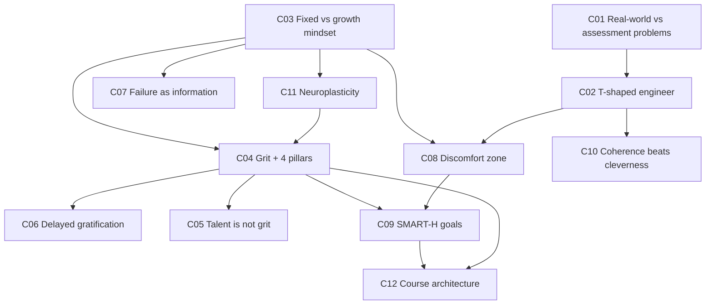
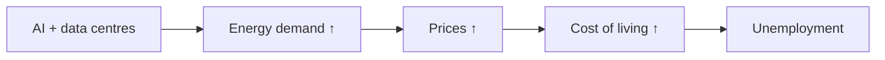
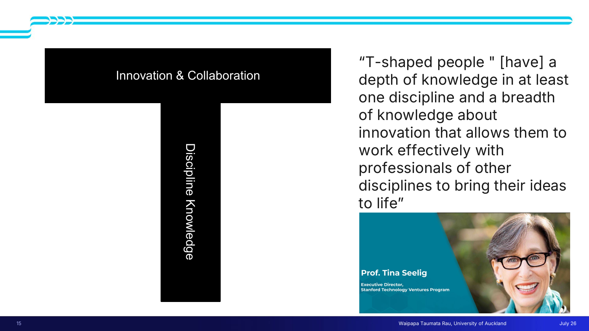
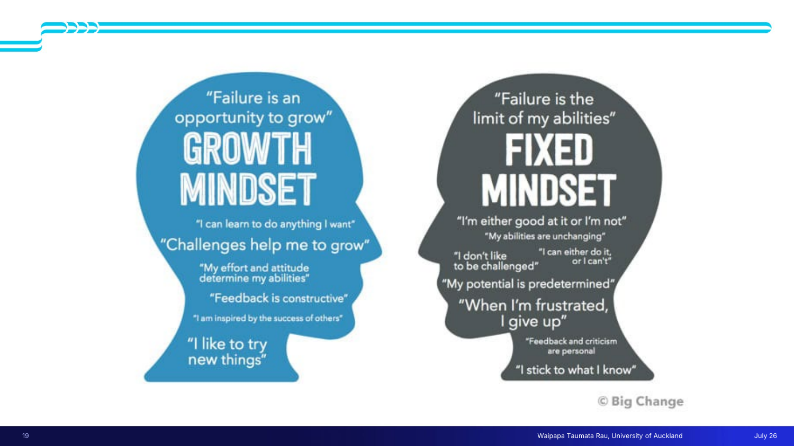
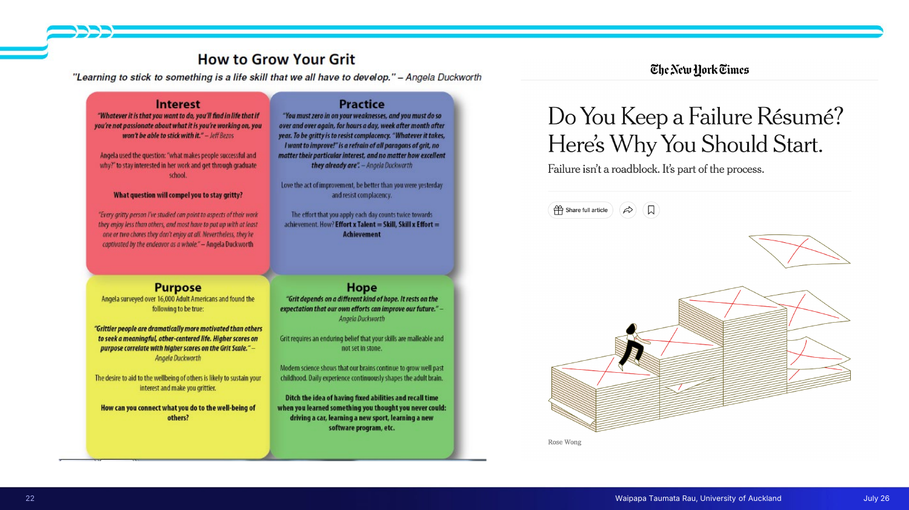
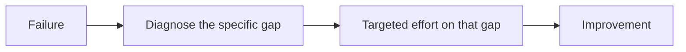
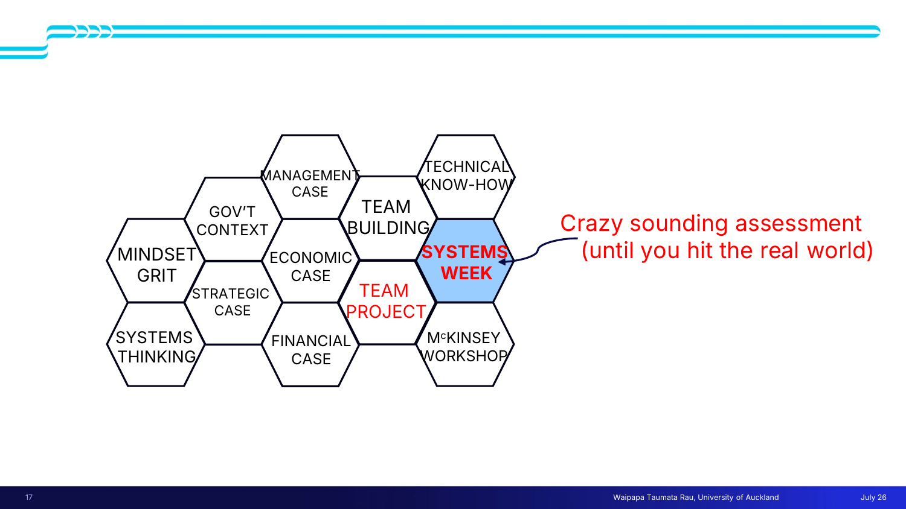
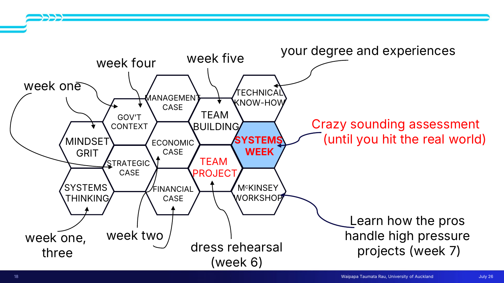
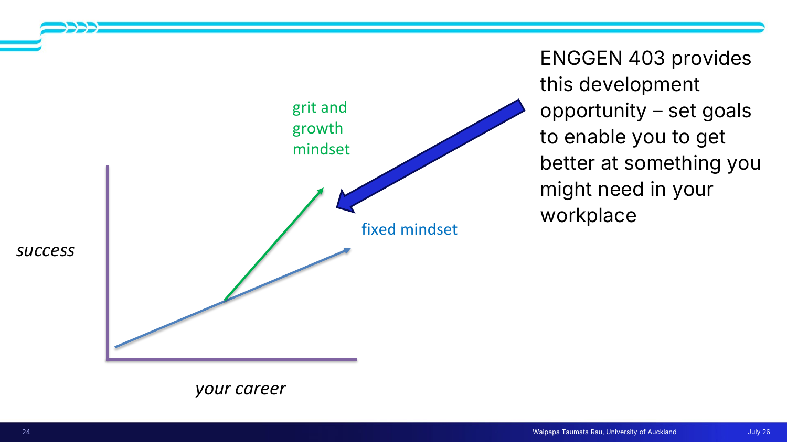

# 📘 Lecture 1 — What can ENGGEN 403 do for me?

> [!abstract] Why this matters
> After this lecture you can name the difference between a **fixed** and a **growth** mindset and spot which one you're operating from in a given moment; define **grit** and break it into its four components; and set a goal that is deliberately *hard* rather than safely achievable.
>
> Those are the lecture's three stated learning outcomes, and they are the raw material for the individual goal-setting assignment.

> [!info] Sources
> **Slides:** `ENGGEN403_Lecture_01_2026.pdf` — 25 pages, text layer present (not scanned).
> **Transcript:** 378 lines, auto-generated, quality good.
> **Figures below are extracted from the slides themselves** — see `notes/figures/`.
>
> *Prerequisites: none. This is Lecture 1.*

> [!tip]- Revision order (click to expand)
> Fastest path if you're short on time: **[[#🧠 L1-C03 Fixed mindset vs growth mindset|C03]] → [[#💪 L1-C04 Grit and its four pillars|C04]] → [[#🎯 L1-C09 SMART goals and the argument for making them hard|C09]]**. Those three are the named learning outcomes plus the assignment. Everything else is scaffolding around them.

## 🗺 Concept map

---

## 🌍 L1-C01 · Real-world problems vs assessment problems

> [!question] Cue questions
> - What specifically distinguishes a real-world problem from a problem set in a course?
> - Why does that distinction change what skills you need?

### In plain language

Every problem you've been given at university arrived pre-chewed. Someone decided what the question was, checked it had an answer, and sized it so a student could finish it. Real problems arrive raw: nobody has decided what the question is, and some of them simply have no solution. That's not a flaw in the problem — it's the normal condition.

### Precisely

The distinguishing criterion: real-world problems *"haven't been nicely framed and put into an assessment format that gives you a challenge that's a solvable problem."*

Two consequences follow:

1. **Framing the problem becomes part of the work**, rather than a given.
2. **Solvability is not guaranteed.**

Examples raised from the room, with the causal chain the lecturer drew:

> [!important] The point of that chain
> These problems are **interconnected** — which is the hook into systems thinking in Lecture 2. And it's why *"engineering alone is not going to solve all those."* Technical skill is necessary and insufficient.

> [!warning] Common traps
> - Treating "no clean solution exists" as a sign you've misunderstood the problem. Sometimes it just means the problem is real.
> - Assuming the problem statement you're handed *is* the problem. The interconnection above is why it usually isn't.

*📄 Source: slides p.2 · transcript — opening section*

---

## 🔤 L1-C02 · The T-shaped engineer

> [!question] Cue questions
> - Draw the T. What does the vertical stroke represent? The horizontal?
> - Why is "more engineering" not the answer to needing better engineers?
> - Who is the quote attributed to?

### In plain language

Picture the letter **T**. The long vertical stroke is how deep you go in one subject — your actual discipline, the thing you're expert in. The short horizontal bar across the top is how wide you reach across other disciplines: enough breadth to talk to people who aren't you and get an idea built.

A pure specialist is a vertical line with no bar — brilliant and unable to ship anything that needs other people. **The bar is what this course adds.**

### Precisely

> [!quote] Prof. Tina Seelig — Executive Director, Stanford Technology Ventures Program
> "T-shaped people [have] a depth of knowledge in at least one discipline and a breadth of knowledge about innovation that allows them to work effectively with professionals of other disciplines to bring their ideas to life."

| Stroke | Slide label | What it is |
|---|---|---|
| **Vertical (depth)** | Discipline Knowledge | What your degree already gave you |
| **Horizontal (breadth)** | Innovation & Collaboration | Knowing when to step forward, when to step back, and whose ideas to rely on |

### The supporting argument

Richard Miller, US National Academy of Engineering:

- Teaching engineering fundamentals *"is important, but it's not enough."*
- The planet's Grand Challenges need engineering expertise *"but they won't be solved by engineers alone."*
- Critically: **"Doubling down on even more hard sciences and math will not help."**
- What's required: both a **skillset** *and* a **mindset**.

> [!note] Professional accreditation
> These skills are embedded in professional degrees internationally. Via **Engineering New Zealand**'s participation in the **Washington Accord**, they form part of being signed off as a professional engineer — described as *"a critical path"* to that sign-off.

> [!example] Worked example — the lecturer as her own case
> She trained in chemistry, drifted to biology, knows a lot about proteins, and spent 2018–2024 as the Prime Minister's Chief Science Advisor.
>
> Her reading of it: *"None of that helped me in the Chief Science Advisor role. What helped me was all the soft skills."*
>
> The deep stroke got her the credibility to be in the room; **the horizontal bar was what the job actually consumed.**

> [!warning] Common traps
> - Reading "T-shaped" as **generalist**. It isn't — the deep stroke is mandatory. Breadth with no depth is a *dash*, not a T.
> - Assuming breadth means learning other disciplines' technical content. The quote says breadth *"about innovation… to work effectively with professionals of other disciplines"* — the ability to **work with** them, not to **be** them.

*📄 Source: slides p.15–16 · transcript — T-shaped section*

---

## 🧠 L1-C03 · Fixed mindset vs growth mindset

> [!danger] `priority: high` — a named learning outcome on slide 14

> [!question] Cue questions
> - Who developed this, and what exactly is claimed to be fixed or growable?
> - Name five situations where the two mindsets produce opposite behaviour.
> - Is a person "a fixed-mindset person"? Why is that phrasing wrong?

### In plain language

Two ways of answering the question *"can I get better at this?"*

One says your ability is basically the amount you were issued at birth — so effort is just evidence you weren't issued much, and criticism is an insult. The other says ability is what practice builds — so effort is the mechanism and criticism is free information.

**The catch:** these aren't two boxes people live in. It's a sliding scale, and you sit at different points on it for different skills.

### Precisely

Attributed to **Carol Dweck**, who *"uses the term mindset to describe the way people think about ability and talent."* The two mindsets *"exist on a continuum"* — stressed twice in the lecture: **"These are not either or. This is a continuum."**

- **Fixed mindset** — abilities are innate and unchangeable.
- **Growth mindset** — ability is *"something you can improve through practice."*

### The contrast, dimension by dimension

| Dimension | 🔒 Fixed mindset | 🌱 Growth mindset |
|---|---|---|
| **Failure** | Viewed as permanent | A chance to learn, and even to pivot |
| **Critical feedback** | Received as a personal attack | A chance to improve, develop new systems |
| **Task choice** | Easier tasks, minimal effort | Embraces challenge, works hard to improve |
| **Obstacles** | Likely to give up | A chance to experiment and problem-solve |
| **Focus** | Measurable accomplishments | The journey of continual improvement |
| **Creative risk** | Less likely to take it | A way to innovate and improve |

> [!quote]- The self-talk, verbatim from slide 19 (click to expand)
> **🌱 Growth mindset**
> - "Failure is an opportunity to grow"
> - "I can learn to do anything I want"
> - "Challenges help me to grow"
> - "My effort and attitude determine my abilities"
> - "Feedback is constructive"
> - "I am inspired by the success of others"
> - "I like to try new things"
>
> **🔒 Fixed mindset**
> - "Failure is the limit of my abilities"
> - "I'm either good at it or I'm not"
> - "My abilities are unchanging"
> - "I don't like to be challenged"
> - "I can either do it, or I can't"
> - "My potential is predetermined"
> - "When I'm frustrated, I give up"
> - "Feedback and criticism are personal"
> - "I stick to what I know"

> [!important] Why the fixed mindset is sticky
> Its logic is **internally consistent**: *"if talent is fixed, why bother improving? Why even try?"* You don't argue someone out of it by telling them to try harder — trying harder is precisely what the belief rules out.

> [!note] Limits — she named them herself
> She called some growth-mindset material *"a bit self-help guide, cheesy in places"* and said *"there is obviously a limit."*
>
> - **The ceiling that was real:** at 14 she bought figure skates, is *"possibly the most uncoordinated person I know,"* and never became a figure skater.
> - **The ceiling that wasn't:** finishing her PhD she hated public speaking, left academia partly because of it, realised she wanted an academic career after all, and got over it.
>
> So: some ceilings are real, and most of the ones you assume are real aren't. Distinguishing them is the skill.

> [!warning] Common traps
> - **Treating it as a personality type.** "I'm a growth-mindset person" is a category error — it's a continuum, and it's **per-skill**. Slide 14's outcome is deliberately worded *"identify **some areas** in which you have a fixed mindset."*
> - Hearing it as "anyone can do anything." Pre-empted by the figure-skating example.
> - Collapsing it into positive thinking. The claim is about beliefs regarding the **malleability of ability**, not about optimism — that's a grit pillar ([[#💪 L1-C04 Grit and its four pillars|C04]]).

*📄 Source: slides p.14, 19, 23 · transcript — Dweck video and surrounding commentary*

---

## 🔬 L1-C11 · Neuroplasticity — the biological basis

> [!question] Cue questions
> - What physical mechanism is offered to support growth mindset?
> - What everyday example illustrates it?

### In plain language

Learning new things physically rewires your brain. This isn't a metaphor and it doesn't stop when you finish growing up.

### Precisely

The lecturer explicitly pushed back on growth mindset being pop-psychology by grounding it biologically:

- Forcing yourself to learn new things — *"especially as you get older"* — builds **new neural pathways**.
- This is **neuroplasticity**.
- **Illustration:** it's the mechanism behind a stroke patient's slow recovery — *"that's happening in healthy brains all the time."*
- **Claim:** trying new things makes the brain *"more resilient and more useful."*

The grit slide restates this independently: *"Modern science shows that our brains continue to grow well past childhood. Daily experience continuously shapes the adult brain."*

> [!tip] Why this matters for the exam
> It's the bridge between [[#🧠 L1-C03 Fixed mindset vs growth mindset|C03]] and [[#💪 L1-C04 Grit and its four pillars|C04]] — the hope pillar of grit *requires* believing skills are malleable, and neuroplasticity is the stated reason that belief is warranted rather than merely motivating.

*📄 Source: transcript — Dweck section · slides p.22 (Hope panel)*

---

## 💪 L1-C04 · Grit and its four pillars

> [!danger] `priority: high` — a named learning outcome on slide 14

> [!question] Cue questions
> - Give the two-part definition of grit. What does the *time clause* add?
> - List the four pillars, and the reflective question attached to each.
> - State Duckworth's two equations.

### In plain language

Grit is caring about something enough to keep going long after it stopped being fun. It needs **both** halves: wanting it badly (passion) and continuing anyway (perseverance), sustained over a long stretch.

Enthusiasm that burns out in three weeks isn't grit. Grinding at something you don't care about isn't either.

### Precisely

Attributed to **Angela Duckworth** (author of *Grit*).

> [!quote] Slide 21 definition
> To succeed you need **passion and perseverance for your goals, over a sustained period of time.**

> [!quote] Slide 22 header
> "Learning to stick to something is a life skill that we all have to develop." — Angela Duckworth

> [!important] The time clause is load-bearing
> It's what separates grit from motivation. Delete *"over a sustained period of time"* and you've described a burst of enthusiasm.

### The four pillars

> [!example]- 🔴 1. Interest — *"What question will compel you to stay gritty?"*
> > "Whatever it is that you want to do, you'll find in life that if you're not passionate about what it is you're working on, you won't be able to stick with it." — **Jeff Bezos**
>
> Duckworth used the question *"what makes people successful and why?"* to stay interested in her work and get through graduate school.
>
> > "Every gritty person I've studied can point to aspects of their work they enjoy less than others, and most have to put up with at least one or two chores they don't enjoy at all. Nevertheless, they're captivated by the endeavor **as a whole**." — Angela Duckworth
>
> **Note the nuance:** interest doesn't mean enjoying every part. It means the whole thing holds you.

> [!example]- 🔵 2. Practice — deliberate, and aimed at weakness
> > "You must zero in on your weaknesses, and you must do so over and over again, for hours a day, week after month after year. To be gritty is to resist complacency. 'Whatever it takes, I want to improve!' is a refrain of all paragons of grit, no matter their particular interest, and no matter how excellent they already are." — Angela Duckworth
>
> *"Love the act of improvement, be better than you were yesterday and resist complacency."*
>
> **The two equations — effort counts twice:**
>
> $$\text{Effort} \times \text{Talent} = \text{Skill}$$
> $$\text{Skill} \times \text{Effort} = \text{Achievement}$$
>
> Effort appears in both, which is the whole argument: it builds the skill *and* converts the skill into achievement. Talent appears once.

> [!example]- 🟡 3. Purpose — *"How can you connect what you do to the well-being of others?"*
> Duckworth surveyed **over 16,000 adult Americans** and found:
>
> > "Grittier people are dramatically more motivated than others to seek a meaningful, other-centered life. Higher scores on purpose correlate with higher scores on the **Grit Scale**." — Angela Duckworth
>
> *"The desire to aid the wellbeing of others is likely to sustain your interest and make you grittier."*
>
> **Note:** purpose here is specifically *other-centred*, not just "having a goal."

> [!example]- 🟢 4. Hope — a specific kind, not general optimism
> > "Grit depends on a **different kind of hope**. It rests on the expectation that **our own efforts can improve our future**." — Angela Duckworth
>
> *"Grit requires an enduring belief that your skills are malleable and not set in stone."*
> *"Modern science shows that our brains continue to grow well past childhood."*
>
> **The exercise given:** *"Ditch the idea of having fixed abilities and recall a time when you learned something you thought you never could: driving a car, learning a new sport, learning a new software program."*
>
> ⚠️ This pillar is **not** "things will work out." It's "**my effort** will change how things work out" — agency, not optimism. That distinction is highly quizzable.

### Consequences (slide 23)

- Perseverance, resilience, mental toughness and determination → success in achieving life goals.
- People with high grit *"are better able to find solutions when problems and challenges arise."*

> [!example] Worked example — the hope curve
> Observed in Systems Week: teams *"come in all excited and ready to go,"* and *"by about Wednesday afternoon there's a little bit of despair creeping in."*
>
> That dip is where the pillars get tested — specifically **hope**, when everyone is tired, short of sleep, and the end isn't visible. Note it maps pillar 4 onto an observable moment rather than leaving it abstract.

> [!warning] Common traps
> - Reducing grit to perseverance. Drop **passion** → stubbornness. Drop the **time clause** → a burst of effort.
> - Treating practice as repetition. The word is **deliberate**, and it's aimed at *weaknesses*.
> - Reading hope as optimism. It's about the efficacy of your own effort.

*📄 Source: slides p.21–23 · transcript — grit section*

---

## ⚖️ L1-C05 · Talent is not grit — and may be inversely related

> [!question] Cue questions
> - What's the claimed relationship, and what's the proposed mechanism?

### In plain language

Being good at things early can cost you the ability to keep going when you're bad at something — because you never had to build it.

### Precisely

> [!quote] Slide 21
> "Having talent doesn't mean you have grit — they are unrelated, maybe inversely related."

**Proposed mechanism:** *"talented people have always found things easy and they haven't learnt to fail, and they haven't come up with the kind of perseverance tools to make themselves try and do something that's difficult."*

Two consequences drawn:
1. Some **less** talented people are likely to have **more** grit.
2. Grit *"is something that you can really work on"* — trainable, not a fixed endowment.

> [!tip] Notice the self-reference
> Claim 2 is itself a **growth-mindset claim about grit**. If grit were fixed, the whole lecture would be pointless.

> [!warning] Common trap
> Overstating this as "talent makes you worse." The primary claim is **unrelated**; the inverse relation is hedged (*"maybe"*, *"in some studies"*).

*📄 Source: slides p.21 · transcript — grit section*

---

## 🍬 L1-C06 · Delayed gratification as a predictor

> [!question] Cue questions
> - Describe the marshmallow test. What does it actually measure?
> - What's the stated caveat?

### In plain language

Put a four-year-old alone with a marshmallow and tell them: don't eat it until I come back, and you'll get two. Whether they wait predicts a surprising amount about later life. What's measured isn't willpower about sweets — it's whether you can hold out for a bigger prize.

### Precisely

Slide 23: *"Ability to delay instant gratification in favour of long-term success."*

Linked in the lecture to the **Dunedin study** — a New Zealand longitudinal study following a cohort born (in her recollection) ~52 years ago, assessed every year. The **marshmallow test** was reported as *"one of the best predictors of overall career success later in life."*

**What it measures:** *"that impulse control, that willingness to really strive for a bigger goal."*

**Her own caveat:** it's *"also a predictor of people who don't like marshmallows. But all tests have their flaws."* — a genuine methodological point: the measure conflates the trait with a preference for the reward.

> [!bug] ⚠ Thin — spoken only, and hedged
> The 52-year figure was prefaced with *"I think."* More importantly, **the marshmallow test is not part of the Dunedin study** — it's Mischel's, at Stanford. The lecture presents them together.
>
> **If this appears in assessment, use the slide's wording** (delayed gratification → long-term success) rather than the study attribution. Logged as a question for the lecturer in `context/admin-and-dates.md`.

*📄 Source: slides p.23 · transcript — punchlines section*

---

## 🔁 L1-C07 · Failure as information

> [!question] Cue questions
> - What three-step sequence turns failure into improvement?
> - What's the argued benefit of failing *earlier*?

### In plain language

Failure is data about where you're weak. That only helps if you look at it instead of flinching away. And there's a timing argument: the first serious failure of your life is much easier to absorb at 22 than at 50, because by 50 you've built an identity that assumes it doesn't happen.

### Precisely

The framing: for many people failure is *"upsetting, damaging to their self-esteem, something that they'd rather forget about and not reflect on, but actually thinking about **why** you fail and **when** you fail can be one of the best ways to get better professionally."*

> [!example] Worked example — her own
> Applying for a university lectureship, she **failed three times** and got it on the fourth.
>
> Her account of the mechanism: *"each time I learnt from the experience, I could see where my weak spots were and I tried harder to fill those gaps."*

**The sequence that matters:**

That's what distinguishes *learning from* failure from merely *surviving* it.

**The timing argument:** *"the earlier you fail, the more resilient you might end up being in the long term."* Observation: people who hit their first failure at 45–55 *"find it much harder than people that set ambitious goals and failed a bit earlier and bounced back."*

> [!note] The failure résumé
> Slide 22 carries a New York Times headline alongside the grit panels:
> **"Do You Keep a Failure Résumé? Here's Why You Should Start."** — *"Failure isn't a roadblock. It's part of the process."*
>
> Same claim, made operational: write the failures down deliberately, the way you'd write down accomplishments.

This is the same claim as the **failure dimension** of [[#🧠 L1-C03 Fixed mindset vs growth mindset|C03]] — permanent verdict vs chance to learn — with an added claim about **when** the practice should happen.

*📄 Source: transcript — grit and failure section · slides p.22–23*

---

## 🎢 L1-C08 · The discomfort zone — where learning actually happens

> [!danger] `priority: high` — this is the stated design rationale for the entire course

> [!question] Cue questions
> - Sketch the three difficulty bands and say what happens in each.
> - Why does this justify a course design that feels unpleasant?

### In plain language

Three bands. **Too easy:** you complete it and learn nothing. **Too hard:** you can't do it, so you also learn nothing. **In between** — hard enough to be uncomfortable, not so hard you're stuck — is the only band where you actually grow.

The discomfort isn't a side effect of learning. It's the signal you're in the right band.

### Precisely

> [!quote] The lecturer
> "If something's easy and you do it, you don't learn anything. If something's hard, you can't do it. So it's hard to learn anything… when it's just hard enough but not too hard. That's when you can actually start to learn."

| Band | What happens | Learning |
|---|---|---|
| Too easy | You complete it | ❌ None |
| **Just hard enough** | **Uncomfortable, but possible** | ✅ **Growth** |
| Too hard | You can't do it | ❌ None |

The term comes from a student's end-of-course reflection, quoted approvingly:

> [!quote] Student reflection, slide 8
> "Professional growth often happens in the **discomfort zone** and when we take **small but deliberate actions to change ingrained habits**."

**Design rationale, stated outright:** *"when you're feeling uncomfortable learning those skills, that's when you're actually learning the most,"* and of Systems Week, *"because it's so hard and so challenging, that's why you get to learn a lot."*

> [!warning] Common traps
> - Reading it as "harder is always better." The upper band is explicitly a failure mode too.
> - Assuming discomfort alone certifies learning. The student quote pairs it with *"small but deliberate actions"* — the discomfort has to be attached to a specific habit you're changing.

*📄 Source: transcript — opening and reflections sections · slides p.8*

---

## 🎯 L1-C09 · SMART goals, and the argument for making them hard

> [!danger] `priority: high` — directly load-bearing for the goal-setting assignment

> [!question] Cue questions
> - Expand SMART. What letter does the lecturer want to add, and why does it cut against one of the existing letters?

### In plain language

The standard recipe for a goal you can actually check: say exactly what it is, how you'd measure it, that it's doable, that it's worth doing, and by when. The twist here is that *"achievable"* quietly encourages you to aim low — so she wants an **H for hard** bolted on.

### Precisely

| Letter | Meaning |
|---|---|
| **S** | Specific |
| **M** | Measurable |
| **A** | Achievable |
| **R** | Relevant |
| **T** | Time-bound — *"by Friday, or by the end of the course — you won't leave it open ended"* |
| **H** | **Hard** ← proposed addition |

> [!quote] The proposal
> "I'm thinking of putting an **H** there to make them SMART**H** goals, because what this lecture is all about is trying to persuade you to push yourself to do really stretchy, ambitious goals."

> [!important] The tension is the point
> **Achievable** and **Hard** pull against each other. The entire lecture — mindset ([[#🧠 L1-C03 Fixed mindset vs growth mindset|C03]]), grit ([[#💪 L1-C04 Grit and its four pillars|C04]]), the discomfort zone ([[#🎢 L1-C08 The discomfort zone — where learning actually happens|C08]]) — is an argument for resolving that tension toward **Hard**.
>
> A goal you're confident of meeting sits in the "too easy" band, where nothing is learned.

> [!warning] Common trap
> Setting a goal you already know you'll hit. Given everything else in this lecture, that's optimising for the wrong thing.

*📄 Source: transcript — goal-setting section. See `context/admin-and-dates.md` for how this assignment is actually marked.*

---

## 🧩 L1-C10 · Coherence beats cleverness

> [!question] Cue questions
> - What does a decision-maker do when parts of a submission don't line up?
> - What does this imply about how to spend the last day of a team project?

### In plain language

If the different sections of a team's report tell slightly different stories, the reader stops evaluating your recommendation and starts picking at the inconsistencies. A merely-good report that hangs together beats a report of brilliant, mutually contradictory parts.

### Precisely

> [!quote] Student reflection, slide 10
> **"Lesson 1: Coherence beats cleverness.**
> A solution only gains credibility when the **strategic case, options analysis, CBA metrics, and rollout plan** tell the same story; otherwise decision-makers fixate on inconsistencies.
> **Lesson 2: Evidence is a team sport."**

**Endorsement:** teams discover that *"making sure all the bits of the project are coherent and tell the same story is much more important for nailing those good grades than having each individual bit be brilliant in its own right."*

Metaphor used: your piece has to produce *"an overall jigsaw that makes sense to the reader, in this case, the government."*

> [!tip] Watch those four artefacts
> **Strategic case · options analysis · CBA metrics · rollout plan** are the components you'll actually produce later in the course. Coherence is a property **across** them — so it can only be checked by someone looking at the whole. That's an argument for someone owning the whole.

> [!note] Related, from the same set of reflections
> - Communication style is an **input** to system success, not a soft extra — one student identified their own style as *"creating a negative feedback loop."*
> - *"You can have the brainiest 30 people in your team, but if they don't talk to each other, you won't get a good result."*
>
> Both use systems vocabulary (inputs, feedback loops) applied to teams, before that vocabulary has been taught. Expect it formalised in Lecture 2.

*📄 Source: slides p.9–10 · transcript — reflections section*

---

## 🏗 L1-C12 · How the course assembles — the honeycomb

> [!question] Cue questions
> - What sits at the centre of the honeycomb, and why is *adjacency* meaningful?
> - Which cell comes from outside the course entirely?

### In plain language

The course is drawn as a honeycomb of twelve tiles. Each tile is a capability. They're packed together so that the two assessments — **Team Project** and **Systems Week** — sit surrounded by the tiles that feed them. You don't get sent into Systems Week cold; you collect the surrounding tiles first.

### Precisely

**Twelve cells:**

| Cell | Note |
|---|---|
| Mindset · Grit | This lecture |
| Systems Thinking | |
| Gov't Context | |
| Strategic Case | |
| Economic Case | |
| Financial Case | |
| Management Case | |
| Team Building | |
| Technical Know-How | **From your degree, not taught here** |
| **Team Project** | 🔴 assessment — the rehearsal |
| **Systems Week** | 🔵 assessment — *"Crazy sounding assessment (until you hit the real world)"* |
| McKinsey Workshop | *"Learn how the pros handle high pressure projects"* |

### When each tile arrives

| Timing | Component |
|---|---|
| Week 1 | Mindset · Grit |
| Weeks 1 & 3 | Systems Thinking |
| Week 2 | Strategic / Economic / Financial cases |
| Week 4 | Gov't Context · Management Case |
| Week 5 | Team Building |
| Week 6 | **Team Project** — *"dress rehearsal"* |
| Week 7 | **Systems Week** + McKinsey Workshop |
| — | Technical Know-How — *"your degree and experiences"* |

> [!important] The honeycomb is an argument, not decoration
> Two things it encodes that the bullet list doesn't:
> 1. **Technical Know-How is a tile like any other** — the same size as Mindset or Team Building. That's the [[#🔤 L1-C02 The T-shaped engineer|T-shape]] claim rendered visually: your discipline is *one* of twelve, not the foundation the rest sit on.
> 2. **Team Project sits adjacent to Systems Week.** The rehearsal is deliberately placed next to the real thing, and both are surrounded by the capability tiles. This is the [[#🎢 L1-C08 The discomfort zone — where learning actually happens|discomfort zone]] made into a timetable — *"we don't just send you in at the deep end. We give you a practice."*

> [!warning] Common trap
> Reading the honeycomb left-to-right as a strict sequence. Week annotations jump around (Systems Thinking is weeks 1 *and* 3), and Technical Know-How has no week at all.

*📄 Source: slides p.17–18 · transcript — course structure section*

---

## 📈 The closing argument

The final slide plots **success** (y) against **your career** (x).

- **Fixed mindset** — a shallow straight line. *"You're all smart cookies. You're all going to have a great career."* The fixed line still goes **up**. Nobody is being told they'll fail.
- **Grit and growth mindset** — branches **off** the fixed line partway along and climbs steeply.

> [!important] Read the branch point, not the lines
> The two lines share their origin and separate later. The claim isn't "growth-mindset people start ahead" — it's that **the divergence happens at a moment**, and the arrow labels that moment as this course:
>
> > "ENGGEN 403 provides this development opportunity — set goals to enable you to get better at something you might need in your workplace."
>
> This is why the goal-setting assignment exists, and it ties [[#🎯 L1-C09 SMART goals and the argument for making them hard|C09]] back to [[#🧠 L1-C03 Fixed mindset vs growth mindset|C03]] and [[#💪 L1-C04 Grit and its four pillars|C04]] in one picture.

*📄 Source: slides p.24*

---

## ✅ Summary — the 7 things that matter

1. **Real problems aren't pre-framed and may not be solvable** — framing is part of the work; engineering alone won't close them.
2. **T-shaped = deep in one discipline, broad enough to work across others** (Tina Seelig). Both strokes required; more hard science does not substitute for the bar.
3. **Fixed vs growth mindset is a continuum, per-skill, about whether ability is malleable** — changing behaviour on failure, feedback, task choice, obstacles, focus, and risk. Grounded in **neuroplasticity**.
4. **Grit = passion + perseverance, sustained over time**, on four pillars: interest, deliberate practice, other-centred purpose, and hope-as-agency. **Effort × Talent = Skill; Skill × Effort = Achievement** — effort counts twice.
5. **Talent doesn't supply grit** and may work against it; grit is trainable.
6. **Learning happens in the discomfort zone** — between too easy and too hard. Discomfort is the signal, not the cost.
7. **Coherence beats cleverness** — a consistent story across all parts outranks brilliance in any one part.

---

## 🧪 Self-test

> [!question]- 12 free-recall questions (answers deliberately not in this file)
> 1. State the criterion distinguishing a real-world problem from an assessment problem, and one consequence for how you'd start work.
> 2. Draw the T and label both strokes. What is a person with only the horizontal stroke missing?
> 3. Richard Miller says doubling down on hard sciences "will not help." Reconstruct his argument in three steps.
> 4. Two engineers fail a design review. One rewrites their approach; the other concludes they're not cut out for the work. Map each onto the continuum and name the specific dimension separating them.
> 5. Why is "I have a growth mindset" a category error? Two reasons.
> 6. Give grit's full definition. Delete the time clause — what are you now describing?
> 7. State both Duckworth equations. What does it mean that effort appears in both?
> 8. Name the four pillars and the reflective question attached to each.
> 9. Why is the hope pillar *not* general optimism? What is it instead?
> 10. Explain the mechanism by which talent might *reduce* grit.
> 11. A teammate proposes a goal they're 95% confident of hitting. Argue against it using at least two concepts from this lecture.
> 12. In the honeycomb, Technical Know-How is the same size as every other tile. What claim is that making?

---

> [!info]- Related notes
> - `L1-summary.md` — one page, dense, for the night before
> - `L1-flashcards.tsv` — 60 Anki-importable cards
> - `../context/admin-and-dates.md` — deadlines, weightings, teaching team (never quizzable)
> - `../../course-context/syllabus-map.md` — how L1 feeds L2 and L3
