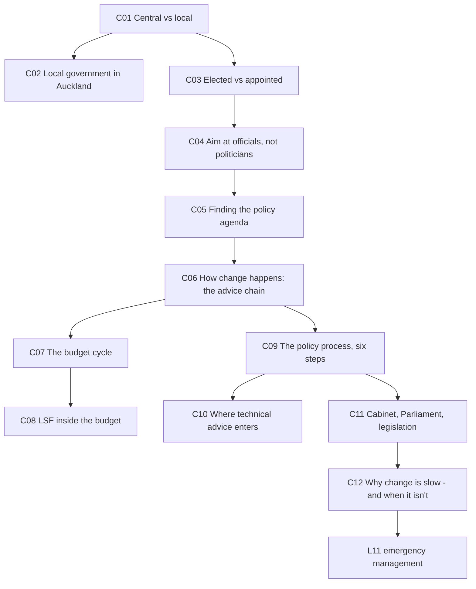
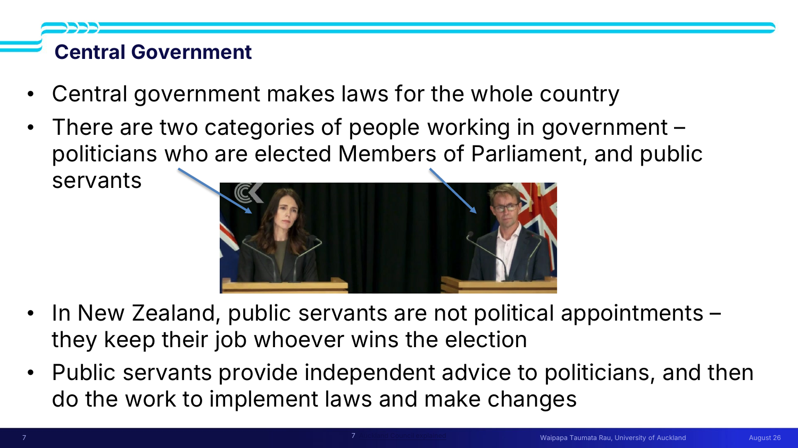
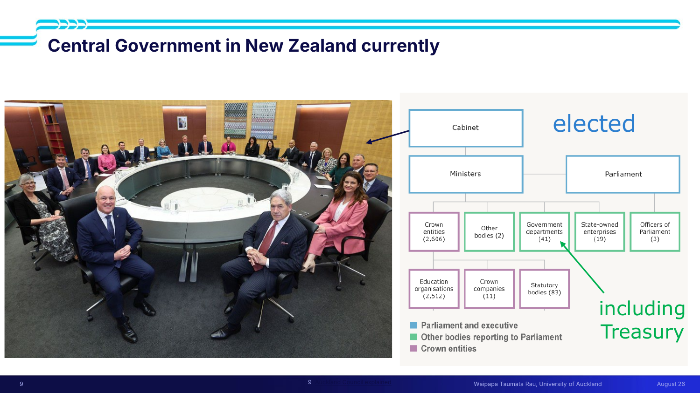
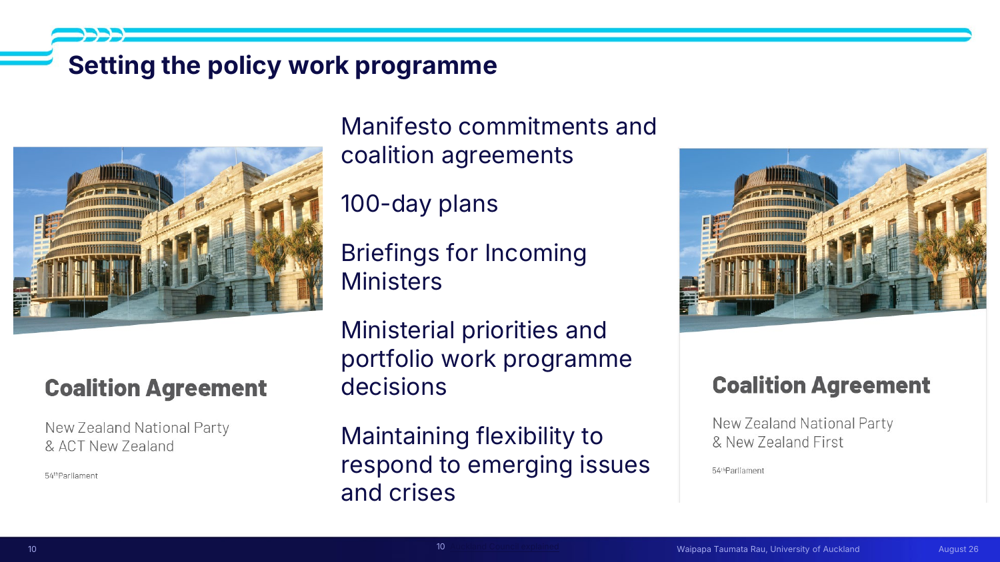
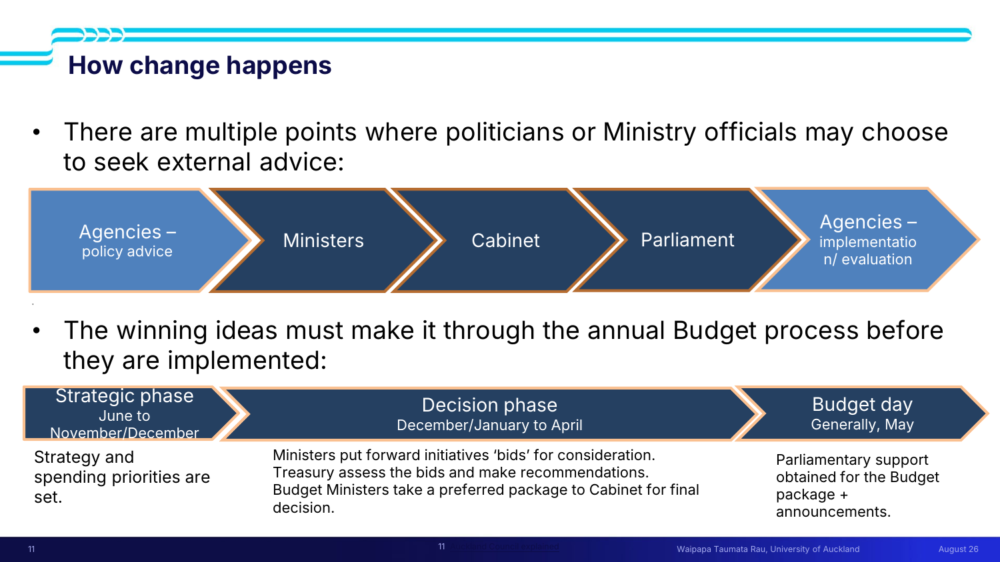
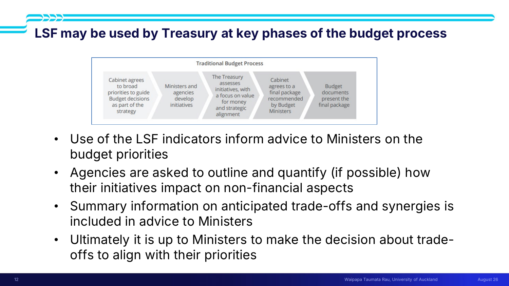
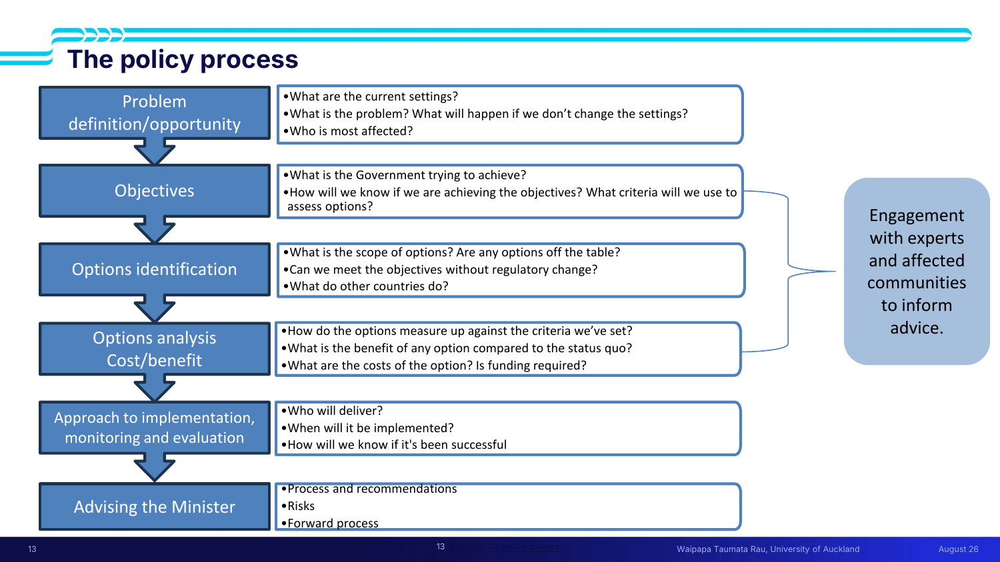
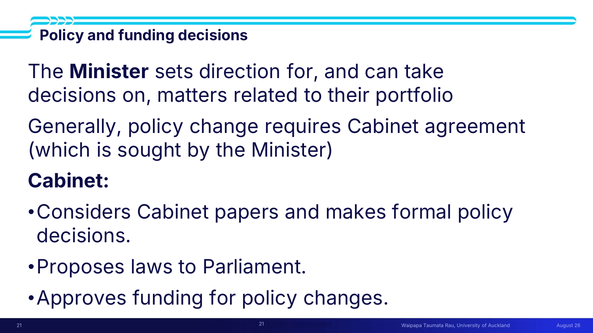
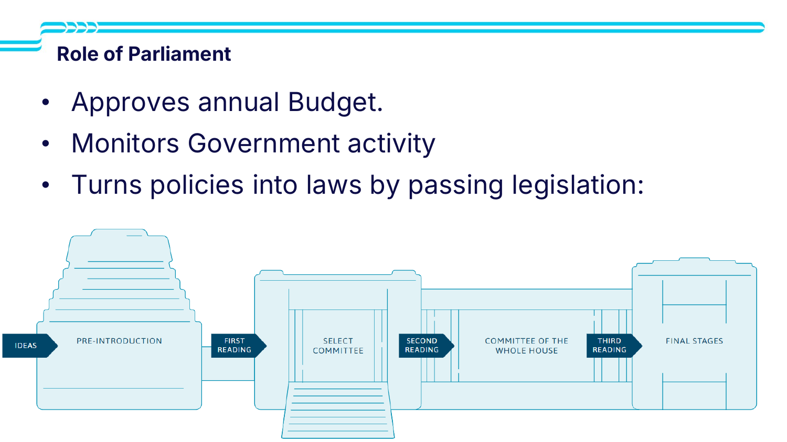
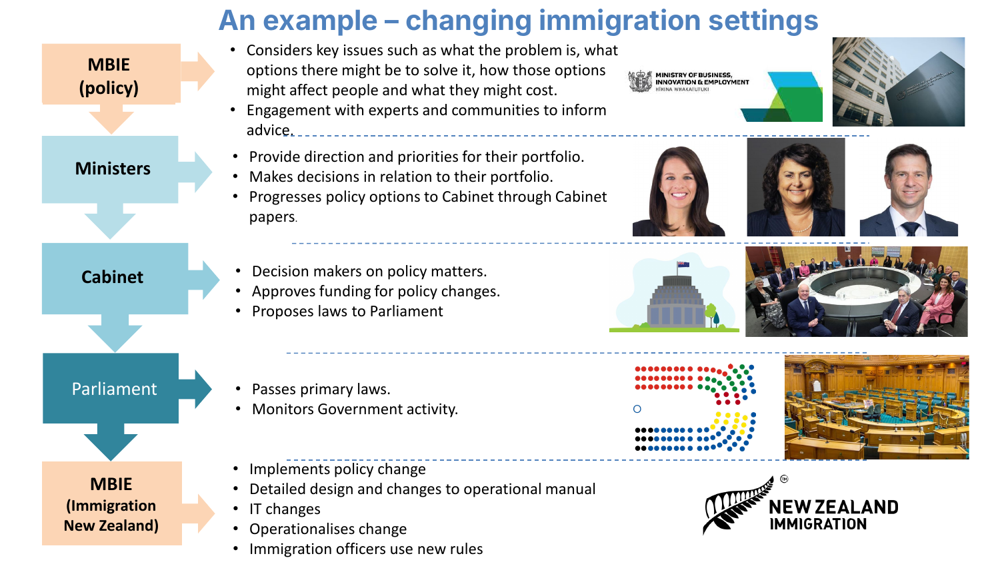

# 🏛 Lecture 10 — Machinery of government

> [!abstract] Why this matters
> Deferred to from [[../../Lecture6/notes/L6-notes|L6]] and [[../../Lecture7/notes/L7-notes|L7]], and it answers the question both left open: **when your recommendation says "government should do X", who exactly is that?**
>
> Juliet's reason for the lecture, in one sentence: *"What we don't want is to find teams' projects that say **'governments should do this. Government is the stakeholder'** — because government is much, much more complex than that."*
>
> It is also the setup for [[../../Lecture11/notes/L11-notes|L11]]: everything here describes how change happens **slowly**, and Thursday's guest lecture describes what happens when it can't.

> [!info] Sources
> **Slides:** `ENGGEN 403 Lecture 10 2026.pdf` — 33 pages. **Juliet Gerrard**, 11 August 2026.
> **Transcript:** auto-generated, ~8,150 words. Quality good.
> **Supplementary handouts:** `How government works _ New Zealand Government.pdf` (3 pp) · `Auckland Council explained.pdf` (5 pp).
>
> *Prerequisites: [[../../Lecture3/notes/L3-notes|L3]] — the evidence/policy/politics slide reappears verbatim. [[../../Lecture6/notes/L6-notes|L6]] — the budget and the Living Standards Framework. [[../../Lecture7/notes/L7-notes|L7]] — decomposing government as a stakeholder.*

> [!quote] Stated learning outcomes (slide 2)
> - **Explain the difference between central and local government in New Zealand**
> - **Understand the basics of how decisions are made in government**
> - **Appreciate where in the policy process technical expertise is required**
> - **Understand that government is a complex system of systems and that changes in and from this system generally happen slowly**

> [!important] ⭐ The sentence that justifies the whole lecture
> > *"**You can't just pull one lever marked 'government'.** You have to know **which part of which ministry** is advising **which minister** to advocate in **cabinet** to make **which decision** — and how those decisions might impact **locally**, and how **local government** might respond to them."*

## 🗺 Concept map



---

## 🗺 L10-C01 · Central vs local government

> [!question] Cue questions
> - What does each level do?
> - Why do systems problems cut across both, and where does the tension come from?
> - Name the three local government structures.

> [!quote] Slide 4
> - New Zealand has **both local and central governments** — **many systems problems cut across both forms of government**
> - **Central government makes laws for the whole country**
> - **Local government makes local decisions** (e.g. on local amenities, environments)
> - There are **Regional Councils, Territorial Authorities or Councils, Unitary Authorities** *(don't worry about the details of these)*
> - In Auckland, we have a **Unitary Authority, with an elected Mayor**
> - **The Mayor chairs Auckland Council**
> - There are **21 local boards** that report to Auckland Council

> [!important] ⭐ Why every systems problem needs both
> *"If you think about **plastics**, if you think about **food security** — you need government at the central level to make some decisions, set some broad policy. **But then you need something to happen on the ground.** You need local government to **enact** those policies, to **resource** those policies, to **do the recycling** of the plastic, to **resource the food banks**."*

> [!warning] The interface is a boundary condition
> *"There's often some **tension** between what's good for the whole country coming out of Wellington and what's good locally. It might be good for central government to say **we've slashed budgets, we're saving money**. It might be good for local government to say **we're investing extra in local amenities** like libraries and parks."*
>
> > *"**The interface of those two systems — that's what you might call a boundary condition** — is one that you have to navigate really carefully, with good relationships, and find what's good for everybody."*
>
> Straight back to [[../../Lecture2/notes/L2-notes|L2]] and [[../../Lecture7/notes/L7-notes|L7-C12]]: the boundary is where the conflict lives.

> [!tip] Why the local government map is a mess — and why that's defensible
> *"It is **the most confusing scramble** I've ever looked at… **it's all a muddle, and it's a muddle that's in the middle of changing**, because central government is pulling a lever saying we want to simplify this."*
>
> But: *"**One size doesn't fit all.** What you need as a governance structure for a massive city like **Auckland** is very different to what you might need in **Kaipara or Nelson**. Local government structures have **evolved to suit their local environment**… And local government is pushing back, because they think they should decide how they organise themselves."*
>
> **Don't learn the taxonomy. Learn that the taxonomy exists for a reason and is contested.** Link on the slide: *Councils in Aotearoa — LGNZ.*

*📄 Source: slide 4 · transcript*

---

## 🏙 L10-C02 · Local government in Auckland

> [!question] Cue questions
> - What does Auckland Council manage, and what is left to Wellington?
> - How does a mayor actually get something done?
> - What is a council-controlled organisation?

> [!quote] Auckland Council's own summary (slides 5–6, video)
> Auckland Council *"works together with the community to improve Auckland through **bylaws and policies**, and makes decisions in response to the needs of Aucklanders. It also manages hundreds of services and facilities such as **emergency management, planning and consents, pools, beaches and parks, public spaces, waste and water quality**. Auckland Council's role is to **manage and protect our entire region** — the city, its suburbs, rural areas, streams and coasts. **The role of central government in Wellington is to make decisions and create laws for all of our motu.**"*
>
> Juliet's read: *"You'll see there the mention of **central government almost as an afterthought**. That's from Auckland Council's perspective — the legislative framework they're working in. But **it's all on-the-ground stuff**."*

> [!important] ⭐ A mayor cannot simply decide
> **Wayne Brown** is elected mayor and **chairs** the council; **20 other councillors** are also elected. There is **no party structure** in local government — *"some are sponsored by National or Labour or Greens… and a lot are independent."*
>
> > *"**Wayne's job is to find a majority** for the things he wants to get through council. So it's perfectly possible — and it's happened often — that **a mayor disagrees with all the other councillors and can't get anything done.** To get things done in our democratic local governance system, **you need to build those relationships and build consensus**."*

> [!example] The swimming pool — what "influencing government" actually looks like
> *"We might say 'I want to build a swimming pool' — and **your swimming pools just don't get built**. What happens is he tells his chief executive: **can you give me some advice on building a swimming pool** — and the advice comes back: this is where you could put it, this is how much it might cost, these are some surveys we've done to see if people would like it."*
>
> To land it he needed: **advice from policy officials**, the **support of at least half of the 20 councillors**, **support from the local board** for that part of Auckland, and the **budget through**. Four separate gates for one pool.

> [!tip] The other machinery
> **21 local boards, ~150 members**, advocating for *"really local issues"* and feeding up to the council. Juliet's illustration of why: *"I live in the **central city** — that's an urban environment. I spend a lot of time on **Great Barrier Island**. **You could not get more different.**"*
>
> And the **council organisation** — a chief executive and staff, based off Aotea Square — is separate from the **governing body**. *"If Wayne gets booted out and someone else gets voted in, **these people tend to stay the same**… we've got all that **institutional knowledge** already within the council."*

> [!tip] Council-controlled organisations
> *"These are **not part of the council but are controlled by the council**. That structure is used in governance to **keep something a little bit at arm's length**. That was the structure for **Auckland Transport** until very recently, and it's currently getting sucked into the council itself again."*
>
> Why you care: *"You might find in your team project that you are **confused about this being an agency and this being a government department**, and wonder what the relationship is. **It's likely something like this.**"*

*📄 Source: slides 5–6 · transcript · `Auckland Council explained.pdf`*

---

## 👔 L10-C03 · Elected vs appointed — the two categories of people

> [!question] Cue questions
> - Name the two categories and what each does.
> - What is the significance of public servants not being political appointments?
> - Give the COVID example.



> [!quote] Slide 7
> - There are **two categories of people working in government** — **politicians** who are elected Members of Parliament, and **public servants**
> - In New Zealand, **public servants are not political appointments** — **they keep their job whoever wins the election**
> - Public servants **provide independent advice to politicians**, and then **do the work to implement laws and make changes**

> [!example] ⭐ Jacinda and Ashley — one unit, two roles
> *"Lots of people saw **Jacinda and Ashley** during COVID as **one unit called 'government'** — but they actually had **very different roles**."*
>
> | | **Jacinda Ardern** | **Ashley Bloomfield** |
> |---|---|---|
> | How they got there | **Elected** — *"we all get to vote every three years"* | **Appointed** — *"it's not really up to us who we get as public servants"* |
> | Role | Prime Minister | **Director-General**, Ministry of Health |
> | Tenure | Until the electorate says otherwise | *"Ashley was the director-general for **Jacinda, but also for Chris Hipkins and also for Chris Luxon**"* |
>
> > *"**If the Prime Minister changes, the director-general doesn't necessarily change.** You might have directors-general that serve for **20 years across many different governments.** And that means we have **institutional knowledge**, we have **independent advice**, and that **the politics of the day doesn't completely control the policy**."*

> [!warning] Independence is high, but not absolute
> *"As new governments come in and as public servants retire, you do find that **governments of the day tend to appoint someone more aligned with their policy position**. So **we're not completely immune** to political interference in the public service. But if you look at all the surveys around the world, **we score very highly on the independence of our public service**."*

*📄 Source: slide 7 · transcript*

---

## 🎯 L10-C04 · Aim your advice at officials, not politicians

> [!question] Cue questions
> - Who is the target audience for technical advice, and why?
> - How does this change how you write a recommendation?

> [!important] ⭐ The single most actionable line for your assignments
> > *"When you're giving technical advice to influence policy, **you are generally aiming at public servants like Ashley, not at political appointments like Jacinda**. That's important when you think about **how to frame your recommendations in your assignments**."*

> [!tip] Why it follows from C03
> Officials hold the institutional knowledge, write the advice, and survive the election. A recommendation aimed at a minister is aimed at someone who may be gone in eighteen months and who cannot act without departmental advice anyway.

Slide 8 is **[[../../Lecture3/notes/L3-notes|L3]]'s evidence/policy/politics slide, reproduced verbatim**:

> [!quote] Slide 8 (from lecture 3)
> - **Science is never the only advice**
> - Science is good at **defining the problem**
> - Science is good at **identifying options**
> - Science **struggles with definitive timely answers**
> - **Politicians have to make decisions in defined timeframes**
> - **Policy makers need to bridge the divide**
> - *"Presenting the 'facts' rarely changed anyone's mind"*
> - **Science debate should not be a proxy for values debate**

> [!tip] Why it's repeated here
> *"We have **politicians elected who make decisions in defined timeframes**, and we have **policymakers who need to really bridge that divide** between the politician in a hurry and the people providing evidence, doing it in a careful, considered way."* The middle row of C06's chain is that bridge.

*📄 Source: slides 7–8 · transcript*

---

## 🏢 L10-C05 · Central government, and finding the policy agenda

> [!question] Cue questions
> - Roughly how many government departments are there, and why is the number unstable?
> - Name the five ways to find out what the government is working on.



> [!important] The structure (slide 9)
> **Cabinet** is *"the ultimate decision maker — the ministers who make decisions on their individual portfolios"*; **Parliament** clears things through the House. Both are **elected**.
>
> Then, *"just like in local government, we have all these **departments that are not elected**. This is the **public service**. Treasury is **one of 41 departments** — **do not quote me on that number**, because quite a few departments are in the middle of **merging or shrinking or disappearing**. So that number tends to change, but it's got the same number of functions."*
>
> *"It is a **hugely complex system**."*



> [!important] ⭐ Setting the policy work programme (slide 10) — how to find out what government is doing
> | Source | What it gives you |
> |---|---|
> | **Manifesto commitments and coalition agreements** | Pre-election promises, then the negotiated version. *"Lots of the manifesto commitments don't match, so they have to nut out an agreement. **And if you are lucky — this doesn't happen every time — they will publish those agreements.**"* |
> | **100-day plans** | *"Even more useful, because you knew what the **immediate priorities** were — **but they stopped doing that**."* |
> | ⭐ **Briefings for Incoming Ministers (BIMs)** | *"Advice sent from departments to new ministers saying: **hi Minister, these are the things I would have on my radar**… an opportunity for all that **institutional knowledge from the departments**, who are not susceptible to the political winds of change, to **put their opinion forward on the key issues and policy levers**."* |
> | **Ministerial priorities and portfolio work programme decisions** | *"They might announce their priorities and a portfolio of work — **or they might not**."* |
> | **Maintaining flexibility to respond to emerging issues and crises** | *"One minute the world's peaceful, the next minute there's a war… They have to be **nimble**."* |

> [!tip] Why this matters for your project
> *"It can be **really hard to figure out what the policy agenda is**. I talked in lecture three about **being just ahead of the policy agenda** being important. Pretty hard when you're outside government to see — **but you can get some clues**."* These five are the clues. **BIMs are the richest**, because they are the officials' own view rather than the politicians'.

> [!tip] Why coalitions exist here
> *"**No single party tends to get an overall majority** in our mixed member proportional system. It's happened once in recent memory, after COVID, but usually you've got **multiple parties who need to come together to form a coalition**."*

*📄 Source: slides 9–10 · transcript*

---

## 🔗 L10-C06 · How change happens — the advice chain

> [!question] Cue questions
> - Name the five stages of the chain.
> - Where does each stage typically fail?



> [!important] The chain (slide 11)
> *"There are **multiple points where politicians or Ministry officials may choose to seek external advice**."*
>
> ```mermaid
> graph LR
>     A[Agencies<br/>policy advice] --> B[Ministers]
>     B --> C[Cabinet]
>     C --> D[Parliament]
>     D --> E[Agencies<br/>implementation / evaluation]
> ```
>
> > *"**This is the process for change. And this is the one you need to influence if you need to change the system.**"*

> [!warning] Where it breaks, stage by stage
> | Stage | The failure mode Juliet names |
> |---|---|
> | **Agencies → Ministers** | The advice may simply not be taken |
> | **Ministers → Cabinet** | *"Sometimes the ministers are **absolutely convinced but cannot convince their cabinet colleagues**… ministers **compete for resource and compete for priority** around the cabinet table. That's an **internal battle**."* Note: *"three different parties in one cabinet"* |
> | **Cabinet → Parliament** | Normally automatic, *"because the people in cabinet are in parties that have a majority in Parliament"*. But *"sometimes **one party won't support a cabinet decision**, and then it might not make it through Parliament without support from another party"* |
> | **Parliament → implementation** | Needs funding — a separate cycle entirely (C07) |
>
> > [!example] The India free trade agreement
> > *"**New Zealand First withdrew its support and Labour stepped in.** And that's how it got through Parliament. **Unusual, but increasingly not unheard of.**"* — an opposition party rescuing a government bill.

> [!tip] Cabinet is opaque by design
> *"Once things escape from cabinet and decisions have been made using whatever mechanism — **we don't know, those meetings are private**."*

*📄 Source: slide 11 · transcript*

---

## 💰 L10-C07 · The budget cycle

> [!question] Cue questions
> - Name the three phases with their months.
> - What does Treasury do, and when do departments find out?
> - What is the difference between baseline and new funding?

> [!quote] Slide 11 — the annual budget process
> *"The winning ideas must make it through the **annual Budget process** before they are implemented."*
>
> | Phase | Timing | What happens |
> |---|---|---|
> | **Strategic phase** | **June to November/December** | **Strategy and spending priorities are set** |
> | **Decision phase** | **December/January to April** | **Ministers put forward initiatives ('bids')**. **Treasury assess the bids and make recommendations.** **Budget Ministers take a preferred package to Cabinet for final decision** |
> | **Budget day** | **Generally May** | **Parliamentary support obtained for the Budget package + announcements** |

> [!important] Treasury is the gate
> *"**All departments have to get Treasury to take an independent look at their bids** and say yes or no. *We think this is good value for money. We do not think this is good value for money. We think this is pretty cool, but we can't afford it at the moment.*"*
>
> And: *"**All that is a secret until budget day**, which is usually in May. And that's when **all the departments find out if their initiatives got funded**."*

> [!important] ⭐ Baseline vs new funding — the distinction that makes budget numbers readable
> *"The budget has two components. One is what they call **baseline** — the stuff that's **committed, multi-year**, and always assumed will be funding the things it's funded for the last few years. **Nothing to stop government saying we're not funding that programme anymore** — but that's **difficult, complicated, tends to involve job losses**. So the focus tends to be on **new funding**."*
>
> > **Every headline budget figure you hear is new money.** *"You will hear politicians spouting these numbers to show that they put extra funding into key areas."*

> [!example] Budget 2025 — the numbers used in last year's exemplars (slides 22–25)
> | Area | New funding |
> |---|---|
> | **Hospitals and specialist services** | **$5.5 billion** |
> | Additional cancer treatments | **$1 billion** *("one that gets talked about a lot")* |
> | **Education** — children with additional learning needs | **$646 million** |
> | Extra maths help, early intervention | $100 million |
> | Services to lift school attendance | $140 million |
> | Royal Commission inquiry into abuse in care | *a big headline for 2025* |
> | **Defence** | *"a big year"* |
>
> *"**Health was the big winner**, but **defence came in not too far behind**, because that was the year the government had campaigned on and delivered on **reinforcing our defence force**, seen as a priority in a world of increasing geopolitical tension."*
>
> ⚠ **Use Budget 2026 for your assignments.** Juliet kept 2025 on the slides *"because your exemplars and your good and bad examples that you've seen in lectures so far used this one"* — the numbers in the past projects correlate with 2025, not 2026. Compare [[../../Lecture6/notes/L6-notes|L6]]'s 25/26 figures: revenues ~$145 bn, expenditures ~$155 bn, **new spending ~$2 bn**.

*📄 Source: slides 11, 22–25 · transcript*

---

## 🌱 L10-C08 · The Living Standards Framework inside the budget

> [!question] Cue questions
> - At what point does the LSF enter the budget process?
> - What form does the non-financial advice take?
> - Who decides in the end?



> [!quote] Slide 12
> - **Use of the LSF indicators inform advice to Ministers on the budget priorities**
> - **Agencies are asked to outline and quantify (if possible) how their initiatives impact on non-financial aspects**
> - **Summary information on anticipated trade-offs and synergies is included in advice to Ministers**
> - ⭐ **Ultimately it is up to Ministers to make the decision about trade-offs to align with their priorities**

> [!important] Where it sits
> *"**The Treasury in the middle** assesses initiatives with a focus on **value for money and strategic alignment**. At that point it will consider: **is it good for the other capitals? Is it good for social cohesion? Is it good for wellbeing in general?**"*

> [!example] ⭐ What a trade-off statement actually sounds like
> > *"You might say: **Yes Minister, that initiative will save the country $1 billion. That will be fantastic, because we won't be paying interest on $1 billion of borrowing. The trade-off will be — 10,000 more children might fall into poverty, according to the agreed indicators. So you might want to offset that with some investment to make sure that doesn't happen.**"*
>
> That is [[../../Lecture6/notes/L6-notes|L6]]'s four capitals and [[../../Lecture5/notes/L5-notes|L5]]'s "intangibles must be highlighted" rule, in the sentence a real official would write.

> [!warning] Advice is advice
> *"**It doesn't matter what advice is given.** Ultimately we're in a democracy. We elect the ministers democratically. **It's their call.** They can make their own decision about trade-offs. They can get their own advice. **That is how democracy works.**"*
>
> And: *"There's many, many occasions with governments of all stripes where advice is **signalled that might get ministers into trouble later** if whatever they decide doesn't go well. **But in the moment, there's nothing to say that they have to take the advice.**"*
>
> This is [[../../Lecture4/notes/L4-notes|L4-C13]]'s *"decision making also involves politics, values and judgement"* — from inside the building.

*📄 Source: slide 12 · transcript*

---

## 🔬 L10-C09 · The policy process — six steps

> [!question] Cue questions
> - Name the six stages and a question from each.
> - Which stage maps onto which part of your business case?



> [!important] The six stages (slide 13) with their questions, verbatim
> | Stage | Questions |
> |---|---|
> | **Problem definition / opportunity** | **What are the current settings?** · **What is the problem? What will happen if we don't change the settings?** · **Who is most affected?** |
> | **Objectives** | **What is the Government trying to achieve?** · **How will we know if we are achieving the objectives? What criteria will we use to assess options?** |
> | **Options identification** | **What is the scope of options? Are any options off the table?** · **Can we meet the objectives without regulatory change?** · **What do other countries do?** |
> | **Options analysis — cost/benefit** | **How do the options measure up against the criteria we've set?** · **What is the benefit of any option compared to the status quo?** · **What are the costs? Is funding required?** |
> | **Approach to implementation, monitoring and evaluation** | **Who will deliver?** · **When will it be implemented?** · **How will we know if it's been successful?** |
> | **Advising the Minister** | **Process and recommendations** · **Risks** · **Forward process** |
>
> Running down the side: ***"Engagement with experts and affected communities to inform advice."***

> [!important] ⭐ This is your business case, relabelled
> | Policy process (L10) | Business case ([[../../Lecture4/notes/L4-notes|L4]]) |
> |---|---|
> | Problem definition / opportunity | **Strategic case** — case for change |
> | Objectives + criteria | **Critical success factors** ([[../../Lecture7/notes/L7-notes|L7]]) |
> | Options identification | **Long list** |
> | Options analysis — cost/benefit | **Economic + financial case**, social CBA ([[../../Lecture5/notes/L5-notes|L5]]) |
> | Implementation, monitoring, evaluation | **Management case** |
> | Advising the Minister | **Preferred way forward** |
>
> Same shape, different vocabulary. **Your assignment is a policy process run from outside the building.**

> [!tip] Notes on individual stages
> - **"What will happen if we don't change the settings?"** — *"Mark and Amanda have said many times: **one of your options is to do nothing**. That's what will happen if we don't change the settings. **You should always think: how is this better than what we've got now? How is this better than the status quo?**"*
> - **Objectives** — *"In the case of your assignment… **you will have a clear audience** that you're delivering to. **What is that person trying to achieve? Why are they seeking my advice?**"*
> - **Criteria** — *"Remember when we talked about plastics? I said it was really hard to know how much plastic went into the ocean. **So how would you know if you had improved that problem?** For any problem you need to think about **how you'll know you've succeeded**."*
> - ⭐ **"Can we meet the objectives without regulatory change?"** — see the box below.
> - **"What do other countries do?"** — *"It's **not always translatable** to New Zealand, but often it is."*

> [!important] ⭐ The regulation ladder — the cheapest change is the one you already have powers for
> *"In government it's often helpful to understand whether you can **just get on with the change** you're recommending, or whether it would need a **regulation change, which is hard**, or a **law change, which is even harder**, because you have to go through very many more steps."*
>
> Her two worked cases:
> - **Plastics:** *"One of the advantages was **all the changes we recommended are within the Waste Minimisation Act of 2008**. So there was a waste minimisation programme in place and we were operating through that."*
> - **Fisheries:** *"The recommendations that we made that could be **actioned immediately were all within the Fisheries Act**."* — exactly [[../../Lecture7/notes/L7-notes|L7]]'s theme 6, where **EAFM and section 9c were already in the Act and unused**.
>
> > *"**If you go outside the Act, you have to put in a whole extra saga that can take years to create new legislation, and that slows things down.**"*
>
> **Check whether existing legislation already permits your intervention before proposing new law.**

*📄 Source: slide 13 · transcript*

---

## 🎓 L10-C10 · Where technical advice actually enters

> [!question] Cue questions
> - At which stages is external expertise typically sought?
> - Where does Juliet think it *should* also be sought?
> - What is the second, contested channel?

> [!important] Where you feed in
> *"In general, **this is the window where officials seek engagement with experts**. You might imagine in your assignments that you are feeding in here — **focusing the objectives, working out the options, and looking at the cost benefit analysis**."*
>
> So: **objectives · options identification · options analysis.** Three of the six stages.

> [!warning] ⭐ The gap she names
> > *"**Many of us who've been in a role advising government wish there was more expert advice here — figuring out how to measure and monitor.** But that tends to be where advice gets sought."*
>
> Expertise is invited to help *choose* the intervention and almost never to help *evaluate* it. Worth remembering when your management case gets thin.

> [!important] The second channel — advising the Minister directly
> Slide 20 repeats the policy process with an annotation reading ***"or maybe here"*** pointing at **Advising the Minister**.
>
> *"**I was in a privileged position, because I got to put technical information in at the end, advising the Prime Minister or minister directly.** You will hear complaints by people who believe this is a sacrosanct process — that **ministers shouldn't seek independent advice here**, they should rely on expert consultation during the policy process. **But both channels are valid in our democratic system, and they both happen.**"*
>
> That is the PMCSA role from [[../../Lecture3/notes/L3-notes|L3]] located precisely on the diagram — and the objection to it stated fairly.

*📄 Source: slides 13, 20 · transcript*

---

## ⚖️ L10-C11 · Cabinet, Parliament and legislation

> [!question] Cue questions
> - What three things does Cabinet do?
> - Name the stages a bill passes through.
> - What is a select committee for?



> [!quote] Slide 21 — policy and funding decisions
> - **The Minister sets direction for, and can take decisions on, matters related to their portfolio**
> - **Generally, policy change requires Cabinet agreement** (which is sought by the Minister)
> - **Cabinet: considers Cabinet papers and makes formal policy decisions · proposes laws to Parliament · approves funding for policy changes**

> [!tip] Ministers get swapped for being bad at this
> *"Some ministers are **much more successful than others**, so you'll see ministers swap around… one [reason] is because **they've got swapped out for someone who's better at getting things done**. And part of getting things done is **convincing cabinet that what they want to do is a priority, pitched against all those other portfolios**."*



> [!important] Role of Parliament (slide 26)
> - **Approves annual Budget**
> - **Monitors Government activity**
> - **Turns policies into laws by passing legislation**
>
> The pipeline on the slide:
>
> ```mermaid
> graph LR
>     I[IDEAS] --> P[PRE-INTRODUCTION]
>     P -->|FIRST READING| S[SELECT COMMITTEE]
>     S -->|SECOND READING| C[COMMITTEE OF THE WHOLE HOUSE]
>     C -->|THIRD READING| F[FINAL STAGES]
> ```

> [!important] What a select committee is for
> *"There's something called a **select committee** that has **politicians from all around the political spectrum** just trying to **find holes in any laws that are proposed** — picking up counterfactuals, saying **'hold up, you could do that, but what about this'** — change the draft, send it through to Parliament."*
>
> > *"**In theory, if the whole process is done rigorously, the final law is in really good shape and likely to endure across governments.** But actually in modern democracies, **a lot of that gets subverted and sidelined because the politics comes into play.**"*

> [!warning] Politics is not a defect in the process — it's the point, done badly
> Slide 27, *"But politics in modern democracies can be uncertain and messy"*:
> - **Contested values**
> - **Contested value of evidence**
> - **Contested measures**
> - **Political choices set goals for the system and drive behaviours and impact**
> - ⭐ **Polarisation and short-term thinking is not suited to solving long-term problems**
>
> Juliet's framing before playing a Question Time clip (Luxon vs Marama Davidson on food insecurity and child poverty): *"They're **talking past each other**. They're not saying **here's a long-term problem, how can we get together to solve it**. And within that there are **contested values**, **contested opinion on what evidence means**, and **contested measures of success** — one side talking about **the economy**, the other about **child poverty**, and going right past each other."*
>
> > ⭐ *"**Political choices set goals for the system and drive behaviours and impact.** If you switched and had Marama Davidson as Prime Minister, **you would have different goals and the system would respond differently.** So think about **those system goals**."*
>
> This is [[../../Lecture8/notes/L8-notes|L8-C11]]'s **leverage point 3 — the goals of the system** — observed in the wild. Changing who holds the office changes the system goal, which is why it is high leverage and why it is contested.
>
> > [!tip] Her exercise, worth doing
> > *"I've taken this off a website that was **critiquing Christopher Luxon's position**. I'd like to **challenge you to do the opposite and critique Davidson's position**… If I was coming at this from a right-wing blog site, how would I critique that analysis?"* Then: *"**Getting into a political debate in election year is not a good idea.**"*
> >
> > The point is not the politics. It is that **both speakers plausibly share the goal** — *"two people with probably shared values in making sure the country is wealthy and everyone has enough to eat"* — and still cannot converge, because they have chosen different **frames**, **goals** and **measures**. Compare [[../../Lecture3/notes/L3-notes|L3]]: *science debate should not be a proxy for values debate.*

*📄 Source: slides 21, 26–27 · transcript*

---

## 🐌 L10-C12 · Why change is slow — and the two ways it goes fast

> [!question] Cue questions
> - Why is slowness structural, and when is it good?
> - Walk the immigration example through all five stages.
> - What is a "never again moment", and what does it cost?

> [!quote] Slide 28
> **The complexity of government systems means that change generally happens slowly.**
> - **This can be a good thing or a bad thing**
> - ⭐ **Your view may depend on who is in charge, and whether you agree with the change**

> [!example] ⭐ The Obama/Trump anecdote — the test for your own position
> *"When I first got the job as Chief Science Advisor, I talked to some of the **science advisors for Obama**, and they said they spent **four years in that office wishing they could do things faster**. And then they were still in their roles when it **changed to Trump** — and they spent another couple of years saying **'thank goodness things go so slowly.'**"*
>
> > *"It's worth **questioning yourself** as you think how fast things should be able to be done in government — **to see if you still believe that if the people in charge don't reflect your point of view.**"*



> [!example] Worked example — changing immigration settings (slide 29)
> **The problem:** *"There weren't enough people to pick our fruit… **it was hard to get people locally to pick the fruit**, because generally we've relied on people coming in from overseas."* Raised by the **horticultural industry**. *"**This is a lose-lose.** We could be hiring these people and picking the fruit and improving GDP — and instead **we're wasting all this food**."*
>
> | Stage | What happened |
> |---|---|
> | **MBIE (policy)** | *"Considers key issues such as **what the problem is, what options there might be, how those options might affect people and what they might cost**. **Engagement with experts and communities** to inform advice"* |
> | **Ministers** | *"**Provide direction and priorities** for their portfolio · **make decisions** in relation to their portfolio · **progress policy options to Cabinet through Cabinet papers**."* Minister **Erica Stanford**: *"yep, that seems like something we could fix"* |
> | **Cabinet** | *"**Decision makers** on policy matters · **approves funding** · **proposes laws to Parliament**."* She *"convinced her cabinet colleagues it was a worthy priority"* |
> | **Parliament** | *"**Passes primary laws** · **monitors Government activity**."* In this case little or no law change was needed |
> | **MBIE (Immigration New Zealand)** | *"**Implements policy change** · **detailed design and changes to operational manual** · **IT changes** · **operationalises change** · **immigration officers use new rules**"* |
>
> **What the work actually involved:** a trip *"all around the Pacific, talking to Pacific Islanders, understanding it from the workers' perspective"*, plus *"about 200"* horticultural growers, plus policy people and ministers.
>
> > *"**Systems problem — probably didn't completely solve it, but moved it in the right direction.**"* (The RSE scheme; coverage was *"all pretty positive"*.)
>
> ⭐ Note the two things that made it fast: **no law change required**, and **the problem-owner was the one asking**.

> [!important] The other fast route — "never again" moments (slide 31)
> > *"**Often these are 'never again moments'** when there is **agreement that change is needed from all sides**. For example, **gun law change in New Zealand after the mosque shooting**."*
>
> The photograph on the slide shows, in one frame: the **PM** (Jacinda Ardern), the **Leader of the Opposition** (Simon Bridges), the **Deputy PM**, the **Mayor** (Lianne Dalziel), and the **local MP** (Poto Williams).
>
> *"**Everyone puts down their political stripes and says 'never again'.** … Because there was that **broad consensus across the political spectrum**, all those steps I've just talked about went **super fast**. And it happened in, I think, **under three months**."*

> [!warning] ⭐ The cost of speed — and the bridge to [[../../Lecture11/notes/L11-notes|L11]]
> *"To [move fast] you often need to **cut through lots of the layers of government and all the checks and balances** — and that can be **really good, or it can be really risky**."*
>
> > *"In an emergency you can go **straight from the problem to the solution**, avoiding all those checks and balances. **With good leadership and good decisions, you can get great things happening quickly.** **If you make poor decisions, you may wish you'd gone a little bit slower and invoked some of these checks and balances.**"*
>
> On duration: a state of emergency for **Whakaari/White Island** was *"just about a week"*; for a weather event, *"a week, a month at most"*. But **COVID** was *"a state of emergency for a long time — and at the beginning it was super helpful… **but the longer you stay in a state of emergency, the harder it is to justify bypassing all these processes**."*
>
> > ⭐ *"**Once you lose the checks and balances, you can start to threaten social cohesion.**"*
>
> Straight into [[../../Lecture6/notes/L6-notes|L6]]'s social cohesion material — and the exact question to hold while listening to [[../../Lecture11/notes/L11-notes|L11]].

*📄 Source: slides 28–31 · transcript*

---

## ✅ Summary — the 9 things that matter

1. ⭐ **You cannot pull one lever marked "government."** Name which ministry advises which minister to advocate in cabinet for which decision — and what local government does with it.
2. **Central makes law; local enacts and resources it.** Every systems problem crosses the boundary, and **the boundary is where the tension is**.
3. **Two categories of people: elected politicians and appointed public servants.** Officials keep their jobs across governments — *"the politics of the day doesn't completely control the policy."*
4. ⭐ **Aim technical advice at officials, not politicians.**
5. **Find the policy agenda through:** manifesto commitments and coalition agreements · 100-day plans · **BIMs** · ministerial priorities · and the flexibility they keep for crises.
6. **The chain: agencies → ministers → cabinet → parliament → agencies.** It fails at every link, most often between minister and cabinet.
7. **The budget runs June–Nov (strategy) → Dec–April (bids, Treasury assessment) → May (budget day).** Headline figures are **new funding**, not baseline. **Use Budget 2026**; exemplars use 2025.
8. **The policy process is your business case with different labels** — and always ask **"can we meet the objectives without regulatory change?"** Plastics fitted inside the Waste Minimisation Act 2008; fisheries inside the Fisheries Act.
9. ⭐ **Change is slow, and whether that's good depends on who's in charge.** Fast happens two ways: no law change needed (immigration), or a **"never again" moment** (gun law, under three months). **Speed costs you the checks and balances, and eventually social cohesion.**

---

## 🧪 Self-test

> [!question]- 12 free-recall questions
> 1. A team writes "government should fund this." What is wrong with that sentence, and what would a correct version specify?
> 2. What does central government do that local cannot, and vice versa? Why is the interface a boundary condition?
> 3. Wayne Brown wants a swimming pool. List every gate it must pass.
> 4. Distinguish the roles of Jacinda Ardern and Ashley Bloomfield. What follows for tenure and institutional knowledge?
> 5. Who should technical advice be aimed at, and why does that follow from Q4?
> 6. Name the five sources for the policy work programme. Which gives you the officials' own view?
> 7. Draw the five-stage advice chain. Give the failure mode at each link, and the India FTA example.
> 8. Name the three budget phases with months. What is Treasury's role, and when do departments find out?
> 9. Distinguish baseline from new funding. Why do headline budget numbers always refer to new money?
> 10. Name the six policy process stages. Map each onto a part of the L4 business case.
> 11. What is the regulation ladder question, and how did plastics and fisheries both benefit from it?
> 12. Give the two ways change happens fast, with an example of each. What is lost, and what does Juliet say that eventually threatens?

---

> [!info]- Related notes
> - `L10-summary.md` · `L10-flashcards.tsv` · `../context/admin-and-dates.md`
> - **Deferred to from:** [[../../Lecture6/notes/L6-notes|L6 — budget and LSF]] · [[../../Lecture7/notes/L7-notes|L7 — decomposing government as stakeholder]]
> - **Repeats:** [[../../Lecture3/notes/L3-notes|L3 — evidence, policy, politics]] (slide 8 verbatim)
> - **Sets up:** [[../../Lecture11/notes/L11-notes|L11 — emergency management]] — everything here is the slow path
