# 🌪 Lecture 11 — Advising in the storm

> [!abstract] Why this matters
> [[../../Lecture10/notes/L10-notes|L10]] described how government works **slowly**, with checks and balances at every stage. **This is the same system with the time axis compressed** — where advice must land in hours, the consequences are lives, and the evidence is genuinely uncertain.
>
> Tom Wilson's framing of who this is for: *"**I've used the term science advisers, but I'm hoping you guys will identify with that role as being future technical experts operating in deeply complex systems** — and how you're applying that technical expertise, communicating it, and creating actionable advice."*

> [!info] Sources
> **Slides:** `ENGGEN403 Lecture 11 Tom Wilson NEMA.pdf` — 37 pages. **Prof. Tom Wilson**, Chief Science Advisor / *Kaitohutohu Mātanga Pūtaiao Matua*, **National Emergency Management Agency (NEMA)**; also a lecturer at the University of Canterbury. 13 August 2026.
> **Transcript:** auto-generated, ~8,500 words. Quality good.
> **Supplementary:** `Who we are » National Emergency Management Agency.pdf` (2 pp).
>
> ⚠ **Compulsory lecture**, in person and online.
>
> *Prerequisites: [[../../Lecture10/notes/L10-notes|L10]] — this is its sequel and Juliet set it up explicitly. [[../../Lecture3/notes/L3-notes|L3]] — Whakaari, and the science/policy interface. [[../../Lecture5/notes/L5-notes|L5]] and [[../../Lecture4/notes/L4-notes|L4]] — the risk assessment he describes is a CBA.*

> [!quote] Learning outcomes (slide 2)
> 1. **Understand how science + evidence informs emergency management in Aotearoa New Zealand.**
> 2. **Recognise the challenges of making decisions under uncertainty and time pressure.**
> 3. **Critically evaluate the relationship between scientific evidence, public trust, and emergency response.**
> 4. **Explore the role of science advisers in translating complex evidence into actionable advice.**
> 5. **Identify emerging risks and future challenges that will shape emergency management in New Zealand.**

## 🗺 Concept map

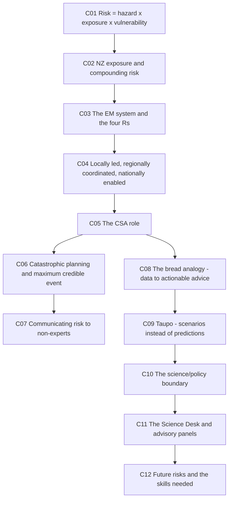

---

## ⚖️ L11-C01 · Risk = hazard × exposure × vulnerability

> [!question] Cue questions
> - Define hazard, exposure, vulnerability, impact and risk as NEMA uses them.
> - What turns an impact into a risk?
> - Give the three-pigs metaphor.

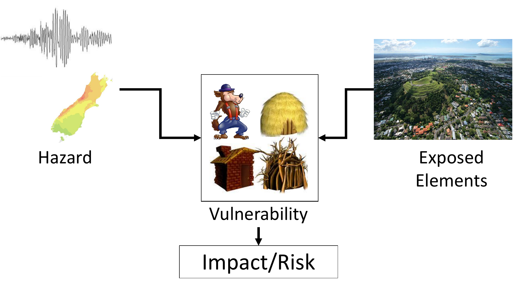

> [!important] The definitions (slide 3)
> *"**Risk is often quite a contested term**, so the way that I use risk — and the New Zealand Emergency Management System uses risk — is…"*
>
> | Term | Definition |
> |---|---|
> | **Hazard** | *"A process or phenomenon that could potentially cause harm or impact to society"* |
> | **Exposed elements** | *"What might be exposed — what parts of society: whether it's **people, buildings, culture, things that we treasure, our economy**"* |
> | **Vulnerability** | How the exposed elements resist or succumb — the relationship between the two |
> | **Impact** | What you get when you combine all that together |
> | ⭐ **Risk** | **Impact with a probability attached** — *"risk being a function of **likelihood and potential consequences**"* |

> [!example] The three little pigs
> *"The big bad wolf is **the hazard**, huffing and puffing, trying to blow houses down. But the three different houses made out of **straw, sticks and brick** — they've got **different vulnerability attributes**, and so they can resist the hazard, or not, and come through it."*
>
> Same wolf, same exposure, three vulnerabilities, three impacts.

> [!tip] Why the distinction matters for your project
> **You cannot reduce the hazard.** You can reduce **exposure** (where you build) and **vulnerability** (how you build). That is the whole argument for risk reduction in [[#🇳🇿 L11-C02 · New Zealand's exposure, and why risk is compounding|C02]].

*📄 Source: slide 3 · transcript*

---

## 🇳🇿 L11-C02 · New Zealand's exposure, and why risk is compounding

> [!question] Cue questions
> - Name the four drivers of compounding risk.
> - What is the risk-transfer mechanism NZ relies on, and why is it under pressure?
> - What proportion of central government spend goes to response and recovery?

> [!quote] Sir Geoffrey Palmer, quoted on slide 4
> *"Sometimes it does us a power of good to remind ourselves that we **live on two volcanic rocks where two tectonic plates meet, in a somewhat lonely stretch of windswept ocean just above the Roaring Forties.** If you want drama — **you've come to the right place.**"*

> [!important] Exposed, not fragile — the correction he makes
> *"New Zealand is **one of the most exposed nations on Earth** to natural hazards. We're often described as being some of the **most at risk** — but **I think that's unfair. We have amazing resilience and natural advantages**, both in how we operate as a society and what we've done to mitigate those risks. **But we are highly exposed.**"*
>
> Exactly [[#⚖️ L11-C01 · Risk = hazard × exposure × vulnerability|C01]] applied to the country: high hazard and high exposure, but vulnerability partly managed.

> [!quote] Slide 5 — why risk is compounding
> - **Risk is compounding** in hazard-prone areas, because **hazard events are occurring more often** (rising sea and more energetic climate) **and we increase exposure by continuing to build and intensify development in these areas**
> - **The relative vulnerability of people, property and infrastructure is also growing**
> - **Climate change is also leading to a greater frequency of events in short succession**, and compounding socio-economic pressures, **EM system fatigue**, etc.
> - **Increasing number and complexity of responses** (fiscal implications) and **pressure on traditional risk transfer mechanisms**, so **increasing need to focus on risk reduction**

> [!important] ⭐ The insurance problem
> *"We're one of the **rare nation states which is heavily reliant on insurance** for transferring our risks. We have the **Natural Hazards Commission**, formerly known as the **Earthquake Commission**, and **very high penetration of insurance** across homes and businesses. There's been quite a heavy reliance on insurance as a way to manage risks, so that when we have an event we've got capital that can come back in. **But these compounding events are putting pressure on those traditional mechanisms.**"*
>
> Risk transfer works when events are rare and independent. Clustered events break the model.

> [!warning] ⭐ The 97% figure — the argument for risk reduction
> *"Something like **97% of central government expenditure has been focused either on response and recovery, rather than explicitly on risk reduction initiatives** — which is a skew that **Treasury and other central government agencies are keen to address**."*
>
> And why the burden lands where it does: *"When risk reduction — land use planning controls, building controls, building codes — **isn't working as hoped**, the **residual risk gets mopped up by the emergency management system** during response and into recovery. And the nature and pressure of that has been **quite unsustainable**."*

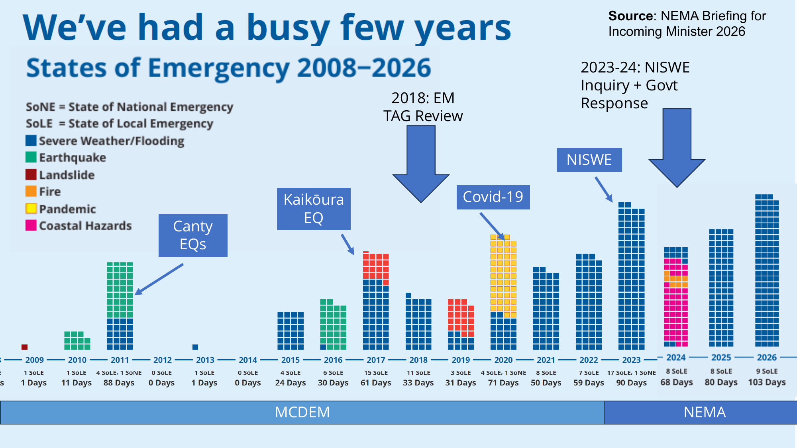

> [!example] Why states of emergency are increasing — a four-part answer
> Slide 6 plots states of emergency over 18 years. Two types: **local** and **national** (*"of which we've only had a couple"*). Tom asked the class for drivers and accepted four:
>
> | Driver | His gloss |
> |---|---|
> | **Climate change** | *"We definitely have seen an increase in some of the storm events"* — but *"sometimes it's multiple factors"* |
> | **Better detection** | *"That's probably fair"* |
> | **Population growth / more exposure** | *"More exposure, perhaps more interest around what some of those consequences would be"* |
> | ⭐ **A change in posture** | *"One of the areas we've been directed to look at is to have a **much greater readiness and response posture**. There's been **a lot more willingness to declare a state of emergency**, to use it as a way to **enhance the quality of the response**, to ensure the resources… can be deployed."* |
>
> > ⭐ **And the social-science reason:** *"They're also really powerful from a social science perspective of **motivating communities**. If there's something occurring, **it brings a sort of focusing effect**."*
>
> **A declaration is a tool, not just a description.** It unlocks resources and it changes public behaviour — which is why the count rises without the hazard necessarily rising.

The dominant events on the timeline: **Canterbury earthquake sequence** (from 2010–11) · **Kaikōura earthquake** (2016) · **COVID-19** (2020) · **North Island Severe Weather Events** (2023 — Auckland Anniversary weekend floods, then almost immediately **Cyclone Gabrielle**). Also marked: the **2018 EM TAG Review**, the **2023–24 NISWE Inquiry and Government Response**, and the transition from **MCDEM** to **NEMA**.

*📄 Source: slides 4–6 · transcript*

---

## 🔄 L11-C03 · The Emergency Management System and the four Rs

> [!question] Cue questions
> - Name the four Rs and what each covers.
> - What is the system's stated purpose?
> - What does "a wide zone of tolerance" mean?

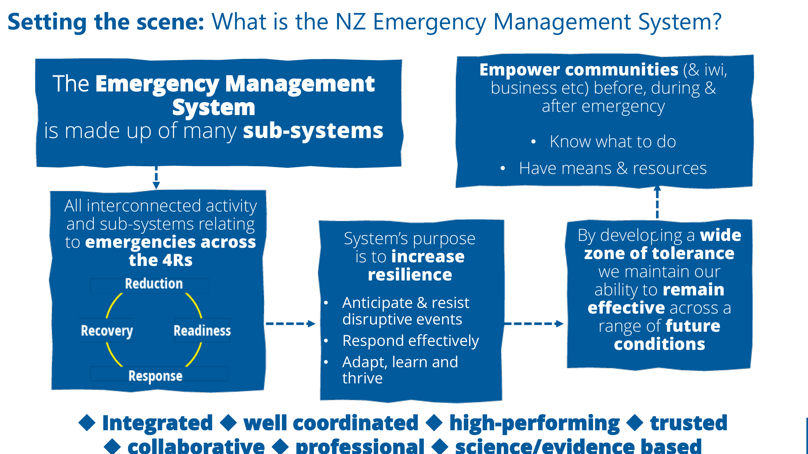

> [!important] ⭐ The four Rs
> | R | What it covers |
> |---|---|
> | **Reduction** | *"Trying to reduce, in a structural or long-term sense, what the potential risks might be. Sometimes also used with the term **resilience**"* |
> | **Readiness** | *"Preparing for emergencies — practice evacuation drills for tsunami, understanding what your early warning system might look like"* |
> | **Response** | Responding to the event itself |
> | **Recovery** | The phase after |
>
> *"**Theoretically they form a continuous cycle** of continuously improving and building resilience."*

> [!quote] Slide 7 — the system's purpose
> The Emergency Management System *"is made up of many sub-systems… **all interconnected activity and sub-systems relating to emergencies across the 4Rs**."*
>
> **System's purpose is to increase resilience:**
> - **Anticipate & resist disruptive events**
> - **Respond effectively**
> - **Adapt, learn and thrive**
>
> **Empower communities (& iwi, business etc.) before, during & after emergency:**
> - **Know what to do**
> - **Have means & resources**
>
> ⭐ **By developing a wide zone of tolerance we maintain our ability to remain effective across a range of future conditions.**
>
> The system should be: ***integrated ◆ well coordinated ◆ high-performing ◆ trusted***

> [!tip] "Zone of tolerance" is a systems-thinking idea
> It is the resilience concept from [[../../Lecture8/notes/L8-notes|L8-C12]] — robust systems absorb disturbance without changing state. Widening the zone means fewer events become emergencies at all.
>
> Tom's version: *"that ability to **not just absorb and cope with events, but hopefully to thrive**, as we know that we are highly exposed."*

> [!important] The subsystems (slide 9)
> **CDEM · Health · Biosecurity · Food Safety · Transport · Critical Infrastructure · Research/Science · Insurance · Iwi/Māori · etc.** — spanning **all hazards/risks** across **social, economic, built and natural** environments.
>
> Compare [[../../Lecture7/notes/L7-notes|L7]]'s ten-agency fisheries map. Same lesson: the thing you call "the system" decomposes into a dozen systems with different owners.

*📄 Source: slides 7, 9 · transcript*

---

## 📍 L11-C04 · Locally led, regionally coordinated, nationally enabled

> [!question] Cue questions
> - State the three-part mantra.
> - How many CDEM groups are there, and what is NEMA's role?
> - Who else is named as a critical partner?

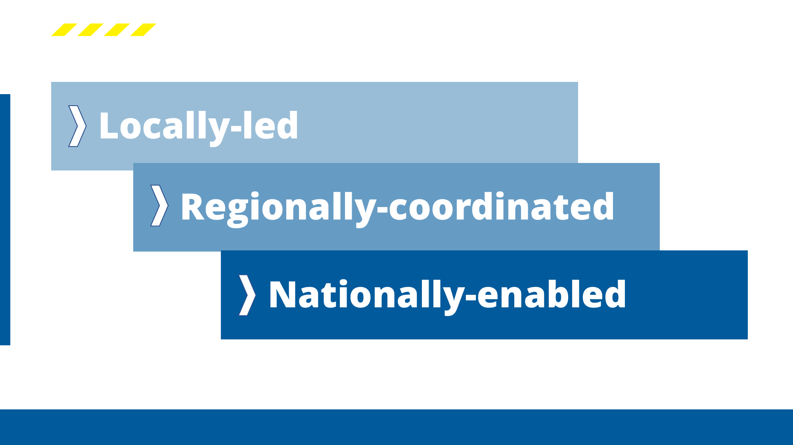

> [!important] ⭐ The mantra (slide 10)
> > **Locally-led · Regionally-coordinated · Nationally-enabled**
>
> *"One of the features of the emergency management system is that we have what's called a **devolved model**, where **much of the actual activity is undertaken at regional and local levels**. We have **16 Civil Defence and Emergency Management groups** across the country… working in partnership with each other and with **NEMA as the national agency which coordinates and supports** that system."*
>
> *"Colleagues and myself from NEMA — **we sit at that national level, where we're trying to enable and support as much as possible.**"*

> [!important] This is [[../../Lecture10/notes/L10-notes|L10-C01]] again
> Central enables, local acts. Same structure Juliet described for policy, now with an operational tempo. The Auckland floods needed *"a **national response** to liberate resources"* **and** *"a **council response** to get out there, mobilise the fire service and start rescuing people"* — and *"there was a lot of friction around that particular incident."*

> [!tip] Partners beyond the tiers
> *"**Iwi Māori — really important, in fact critical partners** to the emergency management system in so many ways."* (Slide 8: *"working in partnership with each other… alongside our Iwi Māori partners… with connections across the emergency management system."*)
>
> And the reach beyond NZ: *"the interest for us is not just here in New Zealand, but also out into **the realm countries** — some of our Pacific Island partners, such as the **Cook Islands**, and then into the wider Pacific."*

*📄 Source: slides 8–10 · transcript*

---

## 🧑‍🔬 L11-C05 · What a Chief Science Advisor actually does

> [!question] Cue questions
> - What is the role, in one sentence?
> - Give the three self-deprecating metaphors and what each captures.
> - Who does he brief?

> [!important] The role
> *"My role as Chief Science Advisor is to provide, at a strategic level — sort of right under the lens of central government — **as much scientific advice and evidence base for how we should be approaching our emergency management activities**. A lot of my role tends to be around **understanding risk and what can we do about it** — both in a crisis event, and/or preparing for it."*
>
> He is NEMA's **inaugural** CSA, four years in post, and the role *"came off the back of a lot of Juliet's amazing work when she was Prime Minister's Chief Science Advisor"* — the [[../../Lecture3/notes/L3-notes|L3]] network of departmental CSAs made concrete.

> [!example] ⭐ Three metaphors for the job
> | Metaphor | What it captures |
> |---|---|
> | **Science fairy** | *"Floating around the agency, **sprinkling a bit of science dust** where it might be necessary"* — his colleagues' version |
> | ⭐ **Plumber** | *"What's the problem? Where do we **diagnose** that in the system? **What needs to be connected, unblocked or rerouted** so that information or knowledge or science advice can be communicated in a way that's appropriate?"* — his own preferred version |
> | **Seagull** | *"Sometimes you just **fly in** to a particular area, there might be something of interest — **squawk, flap, defecate and then fly off again** and hope for the best"* — an ex-graduate student's version |
>
> The plumber is the serious one: **the job is diagnosing blockages in an information system, not producing new science.**

> [!tip] Who he briefs
> *"Providing those connections across the **science / emergency management system boundary**… communicating with some of the really key officials, such as the **national controller**, the **chief executive**, and often spend a lot of time **briefing ministers**. And when it's really bad, sometimes **the Prime Minister**."*
>
> Note this is the [[../../Lecture10/notes/L10-notes|L10-C10]] *"or maybe here"* channel — direct advice to the minister — as a standing role rather than an exception.

*📄 Source: slide 11 · transcript*

---

## 🌋 L11-C06 · Catastrophic planning and the maximum credible event

> [!question] Cue questions
> - Distinguish emergency, disaster and catastrophe.
> - What are the two named failures from overseas, and what does each mean?
> - Why choose a single scenario rather than a probabilistic set?

> [!important] ⭐ The escalation — emergency → disaster → catastrophe
> *"What if we have an **emergency**? And then if we have a **disaster**, where we start to see society, or at least parts of society, **overwhelmed**? But what if we get to being a **catastrophe**, where we start to see **the fundamental building blocks or attributes of a functioning government, functioning society, functioning economy start to collapse**?"*
>
> *"**We've never really experienced that in the last 100 or so years here in New Zealand.** Perhaps analogies would be **failed states**, where armed conflict might collapse a nation state."*

> [!quote] Slide 12 — the framing
> **Can't scale up. Don't look up.**
> **Overwhelms our current thinking, arrangement, experience and imagination**
> - ***"Failure of Imagination"* — 9/11 Commission (USA)**
> - ***"A Failure of Initiative"* — Hurricane Katrina (USA)**
>
> **We needed a story to plan around and 'provide the why'**
> - **Which scenario?**
> - **Maximum credible event → what is credible?**

> [!important] The two failure modes, distinguished
> | Failure | What went wrong |
> |---|---|
> | **Failure of imagination** (9/11) | *"To conceptualise that there could be terrorist attacks such as 9/11, **despite there being quite a lot of evidence that that could potentially happen**"* |
> | **Failure of initiative** (Katrina) | *"Having a **fairly clear understanding of what might be in play**, but **not being able to affect the planning or the actual action**"* |
>
> **One is not seeing it. The other is seeing it and not acting.** Both are worth testing your own project against.

> [!important] Why one scenario beats a probability distribution
> *"The key lesson was that **it's really challenging to scale up your existing arrangements** to deal with something of catastrophic nature… and **don't be limited by your current thinking or what you can conceptualise**."*
>
> *"**Obviously we've got heaps of different probabilistic options** we could look at — earthquakes, geopolitical threats. **But having a single scenario, determined to be a maximum credible event that we could plan around, was thought to be quite a useful way to go.**"*
>
> ⭐ A distribution does not motivate anyone. **A story does.** *"We needed a story to plan around and provide the why."*

> [!example] The chosen scenario — **Mw 9.1 Hikurangi Subduction Zone earthquake + upper crustal faults**
> Chosen for two reasons:
> 1. *"It's probably **one of our largest risks** in terms of threat to life and impacts on the economy"*
> 2. ⭐ *"It was also one that at the time was **easy for the planners and other officials to conceptualise**, because there had been **a bit of experience with earthquakes in the preceding five or so years**"*
>
> **Credibility to a non-expert audience was a selection criterion, not an afterthought.**

*📄 Source: slides 12–13 · transcript*

---

## 📊 L11-C07 · Communicating risk to non-experts

> [!question] Cue questions
> - What three visualisations were used, and what did each add?
> - Why does the evacuation-compliance comparison work as an argument?
> - How was probability made meaningful to a minister?

> [!important] The visualisation sequence — each one adds something the last couldn't
> | Artefact | What it added |
> |---|---|
> | **Physics-based shaking simulation** (Brendon Bradley, University of Canterbury, with UoA geotechnical and earthquake engineers) | *"Seismic waves… visualised by this **vertical exaggeration**… you can really get that sense of how the waves stack up as the rupture front progresses."* Tom's read of the room: *"**I can see already within the lecture theatre you've all kind of gone a little bit more quiet.**"* |
> | **2011 Tohoku footage** (Japan, Mw 9.0) | *"It's **not just about the water and the waves**, but the **long period of the wave** coming in, and **the amount of debris it's picking up** — which makes it so much more understandable **why there might be high damage**"* |
> | **Tsunami wave model** (Bill Fry, GNS) | The **timestamp** is the point: *"watch just **how quickly that wave reaches the eastern coast**"* — **10 min** Wellington and Wairarapa · **20 min** Tairāwhiti/Gisborne · **45–50 min** Napier and Hastings inundated with a **10–12 m wave** · then wrapping around Bay of Plenty, Wellington Harbour and into Auckland |
>
> > *"So you can start to see that **cascading hazard** that's starting to be produced."*

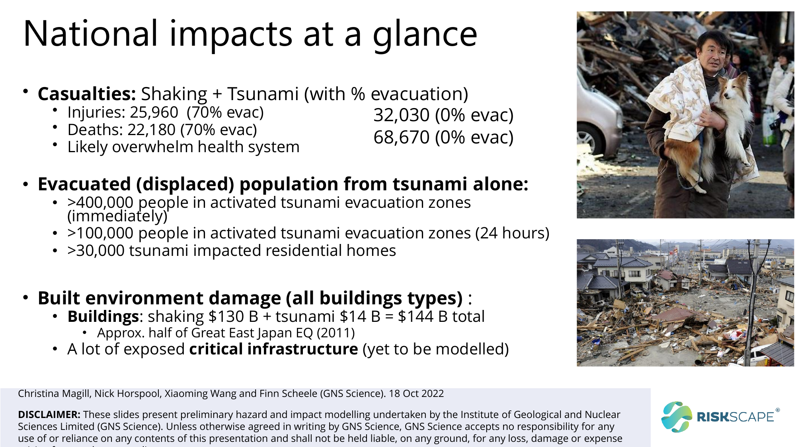

> [!important] ⭐ National impacts (slide 17) — and why the two columns are the argument
> | | **70% evacuation** | **0% evacuation** |
> |---|---|---|
> | **Injuries** | **25,960** | **32,030** |
> | **Deaths** | **22,180** | **68,670** |
>
> *"**Likely overwhelm health system.**"*
>
> The 70% figure is empirical: *"That comes from **social science of looking at what percentage of communities have evacuated following recent tsunami warnings** across New Zealand. So we were reasonably comfortable with that number."*
>
> > ⭐ *"If we **drop that number away** or assume that no one evacuated — **the injuries increase a little bit, but the fatalities markedly increase**. And that just really points to **how lethal being trapped in tsunami waters potentially can be.**"*
>
> **Injuries rise 23%; deaths rise 210%.** That asymmetry *is* the case for investing in evacuation readiness — one table, one comparison, no rhetoric.
>
> **Other impacts:** **>400,000** people in activated tsunami evacuation zones immediately · **>100,000** still in them at 24 hours · **>30,000** tsunami-impacted residential homes · buildings **$130 bn shaking + $14 bn tsunami = $144 bn total**, *"approximately **half of the Great East Japan earthquake (2011)**"* · *"a lot of exposed critical infrastructure (yet to be modelled)"*.

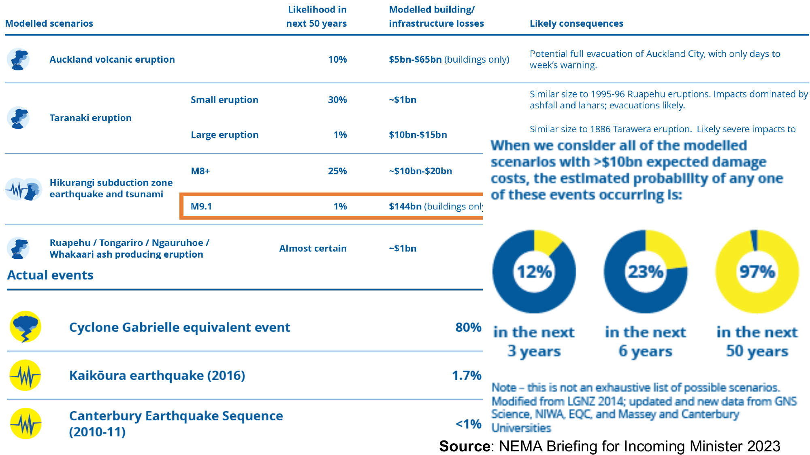

> [!example] The national risk table (slide 18, NEMA Briefing for Incoming Minister 2023)
> | Scenario | Likelihood in next 50 years | Modelled losses |
> |---|---|---|
> | **Auckland volcanic eruption** | **10%** | **$5bn–$65bn** (buildings only) — *"potential full evacuation of Auckland City, with only days to a week's warning"* |
> | **Taranaki eruption** — small | 30% | ~$1bn |
> | **Taranaki eruption** — large | 1% | $10bn–$15bn |
> | **Hikurangi subduction zone** — M8+ | **25%** | ~$10bn–$20bn |
> | ⭐ **Hikurangi — M9.1** | **1%** | **$144bn** |
> | **Ruapehu / Tongariro / Ngāuruhoe / Whakaari ash-producing eruption** | **Almost certain** | ~$1bn |
>
> **Actual events, with their probability the day before they happened:**
> - **Cyclone Gabrielle equivalent — 80%** (in 50 years, with no change in climate)
> - **Kaikōura earthquake (2016) — 1.7%**
> - **Canterbury Earthquake Sequence (2010–11) — <1%**
>
> > ⭐ *"**The point here is that these rare events do happen. We should be preparing for them, because that's part of what living here in Aotearoa is all about.**"*

> [!important] ⭐ Reframing probability for a minister — the best single move in the lecture
> *"I'm trying to think — **how might this be interesting to a minister?** What if we have a brand new Minister of Emergency Management? Well, of all of these scenarios, **what's the cumulative probability of it occurring in the electoral term? Or if they get re-elected and they're the minister for two electoral cycles, over six years?** And then over the next 50 years, something like this is **almost certain**."*
>
> The slide gives the answer: **12% in the next 3 years · 23% in the next 6 years · 97% in the next 50 years** (for any modelled scenario with >$10bn expected damage).
>
> **A 1% chance in 50 years is ignorable. A 12% chance on your watch is not.** Same data, rescaled to the decision-maker's horizon. Compare [[../../Lecture5/notes/L5-notes|L5]]'s timeframe sensitivity and [[../../Lecture10/notes/L10-notes|L10]]'s election cycles.

> [!tip] The general rule he draws
> *"**Nice, simple metrics that can tell a powerful tale** have been a really important part of the journey."*

*📄 Source: slides 13–18 · transcript*

---

## 🍞 L11-C08 · The bread analogy — data to actionable advice

> [!question] Cue questions
> - Name the four stages from data to actionable advice.
> - What are the three output formats, and why do they differ?
> - What is the failure the slide identifies in red?

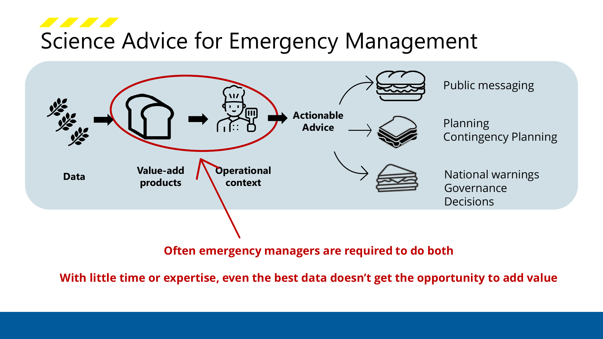

> [!important] The chain (slide 19)
> ```mermaid
> graph LR
>     A[Data<br/>wheat] --> B[Value-add products<br/>a loaf]
>     B --> C[Operational context<br/>the chef]
>     C --> D[Actionable Advice]
>     D --> E[Public messaging]
>     D --> F[Planning /<br/>Contingency Planning]
>     D --> G[National warnings /<br/>Governance Decisions]
> ```
>
> *"You've got **data** from the engineering domain or science domain, and then you're **analysing it, adding value and creating a product** which would be trying to help with decision making. In this case you might have **a loaf of bread**."*
>
> *"But **in that operational context there might be different things that we need**. We might need a **sub**, or we might need **toast**, or we might need a **gluten-free option** — whatever the case might be for making the decision."*

> [!important] ⭐ The same evidence, three different products
> *"We might need **something different for public messaging** compared with **contingency planning**, compared with **national warnings**, or even for **governance decisions**."*
>
> > *"How do we use that loaf of bread — **or bake a different loaf** — and fill it with different fillings to make it as useful as possible for making good quality, evidence-based decisions in a manner that's **timely and effective**?"*

> [!warning] ⭐ The failure, printed in red on the slide
> > **"Often emergency managers are required to do both."**
> > **"With little time or expertise, even the best data doesn't get the opportunity to add value."**
>
> The red circle on the slide is drawn around **value-add products → operational context** — the two steps in the middle. When nobody owns them, the emergency manager has to do both, under time pressure, without the expertise. **That is the gap the CSA role and the Science Desk exist to fill.**
>
> Tom's admission about the metaphor: *"Originally I was thinking it's almost like **a sausage factory**… but apparently **the more politically correct way to do this is to bake a loaf of bread**."*

> [!important] Why this is the lecture's central problem
> *"One of the areas that **sequential reviews and inquiries into large disasters and emergencies which haven't gone so well in New Zealand** has noted is that **often we've had quite good science input and forecasting, and even understanding that a hazard or risk might be there — but how that then becomes operationalised or translated into actionable policy or practice**."*
>
> **The failure is never the science. It's the translation.** Same claim as [[../../Lecture3/notes/L3-notes|L3]]'s gangs report, from an entirely different domain.

> [!tip] And the version of this that applies to you
> *"When you're a professional engineer… **you're going to have an amazing technical ability that very small parts of the population will have**, and **being able to communicate that in an effective way to inform other very intelligent but maybe non-expert people will be a key skill and attribute** you want to develop."*

*📄 Source: slide 19 · transcript*

---

## 🌋 L11-C09 · Taupō — scenarios instead of predictions

> [!question] Cue questions
> - What made the Taupō unrest socially and politically difficult, beyond the geology?
> - What change did Tom commission, and why?
> - What was the test that it had worked?

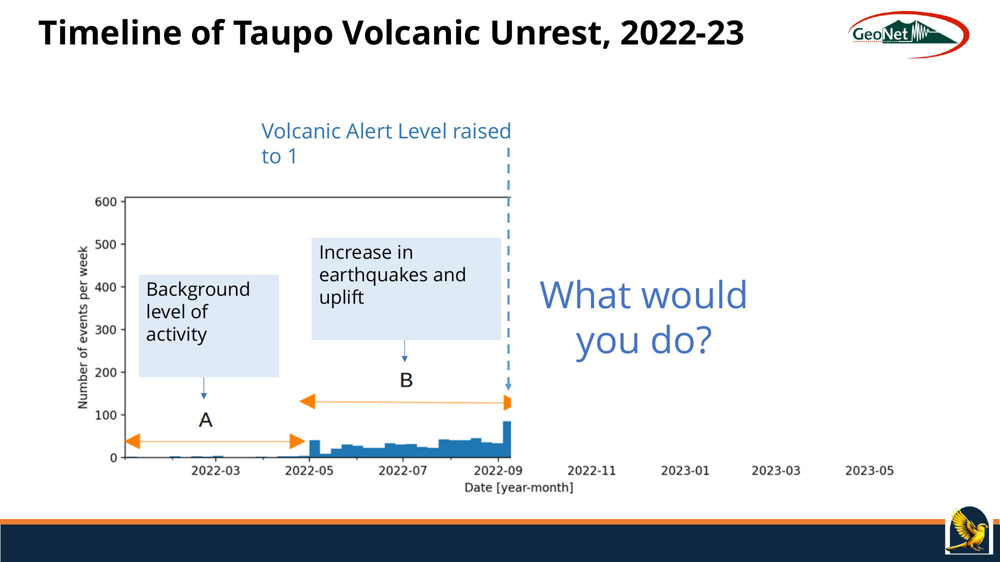

> [!important] The event
> **Taupō** — *"known as a **super volcano**"* — **29 eruptions in the past 26,000 years, 2 extremely large**, most recent **232 AD**. That eruption *"devastated the central North Island area, and there were records in Chinese histories of seeing a change in the climate and… incredible sunsets at the time."*
>
> The 2022–23 sequence (slide 22): background activity → **increase in earthquakes and uplift** → **Volcanic Alert Level raised to 1** → **fewer EQs** → **M5.7 earthquake, 18 cm uplift** → **declining activity** → **VAL lowered to 0**. Annotated on the slide at the quiet point: ***"What would you do?"***
>
> ⭐ *"For the **first time ever**, GNS Science raised the volcano alert level to **1** for Taupō volcano."*

> [!warning] ⭐ The context is the hard part — three compounding pressures
> 1. **Recency:** *"We were only **2 or 3 years after the Whakaari eruption**. We had **the same government in office**, and there was **extremely high sensitivity around volcanic risk**."*
> 2. **The science agency was under legal scrutiny:** *"GNS Science… had had a lot of critique and review around their role in the Whakaari disaster around what sort of science advice they had provided, and **they had been subject to judicial proceedings**."*
> 3. **Eroded social licence:** *"We're also coming out of the COVID-19 pandemic… **the social licence around what governments could be communicating was starting to fray a little bit after the pandemic experience.**"*
>
> And the international precedent they were trying to avoid: *"We have a lot of examples from overseas where **ineffectively communicating a reawakening volcano** has led to really unfortunate outcomes, like **large evacuations, outrage and frustration, and loss of trust with scientific authorities and emergency management authorities**."*
>
> This is [[../../Lecture3/notes/L3-notes|L3]]'s **social licence** and the **consensus quadrant** in an operational setting.

> [!important] ⭐ The intervention — from prediction to scenarios
> *"**We weren't quite getting the science advice that we really wanted in a format that we could communicate effectively**, particularly with ministers and senior officials who were juggling multiple issues."*
>
> > *"One of the **big calls I first made as Chief Science Advisor** was to **commission GNS to change the way they were communicating**. We ended up asking for **much more of a scenario-based approach** — exploring **the total range of different outcomes**, with the volcano most likely staying in an unrest state and then going back to sleep, but **all the way through to what minor eruptions could be, all through to catastrophic eruptions. We couldn't rule any of them out.**"*
>
> The misconception it was fixing: *"the conceptualisation that many non-expert people had was that **it was either going to be a catastrophic eruption, or something they were less familiar with**"* — a binary. The scenario table replaces the binary with a graded set.

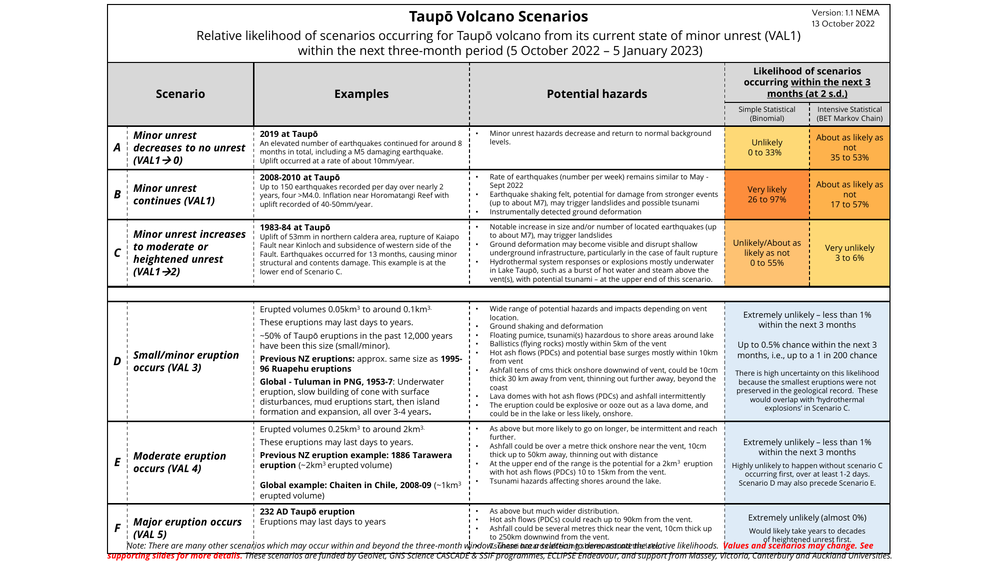

> [!example] The scenarios table (slide 24, NEMA v1.1, 13 October 2022)
> Relative likelihood **within the next three-month period**, each anchored to a **real historical example**:
>
> | | Scenario | Example | Likelihood |
> |---|---|---|---|
> | **A** | **Minor unrest decreases to no unrest** (VAL1→0) | 2019 at Taupō | Unlikely (0–33%) / about as likely as not (35–53%) |
> | **B** | **Minor unrest continues** (VAL1) | 2008–10 at Taupō — up to 150 EQs/day over nearly 2 years | **Very likely (26–97%)** / about as likely as not (17–57%) |
> | **C** | **Increases to moderate or heightened unrest** (VAL1→2) | 1983–84 at Taupō | Unlikely/about as likely as not (0–55%) / very unlikely (3–6%) |
> | **D** | **Small/minor eruption** (VAL3) | ~1995–96 Ruapehu | **Extremely unlikely — less than 1%**; up to **0.5%**, *"i.e. up to a 1 in 200 chance"* |
> | **E** | **Moderate eruption** (VAL4) | 1886 Tarawera (~2 km³) | Extremely unlikely — <1%; *"highly unlikely without scenario C occurring first"* |
> | **F** | **Major eruption** (VAL5) | 232 AD Taupō | **Extremely unlikely (almost 0%)** — *"would likely take years to decades of heightened unrest first"* |
>
> Three things worth copying:
> - ⭐ **Two independent likelihood methods are shown side by side** (simple binomial vs BET Markov chain) **and they disagree**. Publishing the disagreement is the honesty move.
> - **Every scenario is anchored to something that actually happened**, so a non-expert can picture it.
> - The footnote: *"There are **many other scenarios** which may occur within and beyond the three-month window. These are **a selection to demonstrate the relative likelihoods**. **Values and scenarios may change.**"*

> [!important] ⭐ The test that it worked
> *"After quite a difficult couple of weeks of trying to work through this, we came up with this table, and I presented it to the **Director of Civil Defence and Emergency Management at the time, Gary Knowles** — a real character, great guy. And after all the stress and anxiety of how we're communicating this effectively, **Gary just said: 'Oh great, Tom, that looks really simple. No dramas.'**"*
>
> > *"And I thought at that point — **oh, we've probably got on the right track here.** He was **reassured**, he felt like he had **a good sense of what the problems were**, and that he was able to **digest it and make good decisions**."*
>
> **The success criterion for technical advice is not that it is complete. It is that the decision-maker can act on it.** *"That looks really simple"* is the compliment you are aiming for.

> [!tip] What was needed, and from whom (slide 23)
> The same event demanded three different products at once — the bread analogy in the field:
> **National decision making (warnings) · executive briefings · reassurance** | **Enhanced regional planning (known impacts) · agency briefings** | **Public communications · reassurance**
>
> And the pressures: *"a lot of interest from the **Minister of Finance** about what that might mean for **critical infrastructure**, and the **Prime Minister** at the time was certainly very attuned to it as well. So **Juliet and I were in pretty frequent contact**."*

*📄 Source: slides 20–24 · transcript*

---

## 🔀 L11-C10 · The science/policy boundary

> [!question] Cue questions
> - What does each domain require, and what does the hybrid zone require?
> - Give the six contrasts between the domains.
> - What three things does the hybrid zone demand in practice?

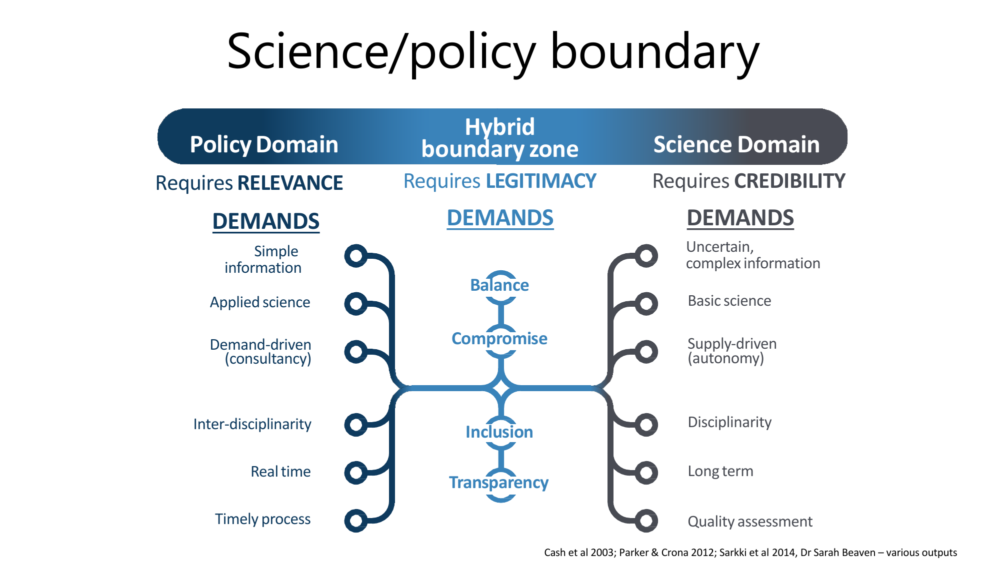

> [!important] ⭐ Boundary management theory (slide 25)
> | | **Policy Domain** | **Hybrid boundary zone** | **Science Domain** |
> |---|---|---|---|
> | **Requires** | **RELEVANCE** | **LEGITIMACY** | **CREDIBILITY** |
> | | **Simple information** | *Balance* | **Uncertain, complex information** |
> | | **Applied science** | | **Basic science** |
> | | **Demand-driven** (consultancy) | *Compromise* | **Supply-driven** (autonomy) |
> | | **Inter-disciplinarity** | *Inclusion* | **Disciplinarity** |
> | | **Real time** | *Transparency* | **Long term** |
> | | **Timely process** | | **Quality assessment** |
>
> *Sources on the slide: Cash et al. 2003; Parker & Crona 2012; Sarkki et al. 2014; Dr Sarah Beaven.*

> [!important] The three currencies
> - **Relevance** is what policy needs — *"access to relevant knowledge so we can make good decisions quickly."*
> - **Credibility** is what science needs — *"usually **credibility is the large driver** motivating many people, dealing with uncertain and often quite complex information."*
> - ⭐ **Legitimacy** is what the boundary needs — *"that hybrid zone demands what we call **legitimacy**. You need to have that **balance of both sides**, having that credibility come in, but so that **it's relevant**. Often that involves a lot of **compromise**, thinking about the **inclusive** way we want to bring these things together, and ensuring that it's **highly transparent**."*
>
> **Balance · compromise · inclusion · transparency** are the four mechanisms listed in the middle column, and they are how legitimacy is manufactured.

> [!tip] Why this is the most portable slide in the lecture
> It explains why good scientists give bad advice and why good officials misread good science — **they are optimising different variables**, and neither is wrong. The [[../../Lecture3/notes/L3-notes|L3]] consensus quadrant tells you *when* advice will land; this tells you *what it must be made of*.

*📄 Source: slide 25 · transcript*

---

## 🖥 L11-C11 · The Science Desk and the advisory panels

> [!question] Cue questions
> - What prompted the Science Desk, and what four things does it do?
> - Where does it sit in the CIMS structure?
> - What are the Science Advisory Panels, who is on them, and how are they funded?

> [!important] The prompt — the 2023 North Island Severe Weather Events
> *"Rather than that type of scene, what I was mostly working on was **the National Crisis Management Centre**, which sits **underneath the Beehive** — affectionately known as **the bunker**. This is where all the national agencies come together to coordinate support out into the regions."*
>
> *"One of the areas we determined from that was **the need for a much more structured approach around how we're providing science and technical advice in an emergency context**."*
>
> Slide 28 names the underlying problem: **"Rotting feast of disaster science"** — *"Critical challenge: **operationalization of research → science services**"*, needing **efficient, equitable access to natural hazard and risk data, tools and guidance**, including **national hazard and risk models** and **national guidance on acceptable/tolerable risk**.

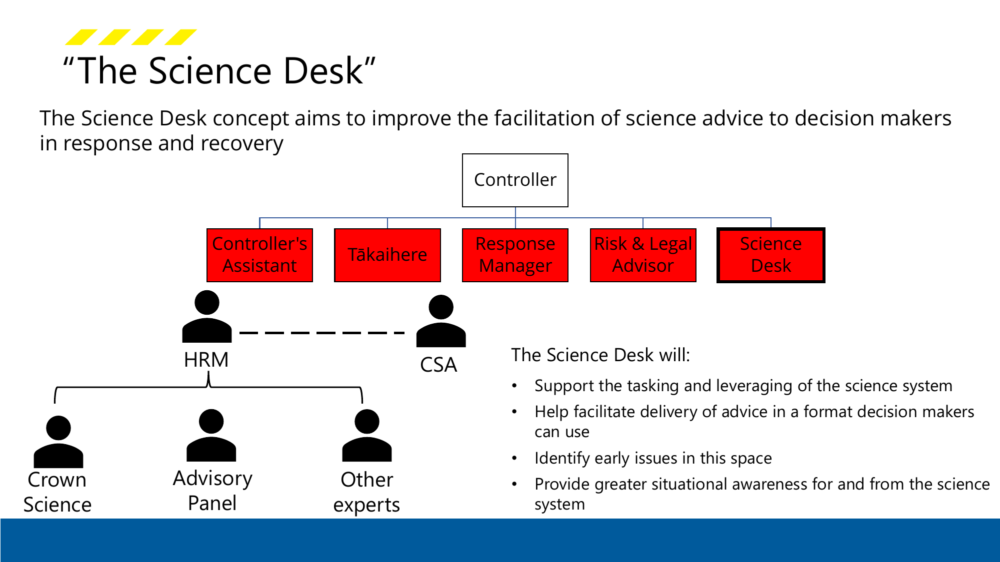

> [!quote] Slide 30 — the Science Desk
> *"The Science Desk concept aims to **improve the facilitation of science advice to decision makers in response and recovery**."*
>
> It sits under the **Controller**, alongside the **Controller's Assistant**, **Tākaihere**, **Response Manager** and **Risk & Legal Advisor**. Beneath it: **HRM**, the **CSA**, **Crown Science**, an **Advisory Panel** and **other experts**.
>
> **The Science Desk will:**
> - **Support the tasking and leveraging of the science system**
> - ⭐ **Help facilitate delivery of advice in a format decision makers can use**
> - **Identify early issues in this space**
> - **Provide greater situational awareness for and from the science system**
>
> Note the fourth bullet — **"for and from"**. Information flows both ways.

> [!important] Science Advisory Panels (slide 31)
> *"The panels provide an **efficient and effective coordination mechanism** between the science & emergency management systems for **both BAU and during emergencies**. In practice, the Panels support **some of the most complex or unanticipated challenges we face** in an emergency."*
>
> **They support:** informed decision making · **authoritative public information & advice** · **trust & confidence**
> **Members come from:** government science agencies (**MetService, Earth Sciences NZ**) · **academia** · **industry** (e.g. critical infrastructure)
>
> ⚠ ***"SAPs are unfunded & operate on a 'best-endeavours' basis"*** — scientist time is *"often funded by applied research-platform and science-services (e.g. GeoNet)."*
>
> > [!tip] Don't be put off by "science"
> > *"Please **don't be put off** by them — we called [them] science panels. **There's a large number of engineers that sit on these panels as well.**"* Named panels on slide 32: **Earthquake · Severe weather · Space weather · Tsunami (TBC) · Tsunami Experts · STAC-HazSub · Landslide · Volcano.**

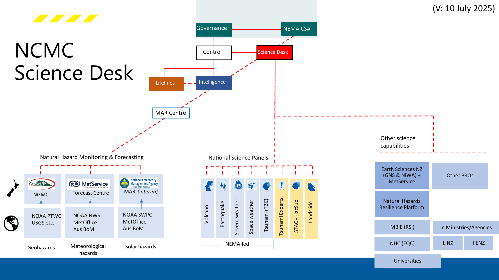

> [!important] How it fits together (slide 32)
> ```mermaid
> graph LR
>     M[Monitoring & forecasting<br/>GeoNet / NGMC, MetService,<br/>space weather] --> MAR[MAR Centre<br/>monitoring, alerting, reporting]
>     MAR --> SD[Science Desk<br/>inside the NCMC]
>     P[National Science Panels<br/>slower, deep expertise] --> SD
>     O[Other capability<br/>Earth Sciences NZ, universities,<br/>NHC, LINZ, FENZ] --> SD
>     SD --> CTRL[Control / Governance]
> ```
>
> *"Out on the left we have the **natural hazard monitoring and forecasting agencies** — **GeoNet** and the **National Geohazard Monitoring Centre**, telling us if there are tsunamis or volcanic eruptions or earthquakes. **MetService** providing forecasts. And **space weather** coming in too. That's the **operational arm** of the science coming into our **MAR Centre** — monitoring, alerting, reporting — and in a major event that comes into the **Science Desk within the NCMC**."*
>
> ⭐ *"**But we also have these science panels, which provide slightly slower-time deep expert advice** — both during crises but also for longer-term resilience activities."*
>
> **Two speeds of science feeding one desk:** instrumented monitoring in real time, and expert judgement on a slower clock. Slide 33 shows the **Space Weather SAP Operational Response Subgroup in action during a national exercise (2025)** — academics, industry and NEMA staff together.

*📄 Source: slides 26–33 · transcript*

---

## 🔮 L11-C12 · Emerging risks, and the skills to meet them

> [!question] Cue questions
> - What is the central argument of "final thoughts 1"?
> - Name the emerging challenges.
> - List the four skills for the next generation.

> [!quote] Slide 34 — Final thoughts 1: understanding each other's worlds
> - **Disaster risk is increasing** — due to a range of drivers. ⭐ ***"Are we making it harder on ourselves?"***
> - **Understanding our risks is critical, in all their complexity**
> - **Understanding how to reduce our risks is essential** — systems, tools, knowledge, planning? how to engage and influence? ⭐ **empowering communities with the necessary knowledge and tools must be at the heart of this**
> - **Engage with your science + technical partners — invest for the long term**

> [!quote] Slide 35 — Final thoughts 2: be curious
> **Faster and stronger science–policy integration:**
> - **Faster translation of scientific evidence into actionable policy**
> - ⭐ **Development of real-time advisory systems, not just periodic reports**
> - **Increased need for interdisciplinary synthesis** (e.g. climate + health + economics)
>
> **Emerging challenges: AI, climate, misinformation + reducing trust in institutions**
>
> **Advanced data and digital technologies** — need **technical literacy in emerging technologies to guide policy responsibly**

> [!important] ⭐ The four skills — the closest thing to careers advice in the course
> | Skill | Tom's gloss |
> |---|---|
> | **Hybrid skill sets** (science + policy + communication) | *"Comfortable across **both using your technical knowledge, understanding what environment it might be received in**, and being a **very strong and effective communicator**"* |
> | **Institutional independence with strong political access** | ⭐ *"Able to provide that technical information **without being exposed to political or other aspects** — but **still having that access into the decision-making areas**"* |
> | **Evidence drawn from across academia, industry, and government** | *"Really important ability to **synthesise and integrate**"* |
> | **Capability to operate under high uncertainty and urgency** | *"Good skills to develop"* |
>
> The second is the hard one and it is the same tension as [[../../Lecture3/notes/L3-notes|L3]]'s PMCSA role: **independence buys you credibility, proximity buys you influence, and you need both at once.**

> [!tip] His closing framing of the whole problem
> *"**Understanding what our risks might be is critical** — but perhaps **most essential going forward is how do we reduce those risks** as the key priority: the systems, the tools, knowledge and planning, and **how do we engage and influence and empower communities** with that right knowledge."*

*📄 Source: slides 34–35 · transcript*

---

## ✅ Summary — the 9 things that matter

1. **Risk = impact with a probability**, where impact = hazard × exposed elements × vulnerability. **You cannot change the hazard**; you can change exposure and vulnerability.
2. **NZ is highly exposed, not uniquely fragile.** Risk is compounding because events are more frequent **and** we keep building in hazard zones. **Insurance-based risk transfer is under pressure**, and **~97% of central government spend goes to response and recovery, not reduction.**
3. **The four Rs: reduction, readiness, response, recovery**, cycling to widen the **zone of tolerance**. **Locally led, regionally coordinated, nationally enabled** — 16 CDEM groups, NEMA at national level.
4. **A state of emergency is a tool**, not just a description: it unlocks resources and creates a **focusing effect** in communities. That is part of why declarations have risen.
5. **Plan for catastrophe with a story, not a distribution.** A **maximum credible event** (Mw 9.1 Hikurangi) was chosen partly because officials could **conceptualise** it. Guard against **failure of imagination** and **failure of initiative**.
6. ⭐ **Communicate risk by rescaling it to the decision-maker.** 1% in 50 years means nothing; **12% in three years, 23% in six** means something. And **70% vs 0% evacuation: injuries +23%, deaths +210%** — the comparison is the argument.
7. ⭐ **The bread analogy.** Data → value-add product → operational context → actionable advice, in **different formats** for public messaging, planning, and governance. *"With little time or expertise, even the best data doesn't get the opportunity to add value."* **The failure is never the science — it's the translation.**
8. ⭐ **Taupō: replace prediction with scenarios.** Six graded outcomes, each anchored to a real historical event, **with two disagreeing likelihood estimates published side by side**. The success test was *"that looks really simple. No dramas."*
9. **The boundary needs legitimacy.** Policy needs **relevance**, science needs **credibility**, and the hybrid zone is built from **balance, compromise, inclusion and transparency**. The **Science Desk** and **unfunded advisory panels** are the institutional version.

---

## 🧪 Self-test

> [!question]- 12 free-recall questions
> 1. Define hazard, exposure, vulnerability, impact and risk. Which can an engineer actually change?
> 2. Why is NZ "exposed" rather than "most at risk"? Name the four drivers of compounding risk.
> 3. What is the 97% figure, and what argument does it support?
> 4. Give four reasons states of emergency have increased. Which is about posture rather than hazard, and what two things does a declaration achieve?
> 5. Name the four Rs and the system's purpose. What does "zone of tolerance" mean and where have you met the idea before?
> 6. Distinguish emergency, disaster and catastrophe. Distinguish failure of imagination from failure of initiative.
> 7. Why plan around a single maximum credible event rather than a probability distribution? Give the two reasons Hikurangi Mw 9.1 was chosen.
> 8. Reconstruct the 70%/0% evacuation table. Why is the asymmetry between injuries and deaths the point?
> 9. A minister is told a scenario has a 1% chance in 50 years. How would you reframe it, and what are the three numbers?
> 10. Explain the bread analogy end to end. What is written in red on that slide, and what does it diagnose?
> 11. What did Tom commission GNS to change, and why? Name three things worth copying from the scenarios table.
> 12. Give the three currencies of the science/policy boundary and the four mechanisms of the hybrid zone. Then name the four skills he says the next generation needs, and say which is hardest.

---

> [!info]- Related notes
> - `L11-summary.md` · `L11-flashcards.tsv` · `../context/admin-and-dates.md`
> - **Sequel to:** [[../../Lecture10/notes/L10-notes|L10 — machinery of government]] — the same system, time-compressed
> - **Builds on:** [[../../Lecture3/notes/L3-notes|L3 — Whakaari, social licence, the consensus quadrant]] · [[../../Lecture8/notes/L8-notes|L8 — resilience and system tolerance]] · [[../../Lecture5/notes/L5-notes|L5 — risk assessment as CBA]]
> - **Next:** [[../../Lecture12/notes/L12-notes|L12 — tying it all together]]
