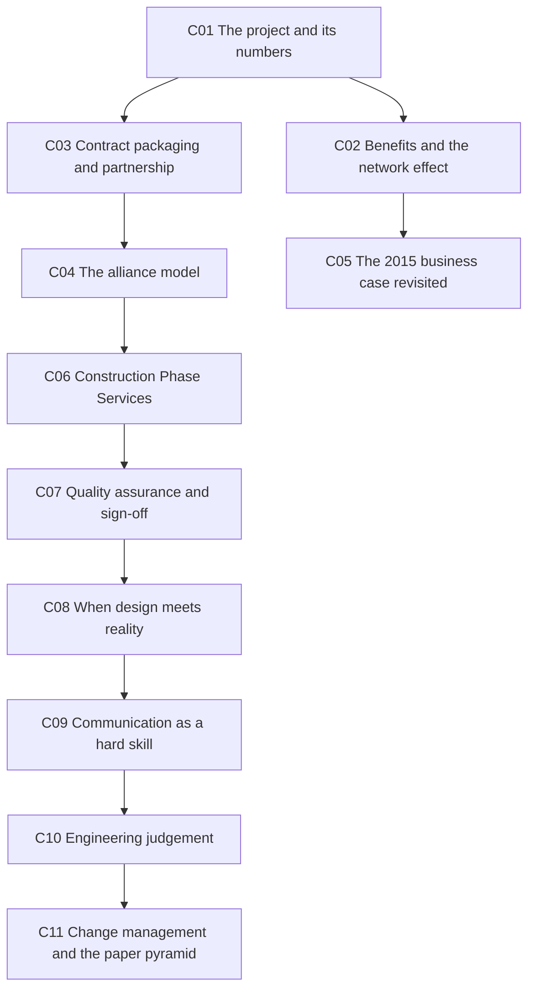

# 🚇 Lecture 12 — Tying it all together: City Rail Link

> [!abstract] Why this matters
> [[../../Lecture4/notes/L4-notes|L4]] opened with City Rail Link as *the* example of a systems-level business case. **This lecture is the same project, told by the people who built it, 30 days before it opens.**
>
> And it answers a question the course has not touched: **what happens after the business case is approved and the drawings are issued?** Simon Fenton's framing: *"**Consultancy engineering doesn't end with a drawing.** My life is sitting between design and construction."*

> [!info] Sources
> **Transcript only, ~9,400 words.** Auto-generated, quality fair — two speakers alternating, heavy acronym use, many references to slides that are not in the repo.
> **Speakers:** **Simon Mace** (CRL, mechanical engineer, MEngMgt Canterbury, chartered in the UK, 25 years' experience including 17 in rail) and **Simon Fenton** (AECOM Transport Group Leader; **Link Alliance Construction Phase Services manager**, 6½ years on CRL).
> Introduced by **Prof. Deirdre Brown**, Deputy Dean of the Faculty of Engineering and Design, and by Marc Lewis.
>
> ⚠ **No slide deck was supplied.** Both speakers refer constantly to photographs, BIM renders, an inspection test plan, a change-management flow and a "wow facts" slide. All of it is reconstructed from speech.
>
> *Prerequisites: [[../../Lecture4/notes/L4-notes|L4]] — the Better Business Case framework, which Simon Mace walks through against the real 2015 CRL case.*

> [!important] Open to the whole university
> Deirdre Brown: *"I wanted to acknowledge the generosity of the ENGGEN 403 team for not just inviting you here today, but actually **inviting the whole university** as well… **it was felt that the session was so important.**"*

## 🗺 Concept map



---

## 🚊 L12-C01 · The project, in numbers

> [!question] Cue questions
> - Give the headline figures: length, stations, cost, capacity, depth.
> - How long has this project been in the making?
> - What is the asset life, and what has been future-proofed?

> [!important] Headline figures
> | | |
> |---|---|
> | **Twin underground tunnels** | **3.45 km** |
> | **Stations** | **Four new and upgraded** |
> | **Total project cost** | **$5.5 billion NZD** |
> | **Capacity** | **Doubles Auckland's rail capacity to 54,000 passengers per hour at peak** |
> | **Deepest point below the city** | **45 m** |
> | **Opening** | ⭐ **13 September** — *"get this one burned in your mind"* |
> | **Asset life** | **100 years** |
> | **Future-proofing** | **Nine-car trains** — the network currently runs 3- or 6-car, so this is **50% longer trains than we run already** |
> | **Journey time** | *"Approximately three minutes to travel between each of the CRL stations"* |
>
> Deirdre Brown on the timescale: *"an important project for our city, which was **nominated over 100 years ago** and building started **a decade ago**."* Simon Mace: *"**11 years ago I came back from a long stint overseas to work on the City Rail Link**… and here we are 11 years later, about to open the project in 30 days' time."*

> [!tip] The engineering constraint worth remembering
> **Maximum rail gradient 3.5%** — *"that's actually **1% steeper than the normal network maximum of 2.5%**."* Why: the topography runs from low at Waitematā up to Maungawhau, **and stations must be dead flat**. *"**Flat, or 0% track grade, is an absolute must. We do not have track on a slope.**"*
>
> So the flat sections at stations force everything between them to be steeper. **A constraint at one point in a system redistributes into the segments around it** — a small, concrete instance of the systems argument the course has been making abstractly.

> [!warning] The other unusual decision
> *"**Turnouts underground** at Maungawhau, in those caverns. That's particularly important — **turnouts is something you would never normally put underground**, but due to the layout and how it has to work, **we were forced to** put turnouts underground. So that's quite a unique thing in New Zealand."*

*📄 Source: transcript*

---

## 🌐 L12-C02 · Benefits and the network effect

> [!question] Cue questions
> - Name the benefits claimed.
> - Which one is a network effect rather than a direct effect?

> [!important] The benefit list, as given
> - **Unlocks Auckland's rail network** — *"quite simply fills in that gap"* in the existing network, *"but it does so much more than just filling in the gap"*
> - **Doubles rail capacity**
> - **A train at least every ten minutes**
> - **Cuts outer-suburb commute times**
> - **Serves new locations** with rapid transit
> - ⭐ **Doubles the number of people living within a 30-minute public transport commute of the Auckland city centre**
> - **Up to 2,000 people employed on site** during construction
> - **An attractive alternative to car travel**
> - **Award-winning, world-class station designs**
> - **A lasting social legacy in the upskilling of workers**

> [!important] ⭐ The one that isn't linear
> *"**Doubles the number of people living within 30 minutes' public transport commute of Auckland city centre.** It's easy to say, but **think about that** — doubling the number of people."*
>
> 3.45 km of tunnel doubles the accessible catchment, because it converts a **terminus into a through station** and completes a loop. That is a **network effect**: the benefit comes from the connection, not the asset. It is also why the [[../../Lecture5/notes/L5-notes|L5]] counterfactual matters so much — the marginal 3.45 km is worth vastly more than 3.45 km of track elsewhere.

> [!tip] Deirdre Brown's wider framing
> *"Not just an infrastructure project with significance under the ground, but also **the way that it has opened up our city, put it on the map internationally**… **We'll get us moving around, we'll bring jobs to places, we'll need new houses** … has turned our city into a vibrant, exciting place."*
>
> Those are [[../../Lecture6/notes/L6-notes|L6]]'s **four capitals** — financial/physical, human, social — asserted without the framework.

*📄 Source: transcript*

---

## 📦 L12-C03 · Contract packaging and partnership

> [!question] Cue questions
> - How was the work packaged, and which package was largest?
> - What is the timing constraint the Commercial Bay tunnels illustrate?
> - How is partnership expressed in the built result?

> [!important] The packages
> | Contract | Scope |
> |---|---|
> | **C1** | Waitematā / downtown shopping centre, Commercial Bay early works |
> | **C2** | Cut and cover up **Albert Street to Wyndham Street** |
> | ⭐ **C3** | **Link Alliance — stations, tunnels and rail systems.** *"By far the largest"* |
> | **C6, C8, C9** | Supporting wider network works |

> [!example] ⭐ Commercial Bay — the one-shot timing constraint
> The PwC tower and the CRL tunnels through its basement were built **at the same time**.
>
> > *"The timing of that construction through Commercial Bay was **really important**, because it was **the one opportunity** to utilise the route up to Albert Street. **If we didn't build those tunnels at that time, we could never come back and do those [tunnels] later.**"*
>
> A hard sequencing dependency between two separately-owned projects, with no second chance. Nothing in the business case toolkit surfaces this — it only appears when you look at delivery.

> [!example] The Chief Post Office — building a tunnel under a heritage building
> The CPO at Britomart, **heritage listed, opened 1912, over 100 years old**:
> 1. *"The building was **first supported on a temporary structure**"*
> 2. *"with the **excavation for the tunnels occurring underneath**"*
> 3. *"Tunnel structures were built"*
> 4. *"and then **the building was lowered back onto the new support**"*
>
> *"Really, really complicated stuff."*

> [!important] Partnership, made visible
> *"Partnership has been a key part of the project. When you get to visit the stations, you'll see the **Māori creation story depicted in the station designs**."*
>
> The renamed stations: **Maungawhau** (formerly Mount Eden) · **Te Waihorotiu** · **Karanga-a-Hape** · **Waitematā** (formerly Britomart). *"The names reflect the **cultural narrative of the areas** these stations will serve, and they are **also mirrored in architectural design**."*
>
> Two details: **Te Waihorotiu** *"relates to the stream which still runs underneath Queen Street"*; and **Karanga-a-Hape** is *"a **grammatical correction** of the Karangahape as we know it."*

*📄 Source: transcript*

---

## 🤝 L12-C04 · The alliance model

> [!question] Cue questions
> - Define an alliance contract in one sentence.
> - How does it differ from design-and-construct and from traditional delivery?
> - Who was in the Link Alliance?

> [!important] ⭐ The definition
> > *"An alliance contract is a **relationship-style arrangement**. It brings together **the client, the contractor and the consultant team together** to deliver the project. And in doing that, **we share all the risks and we share all the rewards**."*

> [!important] The contrast
> | Model | How risk sits |
> |---|---|
> | **Alliance** | **Client + contractor + consultant together; shared risk, shared reward** |
> | **Design and Construct (D&C)** | *"The constructor goes away, they provide **a lump sum**, and they have to **deliver within that budget**"* |
> | **Traditional** | *"We would **sit on the client side**"* |
>
> Simon Fenton's caveat on transferability: *"A lot of the skills I'll talk about are **transferable** — but in a D&C or a traditional [contract] you'd have a **different contract mechanism in terms of managing variation and price**. So — **alliance hats on today, please.**"*

> [!example] Who was in the Link Alliance
> **Client:** City Rail Link Ltd
> **Three construction teams:** **Vinci Grands Projets · Downer · Soletanche Bachy**
> **Three consultants:** **Tonkin + Taylor · AECOM · WSP**
> **Sub-consultants** including **Grimshaw** (architects) and **Jacobs** (earthing and bonding specialisms)

> [!tip] Why this connects back to [[../../Lecture4/notes/L4-notes|L4]]
> The **commercial case** — the one case ENGGEN403 explicitly does *not* teach — is exactly this: how the work is packaged, procured and risk-shared. This lecture is the only place in the course where you see it.

*📄 Source: transcript*

---

## 📋 L12-C05 · The 2015 business case, revisited from the inside

> [!question] Cue questions
> - What did Simon Mace find when he went back to the 2015 business case?
> - Name the five cases as he describes them.
> - What is a "wider economic benefit"?

> [!important] The check he ran, and why it matters
> *"I did go back to the **2015 business case** for City Rail Link. That was based on the **New Zealand Government Better Business Cases model**… Turns out it's actually **five different cases**."*
>
> > ⭐ *"**The strategic case — the case for change. Why would you do it?** … what was used in the business case [is] the **same objectives that we are delivering now**. So the same list. **So that's reassuring.**"*
>
> **Eleven years on, the objectives held.** That is a real answer to [[../../Lecture4/notes/L4-notes|L4-C13]]'s warning that a business case is a cross-section in time — the *costs* moved, but the *case for change* did not.

> [!quote] The five cases, in a practitioner's words
> | Case | His description |
> |---|---|
> | **Strategic** | *"The case for change. Why would you do it?"* |
> | **Economic** | *"Identifying the **best value option** — options including a preferred, demand forecast, economic appraisal, **including wider economic benefits**"* |
> | **Commercial** | *"How the project would be delivered — **procurement and contract strategy and potential providers**"* |
> | **Financial** | *"Benefits and costs. Much talked about thing that often comes out of business cases — **benefit cost ratio, BCR**"* |
> | **Management** | *"The proposal for **how you would manage and deliver** the project — the internal project planning"* |
>
> Compare [[../../Lecture4/notes/L4-notes|L4-C03]]. Same five, same order, described by someone who used them.

> [!important] ⭐ Wider economic benefits — a term [[../../Lecture5/notes/L5-notes|L5]] never named
> *"I had to remind myself — **what's a wider economic benefit?** So that's something you put a dollar value to, and it takes into account **additional economic output created because of**:
> - **better businesses' ability to recruit better staff**
> - **workers having more opportunities**
> - **businesses becoming more productive**"*
>
> These are **agglomeration benefits** — the productivity gain from connecting labour markets. They are exactly the kind of impact [[../../Lecture5/notes/L5-notes|L5-C08]] would call *quantifiable but hard to monetise*, and transport business cases do monetise them.

> [!tip] His honest disclaimer, worth copying
> *"I absolutely say up front: **I am not a transport economist or a business case expert.** So what you're getting is **the engineer's view of a business case**. My contributions over the years normally mean **managing option development through to a preliminary engineering design** — that is, **enough engineering design to inform a cost estimate**."*
>
> That last line is a useful definition: **preliminary design exists to make costing possible**, which is where [[../../Lecture5/notes/L5-notes|L5-C02]]'s order-of-magnitude estimates come from.

*📄 Source: transcript*

---

## 🔧 L12-C06 · Construction Phase Services — the middle ground

> [!question] Cue questions
> - What is CPS, and where does it sit?
> - Name its three pillars.
> - Give five reasons the role is needed.

> [!important] ⭐ The premise of the whole second half
> > *"**Consultancy engineering doesn't end with a drawing.** Whilst usually the end of consultancy services is **delivery of a drawing for someone to go build it**, there's actually **life after that**."*
>
> *"We're the **middleman between the design team and the construction team**… people don't necessarily understand. **They think when you're a consultant you just do drawings, and when you're a contractor you build. But there's actually a really cool middle ground.**"*

> [!important] The three pillars of CPS
> | Pillar | What it covers |
> |---|---|
> | **Quality** | *"Assurance of work and **protection of the design intent**"* |
> | **Technical clarifications** | RFIs — *"how do we give additional information that's needed from the construction team"* |
> | **Change** | *"When we want to do something differently… how do we support the team to do that?"* |

> [!important] Why the role exists — five drivers
> - **Unknowns** — *"such as utilities or ground conditions"*
> - **Change** when things need to be done differently
> - **Re-sequencing and interface changes**
> - **Material supply availability** — *"especially when we're going through a COVID environment"*
> - **Safety and wellbeing** — ⭐ *"It's really important that **none of us wear the ownership of that. We all do.** It's not one group"*
> - And: *"we also **drive performance and quality**"*

> [!tip] It's a career path, and he says so twice
> *"For anybody who was interested, **there is a career path that sits between consultancy and construction. I love it. It's great. You get the best of both worlds.**"*

*📄 Source: transcript*

---

## ✅ L12-C07 · Quality assurance and the sign-off chain

> [!question] Cue questions
> - Name the four producer statements and who signs each.
> - What qualification is required to sign a design producer statement?
> - Distinguish a hold point from a witness point.

> [!important] ⭐ The producer statement chain
> *"There's the reason we got these things called **producer statements** — that's what gives council the confidence that what is being **designed and constructed is safe and performs in a functional manner**."*
>
> | | Who signs | What it says |
> |---|---|---|
> | **PS1** | **The design team** | Designed, based on the drawings |
> | **PS2** | **An independent checker** — *"another design consultant who would check those drawings to make sure they're correct"* (depending on project scale) | Design reviewed |
> | **PS3** | **The construction team** | *"We've built what's on the drawings"* |
> | ⭐ **PS4** | **CPS** | *"Through the observation that we've seen, **we believe the construction team have done a really good job**, and we're happy to say that's good to go"* |
>
> ⚠ *"For anybody who wants to sign a producer statement, especially for the design team, **you do have to be a chartered engineer**. That will be a process that the majority of you will end up going through in your career. That's part of **Engineering New Zealand**, and it is a **fundamental requirement**."*

> [!important] The parallel chain — design certificates
> *"CRL also runs a **parallel process of sign-off**. Whilst the producer statements are focused on the **building consent** sign-off, the **design certificate** process is very similar — it's **DC1 to DC4** — but that's about **the project requirements, the client requirements**."*
>
> **Two chains, two authorities:** producer statements satisfy **the council** (is it lawful and safe?); design certificates satisfy **the client** (is it what we asked for?).

> [!important] Inspection Test Plans (ITPs)
> *"A **start-to-finish guide for how we show we're meeting the quality expectations of the project**. Each one is based on a certain work and function"* — the example shown was **in-situ cast concrete for the mined and civil tunnels**.
>
> The constructor writes it, **based on the designer's specification** — *"concrete strength, the mix of it, the post-pour checks."* CPS then works with them to tick off assigned points, gather the evidence, and *"this effectively becomes our **consolidated lump of information that allows us to sign a PS4** at the end of the day."*

> [!important] ⭐ Hold points vs witness points — the distinction to know
> | | Definition |
> |---|---|
> | **Hold point** | *"A **mandatory stop of works** until the CPS team has come along, had a look at it, and said they're okay"* |
> | **Witness point** | *"Things that **we may want to attend**. **It's based on confidence.**"* |
>
> ⭐ **Why hold points exist:** *"It's a stop point to say — hey, we're just going to stop now and have a look, **because there's a point of no return**. Once the concrete has been poured, once we've pulled all these kilometres of cable, **it's very difficult to go back in time**."*
>
> ⭐ **Why witness points flex:** *"If we see that the constructor is doing a really good job, we might **pull back** on some of the witness points. If we feel that they're maybe struggling, then we may **increase** the number we look at. **So all this is really based on relationships.**"*
>
> **Assurance intensity is calibrated to observed performance.** That is a control system with feedback — and it makes [[#🗣 L12-C09 · Communication is a hard skill|C09]]'s claim about relationships operational rather than sentimental.

> [!example] Worked inspection — diaphragm walls at Karanga-a-Hape
> *"This is basically how we built the underground stations at Te Waihorotiu and K Road. We use diaphragm walls as a way of doing **top-down construction**."*
> 1. A **hydrofraise** with a big drill bit *"drills from the surface down — and at K Road it drove to **43 m**"*
> 2. Fill the excavation with **bentonite**, *"a sort of clay-based material"*, to retain the ground
> 3. Drop in a reinforcement cage — *"the longest cage for K Road… **30-odd metres**, and we can splice them together"*
> 4. **Tremie concrete from the bottom**, displacing the bentonite out of the top
> 5. Repeat, then **excavate out from under the completed walls** — hence *top-down*
>
> **What CPS actually checked:** the method statement · the reinforcement cages · *"that the bentonite has got the **right consistency** so that it's going to retain the ground"* · the depth and **cleanliness of the base** before pouring · the **concrete mix and strengths** · then a post-excavation look at the finished wall.
>
> > *"Remember, we're in a city centre environment. **We're two metres away from high-rise building foundations. It's nerve-wracking stuff when you start digging out ground right in front of a skyscraper.**"*
>
> **Monitoring level: CM5** — *"which means that we're there **full time**… we're there to see everything."* On smaller jobs, *"it may be less input."*

> [!important] Non-conformance reports (NCRs)
> *"If something goes wrong — how do we fix it?"* Examples given: **matting on a concrete diaphragm wall · a damaged lift door · an overloaded cable tray.**
>
> The process: **identify the problem · record where it is · assign responsibility for fixing it · agree the corrective action and what went wrong.**
>
> > ⭐ *"What you find is usually **the constructor will hate these**, because they'll think it's just having a go at their workmanship. **But it's really important in making sure that we are learning, so we don't repeat the same mistakes twice.**"*
>
> *"It provides an **audit trail and a record**… it's captured in our as-builts, it's captured in change management, and it goes into the **handover documentation**."*

*📄 Source: transcript*

---

## 🌍 L12-C08 · When design meets reality

> [!question] Cue questions
> - Name five ways reality departs from the drawings.
> - What is the rule about utilities?
> - Give the cable-spec cascade.

> [!important] ⭐ The catalogue of departures
> | Assumption | What actually happened |
> |---|---|
> | **Ground conditions** | *"The drawing says the ground is **East Coast Bays Formation** sandstone/siltstone, consistent — we think easy TBM, brilliant, it's just going to go straight through. What actually happens is **pressure changes**"* |
> | **Neighbours** | *"Working **underneath live motorways**, which causes vibrations and issues… **going past heritage buildings, sometimes metres away from heritage building foundations**"* |
> | **Buried temporary works** | At the **Aotea Centre**, *"it had some **old steel strands** used in temporary works to build the foundations. **Our machine had to go through those**, so we had to find ways to **de-stress** them… in a place that wasn't going to clog up the TBM and damage it"* |
> | ⭐ **Utilities** | *"We always say that utilities [are] in the right place. **Utilities are never in the right place.** They've always been put in, **never been as-built correctly**. And you'll consistently find surprises — especially in the city centre of Auckland. **It is a bird's nest of utilities.**"* |
> | **Trade sequencing** | *"We always think that **one trade is going to cleanly finish for the next**… and then one trade is going to get delayed, and we've got to find ways to navigate the next trade in"* |
> | **Materials** | *"We assume materials are going to arrive exactly on programme. And then we go into a **global pandemic** and there's lockdowns and supply chains. **They don't care about our programme.**"* |
>
> > *"**Sounds simple. Never is.** That is just a consistent story that you guys are going to find in your careers."*

> [!example] ⭐ The cable-spec cascade — one change propagating
> *"We base cable specs around **assumed electrical equipment** in design. And once again we might have to change that. **Materials may change** — those equipment may **draw more power** — which means that we've then got to go back and **change our cable sizes** to cater for the new power."*
>
> A substitution three levels away from the cable schedule forces the cable schedule to change. **This is the interconnectedness argument from [[../../Lecture2/notes/L2-notes|L2]] and [[../../Lecture8/notes/L8-notes|L8]], happening on a real programme.**

*📄 Source: transcript*

---

## 🗣 L12-C09 · Communication is a hard skill

> [!question] Cue questions
> - Why does Fenton insist communication is a hard skill, not a soft one?
> - What is the formal channel, and why does it exist alongside informal ones?
> - State the golden rule for a good RFI response, and give the worked example.

> [!important] ⭐ The claim
> > *"As engineers we always just focus on how to design, how to build — all the very techie stuff. But **at the heart of good engineering is good communication**. And **whilst a lot of people see it as a soft skill, I don't — I see it as a hard skill.** It's something that you'll find will help you in your career."*
>
> > *"There's so many projects that have issues which are **just down to poor communication and poor relationships — not because of someone's technical ability.**"*
>
> And the part that makes it actionable: *"**It is a skill that you can learn.** It isn't just about 'hey, I'm a nice person or I'm a bit of a meanie.'"*

> [!important] Informal channels feed a formal record
> Informal: *"meetings, phone calls, Teams calls, WhatsApp messages… I think I've sent a couple of **Facebook Messenger** messages to site engineers before when I couldn't get hold of them."*
>
> Formal: **RFIs — requests for information**, held in a **document management system** that *"records the communication, records drawings, and it's a **one-stop shop**."*
>
> > ⭐ *"All the softer forms of communication [are] great… **But the most important thing is that decisions are captured formally, so we have them as an audit trail.**"*
>
> The cycle: **raise an RFI → someone reviews → we respond → the change is implemented → someone confirms implementation.**

> [!example] ⭐ The golden rule — explain the design intent, not just the answer
> A contractor asks to move reinforcement bars and add a **box-out** on the underside of a slab, to give access for cables later.
>
> | Response | |
> |---|---|
> | ❌ **Poor** | *"No."* |
> | ✅ **Good** | *"Hey look, **there's a lot of tension in that area**. All those bars are actually **carrying a lot of tensile loads**. Moving the bars is going to **put a lot of strain on the underside of the concrete beam**, and it could **lead to risk of failure**."* |
>
> > *"I know if I was a contractor which one I'd want to hear."*
> >
> > ⭐ **"Try and explain the why, not just the outcome. Not just the what."**
>
> Note what the good answer buys you: the contractor can now **generate their own alternatives**, because they understand the constraint. A "no" makes them come back; an explanation makes them a collaborator.

*📄 Source: transcript*

---

## ⚖️ L12-C10 · Engineering judgement

> [!question] Cue questions
> - What five things must a balanced decision weigh?
> - Give the formula for engineering judgement.
> - Work the damaged-panel example through.

> [!important] ⭐ Meeting code is one input, not the decision
> *"**It isn't just about meeting code all the time. That is one part of being an engineer.** What you've got to also work around is:"*
> - **Is it safe?**
> - **Can we afford it?**
> - **Is that design going to fit within our programme?**
> - **What's the quality we expect?**
> - **What does the client want, at the end of the day?**
>
> > ⭐ **"Experience + evidence + common sense = good engineering judgement."**

> [!important] Where judgement gets squeezed
> *"What's easier [is] when you're in a design office — and that's why we're seeing a lot more **early contractor involvement models**, D&C and alliances, where the contractor's involved… that's helping to make design decisions as we move forward."*
>
> > *"**But we've got a lot of time in that space. Where we don't have time is when we're on site and something's happened and something needs to change, and they need an answer now. So engineering judgement needs to come in.**"*

> [!example] ⭐ The damaged architectural panel — judgement in one minute
> An architect wants some dented panels replaced. CPS goes to look:
> - *"We're going to have to get **some scaffold** up here — and **how are we going to get the scaffold in**?"*
> - *"We're going to put a guy up there with **a 20-metre drop beneath him**"*
> - *"It's going to be **a load of cost**"*
> - *"We've got the **risk of damaging something else**"*
> - *"And we've got the **station opening next week**"*
>
> > *"And then suddenly **the outcome of fixing the damaged panel sometimes falls away**. And the architect [says] maybe that's not the best idea."*
>
> **A cosmetic defect is not worth a fall risk plus cost plus collateral damage plus schedule risk.** Nothing in the code says so; the judgement does. Compare [[../../Lecture4/notes/L4-notes|L4-C12]]'s *no right answer, only trade-offs* — this is that principle at a one-minute timescale.

*📄 Source: transcript*

---

## 🔁 L12-C11 · Change management and the paper pyramid

> [!question] Cue questions
> - Name the five steps of the change process.
> - Why must change on site follow the same rigour as design?
> - What are the paperwork numbers, and what do they add up to?

> [!important] ⭐ Change is inevitable — but it is not informal
> > *"**It's really easy for me just to go on site and say 'oh, it'd be fine, just do that.' But actually I need to make sure I'm doing my due diligence** and following that change process properly."*
>
> *"When we're designing we have to be structured with our reviews, we have to be structured with our consenting. **When we're on site and we're making change, we still have to follow the same process.**"*
>
> The five steps:
> ```mermaid
> graph LR
>     A[Identify the change] --> B[Assess: risks, impacts,<br/>access, safety, cost]
>     B --> C[Develop options and<br/>recommendations]
>     C --> D[Approval - scaled to<br/>the size of the change]
>     D --> E[Issue a DSI<br/>design site instruction]
>     E --> F[Construct, then verify]
> ```
>
> **Approval scales with the change:** *"If it's a **minor change**, you might need a minor review. If it's a **bigger change**, you might have to go back to an **independent certifier** to check it."* The instruction is then issued as a **DSI (design site instruction)** through the document management system.

> [!important] ⭐ The paper pyramid — the numbers
> *"All the sort of sexy stuff is in the big buildings and the construction, but actually there's a **mammoth pyramid of project paperwork** in the background of this mega-project."*
>
> | | |
> |---|---|
> | **As-built drawings** | **25,630** |
> | **Client requirements** | ⭐ **just over 20,000** — *"20,000 single lines: 'you must do this'… that we've incorporated into our designs"* |
> | **PS4 sets** | **109** |
> | **Building consents** | **74** |
> | **Engineering plan approvals** | **42** |
>
> *"The top of that pyramid is **practical completion**, which we got on the **30th of June**."*
>
> > ⭐ *"All the ITPs and check sheets and evidence contribute to this. **And if you don't get that right, you don't get project sign-off. It's very difficult if you don't get it right at the start to achieve it at the end. You can't make it up. You can't find photos that were never taken.**"*
>
> **Assurance is not retrospective.** That single line is the strongest argument in the lecture for doing the boring parts properly.

> [!tip] The "wow facts"
> **244,000 m³ of concrete poured** · **70,000 tonnes of steel reinforcement** · **24,000,000 hours worked** · **2,056 km of cables** · sustainability initiatives saving *"around **20,000 tonnes of CO₂**"* · and a safety scheme where anyone on site could issue a **yellow card** to flag something unsafe **or safe** — ⭐ **29,234 yellow cards submitted**.
>
> **15,000 people** have worked on the project.

> [!tip] BIM as a stakeholder tool, not just a design tool
> The team achieved **LOD 500** — *"the highest level of LOD… a **fully certified, verified, checked model**, reflects everything plus all the maintenance requirements."* Fenton compared finished photographs against the renders: *"**It looks exactly the same, which is just incredible.**"*
>
> ⭐ Mace's addition: *"Back when I came back to the project ten years ago… it was really useful **as a tool with stakeholders** — whether it was **mana whenua groups**, or **I lost count of how many politicians came through the design office**. Show people drawings and it's useful, but [with 3D and VR] **it was really good in terms of achieving people's buy-in** to the project. **So it's not just a design tool. It was a stakeholder management tool as well.**"*
>
> Which is [[../../Lecture11/notes/L11-notes|L11-C07]] again: **visualisation is how technical content reaches a non-expert decision-maker.**

*📄 Source: transcript*

---

## ✅ Summary — the 8 things that matter

1. **CRL: 3.45 km twin tunnels, 4 stations, $5.5 bn, capacity doubled to 54,000/hr, 45 m deep, 100-year asset life, nine-car ready. Opens 13 September** — nominated over 100 years ago, built over a decade.
2. **The headline benefit is a network effect** — it **doubles the population within a 30-minute PT commute of the city centre**. The value is in the connection, not the asset.
3. ⭐ **The 2015 business case's objectives still hold in 2026.** Costs moved; the case for change didn't. Also: **wider economic benefits** = recruitment reach, worker opportunity, business productivity.
4. **An alliance shares risk and reward between client, contractor and consultants** — the commercial case the course doesn't teach, seen from inside.
5. ⭐ **Consultancy engineering doesn't end with a drawing.** CPS sits between design and construction, on three pillars: **quality, technical clarifications, change**.
6. **PS1 design → PS2 independent check → PS3 built → PS4 CPS observation**, plus a parallel **DC1–DC4** chain for client requirements. **You must be chartered to sign one.** **Hold points** are mandatory stops before a point of no return; **witness points flex with observed performance.**
7. ⭐ **Communication is a hard skill.** Informal channels are fine, but **decisions must be captured formally**. And **explain the why, not just the what** — a "no" makes the contractor come back; an explanation makes them a collaborator.
8. ⭐ **Experience + evidence + common sense = good engineering judgement.** Code is one input among safety, cost, programme, quality and client need. And **you can't build assurance retrospectively — you can't find photos that were never taken.**

---

## 🧪 Self-test

> [!question]- 11 free-recall questions
> 1. Give CRL's headline figures. Why is the maximum gradient 3.5% rather than 2.5%?
> 2. Which stated benefit is a network effect, and why does 3.45 km of tunnel produce it?
> 3. What made the Commercial Bay tunnel timing a one-shot constraint?
> 4. Define an alliance contract. How does it differ from D&C and from traditional delivery?
> 5. What did Simon Mace find when he compared the 2015 business case objectives to what was delivered? Why does that matter for L4-C13?
> 6. Define "wider economic benefits" and give the three components.
> 7. What are the three pillars of Construction Phase Services, and why does the role exist?
> 8. Name PS1–PS4 and who signs each. What qualification is required, and what is the parallel DC chain for?
> 9. Distinguish a hold point from a witness point. Why does one flex and the other not?
> 10. State the golden rule for an RFI response, and work the box-out example. What does the good answer buy you?
> 11. Give the engineering-judgement formula and the five things a balanced decision weighs. Work the damaged-panel example through, and say why "you can't find photos that were never taken."

---

> [!info]- Related notes
> - `L12-summary.md` · `L12-flashcards.tsv` · `../context/admin-and-dates.md`
> - **Closes the loop with:** [[../../Lecture4/notes/L4-notes|L4]] — CRL was its opening example, and the five cases reappear here from a practitioner's side
> - **Also connects to:** [[../../Lecture5/notes/L5-notes|L5 — wider economic benefits, preliminary design for costing]] · [[../../Lecture11/notes/L11-notes|L11 — visualisation for non-expert audiences]]
> - **Next:** [[../../Lecture13/notes/L13-notes|L13 — putting it all together]]
