# 🧩 Lecture 13 — Putting it all together

> [!abstract] Why this matters
> **This is the operating manual for the Team Project**, which starts in week 6. It reviews the whole toolkit, then adds the two things no earlier lecture covered: **how to organise a 35-person team**, and **what systems research is** as distinct from the scholarly research you do in your Part IV project.
>
> Peter Rachor's framing of what the project is actually testing: *"**This is called the team project, and that's called that for a reason.** The real focus is to help you develop an understanding of **how to apply the resources of a team** — the collective wisdom and expertise of a team — **against a project**."*

> [!info] Sources
> **Slides:** `ENGGEN 403 Lecture 13 2026.pdf` — 37 pages. **Peter Rachor**, 18 August 2026. (Known to the cohort from ENGGEN 303.)
> **Transcript:** auto-generated, ~7,100 words. Quality good.
>
> *Prerequisites: the whole course. This lecture is explicitly a review plus a delivery manual. Heaviest debts to [[../../Lecture8/notes/L8-notes|L8]], [[../../Lecture9/notes/L9-notes|L9]], [[../../Lecture4/notes/L4-notes|L4]] and [[../../Lecture10/notes/L10-notes|L10]].*

> [!quote] Stated learning outcomes (slide 2)
> - **Consider the role and importance of the team itself and how it is structured** to successfully address wicked problems
> - **Leverage systems thinking approaches and tools** to address the Team Project assignment
> - **Apply theoretical and methodological systems tools and concepts with "real world" scenarios**
> - ⭐ **Differentiate Systems Research from Scholarly Research**
> - **Describe systems thinking research steps and principles**
> - **Apply key principles in the business case at systems levels**

## 🗺 Concept map

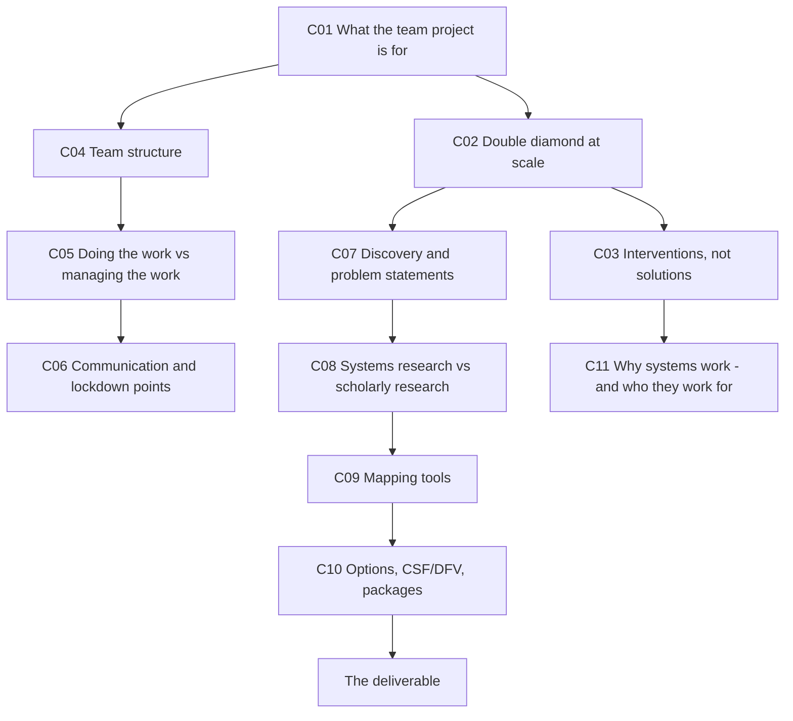

---

## 🎯 L13-C01 · What the Team Project is actually for

> [!question] Cue questions
> - What is the primary skill being tested?
> - How does it differ from the Systems Project?
> - How long is it, and how big is the team?

> [!important] ⭐ The team is the point, not the topic
> > *"**This is called the team project, and that's called that for a reason.** The real focus of this project within the course is to help you develop an understanding of **how to apply the resources of a team, and the collective wisdom and expertise of a team, against a project.**"*
>
> *"We used to call this the **Mini Systems Project**… but it's really important that you think of it as the **team project**, because although it does some of the things we'll do at larger scale in the week-long Systems Project, **the main thing is to help you to do that as a very large team — 35 or so folks**."*

> [!quote] Slide 4 — the stated goals
> - **"Test drive" key systems thinking concepts** by applying them to a real-world wicked problem
> - **Develop awareness of how some systems thinking tools can be applied in practice**
> - Create a starting point for understanding **the complexity of a wicked problem and how to balance stakeholders with very differing perspectives**
> - ⭐ **Appreciate the role and impact of structuring, organizing, and operating high-performing teams**
> - **Consider how resources can be allocated to the project scope**, and how these interact **with a high level of synergy**
> - **Optimise team approaches, roles, and personalities to prepare for the Systems Project**
> - **Focus on high-quality deliverable, but recognising constraints of the brief and time allotted**

> [!important] The constraints
> | | |
> |---|---|
> | **Team size** | **~35 people** |
> | **Duration** | ⭐ **About eight hours** |
> | **Problem** | **Assigned** — *"you're actually going to get the brief on Friday"* |
>
> *"You'll have to figure out **how do you divide up this challenge in a way that will actually be effective** — and **to really limit the scope to the time that you have**."*

*📄 Source: slides 2–4 · transcript*

---

## 💠 L13-C02 · The double diamond, at scale

> [!question] Cue questions
> - What carries over from 303, and what changes?
> - What is the one thing that becomes more important?

> [!important] Same shape, different magnitude
> *"**Fundamentally, what we do in this project is the same at a high level, because we still have a problem space and a solution space.** … So we're doing something very similar. **It's just that the problem space is far more complex.** And the solution space is also complex."*
>
> > ⭐ *"**But it's even more important than that you understand the problem.**"*

> [!important] The one structural difference from 303
> | | **ENGGEN 303** | **ENGGEN 403** |
> |---|---|---|
> | **The problem** | *"You **identified** a problem that you wanted to address"* | ⭐ **Assigned.** *"This is the project that you have been asked to undertake"* |
> | Problem type | *"Relatively **tame** problems — pretty clear problem, constrained set of solutions"* (composting, internships, managing your studies) | **Very wicked** |
> | Stakeholders | *"The key stakeholder is **the user or the customer**"* | *"Much, much more complex"* |
>
> 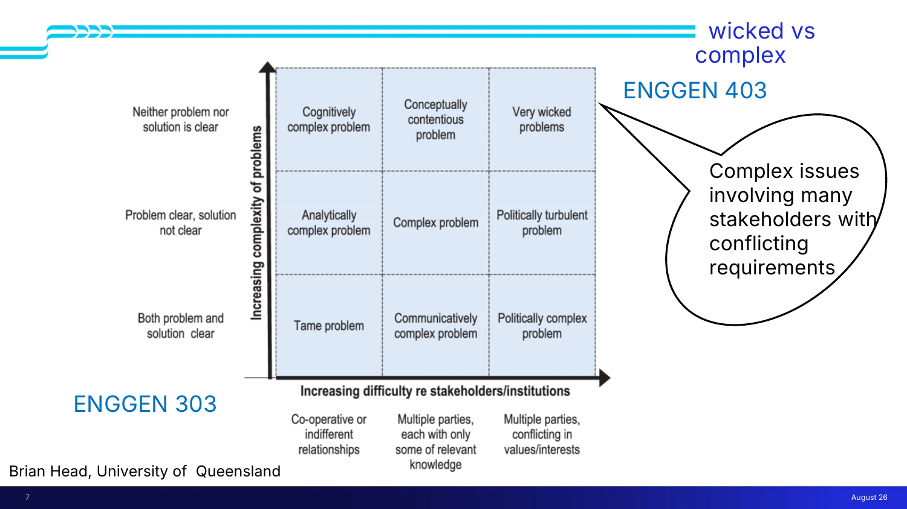
>
> Slide 7 is [[../../Lecture8/notes/L8-notes|L8-C06]]'s **Brian Head matrix** with the two courses plotted on it — 303 bottom-left, 403 top-right.

> [!tip] Don't abandon the 303 foundations
> *"One of the things that sometimes happens is people **lose the foundation on which 403 is built** — the foundation created in 204 and 303… **Don't forget those things.** You still want to actually come up with **problem statements**. Most people will approach this with a **How Might We** statement. You want to have **a structure for ideation**."*

*📄 Source: slides 5–7 · transcript*

---

## 🔧 L13-C03 · Interventions, not solutions

> [!question] Cue questions
> - Why is "solution" the wrong word?
> - What are systems thinking tools *not*?

> [!important] ⭐ The vocabulary correction
> > *"We use this term **solutions**. But in fact, particularly when we look at a wicked problem, **a better description is to say it's an intervention** — because **we're very unlikely to solve a wicked problem. We're only able to influence it, or to shift it, in an attempt to have an impact that's positive.**"*
>
> [[../../Lecture8/notes/L8-notes|L8-C04]]'s *ameliorated but not solved*, converted into a word you should actually use in the report.

> [!warning] ⭐ Slide 12: **"Tools!… Not a Pathway to A Specific Solution"**
> *"**Systems thinking tools are not purely computational.** So you know — get in a bunch of data, you plug it in, you take that response, you put it in the next thing, you do the next step, and **out comes the answer**. **Not at all like that.**"*
>
> > *"These are things that you can use **to better understand the situation and to contemplate choices**. But **it's not something that's going to give you the answer. That's your job within the project itself.**"*
>
> Third statement of this point in the course, after [[../../Lecture8/notes/L8-notes|L8]]'s *"systems thinking is NOT an algorithm or single process"* and [[../../Lecture9/notes/L9-notes|L9]]'s *"it's not going to just spit out at you what your problem statement should be."*

*📄 Source: slides 9–12 · transcript*

---

## 👥 L13-C04 · Team structure

> [!question] Cue questions
> - Is there a correct team structure?
> - Give two worked examples.
> - What is the counter-intuitive difficulty of a 35-person team?

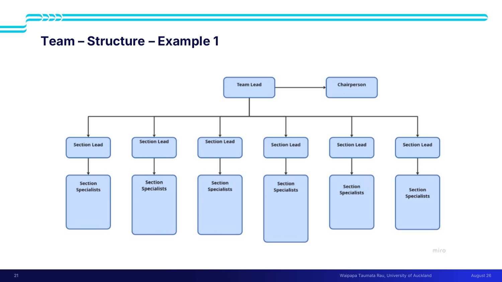

> [!important] Four examples are given, and none is correct
> *"There's **no right way** to do this… **Literally most years, no two teams are the same.**"*
>
> **Example 1** — divided by **the cases**: a **strategic case** group, an **economic case** group, and an **editorial team**. *"Strategic and economic — those people are doing a lot of **research** — and the editorial team is doing a lot of the **writing, proofreading, developing diagrams**."*
>
> **Example 4** (slide 24) — a deeper hierarchy: **sub-team leaders → team members → editors** distributed across every sub-team rather than pooled.
>
> Other structures he has seen: *"teams where people break it up by **research and editing and quality control**."*
>
> 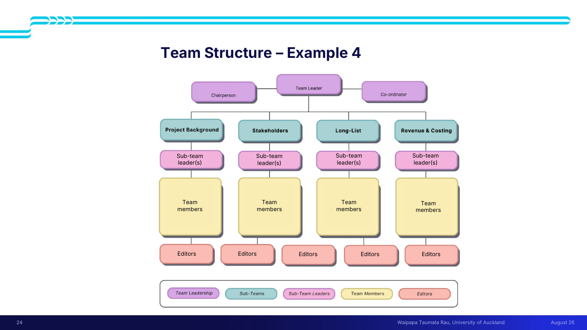

> [!important] ⭐ The counter-intuitive problem — too much resource
> *"I recall a student, probably six or so years ago now… he said: **'I never thought I would be in a situation where I had too much resource.'** He said one of the biggest challenges was figuring out **how to properly divide the work so that you could leverage everyone's expertise and bandwidth, without actually just counting on a handful of people.**"*
>
> *"Most student projects you've done up to this point are relatively small groups. **So part of the challenge is: how are you going to use all these people effectively?**"*
>
> This is [[../../Lecture5/notes/L5-notes|L5]]'s teamwork risk #1 (uneven workload) inverted — the failure mode at 35 people isn't free-riding, it's **under-utilisation**.

> [!tip] Settle the structure **before** the brief arrives
> *"When you meet your team on Thursday, you'll work through how you want to set up that structure. And **it's really important that you do that on Thursday, so that you don't spend a lot of time on that once you actually get the brief.**"*
>
> Juliet's framing of why the Thursday session exists: *"When people get to the team project, they suddenly discover a few things they wish they'd known before — **one of which is who's in their team, what their names are, who's good at what, and how that team's going to function.**"*

*📄 Source: slides 21–24 · transcript*

---

## 🧑‍💼 L13-C05 · Doing the work vs managing the work

> [!question] Cue questions
> - What habit from smaller projects breaks at this scale?
> - What is the failure story, and what should have happened instead?

> [!important] ⭐ The habit that breaks
> *"One of the things we're used to doing… as young people, you're used to **both doing the work and managing the work** — because that's the way things operate when you're doing a group project in a university course."*
>
> > *"**That may not be what you want to do in this project. Just managing a large group of people is itself a very substantial body of work.**"*

> [!example] The all-nighter — a failure of delegation, not effort
> *"I've seen situations where students try to actually do the work. Someone's like, **'well, I'm going to rewrite this, I don't like this, I'm going to rewrite this.'** And we've had team leaders actually — *'oh hey, I'm going to stay up'* — **the one guy literally stayed up all night.**"*
>
> > *"And it's like — **whoa. You didn't need to do that. Leverage your team, get other people to help you, put in some editing processes.**"*
>
> (The student in question *"has a really good job with Apple now"*, which is Peter's way of saying the work ethic wasn't the problem.)

> [!important] It applies at every level, not just the top
> *"If you're dividing up different groups of people with different responsibilities, **even the person leading that [sub-]team may [have] a significant amount of work, and they might be limited on what they can contribute personally to the actual detail of the project. So be sure to balance those things.**"*
>
> **Leading a sub-team is a role, not an addition to a role.**

> [!warning] Drama is expected — navigating it is part of the assessment
> *"This rarely happens without some small amount of drama, sometimes big amounts of drama. **Partly what we want you to learn is how to navigate that drama.**"*
>
> The specific cases he names — all of which map onto [[../../Lecture5/notes/L5-notes|L5]]'s risk register:
> - *"Who's going to do how much work"* → uneven workload
> - *"What do you do if someone gets **bogged down**?"* → dependency on key members
> - *"What if someone is **unwell**?"* → dependency, conflicting schedules
> - *"What if someone **thinks they should be leading the team**, but they just didn't happen to get that role?"* → decision-making conflict
>
> > ⭐ *"**Everyone has to contribute to something that will be inherently imperfect. And that will be true again pretty much the rest of your life.**"*

> [!tip] This is what the team charter was for
> *"You will have in 204 and 303 done these **team charters**. It's one of the things we sometimes get pushback on — *'this is really boring, why are we doing this again?'* **And the answer is in part to prepare you for when you get to this point** — that you've determined **how you're going to handle any conflict**."*

*📄 Source: transcript*

---

## 📣 L13-C06 · Communication and lockdown points

> [!question] Cue questions
> - What changes about shared understanding at 35 people?
> - What must you accept about your teammates' work?
> - What is a lockdown point and why is it needed?

> [!important] ⭐ You will not all be in the room for the problem
> *"In 303, generally any time you were looking at something that substantial, **the whole team was doing it** — 'we're going to get on the whiteboard and look at the problem.' **You may not be able to do that with a team this large and a task this big in the amount of time available.**"*
>
> *"So you may have **a subset of your team develop an understanding of the problem**, and you then have to **communicate that to the rest of the team** — and people will have had **perhaps limited opportunity to give their own input** to the understanding of the problem."*

> [!warning] ⭐ And you have to accept it
> > *"**And by the way, it's not at all uncommon that that would be the case.** In fact, I would say it is common that **in the work you will do in the future, you will be doing just one small piece of it**, and you really have to count on good communication about what other people have done and what assumptions you're starting with."*
>
> > *"**And then you pretty much run from what you're given.** You don't get to say — 'oh wait, hey, that's actually kind of lame, I don't think we should do it that way.' **No. There's just not enough time for that. And also, that's not the way these kinds of projects work. You have to take as a given that your teammates have done good work in other parts of the project.**"*
>
> That is a genuinely uncomfortable instruction and it is deliberate. **At scale, trust replaces consensus.**

> [!important] ⭐ Lockdown points — the mechanism that makes it work
> *"These things are somewhat **sequential**. So you have to figure out: **by when is one activity finished? What gets communicated?** You're going to have to have a **lockdown date or time** — 'as of that point, **we're not changing that any further**, and therefore we're going to get these folks the next period of time.'"*
>
> **Without a lockdown point, a sequential 8-hour project has no way to hand off.** Decide: who owns each stage · when it closes · what gets communicated · on which channel (*"whether you're doing that on Teams or Slack or Discord"*).

*📄 Source: slide 25 · transcript*

---

## 🔍 L13-C07 · Discovery, problem statements, and not mixing the spaces

> [!question] Cue questions
> - What are the five points on the discovery slide?
> - What is the named over-complication risk?

> [!quote] Slide 25 — Discovery and understanding
> - **Understanding the problem, and the systems within which it sits, is vital to creating problem statements**
> - **Remember the basics from 303** — problem statements, "How Might We" structure for ideation, etc.
> - **Systems problems are much more complex than 303 problems, BUT it is still essentially Double Diamonds — on a grand scale!**
> - ⭐ **Don't get lost by overcomplicating the process or mixing the problem and solution space!**
> - ⭐ **Be sure you have determined who/how within the team the Problem will be understood (and how this understanding will be shared!)**

> [!warning] The mixing failure, described
> *"People can get into this — these are very gnarly, wicked problems. And so people will be like, **'oh yeah, maybe we just kind of — doesn't that kind of go with that?'** And you want to actually figure out **what sits where**, and to **overlay that structure on the challenge**, to **really carve out the problem space before getting into solutions**."*
>
> Same warning as [[../../Lecture9/notes/L9-notes|L9-C01]], where teams reached the solution phase on Monday evening and unwound it on Wednesday.

> [!tip] Ideation is a team sport — but maybe not the *whole* team
> *"We talked about **innovation as a team sport**. And that's very important when you get to this ideation stage. **What you have to work out is what part of your team is actually going to be involved in the solution diamond.**"*
>
> *"**Ideally that is done in person** — [but] that may not be possible… **we're not giving you any rooms. Hopefully you can find someplace to hang out.** So you might need to use some digital tools."*

*📄 Source: slide 25 · transcript*

---

## 📚 L13-C08 · Systems research vs scholarly research

> [!question] Cue questions
> - Give all five contrasts.
> - What does systems research actually consist of?
> - What is systems research *for*?

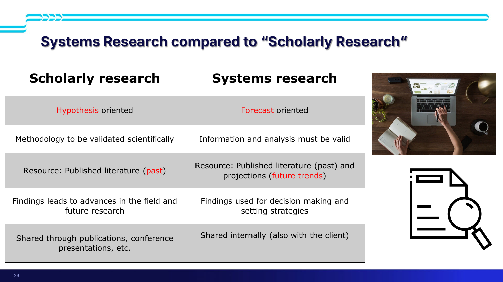

> [!important] ⭐ The comparison (slide 29) — a named learning outcome
> | | **Scholarly research** | **Systems research** |
> |---|---|---|
> | **Orientation** | **Hypothesis oriented** | **Forecast oriented** |
> | **Rigour** | **Methodology to be validated scientifically** | **Information and analysis must be valid** |
> | **Resource** | **Published literature (past)** | **Published literature (past) *and* projections (future trends)** |
> | **Findings** | **Lead to advances in the field and future research** | **Used for decision making and setting strategies** |
> | **Shared** | **Through publications, conference presentations** | **Internally (also with the client)** |

> [!quote] Slide 28 — what systems research is
> *"**A systematic approach to collect data, and analyse the information to:**"*
> - **Uncover the interconnected aspects of wicked problems**
> - **Manage stakeholders with conflicting requirements**
> - **Explore the existing/potential solutions**
>
> ⭐ **"Ultimately to arrive at the informed recommendations."**

> [!example] ⭐ What systems research looks like in practice
> *"When you're doing systems research you're looking at, for instance:*
> - ***how is something regulated by a government department?***
> - ***what industries are impacted by the wicked problem?***
> - ***how do those industries operate?***
> - ***how many jobs do they have?***
> - ***what kind of exports do they have?***
>
> *That's **very different** from scholarly research, **which is more discipline-oriented** — about figuring out what might benefit you in terms of doing things the right way."*
>
> **Systems research asks how the world is arranged. Scholarly research asks what is true.** You are doing the first, in parallel with the second in your Part IV project.

> [!tip] Research sources
> *"We'll give you some research resources… **but don't just take the list we give you and say 'okay, we're good.'** All of you at this point will be pretty experienced as researchers… you're doing things on **Gen AI**, you're doing things the old-fashioned way. **I doubt anyone even goes to the library anymore, but you can still access the databases through the library's website.**"*
>
> ⚠ *"You can use AI tools, **but you need to disclose those**, and do that within the context of the policies already outlined on Canvas."*

*📄 Source: slides 28–29 · transcript*

---

## 🕸 L13-C09 · Mapping tools

> [!question] Cue questions
> - What are cluster maps and interconnected circle maps for, and how do they relate?
> - What does the lecturer say about how these should look?

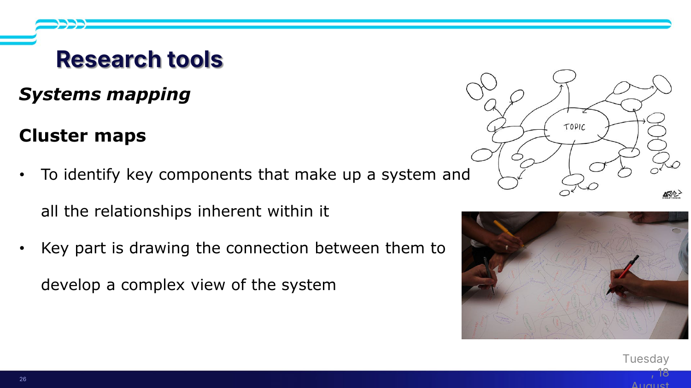

> [!important] Two mapping tools, in sequence (slides 26–27)
> | Tool | Purpose |
> |---|---|
> | **Cluster maps** | *"To identify **key components that make up a system** and **all the relationships inherent within it**. **Key part is drawing the connection between them** to develop a complex view of the system"* |
> | **Interconnected circle maps** | *"**From a refined area identified through the cluster map.** Allows **deep exploration of relationships** — **cause and effect in system dynamics**"* |
>
> 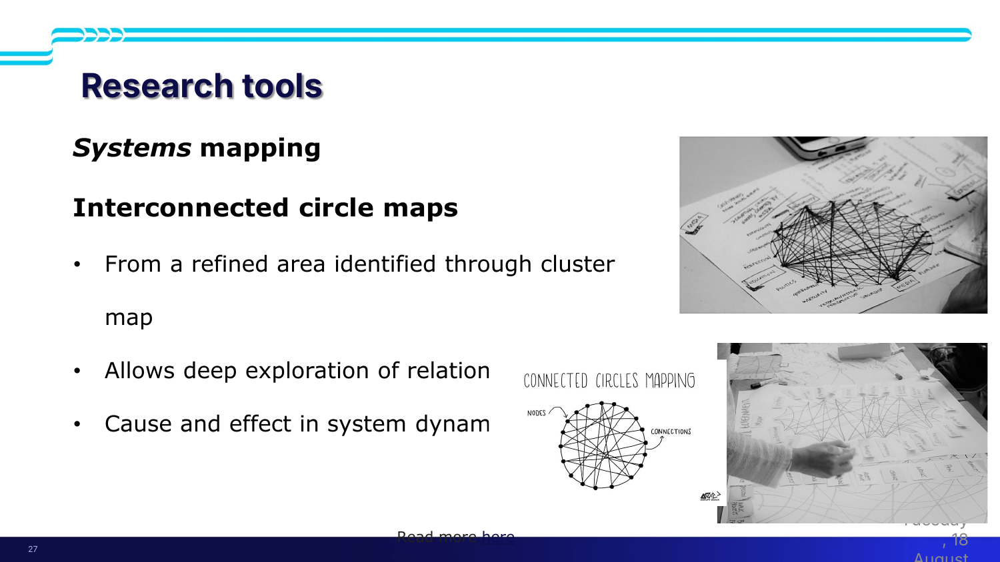
>
> ⭐ **The cluster map is divergent, the circle map is convergent.** You cluster to find the whole system, then pick a region and go deep. That is the double diamond again, applied to mapping.

> [!important] ⭐ Messy is correct
> *"I've had teams where they literally have **a big piece of paper on the wall** and everybody starts contributing, then looking at interfaces in between them. **And generally the messier the better.** These things start out really kind of messy."*
>
> *"You might, over time, recreate a small part of that to use within your deliverable — **or you might actually put it in an appendix**. But **in the beginning, these tools are intended to be really pretty messy.**"*

> [!example] ⭐ The exemplar that broke the rules and did well
> 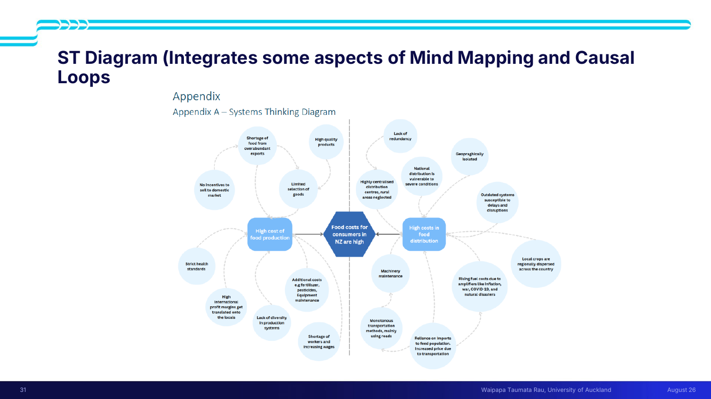
>
> Slide 31 is a past team's diagram, which they called a **systems thinking diagram**. *"What it really does is it **integrates some aspects of mind mapping and causal loops**… **what they did here was a little bit non-standard, but it actually helped them to get to the solution. This team actually did extremely well.**"*
>
> > ⭐ *"**So don't try to take these tools too much as some absolutes.** The goal is to be able to **use them in ways that help what you're doing.**"*
>
> **Permission, from the person marking it, to modify the tools** — provided the modification does work.

> [!tip] Mind mapping as a starting point
> *"One tool is **mind mapping** — something you should consider as **a starting point to the work within your group**. Mind mapping is a great way to understand a problem."* Same further reading as [[../../Lecture9/notes/L9-notes|L9]]: *Using mind maps in agricultural systems*.

*📄 Source: slides 26–27, 30–32 · transcript*

---

## 📦 L13-C10 · Options, CSF/DFV, and packages

> [!question] Cue questions
> - What are the five steps of options assessment?
> - What is a package, and how does it differ from a 303 solution?

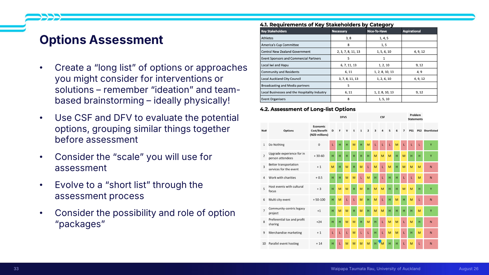

> [!quote] Slide 33 — options assessment
> - **Create a "long list" of options or approaches** you might consider for interventions or solutions — *"remember ideation and team-based brainstorming — **ideally physically!**"*
> - **Use CSF and DFV to evaluate the potential options, grouping similar things together before assessment**
> - **Consider the "scale" you will use for assessment**
> - **Evolve to a "short list" through the assessment process**
> - **Consider the possibility and role of option "packages"**

> [!important] The long list includes the bad ideas
> *"What are **all the many things that you could do — including the crazy ones**?"*
>
> Then: *"For the stakeholders, what are their **key drivers**, their key outcomes… and to look at these in terms of **necessary / nice to have** — same as we did in 303. But you're going to **evaluate those options using the DFV, and also what we've introduced in this course, the critical success factors** — and then [assess] **against the problem statements** you've come up with, and determine whether or not it makes it to the short list."*
>
> ⭐ *"Now, **this is the methodology they chose, but you want to come up with a methodology that works for you that drives to this outcome.**"*

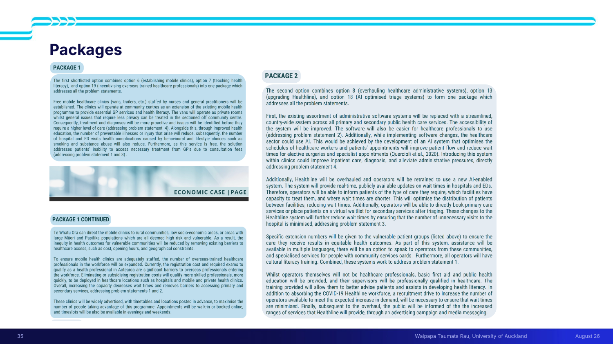

> [!important] ⭐ Packages — the thing 303 never had
> *"A key thing that you wouldn't have been exposed to previously… is what we call **packages**. The work we did in 303 — **you choose a path forward, you choose a solution, and you run with that.**"*
>
> > *"In the case of a systems project, **you may come up with a package of solutions**. So you might use part of what you identified as a good intervention **towards one problem statement**, and then identify **another part of a separate intervention, and combine them**. **So be sure to consider that possibility.**"*
>
> Reinforces [[../../Lecture4/notes/L4-notes|L4-C11]]: *"it is highly unlikely that one option will satisfy all of your CSFs, all of your problem statements."*

> [!tip] Stakeholders
> Slide 34 shows a stakeholder table from a past report: *"**make sure that the stakeholders are captured and you have the appropriate ones.**"* The tools are [[../../Lecture7/notes/L7-notes|L7]]'s.

*📄 Source: slides 33–35 · transcript*

---

## 🏗 L13-C11 · Why systems work — and who they work *for*

> [!question] Cue questions
> - Why do robust systems resist change?
> - ⭐ What is the mistake people make when they call a system "broken"?

> [!quote] Slide 17 (repeated from [[../../Lecture8/notes/L8-notes|L8]])
> **Robust systems tend to work pretty well (and can be hard to disrupt!)** — **resilience · self-organise · hierarchy**
> **To intervene in the system, identify leverage points or causal loops that create impact**

> [!important] ⭐ The reframing — the best idea in the lecture
> *"If you read the **Meadows** material — you were meant to read the first couple of chapters, but if you read the whole thing — one of the interesting things is that **she talks about why systems work**."*
>
> His example: hospital emergency departments *"consistently over capacity… several of the hospitals have hit all-time record [presentations] in the last couple of weeks."*
>
> > ⭐ *"**But in fact, the system has built up over time, and actually on some level works for some of the people.** When we talk about making changes, we have to keep in mind that **this is the accumulation of things that some people consider to be working. Some stakeholder groups are actually happy with the outcomes** — the patients not being one of them, in that case."*
>
> > ⭐ *"**Don't walk into the examination of a system saying 'oh wow, it's a mess and it's broken for everyone.' It's probably only broken for some of its stakeholders.**"*
>
> *"You're trying to change something that is inherently operating in a way that's been **self-organised** — the accumulation of things that people have been doing for a very long time."*

> [!tip] This answers [[../../Lecture9/notes/L9-notes|L9]]'s canvas question
> The problem framing canvas asks ***"does anyone benefit from the problem as a problem?"*** — and this is the general form of the answer. **A persistent system is persistent because someone's needs are met by it.** Identify who, or your intervention will be resisted by forces you never mapped.

> [!important] Every systems challenge has a policy element
> *"**Virtually any systems challenge that we're giving you has a policy element to it.** These are essentially problems that impact the government, as well as perhaps some business and society within the country."*
>
> > *"Juliet spent time on, as she calls it, the machinery of government. **And think about: how can your recommendation navigate that system?** Also think about **where do you actually collect input** to be able to come up with recommendations that are going to be effective."*
>
> Slide 18 reproduces [[../../Lecture10/notes/L10-notes|L10]]'s **policy process** table, complete with the *"or maybe here"* annotation.

> [!example] The Harbour Bridge — a live wicked problem
> *"The government just announced yesterday a somewhat controversial plan to **delay moving forward with a particular solution for the Harbour Bridge**. The transport minister talked about this being a **50 to 100 year decision for New Zealand**, and **the largest infrastructure investment in the history of the country**."*
>
> *"So that's a particularly **wicked** problem — influencing the economy, people's ability to commute, how much economic activity we have. **These are things that are going to have a huge impact on how we live and work, and really represent our values in terms of New Zealand as a country. That's the type of lens you want to take to any systems brief.**"*

*📄 Source: slides 16–18 · transcript*

---

## 📄 The deliverable

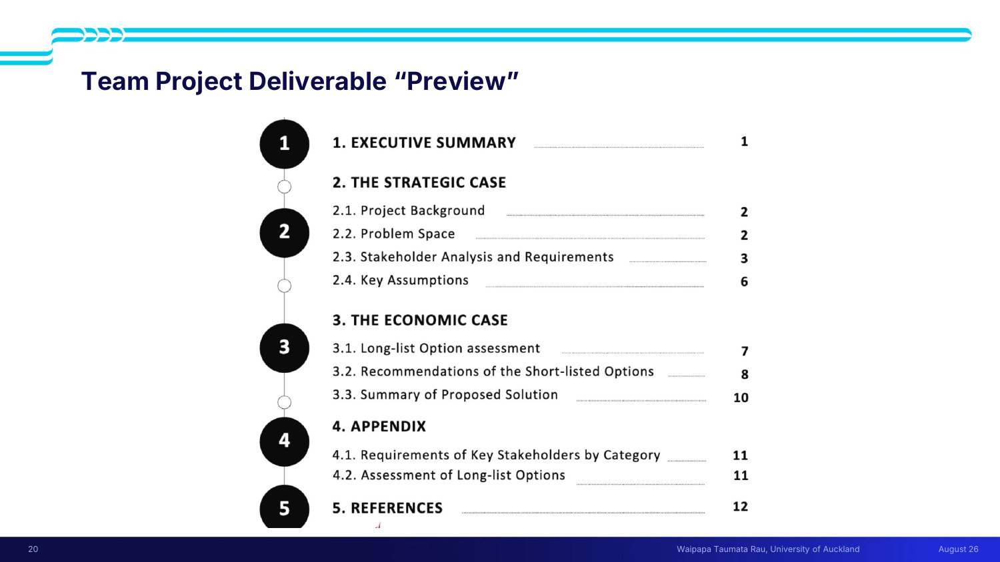

> [!important] ⭐ The structure of a past Team Project report (slide 20)
> | § | Section | Page |
> |---|---|---|
> | **1** | **EXECUTIVE SUMMARY** | 1 |
> | **2** | **THE STRATEGIC CASE** | |
> | 2.1 | Project Background | 2 |
> | 2.2 | Problem Space | 2 |
> | 2.3 | Stakeholder Analysis and Requirements | 3 |
> | 2.4 | Key Assumptions | 6 |
> | **3** | **THE ECONOMIC CASE** | |
> | 3.1 | Long-list Option assessment | 7 |
> | 3.2 | Recommendations of the Short-listed Options | 8 |
> | 3.3 | Summary of Proposed Solution | 10 |
> | **4** | **APPENDIX** | |
> | 4.1 | Requirements of Key Stakeholders by Category | 11 |
> | 4.2 | Assessment of Long-list Options | 11 |
> | **5** | **REFERENCES** | 12 |
>
> ⭐ **Two cases only — strategic and economic.** No financial case, no management case. The Team Project is [[../../Lecture4/notes/L4-notes|L4]]'s five-case framework **truncated to the front half**; the Systems Project adds the rest.
>
> Note also **~12 pages**, and that the **detailed option assessment and stakeholder requirements live in the appendix** — the body carries the argument, the appendix carries the working. Same convention as [[../../Lecture5/notes/L5-notes|L5]]'s CBA appendices.

> [!example] Past team project briefs
> - ⭐ **The America's Cup** — *"New Zealand ultimately chose to allow the America's Cup to be run in Spain last time round, and Italy for the upcoming one, even though we were the challenger of record — even though we won. It did not ultimately make sense, particularly economically, for us to defend it in New Zealand."* The brief: **how can we actually bring the America's Cup back to New Zealand?**
> - **Last year:** *"addressing the invasion of exotic [caulerpa]"* — the species name is garbled in the transcript.

*📄 Source: slides 19–20 · transcript*

---

## ✅ Summary — the 9 things that matter

1. ⭐ **It's the *team* project.** The assessed skill is applying a 35-person team's collective expertise, in **~8 hours**, to an **assigned** wicked problem.
2. **Same double diamond, far more complex problem space** — and understanding the problem matters more, not less. Don't abandon 303's problem statements and How Might We.
3. ⭐ **Say "intervention", not "solution."** And **tools are not a pathway to a specific answer** — *"that's your job."*
4. **There is no correct team structure.** By the cases, by function, by hierarchy — all seen, none preferred. **Settle it on Thursday, before the brief.**
5. ⭐ **The failure mode at 35 people is under-utilisation, not free-riding.** *"I never thought I would be in a situation where I had too much resource."*
6. ⭐ **Managing the work is itself work.** Don't be the team leader who stays up all night rewriting; leverage the team and put editing processes in.
7. ⭐ **At scale, trust replaces consensus.** A subset will understand the problem and communicate it; **you run from what you're given**. Set **lockdown points** so sequential handoffs actually close.
8. ⭐ **Systems research is forecast-oriented, uses projections as well as literature, and produces decisions — not publications.** It asks how the world is arranged; scholarly research asks what is true.
9. ⭐ **A persistent system works for someone.** *"Don't walk in saying it's a mess and broken for everyone. It's probably only broken for some of its stakeholders."*

---

## 🧪 Self-test

> [!question]- 11 free-recall questions
> 1. What is the Team Project actually assessing? Why was it renamed from "Mini Systems Project"?
> 2. What carries over from 303's double diamond, and what are the three things that change?
> 3. Why is "intervention" the better word than "solution"? What does slide 12 warn about tools?
> 4. Give two different team structures used by past cohorts. Which is correct?
> 5. What did the student mean by "I never thought I would be in a situation where I had too much resource"?
> 6. What is the difference between doing the work and managing the work at this scale? Give the failure story.
> 7. You didn't help define the problem and you think the framing is weak. What are you told to do, and why?
> 8. What is a lockdown point, and what breaks without one?
> 9. Give all five contrasts between systems research and scholarly research. What does systems research actually consist of?
> 10. Distinguish a cluster map from an interconnected circle map. What is said about how they should look, and what does the non-standard exemplar prove?
> 11. Why do robust systems resist change? What is the mistake people make when calling a system broken, and how does it connect to L9's framing canvas?

---

> [!info]- Related notes
> - `L13-summary.md` · `L13-flashcards.tsv` · `../context/admin-and-dates.md`
> - **Reviews:** [[../../Lecture8/notes/L8-notes|L8 — tools, leverage points, causal loops]] · [[../../Lecture9/notes/L9-notes|L9 — problem statements]] · [[../../Lecture4/notes/L4-notes|L4 — options, CSF/DFV, packages]] · [[../../Lecture10/notes/L10-notes|L10 — the policy process]] · [[../../Lecture7/notes/L7-notes|L7 — stakeholders]]
> - **Feeds:** the **Team Project** (week 6) and then **Systems Week**
