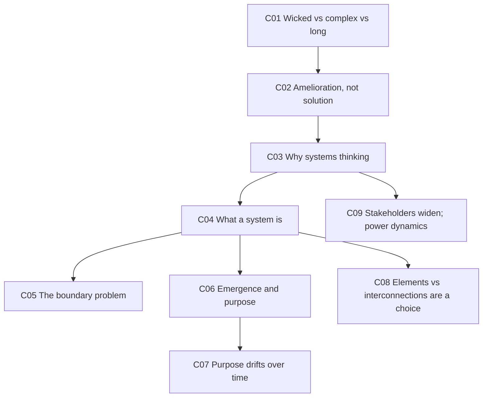
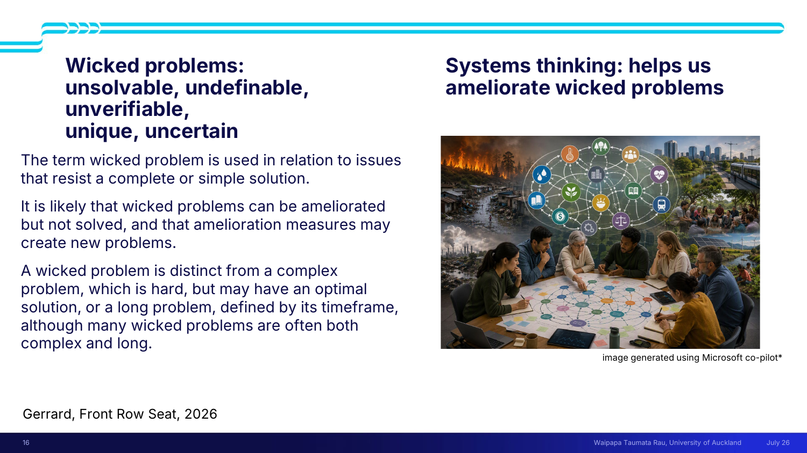
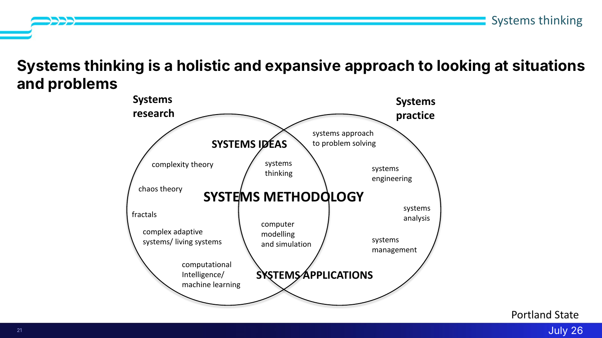
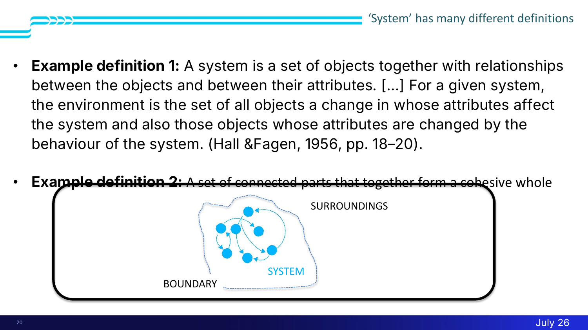
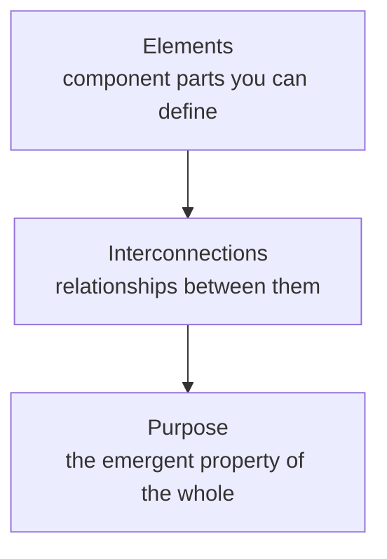
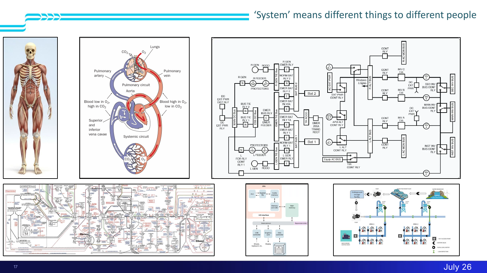

# 🕸 Lecture 2 — An introduction to systems thinking

> [!abstract] Why this matters
> After this lecture you can classify a problem as **simple, complex, long, or wicked** — and say why that classification changes what counts as success. You can state what makes something a **system** (elements, interconnections, purpose), and you can explain why **where you draw the boundary** is the decision that shapes everything downstream.
>
> This is the framework the entire course sits inside. Every tool taught later is a tool *within* this frame.

> [!info] Sources
> **Slides:** `ENGGEN_403_Lecture_02_2026_final.pdf` — 26 pages. Presented by Amanda di Ienno (admin) and Juliet Gerrard (content).
> **Transcript:** 416 lines, auto-generated, quality good.
>
> *Prerequisites: [[../../Lecture1/notes/L1-notes|L1]] — especially L1-C01 (real problems aren't pre-framed) and L1-C12 (the honeycomb).*

> [!warning] Named but not yet delivered
> The lecturer repeatedly defers: **"we'll go more into this in lecture eight."** This lecture gives *definitions and framing*; the **tools** (intervention points, causal mapping) come later. Don't expect to be able to *do* systems thinking after this — only to recognise the territory.

## 🗺 Concept map

---

## 😈 L2-C01 · Wicked problems — and how they differ from complex and long ones

> [!danger] `priority: high` — this is the framing device for the whole course

> [!question] Cue questions
> - Give the five "un-" adjectives from the slide.
> - Distinguish wicked from complex, and from long. Give an example of each.
> - Who originated the term, and when?

### In plain language

Some problems are just *hard* — big, fiddly, lots of moving parts — but there is a right answer at the end if you're clever and patient enough. Others have no right answer at all, and every fix you attempt spawns new problems. Those are wicked. Confusing the two wastes years.

### Precisely

> [!quote] Slide 16
> **Wicked problems: unsolvable, undefinable, unverifiable, unique, uncertain**
>
> "The term wicked problem is used in relation to issues that resist a complete or simple solution. It is likely that wicked problems can be **ameliorated but not solved**, and that amelioration measures **may create new problems**.
>
> A wicked problem is distinct from a **complex problem**, which is hard, but may have an optimal solution, or a **long problem**, defined by its timeframe, although many wicked problems are often both complex and long."
>
> — *Gerrard, Front Row Seat, 2026*

**Origin:** Rittel and Webber, **1973** — who set out **ten characteristics** of wicked problems that "everybody goes back to."
> ⚠️ Transcript renders them as *"Writtel and Webb"*. The standard citation is **Rittel & Webber**. The ten characteristics were **not** listed in this lecture.

### The three-way distinction

| Type | Defined by | Has an optimal solution? | Example given |
|---|---|---|---|
| **Complex** | Many interacting parts; hard | **Yes** — with the right modelling, tools and inputs | **The City Rail Link** — testing air con, alarms, capacity, passenger-flow optimisation. *"A hugely complex problem, but it will have a pretty easy to access optimal solution."* |
| **Long** | Its **timeframe** | Maybe | Climate change; social issues that outlast governments and quarterly reports |
| **Wicked** | Resists complete/simple solution; fixes spawn new problems | **No** | Optimising water for a small-population country with a large landmass |

> [!important] Why "long" is its own category
> *"Western society in particular is set up to solve **short-term** problems, not long-term problems."* A long problem needn't be wicked — it may just outrun the institutions meant to handle it (electoral cycles, quarterly reporting).
>
> But: *"most of the wicked problems we'll be thinking about in this course will be **both complex and long**."*

> [!example] Worked example — renewables (from the room)
> Problem: over-dependence on fossil fuels. Attempted fix: shift to renewables. New problems generated:
> - **Jobs lost** in incumbent industries
> - **Intermittency** — renewable supply depends on weather, so you need **storage**
> - Storage → **batteries** → lithium toxicity, disposal, safety, sustainability
> - Batteries are **hard to recycle** — components are "muddled up", and it costs more to recover critical minerals than to mine them
> - **Supply chain logistics** for critical minerals
>
> *"That's a really good example of trying to solve one problem and creating a whole pile of other problems."*
>
> Notice the shape: the fix didn't fail. It worked, **and** it produced a new problem set. That's the wicked signature.

> [!warning] Common traps
> - Using "wicked" as a loose intensifier. *"Wicked problem isn't a loose term. It's not just a random adjective."*
> - Calling something wicked when it's merely complex. The test is whether an optimal solution is reachable in principle.
> - Assuming wicked problems are unimportant because they're unsolvable — the opposite: *"some of the most important issues you might tackle in your careers are going to be in the wicked problem camp."*

*📄 Source: slide 16 · transcript — wicked problems section*

---

## 🩹 L2-C02 · Amelioration, not solution

> [!question] Cue questions
> - What replaces "solve" as the goal? What does success look like?

### In plain language

You don't finish a wicked problem. You move it. Success is shifting the system in a better direction, knowing you'll create some new mess doing it.

### Precisely

Wicked problems can be **ameliorated but not solved**, and amelioration measures **may create new problems**.

The reframed goal, from the transcript:
> "Find ways, above all, to **frame the problem** so that you can do something manageable to **shift the system in the right direction**, even if you can't effect a complete solution."

And later, the shape of a recommendation:
> "We've really understood the system. We think we've understood it well enough to **predict its behaviour**. We recommend you do this and it'll **shift the system to here**."

> [!tip] What this changes about your deliverable
> You are not asked to produce *the answer*. You are asked to produce a defensible **intervention** plus a prediction of its effect. That's a different kind of claim, and a different kind of evidence.

*📄 Source: slide 16 · transcript — throughout*

---

## 🧭 L2-C03 · Why systems thinking, and what it provides

> [!question] Cue questions
> - What three things does systems thinking provide?
> - Where does systems thinking sit relative to systems research and systems practice?

### Precisely

**The stated reason for framing the whole course this way:** *"systems thinking helps us to attack and hopefully **ameliorate** wicked problems."*

Slide 19: **'Systems' thinking provides context, language and tools.**

| Provides | What it means here |
|---|---|
| **Context** | A frame to think in as a team |
| **Language** | Shared vocabulary for relationships, flows, boundaries |
| **Tools** | Methods — *"some of them will be useful, some of them won't"* |

### The Portland State map — read the overlap

Two circles: **Systems research** (left) and **Systems practice** (right).

| Region | Contents |
|---|---|
| Research only | complexity theory · chaos theory · fractals · complex adaptive / living systems · computational intelligence / machine learning |
| **Overlap = SYSTEMS METHODOLOGY** | **systems thinking** · computer modelling and simulation |
| Practice only | systems approach to problem solving · systems engineering · systems analysis · systems management |

Labelled bands: **SYSTEMS IDEAS** (upper) and **SYSTEMS APPLICATIONS** (lower).

> [!important] Two things the diagram encodes
> 1. **Systems thinking sits in the overlap** — it is neither pure theory nor pure practice.
> 2. **"Systems methodology captures the whole lot."** The lecturer's licence: *"when we say that's what you're using for your team project and your system project — go for your life. If there's tools in there that are useful, then they're completely in scope."*

> [!note] Systems methodology, defined (slide 23)
> *"A process that uses a **diverse group** along with systems thinking tools to get from **initial chaos** to an **agreed preliminary definition of the problem** we are trying to resolve, and that then takes steps to develop an improvement or 'solution.'"*
>
> Note the sequencing: agreeing what the problem *is* comes before improving it. And note "solution" is in scare quotes.

### The definitions of systems thinking — pick one that works

The lecturer's explicit instruction: *"You don't need to know them all. You just need to find the one that **gels** for you."*

> [!quote]- Four framings offered (click to expand)
> **As a mindset** — "Systems thinking is a holistic way to investigate factors and interactions that could contribute to a possible outcome. **A mindset more than a prescribed practice**, systems thinking provides an understanding of how individuals can work together in different types of teams and through that understanding, create the best possible processes to accomplish just about anything." (Morganelli, 2024)
>
> **As a philosophy** — "The discipline of systems thinking is more than just a collection of tools and methods — it's also an **underlying philosophy**." — Michael Goodman, Systems Change Institute, *Fifth Discipline Fieldbook* (2004)
>
> **As operations research** — "Systems Thinking is **Soft Operations Research**." The lecturer's gloss: *"it's how are you going to get stuff done?"*
>
> **As a skill set** — "Systems thinking is a set of **synergistic analytic skills** used to improve the capability of **identifying and understanding systems, predicting their behaviours, and devising modifications to them in order to produce desired effects**. These skills work together as a system." (Arnold and Wade, 2015)
>
> Also noted: some people treat **the team solving the problem as itself a system** — *"you are creating a system to solve a systems problem"* — worth testing whether you're optimising how you work.

> [!important] Why Arnold & Wade is the most operationally useful
> It names three capabilities in sequence: **identify/understand → predict behaviour → devise modifications**. That's exactly the shape of the deliverable ([[#🩹 L2-C02 Amelioration not solution|C02]]).

*📄 Source: slides 19, 21–24 · transcript — definitions section*

---

## 🧱 L2-C04 · What makes something a system

> [!danger] `priority: high` — the lecturer gives this as an explicit checklist

> [!question] Cue questions
> - State the three things every system must have.
> - What is the check for "have I over-simplified?"

### In plain language

Three ingredients. Parts. Connections between the parts. And something the whole thing is *for*. Take away any one and you've got a list, not a system.

### Precisely

**The lecturer's preferred definition** — she says so explicitly:
> **A system is a set of connected parts that together form a cohesive whole.**
>
> *"I think that captures all the key elements, and it forces you to think about these issues, which are absolutely critical."*

**The formal alternative** (Hall & Fagen, 1956, pp. 18–20):
> "A system is a set of objects together with relationships between the objects and between their attributes. […] For a given system, the environment is the set of all objects a change in whose attributes affect the system, and also those objects whose attributes are changed by the behaviour of the system."
>
> Her verdict: *"very clunky and hard to keep in your head"* — but useful as a **checklist** when scoping: *"what have I got in my system? What's out of my system? What's in the environment?"*

### The three common features

> [!important] The over-simplification check
> > "Sometimes people land on a solution and they're very happy… but then they realise they've **simplified it too much and it's not really a system anymore**."
>
> **Run this check:** Do I have *elements I can define*? Are they *interconnected*? Do the interconnections *change the properties*? Does the overall system have a *purpose*?
>
> If any answer is no, you've flattened the problem into something easier — and you're no longer solving the one you were given.

*📄 Source: slide 20 · transcript — system definition section*

---

## 🚧 L2-C05 · The boundary problem

> [!danger] `priority: high` — described as "always" the key issue

> [!question] Cue questions
> - Why is the boundary the critical decision?
> - What's the project-management synonym?

### In plain language

Every system has an inside and an outside, and *you* decide where the line goes. Draw it too tight and you've solved a fake problem. Draw it too wide and you can't hold it in your head. There's no correct answer — only a defensible one.

### Precisely

> [!quote]
> "However you've defined your system, you will have a system and you will have things that are outside the system… **the key issue is always going to be the boundary. What are you going to consider? What are you not going to consider? How are you going to decide what to leave in and what to leave out?**"

**Project-management synonym:** in scope / out of scope. *"It doesn't matter [what you call it]."*

**The slide's diagram:** three nested labels — **SURROUNDINGS** (outermost), **BOUNDARY**, **SYSTEM** (innermost).

> [!example] Two worked boundary decisions
> **The metabolic map** (her PhD): do I draw the boundary around lysine biosynthesis? Amino acid biosynthesis? Do I include glucose metabolism? *"Should I bring in the dreaded Krebs cycle?"*
>
> **New Zealand's water systems:** fresh water, wastewater, stormwater are *"three separate systems, but they all connect."* Optimise clean taps + safe waste disposal + no flooding, and you may need all three. Live near an estuary and you may need **seawater** too — *"high tide tends to lead to surges, which tends to lead to more floods."*
>
> Her framing of the real constraint: *"**How big a problem can we actually keep in our heads**, and how much of it can we move forward and take a bite off?"*

> [!tip] It's a judgement, not a discovery
> The boundary isn't waiting to be found. You choose it, and you defend the choice. That's why scoping is a systems-thinking act and not an administrative one.

*📄 Source: slide 20 · transcript — boundary section*

---

## ✨ L2-C06 · Emergence — and why "purpose" is the same idea

> [!question] Cue questions
> - Define an emergent property.
> - Why do two different words exist for it, and does the difference matter?

### In plain language

Put the parts together and the whole starts doing something none of the parts do on their own. That "something" is either called an emergent property or the system's purpose, depending on who's writing.

### Precisely

> [!quote]
> "The whole is greater than the sum of the parts. When you put all the parts together, **properties emerge that you might not have predicted from the individual components**. And they are dependent on not just the components, but **the relationships between the components**, and to an extent the inputs and outputs."

**Terminology:** *"Some people would refer to them as **emergent properties** because they emerge from the whole, and other people would call it the **purpose** of the system. You'll see both sorts of nomenclature, and that's fine."*

> [!example] The same system, different purposes — the musculoskeletal example
> This is the sharpest illustration in the lecture:
>
> | Who's looking | What they take the purpose to be |
> |---|---|
> | A biologist | A simple anatomical problem; emergent property = **movement and motion** |
> | A sports physiotherapist | The purpose is **to run faster** |
> | An athletics coach | Which muscle to strengthen, which ligament not to snap, **to make that person run as fast as possible** |
>
> Same elements. Different purpose, because a different observer framed it. **Purpose is assigned by the framing, not discovered in the parts.**

**Other examples shown** (slide 17): cardiovascular system · aircraft electrical schematic · the metabolic map · computer architecture · a water distribution network. The point of showing six wildly different domains: *"'System' means different things to different people."*

**On nesting:** the cardiovascular system is *"a self-contained system… but obviously it doesn't work on its own. It sits in the body. And if you were to zoom down, you'd find lots of these molecules in the metabolic map."* Systems nest — which is exactly why the boundary ([[#🚧 L2-C05 The boundary problem|C05]]) has to be chosen.

*📄 Source: slide 17 · transcript — systems examples section*

---

## ⏳ L2-C07 · The purpose of a system drifts over time

> [!question] Cue questions
> - Give the worked example. What's the general warning for scoping?

### In plain language

Systems don't necessarily keep doing what they were set up to do. Given enough time, an organisation's real purpose can quietly become "continue existing."

### Precisely

> [!example] Research institutes becoming the thing they were built to fix
> Some NZ research institutes were set up **to break down silos** — bringing people from different disciplines and parts of the country together for collaborative research. That's their purpose.
>
> *"If you let them go for too long, their purpose shifts a little bit. They already exist, they've got their own identity, and suddenly their purpose becomes **to keep getting funding to do what they're doing as an institute**."*
>
> **"So they become the silo."**

> [!important] The scoping warning
> *"The purpose of a system can change over time, and that's something to be mindful of when you're doing your scope. The purpose that you **think** the system was set up for might not be the purpose that the system **ended up with**."*
>
> So: read purpose off current behaviour, not off the founding documents.

*📄 Source: transcript — purpose section (credited to videos posted on Canvas)*

---

## 🔄 L2-C08 · What counts as an element vs an interconnection is your choice

> [!question] Cue questions
> - Describe the metabolic map inversion. What did it achieve?

### In plain language

You get to decide which things are the nodes and which are the links. Swapping them can make an impossible diagram tractable.

### Precisely

> [!example] Turning the metabolic map inside out
> **Conventional layout:** elements = **molecules**; interconnections = **enzymes** (which convert one molecule into another).
>
> Why it's drawn that way: *"historical, because we found the molecules before we found the enzymes."* — i.e. the standard representation encodes discovery order, not analytical usefulness.
>
> **The inversion** (University of Canterbury, biochemists + systems thinkers): make **enzymes the elements**, and **molecules the interconnections** — "signals between the enzymes."
>
> **Result:** *"the whole complexity of the metabolic map **shrank**, because lots of the enzymes clustered together, and you only needed a few signals to understand it."*

> [!important] The generalisable move
> *"Depending on your system, **how you define your elements and your interconnections** might help you move forward."* And: *"it's always worth having someone in the group throw around a few crazy ideas in the corner."*
>
> If your system diagram is unmanageably tangled, one legitimate response is to swap what you're treating as nodes and what you're treating as edges — before concluding the problem is too big.

*📄 Source: transcript — metabolic map section*

---

## 👥 L2-C09 · Stakeholders widen, and power dynamics matter

> [!question] Cue questions
> - How does the stakeholder set change from ENGGEN303 to 403?
> - Name three kinds of power that operate in a government-level system.

### In plain language

Last year "stakeholders" meant a business and its customers. This year it means everyone with a stake in a national problem — and they want incompatible things. That's not a complication in the problem; it *is* the problem.

### Precisely

| | ENGGEN303 | ENGGEN403 |
|---|---|---|
| The system | A **business and its stakeholders**, usually customers | Big, gnarly, **wicked problems** needing a wider systems view |
| Stakeholders | Customers, suppliers, manufacturers, shareholders, the board | General public · local and central **government** · businesses · **NGOs** · **iwi** · immigrant communities |
| Their positions | Broadly compatible | *"It is likely that they all want **different and potentially contradictory** things"* |

> [!important] Contradiction is diagnostic
> *"It's likely that all your stakeholders are not saying the same thing. **Otherwise it wouldn't be a wicked problem** — it would be a simple problem to solve."*
>
> If every stakeholder agrees, check whether you've drawn the boundary too tightly.

**Power dynamics** — slide 19: *"Relationships, power dynamics, interconnections and flows will all be important."* Types named:

- **Structural power** — ministers, local mayors
- **Influence without formal power** — lobbyists ("who maybe nobody listens to, or everybody listens to"), the media
- **Affected but powerless** — *"communities that don't have much power, but upon whom the difference that you make will have a huge impact"*

> [!warning] Why this decides whether your work lands
> *"How all those power relationships interconnect will be critical to whether your recommendations move the problem forward, or **just get it caught up in a big fight** when your recommendations land."*

**Cross-disciplinary requirement:** *"Solving problems like this requires collaboration across disciplines — as engineers you will have a useful skill set, **but not the only skill set**."* (The [[../../Lecture1/notes/L1-notes#🔤 L1-C02 The T-shaped engineer|T-shape]] claim again.)

> [!tip] What the process will feel like — say it out loud now
> The lecturer's honest description of the first days of a systems project:
> - *"There will be loads of ambiguity. You will have to deal with ambiguity."*
> - **Fast thinkers** jump to a solution — which may be perfect, or may have missed a great deal.
> - **Quiet thinkers** sense something's missing but need time to articulate it. *"The first thing is, we're going to have to take a breath and listen to the people who've done more deep thinking [and] come in later."*
> - *"You're all going to have to get used to making progress, then realising there's a fundamental flaw in your thinking, and doing a reset."*
> - **Time-box the chaos:** *"The last thing you want to do is spend the whole week arguing about how to frame your problem statements."*
>
> And the calibration line, echoing [[../../Lecture1/notes/L1-notes#🎢 L1-C08 The discomfort zone — where learning actually happens|L1-C08]]:
> > **"If it's not making your head hurt, you're not thinking about it hard enough."**

*📄 Source: slides 18–19 · transcript — stakeholders and power section*

---

## ✅ Summary — the 7 things that matter

1. **Wicked ≠ complex ≠ long.** Complex is hard but has an optimal solution (City Rail Link). Long is defined by timeframe. **Wicked resists complete solution and generates new problems when you intervene.** Most course problems are wicked, complex *and* long.
2. **The goal is amelioration, not solution** — frame the problem so you can shift the system in the right direction.
3. **A system = a set of connected parts that together form a cohesive whole.** Three features: **elements, interconnections, purpose.**
4. **The boundary is always the key issue** — you choose it, you defend it, and the real constraint is how much you can hold in your head.
5. **Emergent property = purpose**, and it depends on who's framing. Same musculoskeletal system, three different purposes.
6. **Purpose drifts** — institutes built to break silos become silos. Read purpose off behaviour, not intent.
7. **Stakeholder contradiction is diagnostic of wickedness**, and power dynamics decide whether recommendations land or start a fight.

---

## 🧪 Self-test

> [!question]- 11 free-recall questions
> 1. Give the five "un-" adjectives applied to wicked problems.
> 2. Classify each: the City Rail Link; climate change; NZ's three waters. Justify each.
> 3. Why does the renewables example count as *wicked* rather than merely complex? Be specific about the mechanism.
> 4. Your team says "we've solved it." Give two checks from this lecture that would test that claim.
> 5. State the lecturer's preferred definition of a system, and the three common features.
> 6. Why is the Hall & Fagen definition still useful despite being "clunky"?
> 7. A team scopes a stormwater problem to a single suburb's drains. What has that boundary choice bought them, and what has it cost?
> 8. Explain how the same musculoskeletal system has three different purposes. What does that tell you about where purpose comes from?
> 9. Describe the metabolic map inversion and what it achieved. When would you reach for that move?
> 10. All your stakeholders agree on the problem. Why is that a warning sign?
> 11. Name three kinds of power in a government-level system, and say why the third matters most ethically.

---

> [!info]- Related notes
> - `L2-summary.md` · `L2-flashcards.tsv`
> - `../context/admin-and-dates.md` — quiz dates, GenAI lanes, assessment logistics
> - [[../../Lecture1/notes/L1-notes|L1 — mindset, grit, T-shape]] · [[../../Lecture3/notes/L3-notes|L3 — science/engineering/government interface]]
> - **Required reading:** *Thinking in Systems* (Meadows) — first two chapters, ahead of Lecture 8.
