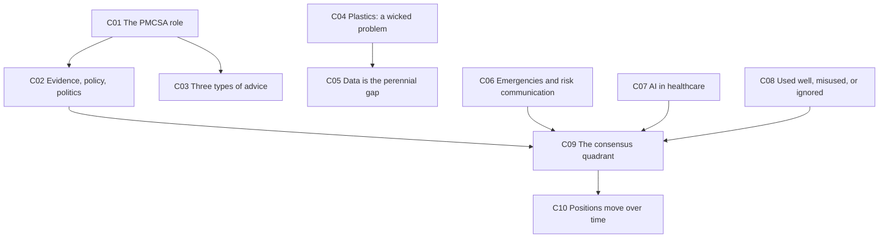
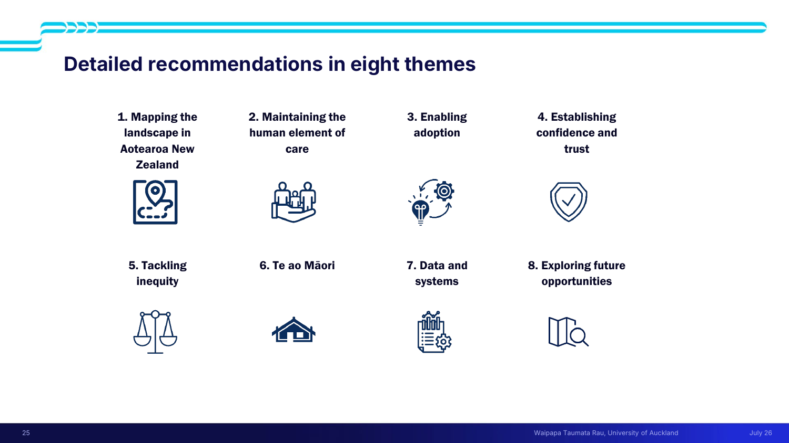
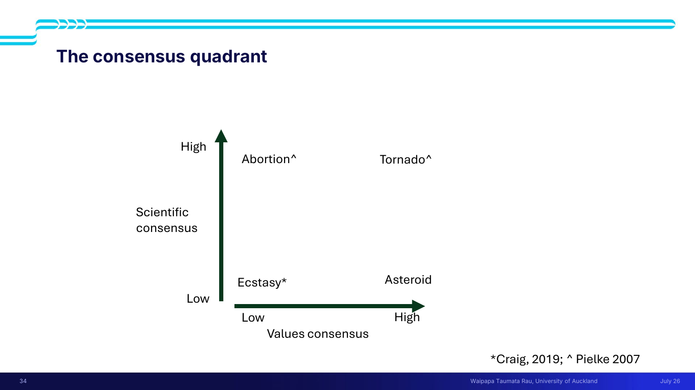
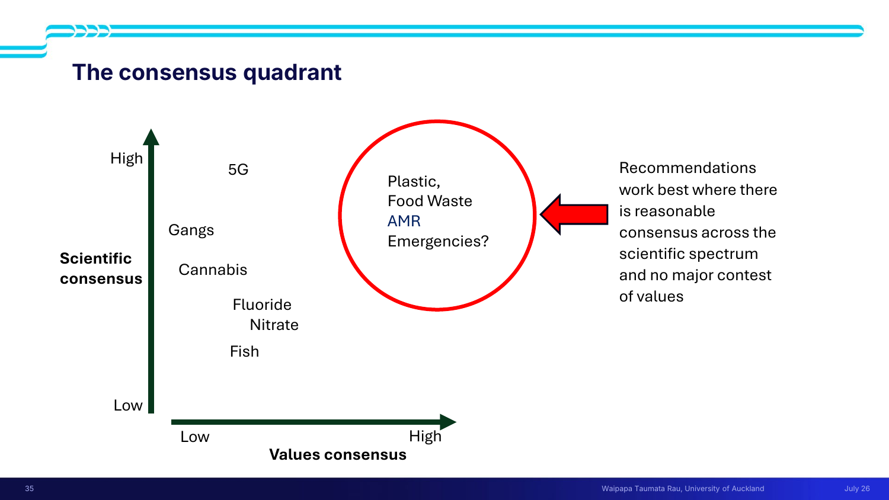
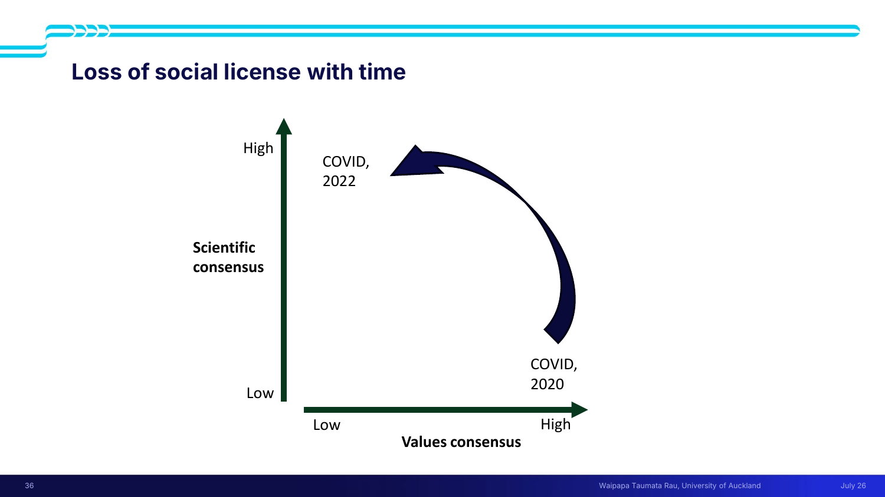
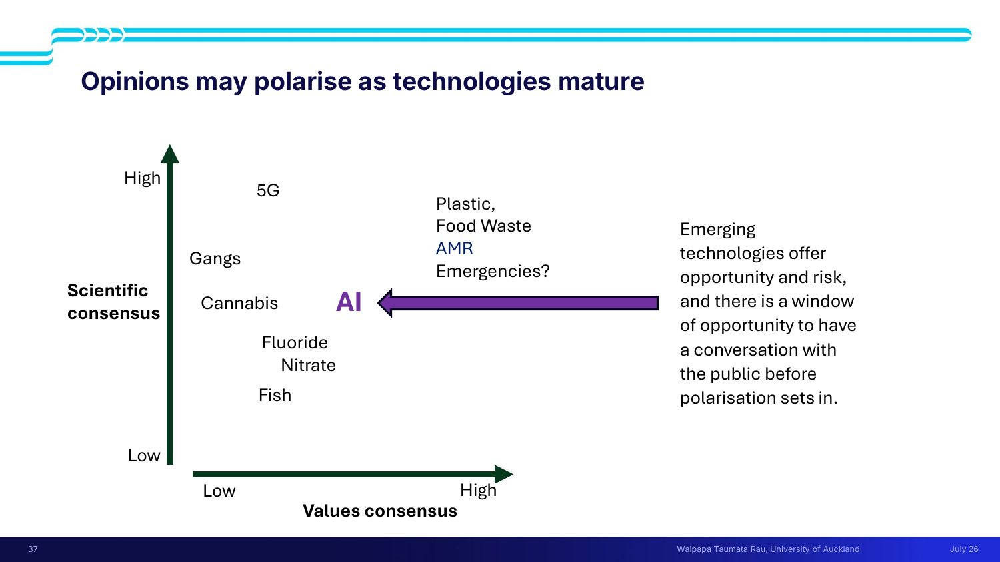

# 🏛 Lecture 3 — Interface of science, engineering and government

> [!abstract] Why this matters
> After this lecture you can use the **consensus quadrant** to predict whether technical advice will land or blow up — and adjust what you recommend accordingly. That is one of the two stated learning outcomes, and it is the single most portable tool in the lecture.
>
> The three case studies exist to show the same lesson three times: **good technical work is necessary and nowhere near sufficient.**

> [!info] Sources
> **Slides:** `ENGGEN_403_Lecture_03_2026_final (1).pdf` — 38 pages. Juliet Gerrard, drawing on 2018–2024 as **PM's Chief Science Advisor (PMCSA)**.
> **Transcript:** auto-generated, quality good.
>
> *Prerequisites: [[../../Lecture2/notes/L2-notes|L2]] — wicked problems and amelioration are used throughout without re-explanation.*

> [!quote] Stated learning outcomes
> - Appreciate the **complexity of providing technical advice to Government** in different settings
> - **Use the consensus quadrant** to support an understanding of how **values and scientific consensus** play a role in understanding how to use evidence in policy decisions

## 🗺 Concept map

---

## 🎓 L3-C01 · The PMCSA role — what technical advice into government actually is

> [!question] Cue questions
> - What did the PMCSA do, and for whom?
> - Why does this matter for your project?

### Precisely

> [!quote] Slide 5
> "The Prime Minister's Chief Science Advisor (PMCSA) provided **independent** advice to the Prime Minister on science **in its very broadest sense**."
>
> Including: "advising on specific matters relating to science for the Prime Minister or other Ministers — either informally or in formally commissioned reports **(the sort of thing you will be asked to do in your projects)**."

That parenthesis is the point of the whole lecture: your team and systems projects are modelled on this.

**There is a whole network of Chief Science Advisors**, not just the PM's — across Business Innovation and Employment, Conservation, Education, Emergency Management, Environment, Health, Housing & Urban Development, Justice, Primary Industries, Public Service Commission, Regional and Unitary Councils, Transport, Treasury, Social Development, and the Environmental Protection Agency, plus co-opted members.

> [!tip] Why the network matters
> Technical advice into government isn't one channel. Knowing which advisor owns which domain is part of knowing how a recommendation actually travels.

*📄 Source: slides 5–6 · transcript*

---

## ⚖️ L3-C02 · Evidence, policy, politics — what science can and can't do

> [!danger] `priority: high` — eight bullets that frame everything else

> [!question] Cue questions
> - What are science's two strengths and one structural weakness here?
> - Why doesn't presenting the facts work?
> - What is the warning about proxy debates?

### In plain language

Science is good at working out *what the problem is* and *what your options are*. It is bad at producing a definite answer by Thursday — which is exactly what a politician needs. And handing people facts almost never changes their mind, because most disagreements aren't about facts.

### Precisely

> [!quote] Slide 7 — verbatim
> - Science is **never the only advice**
> - Science is good at **defining the problem**
> - Science is good at **identifying options**
> - Science **struggles with definitive timely answers**
> - Politicians have to make decisions in **defined timeframes**
> - **Policy makers need to bridge the divide**
> - Presenting the **"facts" rarely changed anyone's mind**
> - **Science debate should not be a proxy for values debate**

| The tension | Science | Politics |
|---|---|---|
| Output | Options, with uncertainty | A decision |
| Timing | When the evidence is ready | By a defined deadline |
| Bridged by | — | **Policy makers** |

> [!important] The last bullet is the one that recurs
> **"Science debate should not be a proxy for values debate."** When people can't argue about values openly, they argue about the evidence instead — and the evidence gets damaged in the process. This is the failure mode the [[#🎯 L3-C09 The consensus quadrant|consensus quadrant]] exists to diagnose.

> [!note] Note the scare quotes
> The slide writes "facts" in quotation marks. Combined with *"rarely changed anyone's mind"*, the claim isn't that facts don't matter — it's that **delivering** them is not a persuasion strategy.

*📄 Source: slide 7 · transcript*

---

## 📋 L3-C03 · Three types of advice

> [!question] Cue questions
> - Name the three types. What distinguishes the first two?

### Precisely

| Type | Contains recommendations? | Trigger | Examples |
|---|---|---|---|
| **Proactive with recommendations** | ✅ Yes | Commissioned by the PM or Ministers | plastics · commercial fisheries · antimicrobial resistance · food waste · AI in healthcare — *"major reports with expert panels and reference groups"* |
| **Proactive, public-facing explainers** | ❌ **No** | Public need for understanding | 5G · cannabis · fluoride · nitrate |
| **Reactive** | — | A crisis | mosque shooting · Whakaari White Island · COVID-19 |

> [!important] Why explainers deliberately withhold recommendations
> The explainer topics (5G, cannabis, fluoride, nitrate) are exactly the ones that sit in **contested-values** territory on the quadrant. Where values are contested, making recommendations invites the science to be attacked as a proxy. Publishing understanding without a recommendation is a deliberate strategy, not a weaker product.

*📄 Source: slide 8 · transcript*

---

## ♻️ L3-C04 · Case 1 — Rethinking Plastics

> [!question] Cue questions
> - Why is plastic a *wicked* problem specifically?
> - What conditions made this report land?
> - What were the six themes?

### Why it's wicked

- **8.3 billion tonnes** of plastic made since invention (figure at time of the report; higher now). Invented ~**1950s**.
- The irony: *"One of the things we liked about it was that it was **so hard to destroy and so stable** — and then we wondered why it wouldn't go away."*
- It breaks down and down and down, contaminating the environment. *"Now it's everywhere."*
- **"An entirely man-made problem"** that is *"probably not solvable… That's why it's wicked. Just because microplastics are everywhere in everything."*

**But amelioration is possible** ([[../../Lecture2/notes/L2-notes#🩹 L2-C02 Amelioration not solution|L2-C02]]): clean up the environment; understand which plastics are more harmful; stop creating more waste; find better ways to recycle what exists.

### The six themes

1. A national plastic action plan
2. Embed rethinking plastic in government
3. Consistent design, use, disposal
4. Innovate and amplify
5. Tackle environmental and health impacts
6. **Collect data** *(see [[#📊 L3-C05 Data collection is the perennial under-funded recommendation|C05]])*

**Tagline:** *"#rethinkplastic — Make best practice, standard practice."* The lecturer's gloss: *"lots of the things we were recommending weren't new. They weren't new technical insights. They were just good practice, good projects, good tech that could be adopted more widely and scaled."*

> [!important] Why it landed — all the ducks lined up
> A checklist worth stealing for your own project:
> - **A committed minister** — Eugenie Sage, responsible for waste, "very passionate about doing this"
> - **Public pressure** — the PM receiving letters, especially from children
> - **Polling** — a Cornwall Brunton poll just before COVID put plastic as the **number one social and environmental issue** on people's minds
> - **Easy panel recruitment** — public support made it easy to assemble an expert panel and a large reference group
>
> Her own caveat: *"probably not the most important issue, and the intervening few years has really illustrated that there are bigger issues."* **Tractability and importance are different things.**

### What happened next

Launch Dec 2019 → policy officials' work → advice to accept the recommendations → **Cabinet approval** → the **2020 Speech from the Throne** committed the Government to implementing them. Then **12 August 2020**: phase-out announced for hard-to-recycle PVC and polystyrene packaging, oxo-degradable products, and seven single-use items (straws, drink stirrers, produce bags, tableware, non-compostable fruit stickers).

> [!note] Two details worth keeping
> **The adviser steps away.** *"At that point, the technical adviser steps away. It's up to the politicians and the policy people to get on with it."*
>
> **Implementation is granular and slow.** PVC could only go once replacement products existed. Polystyrene burger clamshells took time — suppliers needed alternatives that worked, and had to use up stock already bought. *"For every item, somebody had to sit down and work through the ramifications of the ban."*
>
> **It survived a change of government.** By 2024 the waste transformation plan was still in play, and the "only plastics 1, 2 and 5" recommendation went through under the new coalition. *"Some of our reports got stuck when the government changed. This one didn't."*

*📄 Source: slides 9–14 · transcript — plastics section*

---

## 📊 L3-C05 · Data collection is the perennial under-funded recommendation

> [!question] Cue questions
> - Why is data hard to fund? Why does it matter most?

### In plain language

You cannot tell whether any policy worked without measuring. Nobody wants to pay for measuring, because you can't hold a press conference about a spreadsheet.

### Precisely

> [!quote]
> "I think you'll find that in **every report we did in six years**, collecting data was a major challenge and a highlighted recommendation."

**Why it's hard to fund:** *"governments want to announce shiny new policies that make a difference **now**. And collecting data is resource intensive and hard to get the public behind."*

Her thought experiment: *"if you heard the Prime Minister on the TV saying 'we've put in $20 million for data collection', I don't think there would be a big cheer."*

**And yet** — *"that might be the **single best investment** to test all these other policies and better invest in new policies going forward."*

> [!example] The plastics data picture — confidence varies wildly
> | Known well | Hazy | Essentially unknown |
> |---|---|---|
> | How much we export · how much we collect as waste · how much waste is recovered · how much recovered material is recycled | How much goes to landfill · how much leaches out of landfill | **How much is lost to the environment** |
>
> Also: a lot of collected waste that can't be recycled is shipped offshore and *"not handled in the most appropriate way when it gets there."*

> [!important] The transferable instruction
> > "In any project like this, **including the ones that you will get**, you will want to solve the problem with lots of nice round numbers and clean data. **There will not be clean data.** So understanding the **level of confidence** in your data, and how that uncertainty maps through to your options and recommendations, is really important."
>
> This is a direct instruction about your deliverable. Uncertainty is to be **propagated and stated**, not hidden.

*📄 Source: transcript — plastics data section*

---

## 🌋 L3-C06 · Case 2 — Emergencies and risk communication

> [!question] Cue questions
> - What makes crisis advice different?
> - What machinery supported the Whakaari response?

### Precisely

Three major crises during her tenure, all **reactive** advice:

1. **The Christchurch mosque shooting** — advice on how to support the impacted communities to recover *"in a way that was culturally appropriate"*, delivered on a short timeframe, informing what became the **Christchurch Call**.
2. **Whakaari / White Island eruption** — the operative question being *"What is the probability of a second eruption?"*
3. **COVID-19.**

**The risk-communication machinery** (slide 20):
- The **NZ Volcano Science Advisory Panel**
- **Consistent messaging**
- **Media engagement** — named: Graham Leonard, Tom Wilson; also Sarah Stuart-Black and Nico Fournier

> [!important] Why "consistent messaging" is listed as a mechanism
> In a crisis the scarce resource isn't expertise — it's a single, coherent public account. A panel exists partly so that experts don't contradict each other in public while people are deciding whether to go back onto an island.

> [!note] Where emergencies sit on the quadrant
> High scientific consensus **and** high values consensus — everyone agrees on the facts *and* on what should be done. That's why crisis advice is *"really welcome"* and can be *"as detailed as you like"* ([[#🎯 L3-C09 The consensus quadrant|C09]]).

*📄 Source: slides 15–20 · transcript — emergencies section*

---

## 🩺 L3-C07 · Case 3 — AI in healthcare, "a wicked opportunity"

> [!question] Cue questions
> - Why "opportunity" rather than "problem"?
> - What's the evaluation problem unique to AI?
> - Why does human + AI beat two humans or two AIs?

### The two NZ case studies

| | **Volpara Health** | **Formus** |
|---|---|---|
| What | Image analysis of mammograms | 3D model of the hip joint |
| Reach | Used in **over 40% of US breast cancer screenings** | Founded in the **Auckland Bioengineering Institute** |
| Output | **Breast density score** — an independent breast cancer risk factor | Surgeons map interventions virtually; *"plan from a scan"* in **under one hour** |

The Formus problem it solves: previously surgeons relied on judgement from X-rays and MRIs and *"didn't really know the size and shape of the piece they might be inserting… until they actually opened the person up."*

> [!warning] The scaling problem, stated for both
> Something you can pilot with a few surgeons and consenting patients is *"very hard to roll out across the board quickly."* A working case study is not a deployed technology.

### The evaluation problem that is specific to AI

> [!important] A moving target
> *"You might check whether the tool is working, and then it might **keep improving itself and make mistakes after you've evaluated it**. So how do you keep on top of a tool that's constantly evolving?"*
>
> Conventional certification assumes the thing you certified stays the thing you certified. That assumption fails here.

She illustrated deliberately with an AI-generated image containing an obvious error — *"to show you the sort of mistakes AI can make… we don't want that happening in a healthcare context."*

> [!tip] Why human + AI beats either alone
> *"There are lots of studies showing that **an AI and a person** looking at a radiology scan gives you a better result than **two AIs or two people** — because we make **different types of mistakes**."*
>
> The argument is about **error decorrelation**, not about capability. That's a much more defensible reason to keep humans in the loop than "humans are better."

### Considerations for the national context (slide 24)

- Do we have the necessary **evaluation tools** to determine whether AI is fit-for-purpose?
- Are we giving the public adequate information and assurance to maintain **social license**?
- Are **clinicians supported** to understand and develop trust in emergent tools?
- Are **educational pathways** providing adequate material?
- Is **data suitable** for development, training and fine-tuning?
- Do AI tools promote **health equity**?
- Have we adequately addressed our obligations under **Te Tiriti**?

### Recommendations in eight themes

1. Mapping the landscape in Aotearoa New Zealand
2. **Maintaining the human element of care**
3. Enabling adoption
4. Establishing confidence and trust
5. Tackling inequity
6. Te ao Māori
7. Data and systems
8. Exploring future opportunities

> [!example] Theme 2, made concrete
> *"If you've got AI taking lots of the notes, you are **more available for caring and eye contact** and things that people might like when they're sick."*
>
> The efficiency gain is deliberately spent on humanity rather than throughput — *"a big challenge in a cash-strapped system which is trying to get more efficient."*

**On data quality:** *"AI is only as good as the data it gets fed. And if the data is a shambles, the information coming out will be a shambles too."* Across New Zealand data quality is uneven, so *"you're going to get different results in different places. How do you solve that at a policy level?"*

**Six guiding principles** (slide 28): implementing Te Tiriti o Waitangi and recognising tikanga Māori · safe and effective AI · AI for equity · effective control of AI · evaluated and trusted AI · responsible AI.

> [!note] A different implementation mode
> *"Because the government changed, the mood changed, the implementation mode changed. There wasn't a big fancy launch for this one. It's just quietly happening behind the scenes."* Compare the plastics launch — same quality of work, very different reception, because the political context differed.

*📄 Source: slides 21–28 · transcript — AI in healthcare section*

---

## 💥 L3-C08 · Advice may be used well, misused, or ignored

> [!question] Cue questions
> - Give the worked failure. What caused it?

### Precisely

> [!quote] Slide 29
> "Science advice may be **used well, misused, or ignored**."

> [!example] The gangs report — the worked failure
> Commissioned by **Jacinda Ardern**, to understand how to minimise harm in and around gangs.
>
> **What went wrong — timing, not quality:** by delivery, **Chris Hipkins** was PM, it was an election year, and *"the Labour Party's position on crime had changed quite a lot. So a supportive, harm-based report was not necessarily useful for their new policies."* The government of the day backed away from it.
>
> **The media failure:** she went on the radio to discuss the report. Immediately afterwards the broadcaster played a soundbite of her to the then-Leader of the Opposition, **Chris Luxon** — *"they did that gotcha thing"* — who said he dismissed it completely. **"We hadn't briefed him on the report yet."**
>
> Her summary: *"Sometimes you do a lot of work, you write a big fat report, you've pulled in all these experts — and it just lands badly."*

> [!important] The lesson she drew — and why the quadrant exists
> *"One of the things I've thought about since… was how you might think about different topics **before** you end up on national radio with someone rejecting you, and figure out how to get the **messaging** right, the **framing** of the project right, in order to… **not trigger a whole pile of backlash and misinformation**."*
>
> The consensus quadrant is the tool that came out of this failure. That's why it's taught here rather than abstractly.

*📄 Source: slide 29 · transcript — gangs section*

---

## 🎯 L3-C09 · The consensus quadrant

> [!danger] `priority: high` — a named learning outcome, and the most portable tool in the course so far

> [!question] Cue questions
> - Name both axes. What are the four archetypes?
> - In which quadrant does advice work best, and why?
> - Where should scientists "put down their clipboards", and why?

### The axes

- **Y-axis: Scientific consensus** (low → high)
- **X-axis: Values consensus** (low → high)

*Sources cited on the slides: **Pielke 2007** (tornado, abortion) and **Craig 2019** (ecstasy).*

### The four archetypes

| Quadrant | Archetype | What's going on | What advice should do |
|---|---|---|---|
| **High sci · High values** | 🌪 **Tornado** | Everyone agrees it's coming, where, how strong, when — *and* agrees you should get out of the way, lock up the children, tie down the trampoline | **Advice is really welcome. Be as detailed as you like.** |
| **High sci · Low values** | ⚖️ **Abortion** | Huge scientific consensus on safety, when and how it can be done safely — but that *"is not going to sway the decision"* | **Scientists "can put down their clipboards and allow that values debate to play out, because it is a values debate."** |
| **Low sci · Low values** | 💊 **Ecstasy** | Little data (nobody admits use; you can't experiment on people doing something illegal) **and** massive polarisation — libertarians vs moral panic that *"probably overestimates the risk"* | **"Really dangerous ground"** — highest risk of scientific debate playing out through a values lens. **Move the conversation forward rather than make specific recommendations.** |
| **Low sci · High values** | ☄️ **Asteroid** | Everyone agrees we should do something, *"but nobody's going to have the slightest idea what to do"* | Urgent research; agreement on ends without means |

### Where the real projects landed

> [!quote] The rule on the slide
> **"Recommendations work best where there is reasonable consensus across the scientific spectrum and no major contest of values."**

The circled sweet spot: **Plastic · Food Waste · AMR · Emergencies**.
Harder territory: **5G** (high sci, lower values consensus) · **Gangs** · **Cannabis** · **Fluoride** · **Nitrate** · **Fish** — all clustered toward the low-values-consensus side.

> [!important] The hardest one is still to come
> *"The hardest one of all, I'll tell you about later in the course, which was **commercial fishing**."*

> [!tip] How to actually use it on your project
> Her instruction: *"if you've got a topic, you can go — **what's the values consensus? what's the scientific consensus?** Does this help me frame my project? Does this help me move the conversation forward?"*
>
> The quadrant is a **framing and messaging tool**, applied **before** you write, not a classification exercise afterwards.

*📄 Source: slides 30–35 · transcript — consensus quadrant section*

---

## ↩️ L3-C10 · Positions move on the quadrant

> [!danger] `priority: high` — the dynamic reading is what makes the tool useful

> [!question] Cue questions
> - Describe COVID's trajectory 2020 → 2022. What is counter-intuitive about it?
> - Why do emerging technologies get a "window"?

### COVID — losing social licence as the science got better

| | 2020 | 2022 |
|---|---|---|
| Scientific consensus | **Low** | **High** |
| Values consensus | **High** | **Low** |
| Quadrant | ☄️ Asteroid territory | ⚖️ Abortion territory |

> [!quote]
> "COVID in 2020 was kind of in **asteroid territory**. Everybody was like — what does this mean, we need to know everything about it, what can we do, please give us advice.
>
> And **ironically, as we learnt more and the scientific consensus consolidated, we lost the values consensus** — and we probably could have done a much better job at communicating that as we **lost our social licence** over time."

> [!important] The counter-intuitive lesson
> **More and better science made the advice *harder* to land, not easier.** Values consensus is not downstream of scientific consensus — the two move independently, and a gain on one axis can coincide with a loss on the other.
>
> If you assume "we just need better evidence", this is the counter-example.

### Emerging technologies — the window of opportunity

**AI is plotted in the middle** — deliberately.

> [!quote] Slide 37
> "Emerging technologies offer **opportunity and risk**, and there is a **window of opportunity** to have a conversation with the public **before polarisation sets in**."

Her account: *"You've got some people who are super excited about it. You've got some people who are a bit wary. You've got quite a divergence in opinion… and really **people haven't formed camps yet**."*

What the window is for: *"figure out what you might need to tell them to get them on the journey, **or to hear their concerns**, and make sure that the technology journey is mindful of what the public are saying."*

> [!tip] The strategic point
> Position on the quadrant is **partly a choice**, and it decays. Once camps form, you're managing a values conflict rather than informing a decision — so the time to engage is while the middle is still occupied.

*📄 Source: slides 36–37 · transcript — quadrant dynamics section*

---

## ✅ Summary — the 7 things that matter

1. **Science is never the only advice.** It's good at defining problems and identifying options, bad at definitive timely answers — and **policy makers bridge that gap**.
2. **"Presenting the facts rarely changed anyone's mind."** And **science debate must not become a proxy for values debate.**
3. **Three types of advice:** proactive with recommendations · proactive explainers *without* recommendations · reactive. Explainers withhold recommendations deliberately, on contested-values topics.
4. **Plastics landed because the conditions were right** — committed minister, public pressure, polling, easy panel recruitment. **Tractability ≠ importance.**
5. **There will not be clean data.** Propagate and state your uncertainty. Data collection was a highlighted recommendation in *every* report, and is the hardest thing to fund.
6. **The consensus quadrant:** scientific consensus (y) × values consensus (x) → Tornado, Abortion, Ecstasy, Asteroid. **Recommendations work best with reasonable scientific consensus and no major contest of values.** Where values are contested, move the conversation rather than recommend.
7. **Positions move.** COVID gained scientific consensus and *lost* values consensus 2020→2022. Emerging tech has a **window before polarisation**.

---

## 🧪 Self-test

> [!question]- 11 free-recall questions
> 1. Give science's two strengths and its structural weakness in a policy setting. Who bridges the gap?
> 2. What does "science debate should not be a proxy for values debate" mean in practice? Give an example from the lecture.
> 3. Name the three types of advice. Why would you deliberately publish without recommendations?
> 4. Why is plastic wicked rather than merely complex? Reference the property that made it attractive in the first place.
> 5. List four conditions that made the plastics report land. Which of them is *not* a statement about the report's quality?
> 6. Why is data collection both the most important and the least fundable recommendation?
> 7. Draw the consensus quadrant, label both axes, and place all four archetypes.
> 8. In which quadrant should scientists "put down their clipboards", and why is that the right call rather than a retreat?
> 9. Which quadrant is "really dangerous ground"? What should you do instead of making recommendations there?
> 10. Describe COVID's movement 2020 → 2022 and explain why it is counter-intuitive.
> 11. Why does an AI and a person outperform two people or two AIs on a radiology scan? Name the mechanism.

---

> [!info]- Related notes
> - `L3-summary.md` · `L3-flashcards.tsv`
> - `../context/admin-and-dates.md`
> - [[../../Lecture1/notes/L1-notes|L1 — mindset, grit, T-shape]] · [[../../Lecture2/notes/L2-notes|L2 — systems thinking]]
> - **Next lecture:** Mark on business cases, CBA and the nuts and bolts of the projects.
> - `https://www.pmcsa.ac.nz` — the reports discussed are public.
