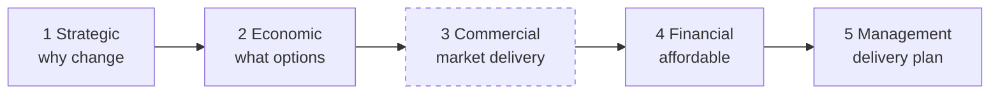
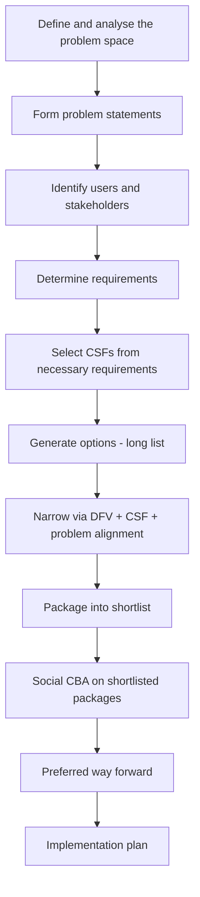

# 📑 Lecture 4 — Business case analysis

> [!abstract] Why this matters
> After this lecture you can take a wicked problem and turn it into the artefact that actually moves money: a **business case**. You know the five cases Treasury expects, how a long list of ideas is narrowed to a shortlist of **packages**, and — the part most teams get wrong — how to **justify** both the options you kept and the options you killed.
>
> This is the spine of the Systems Week deliverable. Everything in weeks 2–4 hangs off it.

> [!bug] Sources — read this before trusting a page reference
> **Slides: NOT SUPPLIED.** Only the auto-generated transcript was in `resources/`. Every concept below is `⚠ transcript only` — there are **no figures in this note**, because there was no deck to export them from. The lecturer showed at least these visuals that are missing here:
> - the five-case Better Business Case diagram
> - the staged indicative → detailed → implementation process diagram
> - the plastics long-list table (11 options) and its problem-statement alignment
> - the **colour-coded CSF/DFV options matrix** (the one he explicitly critiques)
> - the do-minimum / do-medium / do-maximum package justification text
>
> Drop `ENGGEN_403_Lecture_04_2026*.pdf` into `resources/` and I'll export these and re-embed them. Slide wording is what you're marked against; the transcript gives the reasoning.
>
> **Transcript:** auto-generated, quality good. Lecturer: **Mark** (not Juliet).
>
> *Prerequisites: [[../../Lecture2/notes/L2-notes|L2]] — wicked problems, boundaries, stakeholders — used throughout without re-explanation. Also assumes ENGGEN**303**: NPV, IRR, BCR, DFV, long list/short list, divergent–convergent thinking.*

> [!quote] What the lecture said it would cover
> "The better business case framework… options assessment building upon those tools — DFV analysis, necessary requirements — and introduce critical success factors. How we come to a shortlist from an initial long list, and the idea of **justifying trade-offs** between our different options."

## 🗺 Concept map

---

## 📋 L4-C01 · What a business case actually does

> [!question] Cue questions
> - Name the six jobs a business case performs.
> - Why is "do nothing" *always* on the list of options?
> - Who is the audience for a business case, and what are they deciding?

### In plain language

A business case is the document that stands between an idea and a cheque. Government has a fixed pot of money and more things to spend it on than money to spend, so somebody has to decide. The business case is what they read. It doesn't make the decision — it *informs* the person who does.

### Precisely

Business cases **inform decision-making at the highest levels**. Their functions:

1. **Justify why a project should be undertaken** — why is this change needed? (In 303 terms: your problem exploration and root causes, scaled up to *why society needs this*.)
2. **Explore multiple options**, and assess pros and cons of each.
3. **Always include the do-nothing option.**
4. **Evaluate benefits, costs and risks** — the risk of doing something *and* the risk of doing nothing.
5. **Recommend a preferred way forward based on evidence**, weighing trade-offs across stakeholder groups.
6. **Provide the justification for investment and funding**, and then **form the basis for implementation and delivery**.

> [!important] Why "do nothing" is compulsory
> Every other option costs money — money that could be invested elsewhere. Do-nothing is the baseline that makes "value for money" a meaningful phrase. But it is not free: you must ask **what happens if we do nothing?** Are there social impacts? (His example: flooding — do we invest in mitigation, or do we not?)

> [!tip] What builds confidence in decision-makers
> **Detailed, recorded, robust assumptions.** Not certainty — governments know certainty isn't available. Documented assumptions are what let a decision-maker judge how much weight the numbers can carry.

**Named real cases** (all NZ, all worth 5 minutes each):

| Case | Status | Why it's interesting |
|---|---|---|
| **City Rail Link** | Complete, launching this year | Original business case **2015** — every engineering assumption in it is now testable against reality |
| **Central Interceptor** | Complete | 4.5 m diameter, **16 km** wastewater tunnel; benefits are social (flood and sewer-overflow prevention), not revenue |
| **Dunedin Hospital** | Business cases just completed, entering implementation | Years of need before a case cleared |
| **Wellington Museum** (the building *before* Te Papa) | Case being developed now | Earthquake-prone. Options: sell / demolish / relocate artefacts / upgrade ourselves / find local or central government funding. A live options-assessment problem |

*📄 Source: transcript — opening through "basis for implementing and delivering that project" · ⚠ transcript only*

---

## 🔭 L4-C02 · ENGGEN 303 → 403: from product level to systems level

> [!question] Cue questions
> - Four things that change when you move from a product business case to a systems business case.
> - Why is profitability no longer a sufficient measure of success?

### The contrast

| | **ENGGEN 303 — product / innovation level** | **ENGGEN 403 — systems level** |
|---|---|---|
| **Who matters** | Customers, customer value proposition; some suppliers, competitors | Government agencies and ministries, communities, the general public, **iwi**, business, **regulators**, **future generations** — all with different priorities |
| **Value flow** | Deliver value → receive revenue | No revenue loop; value is social, environmental, cultural |
| **Scope** | Mostly one customer group | Everyone, to different degrees |
| **Interconnection** | Contained | Systems are interconnected; actions have **unintended consequences** elsewhere |
| **Success** | Profitability, commercial viability | Balancing **economic, social, environmental, cultural and long-term** outcomes for everyone |

> [!important] The mind shift
> *"Away from a singular focus — product, customer, revenue, profit — towards a holistic **system of systems**."* Competing stakeholder perspectives and wider societal impacts are now the substance of the analysis, not a caveat at the end of it.

> [!warning] Common trap
> Treating stakeholder impact as a section you add after the numbers. At systems level the stakeholder trade-offs *are* the numbers — see [[#⚖️ L4-C09 · DFV, expanded to systems level|C09]].

*📄 Source: transcript — "some differences between engine 303 and… 403" · ⚠ transcript only*

---

## 🏛 L4-C03 · The Better Business Case framework — five interrelated cases

> [!question] Cue questions
> - List the five cases and the single question each answers.
> - Which one does ENGGEN403 *not* focus on, and why?

**Treasury's recommended framework.** One business case is made of **five smaller interrelated cases**:

| # | Case | The question it answers |
|---|---|---|
| 1 | **Strategic** | **Why do we need to change?** What is the case for change? (Problem exploration, massively expanded) |
| 2 | **Economic** | **What are the options?** How were they generated, what are the pros and cons, what's the shortlist? |
| 3 | **Commercial** | **Can it be procured and delivered in the real market?** |
| 4 | **Financial** | **Is it affordable?** Is the preferred option within budget, and does it create vastly more social benefit than it costs? |
| 5 | **Management** | **What is the plan for delivery?** |

> [!important] ENGGEN403 focuses on **four** of the five
> Strategic, economic, financial, management. **Commercial is out of scope** for the course.

*📄 Source: transcript — "this better business case framework… Treasury recommends" · ⚠ transcript only*

---

## 🪜 L4-C04 · Staged business cases and the off-ramp

> [!question] Cue questions
> - When does a project need staged cases rather than one?
> - Name the three stages and what each concentrates on.
> - What is an off-ramp and what problem does it solve?

### The rule

- **Simple, low-risk investment** → a **single** business case covering all five cases.
- **Larger, more complex, higher-risk (i.e. higher cost)** → a **staged** process.

### The three stages

| Stage | Weight sits on | What it establishes |
|---|---|---|
| **Indicative business case** | **Strategic case** | Why change, why investment is needed, what options exist, **what to investigate further** |
| **Detailed business case** | Economic + commercial + financial | Fully develops the **preferred option** — confirms costs, benefits, risks; seeks approval to proceed |
| **Full implementation case** | All five in detail | The delivery basis |

Each stage requires approval through the right channels before the next begins. This sits inside the wider **Cabinet approval process** (Juliet's machinery-of-government lecture covers that).

> [!important] Off-ramps — the actual reason for staging
> Staging exists so decision-makers can say **no-go early**. If a new government arrives, or the assumptions stop stacking up, or the indicative case reveals a $200 bn price tag, you can stop — go back and change the case, pivot to a different problem, or solve it another way.
>
> Without off-ramps you spend **tens of millions on planning and management consulting** and cancel at the end anyway.

> [!example] Two cancellations, 2023 change of government
> **Auckland Light Rail** — indicative case finished, detailed case in progress. New government, not a priority, and cost estimates had moved from **~$6 bn** at proposal to **~$15–17 bn**. Cancelled.
>
> **iReX** (Cook Strait ferries) — detailed business case cancelled, citing ballooning costs.
>
> **The argument on each side, which is the examinable part:**
>
> | Supporters of cancelling | Critics of cancelling |
> |---|---|
> | Ballooning costs mean the **original assumptions no longer held**, so the value-for-money case had evaporated | Cancelling has its own **disbenefits** — notably **lost productivity** — and those were not fully accounted for in the decision |
>
> Both are statements about assumptions, not about engineering.

*📄 Source: transcript — staged process and cancellations · ⚠ transcript only*

---

## 🧩 L4-C05 · Programme business cases — your project lives inside a bigger plan

> [!question] Cue questions
> - What is a programme business case?
> - What typically happens to a cancelled project inside a programme?
> - What must you check your case aligns with?

A **programme business case** covers a multi-decade plan containing many systems-level projects. Example: **Auckland's rapid transport plan**.

| Project | Status |
|---|---|
| City Rail Link | About to complete |
| Western Ring Route (Northern Corridor, Waterview Connection) | Complete |
| Eastern Busway | Recently complete |
| Northern Busway, Airport-to-Botany (East connection) | Under development |
| Auckland Light Rail | Cancelled — was to support the connection |

> [!important] Cancelled ≠ deleted
> These projects are **modular**. A cancelled project is often **divvied up** — pieces carved out and funded differently. **Let's Get Wellington Moving** (second Mt Victoria tunnel + the Golden Mile works) was cancelled and is being broken into smaller projects.

> [!tip] What this means for your case
> Check alignment with **government objectives**, **existing development plans**, and **existing programme business cases**. A technically excellent case that ignores the programme it sits in is a case nobody can fund.

*📄 Source: transcript — programme business cases · ⚠ transcript only*

---

## 🔗 L4-C06 · Mapping the five cases onto work you already know how to do

> [!question] Cue questions
> - For each of the four cases you'll write, what 303-style artefacts go inside it?
> - At which point does the social CBA appear?

| Case | What goes in it |
|---|---|
| **Strategic** (case for change) | Project background · problem space and **problem statements** (a *suite* — at least two, possibly more) · **stakeholder analysis** · requirements derived from stakeholders · **critical success factors drawn from the necessary requirements** · key constraints and assumptions |
| **Economic** (options) | **Long list** (divergent) → narrowed by **DFV analysis**, **CSFs**, and **alignment with problem statements** → **shortlist of packages** |
| **Financial** | **Social CBA** — economic and social impact assessment of **at least two** shortlisted packages → preferred way forward |
| **Management** | High-level project plan: what does rollout look like? |

### The methodology, in order

> [!important] CSFs come *from* necessary requirements
> Not invented separately. Stakeholder analysis → requirements → the **necessary** ones → critical success factors. If you can't trace a CSF back to a stakeholder requirement, it isn't one.

*📄 Source: transcript — mapping to 303 terminology; business case methodology · ⚠ transcript only*

---

## 📖 L4-C07 · Project background vs problem exploration — the confusion he pre-empted

> [!question] Cue questions
> - What three questions must the project background answer?
> - What is the one-word difference in altitude between background and problem exploration?

> [!important] The project background answers exactly three questions
> 1. **What** is the problem or opportunity? (high-level context)
> 2. **Why does it matter?** What is the impact?
> 3. **What is the current status quo — how did we get here?**

Then the **problem exploration / problem section** does something different: *"No more high-level stuff. You get into that **convergent** focus on those problem statements."*

| | Project background | Problem exploration |
|---|---|---|
| Altitude | High-level context | Narrow, specific |
| Thinking mode | Framing | **Convergent** |
| Length | ~¾ of a page (the plastics exemplar) | The bulk of the strategic case |
| Content | How we got here, why it matters | The two-to-three problem statements themselves |

> [!example] Why the plastics team's background scored well
> **Evidence-based, with citations.** Broad context for the problem, and an account of how we got here — all inside roughly three-quarters of a page, most of it delivered in the first paragraph. It resisted diving into problem statements.

*📄 Source: transcript — plastics case, project background section · ⚠ transcript only*

---

## 🌊 L4-C08 · Long list → shortlist: diverge, then converge (twice)

> [!question] Cue questions
> - Where does divergent thinking happen, and where does convergent?
> - What is the *first* convergence step on a long list, before DFV or CSF?
> - Why do options get generated that then fail this first step?

The diverge–converge cycle runs **twice** — once in the problem space, once in the solution space:

> [!important] The first convergence step is **problem-statement alignment**
> Before DFV, before CSFs: does each option on the long list actually address one of your problem statements?
>
> His explanation of why this catches things: while you're staring at the causal loop diagram, *"quite often you might have ended up generating ideas that had more to do with **this part of the causal loop**, but actually didn't have much to do with the original problem statements."* Good idea, wrong problem.

Each long-list option should map to **problem statement 1**, **problem statement 2**, or **both**. Do-nothing satisfies neither and is on the list anyway.

> [!example] The plastics long list
> 11 options reached the report. The team almost certainly generated **~20 more** that were cut before writing — *"only the ones that seemed good on paper… but more importantly, aligned with their two problem statements"*.
>
> Their two problem statements: **PS1** — plastic waste management infrastructure. **PS2** — low-grade plastic types.

> [!tip] The assumption-revisiting trick
> When you ideate, you're standing on assumptions you made while writing the problem statements. Write those assumptions out explicitly, then ask:
> - **How valid are they?**
> - Do they generate **new** options, kill options, or **improve** existing ones?
> - **What does success look like?** What would it be like if the problem weren't there?
>
> This is what makes the process genuinely iterative rather than a one-pass funnel.

> [!warning] Causal loop analysis sets the stage for the *entire* business case
> Teams rush it in the first days of Systems Week — *"we've got it, we've got it"* — and by Wednesday have to go back, revisit assumptions and pull out a different problem statement. Not starting again, but expensive.

*📄 Source: transcript — problem-to-solution, long list, ideation · ⚠ transcript only*

---

## ⚖️ L4-C09 · DFV, expanded to systems level

> [!question] Cue questions
> - State the systems-level version of each of desirability, feasibility, viability.
> - What's added to feasibility beyond "does the technology exist"?
> - What's added to viability beyond cost?

| | 303 version | 403 systems version |
|---|---|---|
| **Desirability** | Are we solving the right problem for the right customer? | Right problem for the **right people** — many stakeholder groups, not one customer. What are the **trade-offs between groups**? Equity, well-being and environmental outcomes. **Any unintended consequences?** |
| **Feasibility** | Can we build it? | Can it **realistically be implemented in New Zealand's context**? Not just "does the technology exist" — **regulations**, the **political values the government currently holds**, **existing infrastructure and systems**, technical capability, and **dependencies between interacting systems** |
| **Viability** | Cost vs revenue | Cost vs **monetised benefits**; other environmental impacts of rollout; how options work **together**; do benefits outweigh costs **over time**? |

> [!important] The feasibility point people miss
> *"We're not just going to wipe everything off the map that already exists. We're going to build upon that."* Feasibility at systems level is mostly a question about the **installed base and the political moment**, not about technology.

> [!example] Worked: ban on single-use plastics
> **Desirability** — reduces litter and environmental harm. But businesses: what do they use instead? Is there a transition period, or does it happen overnight? *"You can't just ban all of the packaging that someone's going to use, then they'll go out of business."*
> **Feasibility** — what **legislation** is required? Can we actually do this legislatively? Are there suitable alternatives?
> **Viability** — long-term environmental benefits, yes; but increased costs for suppliers and for **small and medium enterprises**. **New Zealand's economy is made up of SMEs** — a change that disadvantages that group has to be accounted for, not waved past.

*📄 Source: transcript — DFV section and the single-use plastics example · ⚠ transcript only*

---

## 🎯 L4-C10 · Critical success factors

> [!question] Cue questions
> - Where do CSFs come from?
> - Whose CSFs were used in the plastics case, and what did each contribute?

CSFs are generated from **key stakeholders** — specifically, from the **necessary requirements** that stakeholder analysis produces. They then become the criteria each option is assessed against.

> [!example] The plastics case stakeholders and what they drove
> | Stakeholder | What they contributed to the CSFs |
> |---|---|
> | **Ministry for the Environment** | The core environmental mandate on plastic pollution |
> | **Ministry of Foreign Affairs and Trade** | What is being done elsewhere in the world — can NZ **lead** on plastics? |
> | **Plastics regulators / producers** | Without their buy-in, no solution is viable at all |
> | **Iwi Māori representatives** | Environment held at a **higher status**; **kaitiakitanga** (guardianship) held in high regard |
>
> The general pattern: satisfying stakeholder requirements almost always forces **environmental and social** criteria into the CSF set.

> [!tip] The question to ask after listing them
> *"Who are the other key stakeholders — are there any you need, or are missing?"* An absent stakeholder is an absent CSF, and it will show up later as an option that passes your matrix and fails in the world.

*📄 Source: transcript — CSF section · ⚠ transcript only*

---

## 📦 L4-C11 · Packaging the shortlist — do nothing / minimum / medium / maximum

> [!question] Cue questions
> - Why do options get packaged rather than shortlisted individually?
> - What is the packaging usually based on?
> - Reconstruct the argument that selected do-medium in the plastics case.

> [!important] Why package at all
> *"It is highly unlikely that one option will satisfy all of your CSFs, all of your problem statements. So you need a **package** of solutions."*

Options are grouped by **scope** and by **suitability together**, then labelled — commonly **do nothing · do minimum · do medium · do maximum** — usually ordered by **implementation cost**.

If resources were unlimited you'd take do-maximum. They aren't, so the job is the **best value-for-money decision**.

> [!example] The plastics decision, reconstructed
> **Do medium** = a **tax on plastics** + a **plastics/container return scheme** + a **recycling subsidy**.
>
> | Package | The argument against / for |
> |---|---|
> | **Do minimum** | Modest methane reductions, cost savings from landfill diversion. **Positive NPV ≈ $34 m, BCR ≈ 1.5** — so it "passes". But scope is limited to benefits relying on **consumer behaviour** (education campaigns, advertising, small-business rollouts). Systemic issues — plastic **overconsumption**, **low recovery rates**, **reliance on virgin plastics** — go **unaddressed**. *You don't address the full scope of the problem.* |
> | **Do maximum** | **Greatest** environmental and economic gains — and the highest cost. Extremely high upfront **and ongoing** costs, a heavy burden on the government budget, plus high taxes pressuring business. **Significant implementation risk**: if another fuel crisis hits, those costs rise and it becomes unimplementable |
> | **Do medium** ✅ | Strikes the balance. *"It's expensive but it's not too expensive. We create a lot of benefits — not the most benefits, but a lot."* Wins on **value for money** and on the **trade-offs** |
>
> Note what the argument is *not*: it is not "the medium package scored highest".

> [!warning] A positive NPV and BCR > 1 is not sufficient
> Do-minimum cleared both and was still rejected — because it didn't touch the systemic problem. Financial viability is a **filter**, not the decision.

*📄 Source: transcript — packaging and the plastics package justifications · ⚠ transcript only*

---

## 🚨 L4-C12 · The scoring-matrix trap — "no right answer, only trade-offs"

> [!question] Cue questions
> - What is wrong with choosing option 2 because it scored 17 and option 1 scored 16?
> - Two things every option-assessment section must explain.

> [!important] The load-bearing idea of the lecture
> On the pretty colour-coded CSF matrix: *"It looks great. It's pretty. **It tells me absolutely nothing.** What matters is the underlying reasons behind the colour coding."*
>
> **No right answer. Only trade-offs.**

> [!warning] The 17-vs-16 fallacy
> *"If you have an option that scores 16 versus an option that scores 17, and you're like 'we chose option 2 because it scored 17' — that means nothing. Do you really have that **certainty** to assign that one score point and make a decision based on it? **No.**"*
>
> Weighted scoring is the **final result of a whole pile of reasoning you're supposed to show us** — not a substitute for it. Don't treat it as a tick-box exercise.

### The two obligations

| Obligation | What's required |
|---|---|
| **Why options were carried forward** | Not *"it met the DFV requirements and identified CSFs"* — that's what the exemplar team wrote, and it's the gap he named. **How** did it meet them? **Why**? A little explanation and discussion, not a novel |
| **Why options were excluded** | Just as important. Drop three options silently and the reader thinks *"that option looked really good, it was really cheap — why not that one?"* **The process becomes unfollowable and the report becomes inconsistent** |

> [!tip] Whose reasoning it has to be
> He deliberately refused to hand over the answers: *"me just standing here telling you 'that one shouldn't go for this reason' — it doesn't really matter. You're taking your skills, your perspectives, your experiences, your rationale."* **This is your synthesis.** That's the assessed skill.

*📄 Source: transcript — options matrix critique · ⚠ transcript only*

---

## 📉 L4-C13 · What business cases can't do

> [!question] Cue questions
> - Five structural limitations of a business case.
> - What does "a cross-section in time" mean and why is it the biggest one?
> - Why do long projects suffer most?

| Limitation | What it means |
|---|---|
| **A cross-section in time** ⭐ | The case does everything it can with the assumptions, information and data available *at that moment*. Then the world moves — a fuel crisis, a pandemic, a war, a change of government — and priorities shift |
| **Hard to capture every social and environmental impact** | Some impacts are simply left unquantified |
| **Assumptions may not hold over time** | The benefits rest on them |
| **Unintended consequences and trade-offs get overlooked** | |
| **It simplifies a complex system** | The whole cloud of interconnected systems is collapsed into **one decision point** |
| **The decision isn't only the case** | Decision-makers also weigh **government priorities, political values, and their own judgement** |

> [!important] Time value of money on long programmes
> On multi-decade projects, **small changes in assumptions compound** into large changes in modelled costs and benefits. This is why long programmes are the most fragile.

> [!example] Two live cases to read
> **Waikato medical school** — existing medical schools pushed back on the case's assumptions: how many doctors it will produce, **where those doctors will actually work**, and the **capacity of existing medical schools**. Read it and decide for yourself.
>
> **Let's Get Wellington Moving** — started **2015**; only pre-works ever delivered. Failure modes, all at once: very long delivery times · changing priorities as governments changed · **stakeholder disagreement** · **governance complexity** (local government vs government agencies vs central government, and who funds what) · scrutiny of whether the benefits would ever be delivered for the cost.

*📄 Source: transcript — limitations and closing cases · ⚠ transcript only*

---

## ✅ Summary — the 8 things that matter

1. **A business case informs a decision-maker; it does not make the decision.** Its power comes from documented, robust **assumptions**, not from certainty.
2. **Do nothing is always an option** — it's the baseline that makes value-for-money mean something. But doing nothing has social consequences too.
3. **Five cases: strategic, economic, commercial, financial, management.** 403 works on four; commercial is out of scope.
4. **Staging exists for off-ramps.** Indicative → detailed → implementation, each with approval. Stop early rather than cancel after spending tens of millions. Auckland Light Rail ($6 bn → $15–17 bn) and iReX are the cases.
5. **Long list converges three times:** first on **problem-statement alignment**, then on **DFV**, then on **CSFs** — CSFs themselves derived from stakeholders' necessary requirements.
6. **You shortlist packages, not options** — one option will not satisfy all your problem statements. Do nothing / minimum / medium / maximum, usually by implementation cost.
7. **No right answer, only trade-offs.** A score of 17 vs 16 justifies nothing. Explain why each option was carried forward **and why each was excluded** — otherwise the report is unfollowable.
8. **A business case is a cross-section in time.** Assumptions decay, systems get simplified to one decision point, and political values do the rest.

---

## 🧪 Self-test

> [!question]- 12 free-recall questions
> 1. List the six jobs a business case does. Which one is about the future *after* approval?
> 2. Do-nothing costs nothing, so why does it need analysing at all? Give the lecturer's example.
> 3. Name the five cases in the Better Business Case framework and the question each answers. Which is excluded from ENGGEN403?
> 4. A project is large, complex and high-cost. Describe the staged process it must go through and what each stage concentrates on.
> 5. Explain "off-ramp" to someone who thinks staging is just bureaucracy. What does it save?
> 6. Auckland Light Rail was cancelled. Give the strongest argument that cancelling was correct, and the strongest argument that it wasn't. Which assumption is doing the work in each?
> 7. A project inside a programme gets cancelled. What typically happens to it, and what does that imply for how you scope options?
> 8. What three questions does the project background answer, and how does it differ in altitude from problem exploration?
> 9. Your team has 11 long-list options. What is the *first* narrowing step — before DFV, before CSFs — and what kind of good idea does it eliminate?
> 10. Give the systems-level version of feasibility. Name three things beyond "the technology exists".
> 11. The do-minimum package has a positive NPV of $34 m and a BCR of 1.5. Why was it rejected? What does this tell you about the role of financial metrics?
> 12. Critique this sentence from a report: *"Option 3 was carried forward as it met the DFV requirements and the identified CSFs."* What's missing, and what else does the section need that isn't in this sentence at all?

---

> [!info]- Related notes
> - `L4-summary.md` · `L4-flashcards.tsv`
> - `../context/admin-and-dates.md`
> - [[../../Lecture2/notes/L2-notes|L2 — systems thinking, wicked problems]] · [[../../Lecture3/notes/L3-notes|L3 — science/government interface]]
> - **Feeds into:** [[../../Lecture5/notes/L5-notes|L5 — social CBA]] (the financial case) · [[../../Lecture6/notes/L6-notes|L6 — GDP, Living Standards Framework]] (the qualitative impacts) · [[../../Lecture7/notes/L7-notes|L7 — stakeholders at the national level]] (where CSFs come from)
