# 📑 Lecture 4 — Business case analysis

> [!abstract] Why this matters
> After this lecture you can take a wicked problem and turn it into the artefact that actually moves money: a **business case**. You know the five cases Treasury expects, how a long list of ideas is narrowed to a shortlist of **packages**, and — the part most teams get wrong — how to **justify** both the options you kept and the options you killed.
>
> This is the spine of the Systems Week deliverable. Everything in weeks 2–4 hangs off it.

> [!info] Sources
> **Slides:** `ENGGEN_403_Lecture_04_2026.pdf` — 34 pages. **Marc Lewis**, 28 July 2026. (Juliet delivered L1–L3.)
> **Transcript:** auto-generated, quality good.
>
> *Prerequisites: [[../../Lecture2/notes/L2-notes|L2]] — wicked problems, boundaries, stakeholders — used throughout without re-explanation. Also assumes ENGGEN**303**: NPV, IRR, BCR, DFV, long list/short list, divergent–convergent thinking.*

> [!quote] Stated learning outcomes (slide 2)
> 1. **Explain how the Better Business Case framework supports systems-level decision making.**
> 2. **Generate and evaluate solution options** using systems engineering tools.
> 3. **Develop investment packages and justify trade-offs** between alternative solutions.
> 4. **Apply these principles to structure a systems-level business case.**

## 🗺 Concept map

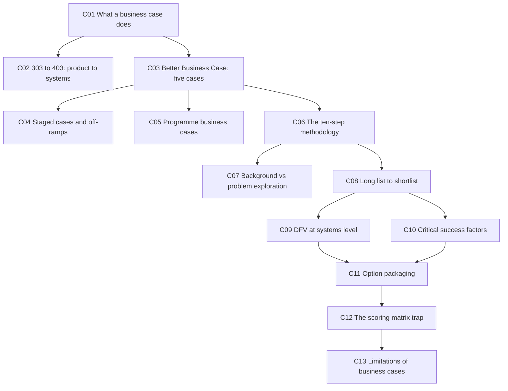

---

## 📋 L4-C01 · What a business case actually does

> [!question] Cue questions
> - Name the eight jobs a business case performs.
> - Why is "do nothing" *always* on the list of options?
> - Who is the audience, and what are they deciding?

### In plain language

A business case is the document that stands between an idea and a cheque. Government has a fixed pot of money and more things to spend it on than money to spend, so somebody has to decide. The business case is what they read. It doesn't make the decision — it *informs* the person who does.

### Precisely

> [!quote] Slide 6 — a business case:
> - **Justifies why** a project should be undertaken
> - **Defines the problem** and why change is needed
> - **Explores multiple options, including doing nothing**
> - **Evaluates benefits, costs, risks and trade-offs** of each option
> - **Recommends the preferred solution based on evidence**
> - Provides the **justification for investment and funding**
> - **Builds confidence** among decision-makers and stakeholders
> - **Forms the basis for implementation and project delivery**

> [!important] Why "do nothing" is compulsory
> Every other option costs money — money that could be invested elsewhere. Do-nothing is the baseline that makes "value for money" a meaningful phrase. But it is not free: you must ask **what happens if we do nothing?** (His example: flooding — do we invest in mitigation, or do we not?)

> [!tip] What builds confidence in decision-makers
> **Detailed, recorded, robust assumptions.** Not certainty — governments know certainty isn't available. Documented assumptions are what let a decision-maker judge how much weight the numbers can carry.

**Named real cases** (all NZ, all worth 5 minutes each):

| Case | Status | Why it's interesting |
|---|---|---|
| **City Rail Link** (slide 4) | **Completed 2026** | Original business case **2015** — every engineering assumption in it is now testable against reality |
| **Central Interceptor** | Complete | 4.5 m diameter, **16 km** wastewater tunnel; benefits are social (flood and sewer-overflow prevention), not revenue |
| **New Dunedin Hospital** (slide 5) | Business cases completed, entering implementation | Years of need before a case cleared |
| **Wellington Museum** (the building *before* Te Papa) | Case being developed now | Earthquake-prone. Options: sell / demolish / relocate artefacts / upgrade ourselves / find local or central government funding |

*📄 Source: slides 4–6 · transcript — opening · **Central Interceptor and Wellington Museum are transcript-only** (not on the slides)*

---

## 🔭 L4-C02 · ENGGEN 303 → 403: from product level to systems level

> [!question] Cue questions
> - Five things that change when you move from a product business case to a systems business case.
> - Why is profitability no longer a sufficient measure of success?
> - What does B2G mean here?

> [!quote] Slide 7
> - Product-level business cases typically focus on **customers, suppliers, competitors, and commercial viability**.
> - Systems-level projects involve a much broader range of stakeholders, including **governments, communities, iwi, businesses, regulators, and future generations**, each with different priorities.
> - Problems become **larger in scope**, spanning multiple sectors and **interconnected systems where actions can have unintended consequences**.
> - Success is no longer measured solely by profitability or customer value, but by **balancing economic, social, environmental, cultural, and long-term outcomes for society**.
> - Decisions must consider **uncertainty, competing stakeholder perspectives, and the wider impacts on society**.

| | **ENGGEN 303** | **ENGGEN 403** |
|---|---|---|
| Relationship | **B2C, B2B** | **B2G** |
| Problem type | **Simple to complicated** | **Complex and wicked** *(see [[../../Lecture8/notes/L8-notes|L8]])* |
| Value flow | Deliver value → receive revenue | No revenue loop; value is social, environmental, cultural |
| Success | Profitability, commercial viability | The five-way balance above |

*(slide 16)*

> [!important] The mind shift
> *"Away from a singular focus — product, customer, revenue, profit — towards a holistic **system of systems**."*

> [!warning] Common trap
> Treating stakeholder impact as a section you add after the numbers. At systems level the stakeholder trade-offs *are* the numbers — see [[#⚖️ L4-C09 · DFV, expanded to systems level|C09]].

*📄 Source: slides 7, 16 · transcript*

---

## 🏛 L4-C03 · The Better Business Case framework — five interrelated cases

> [!question] Cue questions
> - List the five cases and the **question** each answers (the slide phrases them as questions — learn those).
> - Which one does ENGGEN403 exclude, and how does the slide indicate it?

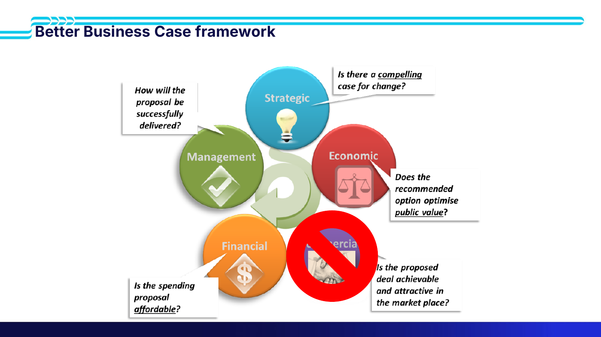

> [!important] Learn these as questions, not labels (slide 8)
> | Case | The question it asks |
> |---|---|
> | **Strategic** | *"Is there a **compelling case for change**?"* |
> | **Economic** | *"Does the recommended option optimise **public value**?"* |
> | **Commercial** ❌ | *"Is the proposed deal **achievable and attractive in the market place**?"* |
> | **Financial** | *"Is the spending proposal **affordable**?"* |
> | **Management** | *"How will the proposal be **successfully delivered**?"* |
>
> The **commercial case is struck through on the slide with a red prohibition sign** — ENGGEN403 works on the other **four**.

> [!tip] Note the phrasing of the economic case
> Not "what are the options" but *"does the recommended option optimise **public value**"*. Public value — not profit, not benefit to one group — is the criterion the economic case is judged on.

*📄 Source: slide 8 · transcript*

---

## 🪜 L4-C04 · Staged business cases and the off-ramp

> [!question] Cue questions
> - When does a project need staged cases rather than one?
> - Name the three stages and what each establishes.
> - What is an off-ramp and what problem does it solve?

> [!quote] Slide 9
> Simple, low-risk investments may only require a **single business case**. Larger, more complex, or higher-risk investments typically require a **staged** Better Business Case process.
>
> **Stage 1 — Indicative Business Case (IBC)**
> - Why is investment needed?
> - What options are available?
> - **Which option should be investigated further?**
>
> **Stage 2 — Detailed Business Case**
> - **Fully develop the preferred option**
> - **Confirm costs, benefits and risks**
> - Seek approval to deliver the project
>
> If approved, develop **full implementation business case**.

> [!important] Off-ramps — the actual reason for staging
> Staging exists so decision-makers can say **no-go early**. If a new government arrives, or the assumptions stop stacking up, or the indicative case reveals a $200 bn price tag, you can stop — go back and change the case, pivot to a different problem, or solve it another way.
>
> Without off-ramps you spend **tens of millions on planning and management consulting** and cancel at the end anyway. *(transcript)*

> [!example] Two cancellations, 2023 change of government (slide 10)
> **Auckland Light Rail** — indicative case finished, detailed case in progress. New government, not a priority, and cost estimates had moved from **~$6 bn** at proposal to **~$15–17 bn**. Cancelled.
>
> **iReX** — detailed business case cancelled, citing ballooning costs.
>
> **The argument on each side, which is the examinable part:**
>
> | Supporters of cancelling | Critics of cancelling |
> |---|---|
> | Ballooning costs mean the **original assumptions no longer held**, so the value-for-money case had evaporated | Cancelling has its own **disbenefits** — notably **lost productivity** — and those were not fully accounted for |
>
> Both are statements about assumptions, not about engineering. *(transcript — the slide shows only the two case covers)*

*📄 Source: slides 9–10 · transcript*

---

## 🧩 L4-C05 · Programme business cases — your project lives inside a bigger plan

> [!question] Cue questions
> - What is a programme business case?
> - What happens to a cancelled project inside a programme?
> - What must you check your case aligns with?

> [!quote] Slide 11 — Auckland Rapid Transit Plan
> **Under construction or completed**
> - City Rail Link (CRL) — **completed 2026**
> - Western Ring Route — **completed 2023**
>   - Waterview connection — completed 2017
>   - Northern corridor upgrades — completed 2023
> - Eastern Busway · Northern Busway · Airport to Botany
>   - **Auckland light rail (cancelled)**
>
> **Planned**
> - **Northwest Busway** · **Waitematā harbour connections**

> [!important] Cancelled ≠ deleted
> These projects are **modular**. A cancelled project is often **divvied up** — pieces carved out and funded differently. **Let's Get Wellington Moving** (second Mt Victoria tunnel + the Golden Mile works) was cancelled and is being broken into smaller projects. *(transcript)*

> [!tip] What this means for your case
> Check alignment with **government objectives**, **existing development plans**, and **existing programme business cases**. A technically excellent case that ignores the programme it sits in is a case nobody can fund.

*📄 Source: slide 11 · transcript*

---

## 🔗 L4-C06 · The mapping, and the ten-step methodology

> [!question] Cue questions
> - For each of the four cases you'll write, what goes inside it?
> - Recite the ten-step business case methodology.
> - At which step does the social CBA appear?

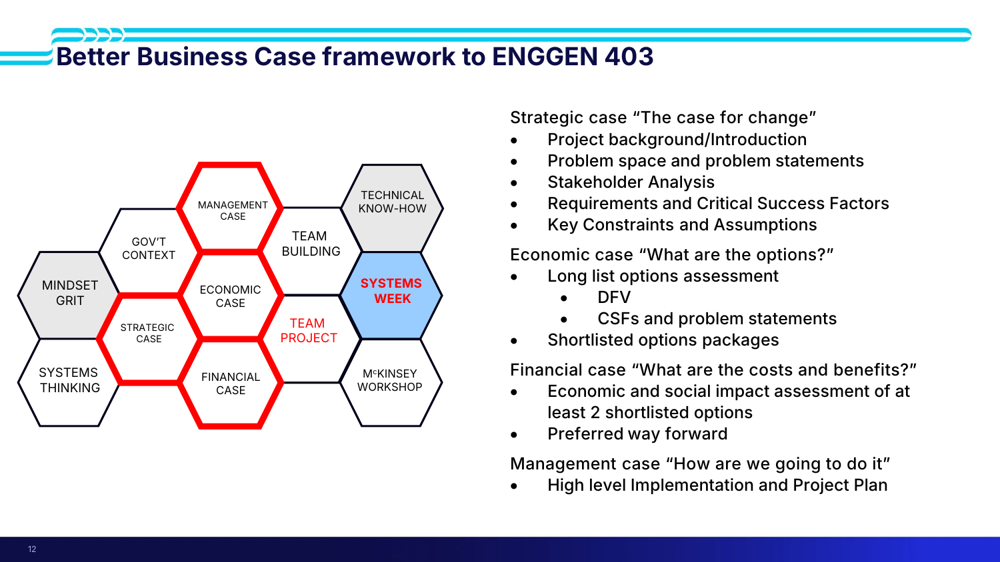

> [!quote] Slide 12 — the four cases, verbatim
> **Strategic case — "The case for change"**
> - Project background / introduction
> - Problem space and problem statements
> - Stakeholder analysis
> - **Requirements and Critical Success Factors**
> - Key constraints and assumptions
>
> **Economic case — "What are the options?"**
> - Long list options assessment — **DFV** · **CSFs and problem statements**
> - Shortlisted options packages
>
> **Financial case — "What are the costs and benefits?"**
> - Economic and social impact assessment of **at least 2 shortlisted options**
> - Preferred way forward
>
> **Management case — "How are we going to do it"**
> - High-level implementation and project plan

> [!important] The ten-step methodology (slide 13) — learn this as a sequence
> 1. **Define and analyse a problem space** and form problem statements
> 2. **Identify the users / stakeholders**
> 3. **Determine the requirements** of the users / stakeholders
> 4. **Select the Critical Success Factors** that a solution must meet
> 5. **Generate different options** that could address the problem
> 6. **Assess options against the DFV, CSFs and problem statements** to narrow down options
> 7. **Package options together** based on scale, and options assessment
> 8. **Carry out economic analysis and societal impact** of the shortlisted options
> 9. Based on this analysis, **suggest a preferred way forward**
> 10. **Outline a plan to implement** the preferred way forward

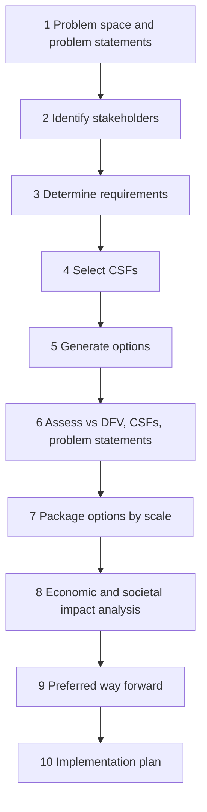

> [!tip] Note the ordering of steps 3 and 4
> **CSFs come *from* requirements, which come *from* stakeholders.** Not invented separately. If you can't trace a CSF back to a stakeholder requirement, it isn't one.

*📄 Source: slides 12–13*

---

## 📖 L4-C07 · Project background vs problem exploration

> [!question] Cue questions
> - What three questions must the project background answer?
> - What is the difference in altitude between background and problem exploration?

> [!quote] Slide 15 — the project background should answer three questions
> - **What is the problem or opportunity?**
> - **Why does it matter (impact)?**
> - **How did we get here?** aka **what is the status quo?**

Then the **problem exploration** does something different: *"No more high-level stuff. You get into that **convergent** focus on those problem statements."*

| | Project background | Problem exploration |
|---|---|---|
| Altitude | High-level context | Narrow, specific |
| Thinking mode | Framing | **Convergent** |
| Length | ~¾ of a page (the plastics exemplar) | The bulk of the strategic case |
| Content | How we got here, why it matters | The two-to-three problem statements themselves |

> [!example] Why the plastics team's background scored well
> **Evidence-based, with citations.** Broad context and an account of how we got here — inside roughly three-quarters of a page, most of it in the first paragraph. It resisted diving into problem statements. *(transcript)*

*📄 Source: slide 15 · transcript*

---

## 🌊 L4-C08 · Long list → shortlist: diverge, then converge (twice)

> [!question] Cue questions
> - Name the three stages of the double diamond as the slide labels them.
> - What is the *first* narrowing step on a long list, before DFV or CSF?
> - What three questions drive ideation?

**Slide 18** reproduces the Design Council **double diamond**: `DISCOVER → DEFINE → DEVELOP`, across a **problem space** and a **solution space**. *(Source: designcouncil.org.uk)*

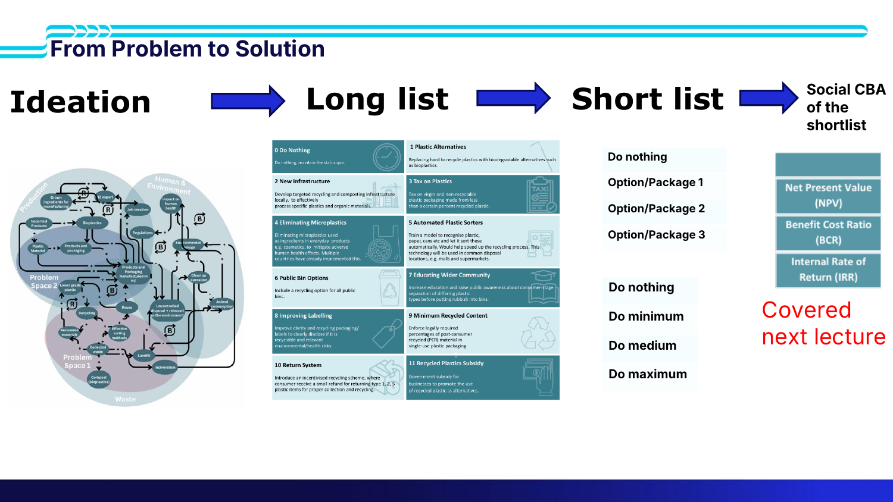

The chain (slide 19): **Ideation → long list → short list** (do nothing, option/package 1, 2, 3 — relabelled **do nothing / do minimum / do medium / do maximum**) **→ social CBA of the shortlist**.

### The plastics exemplar

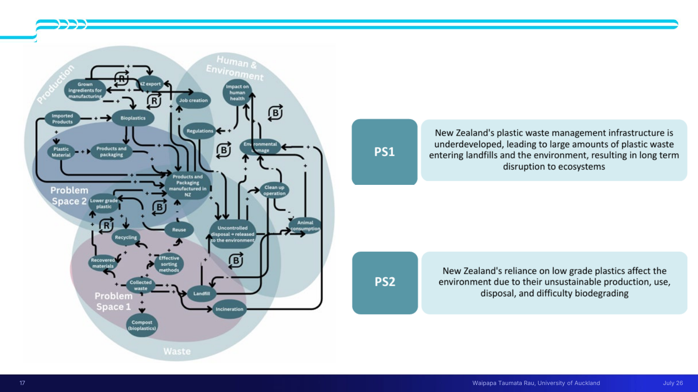

> [!quote] The two problem statements, verbatim (slide 17)
> **PS1** — *"New Zealand's plastic waste management infrastructure is **underdeveloped**, leading to large amounts of plastic waste entering landfills and the environment, resulting in **long term disruption to ecosystems**."*
>
> **PS2** — *"New Zealand's reliance on **low grade plastics** affect the environment due to their **unsustainable production, use, disposal, and difficulty biodegrading**."*

Note how the causal loop diagram is annotated: **Problem Space 1** sits in the *Waste* region, **Problem Space 2** in the *Production* region. The problem statements were carved out of the loop, not invented alongside it.

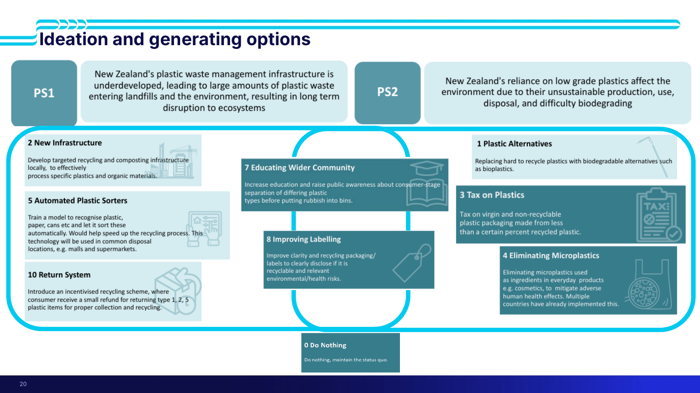

> [!example] The long list (slide 20)
> | # | Option | What it is |
> |---|---|---|
> | **0** | **Do Nothing** | Maintain the status quo |
> | 1 | **Plastic Alternatives** | Replace hard-to-recycle plastics with biodegradable alternatives such as bioplastics |
> | 2 | **New Infrastructure** | Targeted recycling and composting infrastructure locally, to process specific plastics and organic materials |
> | 3 | **Tax on Plastics** | Tax on virgin and non-recyclable plastic packaging made from less than a certain percent recycled plastic |
> | 4 | **Eliminating Microplastics** | Eliminate microplastics used as ingredients in everyday products, e.g. cosmetics. Multiple countries have already done this |
> | 5 | **Automated Plastic Sorters** | Train a model to recognise and sort plastic, paper, cans; deployed in common disposal locations (malls, supermarkets) |
> | 7 | **Educating Wider Community** | Raise public awareness about consumer-stage separation of plastic types before binning |
> | 8 | **Improving Labelling** | Clearer labels disclosing recyclability and relevant environmental/health risks |
> | 10 | **Return System** | Incentivised recycling scheme — a small refund for returning type 1, 2, 5 plastic items |
>
> ⚠ Options **6 (public bins)**, **9** and **11 (recycled plastics subsidy)** are referenced on slides 26 and 30 but do not appear on slide 20 — the deck's long-list graphic is incomplete.

> [!important] The first convergence step is **problem-statement alignment**
> Before DFV, before CSFs: does each option actually address one of your problem statements?
>
> Why this catches things: while you're staring at the causal loop diagram, *"quite often you might have ended up generating ideas that had more to do with **this part of the causal loop**, but actually didn't have much to do with the original problem statements."* Good idea, wrong problem.

> [!tip] The three ideation prompts (slide 21)
> 1. **What are your assumptions underpinning 'guesses'?**
> 2. **Low cost test: how valid are your assumptions — are you addressing the PS?**
> 3. **What does success look like?** Imagine what it would be like if the problem wasn't there.
>
> This is what makes the process genuinely iterative rather than a one-pass funnel.

> [!warning] Causal loop analysis sets the stage for the *entire* business case
> Teams rush it in the first days of Systems Week — *"we've got it, we've got it"* — and by Wednesday have to go back, revisit assumptions and pull out a different problem statement. *(transcript)*

*📄 Source: slides 17–21 · transcript*

---

## ⚖️ L4-C09 · DFV, expanded to systems level

> [!question] Cue questions
> - State the guiding question for each of D, F and V (slide 23 phrasing).
> - Name the five sub-criteria under each.
> - What's added to viability beyond "benefits outweigh costs"?

> [!important] The slide-23 matrix — learn this, it is the assessed tool
> | | **Desirability** | **Feasibility** | **Viability** |
> |---|---|---|---|
> | **Guiding question** | *Are we solving the **right problem for the right people**?* | *Can this solution **realistically be implemented**?* | *Can this solution deliver **long-term value and be sustained**?* |
> | | Stakeholder needs and priorities | Technical capability | Economic sustainability |
> | | Equity, wellbeing, and environmental outcomes | Infrastructure and existing systems | Funding and investment |
> | | Trade-offs between competing group interests | Policy, regulation, and governance | Long-term operating and maintenance costs |
> | | **Social acceptance and political support** | **Organisational capability and collaboration** | **Scalability and resilience** |
> | | **Unintended consequences across the system** | **Dependencies between interacting systems** | Benefits outweigh costs **over the system lifecycle** |

> [!tip] What changed from 303
> Viability is no longer "does it make money" but **can it be sustained** — funding, ongoing opex and maintenance, scalability, resilience. Feasibility is no longer "does the technology exist" but a question about the **installed base, the regulatory regime and the political moment**: *"We're not just going to wipe everything off the map that already exists. We're going to build upon that."*

> [!example] Worked DFV, three options (slide 24 — verbatim)
> | Option | Desirability | Feasibility | Viability |
> |---|---|---|---|
> | **Ban single-use plastics** | Reduces litter and environmental harm. **May inconvenience consumers and businesses** | Requires **legislation, enforcement, and suitable alternatives** | Long-term environmental benefits, but potential **increased costs and political resistance** |
> | **Invest in recycling infrastructure** | Reduces waste sent to landfill and recovers valuable materials | Requires significant **investment, technology, and public participation** | Sustainable **if recycling markets remain profitable and contamination is kept low** |
> | **Introduce a plastic tax** | Encourages consumers and businesses to reduce plastic use. **May disproportionately affect low-income households** | **Relatively easy to implement through existing taxation systems** | Generates government revenue and incentivises behaviour change, but **effectiveness depends on tax level and public acceptance** |
>
> Notice the shape of every cell: a claim **and** its qualification. That's what a DFV entry looks like.

> [!warning] From the transcript, on the plastics ban
> You can't ban all packaging overnight — businesses fold. And costs land on **small and medium enterprises**: *"New Zealand is an economy made up of small to medium sized enterprises."* A change that disadvantages that group must be accounted for, not waved past.

*📄 Source: slides 23–24 · transcript*

---

## 🎯 L4-C10 · Critical success factors

> [!question] Cue questions
> - Where do CSFs come from?
> - Recite the six plastics CSFs and name the stakeholder each traces back to.

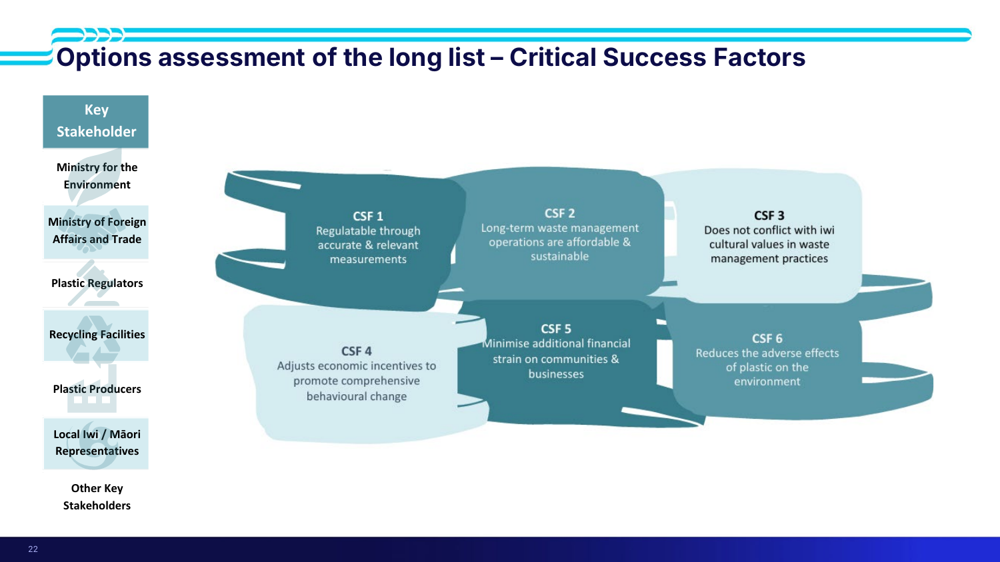

> [!quote] The six CSFs, verbatim (slide 22)
> - **CSF 1** — Regulatable through **accurate & relevant measurements**
> - **CSF 2** — Long-term waste management operations are **affordable & sustainable**
> - **CSF 3** — **Does not conflict with iwi cultural values** in waste management practices
> - **CSF 4** — **Adjusts economic incentives** to promote comprehensive behavioural change
> - **CSF 5** — **Minimise additional financial strain** on communities & businesses
> - **CSF 6** — **Reduces the adverse effects of plastic on the environment**

> [!important] The seven key stakeholders they came from (slide 22)
> **Ministry for the Environment · Ministry of Foreign Affairs and Trade · Plastic Regulators · Recycling Facilities · Plastic Producers · Local Iwi / Māori Representatives · "Other Key Stakeholders"**
>
> The trace is visible: **CSF 3** exists because iwi/Māori representatives are on the list. **CSF 5** exists because producers and communities are. **CSF 1** exists because regulators are. **An absent stakeholder is an absent CSF** — and it will show up later as an option that passes your matrix and fails in the world.

> [!tip] From the transcript
> MFAT's contribution was *"what are people doing elsewhere in the world… can we be a leader in the world in the way we address plastics?"* Iwi Māori brought the environment at a higher status and **kaitiakitanga** (guardianship). The lecturer's closing question: *"Who are the other key stakeholders — are there any there that you need or are missing?"* — which is literally the last row of the slide.

*📄 Source: slide 22 · transcript*

---

## 📦 L4-C11 · Packaging the shortlist — do nothing / minimum / medium / maximum

> [!question] Cue questions
> - Why do options get packaged rather than shortlisted individually?
> - Reconstruct the full argument that selected do-medium in the plastics case, with the numbers.

> [!quote] Slide 27
> Once you have analysed your longlist you will be able to narrow options to a shortlist. **The preferred solution is often a package of interventions that work together to address the system as a whole.**

*"It is highly unlikely that one option will satisfy all of your CSFs, all of your problem statements."* Options are grouped by **scale** and by suitability together, then labelled **do nothing / do minimum / do medium / do maximum**.

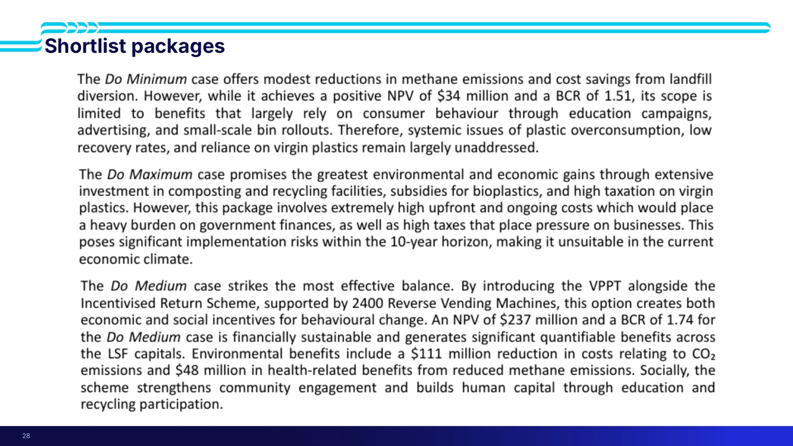

> [!example] The three packages, with the real numbers (slide 28)
> | Package | The argument |
> |---|---|
> | **Do Minimum** | Modest reductions in methane emissions and cost savings from landfill diversion. **Achieves a positive NPV of $34 million and a BCR of 1.51** — and is still rejected, because scope is limited to benefits relying on **consumer behaviour** (education campaigns, advertising, small-scale bin rollouts). **Systemic issues of plastic overconsumption, low recovery rates, and reliance on virgin plastics remain largely unaddressed** |
> | **Do Maximum** | Promises the **greatest** environmental and economic gains, through extensive investment in composting and recycling facilities, **subsidies for bioplastics**, and **high taxation on virgin plastics**. But **extremely high upfront and ongoing costs** burden government finances, and high taxes pressure business. **Significant implementation risks within the 10-year horizon**, making it *"unsuitable in the current economic climate"* |
> | **Do Medium** ✅ | *"Strikes the most effective balance."* Introduces the **VPPT** alongside the **Incentivised Return Scheme**, supported by **2,400 Reverse Vending Machines** — creating **both economic and social incentives** for behavioural change. **NPV $237 million, BCR 1.74.** Financially sustainable, with significant quantifiable benefits **across the LSF capitals**: **$111 million** reduction in CO₂-related costs and **$48 million** in health-related benefits from reduced methane. Socially, it **strengthens community engagement and builds human capital** through education and recycling participation |

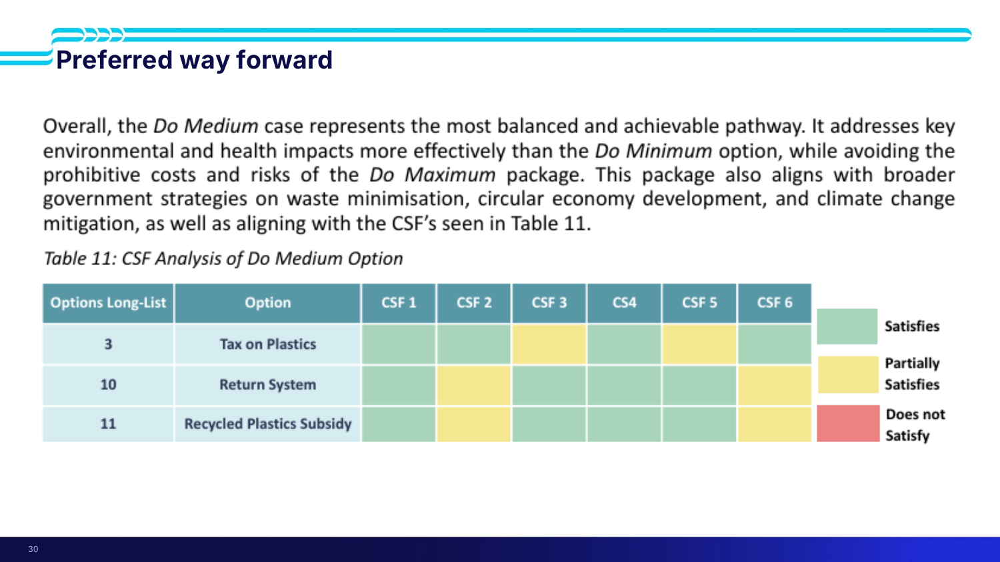

> [!quote] Preferred way forward (slide 30)
> *"Overall, the **Do Medium** case represents the most balanced and achievable pathway. It addresses key environmental and health impacts **more effectively than the Do Minimum** option, while **avoiding the prohibitive costs and risks of the Do Maximum** package. This package also **aligns with broader government strategies** on waste minimisation, circular economy development, and climate change mitigation, as well as aligning with the CSFs."*
>
> The do-medium package = **Option 3 Tax on Plastics** + **Option 10 Return System** + **Option 11 Recycled Plastics Subsidy**, each scored against all six CSFs (satisfies / partially satisfies / does not satisfy).

> [!important] Read the structure of that argument
> It has four moves, and **none of them is "it scored highest"**:
> 1. **Better than the cheaper option** on the impacts that matter
> 2. **Avoids the costs and risks** of the expensive option
> 3. **Aligns with broader government strategy** ([[#🧩 L4-C05 · Programme business cases — your project lives inside a bigger plan|C05]])
> 4. **Aligns with the CSFs** ([[#🎯 L4-C10 · Critical success factors|C10]])

> [!warning] A positive NPV and BCR > 1 is not sufficient
> Do-minimum cleared both (**+$34 m, 1.51**) and was still rejected — because it didn't touch the systemic problem. **Financial viability is a filter, not the decision.**

*📄 Source: slides 27–30 · transcript*

---

## 🚨 L4-C12 · The scoring-matrix trap — "no right answer, only trade-offs"

> [!question] Cue questions
> - What's wrong with choosing option 2 because it scored 17 and option 1 scored 16?
> - Two things every option-assessment section must explain.
> - What did the exemplar team do well here, and what did they miss?

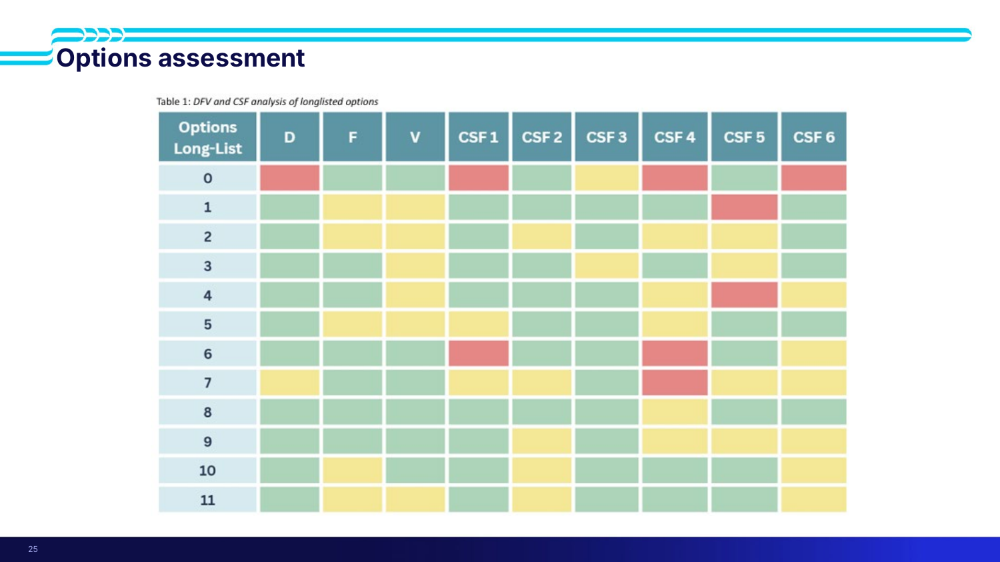

> [!important] The load-bearing idea of the lecture
> On this exact slide: *"It looks great. It's pretty. **It tells me absolutely nothing.** What matters is the underlying reasons behind the colour coding."*
>
> **No right answer. Only trade-offs.**

> [!warning] The 17-vs-16 fallacy
> *"If you have an option that scores 16 versus an option that scores 17, and you're like 'we chose option 2 because it scored 17' — that means nothing. Do you really have that **certainty** to assign that one score point and make a decision based on it? **No.**"*
>
> Weighted scoring is the **final result of a whole pile of reasoning you're supposed to show us** — not a substitute for it.

### The two obligations

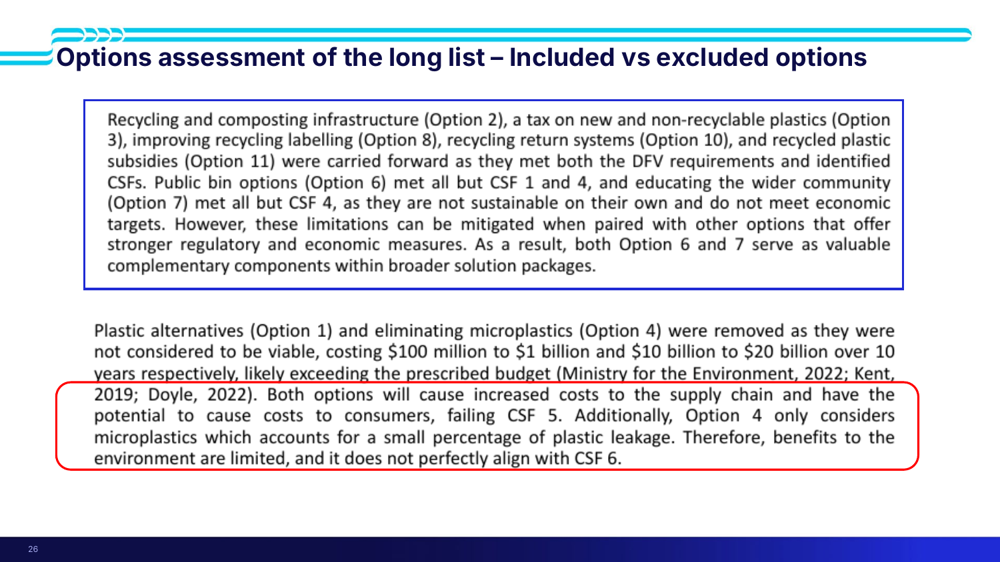

> [!quote] What the exemplar actually wrote (slide 26)
> **Carried forward:** *"Recycling and composting infrastructure (Option 2), a tax on new and non-recyclable plastics (Option 3), improving recycling labelling (Option 8), recycling return systems (Option 10), and recycled plastic subsidies (Option 11) were carried forward as they **met both the DFV requirements and identified CSFs**."*
>
> **The partial cases — this is the good bit:** *"Public bin options (Option 6) met all but **CSF 1 and 4**, and educating the wider community (Option 7) met all but **CSF 4**, as they are **not sustainable on their own** and do not meet economic targets. However, these limitations **can be mitigated when paired with other options** that offer stronger regulatory and economic measures. As a result, both Option 6 and 7 serve as **valuable complementary components within broader solution packages**."*
>
> **Excluded:** *"Plastic alternatives (Option 1) and eliminating microplastics (Option 4) were removed as they were **not considered to be viable, costing $100 million to $1 billion and $10 billion to $20 billion over 10 years respectively**, likely exceeding the prescribed budget (Ministry for the Environment, 2022; Kent, 2019; Doyle, 2022). Both options will cause increased costs to the supply chain and have the potential to cause costs to consumers, **failing CSF 5**. Additionally, Option 4 only considers microplastics which accounts for **a small percentage of plastic leakage**. Therefore, benefits to the environment are limited, and it **does not perfectly align with CSF 6**."*

| Obligation | What's required |
|---|---|
| **Why options were carried forward** | The exemplar's first sentence — *"they met both the DFV requirements and identified CSFs"* — is precisely the gap Marc named. **How** did they meet them? **Why**? A little explanation, not a novel |
| **Why options were excluded** | Just as important — and here the exemplar is **strong**: named cost ranges, cited sources, the specific CSF each option failed, and *why* it failed it. Drop three options silently and the reader thinks *"that one looked really good and really cheap — why not that one?"* The process becomes unfollowable and the report inconsistent |

> [!tip] The move worth stealing
> Options 6 and 7 **failed** CSFs and were **still kept** — as complementary components inside packages, because their weakness is fixed by pairing. That's an argument no scoring column can produce. It's also the bridge into [[#📦 L4-C11 · Packaging the shortlist — do nothing / minimum / medium / maximum|C11]].

> [!important] Whose reasoning it has to be
> He deliberately refused to hand over the answers: *"me just standing here telling you 'that one shouldn't go for this reason' — it doesn't really matter. You're taking your skills, your perspectives, your experiences, your rationale."* **This is your synthesis.**

*📄 Source: slides 25–26 · transcript*

---

## 📉 L4-C13 · What business cases can't do

> [!question] Cue questions
> - Five structural limitations of a business case (slide 31).
> - What does "a cross-section in time" mean?
> - Name the six causes of failure in Let's Get Wellington Moving.

> [!quote] Slide 31 — business case limitations
> - **Relies heavily on assumptions and forecasts (things change)**
> - **Cannot capture every social or environmental impact**
> - **Simplifies complex systems and interactions**
> - **May overlook unintended consequences and trade-offs**
> - **Decision making also involves politics, values, and judgement**

> [!important] Cross-section in time
> The case does everything it can with the assumptions, information and data available *at that moment*. Then the world moves — a fuel crisis, a pandemic, a war, a change of government. **On multi-decade projects, small changes in assumptions compound** into large changes in modelled costs and benefits (time value of money). *(transcript)*

> [!example] Waikato medical school (slide 32)
> The slide links Ministry of Health documents beside an Otago Daily Times piece headlined ***"Flaws in Waikato med school business case"***. Existing medical schools contested: **how many doctors it will produce**, **where those doctors will actually work**, and the **capacity of existing medical schools**.

> [!example] Let's Get Wellington Moving — **scrapped in 2023** (slide 33)
> Six named causes:
> - **Long delivery timeframes**
> - **Changing political priorities**
> - **Governance complexity**
> - **Stakeholder disagreement**
> - **Evolving public expectations**
> - **Scrutiny around delivery of benefits and project costs**
>
> Started **2015**; only pre-works were ever delivered. The governance complexity was specifically local government vs government agencies vs central government, and who funds what. *(transcript)*

*📄 Source: slides 31–33 · transcript*

---

## ✅ Summary — the 8 things that matter

1. **A business case informs a decision-maker; it does not make the decision.** Its power comes from documented, robust **assumptions**, not certainty. **Do nothing is always an option.**
2. **Five cases, learned as questions:** compelling case for change · optimises **public value** · achievable in the market *(excluded)* · **affordable** · successfully delivered.
3. **Staging exists for off-ramps.** IBC → detailed → implementation. Stop early rather than cancel after tens of millions. Auckland Light Rail ($6 bn → $15–17 bn) and iReX.
4. **Ten-step methodology**, and note the order: stakeholders → requirements → **CSFs** → options → assess → package → economic/social analysis → preferred way forward → implementation plan.
5. **The long list converges three times:** **problem-statement alignment** first, then **DFV** (5 sub-criteria each), then **CSFs** (traced to named stakeholders).
6. **You shortlist packages, not options.** Plastics: do-medium = VPPT + Incentivised Return Scheme + 2,400 reverse vending machines, **NPV $237 m, BCR 1.74**, $111 m CO₂ and $48 m health benefits.
7. **No right answer, only trade-offs.** A score of 17 vs 16 justifies nothing. Explain why each option was carried forward **and why each was excluded** — and note that options 6 and 7 *failed* CSFs yet stayed, as complementary package components.
8. **A business case is a cross-section in time.** Assumptions and forecasts change; complex systems get simplified; **politics, values and judgement** finish the job.

---

## 🧪 Self-test

> [!question]- 12 free-recall questions
> 1. State the five Better Business Case cases as the **questions** they ask. Which is excluded from ENGGEN403?
> 2. Do-nothing costs nothing, so why does it need analysing at all?
> 3. A project is large, complex and high-cost. Describe the staged process and what each stage establishes.
> 4. Explain "off-ramp" to someone who thinks staging is just bureaucracy. What does it save?
> 5. Auckland Light Rail was cancelled. Give the strongest argument that cancelling was correct, and the strongest that it wasn't. Which assumption is doing the work in each?
> 6. Recite the ten-step business case methodology. Which two steps must come before CSFs, and why?
> 7. What three questions does the project background answer, and how does it differ in altitude from problem exploration?
> 8. Your team has a long list of 11 options. What is the *first* narrowing step — before DFV, before CSFs — and what kind of good idea does it eliminate?
> 9. Give the guiding question for each of D, F and V, and three sub-criteria under each.
> 10. The plastics do-minimum package had NPV +$34 m and BCR 1.51. Why was it rejected? What does that tell you about the role of financial metrics?
> 11. Options 6 and 7 both failed CSFs and were both kept. Explain the reasoning, and why no scoring column could produce it.
> 12. Critique this sentence: *"Option 3 was carried forward as it met the DFV requirements and the identified CSFs."* What's missing, and what else does the section owe the reader?

---

> [!info]- Related notes
> - `L4-summary.md` · `L4-flashcards.tsv`
> - `../context/admin-and-dates.md`
> - [[../../Lecture2/notes/L2-notes|L2 — systems thinking, wicked problems]] · [[../../Lecture3/notes/L3-notes|L3 — science/government interface]]
> - **Feeds into:** [[../../Lecture5/notes/L5-notes|L5 — social CBA]] (the financial case) · [[../../Lecture6/notes/L6-notes|L6 — GDP, Living Standards Framework]] · [[../../Lecture7/notes/L7-notes|L7 — stakeholders]] · [[../../Lecture8/notes/L8-notes|L8 — complex and wicked problems]]
