# 💰 Lecture 5 — Social cost benefit analysis

> [!abstract] Why this matters
> This is the **financial case** from [[../../Lecture4/notes/L4-notes|L4]]. After this lecture you can take two shortlisted packages and produce a defensible number for each — including for things with no price tag, like a life, a clean beach, or a dead turtle.
>
> The uncomfortable lesson underneath it: sometimes every option is negative, and the job is to find the **least bad** one.

> [!info] Sources
> **Slides:** `ENGGEN_403_Lecture_05_2026.pdf` — 40 pages. **Marc Lewis**, 30 July 2026.
> **Transcript:** auto-generated, quality good.
>
> *Prerequisites: [[../../Lecture4/notes/L4-notes|L4]] — shortlist packages, do-nothing, the four cases. Also ENGGEN**303**: discounted cash flow, NPV, BCR, IRR.*

> [!quote] Stated learning outcomes (slide 2)
> 1. Explain how social cost-benefit analysis supports **evidence-based government decision making**. **Identify and value** the economic and societal impacts of systems-level projects.
> 2. **Apply** social cost-benefit analysis to evaluate **competing project options**.
> 3. **Interpret financial and non-financial evidence** to justify investment decisions.
> 4. **Evaluate the limitations** of monetising societal outcomes and the importance of broader wellbeing considerations.

## 🗺 Concept map

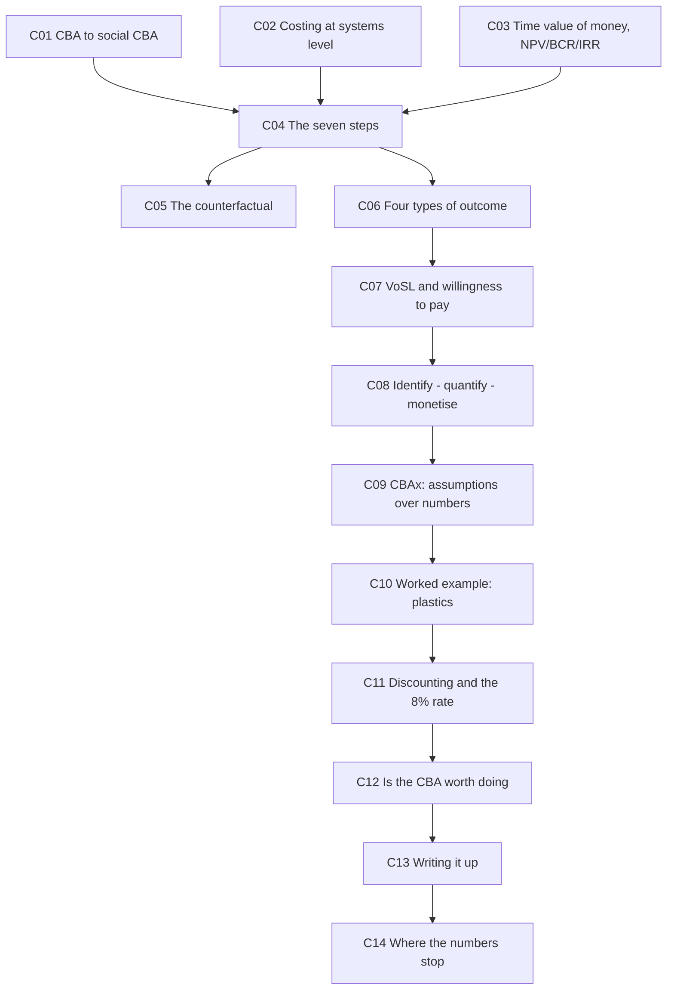

---

## 🔄 L5-C01 · From CBA to social CBA

> [!question] Cue questions
> - What does a traditional CBA compare, and over what unit of analysis?
> - Give one social benefit and one social cost example from the slide.

> [!quote] Slide 7
> In ENGGEN 303 we covered discounted cash flow and cost benefit analysis for a **single project/product** — income (revenue) and expenses (costs).
>
> System-level projects use the social cost benefit analysis as these projects also
> - **Generate social/economic benefits** (e.g. **less congestion, reduced hospital visits**)
> - **Have social/economic costs** (e.g. **increased emissions, ecology impact of a new dam**)

| | **Traditional CBA (303)** | **Social CBA (403)** |
|---|---|---|
| Unit | A single project or product | A systems-level intervention in society |
| The comparison | Revenue vs costs | **Social and economic benefits vs costs** |
| Scope of impact | The customer | Many groups, across well-being domains |

> [!important] Where this sits
> Once options assessment is complete and you have a shortlist, you assess the **financial case** for those options. **Social CBA is one way to do that** — on at least two shortlisted packages — producing the **preferred way forward**.

*📄 Source: slides 5, 7, 13 · transcript*

---

## 🧮 L5-C02 · Costing at systems level — order of magnitude, two significant figures

> [!question] Cue questions
> - Name the six cost-estimate stages.
> - Which cost categories are capital and which are ongoing?
> - How many significant figures, and what does the rounding communicate?

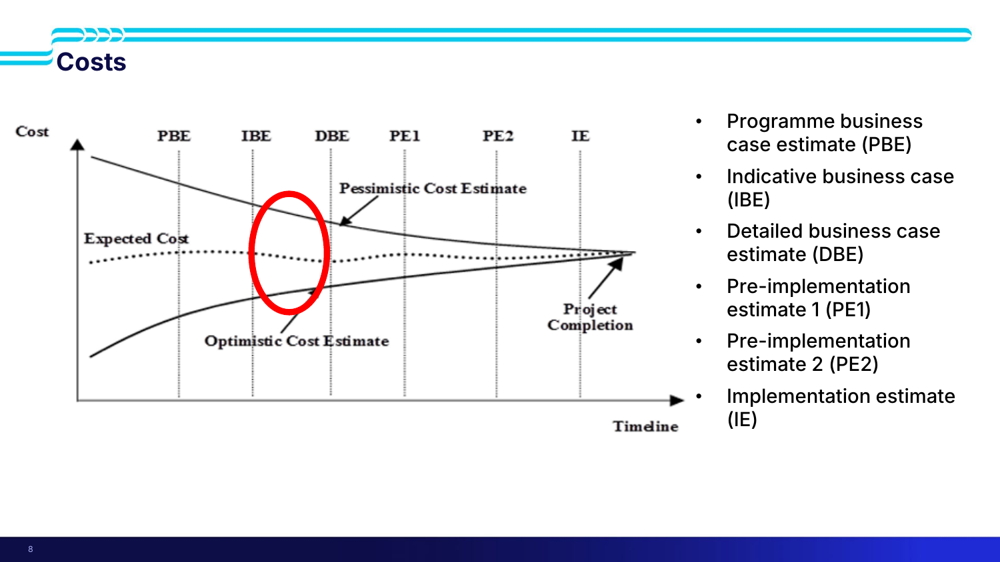

> [!important] The six estimate stages (slide 8)
> **PBE** Programme business case estimate → **IBE** Indicative business case → **DBE** Detailed business case estimate → **PE1** Pre-implementation estimate 1 → **PE2** Pre-implementation estimate 2 → **IE** Implementation estimate
>
> Accuracy improves down that list. **Your project sits near the top** — between the indicative and detailed estimates — which is exactly why precision is unavailable to you.

> [!quote] Slide 9 — system project costs are high level, order of magnitude
> **Capital costs:** land acquisition (if needed) · construction · equipment
> **Ongoing costs:** labour · operations · utilities
>
> **"Figures rounded to 2 SF reflects uncertainty!"**
>
> *"Will need to make assumptions — look at studies, reports, similar projects, and other resources."*

> [!tip] Costing tools named on slide 9
> **NZTA Cost Estimation Manual** · **NZTA Monetised Benefits and Costs Manual** · NZTA Financial Case (tools at the bottom of the page) · NZTA other useful tools · **AT guide to cost estimation**. Transport-oriented, but they give you the right orders of magnitude.

> [!warning] The spurious-precision test
> Quote a cost of **$100,250,785** and the response is *"how do you know that?"* Precision you don't have is a claim you can't defend. **Rounding is how you communicate uncertainty.**

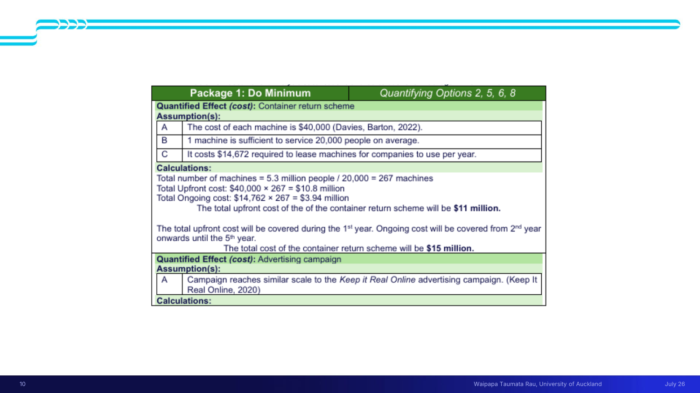

> [!example] Worked costing — container return scheme (slide 10, from the 2025 plastics report)
> **Assumptions**
> - A. Cost of each machine is **$40,000** (Davies, Barton, 2022)
> - B. **1 machine serves 20,000 people** on average
> - C. **$14,672** per year to lease machines for companies to use
>
> **Calculations**
> - Machines = 5.3 million people ÷ 20,000 = **267 machines**
> - Upfront: $40,000 × 267 = **$10.8 million** → *"total upfront cost… will be **$11 million**"*
> - Ongoing: $14,762 × 267 = **$3.94 million**
> - Upfront covered in year 1; ongoing from year 2 to year 5 → **total cost $15 million**
>
> Note the shape: **lettered assumptions, each cited → arithmetic shown → a rounded headline figure.** That is the appendix format you're being asked for.
>
> ⚠ The slide uses **$14,672** in assumption C and **$14,762** in the calculation. One is a typo in the source report; the pattern, not the digits, is what to learn.

*📄 Source: slides 8–10 · transcript*

---

## ⏳ L5-C03 · Time value of money and the three metrics

> [!question] Cue questions
> - State the time value of money and the reason it holds.
> - Give the accept/reject rule for each of NPV, BCR, IRR.
> - Why can't you use one in isolation?

> [!quote] Slide 11 — recap from 303
> The time value of money states that **money is worth more in the present than the same amount in the future, because you can invest it in the interim.**

$$\text{NPV} = \sum_{n=1}^{n}\frac{\text{Undiscounted Benefits} - \text{Undiscounted Costs}}{(1+r)^n} \qquad \text{BCR} = \frac{PV_{\text{benefits}}}{PV_{\text{costs}}}$$

$$\text{IRR: solve } 0 = \sum_{n=1}^{n}\frac{\text{Undiscounted Benefits} - \text{Undiscounted Costs}}{(1+r)^n}$$

where $r$ = discount rate and $n$ = time period.

| Metric | Accept | Reject |
|---|---|---|
| **NPV** | **> 0** | < 0 |
| **BCR** | **> 1** | < 1 |
| **IRR** | **> 0** | < 0 |

> [!important] Slide 12, stated as a rule
> **"Cannot use one of these in isolation to determine Go/No-go."**

> [!tip] From the transcript
> A **package's NPV is built from the NPVs of the individual options inside it** — package totals are sums of option-level totals.

*📄 Source: slides 11–12 · transcript*

---

## 📐 L5-C04 · The seven steps of a social CBA

> [!question] Cue questions
> - List the seven steps in Treasury's wording.
> - Which step is a stakeholder analysis?
> - Which step can conclude "don't do this analysis"?

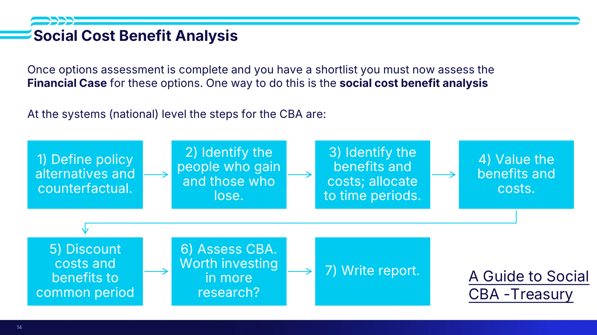

> [!quote] Slide 14 — the steps, verbatim (*A Guide to Social CBA*, Treasury)
> 1. **Define policy alternatives and counterfactual.**
> 2. **Identify the people who gain and those who lose.**
> 3. **Identify the benefits and costs; allocate to time periods.**
> 4. **Value the benefits and costs.**
> 5. **Discount costs and benefits to common period.**
> 6. **Assess CBA. Worth investing in more research?**
> 7. **Write report.**

Step 2 *is* a stakeholder analysis — *"who are the people these national level projects will impact?"* — and slide 17 explicitly defers it to [[../../Lecture7/notes/L7-notes|Lecture 7]].

*📄 Source: slide 14 · transcript*

---

## 🧭 L5-C05 · Step 1 — the counterfactual, and why it decides the answer

> [!question] Cue questions
> - Work the bridge/ferry example and give both NPVs.
> - Give the two possible readings of "do nothing".
> - What is the do-nothing case *for*, beyond being a baseline?

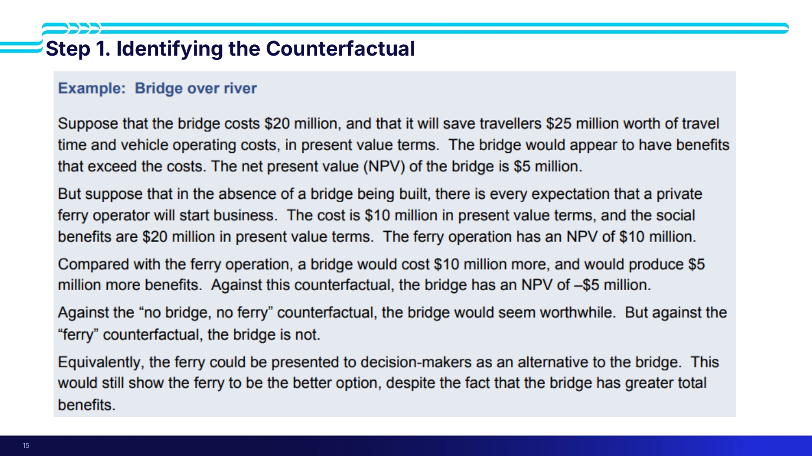

> [!example] Bridge over river (slide 15) — the whole lesson in one example
> - Bridge **costs $20 m**, saves travellers **$25 m** of travel time and vehicle operating costs (PV). **NPV = +$5 m.** Looks worthwhile.
> - But absent a bridge, a **private ferry operator** is expected to start. Ferry costs **$10 m**, social benefits **$20 m**. **Ferry NPV = +$10 m.**
> - Against the ferry, the bridge costs **$10 m more** and produces **$5 m more** benefits. **Bridge NPV = −$5 m.**
>
> > *"Against the 'no bridge, no ferry' counterfactual, the bridge would seem worthwhile. But against the 'ferry' counterfactual, the bridge is not."*
>
> **Same bridge, same costs, opposite conclusion.** Equivalently, the ferry could simply be presented as an alternative option — *"this would still show the ferry to be the better option, despite the fact that the bridge has greater total benefits."*

> [!important] The two readings of "do nothing" (slide 16)
> | Reading | Meaning |
> |---|---|
> | **Do nothing more?** | **Business as usual** — current funding and initiatives stay in play |
> | **Do less?** | **Roll back initiatives** — withdraw current investment |
>
> Both are defensible. You must state which, because it determines everything downstream. **Plastics teams split on this in 2025, so their results aren't comparable with each other.** *(transcript)*

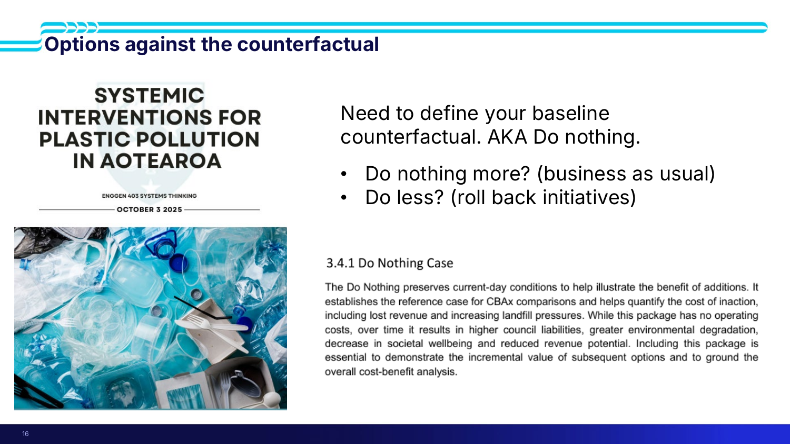

> [!quote] What a good do-nothing section says (slide 16, §3.4.1 of the plastics report)
> *"The Do Nothing **preserves current-day conditions** to help illustrate the benefit of additions. It **establishes the reference case for CBAx comparisons** and helps **quantify the cost of inaction**, including lost revenue and increasing landfill pressures. While this package has **no operating costs**, over time it results in **higher council liabilities, greater environmental degradation, decrease in societal wellbeing and reduced revenue potential**. Including this package is essential to demonstrate the **incremental value of subsequent options** and to **ground the overall cost-benefit analysis**."*

> [!warning] A do-nothing can be catastrophically negative — and that redefines success
> For plastics, do-nothing meant thousands of tonnes to landfill, continued emissions, escalating landfill costs and ongoing river and ocean pollution. So bad that some teams' options **never reached a positive result at all**. *"You're implementing solutions to create the least negative outcomes."*
>
> **Slide 29 states it flatly: "Sometimes the best option is simply the least bad. (smallest negative NPV)"**

*📄 Source: slides 15–17 · transcript*

---

## 🔀 L5-C06 · Four types of outcome an option can generate

> [!question] Cue questions
> - Name the four outcome types with the slide's definitions.
> - What is a cost saving measured *against*?

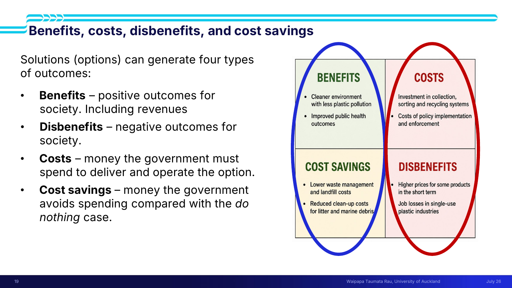

> [!quote] Slide 19 — solutions can generate four types of outcome
> - **Benefits** — positive outcomes for society. **Including revenues**
> - **Disbenefits** — negative outcomes for society
> - **Costs** — money the government **must spend to deliver and operate** the option
> - **Cost savings** — money the government **avoids spending compared with the do nothing case**

> [!important] Note the definition of a cost saving
> It is defined **relative to the counterfactual**, not in absolute terms. Change your do-nothing and every cost saving in your analysis changes with it — another reason [[#🧭 L5-C05 · Step 1 — the counterfactual, and why it decides the answer|C05]] is load-bearing.

> [!example] From the transcript
> **Benefit incl. revenue:** City Rail Link's **farebox revenue**.
> **Disbenefit:** a plastics tax raises costs **all through the supply chain** — a company that can't bear it goes out of business and **people lose their jobs**.
> **Cost as disbenefit:** *"The government has to take money from somewhere… **less money for education, less money for hospitals, less money for the new bridge we need.**"* The opportunity cost of implementation is real.

> [!warning] Common trap
> Counting only benefits and costs. If your analysis has no disbenefits in it, you have almost certainly not looked at who loses.

*📄 Source: slide 19 · transcript*

---

## 🫀 L5-C07 · Valuing a life — VoSL and willingness to pay

> [!question] Cue questions
> - Define VoSL precisely — what it is and what it is not.
> - Give the four points in its history, with the survey sizes.
> - What is it weighed against, and at what rate?

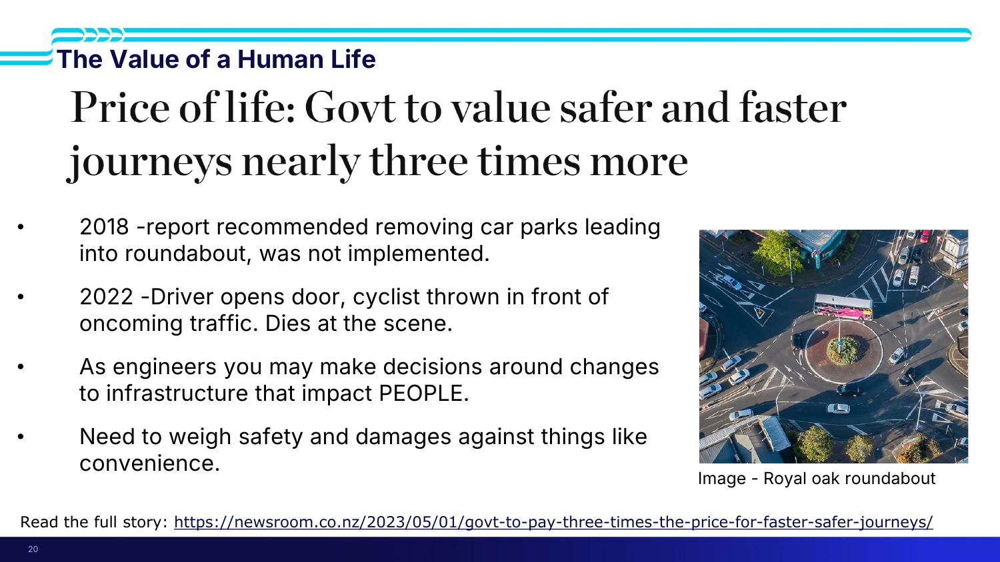

> [!example] Royal Oak roundabout (slide 20) — why this isn't abstract
> - **2018** — report **recommended removing car parks** leading into the roundabout. **Was not implemented.**
> - **2022** — a driver opens a door; a cyclist is **thrown in front of oncoming traffic** and **dies at the scene**.
> - *"As engineers you may make decisions around changes to infrastructure that impact **PEOPLE**."*
> - *"Need to weigh **safety and damages** against things like **convenience**."*
>
> Further reading linked on the slide: Newsroom, 1 May 2023 — *"Govt to pay three times the price for faster, safer journeys"*.

> [!important] **Value of a statistical life (VoSL) = $12.5 M NZD**
> > *"The VoSL is **not the value of an identifiable person's life**. It is an economic measure of **how much society is willing to pay for small reductions in mortality risk across a population**. It is commonly used in social cost-benefit analyses of transport, environmental, and public health projects."* (slide 21)

### How the figure moved (slide 22, NZTA)

| Study | Value (NZD) |
|---|---|
| **700-person survey, 1991** | **$2 M** |
| Doubled in **1998** | **$4 M** |
| Before COVID, inflation pushed it to | **$4.53 M** |
| **8,000-person survey, 2023** | **$12.5 M** |

### What it's weighed against (slide 22)

| Quantity | Value |
|---|---|
| Saving transport time, **pre-2023** | **$7.80 / hr** |
| Saving transport time, **post-2023** | **$19.53 / hr** |
| **Not being stuck in congestion** | **$36.18 / hr** |

> Benefit = **hours saved × $36.18**.

> [!important] Willingness to pay / willingness to accept (slide 23)
> **"The willingness of someone to pay to avoid a bad outcome, or the amount they would accept to give something up."**
>
> Methods named: **surveys** (contingent valuation, NZ General Social Survey, overall life satisfaction) · **wellbeing valuation method** · **quality adjusted life years** · **subjective wellbeing valuation** · **market studies** · **wellbeing adjusted life year (WELLBY)** · **hedonic pricing**.
>
> Guidance linked: **UK Green Book** guidance on wellbeing · **Australian Social Value Bank** · Treasury's own material on WTP and valuation methods.

> [!tip] What the number is really for
> Not to price a life — to **stop safety losing by default because it has no number** while convenience has one ($36.18/hr).

*📄 Source: slides 20–23 · transcript*

---

## 🔻 L5-C08 · Steps 3 & 4 — identify, quantify, monetise

> [!question] Cue questions
> - Describe the three stages and the adjective the slide attaches to each.
> - How many impacts should you actually monetise?
> - Work the congestion example through all three stages.

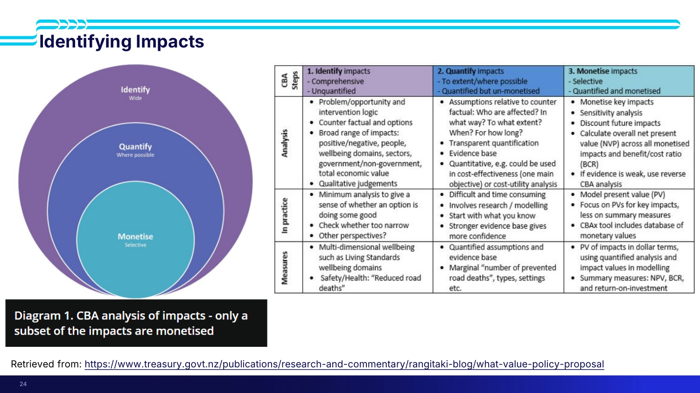

> [!important] The funnel (slides 18 and 24)
> | Stage | Scope | Output |
> |---|---|---|
> | **1. Identify** impacts | **Wide** — comprehensive | **Unquantified** |
> | **2. Quantify** impacts | **Where possible** — to extent | **Quantified but un-monetised** |
> | **3. Monetise** impacts | **Selective** | **Quantified and monetised** |
>
> *"Diagram 1. CBA analysis of impacts — **only a subset of the impacts are monetised**."*

> [!example] The congestion chain, worked (slide 18)
> | Stage | What you do |
> |---|---|
> | **Identify** | *"Reduced congestion increases transport efficiency, reduces travel times which also reduce driver frustration"* — impacts on people |
> | **Quantify** | By how much is congestion reduced, therefore **how much time saved**; carbon emissions avoided; vehicle operating cost saved |
> | **Monetise** | Through metrics like the **Value of Travel Time Savings (VTTS)**, the **Emissions Trading Scheme**, and **CBAx** |

> [!important] **Monetise 1–3 primary impacts** (slide 27)
> *"Try to monetise the impacts (**1–3 primary impacts**) you are trying to improve (**problem statement**)."*
>
> The selection rule is **relevance to your problem statement**, and — from the transcript — **magnitude**: *"It doesn't make sense to bother quantifying a facet that's only going to be −$1 million when the other pieces of the pie are in the **billions**."*

> [!tip] What each stage looks like *in practice* (slide 24)
> - **Identify** — minimum analysis to sense whether an option does some good; check whether **too narrow**; other perspectives?
> - **Quantify** — difficult and time-consuming; involves research and modelling; **start with what you know**; a stronger evidence base gives more confidence
> - **Monetise** — model present value; focus on PVs for key impacts, less on summary measures; **if evidence is weak, use reverse CBA analysis**

> [!warning] Do the divergent brainstorm *before* opening the database
> Brainstorm all potential impacts of the do-nothing **and** your options first, then go to the impacts database. Start from the database and you'll only find impacts someone else already thought of. *(transcript)*

*📄 Source: slides 18, 24, 27 · transcript*

---

## 🗄 L5-C09 · CBAx — and why the numbers aren't the point

> [!question] Cue questions
> - What is CBAx and how many impacts does it hold?
> - Four things it provides.
> - Five limitations — and which one is flagged as important for Systems Week?

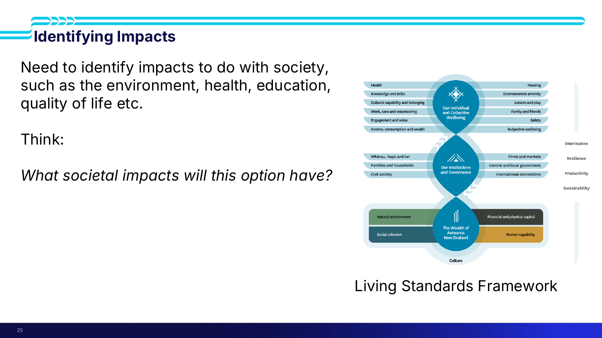

> [!quote] Slide 26
> **The CBAx spreadsheet tool is a spreadsheet model that contains a database of values for monetising impacts on the 12 domains of wellbeing.**
> - Allows a **consistent approach** to cost benefit analysis through **common assumptions and values**
> - **Long term and broad view** of societal impacts, costs and benefits
> - **Monetise and discount** impacts where possible
> - **Transparency around assumptions and evidence base**

**Over 250 monetised impacts** live in the Impacts Database tab (slide 28).

The 12 domains come from the **Living Standards Framework** (slide 25 — taught properly in [[../../Lecture6/notes/L6-notes|L6]]): health · knowledge and skills · cultural capability and belonging · work, care and volunteering · engagement and voice · income, consumption and wealth · housing · environmental amenity · leisure and play · family and friends · safety · subjective wellbeing.

> [!tip] Other tools (slide 27)
> **Waka Kotahi Monetised Benefits and Costs Manual** · **PEET — Project Emissions Estimation Tool** · otherwise research into primary and secondary sources. **Full worked example: page 24 onwards of the CBAx guide.**

> [!important] Limitations of CBAx (slide 30)
> - Not all impacts will be relevant to your project
> - Not all impacts are listed — **check the impacts database first, then move to other sources**
> - Organisations quantify impacts on the **best available evidence** — *"sometimes it might not be the best evidence"*
> - **Data sets can be incomplete**, especially if trying something new
> - ⭐ **"Gives exact dollar values, estimation unlikely to be that accurate (IMPORTANT FOR SYSTEMS WEEK)"**
>
> > **"Understand the assumptions behind the number, not the number itself."**

> [!warning] And check the assumptions transfer to New Zealand
> A report everyone piled onto in 2025 turned out to rest on assumptions that didn't hold here — different geography, people behaving differently, an educational intervention that wouldn't be as effective locally. **Always bring it back to the NZ context.** *(transcript)*

*📄 Source: slides 25–28, 30 · transcript*

---

## 🧾 L5-C10 · Worked example — the plastics monetisation, in full

> [!question] Cue questions
> - Reconstruct the do-nothing wellbeing calculation, including the assumption list.
> - Reconstruct the marine-life calculation including the currency conversion.
> - Reconstruct the do-medium littering benefit including the scaling step.
> - Compare the magnitudes. What does that mean for "success"?

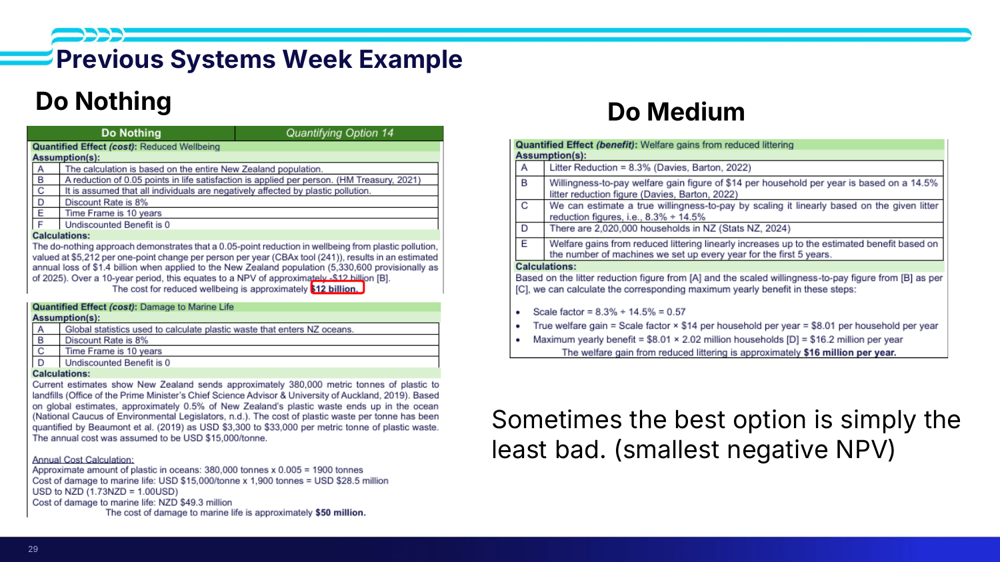

> [!example] **Do Nothing — cost: reduced wellbeing** (slide 29)
> **Assumptions**
> - A. Calculation is based on the **entire New Zealand population**
> - B. A reduction of **0.05 points in life satisfaction** applied per person (**HM Treasury, 2021**)
> - C. **All** individuals are negatively affected by plastic pollution
> - D. **Discount rate 8%**
> - E. **Time frame 10 years**
> - F. **Undiscounted benefit is 0**
>
> **Calculation**
> A 0.05-point reduction in wellbeing, valued at **$5,212 per one-point change per person per year** (**CBAx tool (241)**), applied to the NZ population (**5,330,600**, provisional 2025) → estimated **annual loss of $1.4 billion**. Over 10 years → **NPV ≈ −$12 billion**.

> [!example] **Do Nothing — cost: damage to marine life** (slide 29)
> **Assumptions** — global statistics used for plastic entering NZ oceans · discount rate 8% · 10-year time frame · undiscounted benefit 0
>
> **Calculation**
> - NZ sends **~380,000 metric tonnes** of plastic to landfill (Office of the PMCSA & University of Auckland, 2019)
> - **~0.5%** ends up in the ocean (National Caucus of Environmental Legislators, n.d.)
> - Cost per tonne quantified at **USD $3,300–$33,000** (Beaumont et al., 2019); **annual cost assumed USD $15,000/tonne**
> - 380,000 × 0.005 = **1,900 tonnes**
> - USD $15,000 × 1,900 = **USD $28.5 million**
> - USD → NZD at **1.73 NZD = 1.00 USD** → **NZD $49.3 million ≈ $50 million**

> [!example] **Do Medium — benefit: welfare gains from reduced littering** (slide 29)
> **Assumptions**
> - A. Litter reduction = **8.3%** (Davies, Barton, 2022)
> - B. WTP welfare gain of **$14 per household per year**, based on a **14.5%** litter reduction figure (Davies, Barton, 2022)
> - C. Estimate a true WTP by **scaling linearly**: 8.3% ÷ 14.5%
> - D. **2,020,000 households** in NZ (Stats NZ, 2024)
> - E. Welfare gains increase linearly up to the estimated benefit, based on the number of machines set up each year **for the first 5 years**
>
> **Calculation**
> - Scale factor = 8.3% ÷ 14.5% = **0.57**
> - True welfare gain = 0.57 × $14 = **$8.01 per household per year**
> - Maximum yearly benefit = $8.01 × 2.02 million = **$16.2 million per year ≈ $16 million**

> [!important] Now compare the magnitudes
> | | Magnitude |
> |---|---|
> | **Do nothing** — wellbeing alone | **−$12 billion** (10-yr NPV) |
> | **Do nothing** — marine life | **−$50 million** |
> | **Do medium** — reduced littering | **+$16 million per year** |
>
> **The intervention does not make the problem go away. It makes it less bad.**
>
> > **"Sometimes the best option is simply the least bad. (smallest negative NPV)"** — slide 29

> [!tip] This is the appendix standard
> Every one of those blocks has the same shape: **lettered assumptions, each cited → arithmetic shown step by step → a rounded headline figure in bold.** Copy the format exactly.

*📄 Source: slides 10, 29 · transcript*

---

## 📉 L5-C11 · Step 5 — discounting, and where the 8% comes from

> [!question] Cue questions
> - What rate do you use, and what are the two systems-level concepts behind it?
> - How does 403's discount rate differ conceptually from 303's?
> - What is discounting *for*, at systems level?

> [!quote] Slide 31
> Because these projects are very large and can span several years, the **time value of money becomes very important**. You must **discount future costs and benefits to today's value**.
>
> **"At systems level this is maximising the return for each dollar of taxpayers' money spent."**

| | **Project level (303)** | **System level (403)** |
|---|---|---|
| Basis | **Weighted average cost of capital (WACC)** | **Social opportunity cost of capital (SOC)** — the opportunity cost of private investment **Social rate of time preference (SRTP)** — the cost of benefits now vs in the future |

> [!important] **"No need to calculate — use 8%."** (slide 32)

> [!warning] Discounting favours early benefits and later costs
> Later cash flows are discounted harder, so a project generating benefits in the first ten years looks far better than one taking 50 years to deliver the same benefits. On large, long projects the discount rate is doing enormous work on the result. *(transcript)*

*📄 Source: slides 31–32 · transcript*

---

## 💸 L5-C12 · Step 6 — is the CBA worth doing at all?

> [!question] Cue questions
> - State the rule, and its nickname.
> - How expensive can a CBA get?
> - Who carries them out?

> [!quote] Slide 33
> In practice, is it worth pursuing the cost benefit analysis?
> - Can be **back of the envelope**, or very involved research that can **cost over $1 million**
> - **The cost of conducting the CBA must NOT exceed the potential value of the project. ("CBA of the CBA")**
> - Who carries it out? **Policy advisors — Treasury, consultants** · **decision makers (Government)**
> - Is more research required?

> [!tip] From the transcript
> *"It doesn't make sense to do a CBA for a societal project that's only going to cost $1–5 million. That's pennies compared to what it might cost to collate all of this data."* **Project size determines whether analysis is warranted.**

*📄 Source: slide 33 · transcript*

---

## 📝 L5-C13 · Step 7 — writing it up

> [!question] Cue questions
> - Six requirements for presenting the values.
> - What must be highlighted if monetary costs exceed monetary benefits?
> - Where do sources and assumptions go?

> [!quote] Slide 34 — how should these values be presented?
> - **Use summary tables:** costs, benefits, and metrics (*Guide to Social Cost Benefit Analysis*, **p. 41**)
> - **In practice should have ranges or confidence intervals rather than point estimates** — *point estimates are fine for Systems Week*
> - **Appropriate accuracy. NOT to the nearest dollar! Usually 2 SF!** — tens of thousands? hundreds of thousands? millions?
> - ⭐ **"If monetary costs outweigh monetary benefits but there are large intangible benefits, this MUST be highlighted to the reader in the summary."**
> - Should provide the **intuition behind the result** (tone, feeling)
> - **Sources and assumptions must be included in the appendix**

> [!important] Don't drop what you can't price
> From the transcript: house people and they **spend less time in hospital**, place **less burden on society**, and draw **less welfare**. Some of that is monetisable; some isn't; all of it belongs in the business case. And per the slide, if the numbers say no but the intangibles say yes, **saying so in the summary is mandatory, not optional**.

> [!tip] What you'd properly do
> A real **sensitivity analysis** — vary the assumptions and see whether the answer holds. *(transcript)*

*📄 Source: slide 34 · transcript*

---

## 🚧 L5-C14 · Where the numbers stop

> [!question] Cue questions
> - Five limitation headings from slide 35.
> - Why is the flood example a *timeframe* problem rather than a costing problem?
> - What extra difficulty does the playground raise beyond "benefits are intangible"?

> [!quote] Slide 35 — limitations of the cost benefit analysis
> **What happens if you change the timeframe of analysis?**
> - A **2-year horizon may produce a very different result from a 20-year horizon**
> - What is the most appropriate timeframe, and why?
>
> **Short-term decision making can bias long-term outcomes.**
> - Government funding and **election cycles** often favour short-term thinking
> - Many of today's challenges are **intergenerational**
> - **Indigenous worldviews often encourage thinking across multiple generations**
>
> **Costs and benefits can be difficult to measure and monetise** — particularly intangible, social, cultural and environmental impacts (see [[../../Lecture6/notes/L6-notes|Lecture 6]]).
>
> **Do financial values reflect societal values?** CBA assigns monetary values to outcomes **different people value differently** — equity, biodiversity, conservation, national infrastructure, and **public versus private ownership**.
>
> **Is the decision driven by values or politics, masquerading as a financial case?** Assumptions, discount rates and valuation methods **can influence the preferred option**; political priorities **may shape the analysis as much as the evidence**.

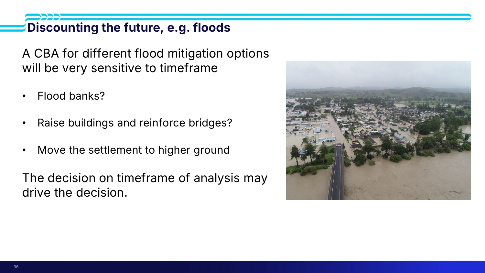

> [!example] Flooding (slide 36) — timeframe as the real decision variable
> A CBA for flood mitigation is **very sensitive to timeframe**. The options:
> - **Flood banks?**
> - **Raise buildings and reinforce bridges?**
> - **Move the settlement to higher ground?**
>
> > **"The decision on timeframe of analysis may drive the decision."**
>
> From the transcript: *"What good is it to have an option that makes people safe in **20 years' time** when they're **losing their houses tomorrow**?"* City Rail Link was an **8–9 year construction** from a 2015 business case. An option that scores well may not help the people experiencing the impact **now**.

> [!example] Parliament playground (slide 37)
> **Costs are easy to measure. Benefits are all non-financial.** How would you measure improvements to **the culture of Parliament**? **Attracting more talent as MPs**? **Trust in institutions**?
>
> Two further questions the slide adds beyond "it's intangible":
> - **What timeframe would you measure on?**
> - ⭐ **Attribution of benefits to the playground** — even if trust in institutions rises, was it the playground?

> [!example] Interisland ferries (slide 38)
> - **What value would you place on a nationally integrated rail system?**
> - **How do you weigh resilience to seismic events? Climate change?**
> - **What timeframe will you measure on? What will you measure? Against what counterfactual?**
>
> From the transcript: cancelled because works on either side of the channel were too expensive — but what is the **lost productivity** of ships due in **2028** arriving **2030**? *"Did they think about that? Did they not? Who's to say — I'm not in cabinet."*

*📄 Source: slides 35–38 · transcript*

---

## ✅ Summary — the key takeaways (slide 39, plus the rest)

> [!quote] Slide 39 — key takeaways, verbatim
> - **Identify, select, and rank quantifiable impacts by order of significance.**
> - **Monetise these impacts using CBAx, comparable cases, studies, or other reports.**
> - **Not all impacts will be monetizable or even quantifiable, but these qualitative impacts should still be communicated in the report.**
> - **Compare non-monetary impacts using quantitative/qualitative analysis like MCA, or discussion.**

Plus, from the rest of the lecture:

5. **The counterfactual decides the answer.** Bridge NPV is **+$5 m** against no-ferry and **−$5 m** against ferry. Do nothing more (BAU) or do less (roll back) — say which.
6. **Four outcome types:** benefits (incl. revenue), disbenefits, costs, and **cost savings measured against the do-nothing**.
7. **VoSL = $12.5 M NZD** — society's willingness to pay for **small reductions in mortality risk across a population**, not one person's life. Weighed against **$36.18/hr** for congestion.
8. **Monetise 1–3 primary impacts**, tied to your problem statement. **Understand the assumptions, not the number.** CBAx's exact dollar values are more precise than they are accurate.
9. **8% discount rate** (SOC and SRTP at systems level, vs WACC at project level). **2 significant figures**, never the nearest dollar.
10. **Sometimes the best option is simply the least bad** — smallest negative NPV. Plastics do-nothing was **−$12 bn** on wellbeing alone.

---

## 🧪 Self-test

> [!question]- 13 free-recall questions
> 1. What does a social CBA compare that a 303 CBA doesn't? Give one social benefit and one social cost example.
> 2. Name the six cost-estimate stages. Where does your project sit, and what does that imply for precision?
> 3. State the time value of money and give the accept/reject rule for NPV, BCR and IRR. Why can't you use one alone?
> 4. List the seven steps of a social CBA in Treasury's wording.
> 5. Work the bridge/ferry example: both NPVs, and what the example proves.
> 6. Give the two readings of "do nothing". What is the do-nothing case *for*, beyond being a baseline?
> 7. Name the four outcome types. What is a cost saving measured against, and why does that matter?
> 8. Define VoSL precisely. Give its value, the survey that produced it, and what it is *not*.
> 9. Convenience has a price ($36.18/hr) and safety would have none without VoSL. What goes wrong in a CBA without a VoSL figure?
> 10. Describe the identify → quantify → monetise funnel with the adjective attached to each stage. How many impacts do you monetise, and on what basis?
> 11. Reconstruct the marine-life calculation from 380,000 tonnes to $50 million, naming each assumption.
> 12. Do-nothing is −$12 bn; the best package recovers $16 m a year. Has the analysis failed? Justify.
> 13. Your monetary costs exceed your monetary benefits, but the intangible benefits are large. What are you required to do?

---

> [!info]- Related notes
> - `L5-summary.md` · `L5-flashcards.tsv`
> - `../context/admin-and-dates.md`
> - **Comes from:** [[../../Lecture4/notes/L4-notes|L4 — business cases, shortlist packages, the financial case]]
> - **Feeds into:** [[../../Lecture6/notes/L6-notes|L6 — GDP, Living Standards Framework, MCA]] — what to do with impacts you *cannot* monetise · [[../../Lecture7/notes/L7-notes|L7 — stakeholders]] (step 2, who gains and who loses)
