# 📊 Lecture 6 — GDP, government spending, and things that metrics miss

> [!abstract] Why this matters
> [[../../Lecture5/notes/L5-notes|L5]] told you to monetise 1–3 impacts and communicate the rest. **This lecture is "the rest."** After it you can size a proposal against the actual government budget, explain why New Zealand's productivity is the long-run constraint, and use the **four capitals** and **multi-criteria analysis** to argue about things a social CBA cannot price.
>
> Juliet's half states the tension out loud: *"We are giving you assignments on **wicked problems that can't be solved**, and the tools that we've given you **can't solve them**."*

> [!info] Sources
> **Slides:** `ENGGEN_403_Lecture_06_2026.pdf` — 35 pages. **Marc Lewis and Juliet Gerrard**, 31 July 2026.
> **Transcript:** auto-generated, quality good.
>
> ⚠ The deck's own footer numbering runs **one ahead of the PDF page** from the GDP-limitations slide onward (a slide numbered 17 was deleted). Figures here are named by the **footer number you see on the slide**.
>
> *Prerequisites: [[../../Lecture5/notes/L5-notes|L5]] — social CBA, CBAx, the identify/quantify/monetise funnel. [[../../Lecture2/notes/L2-notes|L2]] — wicked problems.*

> [!quote] Stated learning outcomes (slide 2)
> - **Develop an understanding of what GDP is and how it is measured.** Interpret key economic indicators and **compare New Zealand's performance with other major economies**.
> - **Evaluate the strengths and limitations of GDP** as a measure of a country's economic performance and success.
> - **Explore alternative measures** of economic development and wellbeing, and consider how they could be applied in New Zealand.
> - **Apply broader wellbeing frameworks, such as the Living Standards Framework**, to assess systems-level impacts beyond GDP.

## 🗺 Concept map

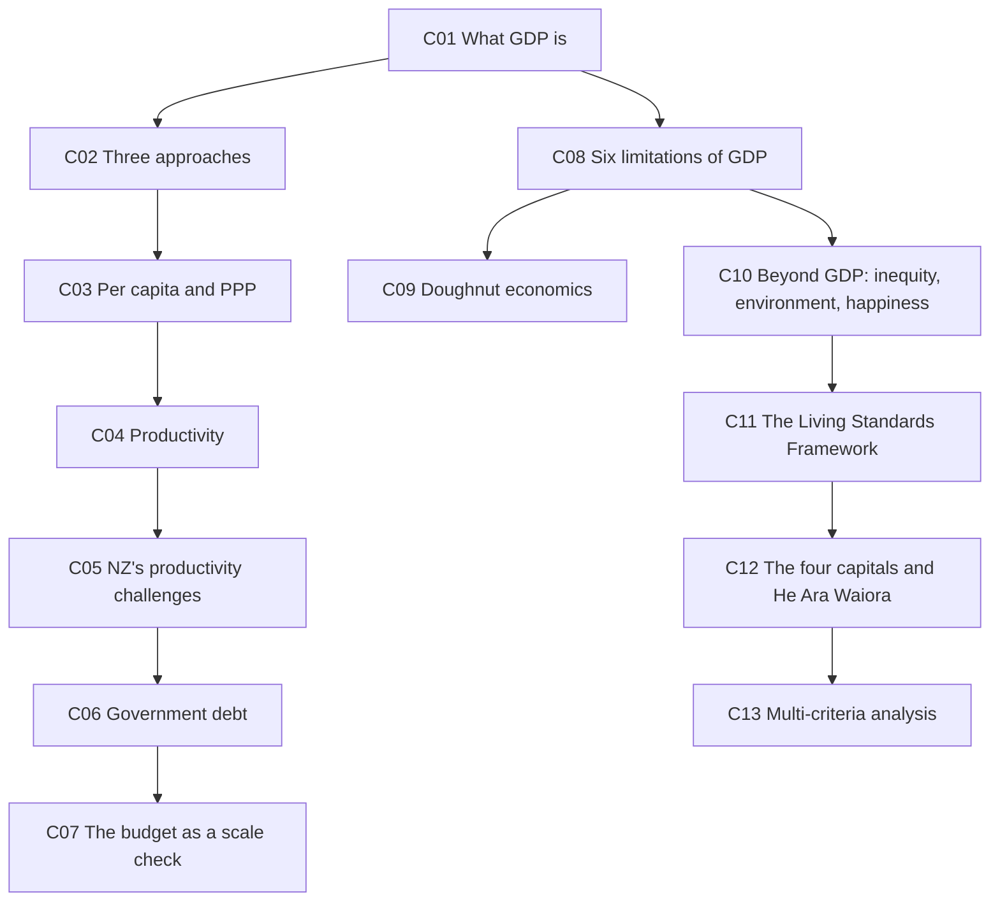

---

## 📈 L6-C01 · What GDP is

> [!question] Cue questions
> - Define GDP precisely — which four words in the definition are load-bearing?
> - Why is GDP the most widely used measure, given all its flaws?
> - Who measures it in New Zealand, and how?

> [!quote] Slide 5
> - GDP (Gross Domestic Product) is the **total value of all final goods and services produced within a country over a specific period**.
> - It is the **most widely used measure** of a country's economic output.
> - GDP is used because it provides a **simple, standardised, and internationally comparable** measure of economic activity.
> - In New Zealand, GDP is estimated by **Stats NZ** using **surveys, administrative data, and government financial information**.

> [!important] The load-bearing words
> **"Final"** — intermediate goods are excluded, or you'd double-count. **"Within a country"** — GDP measures output inside our borders, which is why imports are subtracted.
>
> And the honest reason for its dominance: **it is relatively easy to collect and compare.** Not that it's the best measure — that it's the measurable one.

> [!example] Scale, for calibration *(transcript)*
> | | GDP |
> |---|---|
> | **New Zealand** | ~**$430 bn (2025)**, now ~$450 bn — an increase of nearly $20 bn in a year |
> | **United States** | ~**$30 trillion** |
>
> *"If you're thinking of the size of our economy — our economy is only 400 billion. So it should give you an idea of the **order of magnitude** for some of these projects."*

*📄 Source: slide 5 · transcript*

---

## ➕ L6-C02 · The three approaches to measuring GDP

> [!question] Cue questions
> - Write the expenditure formula and define every term.
> - Why are imports subtracted?
> - Name the other two approaches and what they sum.

> [!important] The expenditure approach (slide 6)
> $$\text{GDP} = C + I + G + (X - M)$$
>
> | Term | Definition (slide wording) |
> |---|---|
> | **C** — Consumption | **Household spending** on final goods and services |
> | **I** — Investment | **Business spending on capital goods** (buildings, machinery, equipment) **and inventory growth** |
> | **G** — Government spending | Government purchases of goods and services — **excluding transfer payments** |
> | **(X − M)** — Net exports | Exports of goods and services **minus** imports |

> [!tip] Why imports are subtracted
> *"Those imports are **counted in the country they are produced in**. So it reduces that double counting. That's not our productivity — that's another country's productivity."* GDP is bounded by the country's economy. Example: cars manufactured overseas. *(transcript)*

> [!important] The other two approaches (slide 7)
> - **Production approach** (a.k.a. output method) — the **sum of value added throughout the value chain**
> - **Income approach** — the **sum of incomes generated by people and business**: wages, rent, interest, profits
>
> All three should give the same answer. *"Mass and energy balance, basically."*

> [!warning] Watch the exclusion in G
> **Transfer payments** (benefits, superannuation paid out) are **not** in G — the government isn't buying a good or service, it's moving money. Easy mark to lose.

*📄 Source: slides 6–7 · transcript*

---

## 🌍 L6-C03 · GDP per capita and purchasing power parity

> [!question] Cue questions
> - What is GDP per capita used for, and what three things is it associated with?
> - Where does NZ rank, and what do the top countries have in common?
> - What does PPP adjust for, and what does it do to the world ranking?

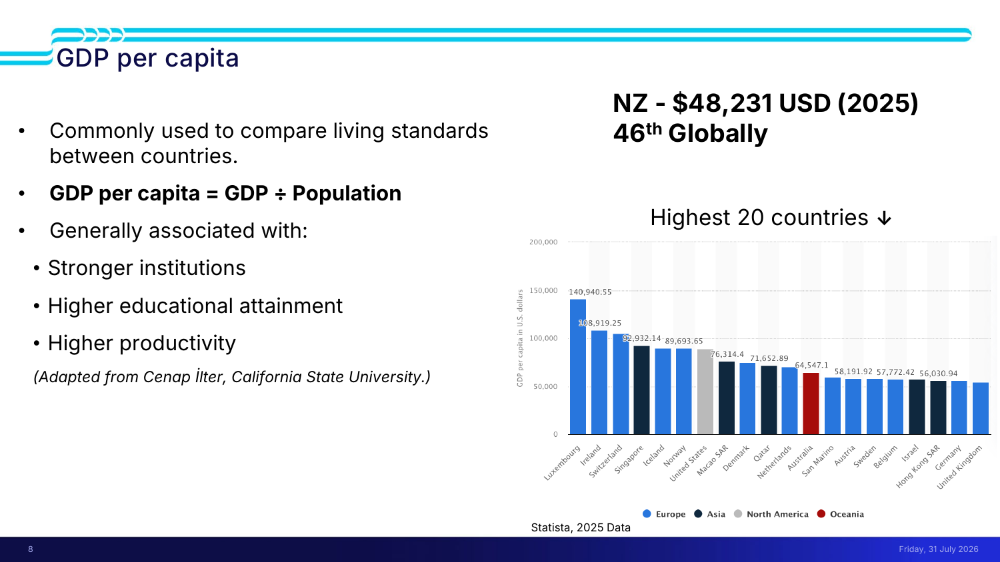

> [!quote] Slide 8
> - **Commonly used to compare living standards between countries**
> - **GDP per capita = GDP ÷ Population**
> - Generally associated with: **stronger institutions · higher educational attainment · higher productivity**
>
> **New Zealand — $48,231 USD (2025), 46th globally.** *(Statista, 2025 data)*

The top of the chart: **Luxembourg $140,941 · Ireland $108,919 · Switzerland · Singapore $92,932 · Iceland $89,694 · Norway · United States**, then Macao SAR $76,314, Denmark, Qatar $71,653, Netherlands, **Australia $64,547**, San Marino, Austria $58,192, Sweden $57,772, Belgium, Israel, Hong Kong SAR $56,031, Germany, United Kingdom.

> [!important] What the top countries have in common *(transcript)*
> **They're small.** Luxembourg, Ireland, Switzerland, Singapore. So it isn't size — it's **productivity**:
> - **Stronger institutions** = lower corruption, less bureaucracy, **easy to collaborate**
> - **Higher education** = a more productive population that starts businesses and creates high-value products
>
> *"Whereas in New Zealand… we produce things like agricultural products, milk, dairy, meat — very little in the way of **value added** to those commodities."*

> [!important] Purchasing power parity (slide 9, World Bank)
> **PPP adjusts GDP for cost of living.** A Swiss franc buys less in Switzerland than a dollar buys here.
>
> **Under PPP, China has the largest economy in the world, not the US.** New Zealand sits in the middle — neither highest nor lowest. *(transcript)*

> [!tip] Why you need both
> Raw GDP compares **size**. Per capita compares **average living standards**. PPP compares **what that money actually buys**. Quoting one alone is how you get a wrong answer that looks rigorous.

*📄 Source: slides 8–9 · transcript*

---

## ⚙️ L6-C04 · Productivity

> [!question] Cue questions
> - Give Treasury's definition of why productivity matters.
> - How is productivity commonly measured?
> - Compare NZ, Australia and the OECD average — and note the hours worked.

> [!quote] Treasury, quoted on slide 10
> **"Productivity is the biggest long-run determinant of wages and living standards.** Our capacity to raise our standard of living depends on our ability to **raise output per worker** — the amount of goods and services each worker produces and **the value they add**."*

> [!quote] Slide 10
> - Measures **how efficiently an economy converts inputs into output** (commonly **GDP per hour worked**)
> - New Zealand's labour productivity has improved over time but has **grown more slowly than many OECD countries since the 1970s**
> - A relatively large share of investment is directed towards **residential property** rather than innovative, export-oriented industries
> - **Lower innovation, technology diffusion, and knowledge spillovers** contribute to slower long-term productivity growth
> - **Problems financing investment over medium to long term**

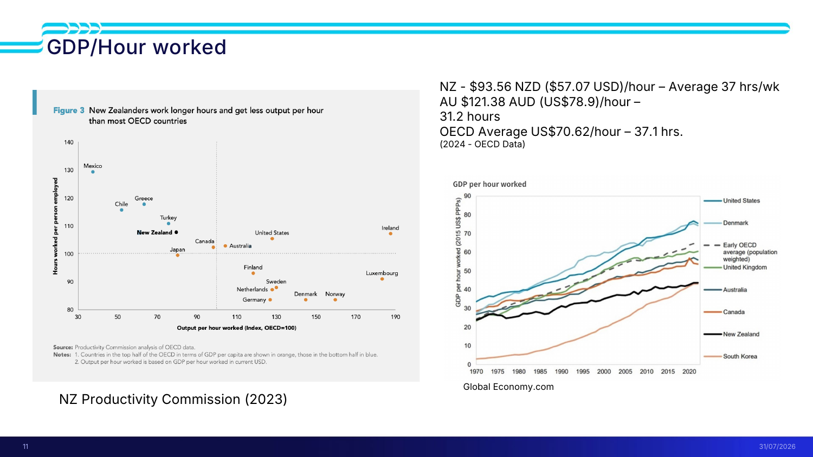

> [!important] GDP per hour worked (slide 11, 2024 OECD data)
> | | Output per hour | Average hours/week |
> |---|---|---|
> | **New Zealand** | **$93.56 NZD ($57.07 USD)** | **37** |
> | **Australia** | **$121.38 AUD (US$78.90)** | **31.2** |
> | **OECD average** | **US$70.62** | **37.1** |
>
> **Read those two columns together.** Australians produce ~38% more per hour while working ~6 fewer hours a week. New Zealand works OECD-average hours for well below OECD-average output.

> [!warning] The misconception this kills
> *"It's not because Kiwis are lazy. You guys aren't lazy. **But it matters about what we produce** — the things that we produce, the value of the things that we produce."*
>
> In the 1970s NZ's productivity was **on par with the Scandinavian countries**. They then invested in **pharmaceuticals, software, financial institutions**; NZ stayed in **forestry, dairy, meat**. *"You cut down the tree, you process the wood, you sell the wood"* — versus turning the tree into something worth many times more.

> [!tip] Revenue per employee (slide 12)
> Another proxy for productivity: **high-value firms show high revenue per employee.** **Rocket Lab — $886,354 (2025).** But note the catch from the transcript: **Rocket Lab is based in the US**, not New Zealand. Companies that grow large enough tend to leave — an outflow of people and resources that feeds the same cycle.

*📄 Source: slides 10–12 · transcript*

---

## 🇳🇿 L6-C05 · New Zealand's productivity challenges

> [!question] Cue questions
> - List the six structural challenges.
> - Why is real estate investment less productive than deep tech?
> - What is a capital gains tax, and what does its absence do?

> [!quote] Slide 13
> - **Small domestic market** limits economies of scale and competition
> - **Many businesses are small**, reducing investment in automation, R&D and exporting
> - **Geographic isolation** increases transport and supply chain costs
> - Investment has historically favoured **residential property** over highly productive industries
> - **Manufacturing has declined**, reducing high-value export production
> - **Agriculture remains important** but faces environmental and market pressures

> [!important] Why property is a low-productivity destination for capital *(transcript)*
> **Real estate transfers wealth; it doesn't create it.** *"You buy a house for $5 million, a few years later you sell it — you're just **transferring that wealth from buyers to sellers**. It's a less productive form of transaction."*
>
> Contrast **deep-tech start-ups and pharmaceuticals**: they take something, manufacture it, and produce benefits across society.

> [!important] **Knowledge spillover / technology diffusion** — the second-order effect
> Skills learned in software or engineering **transfer** to pharmaceuticals, civil, chemical engineering. High-value industries leak capability into each other. **Real estate, farming and agriculture are relatively segmented** — the spillover doesn't happen.

> [!example] Capital gains tax *(transcript)*
> **A tax on the increase in the value of assets. New Zealand is one of the only places in the world without one.**
>
> The chain: no CGT → heavy foreign investment in housing pre-2018 (*"no tax on the profits for owning their 15th home"*) → prices rise → first-home buyers priced out. Still under discussion; likely an election issue this year.

> [!warning] The perpetual cycle — this is the thing to be able to draw
> ```mermaid
> graph LR
>     A[Low-value industries] --> B[Low productivity]
>     B --> C[Less tax revenue]
>     C --> D[Less government money to invest]
>     D --> E[Less funding for startups and R&D]
>     E --> A
> ```
> *"There's less available to fund the next Rocket Lab… and it ends up in a perpetual cycle."*
>
> Live example from the transcript: **medicinal cannabis** — five large pharmaceutical companies in the space, **three went under in the last year**, one still going, *"because the market is so small."*

*📄 Source: slide 13 · transcript*

---

## 💳 L6-C06 · Government debt — the government credit card

> [!question] Cue questions
> - How does debt accumulate, and what is it good for?
> - What are the two costs of higher debt?
> - Why is debt a burden on future generations specifically?

> [!quote] Slide 14
> - **Budget deficits accumulate into government debt over time**
> - **Borrowing can fund long-term investments** (e.g. infrastructure, schools, hospitals)
> - **Higher debt increases future interest costs and reduces fiscal flexibility**
> - **Governments must balance today's needs with future obligations**

> [!important] Debt is not inherently bad — the interest is the problem
> As debt rises, **interest payments rise**, and interest is government **expenditure**. That leaves less in the kitty for everything else. *"It's a **burden on future generations**, because those interest payments need to be made in the future."*
>
> COVID is the named example of a large debt-funded spend.

*📄 Source: slide 14 · transcript*

---

## 💵 L6-C07 · The budget — your reality check on scale

> [!question] Cue questions
> - What are NZ's annual revenues and expenditures, and what does the gap imply?
> - What is the single sentence that should govern the size of your recommendation?

> [!quote] Slide 15
> - Government collects **revenue through taxes and other sources**
> - Governments have **limited financial resources**
> - **Every dollar spent is a trade-off**
> - The budget determines **how public money is allocated**
> - **When expenditure exceeds revenue, the difference is funded through borrowing**
>
> **New spending ~$2 bn · Total budget spend ~$155 bn**

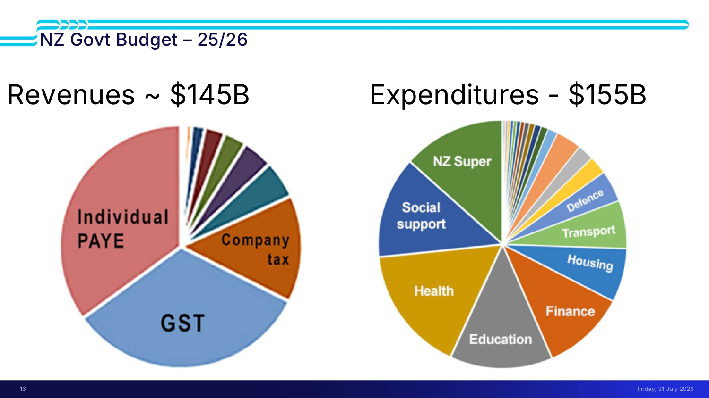

> [!important] The 25/26 budget (slide 16)
> | | |
> |---|---|
> | **Revenues** | **~$145 bn** — dominated by **individual PAYE**, then **GST**, then **company tax** |
> | **Expenditures** | **~$155 bn** — dominated by **NZ Super**, **social support**, **health**, **education**, then finance, housing, transport, defence |
>
> **The ~$10 bn gap is borrowed.** And note how small "new spending" is: **~$2 bn** of a **$155 bn** budget.

> [!warning] ⭐ The scale check for your project
> *"If you come up with your systems project and you're like 'our solution is going to cost $150 billion' — **that's all of the budget**. To spend on everything. Hospitals, bridges, roads, subsidising universities."*
>
> **Size your recommendation against ~$2 bn of new spending, not against $155 bn.** More detail in Lecture 10.

*📄 Source: slides 15–16 · transcript*

---

## 🚫 L6-C08 · The six limitations of GDP as a system goal

> [!question] Cue questions
> - Recite the six limitations.
> - Give the Christchurch example and say what it proves.
> - Explain "stocks vs flows" using the shoes and the two 70-year-olds.

> [!quote] Slide 18 — limitations of GDP as a system goal
> - **It lumps together goods and bads**
> - **It does not reflect distributional equity**
> - **It measures effort (what was spent) not achievement (what we have to show for it)**
> - **It doesn't capture the stocks of things that relate to well-being**
> - **It drives system behaviours by setting a short-term financial goal**
> - **It doesn't consider the inevitable limit to economic growth**

> [!example] 1 — Goods and bads: the Christchurch earthquakes
> *"I lived in Christchurch for the sequence of earthquakes. Disaster. Absolutely awful. Everybody's lives were completely upended. But **the year after, GDP looked fantastic**, because we had to spend so much money putting everything back together."*
>
> **Did the earthquake make us better off? No. Did GDP look good? Yes.**

> [!example] 2 — Distributional equity
> GDP is an **average**. *"It doesn't care how the money is distributed… we can all agree that GDP will tell you **nothing about that whatsoever**."* Where you set the acceptable ends of the distribution is a values question; that GDP is silent on it is not.

> [!example] 3 — Effort, not achievement
> *"If you spray money everywhere, GDP goes up. GDP doesn't say 'hold up — **what did you spend that on?**' You need other measures for that, like **productivity**."* This is why successive governments attack the previous one for inefficient spending using a metric that cannot see efficiency.

> [!example] 4 — Stocks vs flows ⭐
> **The shoes:** buying ten pairs of shoes contributes to GDP. **Having fifty pairs in the wardrobe does not** — though it certainly relates to wellbeing. Giving them away — good for wellbeing, possibly good for distributional equity — **also doesn't show up**. *"If my goal is increase GDP, I would just buy an infinite number of shoes. Dangerous goal for me to have."*
>
> **The two 70-year-olds:** one living on K Road with almost nothing; one in a fancy apartment above K Road with plenty. **Spending money to improve each one's wellbeing looks identical in GDP** — but one needs clothes, food, warmth and healthcare, and the other already has them.
>
> Scale it up: **refurbished hospitals, repaired schools, mended potholes — none of those stocks are in GDP.** Only last year's spending.

> [!example] 5 & 6 — Short-term goal, and the growth limit
> Setting a short-term financial goal **drives system behaviour** — *"not a bad thing to do, but you really need to think about it in a measured way when you are tackling long-term problems."*
>
> And: *"All these economic metrics assume growth is good, and generally speaking growth is good. But **you can't keep doing it forever or you will run out of resource**."*

*📄 Source: slide 18 · transcript*

---

## 🍩 L6-C09 · Doughnut economics

> [!question] Cue questions
> - Describe the two boundaries of the doughnut and what each represents.
> - State the 21st-century challenge in one sentence.

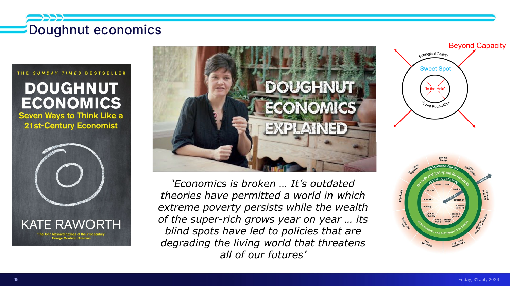

**Kate Raworth**, professor at Oxford — *Doughnut Economics: Seven Ways to Think Like a 21st-Century Economist*.

> [!quote] Slide 19
> *"Economics is broken … its outdated theories have permitted a world in which **extreme poverty persists while the wealth of the super-rich grows year on year** … its blind spots have led to policies that are **degrading the living world that threatens all of our futures**."*

> [!important] The diagram, in her own words *(video, transcribed)*
> | Region | What it is |
> |---|---|
> | **The hole in the middle** | A **space of deprivation / shortfall** — people without the essentials: food, education, electricity, income, decent housing |
> | **The doughnut itself** | The **safe and just space for humanity** — labelled the **"sweet spot"** on the slide, between the **social foundation** and the **ecological ceiling** |
> | **Beyond the outer crust** | **Ecological overshoot** — humanity putting more pressure on the planet than it can take: climate change, biodiversity loss, ozone depletion, chemical pollution |
>
> > **"The 21st-century challenge is a unique one: to get everybody out of poverty while coming back in at the same time. That's never been taken on before."**

> [!tip] Why it's in this lecture
> Juliet's framing: *"Some of those ideas will be useful to you as you think about **how clunky the tools that you've been given are** — that the world's been given are — to solve some of these problems."* It is a critique of the toolkit you were handed in L4 and L5, delivered in the same week.

*📄 Source: slide 19 · transcript*

---

## ⚖️ L6-C10 · Beyond GDP — inequity, environment, happiness

> [!question] Cue questions
> - Trace the causal chain from wealth inequity to pressure on the health and justice systems.
> - What is the social-cohesion argument, and what evidence is offered?
> - What did RFK say about GDP, and what's the counterargument?

> [!quote] Slide 20 — GDP is an average measure
> Inequity is rising in **wealth** and **health**. GDP does not tell us about **social cohesion**, **environmental health**, or **happiness**.

> [!important] The inequity → health → fiscal chain *(transcript)*
> ```mermaid
> graph LR
>     A[Inequity in wealth] --> B[Inequity in health]
>     B --> C[More people in poverty]
>     C --> D[More social problems]
>     D --> E[Pressure on health system]
>     D --> F[Pressure on justice system]
>     E --> G[Costs fall on all of us via the tax system]
>     F --> G
> ```
> Juliet's point: **even if you think the distribution is fair**, in a country that wants a **universal health system** the costs of inequity land on everyone. That is a priority-of-spend argument, not a moral one.
>
> Her local illustration: second homes on the waterfront where **berthing a boat costs tens of thousands a year**, a **2–3 minute walk** from people living on the street in Queen Street.

> [!important] Social cohesion
> *"As inequity rises, **social cohesion is challenged**. It's harder and harder for leaders to keep the country behind them."*
>
> Her litmus test: whether K Road feels safe to walk down as more people become homeless and the nights get longer — scaling up to **brawls in the news**, then to **major protests** (the slide uses the **parliamentary protest against the vaccine mandates**). And internationally: **Britain's seventh prime minister in a few years**, unheard of in a country with historically stable government.

> [!example] Happiness (slides 21–22)
> Some of the **poorest countries have some of the most content people**. Indices exist — in the one shown, **New Zealand came 12th**, *"which is pretty good really."* Juliet's own caveat: *"there's a **high correlation** here between the happy people and the high-GDP people."*
>
> **Gross National Happiness** has a formal index (slide 22).

> [!quote] Robert F. Kennedy (slide 21), on GDP
> GDP *"does not allow for the **health of our children**, the **quality of their education**, or the **joy of their play**. It measures everything, in short, **except that which makes life worthwhile**."*
>
> Juliet's two framings, both worth keeping:
> - *"A good example of very different policy positions that you might have with someone, but **shared values**."* (The speaker is the same RFK now running US health policy.)
> - **The counterargument:** *"it's easy to worry about these things when you have enough money to buy all the basics."*

> [!tip] The international frameworks (slide 23)
> **OECD Better Life Index** · **UK National Wellbeing** · **Wellbeing in Germany**. Juliet's summary: *"I'm not going to go through them all because **you'll see the same thing over and over with different words**."* They all ask: are we ageing well, is education good, do people have housing and jobs, is there justice, do people care about each other, can they relax in the environment.

*📄 Source: slides 20–23 · transcript*

---

## 🏛 L6-C11 · The Living Standards Framework

> [!question] Cue questions
> - What is the LSF, where does it come from, and how long has it been in development?
> - Name the three levels and how many items sit in each.
> - What happened to wellbeing in government between 2019 and 2025 — and what *didn't* change?

> [!quote] Slide 24
> - **Indicators to inform policy advice on well-being priorities**
> - LSF has been **iteratively under development since 2011**
> - **NZ Treasury attempt to capture hard-to-measure concepts**
> - **Research-informed framework**
> - **Draws on the OECD well-being approach, tailored to NZ**
> - **Informed by public feedback from surveys, consultation**

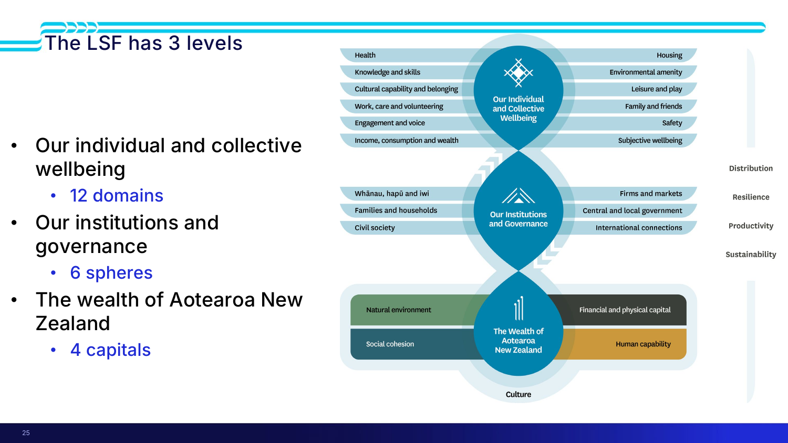

> [!important] The three levels (slide 25)
> | Level | Contents |
> |---|---|
> | **Our individual and collective wellbeing** | **12 domains** — health · knowledge and skills · cultural capability and belonging · work, care and volunteering · engagement and voice · income, consumption and wealth · housing · environmental amenity · leisure and play · family and friends · safety · subjective wellbeing |
> | **Our institutions and governance** | **6 spheres** — whānau, hapū and iwi · families and households · civil society · firms and markets · central and local government · international connections |
> | **The wealth of Aotearoa New Zealand** | **4 capitals** — natural environment · social cohesion · human capability · financial and physical capital |
>
> Cross-cutting the whole framework: **distribution · resilience · productivity · sustainability**.

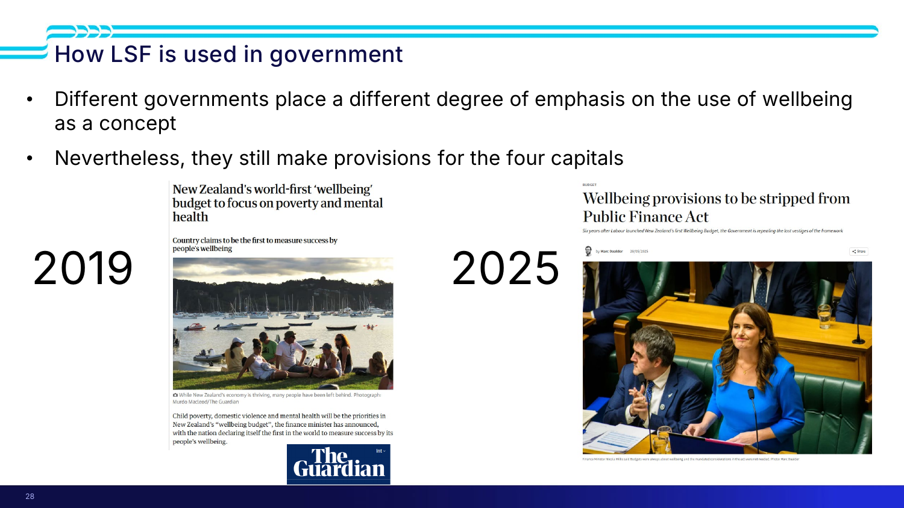

> [!important] How it's actually used (slide 28) — the nuance that matters
> **"Different governments place a different degree of emphasis on the use of wellbeing as a concept. Nevertheless, they still make provisions for the four capitals."**
>
> | | |
> |---|---|
> | **2019** | *"New Zealand's world-first 'wellbeing' budget to focus on poverty and mental health"* — the country claims to be **first in the world to measure success by people's wellbeing** |
> | **2025** | *"Wellbeing provisions to be **stripped from the Public Finance Act**"* — six years after Labour launched the first Wellbeing Budget, the government repeals the last vestiges of the framework |
>
> Juliet's reading: *"In many ways you will find that it's **not actually a difference in practice, it's more a difference in rhetoric**."* At the **policy level** Treasury drives it and **the four capitals are always considered**; at the **political level**, attention varies. Her source: **Tim Ng**, formerly NZ Treasury (now IRD), one of the people responsible for implementing the LSF — *"the rhetoric that you hear in the Parliament hall is very different from the policy work on the ground."*

> [!tip] Treasury's toolset (slide 29)
> **Living Standards Framework (LSF)** · **Cost benefit analysis monetisation (CBAx)** · **Better Business Case (BBC)**. All three of your week's tools come from the same place and are designed to interlock.

> [!tip] Measuring non-financials (slide 30)
> Two worked exemplars: **"How we measure child poverty" (Stats NZ)** and **"Our environment 2025 / Tō tātou taiao"**. Use them as models for how a hard-to-measure thing gets measured.

*📄 Source: slides 24–25, 28–30 · transcript*

---

## 🌿 L6-C12 · The four capitals — and He Ara Waiora

> [!question] Cue questions
> - Define each of the four capitals in the framework's own words.
> - What is the "assets" framing, and why does it point at intergenerational wellbeing?
> - What does He Ara Waiora add that the Western frameworks lack?
> - Why are you advised *not* to use it for the assignment?

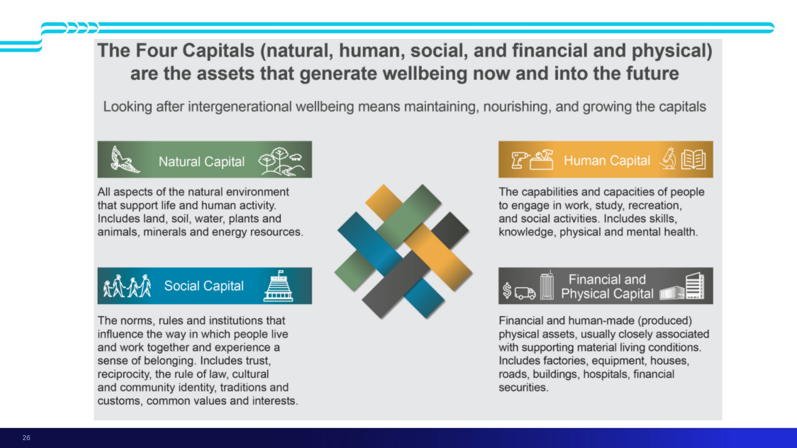

> [!quote] Slide 26 — the framing sentence
> **"The Four Capitals (natural, human, social, and financial and physical) are the assets that generate wellbeing now and into the future. Looking after intergenerational wellbeing means maintaining, nourishing, and growing the capitals."**

> [!important] The definitions — learn these, they are what you argue against in an MCA
> | Capital | Definition |
> |---|---|
> | **Natural** | *"All aspects of the natural environment that support life and human activity. Includes **land, soil, water, plants and animals, minerals and energy resources**."* |
> | **Human** | *"The **capabilities and capacities of people** to engage in work, study, recreation, and social activities. Includes **skills, knowledge, physical and mental health**."* |
> | **Social** | *"The **norms, rules and institutions** that influence the way in which people live and work together and experience a sense of belonging. Includes **trust, reciprocity, the rule of law, cultural and community identity, traditions and customs, common values and interests**."* |
> | **Financial and physical** | *"Financial and **human-made (produced) physical assets**, usually closely associated with supporting material living conditions. Includes **factories, equipment, houses, roads, buildings, hospitals, financial securities**."* |

> [!important] ⭐ Where Juliet tells you to concentrate
> *"**This is the place I suggest you concentrate** when you are trying to tackle this in your teams — **the four capitals**. For any problem you might be facing in terms of your assignment, thinking about the four capitals is a **helpful and structured way to enter into the non-financial aspects** of cost benefit analysis."*
>
> And: **"How you weight those is a values choice. It will be up to your team how you consider those values as a group."**

> [!example] Live illustrations she gave for each
> - **Natural** — the **mining and conservation debate** playing out in Parliament
> - **Social** — *"Do I feel safe if there is a brawl on K Road? **Will someone come and help me?**"*
> - **Human** — the current **youth and graduate unemployment** problem: *"if we invest in people's education and then there's no gainful employment"*, that's a human-capital loss and a productivity loss
> - **Financial and physical** — *"a lot of the metrics that you've covered this week will help inform that one"*

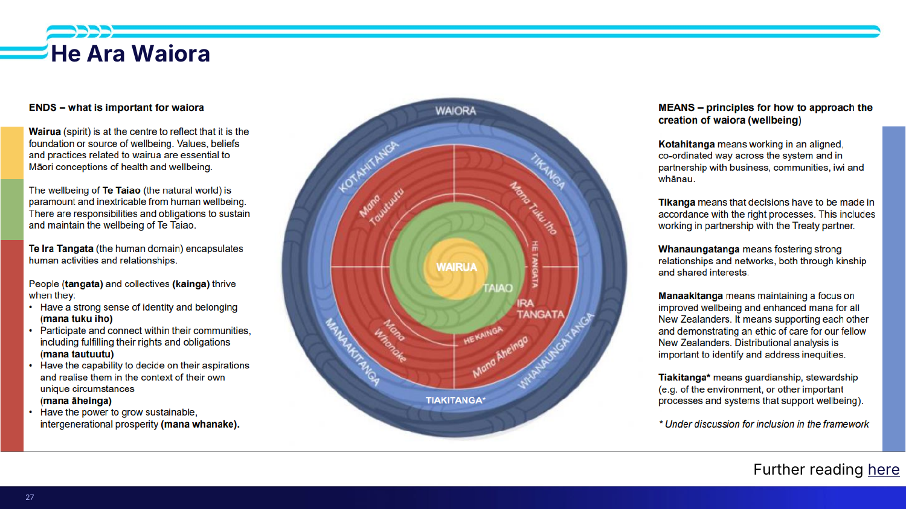

> [!important] He Ara Waiora (slide 27) — ends and means
> **ENDS — what is important for waiora**
> - **Wairua** (spirit) at the **centre** — the foundation or source of wellbeing; values, beliefs and practices essential to Māori conceptions of health and wellbeing
> - **Te Taiao** (the natural world) — its wellbeing is **paramount and inextricable from human wellbeing**; there are responsibilities and obligations to sustain it
> - **Te Ira Tangata** (the human domain) — human activities and relationships
>
> People (**tangata**) and collectives (**kāinga**) thrive when they:
> - have a **strong sense of identity and belonging** — **mana tuku iho**
> - **participate and connect within their communities**, fulfilling rights and obligations — **mana tauutuutu**
> - have the **capability to decide on their aspirations** and realise them in their own circumstances — **mana āheinga**
> - have the **power to grow sustainable, intergenerational prosperity** — **mana whanake**
>
> **MEANS — principles for how to approach the creation of waiora**
> - **Kotahitanga** — working in an aligned, co-ordinated way across the system, in partnership with business, communities, iwi and whānau
> - **Tikanga** — decisions made in accordance with the right processes, including working in partnership with the Treaty partner
> - **Whanaungatanga** — fostering strong relationships and networks, through kinship and shared interests
> - **Manaakitanga** — maintaining focus on improved wellbeing and enhanced mana for all New Zealanders; **distributional analysis is important to identify and address inequities**
> - **Tiakitanga** — guardianship, stewardship (of the environment, or other processes and systems that support wellbeing). *\* under discussion for inclusion in the framework*

> [!important] What it adds, and why it's optional here
> **What it adds:** *"Unlike a lot of the Western frameworks, He Ara Waiora… looks at **intergenerational prosperity**. And that is **the one thing that is missing** from a lot of the frameworks that we tend to use in the West, and will help us solve the long-term problems."* It also imposes a **hierarchy** on the capitals rather than treating them as four equal boxes — wairua at the centre, encompassed by taiao, then the human domain.
>
> **Why not for the assignment:** *"It's **not as well developed**. You won't find as many exemplars and you won't find instructions on the government websites."* Keep it in the background to inform commentary.

*📄 Source: slides 26–27 · transcript*

---

## 🧮 L6-C13 · Multi-criteria analysis — the tool you actually apply

> [!question] Cue questions
> - What is MCA for, and where in the business case is it used?
> - Name three scoring framework options.
> - Reproduce the NZTA magnitude scale.
> - What is the single rule about the numbers?

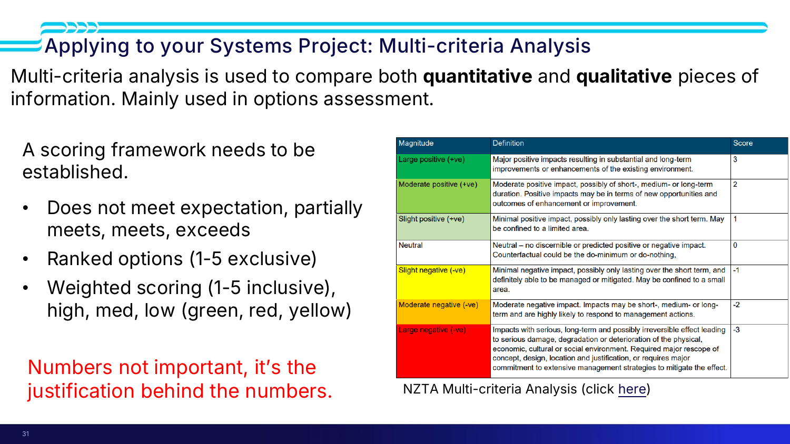

> [!quote] Slide 31
> **"Multi-criteria analysis is used to compare both quantitative and qualitative pieces of information. Mainly used in options assessment."**
>
> A **scoring framework needs to be established**:
> - **Does not meet expectation, partially meets, meets, exceeds**
> - **Ranked options (1–5 exclusive)**
> - **Weighted scoring (1–5 inclusive), high / med / low (green, red, yellow)**
>
> > 🔴 **"Numbers not important, it's the justification behind the numbers."**

> [!important] The NZTA magnitude scale (slide 31)
> | Magnitude | Definition | Score |
> |---|---|---|
> | **Large positive** | Major positive impacts resulting in **substantial and long-term improvements** or enhancements of the existing environment | **+3** |
> | **Moderate positive** | Moderate positive impact, possibly short-, medium- or long-term. Positive impacts may be in terms of **new opportunities and outcomes of enhancement** | **+2** |
> | **Slight positive** | Minimal positive impact, possibly **only lasting over the short term**. May be confined to a limited area | **+1** |
> | **Neutral** | **No discernible or predicted positive or negative impact.** *The counterfactual could be the do-minimum or do-nothing* | **0** |
> | **Slight negative** | Minimal negative impact, possibly short-term, **definitely able to be managed or mitigated**. May be confined to a small area | **−1** |
> | **Moderate negative** | Moderate negative impact, short-, medium- or long-term, **highly likely to respond to management actions** | **−2** |
> | **Large negative** | **Serious, long-term and possibly irreversible** effect leading to serious damage, degradation or deterioration of the physical, economic, cultural or social environment. Requires **major rescope of concept, design, location and justification**, or major commitment to extensive management strategies | **−3** |
>
> Note what separates the tiers: **duration, reversibility, and whether it can be mitigated** — not how bad it feels.

> [!warning] ⭐ The same critique as [[../../Lecture4/notes/L4-notes|L4-C12]], now applied to capitals
> *"If that option is a **16** for the natural capital, but this one is a **17** for the natural capital, and we chose it because it's got 17 — **I'll put a big fat zero through your discussion.** You need to tell us **why**."*
>
> Third time this week the same rule has been stated. It is clearly the thing being assessed.

### Worked example 1 — plastics, do maximum

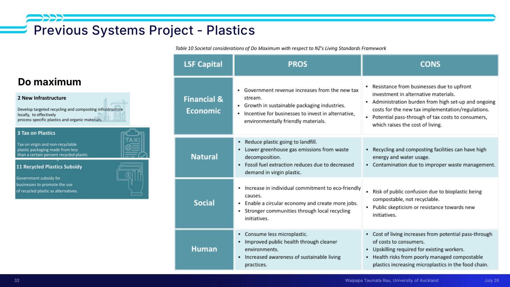

> [!example] *Table 10: Societal considerations of Do Maximum with respect to NZ's Living Standards Framework* (slide 32)
> | Capital | **Pros** | **Cons** |
> |---|---|---|
> | **Financial & Economic** | Government revenue increases from the new tax stream · growth in sustainable packaging industries · incentive for businesses to invest in alternative, environmentally friendly materials | **Resistance from businesses** due to upfront investment in alternative materials · **administration burden** from high set-up and ongoing costs of the new tax · **potential pass-through of tax costs to consumers, raising the cost of living** |
> | **Natural** | Reduce plastic going to landfill · lower greenhouse gas emissions from waste decomposition · fossil fuel extraction reduces due to decreased demand for virgin plastic | ⭐ **Recycling and composting facilities can have high energy and water usage** · contamination due to improper waste management |
> | **Social** | Increase in individual commitment to eco-friendly causes · enable a circular economy and create more jobs · stronger communities through local recycling initiatives | Risk of **public confusion** — bioplastic is compostable, not recyclable · public scepticism or resistance towards new initiatives |
> | **Human** | Consume less microplastic · improved public health through cleaner environments · increased awareness of sustainable living | Cost of living increases from pass-through · **upskilling required for existing workers** · health risks from poorly managed compostable plastics **increasing microplastics in the food chain** |
>
> > [!important] The point Marc drew out
> > *"**There is always an impact, both positive and negative, across those four capitals.**"* The natural-capital cell is the demonstration: an intervention whose entire purpose is environmental **still has an environmental cost** — recycling and composting facilities use a lot of energy and water.
> >
> > And the marking observation: *"In the past, students have been great at describing what the **positive** impacts are. It's a little bit **weaker on describing the negative impacts, or what those trade-offs are**."*

### Worked example 2 — climate change adaptation

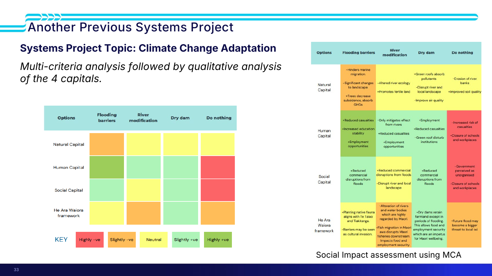

> [!example] Climate change adaptation (slide 33) — *multi-criteria analysis followed by qualitative analysis of the 4 capitals*
> Options: **flooding barriers · river modification · dry dam · do nothing**. Rows: **natural capital · human capital · social capital · He Ara Waiora framework**. Key: **highly −ve · slightly −ve · neutral · slightly +ve · highly +ve**.
>
> What makes this the better exemplar (Marc: *"I like the way that they constructed their multi-criteria analysis"*): **each cell lists the specific positive AND negative impacts**, signed with + and −. Examples:
> - Flooding barriers / natural: **−hinders marine migration · −significant changes to landscape · +trees decrease subsidence, absorb GHGs**
> - Dry dam / natural: **+green roofs absorb pollutants · −disrupt river and local landscape · +improve air quality**
> - Do nothing / human: **−increased risk of casualties · −closure of schools and workplaces**
> - Flooding barriers / He Ara Waiora: **+planting native fauna aligns with Te Taiao and Tiakitanga · −barriers may be seen as cultural invasion**
> - River modification / He Ara Waiora: **−fish migration in Māori awa disrupts Māori fisheries downstream, impacts food and employment security**
>
> Note they added **He Ara Waiora as a fourth row** — the optional framework used as an extra lens, exactly as Juliet suggested.

> [!example] Worked example 3 — health system access and wait times (slide 34)
> Problem: *"What new innovations can be made at the systems level to improve the prevailing **access and waiting time** issues faced by New Zealanders in our health system over the next **10–15 years**?"*
> Shortlist: **1. mobile clinics + uptake of foreign medical staff + training · 2. digitisation · 3. do nothing.**
>
> The cell Marc read out: mobile clinics are **cost-effective and provide early interventions**, but face **variable demand**, are **hard to utilise** — *"trucks can only go in certain places and can only be accessed by certain people."*

*📄 Source: slides 31–34 · transcript*

---

## ✅ Summary (slide 35, verbatim)

> [!quote]
> - **GDP has historically been the primary measure of economic performance and growth. Productivity is a key driver of long-term economic growth and living standards.**
> - **Economic growth can come at the expense of environmental or social wellbeing if considered in isolation.**
> - **Governments have limited resources and must make trade-offs when allocating public funding.**
> - **The Living Standards Framework (LSF) helps evaluate broader economic, social, environmental, and cultural outcomes.**
> - **Transformative change addressing long problems is hard to achieve in a messy short-term democratic system prone to policy U-turns.**
> - **New Zealand's long-term economic challenge is improving productivity through higher-value industries and innovation.**

Plus the four things you actually *do* with this:

7. **GDP = C + I + G + (X − M)**; per capita for living standards (**NZ 46th, $48,231 USD**), PPP for what money buys (**China first under PPP**).
8. **NZ produces $93.56/hour against Australia's $121.38 and an OECD average of US$70.62** — for OECD-average hours. The cause is **what we produce**, not how hard we work.
9. **Size your proposal against ~$2 bn of new spending in a ~$155 bn budget** funded by ~$145 bn of revenue.
10. **Use the four capitals to structure the non-financial argument, and MCA (+3 to −3) to compare.** Every option hits every capital both ways — **and the negatives are where students lose marks.**

---

## 🧪 Self-test

> [!question]- 13 free-recall questions
> 1. Define GDP. Which two phrases in the definition prevent double-counting, and how?
> 2. Write GDP = C + I + G + (X − M) and define each term. What is specifically excluded from G?
> 3. Name the other two approaches to measuring GDP and what each sums.
> 4. NZ is 46th on GDP per capita. The top four are Luxembourg, Ireland, Switzerland and Singapore. What do they have in common, and what does that tell you about the cause?
> 5. What does PPP adjust for, and what happens to the world's largest economy under it?
> 6. NZ produces $93.56/hour; Australia $121.38 for six fewer hours a week. Give the explanation the lecture insists on, and the explanation it rules out.
> 7. Explain knowledge spillover, and why real estate investment doesn't produce it.
> 8. Draw the perpetual cycle linking low-value industries to underfunded innovation.
> 9. Recite the six limitations of GDP. Use Christchurch for one and the shoes for another.
> 10. Describe the doughnut's two boundaries and state the 21st-century challenge in one sentence.
> 11. Define all four capitals in the framework's own words. Which does Juliet tell you to concentrate on, and what is a "values choice" here?
> 12. What does He Ara Waiora add that the Western frameworks lack? Why are you advised not to use it for the assignment?
> 13. Give the NZTA MCA scale from +3 to −3. What distinguishes moderate negative from large negative? And what earns "a big fat zero" through your discussion?

---

> [!info]- Related notes
> - `L6-summary.md` · `L6-flashcards.tsv`
> - `../context/admin-and-dates.md`
> - **Comes from:** [[../../Lecture5/notes/L5-notes|L5 — social CBA]] (what you couldn't monetise ends up here) · [[../../Lecture4/notes/L4-notes|L4 — options assessment]] (MCA is the options-assessment tool)
> - **Feeds into:** **Lecture 10** — machinery of government, budgets, how decisions actually get made · [[../../Lecture7/notes/L7-notes|L7 — stakeholders]] · [[../../Lecture8/notes/L8-notes|L8 — systems thinking and wicked problems]]
