# 👥 Lecture 7 — Stakeholders at the national level

> [!abstract] Why this matters
> This is **steps 2–4 of the business case methodology** from [[../../Lecture4/notes/L4-notes|L4]]: identify stakeholders → determine requirements → **select critical success factors**. It is also **step 2 of the social CBA** ([[../../Lecture5/notes/L5-notes|L5]]) — who gains and who loses.
>
> The second half is the most valuable failure case in the course: Juliet's commercial fishing report, *"easily the most contested"* project of her six years as Chief Science Advisor, and **deliberately chosen as the hardest one.**

> [!info] Sources
> **Slides:** `ENGGEN_403_Lecture_7_2026__final.pdf` — 43 pages. **Amanda Di Ienno and Juliet Gerrard**, 4 August 2026.
> **Transcript:** auto-generated, quality good.
>
> ⚠ The deck's footer numbering runs **two ahead of the PDF page** from the consensus-quadrant slide onward (slides numbered 20 and 21 were deleted). Figures here are named by the **footer number on the slide**.
>
> *Prerequisites: [[../../Lecture2/notes/L2-notes|L2]] — systems, boundaries. [[../../Lecture3/notes/L3-notes|L3]] — the consensus quadrant, which returns here. [[../../Lecture4/notes/L4-notes|L4]] — where CSFs sit in the methodology. Assumes ENGGEN **204/303** stakeholder basics.*

> [!quote] Stated learning outcomes (slide 3)
> - **Discuss the challenge of stakeholder analysis on complex systems**
> - **Describe and apply the different stakeholder analysis tools** to complex systems
> - **Identify Critical Success Factors from stakeholders' requirements**

## 🗺 Concept map

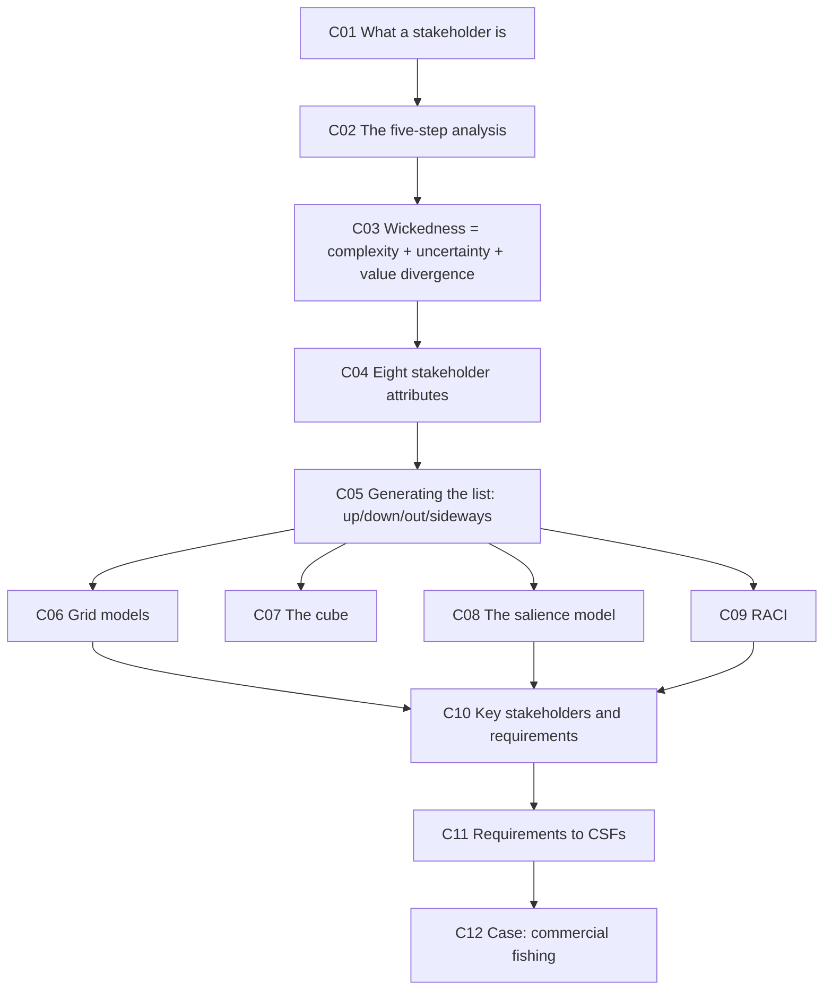

---

## 🎯 L7-C01 · What a stakeholder is — and how it changes at national level

> [!question] Cue questions
> - Give the three-part definition, with the qualifiers on each.
> - What are the five things stakeholders differ on?
> - What changes about "the government" as a stakeholder between 303 and 403?

> [!quote] Slide 5 — a stakeholder has a stake in your project
> - **Can be affected by the project** — real **or perceived** · positively **or negatively**
> - **Can impact the project** — positively or negatively
> - **Can influence the project** — positively or negatively

> [!important] Note "real or perceived"
> A stakeholder who *believes* they're affected **is** a stakeholder. Perception is enough to generate power, opposition and requirements.

Stakeholders have different **roles · interests · influences · impacts · needs** (slide 6).

> [!important] The 303 → 403 shift *(transcript)*
> *"In ENGGEN 303, when we talked about stakeholders, we normally talked about — oh, there's the **national government** or the **central government**, and maybe there was the **local government**."*
>
> At national level you must **decompose**: central government → **individual ministries**; local government → **individual councils**, and further down again. See [[#🐟 L7-C12 · Case study — the future of commercial fishing|C12]] for what that decomposition actually looks like.

*📄 Source: slides 5–6 · transcript*

---

## 5️⃣ L7-C02 · The five steps of stakeholder analysis

> [!question] Cue questions
> - Recite the five steps.
> - Roughly how many CSFs should you end with?

> [!quote] Slide 6
> 1. **Identify all stakeholders**
> 2. **Investigate motivation factors**
> 3. **Assess their power/influence & interest in project**
> 4. **Determine requirements**
> 5. **Develop Critical (Key) Success Factors**

> [!tip] What step 2 is really for *(transcript)*
> Motivation factors tell you whether to **split a stakeholder group further**: *"Do we need to break this stakeholder down even further based on those motivational factors?"* The fisheries case is the extreme version — *iwi* is not one stakeholder once you know which are inside the treaty settlement and which are not.

> [!important] The target
> *"Ultimately, we want to narrow down the requirements to **roughly six key things** we're going to assess any solutions or options against."*

*📄 Source: slide 6 · transcript*

---

## 🔺 L7-C03 · Wickedness = complexity + uncertainty + value divergence

> [!question] Cue questions
> - Draw the wickedness triangle and label all three circles.
> - What question does each circle answer?

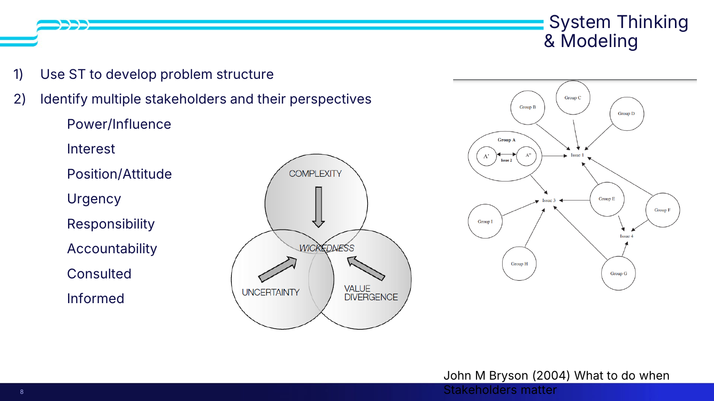

> [!important] The three sources of wickedness (slide 8)
> ```mermaid
> graph TD
>     A[COMPLEXITY] --> W[WICKEDNESS]
>     B[UNCERTAINTY] --> W
>     C[VALUE DIVERGENCE] --> W
> ```
>
> | Circle | The question it answers *(transcript)* |
> |---|---|
> | **Complexity** | **How complex is the problem?** |
> | **Uncertainty** | **How much do we know?** Do we understand why it's occurring, or how to address it? |
> | **Value divergence** | **How far apart are the stakeholders' values?** — *"the more complex the problem, the more value divergence we're going to deal with"* |
>
> Value divergence is the [[../../Lecture3/notes/L3-notes|L3]] consensus-quadrant axis reappearing as a property of the problem rather than of the advice.

> [!tip] Use it as a diagnostic
> Juliet applies it to fisheries later and says the project *"**hits gold on all dimensions**"* — which is why it's the hardest case in the course. Scoring your own project on these three circles tells you how much trouble you're in before you start.

*📄 Source: slide 8 · transcript*

---

## 🧭 L7-C04 · The eight stakeholder attributes

> [!question] Cue questions
> - List the eight attributes you assess each stakeholder on.
> - Which two are about *doing*, and which two about *being told*?

> [!quote] Slide 8 (Bryson 2004, *What to do when stakeholders matter*)
> 1. **Use ST to develop problem structure**
> 2. **Identify multiple stakeholders and their perspectives:**
> **Power/Influence · Interest · Position/Attitude · Urgency · Responsibility · Accountability · Consulted · Informed**

Note the shape: the first four feed the **grid, cube and salience** models; the last four are the **RACI** dimensions.

*📄 Source: slide 8*

---

## 🧾 L7-C05 · Generating the list — the four directions

> [!question] Cue questions
> - What are the four directions, and who typically sits in each?
> - What two other splits should you apply?

> [!quote] Slide 9 — tools for analysis
> **Generate traditional stakeholder list:** examine model · **Upwards / Downwards / Outwards / Sidewards** · **Direct/Indirect & Positive/Negative**
> **Models:** grid based · cube based · salience · RACI

> [!important] The four directions *(transcript)*
> | Direction | Who |
> |---|---|
> | **Upwards** | **Governments** |
> | **Downwards** | **Everyday people** |
> | **Outwards** | **Businesses you might consult** |
> | **Sidewards** | **Other countries** you can look at for reference |
>
> Then split again on **direct vs indirect** (*"who's directly impacted and who's having some thoughts from the side"*) and **positive vs negative**.

*📄 Source: slide 9 · transcript*

---

## 🔲 L7-C06 · Grid models — power/interest and project frames

> [!question] Cue questions
> - Define power/influence and interest, precisely.
> - Name the four quadrants of the power-interest matrix.
> - Why plot the same stakeholders on more than one grid?

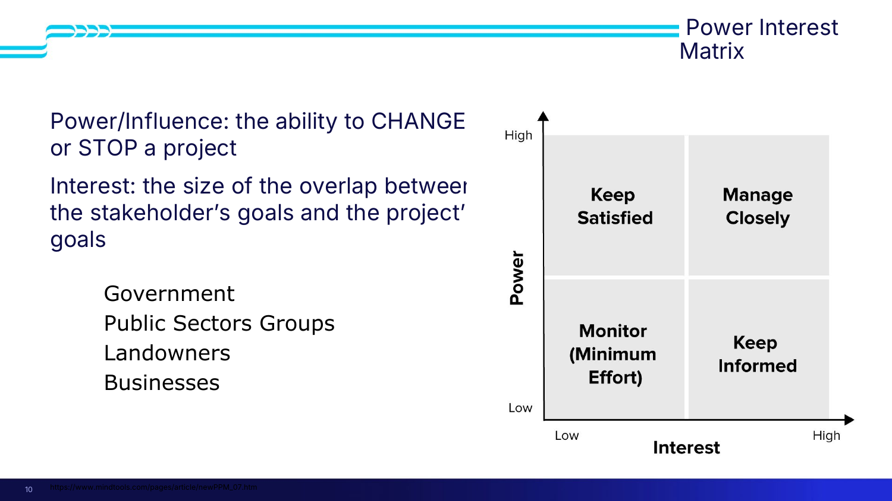

> [!important] The two definitions (slide 10) — learn these wordings
> - **Power/Influence: the ability to CHANGE or STOP a project**
> - **Interest: the size of the overlap between the stakeholder's goals and the project's goals**
>
> That definition of interest is unusual and worth keeping — interest isn't "how much they care", it's **goal overlap**.

The four standard quadrants: **manage closely** (high power, high interest) · **keep satisfied** (high power, low interest) · **keep informed** (low power, high interest) · **monitor** (low, low).

Stakeholders placed on slide 10: **Government · Public Sector Groups · Landowners · Businesses.**

> [!important] Project frames (slide 11) — a *different* second axis
> - **Power/Influence:** ability to change or stop a project
> - **Support & Opposition:** **agree or do not agree with the project or problem**
>
> This yields **strong supporters, strong opponents, weak supporters, weak opponents**. Note the crucial phrase *"or the problem"* — a stakeholder may accept your solution but deny there is a problem at all.

> [!tip] Why multiple grids
> *"You want to put stakeholders on **multiple grids** to try to get an overall picture. Because you could have somebody that is a strong supporter, but maybe they don't actually have as much power as we think."* Support and power are independent; one grid hides that.

*📄 Source: slides 10–11 · transcript*

---

## 🧊 L7-C07 · The stakeholder cube

> [!question] Cue questions
> - What three axes does the cube use?
> - What is its stated weakness?

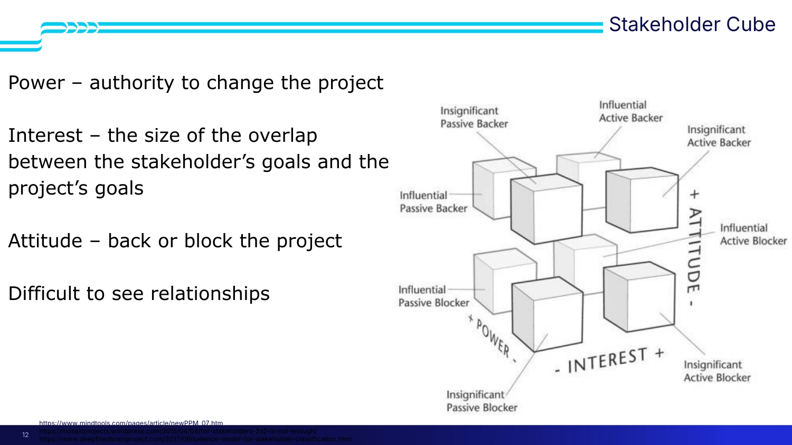

> [!quote] Slide 12
> **Power** – authority to change the project
> **Interest** – the size of the overlap between the stakeholder's goals and the project's goals
> **Attitude** – **back or block** the project
>
> **Difficult to see relationships**

> [!warning] Why it's rarely used *(transcript)*
> *"It allows us to see everything, but it makes it **difficult to see the relationships** between the stakeholders. It makes it difficult to see **how this might change over time**… So while this one can be used, it's **not used that often**."*
>
> A cross-section of the cube **is** the power-interest matrix; the third axis is attitude.

*📄 Source: slide 12 · transcript*

---

## 🔴 L7-C08 · The salience model — the one you'll actually use

> [!question] Cue questions
> - Name the three attributes and define each.
> - Name all seven regions of the Venn diagram, plus the eighth category outside it.
> - Map the salience categories onto the power-interest quadrants.
> - Why is this model called dynamic?

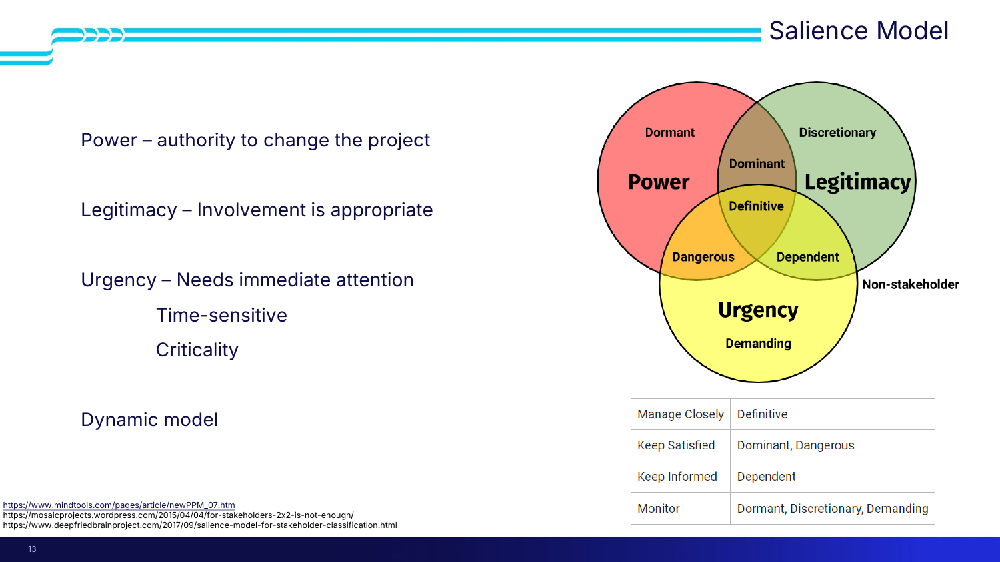

> [!important] The three attributes (slide 13)
> | Attribute | Definition |
> |---|---|
> | **Power** | **Authority to change the project** |
> | **Legitimacy** | **Involvement is appropriate** |
> | **Urgency** | **Needs immediate attention** — **time-sensitive** and **criticality** |
>
> **It is a dynamic model.**

> [!important] The eight categories
> | Region | Attributes held |
> |---|---|
> | **Dormant** | Power only |
> | **Discretionary** | Legitimacy only |
> | **Demanding** | Urgency only |
> | **Dominant** | Power + legitimacy |
> | **Dangerous** | Power + urgency |
> | **Dependent** | Legitimacy + urgency |
> | **Definitive** | **All three** |
> | **Non-stakeholder** | **None** — outside the diagram entirely |

> [!important] The mapping onto power/interest (slide 13's own table)
> | Power-interest quadrant | Salience category |
> |---|---|
> | **Manage closely** | **Definitive** |
> | **Keep satisfied** | **Dominant, Dangerous** |
> | **Keep informed** | **Dependent** |
> | **Monitor** | **Dormant, Discretionary, Demanding** |

> [!tip] Legitimacy is the interesting one *(transcript)*
> *"There could be a stakeholder — but if they don't actually have **legitimacy**, then should we actually be considering them a stakeholder? Maybe they are affected by the project, but maybe they have **no legitimate claim**."*
>
> And the model's practical value: **it gives you a defensible way to eliminate stakeholders.** No power, no legitimacy, no urgency → **non-stakeholder**, drop them from the analysis.

> [!important] Why "dynamic" matters — the urgency axis moves
> *"Urgency is time-sensitive… you can think about the stakeholder in a **two-year time frame versus a five-year time frame**. Has the urgency changed? If we delay this project for five years, do people for whom it's **not** urgent shift into urgent? Does that change our plans?"*
>
> **A stakeholder map is a snapshot.** Re-run it under different timeframes and stakeholders migrate between categories — including into **dangerous**.

*📄 Source: slide 13 · transcript*

---

## 📋 L7-C09 · RACI

> [!question] Cue questions
> - What does each letter stand for here — and what's unusual about the C?
> - What is the structural rule of RACI?

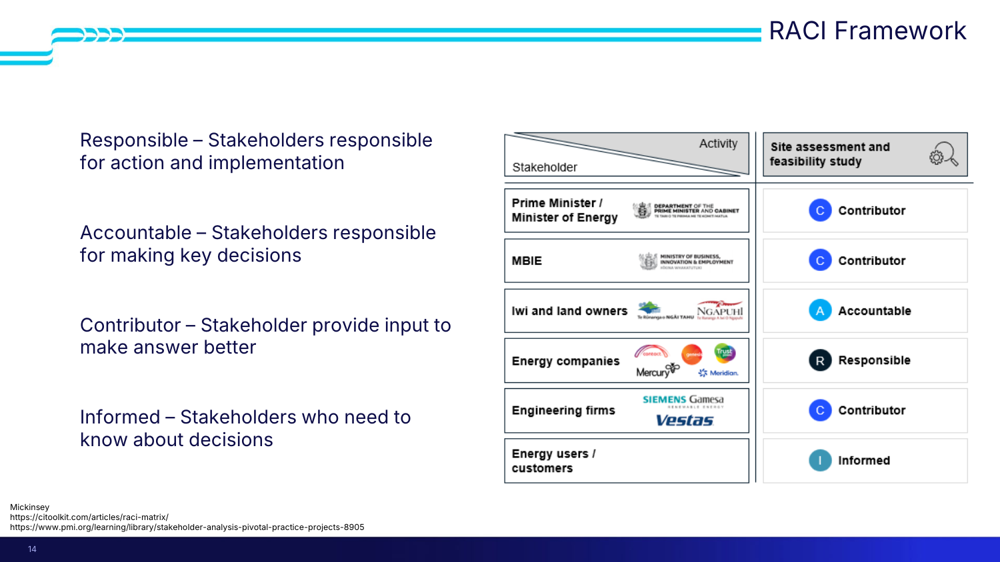

> [!quote] Slide 14 (McKinsey)
> - **Responsible** — stakeholders responsible for **action and implementation**
> - **Accountable** — stakeholders responsible for **making key decisions**
> - **Contributor** — stakeholders who **provide input to make the answer better**
> - **Informed** — stakeholders who **need to know about decisions**

> [!warning] The C here is **Contributor**, not the usual "Consulted"
> Use the lecture's wording.

> [!important] The structural rule *(transcript)*
> **One category per stakeholder.** *"You can have multiple stakeholders per grouping. But you can only have **one grouping per stakeholder**."* That forcing function is the point — it makes you decide who actually decides.

> [!example] Worked: new energy infrastructure (slide 14) — activity: **site assessment and feasibility study**
> | Stakeholder | Role |
> |---|---|
> | **Prime Minister / Minister of Energy** (DPMC) | **Contributor** |
> | **MBIE** | **Contributor** |
> | **Iwi and land owners** (Ngāi Tahu, Ngāpuhi) | ⭐ **Accountable** |
> | **Energy companies** (Contact, Genesis, Mercury, Meridian, Trustpower) | **Responsible** |
> | **Engineering firms** (Siemens Gamesa, Vestas) | **Contributor** |
> | **Energy users / customers** | **Informed** |
>
> **The counter-intuitive result is worth sitting with:** the minister is only a *contributor*, while **iwi and landowners are accountable** — *"this requires new land, so we need to go to the landowners and the iwi to obtain those rights. **They are the ones who ultimately have the power to say yes.**"*
>
> RACI catches what a power-interest grid can miss: who holds the actual veto.

*📄 Source: slide 14 · transcript*

---

## 🔍 L7-C10 · Key stakeholders and their requirements

> [!question] Cue questions
> - What are the six questions you ask of each key stakeholder?
> - What defines a "key" stakeholder?
> - Name the three requirement tiers and the test for each.
> - What are you allowed to use in place of interviews?

> [!quote] Slide 15 — multiple models over multiple scenarios
> 1. **What's their role?**
> 2. **What is important to them?**
> 3. **What is their attitude?**
> 4. **What shifts do we need?**
> 5. **How can they use their power?**
> 6. **How do they relate?**
>
> > **Identify stakeholders which repetitively have large impacts on project.**

> [!important] "Key" = **repetition across models**
> *"Which stakeholders **repeatedly** are having large impacts on that project? Those are the ones you want to focus your analysis on."* Not the loudest — the ones who keep reappearing when you change the lens.
>
> Note question 4 — *"what shifts do we need?"* — is about **deliberately moving a stakeholder's attitude**, then re-running the models to see what that changes.

> [!important] The three requirement tiers (slide 16)
> | Tier | The test *(transcript)* |
> |---|---|
> | **1. Necessary** | **The project can't continue if it isn't met** |
> | **2. Nice to have** | Stakeholders want it, it would help — but we might not be able to meet it |
> | **3. Aspirational** | Goals stakeholders have that we **realistically cannot meet in this time frame**. Record it; don't address it |
>
> *"Requirements may change per problem space."*

> [!warning] The classic error
> *"It's very easy to… sort **necessary and nice-to-have together**."* The necessary tier is the one that feeds CSFs, so contaminating it corrupts everything downstream.

> [!tip] Elicitation methods (slide 16)
> **Brainstorm · Interview**, plus **actor-linkage matrices**, **social network analysis** (communication, trust, influence) and **knowledge mapping**.
>
> **What you're actually allowed to do:** in industry you'd run interviews and surveys with each stakeholder group. *"You won't have that opportunity during Team Project and Systems Week."* So: discuss with teammates, **and use AI to generate stakeholder positions — provided it cites back to primary source material.**

> [!important] Conflicting requirements (slide 17) — the procedure
> Value divergence guarantees conflicts. Classify them first: *"are they **tractable or intractable**? Are they actual issues? Is it social, systems, parties?"* Then:
> 1. **Brainstorm with representatives** — can we reach agreement on what actually needs to be done?
> 2. **Can you reach a compromise?** — including re-classifying: is this conflicting requirement *really* necessary, or is it nice-to-have?
> 3. **Can you meet the requirement another way?** — a route you didn't consider first time
> 4. Produce the **requirement list**: the **need-to-haves**, the **conflicts addressed explicitly**, and **buy-in from the key stakeholders**
>
> *(Cited: Head 2008, "Wicked Problems in Public Policy")*
>
> **Take the list back to the stakeholders and get buy-in** — government, businesses, iwi, and the public.

*📄 Source: slides 15–17 · transcript*

---

## ⭐ L7-C11 · From requirements to critical success factors

> [!question] Cue questions
> - Define a CSF in one sentence.
> - How do you find them?
> - State the relationship between CSFs and necessary requirements, both directions.
> - How many should you have, and what's the failure mode of having too many?

> [!important] The definition (slide 18)
> > **"Critical Success Factor: Requirements that potential solutions are assessed against."**

> [!quote] Slide 18
> - **Look at overlaps of necessary requirements**
> - **The more complex problem, or the more problem spaces; the more CSF you may have**
> - **Don't lose sight of the overall problem**
> - ⭐ **All CSF are necessary requirements, but not all necessary requirements are CSF.**

> [!important] The method: overlap across stakeholders
> *"What necessary requirements are coming up **over and over again across your stakeholders**? If it's coming up over and over again, you probably want to make sure you're meeting it. **That's important enough to assess against.**"*

> [!warning] Over-specification is the named failure mode
> *"It's really easy to **over-specify**. You may have **30 necessary requirements** and you want to assess against everything. **Don't have those requirements make you lose sight of the overall problem you're trying to address** — that's the hardest thing to assess against."*
>
> **Target: roughly six.** *"There have been projects with **10 to 15**. For Systems and the Team Project, we want you to **keep it closer to six**. It will make your assessment much easier."*

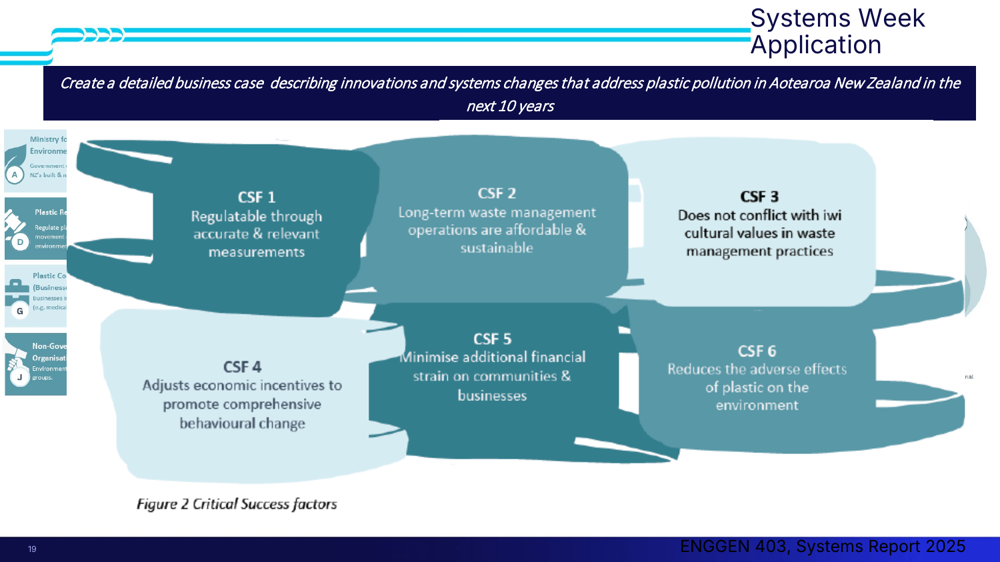

> [!example] The 2025 plastics exemplar (slide 19) — the same six CSFs as [[../../Lecture4/notes/L4-notes|L4]]
> Brief: *"Create a detailed business case describing innovations and systems changes that address plastic pollution in Aotearoa New Zealand in the next 10 years."*
>
> The process they ran *(transcript)*:
> 1. Broke the problem into **multiple problem spaces**
> 2. Brainstormed a full stakeholder list
> 3. Applied **multiple tools** to find who kept reappearing → **12 key stakeholders** with power, legitimacy and urgency
> 4. **Dropped the non-stakeholders** — those who didn't land on the diagram at all were removed from the power-interest matrix
> 5. Built a **detailed requirement list per stakeholder**, split into necessary / nice-to-have / aspirational
> 6. Found the **common requirements** and identified the **conflicting** ones and how to address them
> 7. Narrowed to **six CSFs** — the ones recurring across most stakeholders
>
> **CSF 1** regulatable through accurate & relevant measurements · **CSF 2** long-term waste management operations are affordable & sustainable · **CSF 3** does not conflict with iwi cultural values in waste management practices · **CSF 4** adjusts economic incentives to promote comprehensive behavioural change · **CSF 5** minimise additional financial strain on communities & businesses · **CSF 6** reduces the adverse effects of plastic on the environment
>
> > [!tip] An instructive judgement call
> > **Plastic consumer businesses and households** had the **lowest power and interest**. They had a **legitimate claim** — so they weren't non-stakeholders — but the team **still chose not to use them in the analysis**. Legitimacy alone doesn't earn a place in your CSFs.

*📄 Source: slides 18–19 · transcript*

---

## 🐟 L7-C12 · Case study — the future of commercial fishing

> [!question] Cue questions
> - Why does this project "hit gold" on all three wickedness dimensions?
> - What was in scope and what was out — and why was that the problem?
> - Which salience category did the stakeholders cluster in?
> - What did the panel do about the scope, and what leverage point did it produce?
> - What happened after the government changed?

> [!important] Why Juliet chose it
> *"I've **deliberately chosen the most difficult one** that we handled during my six years as Chief Science Advisor."* On the [[../../Lecture3/notes/L3-notes|L3]] consensus quadrant (slide 22), **fish sits at the bottom-left: low scientific consensus, low values consensus** — the worst quadrant — below cannabis, fluoride and nitrate, and far from 5G, plastics, food waste and AMR.
>
> Her framing of what all the tools actually buy you: *"At the end of the day, all that's doing is giving you a **deep sense of the values positions** of a lot of people with a vested interest in your project, and maybe a handle on **whether there is a scientific technical consensus** which might provide an evidence base for change."*
>
> And the instruction: *"Have a play with all those tools. But **keep the big picture in mind. Whose position do we really need to listen to? How many stakeholders have things in common, and where are the points of huge contest?**"*

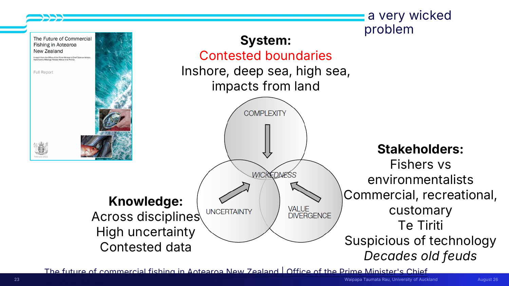

> [!example] Gold on all three dimensions (slide 23)
> **System — contested boundaries:** *inshore, deep sea, high sea, impacts from land.*
> - **Inshore** — right near the coast. **Deep sea** — within our exclusive economic zone, still NZ jurisdiction. **High sea** — *"where we have **no jurisdiction at all. Indeed nobody does.**"* There is a treaty some countries have signed and some haven't, and enforcement in an ocean nobody owns is near-impossible.
> - *"Unlike things on land, **fish can swim**, so they don't really notice the boundary between inshore, deep sea and high sea."*
> - **Land activity impacts the ocean**, especially inshore.
>
> **Knowledge — across disciplines, high uncertainty, contested data:**
> - The team's catchphrase: ***"it's dark down there."***
> - *"How do you know how many fish there are in the sea? There's all sorts of measurements you can make, but **you don't know how it scales, you don't know how uncertain it is, you don't know what you don't know**."*
> - *"Because it's such a contested space, people tend to **cling to small data sets and call them true and applicable for the whole ocean**, when clearly they're not."*
>
> **Stakeholders — fishers vs environmentalists; commercial, recreational, customary; Te Tiriti; suspicious of technology; *decades old feuds*:**
> - The **"abundant"** anecdote: walk into a room, use a word that sounds positive, *"and half the room would instantly fold their arms and say **whose side are you on? You're speaking abundance language.**"* Vocabulary itself was contested.
> - **Suspicion of technology is rational here:** the project's goal was using research and innovation to learn how many fish there are and where they move — but *"any tech that makes it **easier to find fish** makes it **easier to catch fish**."*
> - Getting a panel together was itself blocked: *"some people just **refused to sit in a room together**."*

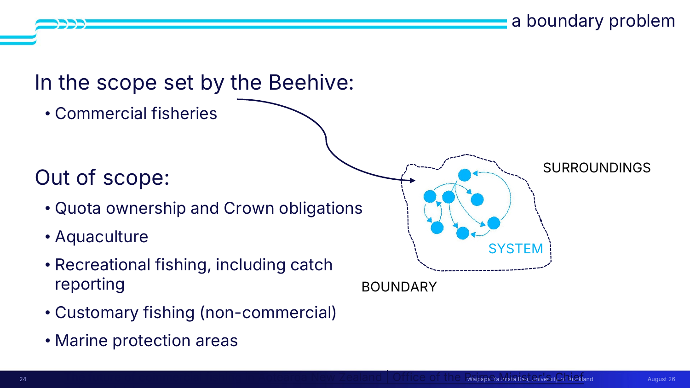

> [!important] The boundary problem (slides 24–26)
> **In scope, set by the Beehive:** **commercial fisheries**.
> **Out of scope:** **quota ownership and Crown obligations · aquaculture · recreational fishing including catch reporting · customary fishing (non-commercial) · marine protection areas.**
>
> > ⭐ ***"Out of scope were all the things that the stakeholders felt strongly about."***
>
> | Out of scope | Why it enraged someone |
> |---|---|
> | **Quota ownership & Crown obligations** | The **treaty settlement** awarded commercial rights to **some iwi but not others** — so some Māori were firmly in the commercial camp, while other iwi had **no commercial interest but deep care for the ocean** and *"set themselves up as the kaitiaki of the ocean."* The range of Māori views was **wider than across all other stakeholders** |
> | **Aquaculture** | *"Provides a lot of potential **solutions** to some of the problems in commercial fisheries"* — and couldn't be discussed |
> | **Recreational fishing** | Includes **chartered operations** — pay a lot to go out on a big boat and catch a lot of fish. **Commercial fishers thought it outrageous** these weren't captured. Recreational fishers *"felt absolutely aggrieved that we weren't talking to them"* |
> | **Customary fishing** | *"Sat around the edges out of scope, but with **huge intelligence that could be shared that wasn't necessarily being heard**"* |
> | **Marine protection areas** | Environmental lobbies and academia thought the project should have been about **where you can and can't fish** — not how you fish. Completely out of scope |
>
> 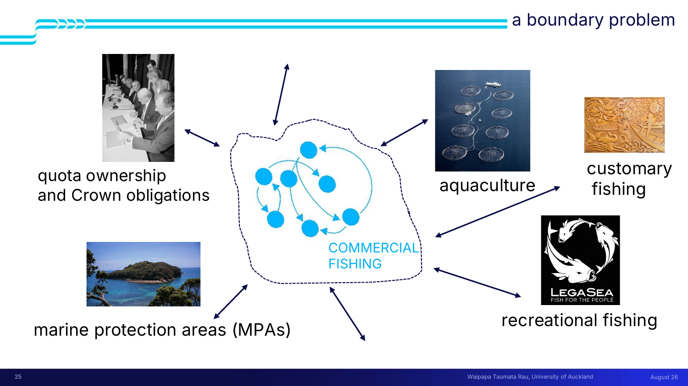
>
> > **"Looking at one system, in a system of systems, is fraught."** (slide 26)
> >
> > *"Everywhere you try and make connections, there is tension and there is drama."*

> [!important] Where they landed on the stakeholder map
> *"This muddy, complicated terrain — where you put all these people in these power-interest matrices is really difficult. But **whichever one you use, they cluster in the dangerous category**. So lots of people with a vested interest in **derailing the whole project**."*
>
> Recall: **dangerous = power + urgency, without legitimacy** in the salience model. That is exactly the profile of a group with a vested interest and no formal standing.

> [!example] The government stakeholder map — what "decompose the government" means
> **Fisheries New Zealand** (part of **MPI**) — supports primary industries; job is sustainable stocks *for the fishers*. **Ministry for the Environment** and **DOC** — protecting the environment, ecosystems, and the species that *aren't* being caught. **MBIE** — health and safety for commercial fishers, research and innovation, plus oil and gas. Around the edges: **Land Information NZ** and **regional councils** (land-based activity causing problems), **Customs** (fish must be caught *and sent somewhere*), **MFAT** (*"huge disputes internationally around fishing — everybody fights about it"*), **Maritime New Zealand**, and the **EPA**.
>
> Juliet's instruction: *"I **don't** want you to remember all those details. I **do** want you to remember that that's **really complicated**"* — and to ask, for your own problem, *which* part of government.

> [!important] The process — theory vs practice (slides 27–30)
> **Theory:** appoint a panel *balancing inclusivity with pragmatism* · panel supported by OPMCSA analysts and writers with *iterative feedback* · an **open wider reference group** where anyone who volunteered could input, and who **saw the text but not the recommendations**.
>
> **Practice:**
> - Experts had to be **excluded** because they couldn't function in the same room — *"which may undermine slightly the legitimacy of… the process, because there are experts that weren't in there."* They were consulted separately, *"bring their voice into the room without triggering any fistfights. Almost literally."*
> - Analysts *"came home very upset, and I had to go myself because people were just so aggressive."*
> - **The Google Doc:** in plastics, people brainstormed in it. Here *"we had people **fighting** in the Google doc"* — so all feedback had to be taken separately.
> - Recommendations were withheld during consultation *"because otherwise they got so hung up on their vested interest."*
> - Co-chair **Craig Ellison**, himself a commercial fisher, is credited with navigating the stakeholder map.

> [!important] ⭐ The move that makes this lecture worth studying
> *"There was **pushback on the scope**. We ended up deciding that **our critical success factor was broadening the scope**. So we went back and **renegotiated our terms of reference with the Prime Minister** and said: we need to do more than just commercial fishing, **or this report is going to land really badly.**"*
>
> The first three themes *"were **not really asked for**, but were our way of providing some context which **made the stakeholders feel heard**."*
>
> 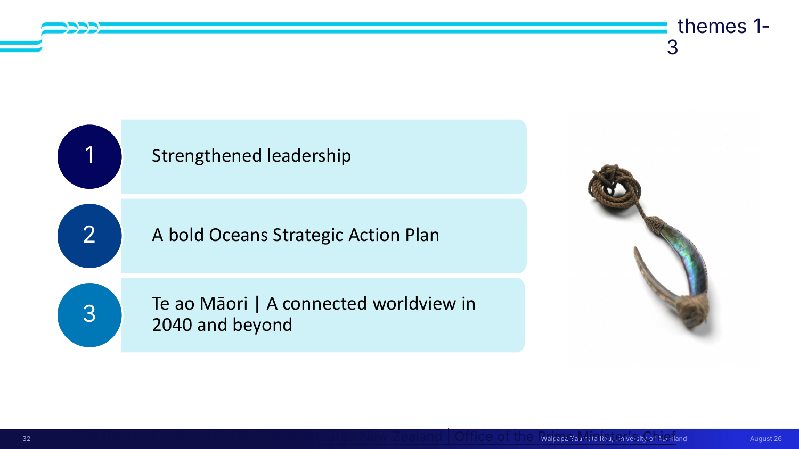
>
> | # | Theme (slide 32) |
> |---|---|
> | **1** | **Strengthened leadership** |
> | **2** | **A bold Oceans Strategic Action Plan** |
> | **3** | **Te ao Māori — A connected worldview in 2040 and beyond** |
>
> *"Together they call for a **holistic view of the ocean with strong leadership**."*

> [!example] The leverage point (slides 33–34)
> They got their way: the Prime Minister was persuaded to convert **Minister of Fisheries** into a **new portfolio — Minister of Oceans and Fisheries**, *"so someone had jurisdiction over all those agencies that guarded the ocean… it was **on his desk**."* (Minister **David Parker**.)
>
> *"This wasn't really science advice"* — it was an **institutional change**, and it is the single highest-leverage recommendation in the report. **Seven cabinet papers** then went through under the new portfolio, including the response to the report: Ensuring Healthy Ocean Ecosystems · Fisheries System Reform · Landings and Discards · Offences and Penalties · Revitalising the Hauraki Gulf · the initial response to the PMCSA report · **On-board cameras**.

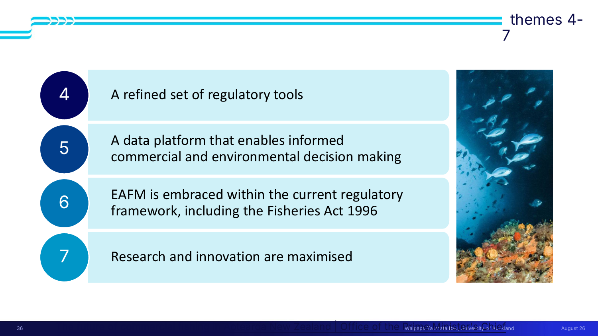

> [!example] Themes 4–8 — inside the Fisheries Act (slides 35–41)
> | # | Theme | The substance |
> |---|---|---|
> | **4** | **A refined set of regulatory tools** | *Cross-agency, cross-Acts — a complex challenge for regulators.* Integrated leadership essential. **Fisheries NZ, DOC and MfE in particular need to collaborate** — which the single minister now forced |
> | **5** | **A data platform that enables informed commercial and environmental decision making** | ⭐ ***"We know frighteningly little."*** We must **aggregate and integrate what we do know**, with **all parties at the table providing information in compatible formats** |
> | **6** | **EAFM is embraced within the current regulatory framework, including the Fisheries Act 1996** | The **ecosystem approach to fisheries management** is already *in* the Act and **nobody was using it**. *"Our small fishers understand their ecosystem."* The **Minister is already empowered to act** — e.g. **section 9c, habitats of particular significance to fisheries management**, never used, but usable to protect exactly what the environmentalists wanted protected |
> | **7** | **Research and innovation are maximised** | *"Innovation can only support oceans **if the settings are right**. But then there is enormous potential to **fish smarter**."* Needs **integration, optimisation, co-operation**. Example: **precision seafood harvesting** — a modified trawl net invented at Plant & Food (now the Bioeconomy Science Institute) that **tricks fish into the net**, lets small ones escape through holes, and holds the catch in a comfortable shoal environment instead of dragging the ocean floor |
> | **8** | *(place-based action)* | **No one-size-fits-all** — **local knowledge and mātauranga Māori vital** for place-based action · **cumulative effects crucial** · building consensus and improving relationships · increasing expectations and multiple challenges · need for greater support to **build regional capability**. Juliet: Māori knowledge *"has been going back many more generations than Pākehā knowledge"*; you need to understand the effects in **that local bay** — sediment, climate, estuary |
>
> Note the pattern in themes 6 and 7: **the powers already existed and weren't being used.** Finding an unused lever inside existing legislation is cheaper than legislating.

> [!important] The technical core — why the numbers can back any argument
> How a fishery is managed: fish populations fluctuate with season, weather and catch. There's a sustainable level; the quota system aims at it. Trawlers do snapshot surveys — ***"big error bar."*** A **soft limit** (agreed by Fisheries NZ, *"but not by everybody"*) triggers when a stock hits **half** the agreed population: quotas cut, the fishery rebuilds. A **hard limit** means *"oops, there are no fish"* — stop, and hope. **Internationally, in some cases it never rebuilds.**
>
> The trigger is often expressed as a percentage of the **unfished stock volume** — *"but I'll challenge all of you to work out what the unfished volume is. **We don't even know what the current volume is**, so somebody does a calculation to guesstimate the unfished stock volume."*
>
> > ⭐ ***"You don't know what the unfished volume is. You don't really know what the sustainable volume is. You don't really know how many fish you've got. Put all those three in an equation and pull out a number, and you can use it to back up any argument."***
>
> This is the sharpest statement in the course of what "contested data" actually means — and it connects straight back to [[../../Lecture3/notes/L3-notes|L3-C05]] (*there will not be clean data — propagate the uncertainty*).

> [!important] What the stakeholders had in common
> *"They have **two things in common**. One is **they're all really grumpy**, and the other is **they all really care about the ocean**. And that means they are very passionate. **They are all in that urgent spot on the Venn diagram.**"*
>
> Finding the common ground is the tool; here it was *caring about the ocean* — and it was enough to build on.

> [!example] What happened next (slides 42–43)
> **The good:** briefed opposition parties · formal government response arranged in the **8 themes** · **mostly "agree" or "agree with intent"** (citizen science and enabling innovation were "agreed in part") · recommendations fed into the **Fisheries Industry Transformation Plan**.
>
> **Then the government changed:**
> - ✅ The **Minister of Oceans and Fisheries portfolio survived.**
> - ❌ **Industry transformation plans were removed as a policy tool** — *"they've gone, all of them, including our fisheries one. So all that information is a little bit lost."*
> - The values positions of **David Parker** (old minister) and **Shane Jones** (new minister) are *"quite different."*
>
> > ⭐ The lesson Juliet draws: *"If you've created a portfolio that puts **a lot of power in one seat**, you have to accept that depending on who's democratically elected, **that power will be used in different ways.** I still think it was good to combine the portfolios, but it does create some risk if there's a **flick-flack of values position** on whether you protect the environment or protect commercial interests."*
>
> **Concentrating power is a leverage point that cuts both ways.** Compare [[../../Lecture6/notes/L6-notes|L6]]: *"transformative change… is hard to achieve in a messy short-term democratic system prone to policy U-turns."*

*📄 Source: slides 22–43 · transcript*

---

## ✅ Summary (slide 44, plus the case)

> [!quote] Slide 44
> - **Traditional steps of stakeholder analysis did not change**
> - **"More tools and models" for analysing stakeholders** — multiple solvable problems, multiple assessments, multiple requirements
> - **Key stakeholders — Power, Dangerous, Manage closely — but also include interest groups**
> - **Necessary to CSF — CSF must be met for screening; buy-in required**
> - **Systems thinking allows us to identify specific "solvable problems" in a larger complex system**
> - **Stakeholder analysis allows us to tease out what the needs are to be addressed / solved / improved in a solution — iterative**

And from Juliet's closing:

7. **Whatever your CSFs are, you'll need buy-in — and sometimes to get buy-in you have to broaden your scope or be flexible with your project plan.**
8. ⭐ **"Beware: every time you draw a boundary, you can create conflict. So whatever you do, it needs to be iterative"** — which is exactly what renegotiating the terms of reference was.

---

## 🧪 Self-test

> [!question]- 12 free-recall questions
> 1. Give the three-part definition of a stakeholder with its qualifiers. Why does "real or perceived" matter?
> 2. Recite the five steps of stakeholder analysis. What is step 2 actually used to decide?
> 3. Draw the wickedness triangle. What question does each circle answer?
> 4. Define power/influence and interest in the matrix's own words. What's unusual about the definition of interest?
> 5. Name the three salience attributes, the seven regions, and the eighth category outside the diagram.
> 6. Map the four power-interest quadrants onto the salience categories.
> 7. Why is the salience model called dynamic? Give a concrete example of a stakeholder changing category.
> 8. What is the structural rule of RACI? In the energy example, who is accountable and why is that surprising?
> 9. Name the three requirement tiers and the test that separates each. What's the classic sorting error?
> 10. Define a CSF. State the relationship to necessary requirements in both directions. How many should you have, and what goes wrong with 30?
> 11. Fisheries: what was in scope, what was out, and why was the out-of-scope list the whole problem? Which salience category did the stakeholders cluster in, and why does that fit?
> 12. The panel's CSF became "broadening the scope". What did they do about it, what leverage point resulted, and what happened to it after the election? What general lesson does Juliet draw about concentrating power?

---

> [!info]- Related notes
> - `L7-summary.md` · `L7-flashcards.tsv`
> - `../context/admin-and-dates.md`
> - **Comes from:** [[../../Lecture4/notes/L4-notes|L4 — steps 2–4 of the methodology]] · [[../../Lecture3/notes/L3-notes|L3 — the consensus quadrant, and the fishing case flagged as deferred]] · [[../../Lecture2/notes/L2-notes|L2 — boundaries]]
> - **Feeds into:** [[../../Lecture8/notes/L8-notes|L8 — systems thinking and wicked problems]] · **Lecture 10** — machinery of government
