# 🌀 Lecture 8 — Systems thinking and wicked problems

> [!abstract] Why this matters
> [[../../Lecture2/notes/L2-notes|L2]] defined wicked problems. Weeks 2–3 gave you business cases, CBA and stakeholder analysis. **This lecture zooms back out and gives you the tools to frame a problem you cannot solve** — the iceberg model, levels of thinking, **Meadows' twelve leverage points**, and causal loops.
>
> Juliet's own framing: *"You should be ready now to zoom back out and have a think about how to start formulating these really difficult problems that **can't be solved but can only be ameliorated**."* These are the tools you'll use on the first morning of Systems Week.

> [!info] Sources
> **Slides:** `ENGGEN_403_Lecture_08_Final.pdf` — 40 pages. **Juliet Gerrard and Amanda di Ienno**, 6 August 2026. Juliet takes history, VUCA, wickedness and the obesity worked example; Amanda takes the tools.
> **Transcript:** auto-generated, quality good.
>
> *Prerequisites: [[../../Lecture2/notes/L2-notes|L2]] — systems, boundaries, wicked problems, amelioration. [[../../Lecture7/notes/L7-notes|L7]] — the wickedness triangle returns.*

> [!quote] Stated learning outcomes (slide 4)
> - Be familiar with the **history and foundations** of contemporary systems thinking
> - **Characterise and contextualise systems thinking as both a discipline and a set of useful tools** for addressing complex and wicked problems
> - **Describe the characteristics of wicked problems and why they cannot be solved, only minimised**
> - **Identify complex systems and scope problems at scale**
> - **Identify and apply tools** for analysis of complex systems and tackling wicked problems

> [!warning] The reading — stated twice, with a direct answer to "how do I prepare?"
> **At least the first two chapters of *Thinking in Systems* (Donella Meadows)** — before you get close to the team project.
>
> *"If you read the **whole book**, you'll be at a big advantage. If you've got a couple of people in each team that have really delved into that thinking, you will be at a big advantage… People start coming up to us saying **how can I prepare? That's how I'd prepare.**"*
>
> Reading goals (slide 5): **hone your abilities to recognise systems and their parts · learn to look for interconnections · learn to ask "what if" questions about possible future behaviours · be creative and courageous · think about system design, and re-design.**

## 🗺 Concept map

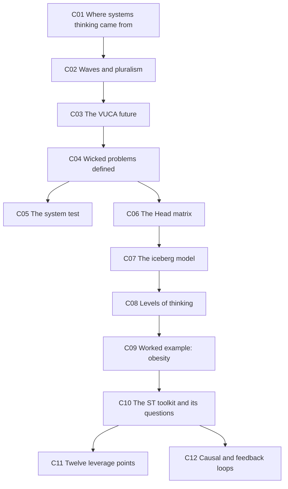

---

## 📚 L8-C01 · Where systems thinking came from

> [!question] Cue questions
> - What did Jay Forrester identify as the real impediment to progress?
> - What was *The Predicament of Mankind*, and what's the lesson from re-reading it?
> - Name the NZ complexity research centre.

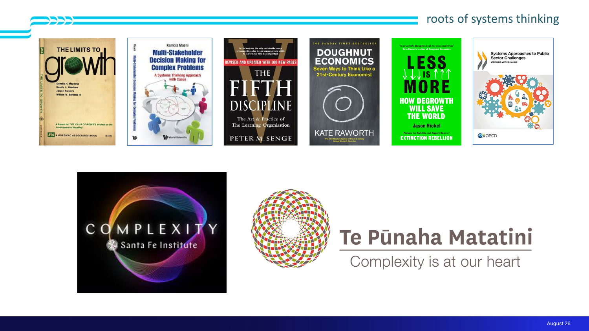

> [!quote] Jay Forrester, MIT (slide 6)
> **"The biggest impediment to progress comes, not from the engineering side of industrial problems, but from the management side … social problems are much harder to understand and control than physical systems."**

> [!important] What that means for you
> *"Quite often **the engineering problem can be solved**. But the management side, the implementation, the rollout, the values, the prioritisation — the **social problems are way harder**."*
>
> **Engineering is part of the solution to a wicked problem, but can never be a complete solution.** Same claim as [[../../Lecture1/notes/L1-notes|L1]]'s T-shape and [[../../Lecture3/notes/L3-notes|L3]]'s "good technical work is necessary and nowhere near sufficient" — this time sourced to the founder of the discipline.

> [!example] The intellectual lineage (slide 7)
> | Work | Note |
> |---|---|
> | ***Project on the Predicament of Mankind*** (late 60s / early 70s) | A report from **The Club of Rome**, an early group of intellectuals **including Donella Meadows**. The moment people realised they *"needed to zoom out from their **reductionist focus** on specific problems and look at the whole planet."* Juliet: *"The predicament of mankind hasn't got any better in the intervening 50 years, and it's interesting to go back and realise **just how little we listened**."* |
> | ***Less Is More***, Jason Hickel (recent) | *"It pretty much says the same thing… **we keep restating the problem**."* |
> | Multi-stakeholder decision making for complex problems (Cabezas-Mani) | For after you've finished Meadows |
> | **Kate Raworth, *Doughnut Economics*** | Reframing the economic system inside **social limits** (everyone fed and housed) and **planetary limits** (*"we can't run out of planet"*). *"Can't say it's catching on yet, but it's a very interesting reframe of a system that's **locked in with particular settings and particular incentives**."* → [[../../Lecture6/notes/L6-notes|L6-C09]] |
> | **OECD guide** to systems approaches for public sector challenges | *"Squarely where we are in this course"* |
>
> Also: **the Santa Fe Institute**, one of the earliest places to address complexity as a subject in itself, and **Te Pūnaha Matatini** — *"New Zealand's complexity Centre of Research Excellence, housed here in Auckland"*, with Juliet on its advisory board.

> [!important] Why none of these are a method
> *"**None of these books are a guide** and a go-to 'oh yeah, I'll just use that for my systems project.' They'll all give you ideas. They'll explain the complexities. They'll give you tips on how to think and how to formulate and how to scope. But **there's no one way to solve these things. It's too hard for that.**"*
>
> Or, on the older books: *"We need more and more solutions, and those are **just not parts of the puzzle — they are ways of thinking about the puzzle** so we can make progress."*

*📄 Source: slides 5–7 · transcript*

---

## 🌊 L8-C02 · Waves of systems thinking, and pluralism

> [!question] Cue questions
> - Name the four waves in order. Which one is correct?
> - What does pluralism claim?
> - What are DSRP and VMCC?

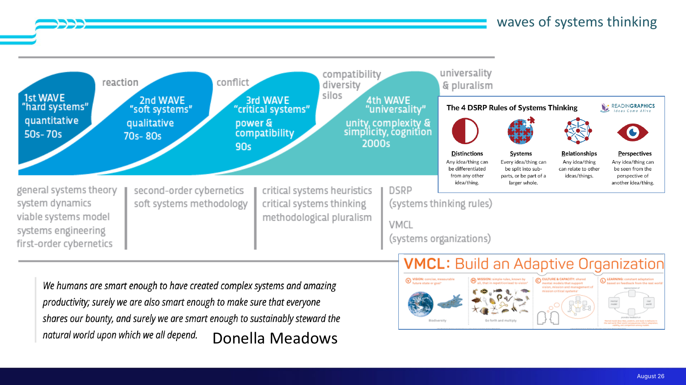

> [!important] The four waves (slide 8)
> **Hard systems → soft systems → critical systems → universal / zoomed-right-out.**
>
> > ⭐ ***"No particular wave is correct. It's just an evolution."*** Depending on the problem, **any one of those waves could move you forward** — and which resonates depends on your home engineering discipline.

> [!important] Pluralism — the idea to take away
> *"There's **more than one way of seeing a problem. Both those ways could be true. They may be incompatible. They may throw up conflicts** that may teach you something about the system as a whole."*
>
> **A conflict between two valid framings is information, not an error.**

> [!tip] Two acronyms you may meet
> - **Heuristics** — *"quick mental shortcuts to get to an answer. Sometimes they're helpful, and sometimes they **divert us because our assumptions were incorrect**."*
> - **DSRP** — distinctions, systems, relationships, perspectives. *"You may find them helpful. You may not… If you find it useful, go for it."* Explicitly **different** from the system test taught here.
> - **VMCC** — for building an **adaptive organisation**: **Vision** (e.g. "great biodiversity") → **Mission** (plenty of diverse organisms, none going extinct, understand the relationships) → **Culture** (people buy in and all go in the same direction) → **Capacity** (an organisation that **adapts and learns**).
>   The culture point is the substantive one: *"Everybody makes mistakes… Is it an environment where it's safe to say **'you know what, we completely stuffed up and wasted the last two months — how do we make sure that doesn't happen again?'** Or do we say 'don't tell anyone, they won't notice'?"*

*📄 Source: slide 8 · transcript*

---

## ⚡ L8-C03 · Our VUCA future

> [!question] Cue questions
> - What does VUCA stand for, and what did Juliet change about it?
> - Name the five drivers.
> - Work the supply-chain example through all of them.

> [!quote] Slide 9
> **Our VUCA future: volatile, uncertain, complex, uncertain, volatile**
>
> Drivers: **Technology · Globalisation · Demographics · Climate change · Geopolitical conflict**

> [!important] The joke that is also the point
> The standard acronym is **volatile, uncertain, complex, ambiguous**. Juliet's slide reads **volatile, uncertain, complex, uncertain, volatile** — *"When I updated this slide, I decided things were **really volatile**, so I added an extra one. The world is certainly getting **more volatile, not less**."*

| Driver | What it does *(transcript)* |
|---|---|
| **Technology** | AI is disrupting study and business; more will come, fast. *"All of them have benefits. All of them have risks. **All of them need critical thinkers** to figure out how to harness them to do more good than harm."* |
| **Globalisation** | More efficient, more choice, in theory shares wealth — but creates **global inequity** and **loss of social cohesion** |
| **Demographics** | **Mass migration into countries that can't house those people** — driven by climate, demographics, economies |
| **Climate change** | A cause of the above |
| **Geopolitical conflict** | The output of all the others |

> [!example] The worked example — everything converging at once
> A **global supply chain critically dependent on the Strait of Hormuz** + geopolitical conflict + *"volatile, uncertain leadership in the Western world"* → **an unexpected war** → **intermittently blocked supply chains** → **fuel price spikes** flowing through Western economies. *"No sign of it stopping soon. High risk of more geopolitical conflict creating more change."*

> [!warning] The AI-and-drones argument — worth being able to reproduce
> *"Technology makes conflict **faster**. Lots of the wars being fought at the moment are being fought by **drones**. Whereas if you've got to send **boots on the ground** into a country to invade, there's **a bit of time needed, there's a bit more skin in the game, there's much more time for diplomacy**. As AI takes over more of the decisions and more of the weaponry, **it's very quick for your AI to fight my AI, and we've blown each other up before anyone's had time to think.**"*
>
> The sting: *"These were **well documented risks** of drones and AI when they both emerged, and **the convergence was seen — but it didn't stop it happening anyway**."* Foreseeing a systems risk is not the same as preventing it.

*📄 Source: slide 9 · transcript*

---

## 😈 L8-C04 · Wicked problems, defined

> [!question] Cue questions
> - Give the definition verbatim.
> - Distinguish wicked, complex and long problems.
> - What are the five adjectives on the slide title?

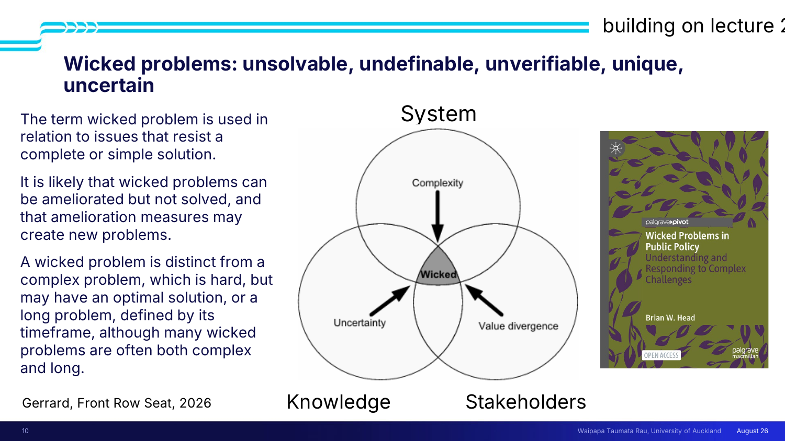

> [!quote] Slide 10 — *Wicked problems: unsolvable, undefinable, unverifiable, unique, uncertain*
> **"The term wicked problem is used in relation to issues that resist a complete or simple solution.**
>
> **It is likely that wicked problems can be ameliorated but not solved, and that amelioration measures may create new problems.**
>
> **A wicked problem is distinct from a complex problem, which is hard, but may have an optimal solution, or a long problem, defined by its timeframe, although many wicked problems are often both complex and long."**
>
> *— Gerrard, Front Row Seat, 2026*

| Problem type | Defining property |
|---|---|
| **Complex** | **Hard, but may have an optimal solution** |
| **Long** | Defined by its **timeframe** |
| **Wicked** | **Resists a complete or simple solution** — can be **ameliorated but not solved**, and the amelioration **may create new problems**. Often complex *and* long as well |

> [!important] The triangle returns — from [[../../Lecture7/notes/L7-notes|L7]]
> The same **System / Knowledge / Stakeholders** figure. *"You can look at the whole system and say **how complex is it** — the more complex, the harder. You can look at the **knowledge** surrounding it — the more uncertain, the harder. And you can look at **how values diverge** amongst your stakeholders — the more they diverge, the harder."*
>
> *"It applies to the whole problem, or the stakeholder problem, or any part of it."*

> [!warning] What "unsolvable" costs you in practice
> *"Any solution you come up with **probably won't solve it. Might make it better**, but is likely to have tripped over so many trade-offs and tensions that **you've made something else worse** — either within your system or someone else's."*

*📄 Source: slide 10 · transcript*

---

## 🔲 L8-C05 · The system test

> [!question] Cue questions
> - What three things must something have to be a system?
> - Define an emergent property.
> - What happens the moment you draw a boundary?

> [!important] The system test (slides 11–12)
> A system is **"a set of connected parts that together form a cohesive whole"** and will have **interconnected related elements, inputs, outputs, and a purpose.**
>
> **Elements + connections + a purpose.** Anything failing that test is not a system.

> [!tip] Purpose = emergence
> *"In some readings you'll see the purpose described as **emergence**. An emergent property is where **the whole is more than the sum of the parts** — a property emerges from the system that **wasn't present in all the parts**."*

> [!warning] The boundary is arbitrary and generative of conflict
> *"You're going to **really struggle** to draw a boundary around your system. It's going to be **slightly arbitrary**, and as soon as you've drawn a boundary you're going to have **tensions between the system you've defined and the surroundings** that you may well influence but haven't put in scope."*
>
> This is exactly what happened to the fisheries report ([[../../Lecture7/notes/L7-notes|L7-C12]]) — the boundary itself became the fight. Only after the boundary exists can you define **inputs** and **outputs**.

*📄 Source: slides 11–12 · transcript*

---

## 📊 L8-C06 · The Head matrix — wicked vs complex

> [!question] Cue questions
> - Name both axes and all three levels of each.
> - Name all nine cells.
> - Where does 303 sit, and where does 403 sit?

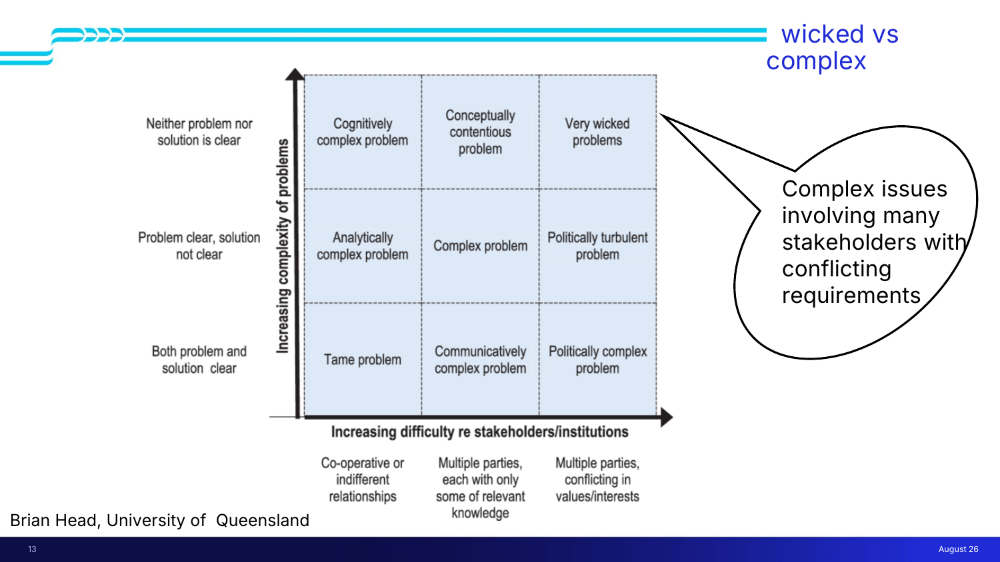

> [!important] The matrix (slide 13, Brian Head, University of Queensland)
> **Y-axis — increasing complexity of problems:** *both problem and solution clear* → *problem clear, solution not clear* → *neither problem nor solution is clear*
> **X-axis — increasing difficulty re stakeholders/institutions:** *co-operative or indifferent relationships* → *multiple parties, each with only some of relevant knowledge* → *multiple parties, conflicting in values/interests*
>
> | ↑ Complexity | Co-operative | Partial knowledge | Conflicting values |
> |---|---|---|---|
> | **Neither problem nor solution clear** | Cognitively complex problem | Conceptually contentious problem | ⭐ **Very wicked problems** |
> | **Problem clear, solution not** | Analytically complex problem | **Complex problem** | Politically turbulent problem |
> | **Both clear** | **Tame problem** | Communicatively complex problem | Politically complex problem |
>
> **Very wicked problems** = *"Complex issues involving many stakeholders with conflicting requirements."*

> [!example] Juliet's worked walk — the lecture theatre (transcript)
> The whole matrix, traversed with one problem: **800 students, a 600-seat theatre, and a university policy that everyone must have a seat.**
> - **Tame** — *"with a bit of juggling of the timetable and **Amanda's excellent relationships with the people in timetabling**, we can solve that."*
> - **Analytically complex** — problem still clear, but **no obvious solution**: maximum campus capacity is only 600, so 200 must stay home.
> - **Cognitively complex** — *"neither the problem nor the solution is clear… not clear whether we can bend the policy about having a seat for everyone, which seems a bit silly when lots of people prefer to study online."*
> - **Communicatively complex** — clear problem, clear solution, **but Amanda leaves**, a new staff member fights with timetabling, and *"they might just not talk to us because they'd rather prioritise somebody across campus that's nicer."*
> - **Politically complex** — a new **Minister of Education** after the November election says universities take too much space, nobody comes to lectures, and the right-to-a-seat policy is unaffordable.
> - **Politically turbulent** — *"we have to make all these decisions **before the government is formed**. One side wants to get rid of the right to a seat. The other is campaigning to go back to old-fashioned teaching. **Now we need two plans.**"*
> - **Very wicked** — the government defunds universities entirely: *"Everybody needs to go off and learn with AI. We're going to go back to a very elitist system. We don't need everybody to do critical thinking."* *"I think the university would struggle to respond to that, and **I don't think there would be a solution**."*
>
> **Notice what moves the problem right vs up.** Moving **right** = adding people who disagree. Moving **up** = removing clarity about what the problem or solution even is. The lecture theatre never changes.

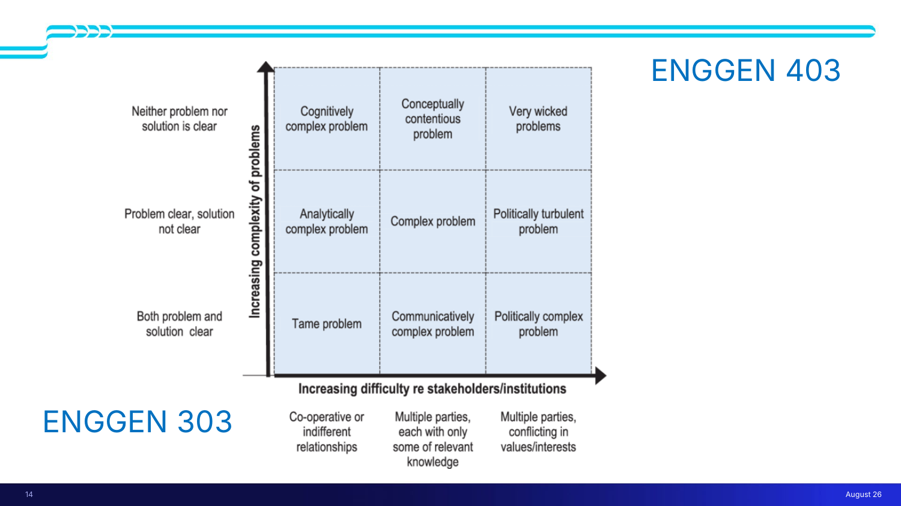

> [!important] Where the course puts you (slide 14)
> **ENGGEN 303 sits bottom-left. ENGGEN 403 sits top-right.**
>
> *"You've been on a journey where you could do these quite easily. And now **we are going to make your head hurt by making them impossible to solve**."*

*📄 Source: slides 13–14 · transcript*

---

## 🧊 L8-C07 · The iceberg model

> [!question] Cue questions
> - Name the four levels top to bottom, and the question each asks.
> - Which is above the waterline?
> - Work Juliet's cold example through all four.

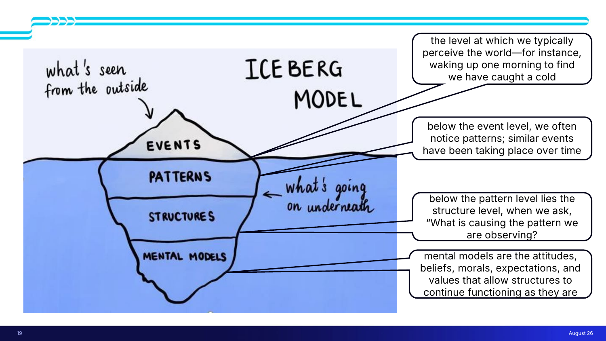

> [!important] The four levels (slides 15–19)
> | Level | Slide wording |
> |---|---|
> | **Events** *(above the waterline — "what's seen from the outside")* | **"The level at which we typically perceive the world — for instance, waking up one morning to find we have caught a cold"** |
> | **Patterns** | **"Below the event level, we often notice patterns; similar events have been taking place over time"** |
> | **Structures** | **"Below the pattern level lies the structure level, when we ask: what is causing the pattern we are observing?"** |
> | **Mental models** | **"Mental models are the attitudes, beliefs, morals, expectations, and values that allow structures to continue functioning as they are"** |
>
> *"What you see in the world is often **just the tip of the iceberg** and there's a lot more going on underneath."*

> [!example] Juliet's cold, all four levels
> - **Event** — I've caught a cold. *"I could just ignore that."*
> - **Pattern** — *"Why have I got **another** cold? I seem to often get a cold **after I've pulled an all-nighter** because I didn't write my lectures in time, and then been so relieved to have got through the day that I went to the pub and drank too much. And then three days later I'm sick."*
> - **Structure** — *"Maybe I need **more time management**. Maybe my **job description is overwhelming**… my habits, the way my workplace gives me the tasks."*
> - **Mental model** — *"**It's me leaving things till the last minute.** It's my expectations and my values that just don't bother to change the pattern."*
>
> Note the direction of the diagnosis: each level answers *why* the level above it keeps happening.

*📄 Source: slides 15–19 · transcript*

---

## 🪜 L8-C08 · Levels of thinking

> [!question] Cue questions
> - How does this differ from the iceberg?
> - Name four layers you might label.

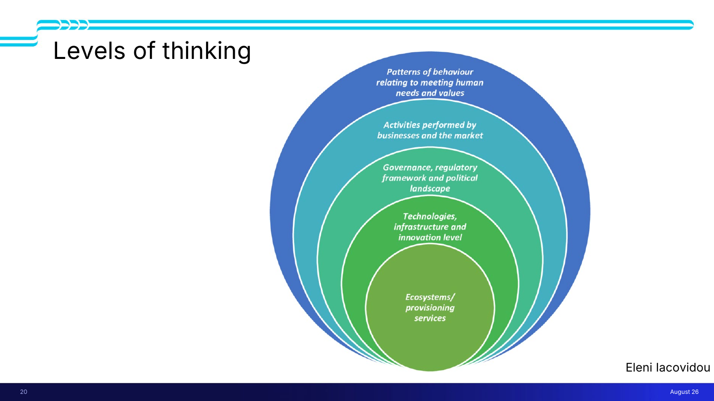

> [!important] Slide 20 (Eleni Iacovidou)
> Same idea, **more layers**, and *"you can, if you like, start to **label the layers** of a problem to look at specific things."* The layers Juliet named: **technology · governance · business and market · patterns of behaviour.**

> [!tip] Two models, deliberately used in parallel
> *"I'm using the two models in parallel just to show you **there's no right answer**."*
>
> And the anti-perfectionism point, which she makes twice: *"This model I resonate with less — to the extent that when I first did this, **I did it upside down**. Just tell you that story to show **it doesn't really matter how you do this thinking. These are just tricks to start conversations and help organise your thoughts.**"*

*📄 Source: slide 20 · transcript*

---

## 🍔 L8-C09 · Worked example — obesity

> [!question] Cue questions
> - Build the obesity iceberg from event to mental model.
> - Where does the problem statement get chosen, and what gets deliberately dropped?
> - What is a food desert, and why does the framing matter?

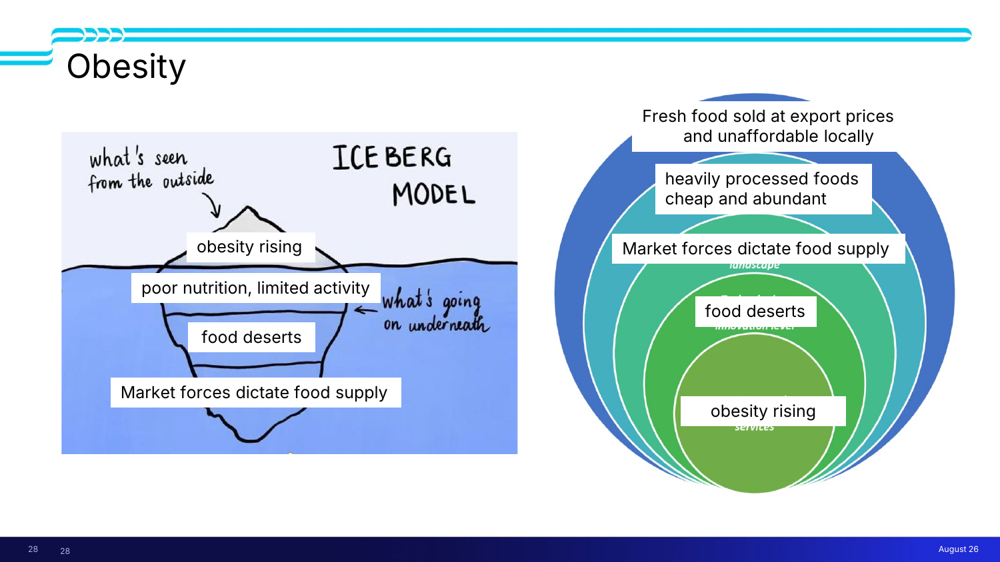

> [!important] The framing, layer by layer (slides 21–28)
> | Level | Juliet's choice | The alternative she names |
> |---|---|---|
> | **Event** | **Obesity rising** | *"Someone might say — actually that's not the problem, the problem is **poor health outcomes**. And that's **totally valid**."* |
> | **Pattern** | **Poor nutrition**, limited activity | Both are real; she picks **poor nutrition** for the problem statement |
> | **Structure** | **Food deserts** | *"You could talk about **individual incentives, education**"* |
> | **Mental model** | **Market forces dictate the food supply** | *"You could go very many different ways, but that's the key piece that I've pulled out"* |
>
> Extended on the levels-of-thinking version: obesity rising ← **food deserts** ← **market forces dictate food supply** ← **heavily processed foods cheap and abundant** *and* **fresh food sold at export prices and unaffordable locally**.

> [!important] ⭐ Where the problem statement comes from
> *"**Now, these are problem statements.** Have we missed anything? I've gone with poor nutrition as the thing I'm going to try and solve. I absolutely understand that limited activity is another part of the problem. **I don't think I can manage to put both of those in my problem statement.** So I'm going to go with poor nutrition… **It might be that you need two problem statements** and the other one's on limited activity. You'll just have to **sort it out in your team**."*
>
> This is the bridge from L8's tools to [[../../Lecture4/notes/L4-notes|L4]]'s two-to-three problem statements: **the pattern layer of the iceberg is where problem statements come from**, and choosing one means **explicitly parking another**.

> [!example] Food deserts — and why the framing is a values choice
> *"A place where there's **hardly any fresh food**. If you look around any student digs, you will find a large amount of stores that sell very processed food, cheap food, packet food, pot noodles — **stuff you can keep in the cupboard, you don't need a fridge, stuff that lasts forever** — but not much fresh food."*
>
> Why this framing rather than personal responsibility: *"It's **not necessarily that people have no self-control**… it's more about **the environment they live in**. It's more at the **community level**."* Choosing "food deserts" over "individual incentives" is choosing where the intervention will land.

> [!quote] The UK whole-systems framing (video, slide 21)
> *"What we eat and how active we are is influenced by the environment we live, work and play in. It is **this range of interconnected factors that together can cause obesity**. That's why there is **no simple solution**… It is **everyone's business**."*
>
> Also from it: actions must **span short, medium and long term** — *"quick wins may build support; longer-term actions can deliver sustainable change."* And a whole-systems approach *"is likely to require a **change in mindset and new ways of working**."*
>
> Reference: **Public Health England, "Whole systems approach to obesity" guide.** NZ context: **third most obese country in the world**, trend line worsening (Ministry of Health data).

> [!tip] What this level of work represents
> *"This would be where you got to after **an hour or so on the first morning**, and you would be going 'oh, we've missed this, we've done this, what else can we do?' But it's a way of **starting to take this massive problem and dumping things on a page**."*

*📄 Source: slides 21–28 · transcript*

---

## 🧰 L8-C10 · The toolkit, and the questions that drive it

> [!question] Cue questions
> - Name the six categories of ST tool.
> - What are the ten questions to ask of a system?
> - Which question is the one that leads to intervention?

> [!important] The tools (slides 29–32)
> **Iceberg model · Levels of thinking · Trend maps · System models (conceptual and computational) · Leverage points · Causal loops · Feedback loops**
>
> **Trend maps** — what's happening over time; *"are we seeing repetitive behaviour, repetitive fluctuations?"*
> **System models** — you already know these as fourth-year engineers: **block flow diagrams**, **process flow diagrams** (chemical), computational diagrams.

> [!quote] Questions into the ST tools (slide 31, Betley 2021)
> - **What happened?**
> - **What recurring events are we noticing?**
> - **What length of time is long enough to see patterns in systems function?**
> - **What structures may be determining the function we see?**
> - **What underlying beliefs, values, or assumptions are at play?**
> - **What are the feedbacks in this system?**
> - **How can we define a boundary around this system?**
> - **What other perspectives, methodologies, or disciplines might help us more fully understand the issue?**
> - ⭐ **Where in this system could we make small shifts that would make big difference? What trade-offs exist? Is there a potential for unintended consequences?**

> [!warning] Two traps in those questions
> - **"What length of time is long enough?"** — *"We're **very good at seeing patterns**. But is the length of time actually long enough to see the pattern?"*
> - **Unintended consequences.** Amanda's example: *"We want to eliminate New Zealand's methane emissions. Most of New Zealand's methane is produced by — dairy cows. So let's just say **Canterbury can't have any cows anymore. What's going to happen to that economy? What's going to happen to those people?**"*

*📄 Source: slides 29–32 · transcript*

---

## 🎚 L8-C11 · Meadows' twelve leverage points

> [!question] Cue questions
> - Recite the twelve, in order, and state which end has more impact.
> - Where do most real interventions cluster, and why?
> - Give an example intervention at 12, at 6, at 5 and at 2.

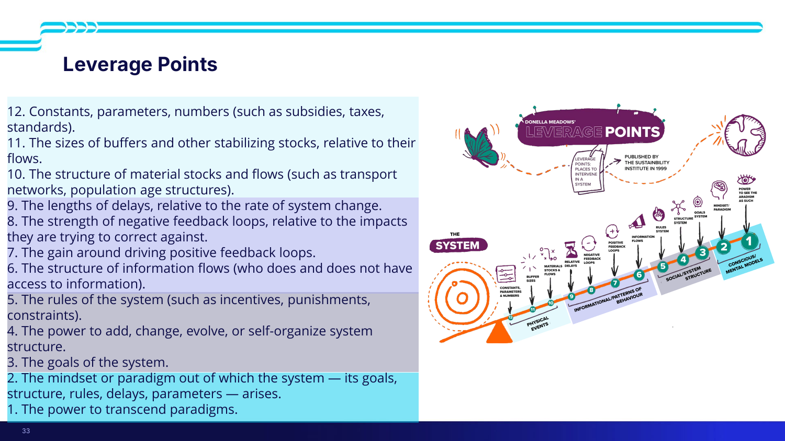

> [!important] The list (slide 33) — **12 = least leverage, 1 = most**
> | # | Leverage point |
> |---|---|
> | **12** | **Constants, parameters, numbers** (such as subsidies, taxes, standards) |
> | **11** | The **sizes of buffers** and other stabilizing stocks, relative to their flows |
> | **10** | The **structure of material stocks and flows** (such as transport networks, population age structures) |
> | **9** | The **lengths of delays**, relative to the rate of system change |
> | **8** | The strength of **negative feedback loops**, relative to the impacts they are trying to correct against |
> | **7** | The gain around driving **positive feedback loops** |
> | **6** | The **structure of information flows** (who does and does not have access to information) |
> | **5** | The **rules of the system** (such as incentives, punishments, constraints) |
> | **4** | The **power to add, change, evolve, or self-organize** system structure |
> | **3** | The **goals of the system** |
> | **2** | The **mindset or paradigm** out of which the system — its goals, structure, rules, delays, parameters — arises |
> | **1** | The **power to transcend paradigms** |

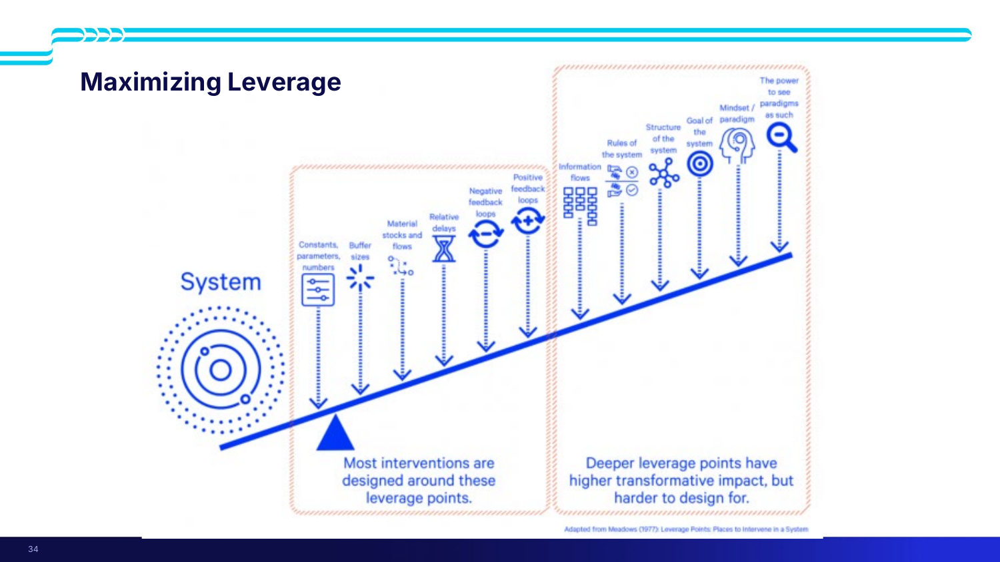

> [!important] ⭐ The trade-off, stated on slide 34
> > **"Most interventions are designed around these leverage points"** *(the shallow end: constants, buffer sizes, material stocks and flows, relative delays, negative and positive feedback loops)*
> >
> > **"Deeper leverage points have higher transformative impact, but harder to design for."** *(information flows, rules of the system, structure of the system, goal of the system, mindset/paradigm, the power to see paradigms as such)*
>
> Amanda: *"12 is going to be the **closest to the system, but it will have the least amount of impact**… Most of these interventions take place close to the system. **They tend to be easier to design around. We can understand them. We can see the impact.** But **if we really want to change the system, we need to move further out. And those are much harder to do.**"*
>
> > ***"One of the key skills of systems thinking is understanding when and where you can pull levers."***

> [!example] Worked interventions at four different depths
> | Level | Example |
> |---|---|
> | **12 — parameters** | **An EV subsidy.** *"If the New Zealand government offers a subsidy of $5,000 or maybe $10,000 for every EV car you buy, that will drive up how many people buy EVs. So there's going to be **some** impact, but it's going to be **small**."* |
> | **6 — information flows** | **Real-time electricity pricing.** *"What happens if you knew **exactly how much energy, and the cost, in real time**? 'Oh, I turn my heater up and now I see my energy bill is skyrocketing.' Is that going to make you change your behaviour **because you know something earlier**?"* |
> | **5 — rules** | Change the social system: **incentives, punishments, constraints, laws, rules and regulations**. Or (level 4) **let the system self-organise**; or (level 3) **just change the goal**. |
> | **2 — paradigm** | **Making New Zealand a non-car-oriented society within one generation.** *"To do it within a generation **we can't be iterative. It can't be incremental by just adding more bike lanes.** How in the world do we shift the model to say **cars are bad, don't use them**?"* |
>
> A live NZ example she offers: **NCEA and the school system changes** — *"the government's making this change. Where in the system does it fall? **That's up to the government to ultimately decide which lever they pulled**, and they think it falls somewhere probably in this region."* The university is already adapting what it expects from students as a consequence.

> [!tip] The question to leave with
> *"**Can you identify something out here that maybe you don't quite know how to do yet, but something you need to think about more?**"* Naming a deep leverage point you can't yet operate is still worth more than a parameter tweak you can.

*📄 Source: slides 33–34 · transcript*

---

## 🔁 L8-C12 · Causal loops and feedback loops

> [!question] Cue questions
> - Distinguish a balancing loop from a reinforcing loop, with the sign convention.
> - Give a physiological example of each type.
> - What are the three reasons robust systems are hard to disrupt?
> - What do you look for when you map a system?

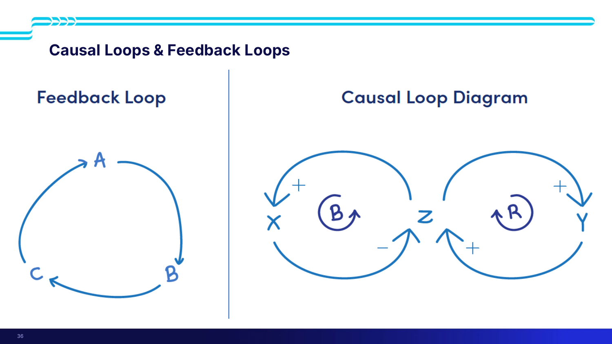

> [!important] The two loop types
> | | **Balancing loop (B)** | **Reinforcing loop (R)** |
> |---|---|---|
> | Also called | **Negative feedback loop** | **Positive feedback loop**, reinforcing feedback system, **runaway system** |
> | Structure | Z **positively** affects X; X **negatively** affects Z production | Z **positively** affects Y; Y **positively** affects Z |
> | Behaviour | **Goal-oriented — keeps the system in check** | **Always increasing** |
> | Example | **Body temperature regulation** | Runaway growth |
>
> ***"Our systems are going to have a balance of B and R."*** A causal loop is *"a more advanced form of a feedback loop"* — it adds the **signs** on each link.

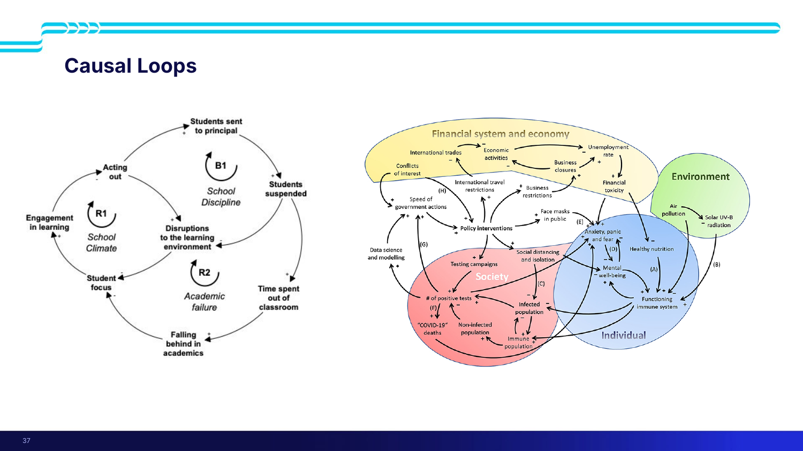

> [!example] Worked causal loop — school discipline and academic failure (slide 37)
> Centred on **disruptions to the learning environment → student focus → engaged learning → acting out**.
>
> - **The balancing loop:** students are sent to the principal → suspended → **disruptions decrease** for everyone else. Goal achieved.
> - **The reinforcing loop it creates:** those suspended students **spend more time out of the classroom → fall further behind academically → find it harder to focus → act out more**.
>
> > **The intervention that balances one loop drives another.** *"Here we're seeing a **reinforcing loop on why these students are doing poorly**."* This is the single clearest illustration in the course of an amelioration measure creating a new problem — the wicked-problem definition in miniature.
>
> Second example on the slide: **a causal loop map of how COVID impacted society** — policy interventions, the financial and economic systems, the environment, individual wellbeing, and society.

> [!important] Why robust systems are hard to change (slide 38)
> Robust systems work well and are **hard to disrupt** because of:
> - **Resilience** — built on balancing and reinforcing loops
> - **Self-organisation** — *"they self-organise to make sure that they're not fragile"*
> - **Hierarchy**
>
> > **"To intervene in the system, identify Leverage Points or Causal Loops to impact."**

> [!tip] How to actually do it, per Amanda
> 1. Use the tools to get **an idea of the system**, then **map it out** — *"you don't need a great huge detailed diagram. **You can start literally on a whiteboard.**"*
> 2. Ask: **what do we know · what are we measuring · what could we push on?**
> 3. **Find the loops.** *"What loops are **amplifying** our system or **balancing** it out? **What loops are dominating** our system?"*
> 4. ⭐ ***"Once we find something that dominates our system, that's the point of impact."***
> 5. Then ask whether a workable intervention exists there — and **whether it falls in the shallow (physical/informational) part of the leverage scale, or further out.**
>
> *"Within our system we can have multiple loops. And the key is trying to find **which loop we can have the most impact on**."*

*📄 Source: slides 35–38 · transcript*

---

## ✅ Summary (slide 39, verbatim)

> [!quote]
> - **System: elements, relationships, purpose**
> - **Complexity and "Wickedness"**
> - ⭐ **Systems Thinking is NOT an Algorithm or Single Process!**
> - **It's an approach to broader understanding, critical thinking, and proposing of interventions and solutions.**

Amanda's spoken close adds the reason: *"It's using **multiple tools** to understand what's happening… proposing interventions and solutions that may change the system — because **our system is complex, we are going to have stakeholders whose values are divergent, and we're going to have knowledge that we don't quite know yet.**"*

Plus what to carry into Systems Week:

5. **Read *Thinking in Systems*** — at least the first two chapters, ideally the whole thing, ideally two people per team.
6. **The pattern layer of the iceberg is where your problem statements come from** — and picking one means explicitly parking another.
7. **Most interventions sit at leverage points 12–7 because they're designable. The transformative ones sit at 5–1 and are hard.** Knowing which you're proposing is the skill.
8. **Find the dominant loop. That's the point of impact.**

---

## 🧪 Self-test

> [!question]- 12 free-recall questions
> 1. What did Jay Forrester say is the real impediment to progress, and what does that imply about engineering's role in a wicked problem?
> 2. Name the four waves of systems thinking. Which is correct, and what does pluralism claim?
> 3. What does VUCA stand for, what did Juliet change, and what are the five drivers?
> 4. Give the definition of a wicked problem. How does it differ from a complex problem and from a long problem?
> 5. State the system test. Define an emergent property. What happens the moment you draw a boundary?
> 6. Name both axes of the Head matrix with all three levels of each, and all nine cells. What moves a problem right, and what moves it up?
> 7. Name the four levels of the iceberg model and the question each asks. Work the "I keep catching colds" example down all four.
> 8. Build the obesity iceberg from event to mental model. What alternative framing exists at each level, and what got parked?
> 9. Where do problem statements come from in the iceberg model? What does choosing one commit you to?
> 10. Recite Meadows' twelve leverage points in order. Which end has more impact, and where do most real interventions cluster? Why?
> 11. Give an intervention at level 12, level 6, and level 2 for a transport problem, and say why the level-2 one can't be incremental.
> 12. Distinguish balancing from reinforcing loops with the sign convention. Then explain, using the school-discipline example, how an intervention that balances one loop can drive another.

---

> [!info]- Related notes
> - `L8-summary.md` · `L8-flashcards.tsv`
> - `../context/admin-and-dates.md`
> - **Comes from:** [[../../Lecture2/notes/L2-notes|L2 — systems thinking, wicked problems, amelioration]] · [[../../Lecture7/notes/L7-notes|L7 — the wickedness triangle and the fisheries boundary problem]]
> - **Feeds into:** the **Team Project** and **Systems Week** — this is the first-morning toolkit. Problem statements from here feed [[../../Lecture4/notes/L4-notes|L4]]'s strategic case.
