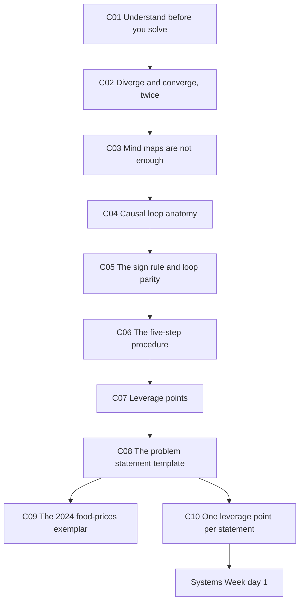
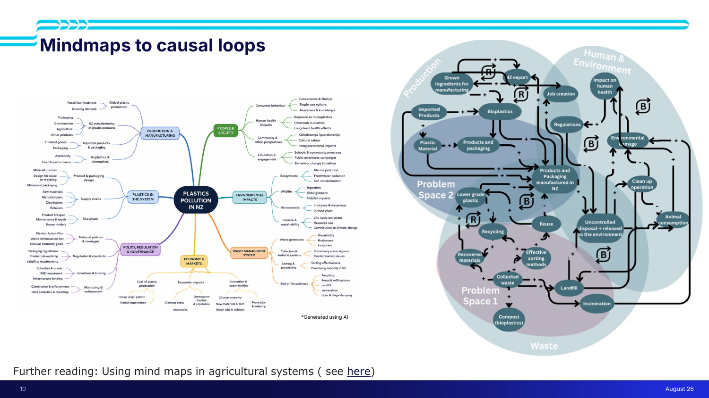
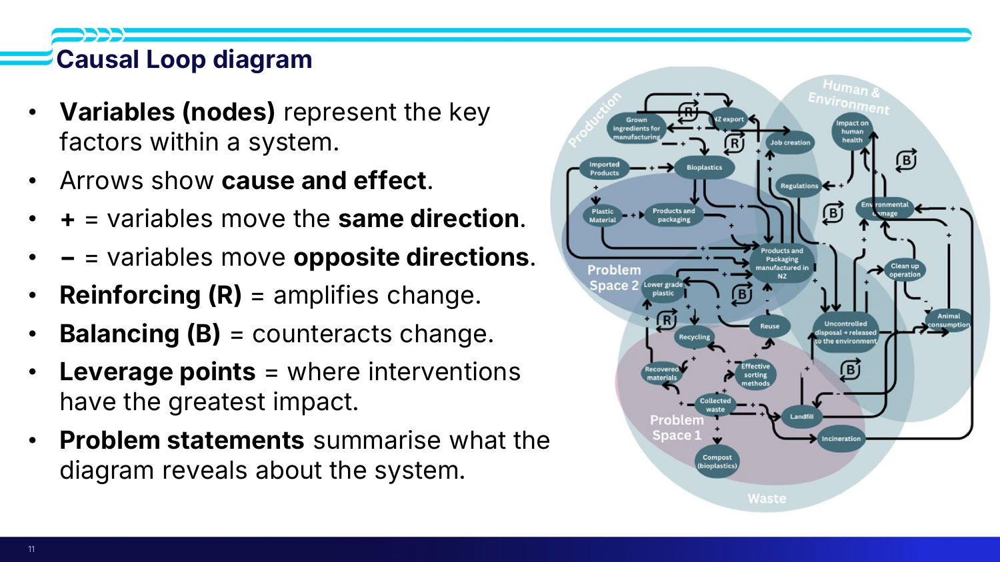
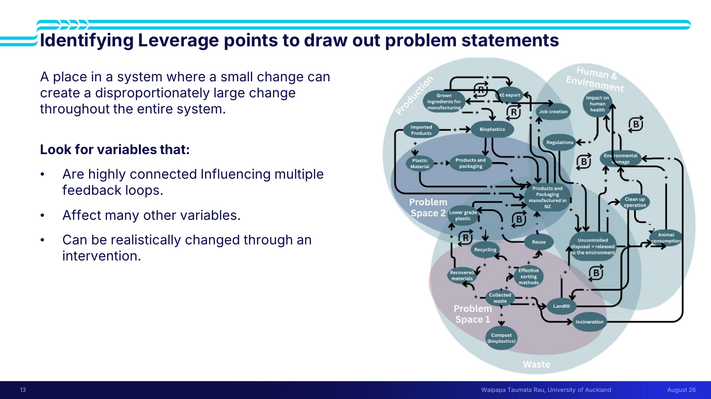
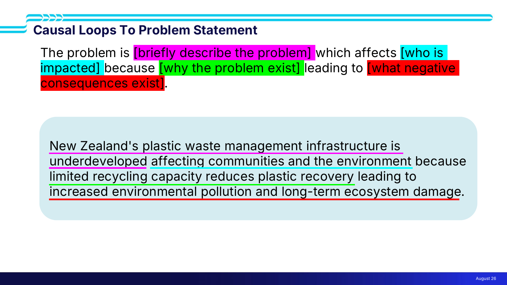
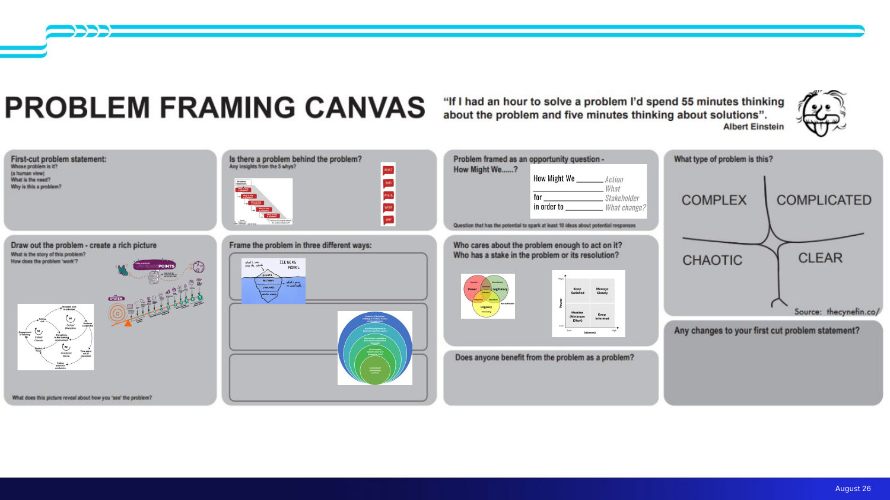

# 🎯 Lecture 9 — Defining and scoping your wicked problem

> [!abstract] Why this matters
> [[../../Lecture8/notes/L8-notes|L8]] gave you causal loops and leverage points as concepts. **This lecture turns them into a procedure** that ends in a written problem statement — and that statement is the first thing you produce in Systems Week and the top of the strategic case in [[../../Lecture4/notes/L4-notes|L4]].
>
> It is also the most workshop-heavy lecture in the course: the class built a causal loop for **high food prices** live, and the debrief is where the real teaching is.

> [!info] Sources
> **Slides:** `ENGGEN 403 Lecture 09.pdf` — 20 pages. **Marc Lewis and Amanda Di Ienno**, 7 August 2026.
> **Transcript:** auto-generated, ~4,600 words. Quality good for the framed segments, patchy through the activity.
> **Supplementary:** `Systems Report Example 1.pdf` (49 pp) and `Systems Report Example 2.pdf` (56 pp) — two full exemplar Systems Week reports, dropped in this folder. Not walked through in the lecture; they are the fullest models of the deliverable available.
>
> *Prerequisites: [[../../Lecture8/notes/L8-notes|L8]] — causal loops, balancing/reinforcing, leverage points. [[../../Lecture4/notes/L4-notes|L4]] — where the problem statement sits in the strategic case. Assumes ENGGEN **303**: 5 whys, double diamond, How Might We.*

> [!warning] ⚠ Missing slides — the best exemplar is not in the deck
> The deck's footer numbering jumps from **16** (the food-prices activity) to **23** (the after-class activity), so roughly **six slides are absent**. The casualty is the one the transcript spends most time on: the **2024 Systems Week food-prices causal loop**, annotated with pluses, minuses, R/B labels and highlighted leverage points, from which the team drew **two problem statements**. Marc walks through it in detail; only his words survive, reconstructed in [[#🍞 L9-C09 · The 2024 food-prices exemplar|C09]].

> [!quote] Stated learning outcomes (slide 5)
> - **Define the components of a problem statement**
> - **Frame system-level problems using systems thinking tools** to identify problem statements that address **one or multiple aspects of the problem space**

## 🗺 Concept map

---

## 🧭 L9-C01 · Understand the problem before you solve it

> [!question] Cue questions
> - How long should the first days of Systems Week go on problem analysis?
> - What is the named failure mode, and when does it surface?
> - What does "reiterating" signify — trouble, or progress?

> [!important] The instruction
> *"This is the first thing that you're going to do when you come to Systems Week… **spending the first couple of days really understanding that problem**. Remember, **we have to understand the problem before we can even think about coming to solutions**."*

> [!warning] ⭐ The named failure mode — twice, from both lecturers
> **Marc:** *"A thing that happens during Systems Week is that teams **rush through the first day**, and by the end of the first day they already have their problem statements. They get to **Wednesday** and they're like — oh, we need to go back and redo our problem statements, because they've understood more about the system."*
>
> **Amanda, harder:** *"They get to their problem statements. They even **hit the solution phase Monday afternoon, Monday evening**, and they do all this work on the solution phase, and they start their **financial analysis**. And then **Tuesday night, Wednesday morning** they go — oh, this isn't a problem, this isn't something we can have any impact in. And they have to go **all the way back to the beginning**."*
>
> Note what's lost in the second version: not just the problem statement, but the options assessment and the CBA built on top of it.

> [!tip] Iteration is the process, not a symptom of failure
> *"Going back and reiterating is a **good thing and a natural thing** that happens with these levels of problems… **don't be afraid** if you have to revisit those assumptions, if you have to revisit those problem statements."*
>
> And Amanda's version: *"You **are** going to have to iterate. You **are** going to have to recycle. But **make sure you understand the system before you start that**."* The distinction is between iterating *within* problem analysis and discovering on Wednesday that your solution work was built on sand.

> [!quote] The framing quote (slide 6, David Gurteen)
> **"There are no solutions to complex challenges — only an endless series of adaptive responses."**
>
> The same claim as [[../../Lecture8/notes/L8-notes|L8-C04]]'s *ameliorated but not solved*, in a form you can quote.

*📄 Source: slides 5–6 · transcript*

---

## 🔀 L9-C02 · Diverge and converge — twice

> [!question] Cue questions
> - Name the four stages of the double diamond as this deck labels them.
> - Where does divergence happen, and where convergence?

Slide 7 reproduces the **Design Council double diamond**, and note it runs one stage further than [[../../Lecture4/notes/L4-notes|L4]]'s version:

> **DISCOVER → DEFINE → DEVELOP → DELIVER**, across a **problem space** and a **solution space**.

| | Diverge | Converge |
|---|---|---|
| **Problem space** | Brainstorm **all** the causes and variables | **One** problem statement |
| **Solution space** | Brainstorm all possible interventions | A shortlist, via DFV and CSFs |

*"We need to explore the problem, the problem spaces, the different facets of that problem."*

> [!tip] The 5 whys still apply (slide 8)
> - *"The Five Whys helps identify the **root causes** of complex problems"*
> - *"**Complements systems thinking** by revealing the **variables that drive system behaviour**"*
> - *"Today we'll build on this by **connecting those variables into a causal loop diagram** to identify feedback loops and leverage points"*
>
> That third bullet is the hinge of the whole lecture: **the 5 whys produce your nodes; the causal loop connects them.**
>
> Marc's gloss: *"If this is the cause, why is that the cause? … Eventually that will lead you to something that **you can provide an intervention for**."*

*📄 Source: slides 6–8 · transcript*

---

## 🕸 L9-C03 · Why a mind map is not enough

> [!question] Cue questions
> - What is a mind map good at, and what can't it show?
> - What is the one question a causal loop answers that a mind map cannot?

> [!important] The contrast (slide 10)
> **Mind maps are good** at *"identifying all of the different variables that may come into play with a particular problem."*
>
> **What they cannot show:** *"the **interconnectedness** of all of these variables. How do they play into one another? What is their **relationship**? **If I increase something on one side, what happens on the other side?**"*
>
> > **A mind map is an inventory. A causal loop is a model.**

The slide puts the two side by side on the same problem: a radial mind map of *Plastics Pollution in NZ* (production and manufacturing · people and society · environmental impacts · waste management system · policy, regulation and governance · economy and markets · plastics in the system) against the causal loop from [[../../Lecture4/notes/L4-notes|L4]], with **Problem Space 1** and **Problem Space 2** marked on it.

> [!tip] The mind map was AI-generated
> The slide is captioned ***"Generated using AI"***. Given [[../../Lecture1/notes/L1-notes|L1]]'s Gen AI rules, the useful reading is that AI is fine for the **divergent inventory step** and does not do the **relational modelling** step for you.
>
> Further reading linked: *Using mind maps in agricultural systems.*

*📄 Source: slides 9–10 · transcript*

---

## ➰ L9-C04 · Causal loop anatomy

> [!question] Cue questions
> - Name the seven elements on the legend slide.
> - What does an arrow mean, and what does a sign mean?
> - How should nodes be named?

> [!quote] Slide 11 — the legend, verbatim
> - **Variables (nodes)** represent the key factors within a system
> - **Arrows** show **cause and effect**
> - **+** = variables move the **same direction**
> - **−** = variables move **opposite directions**
> - **Reinforcing (R)** = **amplifies** change
> - **Balancing (B)** = **counteracts** change
> - **Leverage points** = where interventions have the **greatest impact**
> - **Problem statements** summarise what the diagram reveals about the system

> [!important] ⭐ Name nodes **neutrally**
> *"When we label those nodes, we want to label them **neutrally**. We wouldn't say **'increasing bioplastics'** — the node would just be **'bioplastics'**. Bioplastics can increase **or** decrease."*
>
> The reason is structural: the arrow carries the direction, so baking a direction into the node name makes the sign meaningless.

> [!warning] Be specific, or the arrows become undrawable
> From the debrief: *"If you say **wages**, or if you say **waste** — what do you mean? **Production waste? Retail waste?** If you're saying **utilities** — is that utilities in general, is that specifically **fuel**?"*
>
> > *"**Try not to use vague terms** like 'condition', or vague words where you can't understand what it actually means, **because you need to try and draw that cause-and-effect relationship**."*
>
> Vagueness is not a style problem here. You literally cannot sign an arrow between two fuzzy nodes.

> [!example] A worked reinforcing chain, from the plastics system
> *"If we increase recycling, that means there will be more **recovered materials**, which will require **more recycling** — and so they **reinforce** the change."*

*📄 Source: slide 11 · transcript*

---

## ➕➖ L9-C05 · The sign rule and loop parity

> [!question] Cue questions
> - What does a **+** actually mean — and what does it *not* mean?
> - State the parity rule for classifying a loop.
> - Give a balancing and a reinforcing example.

> [!important] ⭐ The sign is about **polarity, not direction of travel**
> *"The plus means that the relationship between two nodes goes in the **same direction**. If I increase one, the other will increase. **If I decrease one, the other will decrease.** Both of those mean you should have a **positive** sign on that arrow."*
>
> > *"**It doesn't refer to whether it is increasing or decreasing. It refers to the polarity — the direction of change between the two nodes.**"*
>
> This is the most commonly-misunderstood thing on the page: **a "+" arrow can describe two variables falling together.**

> [!important] ⭐ The parity rule — count the minus signs
> | Number of **−** signs in the loop | Loop type |
> |---|---|
> | **Even** (including **zero**) | **Reinforcing (R)** — amplifies change |
> | **Odd** | **Balancing (B)** — counteracts change |
>
> Marc's reasoning: *"If you have two negatives — it flips you one way and it flips you back. **So that's why an even number creates a reinforcing loop.**"*
>
> ⚠ He noted this rule **was not on the slide** — *"I don't have it on here, which I wish I did."* It is transcript-only, and it is the operational half of the legend.

> [!example] The gym example
> *"If you just ate McDonald's every night and didn't go to the gym, you may **gain weight** — that would be a **reinforcing** loop, if you just kept eating and doing nothing. But let's say you go to the gym and burn some calories, so you may not gain as much weight. **It's balancing you back to an equilibrium — it counteracts that change.**"*

*📄 Source: transcript (the parity rule is not on any slide)*

---

## 🔢 L9-C06 · The five-step procedure

> [!question] Cue questions
> - Recite the five steps.
> - Which step is where the intuition actually comes from?

> [!quote] Slide 12 — the procedure, verbatim
> 1. **Identify variables** in the system.
> 2. **Determine relationships** between variables.
> 3. **Identify feedback loops** that explain **why the problem persists**.
> 4. **Identify leverage points** where interventions could have the greatest impact.
> 5. **Develop a systems problem statement** describing **the problem, who is affected, why it exists, and its consequences.**

> [!important] Note what step 3 is for
> Not "find the loops" — *"identify feedback loops **that explain why the problem persists**."* A loop that doesn't explain persistence isn't earning its place on the diagram.

> [!tip] The whole exercise is one thing
> *"All we're doing here is we're **mapping the system behaviour**. That allows us to identify where we think we can make the greatest change."*
>
> And on where the judgement comes from: *"**That intuition will come as you look more at the problem.** … It's **not going to just spit out at you** what your problem statement should be. **By carrying out this activity, you understand where those leverage points are.**"*

*📄 Source: slide 12 · transcript*

---

## 🎚 L9-C07 · Identifying leverage points

> [!question] Cue questions
> - Define a leverage point in one sentence.
> - What three properties should a candidate variable have?
> - What is the trade-off between proximity to the system and impact?

> [!important] The definition and the test (slide 13)
> > **"A place in a system where a small change can create a disproportionately large change throughout the entire system."**
>
> **Look for variables that:**
> - Are **highly connected** — influencing multiple feedback loops
> - **Affect many other variables**
> - ⭐ **Can be realistically changed through an intervention**
>
> That third bullet is the one that eliminates most candidates. A hub variable you cannot move is not a leverage point.

> [!important] The proximity trade-off, restated from [[../../Lecture8/notes/L8-notes|L8-C11]]
> Amanda, closing: *"**The closer the leverage point is to the system itself, the smaller the impact — but the easier it is to think about how to design and implement that.**"*
>
> Same claim as Meadows' 12-to-1 ladder, compressed into one sentence.

> [!example] ⭐ The lake — why some interventions are Band-Aids
> *"You might find that it doesn't matter what we do within, for example, **environmental changes** — those might just be **Band-Aids** upon a problem that really exists in the **production sector**."*
>
> > *"Let's say someone is polluting a lake, and they're just pumping a whole lot of stuff into the lake. **We can treat the lake — but that's ultimately not going to matter if we don't stop the pollution going into the lake.**"*
>
> The test this gives you: **is my intervention upstream or downstream of the thing that keeps regenerating the problem?**

*📄 Source: slide 13 · transcript*

---

## 📝 L9-C08 · The problem statement template

> [!question] Cue questions
> - Write the four-part template from memory.
> - How does it differ from a How Might We statement, and when is each used?

> [!important] ⭐ The template (slide 15) — learn this verbatim
> > **The problem is [briefly describe the problem], which affects [who is impacted], because [why the problem exists], leading to [what negative consequences exist].**
>
> Four components: **problem · who · why · consequences.**

> [!example] The worked example, on the same slide
> > *"**New Zealand's plastic waste management infrastructure is underdeveloped** *(problem)*, **affecting communities and the environment** *(who)*, **because limited recycling capacity reduces plastic recovery** *(why)*, **leading to increased environmental pollution and long-term ecosystem damage** *(consequences)*."*
>
> ⚠ Compare [[../../Lecture4/notes/L4-notes|L4]]'s **PS1**, which is the same statement in the exemplar report's own wording. Same system, same statement — this slide shows you the **skeleton** underneath it.

> [!tip] How Might We vs the systems problem statement (slide 14)
> The 303 **B2C** form has three parts — **intended action · potential user · desired outcome** — and produces *"How might we…?"*
>
> | | **How Might We** (303, B2C) | **Systems problem statement** (403) |
> |---|---|---|
> | Parts | Action, user, outcome | **Problem, who, why, consequences** |
> | Framing | An **opportunity** | A **diagnosis** |
> | Contains | The change you intend | **Why the problem persists** |
>
> Amanda's note that both remain useful: *"Some teams actually go **all the way back to the How Might We statement** to get a very simplified version of a problem, to help them start to figure out what the overall problem is."*

*📄 Source: slides 14–15 · transcript*

---

## 🍞 L9-C09 · The 2024 food-prices exemplar

> [!question] Cue questions
> - What were the two problem statements, and what leverage point did each come from?
> - What is the argument that retail competition is the leverage point?

> [!bug] ⚠ Reconstructed from speech — the slide is missing from the deck
> The annotated 2024 causal loop, with its highlighted leverage points, sits in the gap between deck footers 16 and 23. Everything below is from the transcript.

> [!important] How the team chose their leverage points
> *"**How did they choose those leverage points?** They chose those leverage points **by understanding the complex behaviour of the system**… By carrying out this activity, **you understand where those leverage points are**."*

> [!example] Problem statement 1 — **retail competition**
> The argument first: *"It **doesn't matter what we do in the production space** if the supermarkets are always just going to charge a high price anyway. **If there's no competition, there's no incentive to lower the prices.** So any other interventions that we do are not going to have much of an impact."*
>
> The statement: *"**High grocery prices affect New Zealand consumers because limited market competition reduces downward pressure on prices, leading to higher living costs.**"*
>
> Check it against the template: problem = high grocery prices · who = NZ consumers · why = limited market competition reduces downward pressure · consequences = higher living costs. **All four parts, one sentence.**

> [!example] Problem statement 2 — **transport and logistics**
> *"Similarly, **you can't do anything if your transport system is going to be inefficient anyway** — and so the other problem statement was around the **transport and logistics network**."* Exact wording not read out.

> [!tip] The shape of both arguments is identical
> Each says: *whatever else you fix, this bottleneck will re-impose the problem.* That is the **Band-Aid test** from [[#🎚 L9-C07 · Identifying leverage points|C07]] applied to pick between candidate leverage points — and it is a reusable move.

### From the live activity — student loops worth keeping

The class built loops for **high food prices** across four quadrants (production · transport · retail/consumers · government). Three were fed back:

| Loop | Chain | Type |
|---|---|---|
| **Geography** | NZ is far from everyone → distribution and logistics → harder to export → **+** price of food. Separately: **low population density → − economies of scale → less factory automation → + price of food** | **Reinforcing** (all +) |
| **Congestion** | Congestion → **+** travel distance for logistics → **+** fuel consumption → **+** fuel costs → **+** cost of food | **Reinforcing** (all +) |
| **Demand collapse** | Fuel cost → **+** taxes → **+** utility cost → **+** cost of labour → **−** food purchasing → **−** competition → fewer companies hiring → job loss → **−** cost of labour | **Balancing** (one −… see below) |

> [!warning] The third loop is where the parity rule earns its keep
> The team counted the minus signs, got an odd number, and correctly called it **balancing** — a loop where rising costs eventually suppress demand and wages, pulling costs back down. Nobody could have classified that by intuition; the rule did it.

> [!tip] What the debrief said about difficulty
> *"**That's really tough, right?** … That's why you spend so much time understanding the complexities of the problem."* And on why they ran the activity at all: *"**I could lecture to you all day** about what a good problem statement looks like… **but you don't understand until you do it.**"*

*📄 Source: transcript*

---

## 🎯 L9-C10 · One leverage point per problem statement

> [!question] Cue questions
> - What was the most common mistake teams made last year?
> - What is the rule that fixes it?

> [!important] ⭐ Amanda's closing instruction — the single most actionable line in the lecture
> > *"**You can't address everything in the system with one problem statement.** You need to **prioritise and pick that leverage point**. A common issue teams had last year is that they were trying to **address too much of the system in a single problem statement**. So make sure you're prioritising — **you're addressing one either loop or one leverage point, not trying to address multiple things in one problem statement. You're never going to get anywhere.**"*

> [!tip] This is the same move as [[../../Lecture8/notes/L8-notes|L8-C09]]
> Juliet picked *poor nutrition* for her obesity problem statement and explicitly **parked limited activity** — *"I don't think I can manage to put both of those in my problem statement."* Two lecturers, two lectures, the same instruction: **one statement, one leverage point; if you need two, write two statements.**
>
> And [[../../Lecture4/notes/L4-notes|L4]] expects **two to three problem statements** per business case — so the parked material has somewhere to go.

> [!tip] The problem framing canvas — for when you're stuck
> 
>
> Headed by an Einstein quote: *"**If I had an hour to solve a problem I'd spend 55 minutes thinking about the problem and five minutes thinking about solutions.**"*
>
> The eight panels: **first-cut problem statement** (whose problem is it, from a human view; what is the need; why is this a problem) · **is there a problem behind the problem?** (insights from the 5 whys) · **problem framed as an opportunity question — How Might We…?** · **what type of problem is this?** (the **Cynefin** framework: complex / complicated / chaotic / clear) · **draw out the problem — create a rich picture** · **frame the problem in three different ways** · **who cares about the problem enough to act on it?** (salience and power-interest, from [[../../Lecture7/notes/L7-notes|L7]]) · **does anyone benefit from the problem as a problem?** · **any changes to your first-cut problem statement?**
>
> Amanda: *"Really, **you've seen everything on here before** … These are just the way to **gather your thoughts** as you're working on crafting that problem statement."*
>
> ⭐ Two panels are genuinely new: the **Cynefin** classification (complex/complicated/chaotic/clear — a different cut from [[../../Lecture8/notes/L8-notes|L8]]'s Head matrix), and ***"does anyone benefit from the problem as a problem?"*** — which is a question about vested interests that no other tool in the course asks.

> [!tip] The clinic
> Amanda's last word: *"When you're crafting your problem statements, **come see the clinic**. We'll be there. **We give lots and lots of feedback on those statements.**"*

*📄 Source: slides 16–17 · transcript*

---

## ✅ Summary (slide 24, plus the workshop)

> [!quote] Slide 24
> - **Causal loop diagrams visualise cause-and-effect relationships and system behaviour over time.**
> - **Leverage points are places where small changes can create large system-wide impacts.**
> - **Use causal loop diagrams to develop a clear systems problem statement before considering solutions.**

Plus:

4. **Spend the first couple of days on the problem.** The named failure is teams reaching solutions and financial analysis by Monday evening and unwinding it on Wednesday.
5. **A mind map is an inventory; a causal loop is a model.** The loop answers *if this goes up, what happens over there?*
6. **A "+" means same-direction polarity, not increase.** Count the minus signs: **even (incl. zero) → reinforcing; odd → balancing.**
7. **Name nodes neutrally and specifically** — "bioplastics", not "increasing bioplastics"; "production waste", not "waste".
8. **Template: the problem is ___, which affects ___, because ___, leading to ___.**
9. ⭐ **One problem statement, one leverage point.** And ask the Band-Aid question: is my intervention upstream or downstream of what regenerates the problem?

---

## 🧪 Self-test

> [!question]- 10 free-recall questions
> 1. How long should problem analysis take in Systems Week, and what exactly goes wrong when teams rush it? Give the Wednesday version.
> 2. What can a mind map do that a causal loop can't, and vice versa? Which is an inventory and which is a model?
> 3. Recite the eight items on the causal loop legend.
> 4. What does a "+" on an arrow mean? Give a case where two variables both *fall* and the arrow is still positive.
> 5. State the parity rule and explain *why* an even number of minus signs gives a reinforcing loop.
> 6. Why must nodes be named neutrally? Why must they be specific? Give the "waste" example.
> 7. Recite the five-step procedure. What is step 3 specifically for?
> 8. Define a leverage point and give the three properties to look for. Which one eliminates the most candidates?
> 9. Explain the lake example. What test does it give you for choosing between candidate leverage points?
> 10. Write the four-part problem statement template, then use it on the 2024 retail-competition finding. What is the rule about how many leverage points one statement may address?

---

> [!info]- Related notes
> - `L9-summary.md` · `L9-flashcards.tsv` · `../context/admin-and-dates.md`
> - **Comes from:** [[../../Lecture8/notes/L8-notes|L8 — causal loops, leverage points, the iceberg]] · [[../../Lecture7/notes/L7-notes|L7 — stakeholder tools used in the canvas]]
> - **Feeds into:** [[../../Lecture4/notes/L4-notes|L4 — the strategic case]] · **Systems Week day 1**
> - ⚠ **Exemplar reports:** `resources/Systems Report Example 1.pdf` and `Example 2.pdf` — two complete Systems Week reports, not discussed in the lecture
