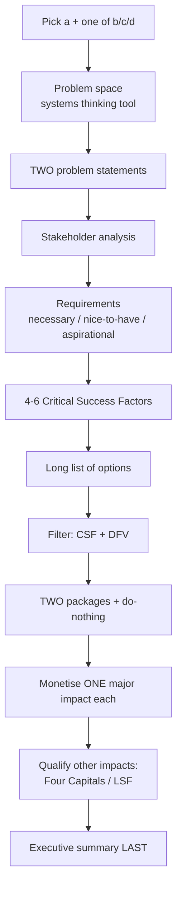

# 🚦 ENGGEN 403 Team Project — Speed Limits

**Team Overengineered · Project week 24–28 August 2026 · Due Friday 28 August, 5:00 pm**

> **New to this folder? Read this page, then [`team/ways-of-working.md`](team/ways-of-working.md). That's enough to start Monday.**

---

## The one-paragraph version

A road safety advocacy group lobbying the Minister of Transport has asked us for independent advice on speed limits in Aotearoa New Zealand. We separate **evidence** from the **values-driven debate** around it, identify **two specific problems** NZ must solve to manage traffic, work up a **long list of options**, and hand back a **shortlist of two packages plus do-nothing**. The advocacy group will likely pass our report to the Minister.

**We are not writing a research paper.** We are writing a business case.

---

## Deadlines and hard constraints

| | |
|---|---|
| **Due** | **Friday 28 August, 5:00 pm** |
| **Submit** | Canvas, **PDF, one submission per team** |
| **File name** | `[Team Number]_Team_Project_Report.pdf` |
| **Page limit** | **13 pages max** (includes charts and figures; excludes references, coversheet, table of contents) |
| **Appendix** | **5 pages max**, on top of the 13 |
| ⚠ | **Pages over the limit will not be assessed** |
| **Format** | A4 portrait (landscape OK for charts), **2.00 cm margins**, page numbers |
| **Font** | Easy-to-read (e.g. Verdana), **11 pt or bigger**, line spacing **1.15–2.0** |
| **Referencing** | **APA 7th**, in-text plus reference list |
| **Turnitin** | Yes |
| **Effort** | Estimated **8–10 hours per student** |
| **Clinic** | Teaching team available **10 am – 4 pm daily in 405-921** |
| **Questions** | Ed Discussions |

Cite the brief as: *"Team Project Brief, Speed limits, ENGGEN 403, 2026"*

---

## ⭐ The two things most teams get wrong

**1. The executive summary is worth 30%.** That is the same as the entire Strategic Case and the entire Economic Case. It is one page and it is worth as much as ten. It must be **stand-alone** — a reader who reads nothing else should be able to make a decision. Write it last, but budget real time for it. See [`brief/02-rubric-decoded.md`](brief/02-rubric-decoded.md).

**2. Justify what you cut, not just what you keep.** This has been said in three separate lectures. An options table with colour coding and no reasoning scores nothing. From L4: *"It looks great. It's pretty. It tells me absolutely nothing."* The rubric explicitly rewards *"brief justification of eliminated options"* and penalises *"options just disappear."*

---

## What we have to choose

The brief gives us **part (a), which is compulsory**, plus **exactly one** of b, c or d:

| | Topic |
|---|---|
| **a** ✅ compulsory | Economic versus social versus environmental impacts of speed limit increases |
| **b** | Speed limits in Europe and the UK — lessons for the New Zealand context |
| **c** | Technological solutions to traffic management in NZ — integrated so speed limits aren't the only tool |
| **d** | The interplay between implementation in urban, regional and rural areas |

**This is decision #1 on Monday.** See [`admin/decisions-log.md`](admin/decisions-log.md).

---

## Folder map

| Path | What's in it |
|---|---|
| [`brief/00-project-brief.md`](brief/00-project-brief.md) | The project decoded: background, government context, the task |
| [`brief/01-deliverables-spec.md`](brief/01-deliverables-spec.md) | **Every required section, and what each one must contain** |
| [`brief/02-rubric-decoded.md`](brief/02-rubric-decoded.md) | Where the marks actually are |
| [`brief/resources/`](brief/resources/) | The four original documents from Canvas |
| [`team/roster.md`](team/roster.md) | Sub-teams and leads |
| [`team/team-charter.md`](team/team-charter.md) | Our Team Canvas, typed up |
| [`team/ways-of-working.md`](team/ways-of-working.md) | **Tools, comms rules, meeting cadence** |
| [`working/`](working/) | Where the actual work goes, one file per report section |
| [`toolkit/methods-cheatsheet.md`](toolkit/methods-cheatsheet.md) | The ENGGEN 403 methods we need, in one page |
| [`admin/decisions-log.md`](admin/decisions-log.md) | Decisions made, so nobody relitigates them |
| [`admin/meeting-minutes/`](admin/meeting-minutes/) | Minutes, per the Team Canvas rule |

---

## The pipeline, end to end

Every arrow in that chain is assessed. If stakeholders don't produce the requirements, and requirements don't produce the CSFs, and the CSFs don't filter the long list, the marker can see the join is fake.

---

## Where this comes from in the course

The whole report is the **Better Business Case** framework from Lecture 4, minus the commercial and management cases. If you want the underlying material, it's in the lecture notes folder Johnson is sharing:

- **L4** — business cases, DFV, CSFs, long list to shortlist, packaging
- **L5** — social CBA, counterfactual, CBAx, monetising impacts
- **L6** — Living Standards Framework, four capitals, multi-criteria analysis
- **L7** — stakeholder analysis, salience model, requirements to CSFs
- **L8 / L9** — systems thinking tools, problem statements

[`toolkit/methods-cheatsheet.md`](toolkit/methods-cheatsheet.md) is the condensed version if you don't want to read all of it.
