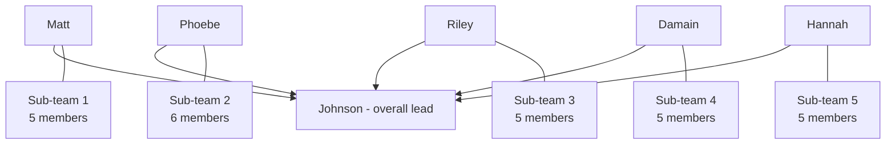

# 👥 Team Overengineered — roster

**Overall group lead:** Johnson (Runjia Zhang)
**Sub-teams:** 5 · **Members:** 31 + lead = **32**

> ⚠ **Team number is TBC.** We need it for the title page and the report filename (`[Team Number]_Team_Project_Report.pdf`). Someone confirm from Canvas.

---

## Sub-teams

### Sub-team 1 — Lead: **Matt**
Armani · Neekisha · Shanna · Jack · James

### Sub-team 2 — Lead: **Phoebe**
Tara · Angelique · Zara · Ivan · Zach · Jena

### Sub-team 3 — Lead: **Riley**
Jeno · Kelvin · Jun · Harry · Wayne

### Sub-team 4 — Lead: **Damain**
Aryan · Amir · Labor · Kosrat · Siva

### Sub-team 5 — Lead: **Hannah**
Kieran · Ivan Ko · Cuba · Scott · Liyuan

---

## Escalation path

Per the Team Canvas: **team leads check group understanding and pass to overall lead**, and **team leaders plus the overall lead discuss big decisions**.

**If you are blocked:** your sub-team lead first. If they can't unblock you, they escalate to Johnson. Don't sit on it — the project week is five days and a day lost is 20% of it.

---

## Known skills (from the Team Canvas)

**Individual**
- **Aryan** — video editing, presenting, pitching products
- **Cuba** — CAD

**Team-level**
- Data analysis · team collaboration · time management · prompt engineering

> **This list is thin for 32 people.** Sub-team leads: collect one line per member on day one — what they're good at and what they'd like to try. It feeds directly into who does what, and the Team Canvas already names *"diversify skillset between groups"* as a goal.

---

## ⚠ Please check before the coversheet goes in

The coversheet needs **last name, first name, UPI and student ID** for every member, in a table. That is 32 rows and it will take longer than anyone expects.

Also confirm the spellings — these came from a handwritten canvas and a typed list, and a few are uncertain:

| Name as recorded | Check |
|---|---|
| **Damain** | Canvas reads *Damion* / *Damian*. Which? |
| **Labor** | Unusual — confirm spelling |
| **Ivan** (sub-team 2) vs **Ivan Ko** (sub-team 5) | Two different people. Make sure they don't get merged in the coversheet |
| **Jeno** (sub-team 3) vs **Jena** (sub-team 2) | Similar, easy to confuse |
| **Neekisha** | Confirm spelling |

**Action:** each sub-team lead collects their own members' details and sends them to Johnson in one message. Do not have 32 people edit one table at once.
