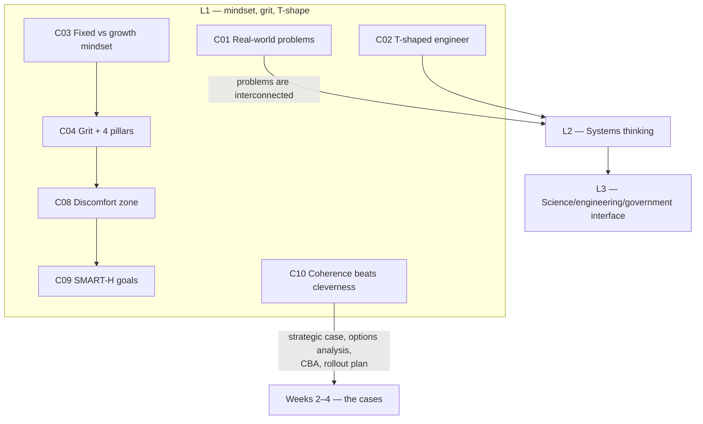

# ENGGEN403 — Syllabus map

How the lectures connect. L1 is ingested; L2 and L3 titles still come from resource filenames only, so treat them as provisional.

## Dependency graph

## Lecture index

| Lecture | Topic | Date | Status | Concepts | Feeds into |
|---|---|---|---|---|---|
| 1 | What can ENGGEN 403 do for me? — mindset, grit, T-shaped engineers | 21 Jul | **notes written, untested** | 10 (L1-C01…C10) | L2 (interconnected problems); the goal-setting assignment (C09); the case artefacts in weeks 2–4 (C10) |
| 2 | An introduction to systems thinking | 23 Jul | not started | 0 | — |
| 3 | Interface of science, engineering, and government — real world examples | 24 Jul | not started | 0 | — |

## Cross-cutting themes

- **Interconnection as the reason engineering alone is insufficient.** L1-C01's worked chain (AI/data centres → energy demand → prices → cost of living → unemployment) is set up explicitly as the entry point to systems thinking in L2. Expect L2 to formalise what L1 only gestured at.
- **Human factors as system inputs, not soft extras.** A student reflection quoted in L1 frames trust, communication and perceived professionalism as *inputs* to system success, and describes a communication style creating a *negative feedback loop* — systems-thinking vocabulary applied to teams, before the vocabulary has been taught.
- **The course is scaffolded toward Systems Week.** L1 states this outright: mindset and grit first, then systems thinking, then the case components, with the Team Project as a rehearsal. The discomfort zone (L1-C08) is the stated design justification.

## Named artefacts to watch for in later lectures

From L1-C10: **strategic case · options analysis · CBA metrics · rollout plan**. Also flagged in the course arc: management case, economic case, financial case, government context.
