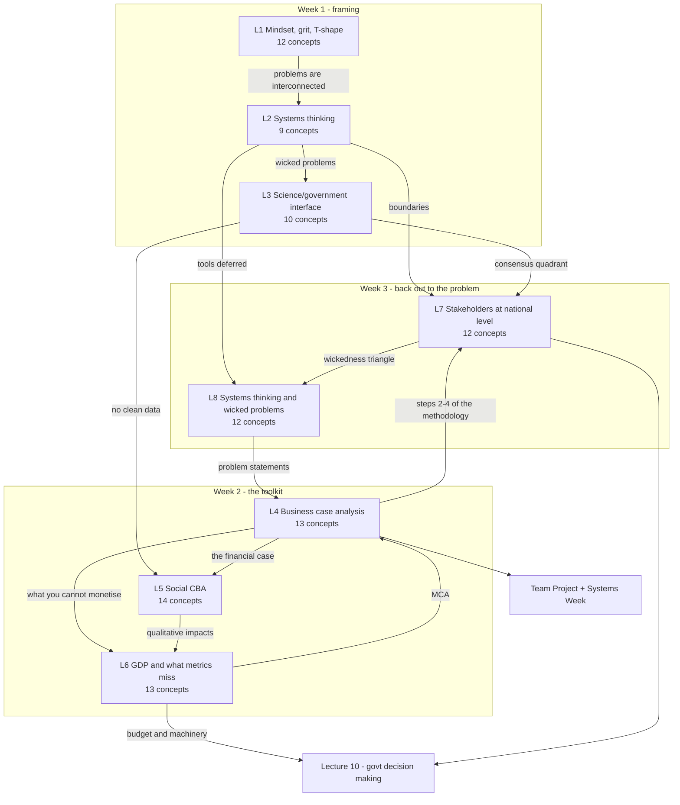

# ENGGEN403 - Syllabus map

Lectures 1-8 ingested. **95 concepts tracked, none yet tested.**

## Dependency graph

## Lecture index

| Lecture | Topic | Date | Lecturer | Status | Concepts | Feeds into |
|---|---|---|---|---|---|---|
| 1 | What can ENGGEN 403 do for me? - mindset, grit, T-shaped engineers | 21 Jul | Gerrard | **notes written, untested** | 12 (C01-C12) | goal-setting assignment; the honeycomb frames the whole course |
| 2 | An introduction to systems thinking | 23 Jul | Gerrard | **notes written, untested** | 9 | L3; L8; both projects |
| 3 | Interface of science, engineering and government | 24 Jul | Gerrard | **notes written, untested** | 10 | project framing and messaging; the fishing case is picked up in L7 |
| 4 | Business case analysis and options assessment | 28 Jul | **Lewis** | **notes written, untested** | 13 | the spine of the Systems Week deliverable |
| 5 | Social cost benefit analysis | 30 Jul | **Lewis** | **notes written, untested** | 14 | the financial case |
| 6 | GDP, government spending, and things that metrics miss | 31 Jul | **Lewis + Gerrard** | **notes written, untested** | 13 | the qualitative half of the financial case; MCA |
| 7 | Stakeholders at the national level | 4 Aug | **Di Ienno + Gerrard** | **notes written, untested** | 12 | the strategic case; CSFs |
| 8 | Systems thinking and wicked problems | 6 Aug | **Gerrard + Di Ienno** | **notes written, untested** | 12 | the first morning of Systems Week |
| 10 | Machinery of government, budgets, how decisions get made | - | Gerrard | not started | 0 | deferred to from L6 and L7 |

## The through-line

The course builds one argument in three movements.

1. **Weeks 1 (L1-L3) - the framing.** Real problems are not pre-framed, engineering alone will not close them, and you need a growth mindset and grit to stay in the discomfort where learning happens. Those problems have a name (**wicked**), a structure (**elements, interconnections, purpose**) and a critical decision (**the boundary**). The goal is **amelioration, not solution**. And even correct technical work fails without a **values consensus**.

2. **Week 2 (L4-L6) - the toolkit.** Marc Lewis hands over the machinery: the **Better Business Case** framework and options assessment (L4), **social CBA** for what can be monetised (L5), and the **Living Standards Framework, four capitals and MCA** for what cannot (L6). All three are Treasury tools and are designed to interlock.

3. **Week 3 (L7-L8) - back out to the problem.** Stakeholder analysis produces the **critical success factors** that the whole options assessment is scored against (L7), and systems thinking supplies the tools to frame a problem you cannot solve — **iceberg, leverage points, causal loops** (L8).

**L8 closes the loop back to L4**: the pattern layer of the iceberg is where **problem statements** come from, and the strategic case begins there.

## Cross-cutting themes

- **Engineering is necessary and insufficient.** L1 (T-shape, "doubling down on more hard sciences will not help"), L2 ("a useful skill set, but not the only skill set"), L3 (the gangs report was technically fine and still failed), and now sourced to the founder of the discipline in L8: **Jay Forrester** — *"the biggest impediment to progress comes, not from the engineering side… but from the management side."*
- ⭐ **"No right answer, only trade-offs" — and the justification is the assessed thing.** Stated three times in one week, by two lecturers, in three different tools:
  - **L4** on the DFV/CSF options matrix: *"It looks great. It's pretty. It tells me absolutely nothing."* A score of 17 vs 16 justifies nothing.
  - **L5** on CBAx: *"Gives exact dollar values, estimation unlikely to be that accurate (IMPORTANT FOR SYSTEMS WEEK)."* Understand the assumptions, not the number.
  - **L6** on MCA against the four capitals: *"Numbers not important, it's the justification behind the numbers."* Choose 17 over 16 without saying why and *"I'll put a big fat zero through your discussion."*
- **Justify both inclusion and exclusion.** L4's named gap in an otherwise strong exemplar; L6's observation that students are strong on positives and weak on negatives and trade-offs.
- **The boundary is the fight.** L2 introduces it, L7 shows it destroying a real project (*"out of scope were all the things that the stakeholders felt strongly about"*), L8 states it as a rule (*"as soon as you've drawn a boundary you're going to have tensions"*).
- **You will not get clean data.** L3-C05 (propagate the uncertainty), L5 (the assumptions behind CBAx figures), L7 (*"you don't know what the unfished volume is… put all those three in an equation and you can back up any argument"*).
- **Amelioration measures create new problems.** Defined in L2 and L8; demonstrated in L5 (plastics do-nothing at -$12 bn against a $16 m/yr recovery) and in L8's school-discipline causal loop (suspension balances one loop and drives another).
- **Political values finish the job.** L4 (business cases inform, politics decides), L5 (values or politics *"masquerading as a financial case"*), L6 (wellbeing provisions stripped from the Public Finance Act), L7 (the fisheries portfolio survived a change of government; the transformation plans did not).

## The honeycomb (L1-C12) as the course index

Twelve tiles: **Mindset-Grit** (wk 1) · **Systems Thinking** (wks 1, 3) · **Strategic / Economic / Financial Cases** (wk 2) · **Gov't Context, Management Case** (wk 4) · **Team Building** (wk 5) · **Team Project** (wk 6, dress rehearsal) · **Systems Week** + **McKinsey Workshop** (wk 7) · **Technical Know-How** (from your degree).

By end of L8: mindset/grit, systems thinking, strategic case, economic case and financial case are all covered. Gov't context and the management case are next.

## Terminology to lock down

**Framing:** wicked / complex / long problem · amelioration · elements, interconnections, purpose · emergence · boundary (in scope / out of scope) · consensus quadrant · social licence · T-shaped · grit · SMART-H

**Business case:** Better Business Case (strategic, economic, commercial, financial, management) · indicative → detailed → full implementation · off-ramp · programme business case · DFV · CSF · long list / shortlist / packages · do nothing / minimum / medium / maximum

**Economics:** NPV · BCR · IRR · counterfactual · benefits, disbenefits, costs, cost savings · VoSL ($12.5 M) · willingness to pay · WELLBY · CBAx · 8% discount rate · SOC and SRTP · 2 significant figures · GDP = C + I + G + (X−M) · PPP · productivity (GDP per hour worked)

**Wellbeing:** Living Standards Framework (12 domains, 6 spheres, 4 capitals) · natural / human / social / financial and physical capital · He Ara Waiora (wairua, Te Taiao, Te Ira Tangata; kotahitanga, tikanga, whanaungatanga, manaakitanga, tiakitanga) · MCA (+3 to −3)

**Stakeholders:** power / interest / legitimacy / urgency / attitude · salience (dormant, discretionary, demanding, dominant, dangerous, dependent, definitive, non-stakeholder) · RACI · necessary / nice-to-have / aspirational

**Systems tools:** VUCA · iceberg (events, patterns, structures, mental models) · levels of thinking · Head matrix (tame → very wicked) · twelve leverage points · balancing (B) and reinforcing (R) loops · causal loop diagram

## Open across the course

- **Nothing has ever been quizzed.** 95 concepts across 8 lectures. This is the single outstanding problem with this course's notes.
- **Reading: *Thinking in Systems*, Meadows** — first two chapters minimum, whole book strongly advised, ahead of the team project. Stated in L2 and again in L8.
- **Lecture 10** — machinery of government and budgets, deferred to from both L6 and L7.
- The **timeframe of analysis** for the social CBA was promised in L5 and never given (the exemplar uses 10 years).
- **Commercial fishing** was flagged as deferred in L3 and delivered in full in L7.
- Amanda promised a follow-up walking through past student causal loop examples (L8) — not yet located.
