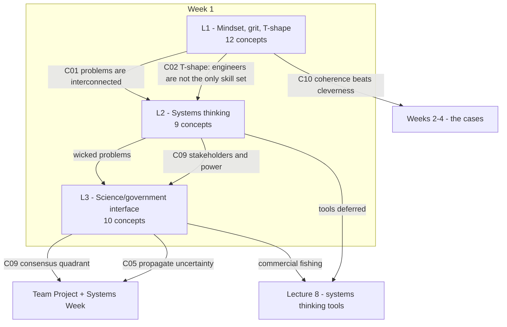

# ENGGEN403 - Syllabus map

Lectures 1-3 ingested. 31 concepts tracked, none yet tested.

## Dependency graph

## Lecture index

| Lecture | Topic | Date | Status | Concepts | Feeds into |
|---|---|---|---|---|---|
| 1 | What can ENGGEN 403 do for me? - mindset, grit, T-shaped engineers | 21 Jul | **notes written, untested** | 12 (C01-C12) | goal-setting assignment; the honeycomb frames the whole course |
| 2 | An introduction to systems thinking | 23 Jul | **notes written, untested** | 9 (C01-C09) | L3; Lecture 8 tools; both projects |
| 3 | Interface of science, engineering and government | 24 Jul | **notes written, untested** | 10 (C01-C10) | project framing and messaging |
| 4 | Business cases, CBA (Mark) | - | not started | 0 | - |
| 8 | Systems thinking tools, intervention points | - | not started | 0 | - |

## The through-line

The three ingested lectures build one argument, in order:

1. **L1** - real problems are not pre-framed, engineering alone will not close them, and you need a growth mindset and grit to stay in the discomfort where learning happens.
2. **L2** - those problems have a name (**wicked**), a structure (**elements, interconnections, purpose**), and a critical decision (**the boundary**). The goal is **amelioration, not solution**.
3. **L3** - even correct technical work fails if the **values consensus** is not there. The **consensus quadrant** predicts whether advice will land, and tells you what to do when it will not.

## Cross-cutting themes

- **Engineering is necessary and insufficient.** Stated in L1 (T-shape, Miller: "doubling down on more hard sciences will not help"), restated in L2 ("as engineers you will have a useful skill set, but not the only skill set"), and demonstrated in L3 (the gangs report was technically fine and still failed).
- **Discomfort is the calibration signal.** L1-C08: "just hard enough but not too hard." L2: "if it's not making your head hurt, you're not thinking about it hard enough." Same claim, two lectures.
- **Human factors are system inputs, not soft extras.** L1 student reflections used systems vocabulary (inputs, negative feedback loops) applied to teams before that vocabulary was taught in L2; L3 makes power dynamics decisive for whether recommendations land.
- **You will not get clean data.** L3-C05 is a direct instruction about the project deliverable: state your confidence and propagate the uncertainty.

## The honeycomb (L1-C12) as the course index

Twelve tiles: Mindset-Grit (wk 1) - Systems Thinking (wks 1, 3) - Strategic/Economic/Financial Cases (wk 2) - Gov't Context, Management Case (wk 4) - Team Building (wk 5) - **Team Project** (wk 6, dress rehearsal) - **Systems Week** + McKinsey Workshop (wk 7) - Technical Know-How (from your degree).

## Terminology to lock down

**wicked / complex / long problem · amelioration · elements, interconnections, purpose · boundary (in scope / out of scope) · emergent property = purpose · systems methodology · consensus quadrant (scientific x values) · social licence · T-shaped · grit (passion + perseverance over sustained time) · SMART-H**

## Open across the course

- Marshmallow test / Dunedin study attribution (L1-C06)
- Rittel & Webber 1973 - the ten characteristics of wicked problems were never listed (L2-C01)
- Commercial fishing, flagged as the hardest consensus-quadrant case, deferred (L3-C09)
- Required reading: *Thinking in Systems*, first two chapters, ahead of Lecture 8
