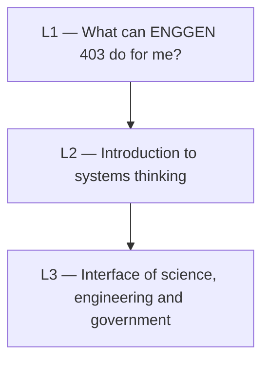

# ENGGEN403 — Syllabus map

How the lectures connect. Built up as lectures are ingested — titles below come from the resource filenames only, not from reading the material, so treat them as provisional until the lecture is actually ingested.

## Dependency graph

*Edges above are sequence, not verified conceptual dependency. Replace once ingested.*

## Lecture index

| Lecture | Topic (provisional, from filename) | Date | Status | Concepts | Feeds into |
|---|---|---|---|---|---|
| 1 | What can ENGGEN 403 do for me? | 21 Jul | not started | 0 | — |
| 2 | An introduction to systems thinking | 23 Jul | not started | 0 | — |
| 3 | Interface of science, engineering, and government — real world examples | 24 Jul | not started | 0 | — |

## Cross-cutting themes

*None identified yet — needs at least two ingested lectures.*
