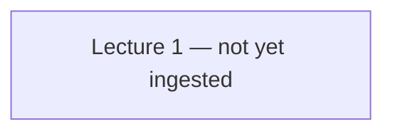

# SE731 — Syllabus map

How the lectures connect. Built up over time as lectures are ingested — do not pre-populate from guesswork about the course outline.

## Dependency graph

## Lecture index

| Lecture | Topic | Status | Concepts | Feeds into |
|---|---|---|---|---|
| 1 | — | not started | 0 | — |

## Cross-cutting themes

*None identified yet — needs at least two ingested lectures.*
