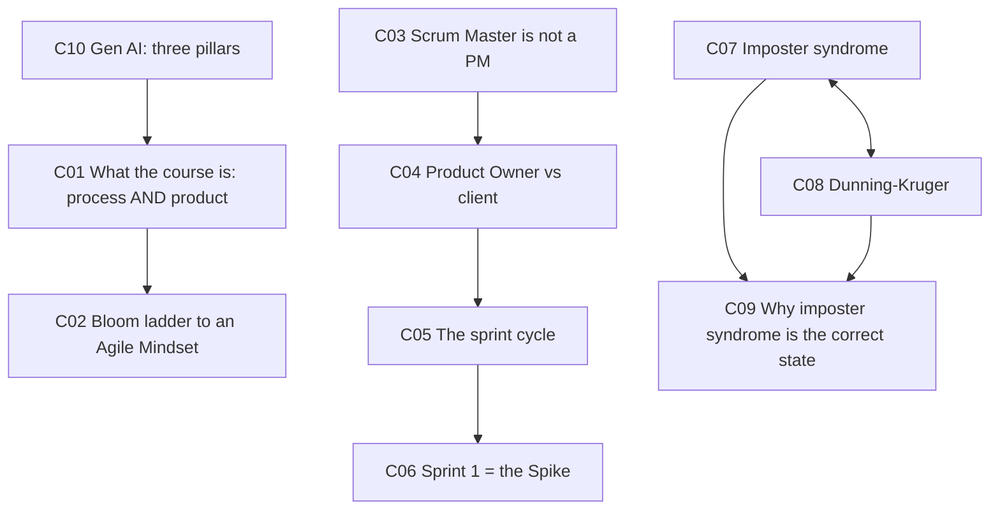
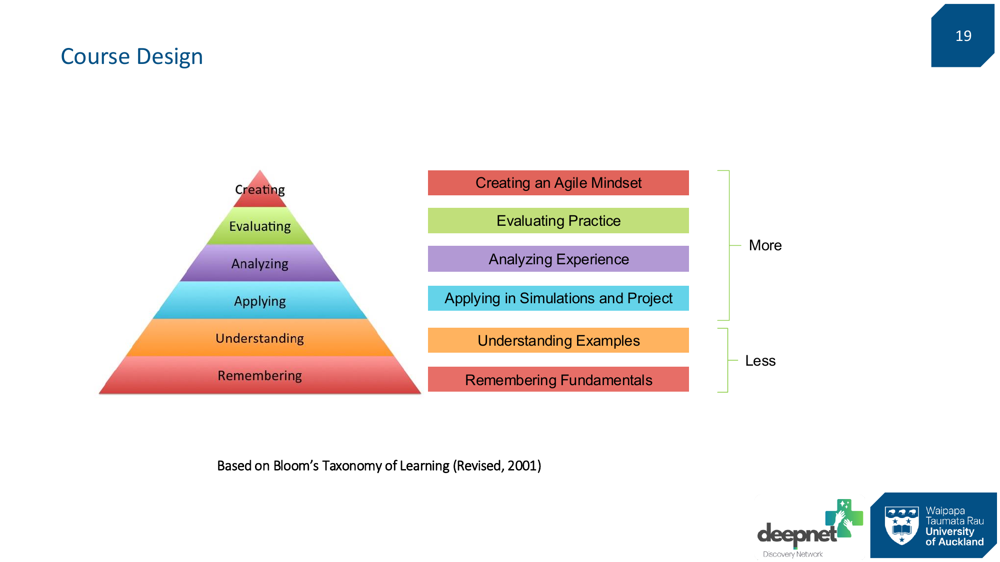
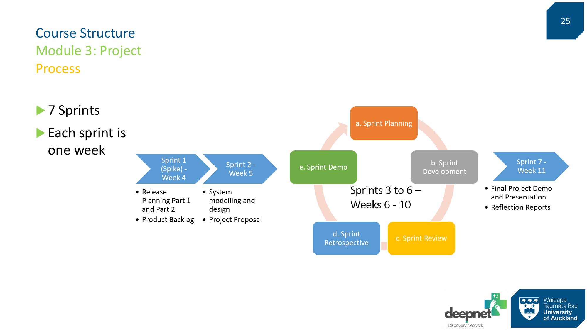
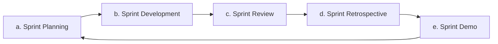
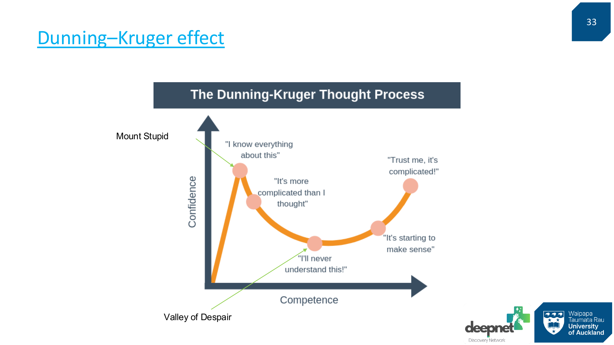

# 🚀 SOFTENG 761 Lecture 1 — Course Introduction

> [!abstract] Why this matters
> Mostly a course-overview lecture — and most of it is administration, which is quarantined in `context/admin-and-dates.md`. But four things in it are genuinely conceptual and will be assessed or lived: **what a Scrum Master actually is** (and isn't), **the sprint cycle**, **the Gen AI responsibility pillars**, and the pairing of **imposter syndrome with the Dunning–Kruger effect** — which is the lecturer's argument for why feeling out of your depth is the correct state to be in.

> [!info] Sources
> **Slides:** `00-Agile_Course_Introduction.pdf` — 40 pages, text layer present.
> **Transcript:** ~1,350 lines, auto-generated. Quality **poor** — it mangles nearly every proper noun (see `admin-and-dates.md`).
>
> ⚠️ **Slide footer numbers run one behind PDF page indices.** Figures below cite the *printed slide number*.

> [!warning] This deck is ~75% administration
> Teaching team, contact routes, room bookings, prerequisites, deliverable weightings, the week-by-week schedule, GitHub setup, and academic-integrity policy are all **noise** under §3.2 and live in `context/admin-and-dates.md`. None of it is quizzable. Only 10 concepts survived the filter.

## 🗺 Concept map

---

## 🎓 L1-C01 · What this course assesses: process *and* product

> [!question] Cue questions
> - Name the two things assessed. Why isn't "it works" sufficient?
> - What is the stated best way to learn Agile?

### In plain language

Delivering software that runs is only half the mark. The other half is *how you got there* — whether you actually followed the process week by week. A working product built chaotically scores badly.

### Precisely

> [!quote] The lecturer
> "The best way to learn how to do agile is **to do it**."

**Two assessment axes**, stated explicitly:

1. **How well you followed the process** — the sprint/Scrum process and weekly deadlines.
2. **The quality of your product** — plus its **feature richness and complexity**, judged as adequate for eight developers over the available time.

> [!important] The explicit rejection of "it works"
> *"It's not that your product works and at the end of your course you deliver a product that works. That's not the only requirement. It's the process that you followed and the quality of your product."*

**Focus of Agile and Lean, per the slides:** process and practices, **self-organizing teamwork**, and project management, to deliver high-quality software products.

**Framing:** a software engineering **capstone** — it covers the entire lifecycle from requirements elicitation and specification through to deployment. And the standard applied:

> [!quote]
> "We are not looking at you as a student anymore. We look at you as **professional software developers**, so our expectation is that you deliver professional software."

*📄 Source: slides 16–18 · transcript — course expectations section*

---

## 📊 L1-C02 · Course design — the Bloom ladder to an Agile Mindset

> [!question] Cue questions
> - Name the six Bloom levels in order. Which does this course weight most heavily?
> - What sits at the very top, and why is that the target rather than "knowing Agile"?

### Precisely

Based on **Bloom's Taxonomy of Learning (Revised, 2001)**. The six levels, mapped onto course activities:

| Bloom level | Course activity | Weight |
|---|---|---|
| **Creating** | **Creating an Agile Mindset** | 🔺 More |
| **Evaluating** | Evaluating Practice | More |
| **Analyzing** | Analyzing Experience | More |
| **Applying** | Applying in Simulations and Project | More |
| Understanding | Understanding Examples | 🔻 Less |
| Remembering | Remembering Fundamentals | Less |

> [!important] Read the weighting, not just the ladder
> The bracket on the slide marks the **top four** levels as "More" and the bottom two as "Less". This course deliberately puts most of its weight above Understanding.
>
> The lecturer: this is *"the course that sits on the higher scales of the pyramid — about **creating an agile mindset** and applying your knowledge into practice."*
>
> The target is a **mindset**, not knowledge of Agile. That's why 80% of the mark is a project and there is no final exam.

*📄 Source: slide 19 · transcript — learning objectives section*

---

## 🏃 L1-C03 · The Scrum Master is *not* a project manager

> [!danger] `priority: high` — the single most emphatic conceptual correction in the lecture

> [!question] Cue questions
> - What does a Scrum Master actually do?
> - What follows about team structure?

### In plain language

The Scrum Master isn't the boss. They don't assign work or own the plan. Their job is to make sure the team actually does Agile properly — they're a guardian of the process, not a manager of people.

### Precisely

> [!quote] Stated twice, both times emphatically
> "Scrum Master is **not** a project manager."
> "A Scrum Master is not your project manager. **Agile teams are self-managed. There is no team lead or anything.**"

**What the role is instead:** *"somebody who champions agile principles and ensures that they are actioned and realised during the project."*

> [!note] Consequences drawn
> - **Self-management is the default.** No team lead exists. Follows directly from the "self-organizing teamwork" in [[#🎓 L1-C01 What this course assesses process and product|C01]].
> - **Extra responsibilities, not authority.** The Scrum Master maintains the weekly member participation report.
> - **Expected to code less** during the project — the process work is real work.
> - **Selection guidance:** prefer someone with Agile experience; failing that, someone with real industry development experience.

> [!warning] Common trap
> Treating the Scrum Master as the person who "runs" the team. In a self-managed team there is nobody to run it — that's the design, not an oversight.

*📄 Source: slide 23 · transcript — Scrum Master section*

---

## 👤 L1-C04 · Product Owner vs client — and what happens when they vanish

> [!question] Cue questions
> - In prescribed Agile, what is a Product Owner? How does this course deviate?
> - What do you do if the PO becomes unreachable?

### In plain language

In textbook Scrum the Product Owner is a technical person inside the business who decides what gets built next. Here, that role is fused with the actual client — often someone with no software background at all. So part of your job becomes translation.

### Precisely

| | Prescribed Agile | This course |
|---|---|---|
| Product Owner | A software developer | **Combination of Product Owner and client** |
| Technical background | Assumed | *"A lot of our product owners do not know anything about software development"* |
| Your obligation | Take direction | Also **explain terminology and walk them through expectations** |

> [!quote] The lecturer
> "A product owner is **not exactly a client**, but because of the restrictions that we have in this course, product owners are clients as well."

**What the PO does:** brings in the requirements, and **decides each week which features you should implement**.
**What you do:** *"help them to find what they need and also to help them prioritise the features."*

> [!important] The rule when the PO disappears
> *"There could be situations that your product owners become inaccessible. If that happens, you should **continue with your project** as you agreed previously, or as you see fit. The one thing that you **cannot** do is stop the project."*
>
> **Every week you must produce a new version of your software, whether your product owner was available or not.**

> [!tip] Connects forward
> This is the same client/PO/user distinction covered again in [[../../Lecture2/notes/L2-notes|Lecture 2]] (L2-C08), and it's the receiving end of the says→wants→needs journey (L2-C05) — the PO is the person you run that journey *on*.

*📄 Source: slide 22 · transcript — project section*

---

## 🔄 L1-C05 · The sprint cycle

> [!danger] `priority: high` — the five ceremonies are core Scrum vocabulary

> [!question] Cue questions
> - Name the five sprint activities in order.
> - How long is a sprint, and is it negotiable?

### Precisely

**7 sprints. Each sprint is one week — fixed.** *"That's a fixed term. You cannot change the sprint time. It's one week fixed. End of the sprint: a new software."*

**The five-activity cycle**, repeated each sprint:

**The seven sprints:**

| Sprint | Week | Content |
|---|---|---|
| **1 — Spike** | 4 | Release Planning Parts 1 & 2; compile the **Product Backlog** |
| **2** | 5 | System modelling and design; Project Proposal |
| **3–6** | 6–10 | The full five-activity cycle, each ending in a Sprint Demo |
| **7** | 11 | Final Demo and Presentation; Reflection Reports |

> [!warning] Sprint 7 is not a development sprint
> *"You should not use it as a complete development sprint… It's just polishing."* Part IV project final reports are usually due the same week. Planning to build anything substantial in Sprint 7 is a scheduling error.

*📄 Source: slide 25 · transcript — sprint process section*

---

## 🔍 L1-C06 · Sprint 1 is a Spike

> [!question] Cue questions
> - What is a Spike, and what makes it the exception to the weekly-delivery rule?

### In plain language

The first sprint is for finding out, not for shipping. It's the one week where you're allowed to end with no new software — because you're deciding what you're even going to build it with.

### Precisely

> [!quote]
> "Sprint one, starting officially on week four, is called a **Spike**. That is the **only sprint** that you don't necessarily need to produce a new software."

**What the Spike is for:** understanding what you need to do; deciding on the back end, the technologies, database technologies.

**What it must still produce:**
- **Release Planning** Part 1 and Part 2
- The **Product Backlog** — *"the list of the features that the software should deliver"*

> [!tip] The backlog link
> This is exactly where [[../../Lecture2/notes/L2-notes|Lecture 2]]'s says→wants→needs journey terminates. L2 tells you the backlog is what *needs* become; L1 tells you it's produced in the Spike.

*📄 Source: slide 25 · transcript — sprint one section*

---

## 😰 L1-C07 · Imposter syndrome

> [!question] Cue questions
> - Define it. What is the lecturer's claim about how common it is?
> - What concrete strategy is offered?

### In plain language

The feeling that you don't belong and someone's about to find out. On a real project you will feel it, because a real project starts with you genuinely not knowing how to do it.

### Precisely

> [!quote] From the video shown (Udacity)
> "Imposter syndrome is the feeling that you're a fake and somehow you snuck in and you don't deserve to be where you are."
>
> "The only person expecting me to fail is myself."
>
> "The best people I know learn to live with uncertainty, fear, doubt, confusion… and they just plough right ahead."

**The lecturer's claim about prevalence:** *"It's completely normal. In fact, if you don't experience imposter syndrome, that's **abnormal**. Every time I start a new project — it doesn't matter how many times I did it — I still face imposter syndrome."*

**Reframe offered:** it means *"there's a ton of information coming your way… you're just overwhelmed."* The feeling is a signal of volume, not of inadequacy.

> [!example] The strategy — do the simplest thing
> *"The way I find to deal with it is: I do the **simplest thing** that I can do right away. Maybe it's just design a simple UI, and then start programming this button, and then that text box."*
>
> **The puzzle model:** *"A project is a puzzle. At the beginning it's all scrambled and there is no guide in front of you. But **every piece of the puzzle that you put in place opens up opportunities to solve the rest**."*
>
> Why it works: *"once you finish that simple task, you know more compared to before you completed it."* Progress is what generates the information you were missing — you can't think your way to it first.

*📄 Source: slide 31 · transcript — imposter syndrome video and commentary*

---

## 📉 L1-C08 · The Dunning–Kruger effect

> [!question] Cue questions
> - State the effect. Name the two landmarks on the curve.
> - Why does the *good student* stay quiet in the debate example?

### In plain language

When you know almost nothing about something, you often feel most sure of yourself — because you don't yet know enough to see what you're missing. Learn more and your confidence *falls*, because now you can see the size of the problem. Keep going and it climbs back, but this time it's earned.

### Precisely

> [!example] The origin story
> On **19 April 1995**, **MacArthur Wheeler** robbed a bank with his face covered in **lemon juice**, believing it would make him invisible to cameras — reasoning that lemon juice works as invisible ink on paper. Police broadcast the footage; he was arrested just after midnight. His response: *"But I wore the juice."*
>
> **David Dunning** and **Justin Kruger** studied Wheeler and others like him.

**The finding:** *"People with low ability at a task tend to **paradoxically overestimate** themselves."* A cognitive bias.

**The curve** — confidence (y) against competence/knowledge (x):

| Stage | Internal monologue | Landmark |
|---|---|---|
| Just started | *"I know everything about this"* | 🏔 **Mount Stupid** |
| Learning begins | *"It's more complicated than I thought"* | ↓ descending |
| Deep in it | *"I'll never understand this!"* | 🕳 **Valley of Despair** |
| Recovering | *"It's starting to make sense"* | ↗ climbing |
| Competent | *"Trust me, it's complicated!"* | earned confidence |

> [!important] Two traps on the curve
> - *"Those who **stop learning here** maintain a false sense of mastery"* — you get stranded on Mount Stupid by quitting early.
> - *"Many stop at this stage thinking they've learned nothing"* — the Valley of Despair feels like failure but is actually evidence of progress.

> [!quote]- The debate illustration (click to expand)
> If a **simpleton**, a **good student** and a **wise teacher** publicly debate:
> - The **simpleton** knows little but is very confident, and voices opinions loudly without hesitation.
> - The **student** knows more but doesn't realise it, lacks confidence, and **keeps quiet**.
> - The **teacher** is confident but understands how complex things are, so voices opinions **with reservations**.
>
> **The simpleton wins the popular vote** — *"because he is so confident about being right, and people tend to trust certainty."*
>
> **Cultural variation:** 93% of Americans think they're better-than-average drivers, vs 69% of Swedes. In Japan people tend to *underestimate* their abilities, treating underachievement as an opportunity to improve.
>
> **Socrates:** *"I know that I am intelligent because I know that I know nothing."*

*📄 Source: slides 32–33 · transcript — Dunning–Kruger video and commentary*

---

## 🎭 L1-C09 · Why imposter syndrome is the *correct* state

> [!danger] `priority: high` — this is the integrative point the two previous concepts exist to set up

> [!question] Cue questions
> - How do imposter syndrome and Dunning–Kruger relate?
> - What should you conclude if you start a project feeling confident?

### In plain language

The two are opposite ends of the same axis. Feeling like a fraud means you've seen how hard the problem is. Feeling great means you might not have looked yet.

### Precisely

> [!quote] The lecturer's argument, verbatim
> "If you start the project and you **don't** feel imposter syndrome, you should be **worried**. Because that means that either you didn't understand the project well, or you don't have enough knowledge to understand what lies ahead."
>
> "If you know [the problems ahead], then you end up with imposter syndrome. **So that's why imposter syndrome is good and you should expect it.** If you don't expect it, maybe you are getting stuck on Mount Stupid."

His summary of the two states:

| | Imposter syndrome | Dunning–Kruger |
|---|---|---|
| Verdict | *"normal, completely fine, nothing wrong with it"* | *"completely wrong"* |
| What it indicates | You can see the size of the problem | You can't see it yet |
| Where on the curve | Valley of Despair (or descending toward it) | Mount Stupid |

**The closing generalisation:** *"No one knows everything about everything. Even the designer of a programming language does not know everything about that programming language."*

> [!tip] Diagnostic you can actually use
> Starting a sprint feeling *comfortable* is a signal to go and look harder at the problem — not a signal that you're ready.

*📄 Source: transcript — Dunning–Kruger commentary*

---

## 🤖 L1-C10 · Generative AI — the three pillars

> [!danger] `priority: high`

> [!question] Cue questions
> - State the three pillars.
> - What is a "black box" excuse, and why is it rejected in *engineering* terms?
> - What is AI reportedly good and bad at?

### In plain language

You're allowed to use AI. You are not allowed to hide it, and you are not allowed to not understand what it produced. If you can't explain a line of code in your repo — whoever or whatever wrote it — you're marked as not understanding it.

### Precisely

Both modules operate under the **Two-Lane Approach** to assessment, as **Lane 2: uncontrolled assessment** — i.e. AI use to assist students is permitted.

### The three pillars (Module 3 / project)

> [!important] Pillar 1 — Disclose
> *"If GenAI contributed significantly to a code block or a section of your report, you must disclose it. Failure to disclose the use of these tools is considered academic dishonesty and will be investigated as plagiarism."*
> Practically: add a comment on the function.

> [!important] Pillar 2 — 100% responsibility, individually
> *"Every student is **100% responsible** for every line of code and every paragraph in the report, **regardless of which student is the original author**. During your presentation and Q&A, if you cannot explain any materials or code blocks — even if 'inspired' by AI or developed by another team member — you will be graded as if you do not understand the material."*
>
> **The key sentence:**
> > A "black box" excuse (e.g., "The AI suggested this") is **not an acceptable engineering justification.**
>
> Note the framing — it's not primarily an integrity rule, it's an *engineering* one. An explanation you cannot give is an explanation you do not have.

> [!important] Pillar 3 — No AI-authored deliverables
> *"Using AI to generate complete code, or copying pre-existing code from a prompt, is prohibited; the project will receive a **zero mark**. Any report or app found to be primarily 'AI-authored' (where the student acted mostly as a copy-paster) will receive a mark of zero and may result in formal disciplinary action."*

### The practical claim about AI code quality

> [!quote] The lecturer
> "AI does a very terribly bad job in producing good quality code… **It's very good with UI. It's very bad with backend code. It does not understand quality.**"

**Required workflow if you use it:**
1. **Refactor** the generated code and put it in the proper structure.
2. Run it through a **peer review process** before it reaches the default branch.
3. If quality is inadequate, **return it to the developer** to improve.

> [!warning] Why the quality point has teeth
> Code quality feeds the **holistic** score, so poor quality doesn't just cost the 15 code-quality marks — it drags the whole project mark down. See `admin-and-dates.md`.

*📄 Source: slides 36–39 · transcript — Gen AI sections*

---

## ✅ Summary — the 7 things that matter

1. **Two assessment axes: process followed, and product quality/feature richness.** "It works" is explicitly insufficient.
2. **The course targets the top of Bloom** — *Creating an Agile Mindset*, not remembering Agile.
3. **Scrum Master ≠ project manager.** They champion Agile principles; **Agile teams are self-managed, with no team lead.**
4. **Here, Product Owner = client**, often non-technical — so you must translate. If they vanish, **you never stop**; a new version ships weekly regardless.
5. **7 one-week sprints**, cycle: Planning → Development → Review → Retrospective → Demo. **Sprint 1 is a Spike** (no software required; produces release planning + product backlog). **Sprint 7 is not a development sprint.**
6. **Imposter syndrome is the correct state**; its absence suggests Mount Stupid. Strategy: do the simplest thing — each piece of the puzzle reveals the next.
7. **Gen AI: disclose it, own it 100%, never let it author the deliverable.** A "black box" excuse is not an acceptable engineering justification. AI is good at UI, bad at backend quality.

---

## 🧪 Self-test

> [!question]- 10 free-recall questions
> 1. Name the two axes on which the project is assessed. Why is a working product insufficient?
> 2. Where does this course sit on Bloom's taxonomy, and what is at the apex?
> 3. A teammate says "the Scrum Master should assign us our tasks." Correct them, and state what follows about team structure.
> 4. How does a Product Owner in this course differ from one in prescribed Agile? Name two obligations that difference creates for you.
> 5. Your PO stops replying to emails in week 7. What do you do, and what must still happen?
> 6. List the five sprint activities in order.
> 7. What is a Spike, why is it exempt from weekly delivery, and what two artefacts must it still produce?
> 8. Describe the Dunning–Kruger curve and name its two landmarks.
> 9. You start a project feeling confident and comfortable. Using both C07 and C08, explain why that's a warning sign.
> 10. State the three Gen AI pillars. Explain why the "black box" objection is framed as an *engineering* failure rather than an integrity one.

---

> [!info]- Related notes
> - `L1-summary.md` · `L1-flashcards.tsv`
> - `../context/admin-and-dates.md` — the ~75% of this deck that is administration
> - [[../../Lecture2/notes/L2-notes|Lecture 2 — From Idea to Rationale]]
> - `../../course-context/syllabus-map.md`
