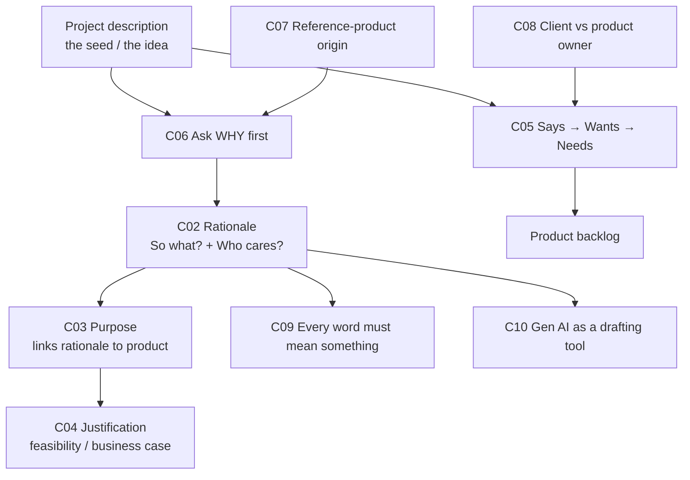
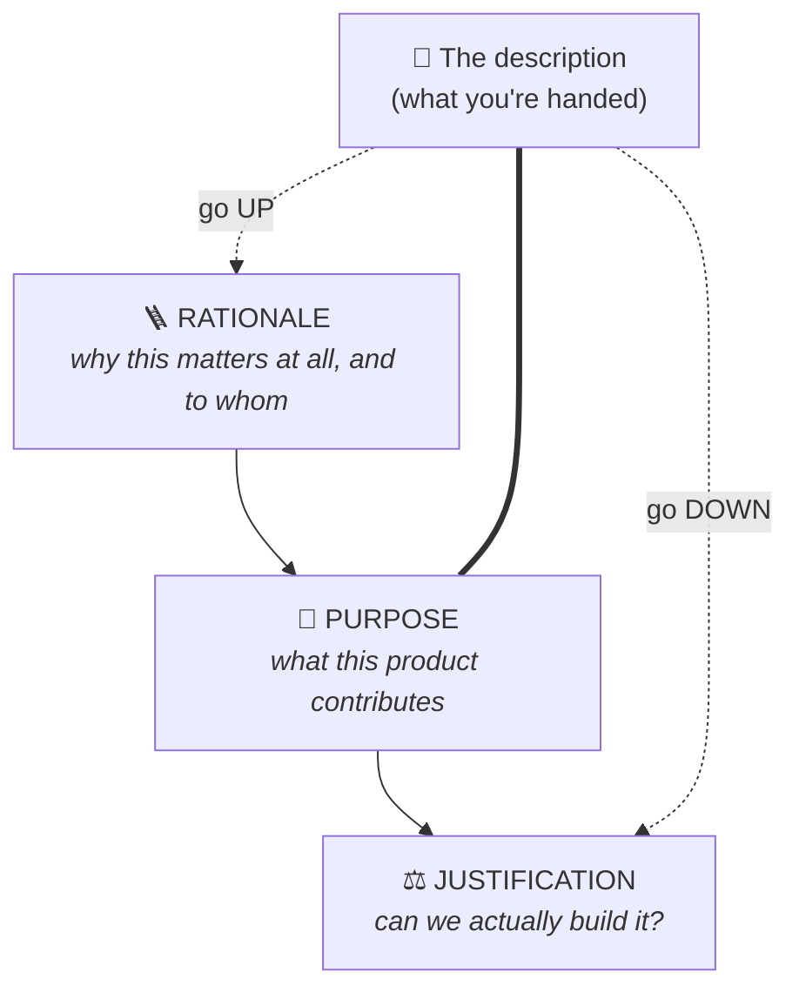
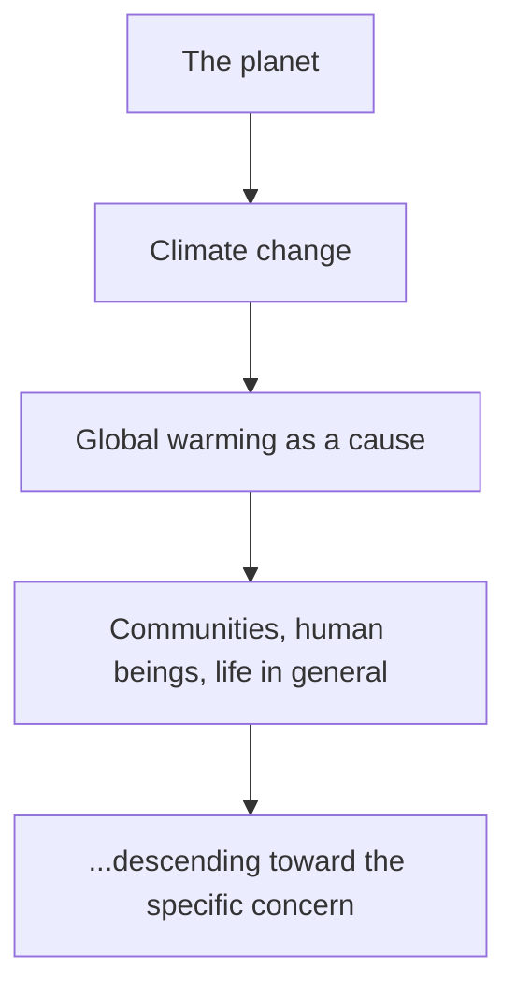
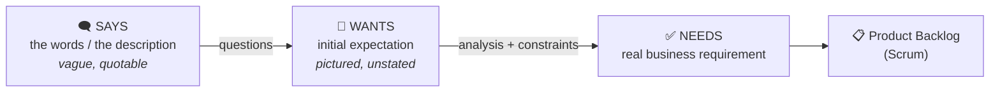
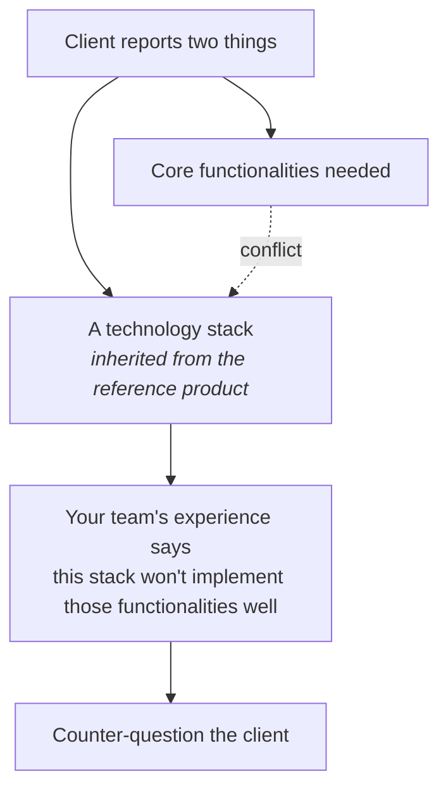
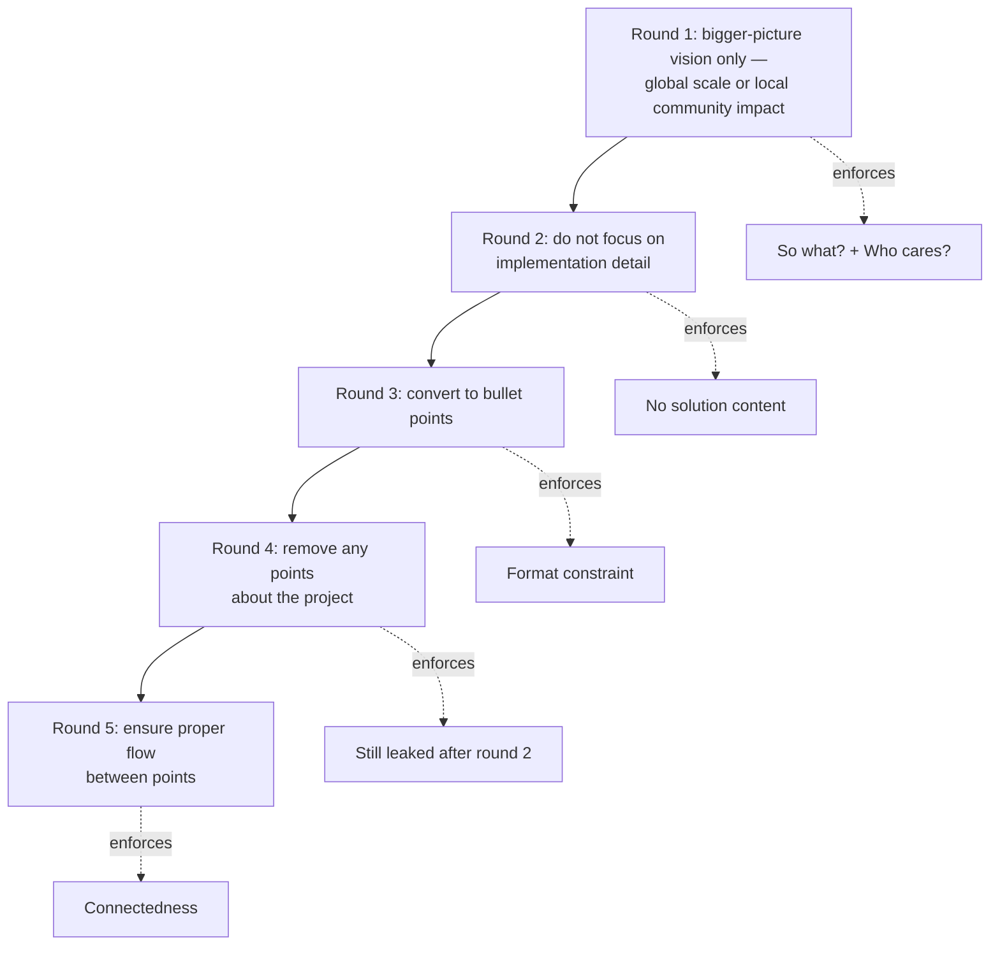

# 🌱 SOFTENG 761 Lecture 2 — From Idea to Rationale

> [!abstract] Why this matters
> After this lecture you can take a three-sentence project description and work **upwards** to a high-level rationale and **downwards** to a feasibility justification — and you can tell the difference between what a client *said*, what they *pictured*, and what they actually *need*.
>
> Everything in Assignment 1 comes from this, and the says→needs journey is what eventually produces your **product backlog**.

> [!warning] Unusual source situation — read this before trusting anything below
> **No slide deck exists for this lecture.** The normal hierarchy is inverted: the **transcript is primary** for reasoning and emphasis, and the three **Canvas pages** under Modules 1 & 2 carry the precise wording you'll be marked against. Both are recorded below, and they are labelled where they differ.
>
> **No figures could be extracted.** There is no deck to rasterise, and the Canvas pages are plain prose with no diagrams. Every diagram below is therefore **mine, not the lecturer's** — built per CLAUDE.md §3.3a, which permits generated diagrams only where the source has no figure for that relationship. Do not reproduce them in an assessment as though they came from the course.
>
> **Transcript quality is only fair.** Auto-generated, and it garbles at least one term that matters. Flagged inline as `⚠ transcription uncertain`.

> [!info] Sources
> **Transcript:** `[405-422]_SOFTENG_761_Lecture_2 — Wed 22 Jul`, 452 lines.
> **Canvas:** `canvas-modules-1-and-2-pages.md` in `resources/` — fetched 2026-07-26 from the live course.
> *Prerequisites: [[../../Lecture1/notes/L1-notes|Lecture 1]] — team formation, project allocation, and the client/Product Owner fusion (L1-C04).*

> [!tip]- Revision order (click to expand)
> Short on time? **[[#🪜 L2-C02 Rationale — So what? and Who cares?|C02]] → [[#🎯 L2-C03 Purpose — the link between rationale and product|C03]] → [[#🗣 L2-C05 Says vs Wants vs Needs|C05]]**. C02 *is* Assignment 1; C03 is where people lose marks by overclaiming; C05 has its own formative Canvas quiz.

## 🗺 Concept map

---

## 🔭 L2-C01 · The pipeline: idea → rationale → purpose → justification

> [!danger] `priority: high`

> [!question] Cue questions
> - What is the single input you start from, and what three things do you build from it?
> - Which direction do you travel for each?

### In plain language

You get handed a few sentences describing a project. That's a **seed**, not a specification. Before building anything you go *up* from it — why does this matter at all, who benefits — and then come back *down* — can we actually do this with the people, money and time we have. The product sits in the middle, and you deliberately don't think about it until the top and bottom are settled.

### Precisely

The Canvas page **"Contents of Module 1 and 2"** lists three topics — *From Idea to Rationale*, *Agile*, *Scrum and Kanban*. **Only the first was taught**; the other two were deferred to the following week.

The starting point is the **project description** you receive on allocation. The lecturer's terms for it: *"just an idea"*, *"one seed"*.

> [!warning] It is not an intro-programming brief
> *"It is not about what you used to see in the introductory programming courses where there was a one-liner — write a program that checks whether this string is a palindrome. It is about a **full software product which must be working and of high quality**."*

### Direction of travel

| Artefact | Direction from the description | What it establishes |
|---|---|---|
| **Rationale** | **Up** — to the bigger picture | Why the problem matters at all, and to whom |
| **Purpose** | Stays **closest** to the description | The relationship between rationale and this specific product |
| **Justification** | **Down** — to resources | Whether building it is feasible; the business case |

> [!quote] The instruction, verbatim
> "You need to **go up to the rationale and go down to the justification**."
>
> And on locating the description itself: *"the purpose will be the **closest thing to the description** that you have been given from the client."*

> [!important] The rule that trips people up
> **"Do not directly jump to what needs to be built."**
>
> *"You must always think that I need to be **fully convinced** in order to start working on the project."*

> [!warning] Common traps
> - Treating the description as a requirements document. It's a seed.
> - Reaching for the solution first. The whole point of the ordering is that the product is decided **last**.

*📄 Source: transcript — opening and rationale sections · Canvas "Contents of Module 1 and 2"*

---

## 🪜 L2-C02 · Rationale — "So what?" and "Who cares?"

> [!danger] `priority: high` — this **is** Assignment 1

> [!question] Cue questions
> - Define rationale in one sentence. What two questions generate it?
> - State the three formal constraints on the bullet points.
> - Why is mentioning the product a *failure* here, not a stylistic preference?

### In plain language

The rationale answers "why is this worth anyone's time?" — and it has nothing to do with your software. You build it by asking two things repeatedly: **so what** (why does this matter, what changes) and **who cares** (who is actually affected). Then you arrange the answers in a ladder, widest concern at the top, narrowest at the bottom, each rung resting on the one above.

### Precisely

> [!quote] Canvas page — the formal wording
> "The rationale explains the **broader context and underlying need** that gives rise to the project."

> [!quote] The lecturer's spoken version
> "A kind of way to get to **the root of the things**… you want a reason for it. You must have a goal or a motivation. Then only will you be encouraged to put more effort into it."

### The two generating questions

| Question | What it asks | Example answers |
|---|---|---|
| **So what?** | *"What difference is it going to make? Why is it important to build this project?"* | — |
| **Who cares?** | *"If this software project is done… who is this going to **help or affect**?"* — the **ultimate beneficiaries** | environment · people · community · industry |

> [!note] They interleave — don't segregate them
> *"The who-cares elements and the so-what elements can be placed at **any position** in the [list]… there is no definite place or position for these two."*

### The three constraints

> [!important] 1 — Never mention the product or the solution
> Stated twice and emphatically: **"None of the points must talk about the product. It must only be about the rationale."**
>
> This is the single most-emphasised rule in the lecture, it is a marking criterion, and it is the one the AI kept violating ([[#🤖 L2-C10 Using Gen AI to draft a rationale|C10]]).

> [!important] 2 — Flow high → low, each point feeding the next
> *"It is very important that the rationale **flows well from high level to low level**. And each bullet point is connected to each other… the previous bullet point is **feeding into** the next one."*
>
> A flat list of unrelated worthy statements fails this even if every statement is true.

> [!important] 3 — One sentence per bullet
> Roughly one line each; about **8–10 bullets** total.

### Worked example — the ice-cap ladder

Description: a system monitoring the speed of ice-cap melting (sensors + data analysis).

*"There might be like **8 to 10 bullet points** starting from the climate change and global warming."*

### Worked example — the rationale read out in class

| | |
|---|---|
| **Top of ladder** | *"Technology is becoming increasingly pervasive in many aspects of society."* |
| **Bottom of ladder** | *"It is therefore important to build people's confidence in engaging with technology to improve their way of life."* |

> [!important] Why this example is the proof
> He **never revealed the product description**. *"We are getting from the highest level rationale to this low level rationale **without touching the product description**."*
>
> The underlying product might have been something helping non-technical people engage with technology — but **you cannot tell from the rationale**, and that is exactly what shows it was written correctly.

> [!success] ✅ Term confirmed — **"speed rationales"**
> *"These are known as **speed rationales** for a reason — that you do not need to refer to too much evidence."*
>
> **Resolved 2026-07-30** against the Assignment 1 brief (`A1.pdf`), which carries **"Speed Rationales"** as a printed section heading. The alternative reading "seed rationales" — plausible from his earlier *"one seed"* framing — is **wrong**. Safe to use in writing.
>
> The name means what the context implied: *fast*, from current knowledge, **no literature review**.

> [!warning] Common traps
> - Sneaking the product in ("this app will help…") — automatic failure against constraint 1.
> - Writing a paragraph per point instead of a sentence.
> - Producing worthy but disconnected statements. **Connectedness is explicitly assessed.**

*📄 Source: transcript — rationale section · Canvas "Example: Project Rationale, Purpose and Justification"*

---

## 🎯 L2-C03 · Purpose — the link between rationale and product

> [!danger] `priority: high`

> [!question] Cue questions
> - What relationship does purpose assert, and between which two things?
> - Why can't the purpose claim to solve the high-level problem?

### In plain language

The rationale says the world has a big problem. Your product is small. The purpose is the honest sentence connecting them — it says what this particular thing **contributes**, without pretending it fixes the whole thing.

### Precisely

> [!quote] Canvas page
> "The purpose describes the **specific goal or intent** of the project **within that larger context**."

The lecturer's framing is about **relationship**:
> *"The relation between that **why** and that **product** that the client is asking you to build — **they must have a relationship**. It is very important that they have a relationship, which you can present as a purpose."*

> [!important] The proportionality constraint — this is where marks are lost
> Using the ice-melting example:
> > **"You cannot say that by building that product, I will be able to solve the global warming problem. It can contribute a little bit to that problem."**
>
> And generally, the purpose is *"just that little bit, **a very minute bit** of the overall solution that you might be targeting in future, or humanity might be targeting in future."*
>
> **Claim contribution, never solution.**

> [!note] Reframing the rationale
> Since the rationale never touches the product, *"you can call it a **bigger picture of the problem**, or the bigger picture of the domain."*

**Locating it:** *"When you read your allocated project description, you are basically looking at **the purpose** rather than the other two."*

> [!example] Worked example (Canvas page)
> *"The purpose of this project is to **develop a mobile application that enables individuals and small businesses to share surplus food with nearby community members in real-time**, thereby **reducing food waste and supporting local food security**."*
>
> Note the two-part structure:
>
> | What is built | What it contributes to |
> |---|---|
> | a mobile application for real-time surplus-food sharing | reducing food waste; supporting local food security |
>
> …joined by **"thereby"**, and claiming *contribution*, not *solution*.

> [!warning] Common traps
> - **Overclaiming.** "This app will solve food insecurity" fails the proportionality constraint.
> - **Collapsing purpose into rationale.** Rationale must *not* mention the product; purpose *must*.

*📄 Source: transcript — purpose section · Canvas example page*

---

## ⚖️ L2-C04 · Justification — feasibility, and the business case

> [!question] Cue questions
> - What is justification assessed *against*? Name its other name.
> - What kind of external evidence counts?

### In plain language

Deciding a project is worth doing and deciding you can actually do it are two different judgements. Justification is the second: given this team, this budget, this deadline — is building it realistic, and is there evidence it'll work?

### Precisely

> [!quote] The separation, stated explicitly
> "Deciding about the rationale of the project and the purpose of the project is a separate thing. And then **justifying it against the resources that are available to you is a different thing**."

**Assessed against:** team size and capability · budget · time · *"all the other resources you need to consider **in communication with the client**."*
**Verdict it produces:** *"whether building that project is **feasible** or not."*

> [!important] The alternative name — memorise this
> **"This is also known as the *business case* for the project."**

> [!quote] Canvas page
> "The justification supports why this solution is **feasible and valuable**, often referring to **evidence, demand, or practicality**."

**Comparable products count as evidence:** *"A justification can relate to existing applications as well — because the solution has worked for other competitors, a similar solution might work for them as well."*

> [!example] Worked example (Canvas page) — three evidence types stacked
> *"Similar community-sharing apps have seen success in other regions, and early feedback from local stakeholders suggests strong interest and willingness to participate. A mobile app is accessible, scalable, and cost-effective, making it a practical tool for addressing food waste and hunger in the local area."*
>
> | Evidence type | The clause |
> |---|---|
> | Comparable-product precedent | "similar community-sharing apps have seen success in other regions" |
> | Stakeholder demand signal | "early feedback… suggests strong interest and willingness" |
> | Practicality of the mechanism | "accessible, scalable, and cost-effective" |

*📄 Source: transcript — justification section · Canvas example page*

---

## 🗣 L2-C05 · Says vs Wants vs Needs

> [!danger] `priority: high` — there is a formative Canvas quiz on exactly this

> [!question] Cue questions
> - Define all three. Which is quoted verbatim, which survives contact with constraints?
> - What does the endpoint of the journey become, in Scrum terms?
> - When do the three collapse into one?

### In plain language

What a client tells you, what they're picturing while they tell you, and what would actually solve their problem are three different things. Your job is to travel from the first to the third. You do it by asking questions — the client isn't withholding, they just haven't articulated it, possibly not even to themselves.

### Precisely

> [!quote] Canvas page
> "It's common for what a client says, wants, and needs to differ due to **unclear communication, evolving understanding, or unspoken assumptions**."

The lecturer's underlying claim: *"We all are human beings, and **what we say might not reflect what we actually want**."*

| Stage | What it is | How you get it | Diagnostic tell |
|---|---|---|---|
| **Says** | The literal words / project description. Vague, under-specified. | Handed to you | **quoted**, or "describes… in vague terms" |
| **Wants** | Their initial expectation — pictured but not stated | Discussion and questions | **"envision"**, **"imagine"** |
| **Needs** | The real business requirement, once resources, cost and limitations apply | Analysis after discussion | **emerges from analysis or research** |

### Worked example — the fitness studio booking system (Canvas)

> [!example]- Says → Wants → Needs, in full (click to expand)
> **Context:** a client commissioning a web-based booking system for a chain of fitness studios.
>
> **🗨️ Says:** *"We need a calendar where users can book a class with one click."*
> → *"This sounds straightforward, but lacks detail."*
>
> **💭 Wants:** a visually appealing calendar where users see available slots and book instantly. They imagine **Google Calendar integration**, **mobile responsiveness**, **drag-and-drop**.
> → *"But they haven't explained this fully."*
>
> **✅ Needs:** a simple, reliable way for users to **view upcoming classes · check availability · book/reserve spots · receive confirmation** — **plus** **managing class capacity · preventing double bookings · integrating with payment systems · supporting last-minute cancellations and waitlisting**.

> [!important] Read the asymmetry — this is the whole point of the concept
> Between *wants* and *needs*:
> - The **decorative** expectations **dropped away** (drag-and-drop, visual appeal)
> - **Four operational requirements the client never mentioned appeared** (capacity, double bookings, payments, waitlisting)
>
> So the journey isn't "clarify what they said." It's **subtractive and additive at once** — and the additions are the ones that sink a project if missed.

> [!example] The transport analogy (spoken)
> Client says they want to **fly to their office**. They may be picturing a personal aircraft. You establish the office is nearby — the actual need is **a bike**. *"You might end up convincing them."*
>
> ⚠ transcription uncertain: the middle term renders as "a R", almost certainly **"a car"**. The structure is unaffected.

### Where the journey ends — the Scrum link

> [!quote]
> "It is a journey from what the client says — which you have as a description of your project — to what they actually need, **which you will have as a list of, or a set of, product backlog in Scrum**. So you start with *says* and then get to **product backlog, which is the actual needs**."

> [!tip] This is the join to [[../../Lecture1/notes/L1-notes#🔍 L1-C06 Sprint 1 is a Spike|L1-C06]]
> L1 says the **Spike** (Sprint 1) is where the product backlog gets compiled. L2 says the backlog *is* the needs. Together: the says→needs journey is the work of Sprint 1.

### When the three collapse

> [!note]
> *"If the client is **technical enough**, what they say and what they want could be overlapping, could be the same. Similarly, what they want and what they need could be the same."*
>
> **But you still hold the discussions** — to *confirm*, not to assume.

### Five more classifications, walked through from the Canvas quiz

> [!question]- The lecturer read these aloud (click to expand)
> 1. Describing a solution in vague terms without specifying actual requirements → **says**
> 2. *"I initially request a dashboard with real-time metrics"* (quoted), but through discussion it emerges they envision an interactive, customisable analytics platform → **says vs wants**
> 3. Actual business requirement is to improve decision-making through accurate data visualisation, regardless of the UI complexity initially described → **needs**
> 4. Client insists on a fully custom-built CRM; analysis reveals the underlying need → **wants vs needs**
> 5. Client requests a mobile app; user research reveals the need → **wants vs needs**

> [!warning] Common traps
> - Treating **wants** as the target. It's the midpoint, not the destination.
> - Assuming a vague statement means the client doesn't know what they want. Usually they do — they just haven't said it.

*📄 Source: transcript — says/wants/needs section · Canvas "Decoding what a client says vs wants vs needs"*

---

## ❓ L2-C06 · Ask "Why?" first — and do your homework before the meeting

> [!question] Cue questions
> - What is "the first core question", and what are its **two** benefits?
> - What must exist before you walk into the first client meeting?

### In plain language

Before meeting the client you sit down with the description and write out the questions you're going to ask. The first is always some form of "why?". It feels rude. It isn't — it also makes you look invested.

### Precisely

**The first-meeting questions:** *"**Why? Why does this matter?** And **who are going to be the affected parties**? Who are going to be the stakeholders, who are going to be the users?"*

> [!important] The dual benefit — both halves matter
> Asking why *"is **not only** going to give you more details about the project, it is **also** going to give an impression to the client that you are **more interested** in developing the project. So they will be happy."*

He acknowledges the social discomfort directly: *"Sometimes you might feel that it doesn't look good — if someone is asking me to do something and I'm saying why? why? why do you want to do this? **But that is the first core question.**"*

### The homework, done before meeting

- Take the description, **infer a candidate rationale**, and **write it down**. This write-up is what Assignment 1 requires.
- **No research at this stage:** *"This is going to be a very general project rationale for which we **do not want you to do any research**… must be based just on your **current knowledge** and your discussions within your team."*
- Produce a **written sequence of questions**: *"The first, foremost important aspect of project development is **doing your homework and writing a sequence of questions** that you want to ask the client."*

Other things to establish: what functionalities are needed; whether specific technologies are expected.

> [!example] The analogy he used — teaching
> *"This is the core principle of learning as well. In a class, if the students do not ask questions, they won't learn… **So now you are on the other side.** You need to ask questions to the client and bring out more knowledge."*

*📄 Source: transcript — questioning section*

---

## 🪞 L2-C07 · Descriptions often come from a reference product

> [!question] Cue questions
> - Where do non-technical clients' descriptions typically originate, and what question exposes it?
> - Describe the conflict this creates, and what you do about it.

### In plain language

A non-technical client usually isn't inventing their description from nothing — they've seen a competitor's product, or a colleague's, and they're describing that. Which means they may also have inherited that product's technology choices, and those choices may be wrong for what they're actually asking you to build.

### Precisely

**Origin:** *"Generally the description that the client has built, it is coming from a **reference software product** they have seen somewhere — or some other colleague, their colleague, or their **competitor**, use. So they have written their description just based on that reference."*

> [!important] The question that surfaces it
> **"Is this description your own idea, or is it coming from somewhere else?"**
>
> Why ask plainly: *"The **more transparent you are, the more correct information you will get**."*

### The conflict

> [!quote]
> "You might end up at a stage where you see that the answer to the first two questions **is conflicting** — because in your team's experience, the technologies that the client has suggested **do not work well to implement those functionalities**."

**What you do:** raise it. *"You will have to **counter-question**, or put this forward to the client"* — that the suggested technologies are not the best for those core functionalities.

His framing of why this matters: **"That is the importance of asking questions."**

> [!note] This is the default case, not an edge case
> Course clients are *"mostly non-technical"* (from Lecture 1) — see [[../../Lecture1/notes/L1-notes#👤 L1-C04 Product Owner vs client — and what happens when they vanish|L1-C04]].

*📄 Source: transcript — client questioning section*

---

## 👥 L2-C08 · Client, product owner, and user

> [!question] Cue questions
> - What does a product owner do, and how does that differ from the client in general?
> - What's the arrangement in this course?

### Precisely

| Role | In general | In this course |
|---|---|---|
| **Client / customer** | Generally also the actual **user** of the product | — |
| **Product owner** | *"A representative of the client that will be handling, or monitoring, the project development… building that communication between the client and the team"* | **Same person as the client** |

> [!quote]
> "You know that your **product owner and clients are the same**."

Flagged as preliminary — full Agile/Scrum terminology was deferred to the following week.

> [!warning] Overlaps [[../../Lecture1/notes/L1-notes#👤 L1-C04 Product Owner vs client — and what happens when they vanish|L1-C04]] — reconcile these
> SE761 was ingested out of order (L2 before L1). **L1-C04 covers the same ground with more detail** — including that POs here are often entirely non-technical, that you must translate terminology for them, and the **never-stop rule** if they become unreachable.
>
> Treat L1-C04 as the fuller treatment and this as the L2-side cross-reference. They should be merged when Scrum roles are formally taught.

*📄 Source: transcript — Q&A after says/wants/needs*

---

## 🔍 L2-C09 · Every word must have a meaning clear in your mind

> [!question] Cue questions
> - What test does the lecturer apply to words like "scalable"?

### In plain language

Words like *accessible*, *scalable*, *cost-effective* slide into a justification because they sound professional. If you can't say what each one means **for this specific project**, you haven't justified anything — you've decorated.

### Precisely

> [!quote]
> "When you write these things, it is very important that the words that you are putting in here — **each and every word — has a meaning clear in your mind**."

His worked instances, from the food-sharing justification:

| Word | What it must mean for *your* project |
|---|---|
| **accessible** | "accessible to everyone" |
| **scalable** | "something that can scale in future if there are more users" |
| **cost-effective** | a distinct claim requiring its own grounding |

> [!warning] Common trap
> Importing the vocabulary of the worked example without importing the reasoning behind it.

> [!note] This is also a marking criterion
> Assignment 1 penalises language faults directly — see `context/admin-and-dates.md`.

*📄 Source: transcript — justification section*

---

## 🤖 L2-C10 · Using Gen AI to draft a rationale

> [!question] Cue questions
> - What was wrong with the first AI output, and what sequence of corrections fixed it?
> - What is the ownership rule?

### In plain language

The lecturer pasted a project description into ChatGPT, asked for a rationale, and spent several rounds correcting it. The interesting part isn't that AI helps — it's that **each correction he had to make is exactly one of the rules from [[#🪜 L2-C02 Rationale — So what? and Who cares?|C02]]**. The failures are a checklist.

### Precisely

**Demo project:** beehive CO₂ / behavioural monitoring — chosen deliberately *"because it has a **limited description**. So that means you have more scope for working on getting to a rationale."*

**First output** began *"Honeybee populations play a vital role in global ecosystems and agriculture through pollination…"*. Three faults:

1. ❌ Not in bullet points
2. ❌ Not one-liners
3. ❌ **Talking about the project / product / solution** — the C02 violation

### The correction sequence

| Round | Instruction given | Rule it enforces |
|---|---|---|
| 1 | *"Rationale should be based on bigger picture vision only — what impacts it has on the global scale or local community level"* | Brings in **so what** + **who cares** |
| 2 | *"Do not focus on the implementation detail"* | Removes solution content |
| 3 | Convert to bullet points | Format constraint |
| 4 | Remove any points about the project | **Still leaked after round 2** — *"although you mentioned about implementation, it did not get to the implementation, but **still is talking about the project**"* |
| 5 | Ensure a proper flow between points | Connectedness constraint |

> [!important] The outcome that proves the point
> Before the flow correction, the list started at *"pollinators like bees are vital"*.
>
> After it, the top rung became **"a healthy planet depends on stability of ecosystems and biodiversity"** — *"it went **one level up** as well. Earlier it was starting from honeybees."*
>
> **Enforcing flow forced the ladder to find its true top.** That's a check you can run on your own rationale without any AI: if the flow feels forced at the top, there's probably another rung above it.

> [!note] Why he showed the slow version
> *"This is to let you understand that **if you do it without the use of [Gen AI], what process or flow of thoughts you need to consider**"* — going from a higher level and then reducing detail into more concise points.
>
> **The prompt sequence *is* the manual method.**

> [!important] The ownership rule
> Attributed to Reza in Lecture 1:
> > *"If you decide to use AI, you need to **own what you submit**. Even though it has come from an AI, you need to own it… you cannot say that [Gen] AI gave me this and hence hands off."*
>
> Operationally: *"Once you get that list, you need to **read it fully and justify it in your own mind**."*
>
> Compare [[../../Lecture1/notes/L1-notes#🤖 L1-C10 Generative AI — the three pillars|L1-C10]] pillar 2, which states the same principle far more sharply: *a "black box" excuse is not an acceptable engineering justification.*

*📄 Source: transcript — Gen AI demo section. Marking treatment of AI use is in `context/admin-and-dates.md`.*

---

## ✅ Summary — the 6 things that matter

1. **The description is a seed, not a spec.** Go **up** to rationale, **down** to justification; the product is decided last.
2. **Rationale = "So what?" + "Who cares?"**, laddered high→low with each point feeding the next, and **never mentioning the product**.
3. **Purpose links rationale to product, proportionally** — claim a **contribution**, not a solution. It's the artefact closest to the client's own description.
4. **Justification = feasibility against resources**, also called the **business case**; comparable products count as evidence.
5. **Says → Wants → Needs.** Says is quoted and vague; wants is what they picture; needs survives constraints. The endpoint **becomes the product backlog**. Watch the asymmetry — decorative wants drop, unmentioned operational needs appear.
6. **"Why?" is the first question**, and it does double duty — it extracts detail *and* signals investment.

---

## 🧪 Self-test

> [!question]- 12 free-recall questions
> 1. You receive a four-sentence project description. Name the three artefacts you build from it and the direction of travel for each.
> 2. What two questions generate a rationale? Give the constraint most commonly violated.
> 3. Write a top-of-ladder rationale point for a project monitoring air quality in schools — then explain how you'd check it's genuinely top-of-ladder.
> 4. A teammate's rationale bullet reads: *"This app will allow parents to view real-time pollution data."* Two things are wrong. Name both.
> 5. Why can't the purpose of the ice-melting system be "to solve global warming"? Name the constraint.
> 6. Distinguish justification from purpose. What is justification's other name?
> 7. A client says: *"We need a dashboard with real-time metrics."* Classify it, then describe what *wants* and *needs* would add or remove.
> 8. In the fitness-studio example, four requirements appear at *needs* that the client never mentioned. Why does that asymmetry change how you run a client meeting?
> 9. Under what condition do says, wants and needs coincide — and what do you still do?
> 10. Your client is non-technical and has specified both a feature set and a technology stack. Where did the stack probably come from, and what do you do if it's a poor fit?
> 11. The AI-generated rationale needed five corrections. List them and map each to a rule about rationale.
> 12. Enforcing "proper flow" moved the top of the AI's list from honeybees to a healthy planet. What check does that give you for your own ladder?

---

> [!info]- Related notes
> - `L2-summary.md` · `L2-flashcards.tsv` (57 cards)
> - `../context/admin-and-dates.md` — Assignment 1 deadline, rubric, Gen AI declaration policy
> - [[../../Lecture1/notes/L1-notes|L1 — course intro, Scrum roles, imposter/Dunning-Kruger]]
> - `../../course-context/syllabus-map.md`
> - **Source material:** `resources/canvas-modules-1-and-2-pages.md`
> - **Still untaught:** Agile · Scrum and Kanban — both listed on the Canvas contents page, both deferred.
