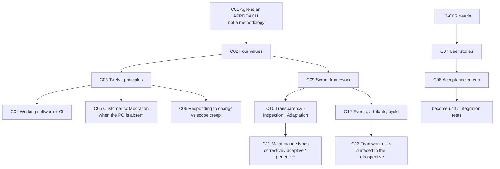
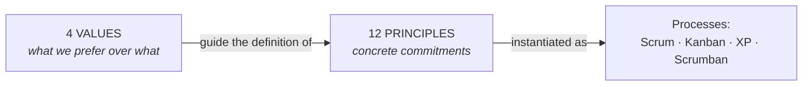
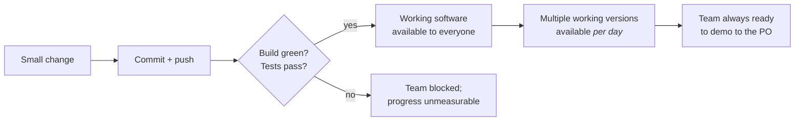
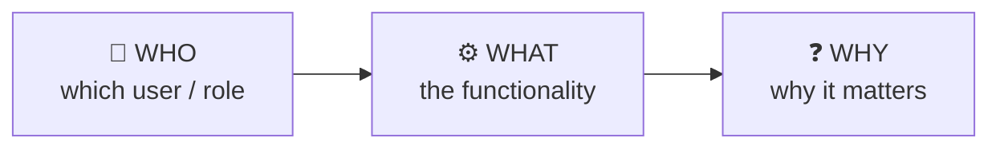
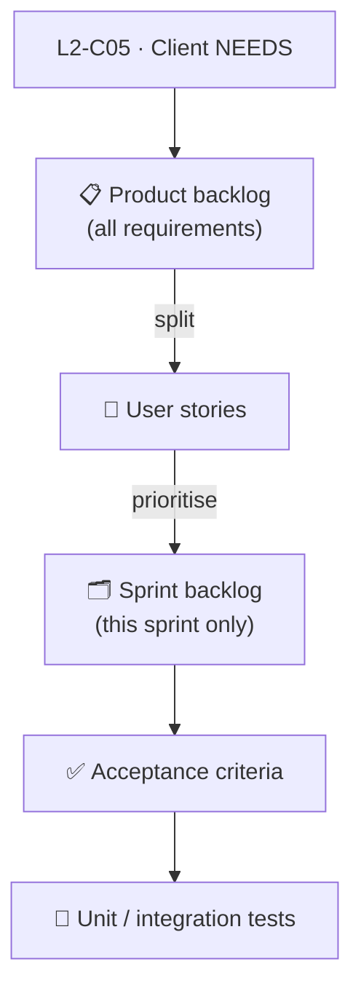
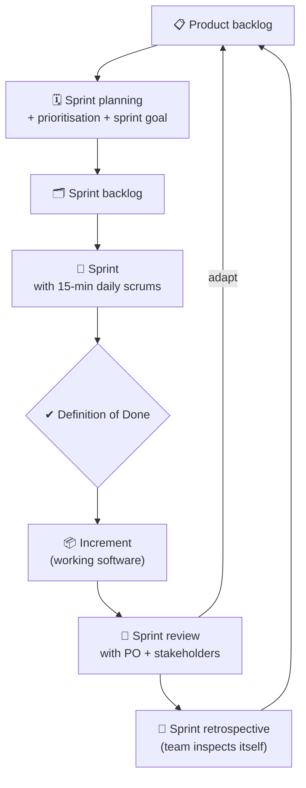

# 🌀 SOFTENG 761 Lecture 3 — Agile and Scrum

> [!abstract] Why this matters
> This is the lecture that closes the loop opened in [[../../Lecture2/notes/L2-notes|L2]]. L2 got you from what a client *says* to what they *need*; this one tells you what to **do** with those needs — turn them into **user stories**, attach **acceptance criteria**, order them into a **product backlog**, and burn them down in **sprints**.
>
> It also settles a definitional point the course keeps leaning on: **Agile is not a process.** It is a way of thinking that you apply *to* a process. Scrum is what you get when you build a process from that thinking.
>
> Everything in **Assignment 2** (the reflection report) is drawn from here.

> [!info] Sources
> **Transcript:** `[423-348]_SOFTENG_761_L01C_SOFTENG_761_L02C — Mon 27 Jul 02:00 PM`, 262 lines. Auto-generated.
> **No slide deck.** The lecture was delivered as a live walkthrough of Canvas Modules 1–3 plus [agilemanifesto.org](https://agilemanifesto.org) — same pattern as L2.
> **Canvas source material is already in this repo and is NOT duplicated here:** [`../../Lecture2/resources/canvas-modules-1-and-2-pages.md`](../../Lecture2/resources/canvas-modules-1-and-2-pages.md). Its "Contents of Module 1 and 2" index lists three topics — *From Idea to Rationale · Agile · Scrum and Kanban* — and **this lecture delivers topics 2 and 3**, the two that were deferred at the end of L2. That file also records the **Scrum Primer** sitting under Module 3, which the lecturer names as the team's standing reference.
> *Prerequisites: [[../../Lecture1/notes/L1-notes|L1]] (Scrum roles, the sprint cycle, the Spike) · [[../../Lecture2/notes/L2-notes|L2]] (says → wants → needs → product backlog).*

> [!warning] Source-quality caveat — read before trusting a verbatim quote
> The transcript is **fair, not good**. Roughly the first 200 lines contain long stretches of unattributed student crosstalk that the captioner garbled into nonsense. The lecturer's own delivery is mostly intact, but individual words are mangled — most visibly **"scumbags"** for *Scrumban*, **"Donne"/"Dunne"** for *Done*, **"Platonov"** for *product owner*, and **"[the] 8 discretion"** for *Ed Discussion*. Where I could reconstruct a word with certainty I did so silently; where I could not, it is marked `⚠ transcription uncertain`.
>
> **No figures exist.** No deck to rasterise; the Canvas pages are plain prose. Every diagram below is **generated by me**, permitted by CLAUDE.md §3.3a only because the source has no figure for that relationship. Do not reproduce them in an assessment as course material.

> [!tip]- Revision order (click to expand)
> Short on time? **[[#⚖️ L3-C02 · The four Agile values|C02]] → [[#📜 L3-C03 · The twelve principles|C03]] → [[#🧱 L3-C09 · Scrum — a lightweight framework built around people|C09]] → [[#🎬 L3-C12 · The Scrum events, artefacts and the cycle|C12]]**. Those four are Assignment 2's paragraphs 1 and 2 almost verbatim. [[#📝 L3-C07 · User stories — who, what, why|C07]] and [[#✅ L3-C08 · Acceptance criteria become tests|C08]] are the ones you will actually use every week on the project.

## 🗺 Concept map

---

## 🧠 L3-C01 · Agile is an approach, not a methodology

> [!danger] `priority: high` — this is the definitional trap the lecturer flags twice

> [!question] Cue questions
> - Is Agile a software development process? Answer precisely, and say what it *is* instead.
> - Someone asks "do you follow an Agile methodology?" — restate the question so it's answerable.
> - What is the relationship between Agile and waterfall? (Careful: it is not "opposites".)

### In plain language

"Agile" is not a thing you install. It's a *property* — quick, nimble — that a way of working can either have or lack. You still need an actual process (steps, meetings, artefacts). Agile just tells you what that process should feel like. So the question "are you doing Agile?" really means "is the process you're already running an agile-shaped one?"

### Precisely

> [!quote] The correction, stated directly
> "One relation between agile and software development processes, which I feel is actually **not a software development model or methodology or process. Rather, it is an approach. It is a kind of a characteristic that you can apply to a given software development process to make it agile or not**."

> [!quote] And on the etymology
> "The term agile is simple to understand. **Anything that is quick, nimble would be agile.** And so how can we apply that concept to a software development process?"

**Process, generally:** *"a sequence of steps for doing something"* — the term is not software-specific. Software then has **process models** that tell you how to implement a process: waterfall, spiral, and others.

> [!important] How to answer the question when you're asked it
> *"When someone asks you whether… you are following an agile methodology — you need to interpret this question as **whether your software development process is following the agile thinking**."*
>
> That reframe is the whole concept. Agile is a lens applied to a process, not a replacement for one.

### Where the thinking lives

Agile thinking is communicated to industry through **values** and **principles**, in that dependency order:

> [!quote] The generating relationship
> "The thinking is actually communicated in the industry by using the agile values and principles, **where values will guide the generation of principles**, or the definition of principles."

### Historical framing (context, not examinable detail)

The lecturer graduated in 2002, when Agile was brand new. In Roger Pressman's software-engineering textbook of that era, chapter 1 covered traditional, iterative/evolutionary and spiral process models — and Agile got *"a little section at the end of the chapter."* The Agile Manifesto was published around 2002–2003 at **agilemanifesto.org**, and the site has never been updated: *"I'm surprised that it is still the same from 2002… maybe they have deliberately kept it like that."*

> [!warning] Common traps
> - Calling Agile a methodology. It is the characteristic; Scrum is the methodology.
> - Assuming Agile means "no process" or "no documentation". It means *lean* documentation and *responsive* process — see [[#⚖️ L3-C02 · The four Agile values|C02]].
> - Treating waterfall and Agile as mutually exclusive labels. Agile is *"a thinking or an approach… it can be embedded into any normal or old-style development process."*

*📄 Source: transcript — "so what I'm now going to do is start talking about today's topic" through the manifesto link*

---

## ⚖️ L3-C02 · The four Agile values

> [!danger] `priority: high` — Assignment 2, paragraph 1

> [!question] Cue questions
> - State all four values in the "X over Y" form, without looking.
> - For each, what is the thing on the right, and why is it *not* worthless?
> - Which value governs your relationship with the Product Owner? Which one governs your git history?

### In plain language

Four preferences. Each has the shape *"we value **A** over **B**"* — and both halves are things worth having. The point isn't that B is bad; it's about which one you sacrifice when they collide, because on a real project they collide constantly.

### Precisely

> [!quote] Where they come from
> "Similarly, agile has a set of four values that the software development processes that follow agile must follow… **each and every team member must know what these values are. And not theoretically, but practically.**"

| # | Value | What the *left* side demands | What the *right* side is |
|---|---|---|---|
| 1 | **Individuals and interactions** over processes and tools | Continuous team communication; every member's capability valued; equal say; no one leading, no one left behind | Investment in better tooling and heavier process |
| 2 | **Working software** over comprehensive documentation | A build that compiles, runs, and is available to the whole team at all times | Big up-front specification documents (e.g. the SRS) |
| 3 | **Customer collaboration** over contract negotiation | The client engaged throughout, across all sprints | A rigid, up-front, change-proof contract |
| 4 | **Responding to change** over following a plan | Changes accepted mid-development; you *tell the client so from the start* | Locking down and executing a fixed plan |

### 1 — Individuals and interactions over processes and tools

> [!quote]
> "When you are working in a team, the team communication is a high priority — **continuous team communication**. Valuing each and every team member's capabilities is very important. **No one is leading the team. No one is left behind.** The team works together and everyone has an equal say."

> [!example] The motivation-vs-resources analogy
> Two routes to success: (a) limited resources, but a hard worker who is highly motivated; (b) every resource in the world, but low motivation. *"Who has a higher chance of doing so? Who is more motivated."*
>
> **The claim being smuggled in:** motivated people beat good tooling. Which is why the value reads *individuals over processes and tools*, not *instead of*.

### 2 — Working software over comprehensive documentation

The named target is the **Software Requirements Specification (SRS)**:

> [!quote]
> "If that document is too detailed… most of our early effort on building the document and lesser effort on actually starting to work on developing the project — that is something agile **doesn't encourage**. It says keep your documentation minimal and get on working on the actual implementation as soon as possible."

**Definition of "working software" — memorise this, it recurs three more times in the lecture:**

> [!important] What *working software* actually means here
> A build that **compiles successfully**, **runs successfully** (at least in initial versions), and is **available to the other team members**.
>
> *"If you think about your GitHub repositories — if they are frequently updated with a working version, your team members are able to clone it and start working on it **without worrying about whether that build is working or not**."*

This is the value that makes [[#🔁 L3-C04 · Working software as the measure of progress — and continuous integration|C04]] non-negotiable.

### 3 — Customer collaboration over contract negotiation

> [!quote]
> "You need to **continuously collaborate with the customer**… Agile says keep the customer engaged with the project development throughout all the sprints."

In this course the **Product Owner is your only representative of the client** and plays customer, client and user simultaneously. Because course POs are *"mostly non-technical"*, keeping them inside the sprint would serve no purpose — but *"having them as part of your meetings, which we call **sprint reviews**, will be useful."*

The *contract negotiation* side is the contract signed between client and development team fixing requirements. The failure mode is rigidity: *"If it is too rigid, then we are saying that we are not going to allow any kind of changes to this contract later."*

### 4 — Responding to change over following a plan

> [!quote]
> "Don't go after following a strict plan. Rather, **you are allowing the customer to bring in new changes any time during the development sprints**. So in a way, you are telling the customer that we are ready to do anything for you."

With the honest qualifier attached — see [[#🚧 L3-C06 · Responding to change vs scope creep — where the limit actually is|C06]].

> [!warning] Common traps
> - Reading "over" as "instead of". Both sides are valuable; the value states the tie-breaker.
> - Quoting value 2 as licence to write no documentation. It says *minimal*, not *none*.
> - Forgetting values 3 and 4 are near-siblings — 4 is what 3 commits you to once the contract is signed.

*📄 Source: transcript — agilemanifesto.org walkthrough · confirmed against agilemanifesto.org wording*

---

## 📜 L3-C03 · The twelve principles

> [!danger] `priority: high` — Assignment 2 requires you to refer to **1–2 specific principles**, not "the principles" collectively

> [!question] Cue questions
> - Which principle does a one-week sprint stress, and in which direction?
> - Which principle names the *measure* of progress, and what does that measure exclude?
> - What is the relationship between the principles and your contract with the PO?

### In plain language

Twelve concrete commitments, generated from the four values. The lecturer's own description of their register: *"When you read them, they are like an oath."* You don't memorise all twelve — you learn which one bites in which situation.

### Precisely

The ones he stopped on:

| Principle (as discussed) | The point he made about it |
|---|---|
| **Satisfy the customer through early and continuous delivery of valuable software** | The stated "highest priority" |
| **Welcome changing requirements, even late in development** | The one students most often quote and least often qualify → [[#🚧 L3-C06 · Responding to change vs scope creep — where the limit actually is|C06]] |
| **Deliver working software frequently — a couple of weeks to a couple of months** | ⚠ **This course goes below the manifesto's own lower bound**: *"we are giving you even less. That is **one week for each sprint**."* Industry is generally ~4 weeks, scaled to project size |
| **Working software is the primary measure of progress** | If there is no successful build at some moment during a sprint, *"it will be difficult for your team to progress… you cannot measure the progress until there is a ready product which you can demonstrate"* → [[#🔁 L3-C04 · Working software as the measure of progress — and continuous integration|C04]] |
| **The most efficient method of conveying information is face-to-face conversation** (principle 6) | *"These may be online"* — synchronous and in-person is the requirement, physical co-location is not |
| **Sustainable pace** | *"People work… continuously and frequently with high energy"* |

> [!important] The principles are not a contract — this is the load-bearing caveat
> > *"These principles are **not going to be a part of the contract**. No one is going to say, 'you said you are going to welcome changes until the end.' That is something that is just there to **guide your software development process in an agile way**. But it will depend upon how your interaction goes with the product owner."*
>
> So: principles set the default posture, the PO conversation sets the actual limit. Quoting a principle at a client is not an argument.

> [!bug] ⚠ external — not from the lecture, and explicitly waved off
> He mentions hearing of a *"13th principle and 14th principle"* added in recent years. **"The main ones are here, so you need not bother about the others."** Twelve is the examinable set.

> [!warning] Common traps
> - Naming "the agile principles" in the abstract in Assignment 2 — the brief demands you go down to individual ones.
> - Conflating principles with values. Assignment 2 marks them as separate paragraphs; see [[../context/admin-and-dates|admin-and-dates]].

*📄 Source: transcript — twelve-principles walkthrough*

---

## 🔁 L3-C04 · Working software as the measure of progress — and continuous integration

> [!danger] `priority: high` — this is also where your project marks come from

> [!question] Cue questions
> - Why must the build be green *during* a sprint, not just at the end of one?
> - What size should a commit be, and what are the **two** distinct benefits of committing that way?
> - What is the anti-pattern the lecturer has repeatedly seen in three-person student teams, and what are its two costs?

### In plain language

Somebody on your team should be able to clone the repo at any random moment and get something that builds. That's the bar. It sounds like a testing rule; it's actually a *measurement* rule — if the build is broken you literally cannot say how far along you are, because "progress" is defined as working software and you haven't got any.

### Precisely

> [!quote] The CI link, stated
> "This actually very, very closely relates to the concepts of **continuous integration**… each member is allocated the development of different features, and everyone is completing their bits and committing them — they need to do them in **the smallest possible chunks**."

**The rule:** make small changes → commit → confirm the build isn't broken → confirm the tests pass. So that *"at the next moment, if one of your team members wants to clone and pull in all the changes from your shared repo, they should have a successful build to work on."*

> [!important] The second, less obvious benefit — demo-readiness
> *"During a given day in a sprint, if your team members are making smallish changes and regularly pushing, that would mean you will have the availability of a working software **multiple times each day**… and your team is **always ready to demonstrate the latest version**."*
>
> That is what removes the pre-sprint-review panic. You never *prepare* a demo; you always *have* one.

> [!warning] The anti-pattern — named from his own teaching experience
> Three-person teams on a web-development course who *"would do all the work and then commit. They will keep working like two days, three days or even weeks, and then push a single set of changes and commit once."*
>
> Two costs, and the second is the one that hurts you personally:
> 1. *"Sometimes it breaks the build."*
> 2. *"It gives us **very little evidence of whether they worked regularly or not**."*
>
> And separately: *"That is good for the confidence of the rest of your team as well."*

> [!important] Evidence of contribution — the trap to avoid
> > *"Sometimes students would say, 'we had a team and my work was planning, everyone else was coding and I was planning.' Then you do not have any commits, and so your contributions are not clear — and that means you will lose [marks]."*
>
> **Commits are the best evidence.** A planning-only role leaves no trace and is not defensible at marking time.

### Related XP practices (named, not taught)

Agile *"is very closely related to the different practices that come along"* with **Extreme Programming** — **pair programming**, **code reviews**, **continuous integration**. XP practices are *"[what] help in implementing or making a software development process agile."*

> [!important] Code quality is a marked component
> *"There's a good chunk of your marks that are going to be allocated towards code quality."* Practical instruction: agree quality standards in the **first team meeting**, and although *"in agile everyone is responsible for everything"*, the team may nominate **1–2 members** to regularly review code against those standards.

*📄 Source: transcript — working-software principle and CI discussion*

---

## 🤝 L3-C05 · Customer collaboration when the Product Owner is unavailable

> [!question] Cue questions
> - A student asks: what if the PO misses a sprint review, we make assumptions, and they reject the work? What is the prescribed answer?
> - What two things must come out of the **first** PO meeting, and why is the first one specifically load-bearing?

### In plain language

Some POs on this course will be hard to pin down. The fix isn't to chase them harder mid-project — it's to get, in the very first meeting, both a rough backlog *and* a written understanding of what you're allowed to do when they go quiet. Then their absence is a scenario you already agreed on rather than a surprise.

### Precisely

> [!quote] The student's question, verbatim in substance
> *"Suppose during the first sprint review we show our prototype to the product owner… and after next week he's not available. And then the following week he comes, but we made assumptions while he was not there — and he doesn't like it, so we have to scrap the idea."*

> [!important] The answer: **be ahead of the game**
> During the **first** meeting, establish:
> 1. **The PO's availability across the coming weeks** — *"it will be important that you ask the product owner right during the first meeting whether you will be available for the next one."*
> 2. **The rule for proceeding without them** — *"in case you are not available, can we go ahead, and how much can we go ahead?"*

**Why the first meeting specifically:** it is where you produce *"at least a draft of the product backlog, which is the requirements."* Once a draft backlog exists you can point at it and say *"these are the requirements that we have finalised at the start — in case you do not attend the second meeting, should we go ahead with the rest of them?"*

> [!quote] What that buys you
> "If you do that and then the product owner comes back after a couple of weeks, you would at least have… you can say that **we did talk about it**. So there will be **lesser reasons for them to complain**."

> [!note] One-week sprints make this urgent
> *"In this course you are going to have one-week sprints"* — so a single missed PO week is a whole sprint of unreviewed work. Compare the never-stop rule in [[../../Lecture1/notes/L1-notes#👤 L1-C04 · Product Owner vs client — and what happens when they vanish|L1-C04]], and this replaces the placeholder role treatment in [[../../Lecture2/notes/L2-notes#👥 L2-C08 · Client, product owner, and user|L2-C08]].

*📄 Source: transcript — customer-collaboration value, student Q&A*

---

## 🚧 L3-C06 · Responding to change vs scope creep — where the limit actually is

> [!question] Cue questions
> - "If we keep adding requirements there's no limit." Give the lecturer's two-part answer.
> - What structural fact about the PO makes runaway scope unlikely on *this* course?
> - What is the one change you may legitimately push back on?

### In plain language

Welcoming change doesn't mean accepting everything. There are two brakes: an explicit conversation with the PO about how much change is possible, and the PO's own self-interest — they want a finished product more than you do, because they end up owning it.

### Precisely

> [!quote] The student's objection
> *"If we keep on adding new requirements to increase the scope of the project, there's no limit to stopping it."*

**Brake 1 — say it out loud, at the start.** *"We need to talk to the product owner and make it clear right at the start that we will be able to make changes **wherever possible**."* And: *"It should not be like you start with one project and [end up on] another. It should not be that vast."*

**Brake 2 — the PO's incentives.**

> [!important] The structural argument
> > *"More than you, the product owner is worried about the completion of the project, because **they are going to own the project or the end product**. So normally this won't happen."*
>
> With the honest hedge attached: *"Abnormally, anything can happen."*

**Where the change conversation happens:** in **sprint reviews**. *"You might want to talk about how much changes, or what kind of changes, you can bring."* And often the PO raises the scope question themselves, because *"they might be worried that they do not have enough clarity about the requirements at this stage."*

### The one legitimate pushback — technology change

> [!quote]
> "You are using a specific technology to implement a specific feature… and then after two sprints the customer comes back and says *my competitor is using something else* — you might not accept [a change] in that range. **You need to be sceptical**, but you can tell them that wherever possible we can bring in those changes."

> [!warning] Common trap
> Answering the scope question with "Agile says we welcome change." It's the wrong altitude — the answer is a negotiation held early, not a principle recited late. See the not-a-contract caveat in [[#📜 L3-C03 · The twelve principles|C03]].

*📄 Source: transcript — responding-to-change value, student Q&A*

---

## 📝 L3-C07 · User stories — who, what, why

> [!danger] `priority: high` — you will write these every week on the project

> [!question] Cue questions
> - Give the three components of a user story, in order, and the standard sentence frame.
> - What is a user story, in one clause, relative to a requirement?
> - Why does having several *types* of user make stories more useful than plain requirements?

### In plain language

A user story is a requirement rewritten so a developer can act on it. Same content, three fixed slots: who wants it, what they want, and why they want it. The "why" is the slot ordinary requirements drop, and it's the one that lets you make sensible calls when the *what* turns out to be under-specified.

### Precisely

> [!quote] What they are
> "**User stories… are just another name for individual requirements in a software project.** But they are more developer-friendly, because they are written in a way that tells you [a] detailed story… in one line."

**The three slots:**

> [!example] The Canvas example he opened
> **"As a project manager, I want to generate a project status report, so that I can share progress with stakeholders."**
>
> | Slot | Content |
> |---|---|
> | Who | a project manager |
> | What | generate a project status report |
> | Why | share progress with stakeholders |

> [!important] Why the *who* slot earns its place
> A real product serves several kinds of user — *"there are normal users, there are maybe some manager users… the graphical interfaces will be different, [and] the functionalities you need to implement for them are different."* Encoding the role in the story is what keeps those distinct instead of collapsing them into one undifferentiated "user".

### Where stories sit in the flow

> [!quote]
> "Each requirement can be split into multiple user stories. And then you are going to keep taking them off for specific sprints. **So you need to prioritise them and then move them to specific sprint backlogs.**"

**Tooling is your call** — *"you might be using Trello or whatever. It's up to you to write these stories."* The tool is not the point; the three slots are.

*📄 Source: transcript — user-stories section, Canvas user-story page*

---

## ✅ L3-C08 · Acceptance criteria become tests

> [!danger] `priority: high`

> [!question] Cue questions
> - What is an acceptance criterion *for*, and what is its single biggest practical advantage?
> - What does making a story "very specific" enable that a general story does not?
> - Describe the Code Runner story and state the failure mode it illustrates. Whose fault is that failure?

### In plain language

An acceptance criterion is the specific, checkable version of a user story — with real names and real content in it, so there is exactly one way to tell whether you're done. That specificity is the whole trick: a criterion concrete enough to check is also concrete enough to write as a test.

### Precisely

**Purpose:** acceptance criteria *"are going to help you in ultimately deciding whether the implementation is validating these user stories or not."*

> [!important] The primary advantage — memorise this sentence
> > *"One major advantage of working using acceptance criteria is that **acceptance criteria are very easy to translate into unit tests or integration tests**. So that is a primary advantage of writing the acceptance criteria right from the start."*

> [!example] From story → criterion, using the same example
> **Story:** *As a project manager, I want to generate a project status report so I can share progress with stakeholders.*
>
> **Criterion:** *"A project manager, **John**, is generating a project status report **containing this content**, so that they want to share the progress with **these** stakeholders."*
>
> *"Now this becomes very specific. And now you can relate it to the implementation and make sure that that acceptance criterion passes."*
>
> **What changed:** an actual actor, actual report content, actual stakeholders. Nothing is left to interpretation — which is precisely what makes it executable as a test.

### Acceptance criteria and TDD

> [!quote]
> "Acceptance criteria take centre stage if you are implementing something called **test-driven development**… As soon as you look at a functionality, you **don't go into the details of the functionality — rather, you write acceptance criteria for that functionality and then work from there**, so that you exactly know what is needed."

### ⚠ The counter-example — teaching to the test

> [!warning] The Code Runner story, and what it actually shows
> Stage-one programming courses at this university use a tool called **Code Runner**, embedding ~10 test cases per question. Students see the tests. So:
>
> > *"They will write the code, and as soon as all ten tests pass they will say **done**. They won't bother about any other edge cases. Any other boundary cases — they won't bother about them."*
>
> **The failure mode:** an acceptance criterion is a *floor*, not a ceiling. Tests define the minimum a correct implementation must satisfy — and if the set is visible and finite, people optimise for exactly that set and stop.

> [!important] Which makes coverage a *client* decision
> > *"It depends upon what your product owner says. **If they say it should be foolproof — I want you to test it extensively — then you need to write more tests.**"*
>
> So "how much testing is enough?" is not answered by TDD. It is answered in the sprint review.

> [!warning] Common traps
> - Writing a criterion as vague as the story it came from. If it isn't specific enough to be a test, it isn't a criterion.
> - Treating passing acceptance tests as proof of correctness — see Code Runner above.

*📄 Source: transcript — acceptance-criteria and TDD section*

---

## 🧱 L3-C09 · Scrum — a lightweight framework built around people

> [!danger] `priority: high` — Assignment 2, paragraph 2

> [!question] Cue questions
> - Define Scrum in the lecturer's own terms, and say which Agile value it is built on.
> - "Everyone is a leader and there is no leader" — unpack that into the Scrum Master's actual job.
> - What does *self-organising* mean concretely, and when does re-organisation happen?

### In plain language

Scrum is the worked example: what you get if you take the four values, especially the first one, and turn them into an actual process with named roles, fixed meetings and specific artefacts. It's deliberately thin — it tells you who talks to whom and when, and stays out of how you write the code.

### Precisely

> [!quote] The definition
> "The Scrum software development process is a **lightweight framework that is defined around people and their communication**. As we know, in agile values we put a lot of emphasis on individuals and interactions — so that is where Scrum focuses."

> [!quote] Its provenance
> "One such example, which was **devised using agile values and principles**, was Scrum."

### Scrum is not universal — the industry reality

> [!note] Both views exist in industry
> Some teams don't run Scrum; some prefer a derivation; some *"are still working with the old-school scrum."* The dominant factor is inertia: *"a given team is used to a specific kind of project development process, so they do not want to change. **It is so difficult to change.**"*
>
> His analogy: CS/SE curricula change constantly, whereas *"the curriculum for physics, mathematics, chemistry — it remains very similar."*
>
> Other agile processes named in passing: **Kanban**, **Scrumban** (⚠ transcribed as "scumbags"). Assignment 2 asks you to pair Scrum with one of these or with XP.

### Roles

| Role | What it is | What it is **not** |
|---|---|---|
| **Scrum Master** | *"A facilitator"* — helps people with resources or knowledge; runs the events; removes impediments | **Not** the leader of the team |
| **Product Owner** | The client representative; responsible for maximising the value produced by the development team | Not a member of the dev team |
| **Developers** | The team. Roles may be allocated internally (tester, analyst, …) | Not individually assigned tasks by anyone outside the team |

> [!important] The leadership formula — quotable, and it recurs in [[../../Lecture4/notes/L4-notes|L4]]
> > **"In scrum teams, everyone is a leader and there is no leader."**

### Self-organising teams

> [!quote]
> "Scrum teams are normally **self-organising** teams… At the start of the scrum cycle, people are going to self-organise **by communication**. So they are going to self-organise their role. **This is not going to be dictated to them.**"

And re-organisation is expected mid-flight:

> [!example]
> *"Someone was allocated the work of testing the modules or functionalities, but then in the next sprint — or maybe during the same sprint — one of the team members is unavailable. So they are happy to reorganise their role."*

Reinforced by the quiz walkthrough: a team working *"in cross-functional roles without job titles"* is the definition of a self-organising team, and during sprint planning **the development team selects how much work it can commit to** — a PO or SM assigning tasks to named developers is a violation.

> [!note] Compare [[../../Lecture1/notes/L1-notes#🏃 L1-C03 · The Scrum Master is *not* a project manager|L1-C03]]
> L1 makes the same distinction against the *project manager* role specifically. This lecture adds the mechanism — facilitation and impediment removal — and [[../../Lecture4/notes/L4-notes|L4]] tests it in practice.

*📄 Source: transcript — Scrum introduction; reinforced by Q7–Q10, Q19 of the Canvas quiz*

---

## 🔍 L3-C10 · Transparency, inspection, adaptation

> [!danger] `priority: high`

> [!question] Cue questions
> - Name the three pillars and, for each, one concrete thing your team must do.
> - What is an "opaque sub-team", why does it form, and why is it a transparency failure rather than a social one?
> - Which pillar is hardest, and what makes it hard?

### In plain language

Three properties a Scrum process has to have, over and above the values. Everyone can see the state of the work (transparency); everyone keeps checking it (inspection); and the team actually changes what it does in response (adaptation). The third is the one teams fail.

### Precisely

Sourced from the **Scrum Primer** under Canvas Module 3 — *"a textual guide for the scrum knowledge… always keep it with you. If you have trouble understanding something while you are communicating with your team members, go to the Scrum Primer."*

### 1 — Transparency

> [!quote]
> "The progress of each team member is **visible to everyone else**."

Mechanism required: *"You need to set up some tool in order to do that."* His example is a **Trello board per team member**, plus a **definition of done** against which each user story gets ticked, *"so the progress is clearly visible to each and every member."*

> [!warning] The opaque sub-team — the specific failure to avoid
> > *"Many times what will happen: there are eight-member teams, and then there are three sub-groups who are closer to each other. And **they are transparent to each other, but they are opaque to the rest of the groups. Do not do this.**"*
>
> Note the shape of the failure. Nobody is hiding anything on purpose — transparency just stops being *global*, which is the only kind that counts. On an eight-person course team this is the default outcome unless the tooling forces otherwise.

### 2 — Inspection

> [!quote]
> "Keep reviewing each other's work."

The concrete instance is **regular code reviews** ([[#🔁 L3-C04 · Working software as the measure of progress — and continuous integration|C04]]).

### 3 — Adaptation

> [!important] Named as the hard one
> > *"Adaptation is very tricky, because when you do your sprint… there can be many problems."*

Two example triggers he gives:

| Trigger | Shape of the adaptation |
|---|---|
| A member says *"I told you I would work on this part using this technology, but now I am not comfortable"* | Switch technology, pair them with someone, or swap work |
| The PO introduces a new requirement | Absorb it — *"you have already promised that you will do some minor changes"* |

> [!quote] The question the pillar reduces to
> "**Is your team good enough to adapt to this challenge?** … Whether they are [changes] in technology or simple functionalities — that will be very important to decide on early in the development."

*📄 Source: transcript — Scrum Primer / three-pillars section*

---

## 🔧 L3-C11 · Three kinds of maintenance — and why *perfective* is a team hazard

> [!question] Cue questions
> - Name the three maintenance types, and give the trigger for each.
> - Which one has *no* trigger, and why is that a problem inside a Scrum team specifically?
> - Under what condition does it stop being a problem?

### In plain language

Three reasons to change existing code. Two of them are responses to something — a defect, or a changed environment. The third is a developer deciding on their own that something could be nicer. That one causes team friction, not because improving things is bad, but because nobody agreed to it.

### Precisely

| Type | Trigger | Example from the lecture |
|---|---|---|
| **Corrective** | Something is wrong | PO says at sprint review *"this doesn't seem correct"*; or the team finds an issue in its own retrospective or daily scrum |
| **Adaptive** | The environment changed | Changing conditions, technology, or **team members** |
| **Perfective** | ⚠ **None** | A dev thinks the UI *"can be made more aesthetic"* or the design could be better |

> [!warning] Why perfective maintenance is the dangerous one here
> > *"**Perfective maintenance is when there is no trigger** for a team member to work on something, and they still work [on it]… No one has asked them to do it, but they do it because they have time and interest and motivation. But then when the rest of the team is here, they say **'why did you do it? This was not part of what we discussed.'**"*
>
> The instruction is blunt: *"Only do what is required. Do not show your own creativity beyond what we have talked about."*

> [!important] The escape hatch — and it is conditional
> If the PO explicitly asks for it — *"please bring in some creativity wherever you can"* — then you have that option. **But:** *"you need to make sure that the other team members know that you are doing this."*
>
> So the objection was never to the improvement. It was to the **invisible** improvement. This is [[#🔍 L3-C10 · Transparency, inspection, adaptation|C10]] transparency wearing a different hat.

> [!note] Adaptive maintenance ≠ the adaptation pillar
> Adjacent, deliberately: he introduces the maintenance taxonomy *"when I [use the] term adaptation"* in the pillar sense. **Adaptation** is a property of the *process*; **adaptive maintenance** is a category of *code change*. Don't merge them in an answer.

*📄 Source: transcript — adaptation pillar → maintenance taxonomy*

---

## 🎬 L3-C12 · The Scrum events, artefacts and the cycle

> [!danger] `priority: high` — the terminology sheet for the whole course

> [!question] Cue questions
> - Distinguish sprint planning, sprint review and sprint retrospective by *what is being inspected* in each.
> - Which event includes the PO and stakeholders? Which excludes the PO by design?
> - Which artefact gives a transparent view of the **current state of the product**, and why is it not the burn-down chart?

### Precisely

### Events

| Event | Who | Purpose | Timebox |
|---|---|---|---|
| **Sprint** | The team | The development iteration itself | 1 week on this course |
| **Sprint planning** | The team | *"Define what will be delivered in the sprint and how it will be achieved"* — including **prioritising** user stories out of the product backlog | — |
| **Daily Scrum** | Dev team **only** | *"Where you are; are you facing any problems"* | **15 minutes**, start of each day |
| **Sprint review** | Team **+ PO + stakeholders** | Demonstrate the increment; *"inspect the product increment and adapt the product backlog if needed"* | — |
| **Sprint retrospective** | The team | *"A time-boxed opportunity for the scrum team to **inspect itself** and create a plan for improvements"* | — |

> [!important] The distinction people lose marks on
> **Review inspects the product. Retrospective inspects the team.** Planning looks forward; retrospective looks back at the sprint just finished.

> [!warning] The PO is not invited to the Daily Scrum
> From the quiz walkthrough: inviting the PO to daily scrums is **not** aligned with Scrum, *"because in daily scrums the team is [meeting] and they do not want to invite the product owner. At least they are managing their own [affairs]."*

### Artefacts

| Artefact | Definition |
|---|---|
| **Product backlog** | *"An ordered list of everything that might be needed in the product"* |
| **Sprint backlog** | The user stories pulled into one specific sprint |
| **Increment** | The working software produced by a sprint — *"an increment is always a working software"* |
| **Definition of Done** | Attached to every increment; *"whether that increment is complete in relation to these user stories."* Crafted by **the whole development team**, not the SM or PO |

> [!important] Increment vs the working build — a distinction the class got stuck on
> A student pushed back on "which artefact gives a transparent view of the current state of the product?" The reasoning that settles it:
> > *"If you look at it from the software team's perspective, they want a working software to be available **all the time**. But there is no such option among these. The only option that relates to working software is **increment**, because increment is the working software that [is delivered] at the end [of the sprint]."*
>
> **So:** *working software* is a continuous property you maintain during the sprint ([[#🔁 L3-C04 · Working software as the measure of progress — and continuous integration|C04]]); the **increment** is the named artefact at the sprint boundary. And the increment is what you demo at the **sprint review**.
>
> Not the **velocity chart** — *"we can only verify how many points were being allotted"*, which is throughput, not product state.

### The cycle

> [!note] Where your weekly presentations sit
> *"Your weekly presentations would come somewhere here — you would review it with your product owner and then present it to us."* Increments are presented from **week 6** onward: *"the first increment, then the second increment, and so on."*

### The burn-down chart

> [!quote]
> "Sprint burn-down is going to burn down your product backlog items… it is going to tell you that a large amount of work is now reduced, and **at what rate** it is being reduced."

> [!example] The diagnostic scenario — worth internalising, it's a Scrum Master judgement test
> A burn-down showing **increasing work remaining** over several days. Four candidate responses:
>
> | Option | Verdict |
> |---|---|
> | Extend the sprint duration | ❌ *"That is going to impact the other sprints and your overall project timeline"* |
> | Reassign tasks to "faster developers" | ❌ *"How do you [even] define faster developers? They may create problems as well — and demoralise that team member"* |
> | Ask the PO to reduce scope mid-sprint | ❌ |
> | **Address impediments and facilitate a team discussion on blockers** | ✅ |
>
> > **"The Scrum Master would not know what would come out of the discussion, but there might be a solution. So their job is to facilitate a discussion."**
>
> That last line is the cleanest one-sentence definition of the SM role in either lecture.

*📄 Source: transcript — Scrum events/artefacts walkthrough and Canvas quiz Q11–Q20*

---

## ⚠️ L3-C13 · Teamwork risks and their mitigations

> [!question] Cue questions
> - Name three teamwork risks the lecturer says to plan for **before** they happen.
> - What is the concrete structural mitigation he proposes for an eight-person team?
> - When is the deadline for escalating an unresolvable team problem, and why is it not "when it gets bad"?

### In plain language

Someone on your team will get sick, disappear, or under-contribute. This is not a possibility to handle if it arises; it's a near-certainty to have a plan for on day one. The retrospective is where you build those plans, and the meeting where you build them should happen before you need them.

### Precisely

> [!note] This is a preview
> He flags that the **next lecture** will bring research from *"the last couple of years where we worked on looking at the risks involved in teamwork in software development projects."* *(In the event, L4 was the paper-plane Scrum simulation — the risk research is still pending. Tracked in [[../context/admin-and-dates|admin-and-dates]].)*

### The risks named

| Risk | Stated likelihood | Mitigation |
|---|---|---|
| A member falls **ill** during the semester | *"It is **99% chance** that one of the team members will fall ill"* | Have a plan agreed in advance |
| A member **stops responding** entirely | Real — his own course lost a tutor this way, by midnight email | The pairing structure below |
| A member **didn't do their part** this sprint | Common | Raise in the retrospective; agree in advance what happens |
| **Uneven contribution** | *"It is very common in teams that few people would be working more than the others"* | Commits as evidence ([[#🔁 L3-C04 · Working software as the measure of progress — and continuous integration|C04]]) |

> [!important] The structural mitigation — pair everyone with a backup
> > *"For example, if there's an eight-member team… **you can work in pairs, so everyone has one backup at least**. So if you are unavailable, I have to take care [of your work], and so on."*
>
> Four pairs, four single points of failure removed. Do it in the first team meeting, not the week it happens.

### The retrospective is where this work happens

> [!quote]
> "During your sprint retrospective meetings — they are your team meetings where you are going to talk about a sprint that has just been completed — **it is a good time to talk about how we can make little tweaks so that we can improve our overall process**."

### Escalation

> [!important] Escalate early, and here is the actual reason
> > *"If there are problems in your teams which you think you cannot resolve, then you need to report this to [the course staff] **early rather than late**. Because **if you approach them in week ten, then they won't be able to help.**"*
>
> The constraint is not patience — it's that remediation takes time the end of semester doesn't have. Same logic as his replacement-tutor story: *"finding a replacement may take time."*

*📄 Source: transcript — teamwork-risks section following the retrospective discussion*

---

## 🧾 Appendix — the 20-question Canvas quiz, walked through

> [!question]- Scenario: a mobile app for local farmers to track crop health and connect with buyers (click to expand)
> Formative only — *"these questions are not going to be asked in a test. It is more about making sure that you understand the concepts."* Answers below are the ones given in class, with his reasoning where he gave any.
>
> | # | Question | Answer given |
> |---|---|---|
> | 1 | Prioritising a working app quickly over detailed documentation reflects which value? | **Working software over comprehensive documentation** |
> | 2 | Dev team invites the PO to daily scrums — aligned with Scrum? | **No.** The daily scrum is the team's own meeting |
> | 3 | Release an MVP after three sprints for early farmer feedback — which principle? | **Deliver working software frequently** |
> | 4 | Constantly engaging farmers for feedback and adjusting the backlog — which value? | **Customer collaboration over contract negotiation.** ⚠ Tricky: the engagement is with *users*, not the internal team — that's what makes it the customer value rather than individuals-and-interactions |
> | 5 | Welcoming requirement changes late in development — which principle? | **Welcome changing requirements, even late** |
> | 6 | Retrospective reduces sprints from 4 weeks to 2 for faster feedback — reflects? | **Deliver working software frequently.** ⚠ *"This can go either way"* — working software is the *measure* of progress, but shortening the sprint targets **frequency** |
> | 7 | Who maximises the value of the product resulting from the dev team's work? | **Product Owner** |
> | 8 | In sprint planning, John insists on selecting tasks for each developer — correct? | **No.** *"The development team selects how much work it can commit to"* |
> | 9 | Who facilitates Scrum events and removes impediments? | **Scrum Master** |
> | 10 | Who crafts the Definition of Done? | **The development team** — every member shares the responsibility |
> | 11 | Which event is a timeboxed opportunity for the team to inspect **itself**? | **Sprint retrospective** |
> | 12 | During which event do team and stakeholders inspect the increment and adapt the backlog? | **Sprint review** |
> | 13 | Primary purpose of sprint planning? | **Define what will be delivered and how it will be achieved** |
> | 14 | Which artefact is an ordered list of everything that might be needed? | **Product backlog** |
> | 15 | Which artefact gives a transparent view of the current state of the product? | **Increment** — see [[#🎬 L3-C12 · The Scrum events, artefacts and the cycle|C12]] for the full argument |
> | 16 | Best reflects the Scrum approach to managing change? | **Changes are embraced through iterative development and feedback** |
> | 17 | Team works in cross-functional roles without job titles — example of? | **Self-organising teams** |
> | 18 | Burn-down shows *increasing* work remaining — what should the SM do? | **Address impediments and facilitate team discussion on blockers** — see the full four-option analysis in [[#🎬 L3-C12 · The Scrum events, artefacts and the cycle|C12]] |
>
> ⚠ The transcript's numbering drifts and two of the twenty are not separably recoverable from the crosstalk. The eighteen above are the ones he answered clearly.

---

## ✅ Summary — the 7 things that matter

1. **Agile is an approach, not a methodology.** It is a characteristic you apply *to* a development process. "Do you do Agile?" means "is your process agile-shaped?"
2. **Four values, each a tie-breaker not a rejection:** individuals & interactions · working software · customer collaboration · responding to change — each *over*, never *instead of*, its counterpart.
3. **Twelve principles generated from the values.** Working software is the **primary measure of progress**; this course runs **one-week sprints**, below the manifesto's own lower bound. The principles are **not a contract**.
4. **Working software = compiles + runs + available to the team, at all times.** Achieved by small frequent commits that never break the build. Two payoffs: the team is never blocked, and you are **always demo-ready**. Commits are also your evidence of contribution.
5. **Needs → user stories (who/what/why) → acceptance criteria → tests.** Specificity is the mechanism: a criterion concrete enough to check is concrete enough to execute. But tests are a floor — Code Runner shows what happens when people treat them as a ceiling.
6. **Scrum = a lightweight framework built around people and communication.** Everyone is a leader and there is no leader; the SM facilitates and removes impediments; the team self-organises and selects its own work. Three pillars: **transparency · inspection · adaptation**.
7. **Review inspects the product; retrospective inspects the team.** The retrospective is where teamwork risk gets planned for — pair every member with a backup, and escalate unresolvable problems early, because week ten is too late to fix.

---

## 🧪 Self-test

> [!question]- 12 free-recall questions
> 1. A recruiter asks whether your last team "used an Agile methodology". Rewrite the question so it can be answered correctly, and explain why the rewrite matters.
> 2. State the four values. For each, name one project artefact or habit that would show you're honouring it.
> 3. Your team writes no documentation at all and cites value 2. What is wrong with that reading?
> 4. Define "working software" to the standard used in this lecture. Why does a broken build make *progress* unmeasurable rather than merely inconvenient?
> 5. A teammate has been working locally for eight days and plans one large commit. Give both costs, and say which one affects them personally at marking time.
> 6. Your PO will miss the next two sprint reviews. What should you have done in meeting one, and what artefact makes that conversation possible?
> 7. A client keeps adding requirements. Give both brakes on scope, and explain why the second is structural rather than a matter of goodwill.
> 8. Write a user story and then a matching acceptance criterion for: *a farmer needs to know whether their crop is diseased.* State exactly what you added to turn one into the other.
> 9. Explain the Code Runner failure mode, and say who is responsible for deciding how much testing is enough.
> 10. Name the three pillars. Describe an opaque sub-team and say which pillar it breaks and why it forms by default.
> 11. A developer spends a sprint making the UI prettier, unprompted. Name the maintenance type, state the objection, and give the condition under which it becomes acceptable.
> 12. A burn-down shows work remaining going *up* for three days. Give the four candidate SM responses and eliminate three, with the reason for each elimination.

---

> [!info]- Related notes
> - `L3-summary.md` · `L3-flashcards.tsv`
> - `../context/admin-and-dates.md` — Assignment 1 due date, Assignment 2 publication, lab-hours arrangement, Ed Discussion
> - [[../../Lecture1/notes/L1-notes|L1 — course intro, Scrum roles, the sprint cycle, the Spike]]
> - [[../../Lecture2/notes/L2-notes|L2 — idea → rationale → purpose → justification; says/wants/needs]]
> - [[../../Lecture4/notes/L4-notes|L4 — the paper-plane Scrum simulation: all of this, run for real]]
> - `../../course-context/syllabus-map.md`
> - **Source material (not duplicated into this folder):** [`../../Lecture2/resources/canvas-modules-1-and-2-pages.md`](../../Lecture2/resources/canvas-modules-1-and-2-pages.md) · **Scrum Primer**, Canvas Module 3
