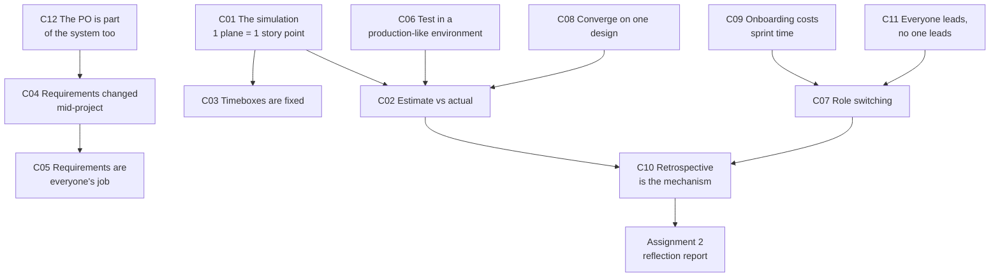
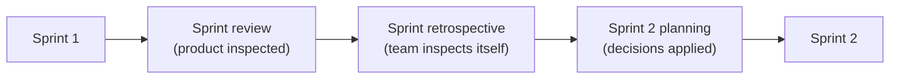

# ✈️ SOFTENG 761 Lecture 4 — The paper-plane Scrum simulation

> [!abstract] Why this matters
> [[../../Lecture3/notes/L3-notes|L3]] taught Scrum as a set of definitions. This lecture runs it — two real sprints, four teams, timeboxed events, a Product Owner who changes the requirements mid-flight and accepts or rejects each deliverable in front of you.
>
> The value isn't the game. It's that **every failure mode the class hit is one L3 warned about**, and they hit them anyway. That gap — knowing the rule and still breaking it under time pressure — is the actual content, and it's what **Assignment 2** asks you to reflect on.

> [!info] Sources
> **Transcript:** `[405-422]_^SOFTENG_761_Lecture — Wed 29 Jul 10:09 AM`, 262 lines. Auto-generated.
> **No slide deck in `resources/`.** Rules, acceptance criteria and the Assignment 2 brief were shown on screen but not distributed; everything below is reconstructed from what was read aloud.
> *Prerequisites: [[../../Lecture3/notes/L3-notes|L3]] — this lecture is entirely an application of it.*

> [!warning] Source-quality caveat — the worst transcript in the course so far
> This is a **workshop**, so the room was loud, and the captioner produced long stretches of unattributable fragments — roughly lines 165–235 and 425–465 are near-total noise. **The lecturer's framed segments** (rules, reviews, the debrief, the Assignment 2 brief) **are intact**; student contributions are patchy and several are reconstructed from context.
>
> Consequences you should know about before quoting anything below:
> - **Sprint 2 numbers are incomplete.** Only Team D's estimate-vs-actual survives cleanly. See [[#📊 L4-C02 · Estimation accuracy beats raw velocity|C02]], where the gaps are marked rather than filled in.
> - Team letters drift ("EMC", "TMD", "Ames", "MD"). Normalised to A/B/C/D where the referent is unambiguous.
> - **No figures.** No deck, and nothing to rasterise. The diagrams and tables below are mine.

> [!tip]- Revision order (click to expand)
> **[[#📊 L4-C02 · Estimation accuracy beats raw velocity|C02]] → [[#🧪 L4-C06 · Test in something that resembles production|C06]] → [[#📋 L4-C05 · Understanding the requirements is every member's job|C05]] → [[#🔄 L4-C10 · The retrospective is the mechanism, not a debrief|C10]]**. Those four are the debrief's actual findings. If you're writing Assignment 2, [[#🎭 L4-C11 · "Everyone is a leader and there is no leader" — in practice|C11]] and [[#🤝 L4-C07 · Self-organising teams switch roles between sprints|C07]] give you concrete experience to reflect on rather than theory to restate.

## 🗺 Concept map

---

## ✈️ L4-C01 · The simulation — rules, and what maps to what

> [!question] Cue questions
> - What is one story point in this game, and what therefore is velocity?
> - List the acceptance criteria for sprint 1. Which one is subjective, and who owns it?
> - Which Scrum events were timeboxed, and to what?

### The mapping

| Game object | Scrum concept |
|---|---|
| One accepted paper plane | **One story point** |
| Planes accepted in a sprint | **Velocity** |
| The lecturer | **Product Owner** — sole authority on acceptance |
| 3 (then 4) A4 sheets | The sprint's fixed resources |
| Throwing the plane at the wall | Acceptance testing, in front of the customer |

> [!quote] The framing
> "We treat one paper plane as one story point. So the number of planes you will manufacture will be equal to the number of story points you will be able to do in one sprint."

### The events and their timeboxes

| Event | Timebox |
|---|---|
| Sprint planning | 3 min *(5 min was actually given in sprint 1; reduced to 3 in sprint 2 — see [[#🕰 L4-C03 · Sprint length is never altered|C03]])* |
| Sprint execution | **5 min** |
| Sprint review + demo | flexible |
| Sprint retrospective | 5 min |

Teams of three (one of four). Each team picks a **Scrum Master** *"which is very important, so they must be able to facilitate things and remove any obstacles."* Internal role specialisation was left to the team — *"one member might be a better paper plane creator… there might be another one who is a good tester."*

### Acceptance criteria

> [!important] Sprint 1 — the Definition of Done
> 1. Flies **straight**
> 2. **No spin** during flight
> 3. Distance of **up to 2 metres**
> 4. **Pass/fail on aesthetics**, judged by the PO — *"I'm going to look at each plane and give you a pass or fail on aesthetics as well."*
>
> Criterion 4 is the interesting one: it is **subjective and owned entirely by the customer**, and it is exactly the kind of criterion that cannot be encoded as a test in advance. Team B lost a plane to it.

> [!important] Sprint 2 — two requirements added, none removed
> 5. **Hit a target** (a circle displayed on the wall)
> 6. Each plane must carry **your company logo**
>
> A student asked whether the old rules still applied. **They did** — *"the previous rules still apply: the distance will be two metres, must go straight and without spin."* Additive change, not replacement.

*📄 Source: transcript — rules walkthrough and sprint-2 requirements announcement*

---

## 📊 L4-C02 · Estimation accuracy beats raw velocity

> [!danger] `priority: high` — this is the debrief's headline finding

> [!question] Cue questions
> - Two teams: one delivers 3 of 8 promised, another 2 of 3. Which has the worse problem, and why?
> - What does a persistent over-estimate cost you that a low velocity does not?
> - What does the lecturer say a repeated gap means you must do?

### In plain language

Team D built the most planes in both sprints and still got the harshest verdict. Because what a Product Owner plans around isn't how fast you are — it's whether "we'll have five by Friday" turns out to be true. A team that reliably delivers three is more useful than a team that promises eight and delivers three, even though the second team built the same amount.

### The results

> [!example] Sprint 1 — complete
> | Team | Estimated | Delivered | Gap |
> |---|---|---|---|
> | A | 3 | **1** | −2 |
> | B | 3 | **2** | −1 |
> | C | 3 | **2** | −1 |
> | D | **8** | **3** | **−5** |
>
> Team D estimated nearly three times any other team and produced **nine** planes — but only **3** passed acceptance. Volume without quality is not velocity.

> [!bug]- Sprint 2 — partially recoverable (click to expand)
> The transcript degrades badly during the second review. What survives:
>
> | Team | Estimated | Delivered | Note |
> |---|---|---|---|
> | A | ⚠ not captured | ⚠ not captured | PO at the review: *"you have got it, as you promised."* But the debrief says A *"could complete more story points in the second sprint — however, the difference between estimated and actual is still there."* **These two statements conflict.** Do not cite a number for A |
> | B | ⚠ not captured | **5** | *"you have five in total"*; one throw missed the target |
> | C | ⚠ not captured | **0 accepted** | **Every plane failed** — the whole team forgot the logo. See [[#📋 L4-C05 · Understanding the requirements is every member's job|C05]] |
> | D | **5** | **6** | The only clean estimate-vs-actual in sprint 2, and the only team to **beat** its estimate |

### The analysis, as delivered

> [!important] Two different measurements, and the second is the one that matters
> > *"First of all, the percentage that led to the velocity — and the highest velocity is important. **But also the difference between what you estimated and what you ended up with.**"*
>
> On Team D specifically: highest overall velocity, *"however, because there is a lot of difference here, that is **not a good sign**."*

> [!quote] Why a persistent gap is a problem rather than a statistic
> "Because after every sprint, if you are going to tell the product owner that **we promised more and we couldn't deliver** — and the same trend for Team D, we observed it for sprint two as well — that means **there is some problem that you need to work on**."

> [!important] The prescribed response
> > *"That means there is some problem you need to **discuss with your team during the review [and] retrospective, and try to figure out how to rectify that**."*
>
> Note where the fix lives: not in working harder next sprint, but in the retrospective. → [[#🔄 L4-C10 · The retrospective is the mechanism, not a debrief|C10]]

> [!note] The reference point he gave
> Last year's cohort — ~10 teams of 3–4, near-identical rules — *"were able to manufacture a lot more planes."* Two causes he names: **the no-spin criterion was absent**, and their planes were **smaller**, which also let them hit the target far more often. So the acceptance criteria themselves set the achievable velocity: **velocity is not comparable across different definitions of done.**

> [!warning] Common traps
> - Reading Team D as the winner because they built the most.
> - Treating an estimate as a target to be ambitious about. It's a **prediction**, and its value is its accuracy.
> - Assuming the fix for a missed estimate is more effort next sprint.

*📄 Source: transcript — sprint 1 and sprint 2 reviews, and the results debrief*

---

## 🕰 L4-C03 · Sprint length is never altered

> [!question] Cue questions
> - State the rule about sprint length. What did the class do that provoked it?
> - Is the *planning* timebox covered by the same rule? What actually happened?

### Precisely

> [!important] The rule, verbatim
> > **"An important aspect of Scrum is that we never alter the sprint lengths, so they must be exactly the same."**

The trigger: during sprint 2's **planning** window, at least two teams had already started **building planes**. The PO noticed — *"I see that you guys were already manufacturing your plane, so I thought that we were already in the sprint"* — and cut the execution timebox to compensate: *"I'm not going to give you more than three minutes."*

> [!important] Read what actually happened, not what was said
> The rule was stated about **sprint length**. Then the **planning** and **execution** timeboxes were both altered on the fly — planning stretched in sprint 1 (*"I promise three minutes, but I'm giving you five"*), execution cut in sprint 2.
>
> This is not the lecturer contradicting himself. **The sprint boundary is the fixed thing** — it's what makes velocity comparable between sprints and what lets a PO plan a release. The events inside it are timeboxed for focus, not for measurement. But it does mean sprint 1 and sprint 2 velocities in this game **aren't strictly comparable**, which is itself a demonstration of why the rule exists.

> [!note] Connects to [[../../Lecture3/notes/L3-notes#🎬 L3-C12 · The Scrum events, artefacts and the cycle|L3-C12]]
> Same reasoning as the burn-down scenario: extending a sprint to absorb overrun *"is going to impact the other sprints and your overall project timeline."* Here it's stated as an invariant rather than a judgement call.

*📄 Source: transcript — sprint-2 planning interruption*

---

## 🔀 L4-C04 · Requirements changed mid-project, on purpose

> [!question] Cue questions
> - Name the three changes introduced for sprint 2 and classify each.
> - Which Agile value is being demonstrated, and which one is being stressed?

### Precisely

Three changes, announced in sprint 2's planning window:

| Change | Type | Announced as |
|---|---|---|
| **4 sheets instead of 3** | Resource increase | *"As a product owner, I have just decided to give you four sheets rather than three **because I need more products**"* |
| **Hit a target** | New acceptance criterion | Added to, not replacing, the sprint 1 criteria |
| **Company logo on every plane** | New acceptance criterion | The one three of four teams handled; C forgot entirely |

> [!quote] Labelled explicitly as it happened
> "**So this is an example of change. A change in requirements.**"

> [!important] What makes this a good demonstration
> The changes arrive with a **stated business reason** (*"I need more products"*), they are **additive** rather than a pivot, and they come with **more resources attached**. That is what [[../../Lecture3/notes/L3-notes#🚧 L3-C06 · Responding to change vs scope creep — where the limit actually is|L3-C06]] describes as legitimate change — not *"you start with one project and [end up on] another."*
>
> It also demonstrates the cost side honestly: the logo requirement alone cost Team C **its entire sprint**.

> [!note] Prior planes were confiscated between sprints
> *"The first thing I would want is to collect all the previous planes so that you start working with the others and don't use the previous ones… I need to make sure everyone is equal."* No carry-over of un-accepted work — each sprint's velocity is that sprint's alone.

*📄 Source: transcript — between-sprints requirement change*

---

## 📋 L4-C05 · Understanding the requirements is every member's job

> [!danger] `priority: high` — the single cleanest lesson in the lecture

> [!question] Cue questions
> - What happened to Team C in sprint 2, and how many members were responsible?
> - Whose job is it to have read the requirements? Name the role it is explicitly *not* delegated to.

### What happened

Team C presented their sprint 2 planes. The PO asked: *"So what is your logo?"* → **"Oh, no logo."**

> [!quote] The exchange
> "**You forgot to do your logo. All. All of you forgot.**"
>
> Result: **the whole sprint's output rejected.** Every plane met criteria 1–4 and failed on criterion 6.

### The rule

> [!important] Stated twice, in almost identical words
> > *"Everyone shares **equal responsibility** of understanding the requirements."*
>
> and in the debrief:
>
> > *"That is also very important — that **every individual of the team, [the] scrum team, has the responsibility of understanding all the requirements**, and **it should not be a responsibility of just the Scrum Master**, for example."*

> [!important] Why this is not merely "be careful"
> Three people independently had the opportunity to catch this and none did — which means it wasn't a lapse, it was a **structural** gap. If everyone assumes someone else is tracking the requirements, nobody is, and the failure is invisible until the review. This is [[../../Lecture3/notes/L3-notes#🔍 L3-C10 · Transparency, inspection, adaptation|L3-C10]] inspection failing: nobody checked anyone else's work against the criteria.
>
> The lecturer's own diagnosis: *"I assume that that is an indication of **not all team members being attentive to the requirements**."*

> [!note] The counterpart problem, from the same debrief
> On an eight-person project team: *"even if **1 or 2 team members do not understand** how Scrum or Agile works, or what is expected, that is going to create a problem — most probably a **big problem later** in the project."*
>
> And: *"so that you do not have any **fake or dummy members**."*

*📄 Source: transcript — Team C's sprint 2 review and the debrief*

---

## 🧪 L4-C06 · Test in something that resembles production

> [!danger] `priority: high`

> [!question] Cue questions
> - What were teams permitted to do that none of them did? What did it cost?
> - Give the production analogy a student volunteered, and say why it is exact.

### What happened

Teams were told: *"you are allowed to test anywhere in the room… just pick a safe zone."* Sprint 2 added a **target** on the wall. Then, in the reviews, throw after throw missed.

> [!important] The observation
> > *"I was looking at the teams who were actually trying to throw from their [own areas], but **no one tried to actually simulate the actual environment, which was right in front of you**."*
>
> Nothing stopped any team from marking a spot on the floor 2 m from a wall and practising against it. Everyone tested that the plane *flew*; nobody tested that they could *hit the thing*.

> [!quote] The student's own framing, and it is exactly right
> "You could have tested… so **if I say [we] ran the product into prod environment and it didn't work as expected**. So from my team, I think **we should have tested more**."

> [!important] Why this generalises past the game
> The plane-flies test and the plane-hits-target test have **different rigs**. Teams built the first, passed it, and inferred the second. That's the whole shape of the bug: *your tests passed in an environment that differs from the one acceptance happens in.*
>
> Compare the Code Runner trap in [[../../Lecture3/notes/L3-notes#✅ L3-C08 · Acceptance criteria become tests|L3-C08]]: there, people test only what's asked; here, people test only what's *convenient*. Both produce a green suite and a failed demo.

> [!warning] The related PO-facing point
> > *"You are demonstrating [to] the product owner — and if something fails on the first try, **the client is going to be bothered about it**."*
>
> A failure in front of the customer costs more than the same failure found privately, even when the defect is identical. That asymmetry is the reason to build the realistic rig.

*📄 Source: transcript — sprint 2 review and debrief; Team B's retrospective contribution*

---

## 🤝 L4-C07 · Self-organising teams switch roles between sprints

> [!question] Cue questions
> - Give the concrete before/after of Team B's role structure, and the reason for the change.
> - What two events legitimately trigger a role switch?

### What happened — Team B, in their own words

> [!example] Sprint 1 → sprint 2, told by the team
> **Sprint 1:** one Scrum Master, two developers, one member assigned **QA**.
> **Problem:** *"due to the **time crunch**, we were not able to complete the three products."*
> **Sprint 2:** *"we **all became the developer** — like being an agile team. [She] was a QA as well as the dev for us, and the Scrum Master, she did the dev as well. Once she had some idea we did help her."*
>
> **Result:** they picked up the aesthetics criterion they had failed in sprint 1 — *"in sprint one we missed [the] aesthetic part. Yeah, we covered up that one."*

Team D similarly: *"Grace picked up additional responsibilities"*, and *"during the planning phase we didn't [split roles] — every time we changed the [assignment]… three minutes to build the plane, the extra hands."* Team A: *"we had one dedicated [thrower]."*

### The rule

> [!quote] The two legitimate triggers
> "**Self-organising your teams is a key aspect of agile teams or scrum teams**, because that is generally believed to help the production and quality production. So **if something is not working with one of the team members, then you can switch the roles. If one of the team members is not available, then also you can switch the roles.**"

> [!important] The distinction worth holding onto
> Team B didn't switch roles because the roles were wrong in principle. They switched because **a dedicated QA is the wrong shape for a five-minute sprint** — the specialist was idle while the bottleneck was construction. Self-organisation is a response to *observed* bottlenecks, which means you need a retrospective to observe them in.

> [!note] Same claim as [[../../Lecture3/notes/L3-notes#🧱 L3-C09 · Scrum — a lightweight framework built around people|L3-C09]], now with evidence
> L3: *"they are happy to reorganise their role."* L4: a team that did it and measurably improved.

*📄 Source: transcript — debrief, Team B and Team D retrospective accounts*

---

## 🎨 L4-C08 · Converge on one design — don't be a jack of all designs

> [!question] Cue questions
> - Which teams diversified designs, which standardised, and what was the outcome?
> - What is the recommended number of designs, and what is the argument for it?
> - What is the specific process failure that lets designs proliferate?

### Observed split

| Approach | Teams |
|---|---|
| Mostly **one** design across all planes | B, D |
| **Experimented** with different designs | A, C |

Team A's defence, and it's a real one: *"in the first sprint it was good for us to **explore a lot of different options** so that in subsequent sprints we could **optimise** — and I think that's what we did."*

### The lecturer's position

> [!important] The recommendation
> > *"You need to **commit to one design, or at most two** — so that you have that **expertise in one design** rather than being a **jack of all… designs**."*

The mechanism he identifies is a *process* failure, not a taste failure:

> [!quote] How designs proliferate
> "I can see one reason: that **every developer was given this freedom to come up with their own design**… if someone came with a design and showed it to everyone else and everyone else [agreed] this is a good design — but then there is **another design that is also allowed to be carried on**. So that means you are maybe thinking **too much about what different options we have**."

> [!important] Reconciling this with Team A
> These aren't in conflict, and the reconciliation is the actual lesson: **explore in sprint 1, converge by sprint 2.** What he objects to is exploration that never terminates — a design conversation with no decision point. Team A explored *and then optimised*; the failure mode is exploring, agreeing something is good, and carrying the alternative anyway.
>
> Where the decision point belongs: sprint planning, with the retrospective as the review of whether it was the right call.

> [!note] The transferable version
> On a real project this is technology and architecture choice. Two competing approaches carried in parallel means neither gets the depth of expertise that would make it work — and expertise, not option-count, is what produces quality under time pressure.

*📄 Source: transcript — debrief, design discussion*

---

## 🚪 L4-C09 · Onboarding a late or returning member costs sprint time

> [!question] Cue questions
> - What happened at the start of the exercise, and what did it cost?
> - Name the real-project situation this models, and the two obligations it creates.

### What happened

Team assembly was messy — teams started at two or three members and a fourth arrived after the exercise had begun (*"So he is a fourth member then. Okay, you can join them."*).

> [!quote] The debrief observation
> "At the start of sprint one, I think **at least two teams started with three members or two members, and then a third or fourth member joined**. So **someone joined late, so you would have spent at least some time to talk to them and introduce them to what is going on**."

### The rule

> [!important] This is a normal event, not an accident
> > *"**That will also happen during your actual sprints.** Someone is away for some time and comes back. **You need to tell them where we are** in the development, and then move on — **bring them in, co-operate, get them started** so that they can help as well."*

Two obligations, and the second is the one teams skip:

1. **Catch them up** on where the work stands.
2. **Get them productive** — not merely informed. *"So that they can help as well."*

> [!note] The cost is charged to the sprint, not to the returning member
> Onboarding time comes out of the same timebox as the work — which is a direct hit to that sprint's velocity and therefore to the estimate you made before the person reappeared. Ties to the pair-backup mitigation in [[../../Lecture3/notes/L3-notes#⚠️ L3-C13 · Teamwork risks and their mitigations|L3-C13]]: a member with a designated partner is much cheaper to re-onboard, because someone already holds their context.

*📄 Source: transcript — team formation and debrief*

---

## 🔄 L4-C10 · The retrospective is the mechanism, not a debrief

> [!danger] `priority: high`

> [!question] Cue questions
> - Where in the Scrum cycle does the retrospective sit relative to planning, and why does the order matter?
> - Name three things the teams changed *because of* their retrospective.

### The ordering correction, made live

The PO initially proposed handing out new requirements and then running the retrospective. He corrected himself mid-sentence:

> [!important] The corrected ordering
> > *"Rather, it would be better if we **first do sprint retrospective, and then I'll give you additional time for sprint planning**. So we will go on with the loop. Okay — **which is more natural**."*

> [!important] Why the order is load-bearing
> The retrospective's output is **an input to the next planning session**. Reverse them and you plan sprint 2 with sprint 1's assumptions and then discuss what was wrong with them — the findings have nowhere to go for a whole sprint. This is exactly the ordering shown in [[../../Lecture3/notes/L3-notes#🎬 L3-C12 · The Scrum events, artefacts and the cycle|L3-C12]].

### What the retrospectives actually produced

| Team | Change made | Result |
|---|---|---|
| B | Dissolved the dedicated QA role; everyone became a developer | Fixed the aesthetics failure from sprint 1 |
| B | *"On the first sprint we learned how to execute, and it helped us in [sprint] two"* | Execution speed improved |
| D | *"The first time we came up with one design"* → carried it forward | Beat their estimate, 5 → 6 |
| A | Explored options in sprint 1, optimised in sprint 2 | More story points completed |
| A | Researched throwing technique — *"we searched online… we kind of head up for a little angle, 5 to 10 degrees, it would be better"* | Improved flight |

> [!note] Sprint 2's retrospective was replaced by the class debrief
> *"I am not going to give you additional time for a sprint retrospective. Rather, we will have a **collective retrospective** of how things went."* Everything in [[#📊 L4-C02 · Estimation accuracy beats raw velocity|C02]] onward is that collective retrospective.

*📄 Source: transcript — between-sprints correction and the collective debrief*

---

## 🎭 L4-C11 · "Everyone is a leader and there is no leader" — in practice

> [!danger] `priority: high` — Assignment 2 material

> [!question] Cue questions
> - If no one leads, how does a team of eight with eight opinions decide anything?
> - What is the Scrum Master's actual job, stated as a verb list?

### Precisely

> [!quote] The formula, restated from [[../../Lecture3/notes/L3-notes#🧱 L3-C09 · Scrum — a lightweight framework built around people|L3-C09]]
> "This is where **cooperation** is going to play a major role, because **there is no leader. Scrum Master is just a facilitator. Everyone is a leader and there is no leader.**"

### The problem this creates, named honestly

> [!important] The consensus problem
> > *"Everyone is contributing right from the start. **But at the same time, you need to understand what everyone is saying. And if there are a lot of views coming in from everyone, then you need a consensus about certain points.**"*
>
> This is the cost of flat structure and he doesn't hide it: with no one entitled to decide, decisions require *actual agreement*, which requires everyone to have genuinely understood everyone else. Compare [[#🎨 L4-C08 · Converge on one design — don't be a jack of all designs|C08]] — the four-designs problem *is* a consensus failure. Nobody could say "we're using this one."

### What the Scrum Master does instead of deciding

> [!quote] The verb list
> "The Scrum Master has this role that everything — the process — is going smoothly. So it is their responsibility to **keep looking, reviewing, tracking, monitoring** how things are going."

Four verbs, none of them *decide*, *assign*, or *approve*. Same conclusion as the burn-down scenario in [[../../Lecture3/notes/L3-notes#🎬 L3-C12 · The Scrum events, artefacts and the cycle|L3-C12]]: the SM surfaces the problem and convenes the discussion; the team resolves it.

> [!important] The precondition on all of it
> > *"During your team meetings, **make sure that everyone has understanding of what is being talked about** — so that you do not have any **fake or dummy members**."*
>
> A flat structure only works if every node is real. One disengaged member in a leaderless team isn't a minor loss of capacity; it's a hole in the decision-making mechanism itself.

*📄 Source: transcript — closing debrief*

---

## 🧑‍⚖️ L4-C12 · The Product Owner is part of the system too

> [!question] Cue questions
> - What two process mistakes did the PO admit to, and what did each cost the teams?
> - What does "pilot error" refer to, and why is it worth remembering?

### The admitted mistakes

> [!example] Mistake 1 — no restriction on building during planning
> > *"Ideally, when you guys were planning during sprint planning, **I should have put a restriction that you are not allowed to build**."*
>
> Cost: it forced an ad-hoc cut to the sprint 2 execution timebox ([[#🕰 L4-C03 · Sprint length is never altered|C03]]) and made the two sprints non-comparable.

> [!example] Mistake 2 — no test material provided
> > *"I later recall that last year what I did was I **provided additional pages so that you can test**… and then you have these additional sheets for the main sprint."*
>
> Cost: teams had to burn production material on experiments. Which is very likely a real contributor to the sprint 1 estimate gaps in [[#📊 L4-C02 · Estimation accuracy beats raw velocity|C02]] — every test plane was a story point that couldn't be delivered.
>
> His own verdict: **"So that's a product owner's problem. I accept my mistake there."** And the consequence he draws: *"which would have meant that you could have built more planes, and maybe higher-quality planes."*

> [!important] Why this belongs in the notes rather than being a cute aside
> The teams' velocity was **partly a function of the PO's process design**, not solely their own execution. A retrospective that only examines the team's behaviour misses that. The correct target of a retrospective is the **whole system** — team, requirements, resources, and how the customer runs the engagement.
>
> It also models something you'll need: the PO naming their own contribution to a shortfall, unprompted, in front of the people it affected.

> [!note] "Pilot error"
> When a Team B plane missed, the PO said *"**pilot error**"* — the plane was fine, the throw wasn't. Worth keeping as a category: a defect in the *demo*, not in the *product*. The customer usually can't tell the difference and shouldn't have to — which is another argument for [[#🧪 L4-C06 · Test in something that resembles production|C06]].

*📄 Source: transcript — collective debrief*

---

## ✅ Summary — the 7 things that matter

1. **One plane = one story point; planes accepted = velocity.** Acceptance was owned entirely by the PO, including a **subjective aesthetics criterion** that no test could have anticipated.
2. **Estimation accuracy beats raw velocity.** Team D built the most and was judged most harshly, because a persistent promise-delivery gap is what a PO cannot plan around. Sprint 1: A 3→1, B 3→2, C 3→2, D **8→3**.
3. **Never alter sprint length.** The sprint boundary is what makes velocity comparable; events inside it are timeboxed for focus, not measurement.
4. **Requirements changed mid-project** — more resources, a target, a logo — with a stated business reason and additively. Legitimate change. It still cost Team C their entire sprint.
5. **Every member is equally responsible for understanding the requirements.** All of Team C forgot the logo: not a lapse, a structural gap. It is explicitly *not* delegated to the Scrum Master.
6. **Nobody tested against the real target**, despite being allowed to. Tests passed in an environment that differed from the one acceptance happened in — and a failure in front of the customer costs more than the same failure found privately.
7. **Self-organise, converge, and retrospect before you plan.** Team B dissolved a dedicated QA role that didn't fit a 5-minute sprint and fixed their aesthetics failure. Commit to **one design, at most two**. And the retrospective comes **before** the next planning session, because its output is that session's input.

---

## 🧪 Self-test

> [!question]- 10 free-recall questions
> 1. Team X promises 8 and delivers 3; Team Y promises 3 and delivers 2. Which has the worse problem? Give the reason in terms of what a PO does with an estimate.
> 2. The same team overruns its estimate three sprints running. What is the prescribed response, and in which event does it happen?
> 3. Last year's cohort produced far more planes under near-identical rules. Give both causes, and state what that implies about comparing velocity between teams.
> 4. A sprint is running long. Give two reasons not to extend it.
> 5. Sprint 2 added a target and a logo. Classify this change and say what made it legitimate rather than scope creep.
> 6. An entire three-person team forgot one acceptance criterion. Explain why "be more careful" is the wrong diagnosis, and name the Scrum pillar that failed.
> 7. Teams were free to practise against the wall and none did. State the general engineering failure this instantiates, and relate it to the Code Runner example from L3.
> 8. A team has a dedicated QA who is idle while construction is the bottleneck. What should happen, when, and what legitimises it?
> 9. Two designs are proposed, everyone agrees one is better, and both get built. Name the failure and say which meeting should have prevented it.
> 10. The Product Owner admits he should have supplied test material. Why does that belong in the retrospective rather than being an aside?

---

> [!info]- Related notes
> - `L4-summary.md` · `L4-flashcards.tsv`
> - `../context/admin-and-dates.md` — **Assignment 2 brief in full**: three-paragraph structure, 800–900 words, rubric, and the no-ChatGPT rule
> - [[../../Lecture3/notes/L3-notes|L3 — Agile and Scrum, the theory this lecture runs]]
> - [[../../Lecture1/notes/L1-notes|L1 — the sprint cycle and Scrum roles]]
> - `../../course-context/syllabus-map.md`
> - **Not carried into notes:** the paper-plane rules are a teaching device, not examinable content. The concepts they demonstrate are.
