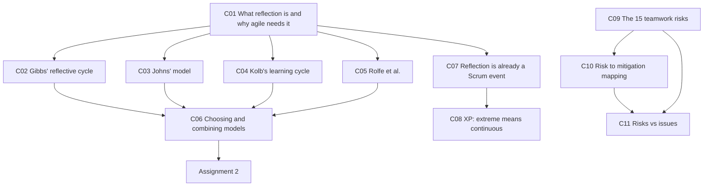
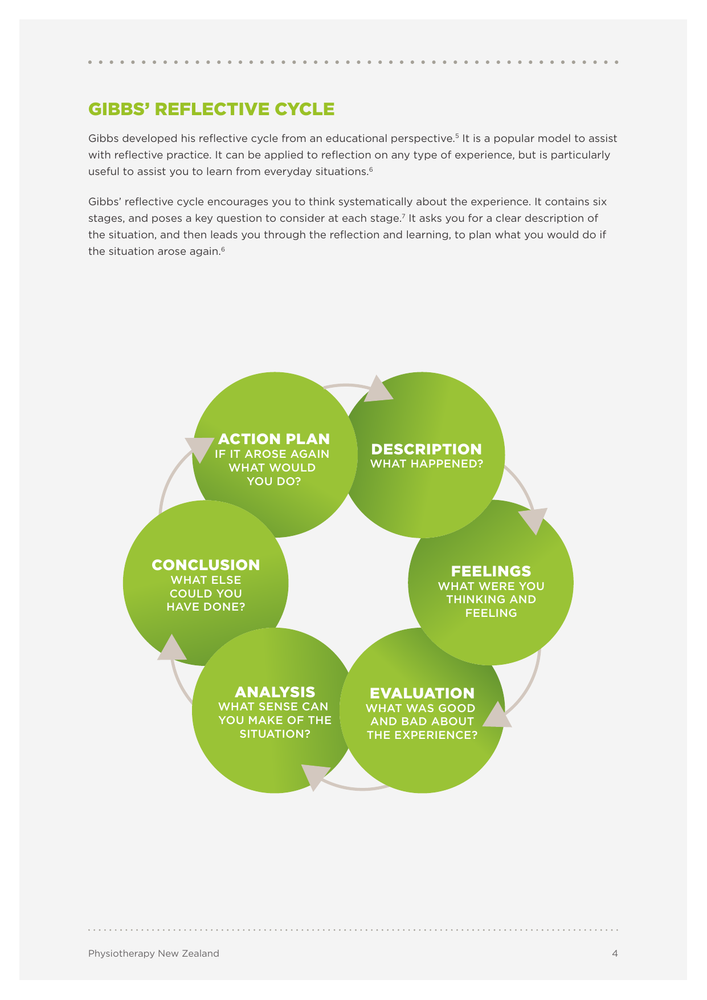
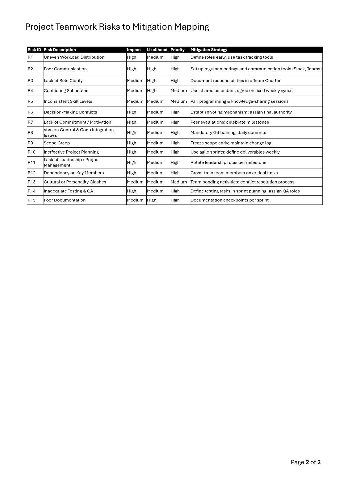

# 🪞 SOFTENG 761 Lecture 5 — Reflection models and teamwork risks

> [!abstract] Why this matters
> Two payloads, both immediately operational. **First**, four formal models for writing a reflection — because [[../../Assignment2/notes/A2-brief|Assignment 2]] is a reflection and the lecturer says outright which phase of which model *is* the assignment question. **Second**, the **15 teamwork risks** that break student software projects, each with a mitigation, an impact and a likelihood.
>
> The risks arrive the same week your team and project are allocated. That timing is deliberate.

> [!info] Sources
> **Transcript:** `Lecture_5_(A2_reflection__project_teamwork_risks_and_more)_previous_video…txt`, ~7,500 words. Auto-generated.
> **Handout:** `resources/Models-of-reflection.pdf` — 11 pages, **Physiotherapy New Zealand**. On Canvas under Modules 1 & 2.
> ⚠ **Two further handouts live in `../../Lecture6/resources/`** — `Teamwork_Risks_and_Mitigation_Strategies.pdf` and `Project_Risk_Quiz.pdf`. **They are L5 content**, walked through in this lecture; they are filed under L6 because that's where they were downloaded. Same shared-resource pattern as `Lecture2/resources/canvas-modules-1-and-2-pages.md` — see the syllabus map.
>
> *Prerequisites: [[../../Lecture3/notes/L3-notes|L3-C13]] (teamwork risks, first pass) · [[../../Lecture4/notes/L4-notes|L4]] (the simulation, which this lecture keeps referring back to).*

> [!warning] Source-quality caveat — this was a video, not a live lecture
> The filename says **"previous video"**, and in [[../../Lecture6/notes/L6-notes|L6]] the lecturer confirms: *"Sorry I couldn't be there last time. I hope you got the video and you watched it."* So L5 was delivered as a recording, with a live cohort in the room responding to it.
>
> Consequences: the transcript contains **long unattributable student exchanges**, and the lecturer's screen-sharing narration (*"let me download it and then open it separately"*) means several documents are described rather than shown. Where the handout PDFs exist, they are authoritative over the transcript.

## 🗺 Concept map

---

## 🔍 L5-C01 · What reflection is, and why agile requires it

> [!question] Cue questions
> - Define reflection in one sentence.
> - What is the three-part temporal structure of reflection?
> - Why is reflection an agile concern rather than a study-skills concern?

> [!quote] The definition, from the handout and repeated verbatim in the lecture
> **"Reflection is the conscious exploration of an experience. In order to learn from an experience, you need to reflect on it."**

The temporal structure the lecturer gave:

> **"Learn from the past. Then apply your knowledge in the present so that you have a better future."**

> [!important] Why this is agile content, not generic study advice
> *"If you are not doing it, then there is a high chance that we won't improve our processes… **It is also one of the most important principles of agile software development** too, because we keep on focusing on improving our development steps and the overall process."*
>
> This lands directly on [[../../Lecture3/notes/L3-notes|L3-C03]]'s twelfth principle (the team reflects at regular intervals and tunes its behaviour) and on [[../../Lecture3/notes/L3-notes|L3-C10]]'s **adaptation** pillar. Reflection is not adjacent to Scrum; it *is* the adaptation mechanism.

> [!tip] Why a *structured* model helps
> From the handout: *"As a learning tool, reflection may be **more powerful when you use a structure or framework** to guide you… All of them can assist you to move out of **'auto-pilot'** in your practice. Because reflection is ongoing, and you take the learning from one reflection forward, **most of the models are represented as a cycle**."*
>
> The lecturer's own admission that unstructured reflection doesn't happen: *"If you are driving and the traffic light has gone yellow… **how many of us actually reflect on this after reaching home?** We do not."*

*📄 Source: handout p.3 · transcript*

---

## 🔄 L5-C02 · Gibbs' reflective cycle ⭐

> [!question] Cue questions
> - Name the six stages in order, with the key question at each.
> - Which stage is Assignment 2 actually asking for, and why?
> - Give the four cue questions under Analysis.

> [!important] The six stages (handout p.4)
> | Stage | Key question |
> |---|---|
> | **Description** | **What happened?** |
> | **Feelings** | **What were you thinking and feeling?** |
> | **Evaluation** | **What was good and bad about the experience?** |
> | ⭐ **Analysis** | **What sense can you make of the situation?** |
> | **Conclusion** | **What else could you have done?** |
> | **Action plan** | **If it arose again, what would you do?** |
>
> Developed from an **educational** perspective; *"particularly useful to assist you to learn from **everyday situations**."*

> [!quote] The cue questions (handout p.5)
> | Phase | Cue questions |
> |---|---|
> | **Description** | What did you do? Where did it happen? Who was involved? What was the context? |
> | **Feelings** | Describe your internal thoughts and feelings **before, during and after** the event |
> | **Evaluation** | Were there things that were difficult? Interesting? Surprising? Upsetting? Provide some **judgement** about the event and its possible consequences |
> | ⭐ **Analysis** | • What sense can you make of the situation? • **How do past experiences compare to this?** • **How does theory or evidence fit with this?** • How did your involvement affect the outcome? |
> | **Conclusion** | What insights, thoughts or conclusions about your role can you now take away? What have you learnt for the future? |
> | **Action plan** | What are some **indicators** that would help you recognise a similar event? What changes would you make? |

> [!important] ⭐ The Analysis phase *is* Assignment 2
> The lecturer said this explicitly, twice:
>
> > *"For analysis part, I'm picking the most important one here. **What sense can you make of the situation? How do past experiences compare with this?** — which is also asked where you are in assignment two. How does theory or evidence fit this? And how did your involvement affect an outcome? **So that analysis part is what is being asked in assignment two.**"*
>
> Compare the [[../../Assignment2/notes/A2-brief|A2]] rubric's 3-mark line: *"Reflection on previous development experiences and their outcomes; **compare them meaningfully** with how the outcome might have changed if an Agile approach was followed."* That is Gibbs' Analysis with "theory" instantiated as Agile.
>
> And the caveat: *"Of course, you need to include the other elements, because when you go to the past experience, you will also talk about the **feelings** around that past experience, and then your **evaluation**, and so on."* Analysis is where the marks are; it isn't the whole report.

> [!example] The lecturer's everyday worked example — online shopping
> **Description** you searched for an item and bought it · **Feelings** what you were thinking as you ordered · **Evaluation** the quality of the item *and* the quality of the ordering process · **Analysis** comparing it against a purchase from a different site last month · **Conclusion** "I won't buy from this site again" · **Action plan** what you'll do next time.
>
> Then the escalation that makes it a software problem: *"When you are thinking about software development… it is going to be a slightly different approach, because **you might be doing that for someone else**. So the ultimate product might be for someone else, and **that someone else might be important in deciding what is good and what is bad**."*
>
> That's the Product Owner ([[../../Lecture1/notes/L1-notes|L1-C04]]) entering the reflective cycle as the arbiter of the Evaluation stage.

*📄 Source: handout pp.4–5 · transcript*

---

## 🧭 L5-C03 · Johns' model of structured reflection

> [!question] Cue questions
> - Name the five phases.
> - What are the two directions Johns insists you look?
> - What does Johns add that Gibbs doesn't?

> [!important] The five phases (handout pp.6–7)
> | Phase | Cue questions |
> |---|---|
> | **Describe the experience** | Describe the experience and the significant factors involved |
> | **Reflection** | What was I trying to achieve? What were the consequences of my actions? How did I feel **while it was happening**, and why? **If another person was involved, how did they feel?** |
> | **Influencing factors** | What internal factors, my own knowledge, and external factors affected my decision making and actions? |
> | **Could I have dealt with it better?** | What other choices did I have? **Did I act for the best?** What would the consequences of those other actions have been — for myself? for others? |
> | **Learning** | What will change because of this? How do I now feel about it? **How has this experience changed my ways of knowing?** |

> [!important] Look inwards **and** look outwards
> > *"Johns suggested that when you reflect, you need to make sure that you **'look inwards'** (consider your own thoughts and feelings), and **'look outwards'** (consider the actual incident or situation, plus things like your actions in the situation **and whether they were ethical**, and the external factors that influenced you)."*
>
> Originally developed **for nursing**, and it shows: the *"how did the other person feel"* and *"did I act for the best"* questions carry an ethical weight the other models don't.

> [!tip] Four ways of knowing
> Johns' Learning phase asks how the experience changed your knowing across: **empirics** (scientific) · **ethics** (moral knowledge) · **personal** (self-awareness, your own beliefs and values) · **aesthetics** (the art of what we do, our own experiences).

> [!example] The lecturer's ethics digression — energy efficiency of code
> *"Often in undergraduate courses we do not talk much about this factor, but when we get to the higher stages of degree programmes it becomes important. **During your careers, at every stage you are going to have questions which are ethical in nature.** There will be situations when you do not want to do something because it is not ethically correct, but because it is happening, everyone is doing that, you got to do it."*
>
> His example, from a project he supervised ~8–9 years ago on **the energy efficiency of systems**: *"When we are coding, we are not thinking about how energy efficient our code is going to be… how much CPU it is going to incur, and how will it ultimately act — for example, the carbon footprints."*
>
> The concrete decision: your team has accepted a complex piece of code that could easily be simplified. *"You need to take some time to think ethically about whether to go with that complex piece or not… **From the outset, the biggest factor is time**, and you have to go with your team. You have the next tasks at hand."* His instruction: *"Try to make genuine decisions in those situations."*
>
> Note the shape — the ethical pressure is created by **time and team conformity**, not by anyone acting badly. That's the version you'll actually meet.

> [!tip] Johns also recommends a second person
> *"Involving someone else (e.g., a supervisor or mentor) to support you in your reflection can make your reflection **more powerful** than if you engage in reflection by yourself."*

*📄 Source: handout pp.6–7 · transcript*

---

## ♻️ L5-C04 · Kolb's learning cycle

> [!question] Cue questions
> - Name the four stages, with both the plain and the technical name for each.
> - What does Kolb add that the other models don't?
> - Where can you enter the cycle?

> [!important] The four stages (handout pp.8–9)
> | Plain name | Technical name |
> |---|---|
> | **Doing it** | **Concrete experience** |
> | **Reflecting on the experience** | **Reflective observation** |
> | **Making sense of the experience** | **Abstract conceptualisation** |
> | **Planning what to do** | **Active experimentation** |
>
> *"According to Kolb, **the learning cycle can be entered at any stage**"* — and because each pass feeds the next, *"the cycle can be considered to be a **spiral**."*

Expanded (handout p.9): **Implementation** — participation, doing, applying new learning · **Reflecting on outcomes** — saying what you did without being judgemental, observing the process · **Making sense** — making judgements, what worked well and why, what didn't and why, **linking theory with what you did** · **Planning** — what to do next time, setting goals, identifying criteria for success.

> [!important] ⭐ What makes Kolb different: **drawing generalisations**
> > *"The primary area where it differs from the others is **drawing generalisations**."*
>
> The lecturer's worked chain: you gathered requirements a certain way; some experiences were good and some bad; you compare against a **previous** project and find the good ones were good there too — *"so that will help you **generalise** those good experiences,"* and you'll apply them again in future.
>
> And the falsification step, which is the interesting half: *"What may happen when you do the next project — those generalisations **may change**… the good experiences might turn into bad experiences, and so **they won't be generalisations anymore**. So we take that lead and then make our generalisations for any future projects accordingly."*

> [!example] Design patterns are generalised experience
> *"Software design patterns is an example of design generalisations. People have gone through these experiences of solving design problems in specific ways, and because they generated good experiences, they have **generalised those experiences in the form of design patterns**. Then there may be design problems where those patterns are **not that applicable** — which can give you an indication that **this generalisation doesn't work in my situation**."*
>
> A design pattern is a reflection that survived enough iterations to get a name. That reframing is worth keeping.

> [!tip] Kolb is the right pick if you have more than one past project
> Its distinguishing move — comparing across experiences to extract something durable — is exactly what a multi-project A2 needs.

*📄 Source: handout pp.8–9 · transcript*

---

## ❓ L5-C05 · Rolfe, Freshwater and Jasper

> [!question] Cue questions
> - Give the three questions.
> - What does each cluster of probing questions do?
> - Why is this model suited to a novice *and* an expert?

> [!important] Three questions (handout p.10)
> > **What? → So what? → Now what?**
>
> | | Purpose | Example probes |
> |---|---|---|
> | **What…** | Questions to help with the **description** of the event | …is the problem? …was my role in this situation? …was I trying to achieve? …actions did I take? …was the response of others? …were the consequences (for others, for myself)? …feelings did it evoke? …was good or bad about the experience? |
> | **So what…** | Questions to help with the **understanding** of the event | …does this tell me about me, about others, about our relationship, about the model/approach I am using, about my attitudes? …was going through my mind as I acted? …did I base my actions on? …other knowledge can I bring (experience, personal, scientific)? …could I have done to make it better? …is my new understanding? …broader issues arise? |
> | **Now what…** | Questions to help with **what can be done to improve** | …do I need to do in order to make things better / stop being stuck / resolve the situation / feel better / get on better? …broader issues need to be considered if this action is to be successful? …might be the **consequences of this action**? |
>
> Developed from a **personal/professional development** perspective. *"The framework can be used by anyone, from novice to expert, because **different levels of questions can be reflected on**."*

> [!tip] You already know this vocabulary
> **"So what?"** is [[../../Lecture2/notes/L2-notes|L2-C02]]'s rationale test, arriving from a completely different discipline. The parallel is not a coincidence — both are asking *why should anyone care about this beyond you*.

*📄 Source: handout p.10*

---

## 🎛 L5-C06 · Choosing, naming, and combining models

> [!question] Cue questions
> - Are you marked against a model?
> - What must you do if you follow one?
> - Are hybrids allowed?

> [!important] The three rules the lecturer gave
> 1. **You need not use one.** *"You need not do that… **we are not going to mark you against these models**, but here is some knowledge that will definitely help you in writing your reflections."*
> 2. **If you use one, name it.** *"You may look at one of these models and decide to follow one of these models for writing your reflection submissions. And if you do that, then **do refer to them in your submission — that I did follow this specific reflection [model]**."*
> 3. **Hybrids are explicitly fine.** *"You can also **pick a few things from this model, a few things from that model**, and then apply them as a unique or custom model."*

> [!tip] From the handout, on choosing
> *"It is important that you choose the model that works best to help you to learn from your reflection. **You may need to try one or two before you find a model that resonates with you.**"*

> [!important] They converge more than they differ
> *"You'll realise that **more or less they are talking about similar aspects**, because all the models will have a step that will ask you to think about the past, and then it will ask you to apply that knowledge in future."*
>
> So the choice is about which structure helps *you* write, not about which is correct.

| Model | Distinctive move | Reach for it when |
|---|---|---|
| **Gibbs** | A dedicated **Analysis** stage | You want the closest fit to the A2 rubric |
| **Johns** | Look inwards **and** outwards; ethics; "did I act for the best?" | Your experience turned on a **decision** |
| **Kolb** | **Drawing generalisations** across experiences | You have **more than one** past project |
| **Rolfe** | Three questions, scalable depth | You are short on time |

*📄 Source: handout p.3 · transcript*

---

## 🔁 L5-C07 · Reflection is already a Scrum event

> [!question] Cue questions
> - Which two Scrum events contain reflection, and how do they differ?
> - What does the lecturer say you must do *in addition* to the team events?
> - Which Scrum event handles teamwork risks specifically?

> [!important] Team reflection lives in two events
> *"One major event where we do it is the **sprint retrospective**. After each sprint, the team retrospects about what went right, what went wrong — **as well as sprint planning**. So these two events would have that reflection."*

> [!warning] But team reflection is not enough
> *"It will certainly be a **team-level** reflection, where **you will be expected to keep on doing individual reflection as you go**. So that must always carry on."*
>
> The retrospective is a team mechanism ([[../../Lecture4/notes/L4-notes|L4-C10]]); individual reflection is a parallel obligation that no event schedules for you.

> [!important] Retrospective vs review — the distinction, stated again
> From the risk-quiz walkthrough (Q20 — *which Scrum event is most effective to reflect on risks like uneven workload and communication gaps?*):
>
> > *"All the discussions around **how the sprint went** — that is, **about the process** of the sprint that has just concluded — will be done as part of the **sprint retrospective**. Whereas the **sprint review** will actually have the **sprint demo**. So what you have created or built during that sprint will be demonstrated to the Product Owner."*
>
> **Retrospective = process. Review = product.** Teamwork risks are process, so they belong in the retrospective. Reinforces [[../../Lecture3/notes/L3-notes|L3-C12]].

*📄 Source: transcript*

---

## ⚡ L5-C08 · Extreme Programming — "extreme" means continuous

> [!question] Cue questions
> - How many practices does XP comprise?
> - Why is it called *extreme*?
> - Work the code-review example through.

> [!important] The definition to use in [[../../Assignment2/notes/A2-brief|A2]]
> *"Extreme programming is an agile software development methodology that comprises around **10 to 15 good development practices**."* Named: **test-driven development · pair programming · continuous integration · refactoring**. *"All these practices have actually formally come from extreme programming."*

> [!quote] Why "extreme"
> *"It recommends that **whatever good practices are implemented in the traditional software development methodologies, we use them — and we use them in an extreme manner.**"*

> [!example] The worked example — code review → pair programming
> *"If traditional development has a good practice of **reviewing code** regularly — maybe every day, or after every sprint — **Extreme Programming will recommend that you use pair programming so that the code review can be done continuously, all the time**. Because the concept of pair programming is that one developer is actually coding, and the other is keeping on reviewing what they are doing."*
>
> And the tie-back: *"**So that means it is a kind of continuous reflection as well.**"*

> [!tip] Why this sits in the reflection lecture
> XP appears here, not in [[../../Lecture3/notes/L3-notes|L3]], because pair programming is the reflection cycle compressed to a few seconds. It's also the cleanest thing to write about for A2's 1-mark "Kanban, XP or other" criterion — you can explain *why* it's called extreme rather than just listing practices.

*📄 Source: transcript*

---

## ⚠️ L5-C09 · The 15 teamwork risks

> [!question] Cue questions
> - Name as many of the 15 as you can. Which two does the lecturer single out?
> - What does he say about members who *volunteer* for extra workload?
> - Whose responsibility is risk identification?

> [!quote] The handout list (`Teamwork_Risks_and_Mitigation_Strategies.pdf`, p.1)
> | # | Risk | Consequence given |
> |---|---|---|
> | 1 | **Uneven Workload Distribution** | Some do most of the work while others contribute minimally (**"free riders"**). Leads to **burnout and resentment** |
> | 2 | **Poor Communication** | Misunderstandings from unclear or infrequent communication; **delayed feedback loops cause rework and missed deadlines** |
> | 3 | **Lack of Role Clarity** | Ambiguity over who is responsible for what; overlapping or missed responsibilities create conflicts or gaps |
> | 4 | **Conflicting Schedules** | Difficulty finding common meeting times; asynchronous collaboration challenges and delays |
> | 5 | **Inconsistent Skill Levels** | Skill gaps hinder progress; **stronger members have to train others, slowing development** |
> | 6 | **Decision-Making Conflicts** | Disagreements on design, tech stack or direction; **can escalate into interpersonal conflicts** |
> | 7 | **Lack of Commitment / Motivation** | Members prioritise other courses, jobs, personal interests; procrastination and last-minute work |
> | 8 | **Version Control & Code Integration Issues** | Inexperience with Git causes merge conflicts; **overwriting others' work or corrupting the codebase** |
> | 9 | **Scope Creep** | Features added beyond agreed scope; overwork and project incompletion |
> | 10 | **Ineffective Project Planning** | Poorly defined timelines and **unrealistic estimates**; tasks unfinished near deadlines |
> | 11 | **Lack of Leadership / Project Management** | Nobody ensuring progress, resolving disputes or tracking deliverables |
> | 12 | **Dependency on Key Members** | Over-reliance on a few; risk spikes if they become unavailable (illness, emergencies) |
> | 13 | **Cultural or Personality Clashes** | Differences in work styles, communication preferences, cultural expectations |
> | 14 | **Inadequate Testing & QA** | Testing skipped under time pressure; **bugs in the final deliverable, affecting project grading** |
> | 15 | **Poor Documentation** | Code comments and user guides not maintained; others can't understand or continue the work |

> [!important] The two he singles out
> - **Poor communication (#2)** — *"I've already indicated right from lecture one that **poor communication has been identified as the most common cause of risks becoming issues**."*
> - **Unrealistic estimates, within #10** — *"the most important one is unrealistic estimates. Generally we should **pick a deadline slightly later than what you would generally think is achievable**."*

> [!warning] The counter-intuitive one — volunteering for more work is a risk
> *"Sometimes the team members might **insist on having more workload themselves** because they might think they want to learn more. But at the end, **it leads to burnout**, which you do not want in your team."*
>
> Uneven workload isn't only about free riders. Someone eagerly taking on too much creates the same single-point-of-failure as #12.

> [!warning] The one-week sprint makes non-responsiveness fatal
> His example from another course: a three-person team where two members had been trying to reach the third **for two weeks**. *"If you apply that situation to your course and the project schedule that you have, **where the sprint length is just one week — you simply cannot afford it.** Not as a team, not as an individual. **Everyone has to be proactive.**"*
>
> And the priority order: *"Whether you are doing your duties is a separate matter. **The first thing that you must ensure is that you are reachable.**"*

> [!important] Risk identification is everyone's job
> On #7: *"It is very important to pick that up early… **and this is not a responsibility of the Scrum Master. It is the responsibility of everyone to keep identifying the risks within the team.**"*
>
> The first move when you spot it: *"**The first point of action should always be talking to them** — the rest of the team members must talk to them, and then they go on from there."*
>
> Consistent with [[../../Lecture4/notes/L4-notes|L4-C11]] (everyone is a leader and there is no leader) and [[../../Lecture1/notes/L1-notes|L1-C03]] (the Scrum Master is not a project manager).

> [!tip] Other per-risk notes from the walkthrough
> - **#3 role clarity** — *"**Do not start working on your part until you have a clear understanding of what you have been allocated.** If you have doubts, discuss with your team members until you have that clarity."* He links the [[../../Lecture4/notes/L4-notes|L4]] team that ignored a requirement to *both* #2 and #3.
> - **#4 conflicting schedules** — *"Sometimes some of the members want to hide some of that information. **Please do not do that.**"* And if you genuinely don't know your availability, say so: *"whatever obstructions or restrictions you have, make sure to put that to your team."*
> - **#5 skill levels** — ties to project bidding: *"we assume that if given the five choices you actually did discuss in your teams **who is going to handle what skill** required for a specific project that you are bidding on."*
> - **#6 decision conflicts** — reframed as a *positive* signal: *"that indicates that everyone is trying to contribute… **that sounds positive.**"* The rule: *"**Never take it to the personal level**, because that is perhaps one of the most important aspects of a professional life."*
> - **#9 scope creep** — *"Every member of the team will be pushing work to the common repo. So **keep a visual on what is being updated**."*
> - **#11 leadership** — *"although in agile and Scrum there is no leader, **there should still be a sense of leadership in each member**. There will always be a leadership element for specific tasks that have been allocated to you."*
> - **#15 documentation** — *"Something documented should be **understood by each member of the team at equal levels, in the same manner**."*

> [!example] The student answer that landed
> Asked whether anyone had lived these, a student described leaving testing to the end: *"we were trying to focus on the development… then suddenly we have the rush of running the tests in a day, and something fails at the last moment."* The lecturer's response tied it to **TDD** and back to the [[../../Lecture4/notes/L4-notes|L4]] simulation, where acceptance criteria were given and largely not used.
>
> Then the Product Owner point: *"the Product Owner is going to be critical of whether your sprint products are acceptable **from the acceptance criteria perspective**. And we already know the difference between what the product owner **says** and what they **need**."* ([[../../Lecture2/notes/L2-notes|L2-C05]])
>
> And the reveal about the L4 target: *"what we said was **slightly different from what we wanted**, because the thing you didn't know was that I was intending to show the target **on the projector**, and that target would be slightly **higher than your line of sight**."* — [[../../Lecture4/notes/L4-notes|L4-C04]] and [[../../Lecture4/notes/L4-notes|L4-C12]] confirmed from the other side.

*📄 Source: `Teamwork_Risks_and_Mitigation_Strategies.pdf` p.1 · transcript*

---

## 🛠 L5-C10 · The risk-to-mitigation mapping

> [!question] Cue questions
> - Which risks are rated **High** impact **and** **High** likelihood?
> - Give the mitigation for R6, R8, R12.
> - What's the difference between the mitigation for R1 and for R3?

> [!important] The full mapping (`Teamwork_Risks_and_Mitigation_Strategies.pdf`, p.2)
> | ID | Risk | Impact | Likelihood | Priority | Mitigation |
> |---|---|---|---|---|---|
> | **R1** | Uneven Workload Distribution | High | Medium | **High** | **Define roles early, use task tracking tools** |
> | **R2** | Poor Communication | **High** | **High** | **High** | **Set up regular meetings and communication tools (Slack, Teams)** |
> | **R3** | Lack of Role Clarity | Medium | High | **High** | **Document responsibilities in a Team Charter** |
> | **R4** | Conflicting Schedules | Medium | High | Medium | **Use shared calendars; agree on fixed weekly syncs** |
> | **R5** | Inconsistent Skill Levels | Medium | Medium | Medium | **Pair programming & knowledge-sharing sessions** |
> | **R6** | Decision-Making Conflicts | High | Medium | **High** | **Establish voting mechanism; assign final authority** |
> | **R7** | Lack of Commitment / Motivation | High | Medium | **High** | **Peer evaluations; celebrate milestones** |
> | **R8** | Version Control & Code Integration | High | Medium | **High** | **Mandatory Git training; daily commits** |
> | **R9** | Scope Creep | High | Medium | **High** | **Freeze scope early; maintain change log** |
> | **R10** | Ineffective Project Planning | High | Medium | **High** | **Use agile sprints; define deliverables weekly** |
> | **R11** | Lack of Leadership | High | Medium | **High** | **Rotate leadership roles per milestone** |
> | **R12** | Dependency on Key Members | High | Medium | **High** | **Cross-train team members on critical tasks** |
> | **R13** | Cultural or Personality Clashes | Medium | Medium | Medium | **Team bonding activities; conflict resolution process** |
> | **R14** | Inadequate Testing & QA | High | Medium | **High** | **Define testing tasks in sprint planning; assign QA roles** |
> | **R15** | Poor Documentation | Medium | High | **High** | **Documentation checkpoints per sprint** |

> [!important] Read the table, not just the rows
> - **R2 is the only High/High.** Everything else is at most High impact with Medium likelihood, or Medium impact with High likelihood. That matches *"poor communication has been identified as the most common cause of risks becoming issues"*.
> - **Three risks are Medium priority** — R4, R5, R13. Everything else is High. The two "soft" risks (skills, personality) are the ones the table treats as least urgent, which is arguable and worth noticing.
> - **R1 and R3 have different mitigations for a similar-sounding problem.** R1 (uneven workload) → *define roles early + task tracking*. R3 (role clarity) → *document responsibilities in a **Team Charter***. One is a tool problem, one is a document problem.

> [!tip] Mitigations that survive as A2 or project material
> **Voting mechanism (R6)** — the lecturer connects it straight to [[../../Lecture4/notes/L4-notes|L4]]'s story-point estimation: *"generally there's a voting mechanism where each team member will have these flash cards showing the numbers of points. The **Scrum Master will gently facilitate this**… they display them together, and then there is a discussion if there is a variation, and they keep on discussing **until they get to one specific estimate**."* That's planning poker, described without the name.
>
> **Celebrating milestones (R7)** — with a caveat: *"throw a party after sprint one is successfully complete, but **do not spend the whole next week partying. That will spoil your next sprint.**"*
>
> **Communication tool choice (R13)** — *"there may be members who want to use Discord, others want to use Slack or maybe emails. **So do decide on one platform.**"*

> [!warning] The list is not exhaustive and is not the last word
> *"There may be many others. **Your team might come up with other ideas. That's up to your team.**"* And: *"When you go back and meet your team, **do share these risks with your other team members. Discuss them within your team so that there are less issues later.**"*

*📄 Source: `Teamwork_Risks_and_Mitigation_Strategies.pdf` p.2 · transcript*

---

## 🚦 L5-C11 · Risks vs issues — and the 20-question quiz

> [!question] Cue questions
> - State the distinction between a risk and an issue, and the verb that goes with each.
> - What is the quiz for, and is it assessed?
> - What does the lecturer say is the *real* danger with risks?

> [!important] ⭐ The distinction, verbatim
> > *"**As long as you have not started things, they are risks** — but then there is a potential that they will be converted into real issues, and then you will have to resolve those issues. So **the risks are mitigated and the issues are resolved.**"*
>
> | | Risk | Issue |
> |---|---|---|
> | Status | Hasn't happened yet | Has happened |
> | Verb | **Mitigate** | **Resolve** |
>
> And the goal: *"What you want ideally is, **if there are risks, they do not become real issues.**"*

> [!warning] The real danger is failing to *recognise* a risk
> > *"There would be a tendency to **not look at a certain situation as a risk when it is actually a risk**. So this information should help you at least **identifying those situations as risks**."*
>
> That's the point of the quiz — not the answers, the pattern-matching.

> [!tip] `Project_Risk_Quiz.pdf` — 20 questions, **not** a Canvas quiz
> *"It is **not a Canvas quiz**. It has 20 questions that will help you validate what you have learned about risks and mitigation strategies. It doesn't cover everything that is listed on that document."* Not assessed. Also: *"the answers to these questions of course slightly vary, because there could be so many other ways to mitigate risks."*
>
> Answers walked through on the recording: **Q1** B (scope creep = adding features beyond the agreed range) · **Q2** C (task board, e.g. Trello) · **Q3** C (poor communication) · **Q4** A (lack of role clarity) · **Q5** B (Git and GitHub) · **Q6** B (democratic voting mechanism) · **Q7** D (cross-training on critical modules) · **Q8** C (inadequate QA) · **Q9** B (different work styles and communication preferences) · **Q10** A (weekly sprints with retrospectives) · **Q11** B (shared calendars, fixed weekly syncs) · **Q12** C (difficulty understanding or continuing work) · **Q13** B (dependency on key members) · **Q20** C (**sprint retrospective**).
>
> **Q14–Q19 were left for you** — *"I'll leave the rest to you."* Q15, Q16, Q17, Q18 and Q19 are unanswered on the recording.

*📄 Source: `Project_Risk_Quiz.pdf` · transcript*

---

## 👤 Bonus — the people behind the ideas

Not examinable, but the lecturer showed portraits and asked the class to name them. Worth 30 seconds.

| Person | Contribution |
|---|---|
| **Ken Schwaber** and **Jeff Sutherland** | Among the **17 authors of the Agile Manifesto**; *"the first two played an instrumental part in inventing **Scrum** as well"* |
| **Martin Fowler** | Also an Agile Manifesto author; **code smells** and **refactoring** |
| **Robert C. Martin ("Uncle Bob")** | Agile Manifesto author; ***Clean Code*** — *"lists many code smells and refactoring activities"* |
| **Taiichi Ohno** (Toyota) | Originated **Kanban**, 1950s or earlier — *"although that was not how it was defined to be applicable to software development"* |
| **David Anderson** | **Applied Kanban to software development** |

> [!quote] The closing quotes
> - *"A working product at the end of the sprint is [the heart] of Scrum."* — **"By the end of the sprint you must have a working product."**
> - ⭐ *"If you adopt only one agile practice, let it be **retrospectives**."* — **"If you are not doing retrospectives, you are not doing agile at all."**
> - *"**Continuous improvement is better than delayed perfection.**"*
> - *"**Agile is an attitude, not a technique with boundaries.**"*
> - *"The best way to get a project done faster is to **start sooner**. And the only way to go fast is to **go well**."* — Robert C. Martin. The lecturer's gloss: **start early, and keep testing and verifying, because that is the only way to know whether you're going well.**
> - *"**It doesn't matter how good you are today — if you're not better next month, you are no longer agile.**"*

---

## ✅ Summary — the 8 things that matter

1. **Reflection is "the conscious exploration of an experience"** — and it's an agile obligation, not a study skill, because adaptation is a Scrum pillar.
2. **Gibbs: description → feelings → evaluation → analysis → conclusion → action plan.** ⭐ **The Analysis phase is what A2 asks for**, and *"how do past experiences compare to this?"* is the rubric line verbatim.
3. **Johns** adds looking **inwards and outwards**, including whether your actions were **ethical**. **Kolb** adds **drawing generalisations** across projects — design patterns are the canonical example. **Rolfe** is *what? / so what? / now what?*
4. **You aren't marked against a model. If you use one, name it. Hybrids are fine.**
5. **Reflection already has a home in Scrum** — sprint retrospective and sprint planning — but **individual reflection is a parallel obligation**. Retrospective = process; review = product.
6. **XP = traditional good practices taken to the extreme.** Code review every sprint becomes **pair programming**, i.e. review continuously — which is continuous reflection.
7. **15 teamwork risks with mitigations.** **R2 poor communication is the only High/High** and *"the most common cause of risks becoming issues"*. Volunteering for extra work is a risk too. **Risk identification is everyone's job, not the Scrum Master's.**
8. ⭐ **Risks are mitigated; issues are resolved.** The failure mode is not recognising a risk as a risk.

---

## 🧪 Self-test

> [!question]- 11 free-recall questions
> 1. Define reflection in one sentence, and give the three-part temporal structure the lecturer used.
> 2. Why is reflection an agile concern? Name the principle and the pillar it maps to.
> 3. Name Gibbs' six stages with the key question at each.
> 4. Give the four cue questions under Gibbs' Analysis. Which one is the A2 rubric line?
> 5. What are Johns' two directions of looking, and what does each cover? What does Johns add that Gibbs doesn't?
> 6. Name Kolb's four stages in both plain and technical form. What is Kolb's distinguishing move, and how do design patterns illustrate it?
> 7. Give Rolfe's three questions and what each cluster is for.
> 8. You use a reflection model in A2. What are you obliged to do, and are you marked on the choice?
> 9. Which Scrum event handles teamwork risks, and why not the other one? What obligation exists outside both events?
> 10. Why is XP called "extreme"? Work the code-review example through, and say what it has to do with reflection.
> 11. State the risk/issue distinction with the verb for each. Which risk is the only High-impact-and-High-likelihood one, and what's its mitigation?

---

> [!info]- Related notes
> - `L5-summary.md` · `L5-flashcards.tsv` · `../context/admin-and-dates.md`
> - **Feeds directly into:** [[../../Assignment2/notes/A2-brief|Assignment 2 — Agile Reflection]]
> - **Comes from:** [[../../Lecture3/notes/L3-notes|L3-C13]] (teamwork risks, first pass) · [[../../Lecture4/notes/L4-notes|L4]] (the simulation this lecture keeps citing)
> - **Next:** [[../../Lecture6/notes/L6-notes|L6 — Assignment 3 and evidence-backed rationale]]
