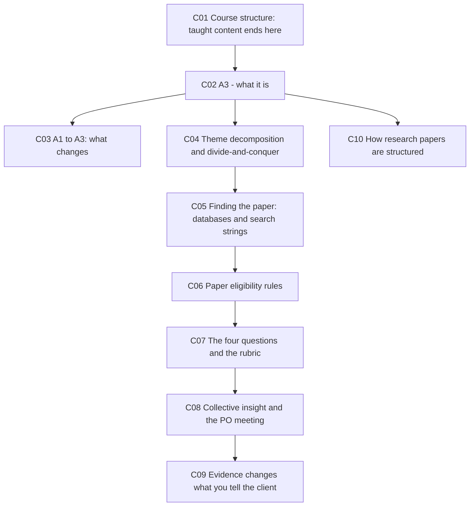
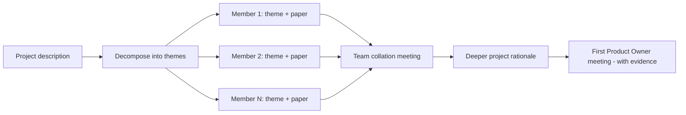

# 📚 SOFTENG 761 Lecture 6 — Assignment 3 and the evidence-backed rationale

> [!abstract] Why this matters
> **The last formal lecture of the course.** Everything after this is project work — nine weeks of it, ending in a week 11 presentation.
>
> The content is one thing: **Assignment 3**, which is [[../../Assignment1/notes/A1-brief|A1]] done properly. Same rationale skill, but now on **your allocated project**, backed by **a real research paper**, split by **theme** across your team, and aimed at a specific outcome — walking into the first Product Owner meeting with evidence behind every claim.

> [!info] Sources
> **Transcript:** `[405-422]_^SOFTENG_761_Lecture — Wed 05 Aug 10:04 AM`, ~6,300 words. Auto-generated.
> **No slide deck** in `resources/`. The A3 brief was shown on screen from Canvas and walked through; everything below is reconstructed from speech plus the example project the lecturer opened.
> ⚠ `Teamwork_Risks_and_Mitigation_Strategies.pdf` and `Project_Risk_Quiz.pdf` sit in this folder but are **[[../../Lecture5/notes/L5-notes|L5]] content** — see that note.
>
> *Prerequisites: [[../../Lecture2/notes/L2-notes|L2]] — rationale, purpose, justification. [[../../Assignment1/notes/A1-brief|A1]] — the shallow version of this task.*

> [!warning] Source-quality caveat
> The second half is a **workshop**: 20 minutes of in-room activity, with the lecturer moving between teams. Roughly the last third of the transcript is fragmentary cross-talk about individual projects, much of it unattributable and some of it unintelligible. **The A3 walkthrough itself is intact.** Student project chatter has been used only where the referent is clear.

## 🗺 Concept map

---

## 🗓 L6-C01 · Where the course goes from here

> [!question] Cue questions
> - What happens after this lecture?
> - When is sprint 1, and when is the final presentation?
> - What is the stated purpose of the first three weeks?

> [!important] The handover
> > *"This one is going to be your **last lecture, a formal lecture**… From next week, start working on your projects, because **this is primarily a project-based course**. The first three weeks were just meant to introduce you to agile so that you can get started within your teams. **Once you have been allocated your project and your teams, there's no point waiting.**"*

| Milestone | Timing |
|---|---|
| **Taught content** | Weeks 1–3 — ends with this lecture |
| Sprint planning | The following week |
| ⭐ **Sprint 1** | **Week 6** — *"that is when you guys will start presenting something **in pairs** from each team"* |
| Lecturer returns | **Week 6**, alongside Reza, to witness presentations |
| **Final presentation** | **Week 11** |
| Development window | *"three weeks of base content and then… **eight weeks of development**"* |

> [!warning] The mid-semester break is load-bearing
> *"Note that your **mid-sem break is going to be very important**. If you can work more during the mid-term break it will help you as well."*
>
> And: *"It is very important that you **work hard in the first few sprints**… **a well started is half done**, as they say."*

> [!tip] No more theory
> *"There will be **no other, like, theoretical course content** as such. You will be expected to work on the project from here on."*
>
> The lecture and lab spaces stay available for team meetings — *"this is a very nice space for conducting your team meetings."*

*📄 Source: transcript*

---

## 📖 L6-C02 · What Assignment 3 is

> [!question] Cue questions
> - State A3's three learning outcomes.
> - What is the one-sentence description of the task?
> - What is A3 *for*, beyond the marks?

> [!important] The task
> Take **your allocated project**, decompose it into **research themes**, take one theme, find a **research paper** on it, read it, and write a **reflection** on what it taught you about your project — with each claim you will later make to the Product Owner **backed by evidence**.

> [!quote] The three learning outcomes, as read out
> - **Go deeper into exploration of the project rationale** — *"and that can only be done through some research… research literature"*
> - **Discovering and demonstrating new insights** surrounding your topic area
> - **Critically studying the research literature** to reflect and accumulate **evidence** for what you claim to have understood about the problem

> [!important] ⭐ The purpose, in the lecturer's words
> > *"So that when you go and meet your clients, your Product Owner, you can **present them with that evidence** and show them that you know about the thing, that you have worked hard on getting all that initial knowledge, so that **they have more confidence in your team**."*
>
> A3 is a **credibility-building exercise for the first client meeting**, which happens to be worth marks. That framing explains most of its odd rules.

> [!important] You still have not met the client
> *"Whether it was Assignment 1 rationale or Assignment 3 rationale, **you have still not met the client**. So we are still doing our research or **preparing ourselves before meeting the Product Owner**."*
>
> This is [[../../Lecture2/notes/L2-notes|L2-C06]] — *ask WHY first; homework before the client meeting* — cashed out as an assessment.

> [!tip] It counts twice
> *"The really good thing is that **Assignment 3 is also going to contribute towards your project**. So you are going to score twice for the same thing."*

*📄 Source: transcript*

---

## 🔀 L6-C03 · A1 → A3: what changes

> [!question] Cue questions
> - Name the five things that change between A1 and A3.
> - What was the one A1 mistake the marker named — and why is it no longer a mistake?
> - What is the Gen AI position?

> [!important] The differences the lecturer stated explicitly
> | | **A1** | **A3** |
> |---|---|---|
> | **Topics** | Any **three** you pick from the catalogue | ⭐ **Your one allocated project** |
> | **Scope per person** | Whole topic | **One theme** of the project, different from your teammates' |
> | **Research** | Explicitly **not** a literature review | ⭐ **A real research paper**, attached to the submission |
> | **Format** | Bullet points, ~200 words per topic | **Full paragraphs**, 800–900 words |
> | **Solution talk** | **Banned outright** | ⚠ Avoid **specifics**, but ***purpose*** **is permitted** |

> [!warning] The A1 mistake that became legal
> While marking A1, the lecturer told the class:
>
> > *"We are already identifying a few problems… **some of you have mentioned one bullet point about the solution as well, when I specifically mentioned that there must not be anything at all about the solution.** That is something you **are allowed to do** when you do Assignment 3. You do not have to. But still, **you may bring in more purpose** to your project rationale."*
>
> **Purpose** is [[../../Lecture2/notes/L2-notes|L2-C03]] — the thing that links rationale to product, *proportionally*. So the boundary moves from "rationale only" to "rationale plus purpose", and still stops short of solution specifics. Getting that boundary right is worth marks.

> [!important] Gen AI — the middle position
> *"For Assignment 1 I specifically asked you and demonstrated how you can use ChatGPT. **You can still do it, but because it is still a reflection, try to limit the use of ChatGPT as much as possible.** However, there is still a section in your assignment where you would be expected to explain that — so if you end up using it, you can explain it there."*
>
> Between A1 (encouraged, 2 marks) and [[../../Assignment2/notes/A2-brief|A2]] (not for content). **Permitted but discouraged, and still declared.**

> [!tip] Voice
> *"It must be written as a **reflection**… You may use personal language. A more formal approach would be writing from a **third-person perspective**, but if you want to write from your personal angle you may do that, given you use professional language."*

*📄 Source: transcript*

---

## 🧩 L6-C04 · Theme decomposition and divide-and-conquer

> [!question] Cue questions
> - What is a theme, and how do you find them?
> - How are themes allocated across an eight-person team?
> - What is the stated reason for splitting by theme?

> [!important] The method
> > *"When you read the description, there will be a **major theme**, and then there will be **sub-themes** in that major theme… or maybe there are **multiple major themes**. Then divide those themes or sub-themes among team members."*
>
> The rationale: *"We are trying to **attack the problem description from different angles**… so **a divide-and-conquer approach** is what we are going to follow."*

> [!warning] Eight people, fewer than eight themes
> *"There are **eight people in each team**, so you might not be able to find eight themes. In that case, if you find three themes, then you can distribute those three themes among your team members, where maybe **2 or 3 members will get one theme — but they must ensure that they work on different papers**."*
>
> **The constraint that actually binds is one paper per person, not one theme per person.**

> [!example] Worked decomposition — *Universal Smart Home Interface: Custom Gesture Control in Augmented Reality*
> The lecturer opened a real past project description and pulled **five themes** out of it:
>
> 1. **Augmented reality interfaces for smart home control**
> 2. **Gesture-based interaction in augmented reality**
> 3. **Quality aspects — usability and accessibility — in smart home UIs**
> 4. **Gesture recognition technologies**
> 5. **Multi-device integration and universal interfaces**
>
> *"There could be more."* Note the shape: themes 1–2 are the **core technologies**, theme 3 is a **quality attribute**, theme 4 is an **enabling technology**, and theme 5 is **integration**. That's a reusable pattern for decomposing almost any build project.

> [!example] Second worked decomposition — a student engagement app
> From a live project description: *"a web or mobile application meant to **boost student community engagement**, **streamline access to support resources**, and **gamify the student journey**."*
>
> > *"If you look at this first sentence, you should be able to identify **at least three themes**."*
>
> He then demonstrates the search: for engagement, *"you will find research where people have worked on how did we enhance student community engagement by doing this or that"*; for gamification, *"research where people have actually developed a system to enhance student community engagement using gamification, and then they have analysed and presented some data and made inferences."*

> [!tip] The five steps of the A3 method (as listed on screen)
> 1. **Break down core research themes** from the project description
> 2. **Identify relevant databases** for the paper search
> 3. **Define search keywords and strings**
> 4. **Select and summarise** relevant research papers (one or more)
> 5. **Draft your rationale**

*📄 Source: transcript*

---

## 🔎 L6-C05 · Finding the paper — databases and search strings

> [!question] Cue questions
> - Which database is sufficient on its own, and why?
> - Why do search strings matter so much?
> - What does the lecturer suggest searching *besides* the academic literature?

> [!important] Databases
> *"The most common one would be **Google Scholar**. Essentially, **using Google Scholar would be enough**, because it is going to give you research papers from all the others."* Using the specialised databases individually *"is going to give you more papers or more relevant papers"* — better precision, not better coverage.

> [!warning] Search strings are where the assignment goes wrong quietly
> > *"It is very important that the search keywords and strings that you are going to give as prompts to these databases — **you design them very carefully**. Because if I miss one word, **it can give me some irrelevant stuff which is not that irrelevant, and it can misguide me towards the wrong direction**."*
>
> The danger isn't returning nothing. It's returning something **plausible but off-theme**, which then shapes your whole rationale.
>
> Worked: for theme 1 you'd search a string built around *augmented reality interfaces*; for theme 2, one built around *gesture-based interaction in HCI*.

> [!tip] ⭐ Search plain Google as well as Google Scholar
> For an app-type project: *"it would be useful if you search — maybe you can do a **simple Google search** as well — for the **existing mobile applications** that boost student community engagement. And then in **Google Scholar**… **you can use that same string in both** simple Google and Google Scholar. Then look for **the existing apps** and **the existing research** around that area."*
>
> Two different questions: *what already exists?* (Google) and *what is known?* (Scholar). A3 needs both, and the first is what makes [[#🗣 L6-C09 · Evidence changes what you tell the client|C09]] possible.

> [!important] Research-heavy vs app-heavy projects behave differently
> *"Last year and in the previous years there was a nice balance between your **research projects**, where you had to develop less and research more, and your **development projects**, where research was lesser but development took most of the time. **Now, this year, most of the projects are about developing certain applications**, and the problems are more from a **common man's perspective** rather than from specialised fields."*
>
> The consequence for your search:
>
> | Project type | What you'll find |
> |---|---|
> | **Specialised** (e.g. neurodiverse students, speech-based depression screening) | *"It is **easier to find relevant research**, and there will be **fewer apps** available"* |
> | **General** (e.g. student community engagement) | *"There will be **more apps** that are related, and there might be **less amount of research**"* |
>
> With the honest caveat: *"I cannot say that this will guarantee. **So you need to look up.**"*

*📄 Source: transcript*

---

## 📏 L6-C06 · Paper eligibility rules

> [!question] Cue questions
> - State the length rule, both cases, and what's excluded from the count.
> - What kind of paper is disqualified, and what is it called?
> - What venues count? Can you use more than one paper?

> [!important] The rules
> | Rule | Detail |
> |---|---|
> | **Length** | **≥ 5 pages** if **double-column**, **≥ 8 pages** if **single-column** |
> | **Excluded from the count** | **References** (*"generally 1 to 2 pages"*) and *"any other non-text pages which are substantial"* |
> | **Venue** | **Conferences, journals, workshops or symposia** |
> | **Uniqueness** | ⭐ **Every team member must use a different paper.** *"You need to talk to your team members — what paper have they found must be different from what you have found"* |
> | **Quantity** | **One or more.** *"You may use more than one paper… It depends upon your wish — or maybe it could be your need. The need for your theme could be that you just can't do with just one paper"* |
> | **Submission** | The paper PDF is **attached to the Canvas quiz** in a separate section |

> [!warning] ⛔ Idea papers are excluded
> *"You would see that there are even **two page, three page** articles as well. But **they are too limited in providing the relevant knowledge**, and generally they are known as **idea papers**. So we must not include idea papers. **We want more detail**, so more detailed research articles are preferred."*
>
> The length rule isn't arbitrary formatting — it's a proxy for whether the paper contains enough method and result to reflect on.

> [!tip] Why "different paper per person" matters
> *"This serves two purposes. One, **there will be no duplicate work**. And second, **you will be able to attack the problem from multiple angles**."*

*📄 Source: transcript*

---

## 🎯 L6-C07 · The four questions, and the rubric

> [!question] Cue questions
> - How many questions must you answer, and how are they marked?
> - Give the example questions.
> - What is the rule about how you answer them?

> [!important] Answer **at least four** points or questions in relation to your project
> The examples given:
> - **Why was this paper useful** in relation to your project, or the selected theme of your project?
> - **What in it would your client appreciate** you understanding and being aware of?
> - **Was there anything in the paper that surprised you**, relevant to the project's topic? *"You did not expect that information"*
> - **What new learning** came out of it?
>
> *"You may pick other questions as well… or you may replace one or more of these questions."*

> [!warning] ⭐ The rule that decides the marks
> > *"It is very important that when you answer these questions, they must be relevant to **both the paper you have picked and your project**. It should **not** be like you are answering something **in a very general way** without referring to your paper or the project."*
>
> Every answer needs both anchors. A paragraph that's true of the research area in general, or true of your project without the paper, scores nothing. This is the same failure mode [[../../Assignment2/notes/A2-brief|A2]] warns about ("general terms" reads as ChatGPT), arriving from a different direction.

> [!important] The rubric, as read out
> **7% of the course. Marked out of 7.**
>
> | Criterion | Marks |
> |---|---:|
> | **Content** — the four questions, **one mark each** | **4** |
> | **Reflection quality** — *"whether there was a high enough level of reflection, whether you have demonstrated **new insights** coming from the research you are attaching, and it must be **in relation to the project**"* | — |
> | **Agility reflection** | — |
> | **Writing style** | — |
>
> ⚠ Only the 4 content marks were given a number aloud; the remaining 3 are split across reflection quality, agility reflection and writing style without stated weights. **Check the Canvas brief.**

> [!tip] Formatting
> **800–900 words**, **full paragraphs**, submitted via the **Canvas A3 quiz**, with the **paper attached**. No references needed — *"the only reference you will have is your actual paper."*
>
> The lecturer's advice on the range: *"When I say a range, that means you should **target like 800 words**, and then you generally may end up somewhat over 800 — so that means you are still safe. That's why I have given you a range. **But do not go beyond 900.**"*

*📄 Source: transcript*

---

## 🤝 L6-C08 · Collective insight — what the team does with it

> [!question] Cue questions
> - What happens after everyone finishes their individual A3?
> - What is the output of that meeting?

> [!important] The collation step
> *"Once everyone has done their work in your team and when you meet, [you] will show each other — **I've worked on this** — and then all the team members are going to **share their points of view about what they have learned**, and all that knowledge is going to go into **making your project rationale more in-depth**."*

> [!important] Individual work, team output
> *"Each team member is still going to **work independently**, but then **after completing their work they can collate their work**, and that is going to benefit the overall work."*
>
> A3 is marked individually and consumed collectively. That's also why the different-paper rule is non-negotiable — duplicate papers waste one of your eight angles.

*📄 Source: transcript*

---

## 🗣 L6-C09 · Evidence changes what you tell the client

> [!question] Cue questions
> - Give the two scenarios where research changes the conversation with the Product Owner.
> - What is the standard for a claim made in a client meeting?
> - What does this have to do with says/wants/needs?

> [!important] ⭐ The standard
> > *"All those decisions that you are going to make during your team meetings while developing that project rationale — **all those decisions must be backed by some evidence. And that is the aim of Assignment 3.** When you meet your client, you are presenting them with your plans. **Each point that you present must have backing evidence.**"*

> [!example] Scenario 1 — the thing already exists
> *"It may happen that after your research you would come up with new knowledge that **there are many other similar apps available in the market which do exactly the same thing** as required by the client. **Now, you need to be honest.** You can go to them and tell them: we have come up with this research that these apps are available; **you might not be knowing about this.** Do you still want to go ahead with the project, or do you want us to make certain changes to the already available similar apps?"*
>
> Note the framing — *"you might not be knowing about this"* — you're informing, not correcting. This is [[../../Lecture2/notes/L2-notes|L2-C07]] (the reference-product origin of descriptions) with a research base under it.

> [!example] Scenario 2 — the requirement doesn't hold up
> *"The deep research may also bring in some questions that you can go and ask the client — that **the requirements you have mentioned here, when we have done our research, we have come to a conclusion that this requirement might not be that useful, or this is not practical or feasible**. So you need to bring those questions out as well, **based on the evidence.**"*

> [!example] Scenario 3 — the client's technical assumption may be stale
> From a live project asking to *"migrate the backend database from MongoDB to MySQL to provide a more structured and maintainable data management solution"*:
>
> > *"**Is this understanding presented by the Product Owner correct or not? It might be outdated.** So you need to look up, do your research, and then you might find evidence that **there is a third database, a relational database, that is even better than MySQL** for this kind of an application. **But you need to find that evidence.**"*
>
> And on a project the students found confusing: *"This is an example of what the client is. **You need to be very careful about what they say — but then you should be able to interpret them correctly.**"*

> [!important] This is says → wants → needs, with citations
> [[../../Lecture2/notes/L2-notes|L2-C05]] taught that the client **says** one thing, **wants** another, and **needs** a third. A3 supplies the mechanism for moving between them: **research is how you get from *says* to *needs* before you have even met them**, and evidence is what makes that move sayable out loud without being rude.

> [!example] A worked search seed from the same project
> *"Modern recognition methods like **MediaPipe** and **CNNs** — you have got some evidence about **why should we use these** recognition methods. And you have a literary evidence to show to the client that we think we are going to use these, and **this is why we back this decision, because there is existing research. So here is the evidence.**"*

*📄 Source: transcript*

---

## 📄 L6-C10 · How research papers are structured

> [!question] Cue questions
> - Name the standard sections in order.
> - What is the literature review doing, structurally?
> - What does the summary give you fastest?

> [!important] The standard shape, as described
> | Section | What it gives you |
> |---|---|
> | **Summary / abstract** | *"A quick idea about **what is the problem** that the paper is solving, how [it or] the relevant research [addresses] that, how it is reported, **what is the end result**, and finally **what can be inferred** from that research"* |
> | **Introduction** | *"Where the detailed problem, or the main topic area, is explained [and] introduced"* |
> | **Literature review** | ⭐ *"A **little story** that connects the dots from [earlier work] to the current research in the area"* |
> | **Research questions** | *"Now the research related to this problem is **ending at this point at the moment, and this is where we start from**. So we are now proposing our research questions"* — usually 1 or 2 |
> | **Method / results** | *"How they then design different solutions for those questions"* |

> [!tip] Why this is in the lecture at all
> Because you have to read a paper efficiently to do A3, and the abstract answers *"is this on my theme?"* in thirty seconds. The literature review is the second-most useful part — it's a **pre-built map of the theme**, and it will point you at other papers if your first one turns out to be off-target.

> [!tip] The gap-framing move is worth stealing
> *"The research related to this problem is ending at this point, and this is where we start from"* is exactly the move A3 wants from you: establish what is known, then say what that implies for your project. It's also the **upside-down triangle** from [[../../Assignment1/notes/A1-brief|A1]], done with citations.

*📄 Source: transcript*

---

## ✅ Summary — the 8 things that matter

1. **This is the last taught lecture.** Sprint 1 presents in **week 6** (in pairs), final presentation **week 11**, and the **mid-semester break matters**. *"A well started is half done."*
2. **A3 = A1 done properly**: your allocated project, one theme each, backed by a real research paper, 800–900 words in full paragraphs, **7% of the course**.
3. **A3's purpose is credibility at the first Product Owner meeting** — it's marked, but it's really preparation. And it **counts twice**, because it feeds the project.
4. **Decompose the project into themes and divide-and-conquer.** Eight people, maybe three themes — the binding rule is **one unique paper per person**, not one theme per person.
5. **Paper rules: ≥5 pages double-column or ≥8 single-column**, excluding references; conferences, journals, workshops or symposia; **no idea papers**; attach the PDF.
6. **Answer at least four questions, one mark each — and every answer must be anchored to *both* the paper and your project.** General answers score nothing.
7. **Search plain Google *and* Google Scholar.** One tells you what exists, the other what's known. Design search strings carefully — a bad string returns plausible-but-off-theme results that misdirect the whole rationale.
8. ⭐ **Every point you present to the client must have backing evidence.** That's what lets you say "similar apps already exist", "this requirement may not be feasible", or "your database choice may be outdated" — **says → needs, with citations**.

---

## 🧪 Self-test

> [!question]- 10 free-recall questions
> 1. When does sprint 1 present, when is the final presentation, and what is the stated purpose of weeks 1–3?
> 2. State A3's three learning outcomes. What is its real purpose, beyond the marks?
> 3. Name five things that change between A1 and A3. Which A1 mistake stops being a mistake, and what concept licenses that?
> 4. What is the Gen AI position on A3, and how does it sit between A1 and A2?
> 5. Your team has eight people and you can only find three themes. What do you do, and what rule still binds?
> 6. Give the paper eligibility rules — length in both column formats, what's excluded from the count, and which venues qualify.
> 7. What is an "idea paper" and why is it disqualified?
> 8. What is the rule about how you answer the four questions? Name the failure mode it prevents.
> 9. Why search plain Google as well as Google Scholar? What does each answer?
> 10. Give three scenarios where research changes what you say to the Product Owner. What single standard do they all follow from, and how does it relate to says/wants/needs?

---

> [!info]- Related notes
> - `L6-summary.md` · `L6-flashcards.tsv` · `../context/admin-and-dates.md`
> - **Comes from:** [[../../Lecture2/notes/L2-notes|L2 — rationale, purpose, justification; says/wants/needs]] · [[../../Assignment1/notes/A1-brief|A1 — the shallow version of this task]]
> - **Runs alongside:** [[../../Lecture5/notes/L5-notes|L5 — reflection models]] (A3 is written as a reflection) · [[../../Assignment2/notes/A2-brief|A2]]
> - **Project material:** `../../Project/`
