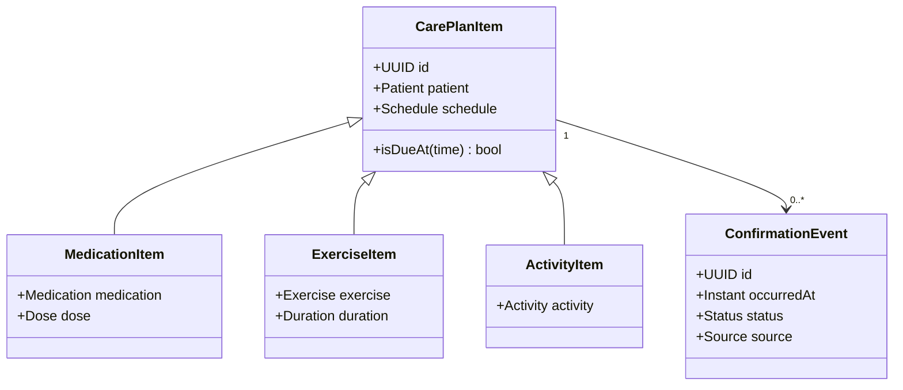
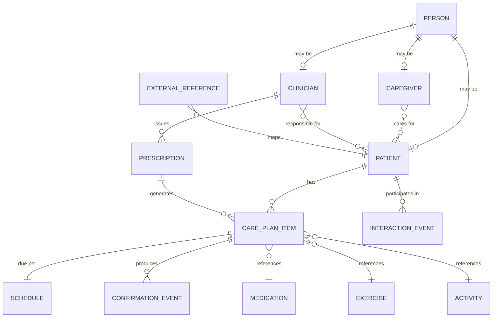

# Architecture and data model — review of the proposed design

Reviewing the sketch: one controller layer, per-role client APIs, catalogue tables for medicine and exercise with patient tables joining on ID, everything kept generic enough to federate with the hub later.

**Verdict: the core instinct is right and the access model is wrong.** The catalogue-plus-link pattern is exactly what makes future federation cheap. Splitting the API by role, and letting patients write to reference data, are the two things to fix before anyone scaffolds.

---

## 1. What holds up

**Catalogue tables with surrogate IDs.** A `medication` table that every patient record points at, rather than medicine names copied into patient rows, is correct. It is also precisely what makes hub alignment tractable — when their central server arrives, you map catalogue rows once instead of reconciling thousands of duplicated strings.

**The same pattern for exercise.** Right, and it generalises further — see §4.

**Small tables, joined.** Normalisation is the correct default here. One caveat in §5.

**"Simple but maintainable and scalable" as the goal.** Correct for a 5–6 week build assessed on design quality rather than feature count.

---

## 2. What to change — one API, not two

> [!warning] The design error
> Two client APIs split by role duplicates the domain layer, doubles the surface to test and maintain, and drifts the moment one side gets a field the other does not. It also does not scale to the roles we actually have.

The PO named **three** human roles — healthcare professional, caregiver, admin — plus the patient-facing agent client. Four API surfaces is not a design, it is a maintenance burden.

**Instead: one API, role-based authorisation at the service layer.**

| Role | Reads | Writes |
|---|---|---|
| **Healthcare professional** | Their patients' full records | Prescriptions, care plan items, patient records |
| **Caregiver** | Assigned patients' schedule and adherence history | Nothing clinical |
| **Admin** | Everything | User and role management |
| **Agent client** (phone / robot, acting for one patient) | That patient's schedule and care plan | **Confirmation events only** |

Same endpoints, same domain objects, authorisation deciding what each caller may see and do. This is also what the course's "logical entities, not tech stack" architecture requirement wants to see.

> [!danger] The contradiction in the sketch, and it matters
> The patient side is described as read-only and then as "able to change the medicine name."
>
> **A patient must never be able to write to the medication catalogue.** In this domain that is a safety boundary, not a permissions preference. The patient's only write is *"I confirmed this dose at this time"* — a new event, never a mutation of clinical reference data.

---

## 3. What is missing — the event log

The sketch has catalogue tables and assignment tables, but **no record of what actually happened**. That is the product.

The PO's requirement is medication *history* — whether it was taken, and when — plus interaction history. Three distinct concepts are currently collapsed into one:

| Concept | What it is | Mutability |
|---|---|---|
| **Prescription** | The clinician's instruction: this patient, this medication, this dose, from this date | Versioned, effectively append-only |
| **Schedule** | When it is due — times of day, recurrence | Derived from the prescription |
| **Administration event** | What happened at a due time: confirmed, missed, refused, late | **Append-only. Never updated, never deleted.** |

**Why this earns its place:** the missed-dose gap Cole confirmed is not a feature you build on top — it falls out of this model for free. A missed dose is *a scheduled occurrence with no corresponding confirmation event*. No monitoring, no inference, no camera. The absence is the data.

---

## 4. Generalise the catalogue — the OO move

Medication and exercise are two instances of one idea, and the robot already shows more: brain games, karakia, entertainment, appointments.

Modelling each as an unrelated table means writing the same scheduling, assignment and confirmation logic five times. Model instead:

- A **care plan item** — something assigned to a patient, scheduled, and confirmable
- **Typed detail** per kind: medication carries dose and form; exercise carries duration and media; an activity carries a link



This is the shape the markers are looking for. The proposal criteria name SOLID and design patterns explicitly, and the holistic assessment states that object-oriented principles are evaluated. Polymorphic care plan items with one scheduling engine demonstrates that; five parallel CRUD tables does not.

---

## 5. "Generic" — the trap to avoid

> [!danger] Do not build EAV
> "Make all the data very generic" has a well-known failure mode: an entity–attribute–value table where everything is a key/value row. It looks maximally flexible and it destroys queryability, type safety, referential integrity and every ORM benefit you would get from Spring's persistence layer.

**Generic in *shape*, concrete in *columns*.** The polymorphic care plan item above gives you extensibility through subtypes, with real typed columns and real foreign keys underneath. That is the version of "generic" that survives contact with a marker asking why a query takes six joins.

---

## 6. Making federation cheap — do these three things now

1. **UUID primary keys**, generated by us. Never sequential integers exposed across a boundary, and never natural keys like a medicine name.
2. **An external reference table** — `(local_id, external_system, external_id)`. When the hub arrives, you map identities into that table without touching a single primary key or foreign key.
3. **UTC timestamps with timezone on every event**, and record the **source** of every confirmation (self, agent, caregiver). The hub will eventually want to know who asserted what.

Plus the boundary rule already agreed: all outbound calls to CARE or the hub sit behind **one adapter** with our own interface on our side.

---

## 6a. Correction — the integration is bidirectional

> [!important] Added 19 Aug after reading SCRUM-27
> The board records something this review originally missed: **"generic" turned out to mean the CARE hub retrieves data _from_ our server.** Integration is not outbound-only.

Everything in §6 still holds, and one thing is added: we must **expose an inbound, authenticated API** for a consumer whose requirements we cannot yet see.

Design consequences:

- **Two separate concerns, not one.** The outbound adapter (we call CARE) and the inbound hub API (CARE calls us) are different code with different failure modes. Do not merge them into one "integration" class.
- **The inbound API is a published contract.** Version it from the first commit. An internal API can be refactored freely; one an external consumer depends on cannot.
- **Authentication and authorisation for a non-human caller.** The hub is not a user with a role — it needs service-level credentials and a scope that is narrower than any human role.
- **This raises the cost of getting the data model wrong.** If the hub reads our entities, string-keyed data (see the SCRUM-52 defect) becomes their reconciliation problem as well as ours.
- **Ask Jay before designing it:** does CARE expect a fixed schema, or does it adapt to ours? If fixed and we guess, this is rework in Sprint 5 or 6.

---

## 7. Proposed model



**Catalogue tables** (`MEDICATION`, `EXERCISE`, `ACTIVITY`) are reference data: small, stable, shared across all patients, and the natural federation seam.

**Clinical reference data should be versioned, not edited in place.** If a clinician renames a medication row, every historical record silently changes meaning. Supersede rather than update.

---

## 8. Layering — answering the "one controller" question

Three layers, matching the proposal's architecture requirement:

```
Controller   REST endpoints, request/response mapping, authentication
   ↓
Service      Domain logic, authorisation, scheduling, adherence rules
   ↓
Repository   Persistence only
   ↓
Integration  CARE / hub adapter — the only code that knows they exist
```

Not one controller. One controller **per aggregate** — patient, care plan, prescription, confirmation, user — each thin, with the logic in services. The diagram in the Project Proposal shows these logical components and their relationships, not React or Spring Boot.

---

## 9. Open questions for Sunday

1. Does a **universal patient ID** exist in their world? Asked of Cole, unanswered. It changes the external reference design.
2. Are prescriptions authored in our system, or imported from the hub later? Affects whether we build prescription authoring at all.
3. Do caregivers get any write access, or strictly read?
4. Does the schedule need recurrence rules, or is a per-day time list sufficient for the MVP? Recurrence is a genuine complexity jump.
5. Confirm the **database**: this model is relational and the backend is now Java. PostgreSQL is the coherent choice; the earlier Mongo suggestion belonged to the Node option.
