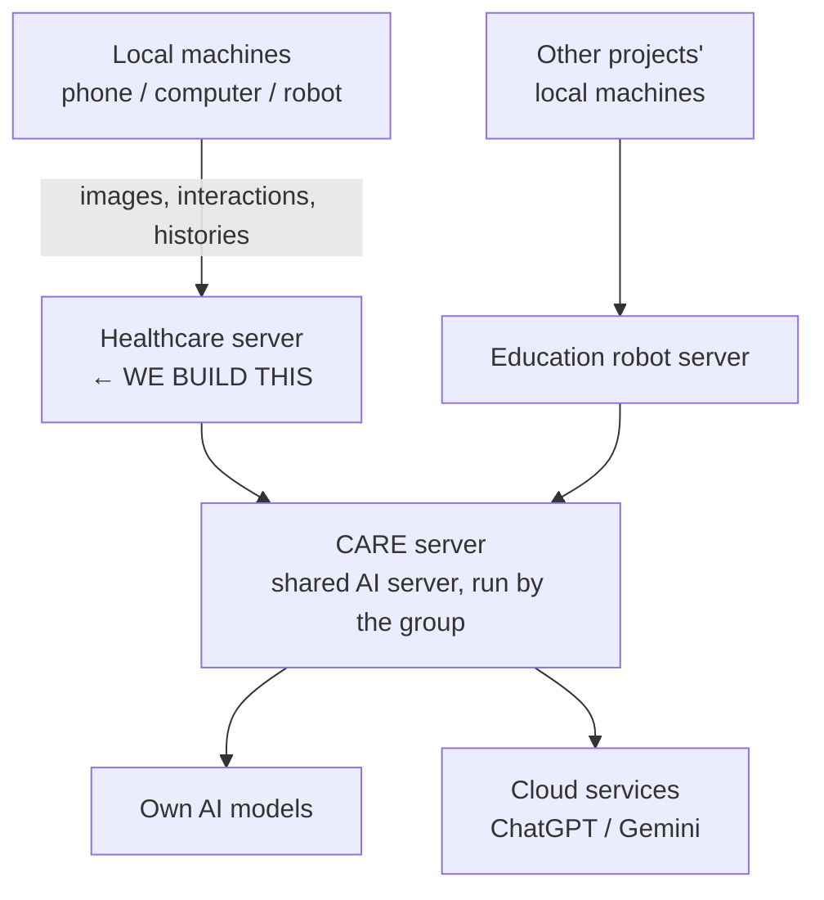

# Minutes — PO Meeting 1, 11 August 2026

> [!bug] Transcript quality
> The auto-transcript is poor and drops the ends of sentences. Proper nouns are unreliable — the AI server renders variously as "Kair", "Keras", "Kailh", "KSI", "AKS-880"; **its actual name is the CARE server** (confirmed by Johnson after the meeting). Anything below marked ⚠ was not clearly stated and must be verified.

---

## 1. The correction that matters most

> [!important]
> Our Week 3 assumption was **wrong**. We recorded "users = robots, the web UI exists only for demonstration."
> The PO's actual priority is the opposite: **the web page is the first priority**, and it is for humans — medical professionals, caregivers, and admins — with role-based access.

This changes the architecture, the use case diagram, and the backlog ordering. Correct it before the Project Proposal.

---

## 2. Why this project exists

The PO's group already runs a working healthcare robot system. Its server and web pages sit on a university-managed virtual machine, inside the university network.

The problem: the network is strict and closed, so the actual external users — patients, caregivers, hospital medication specialists — **cannot reach the system**. The group asked university IT to open it up and to fix faults; IT responded that the original developer has left and they don't know where things are. The PO has effectively given up on the existing deployment.

**Therefore:** build a **new server system from scratch**, owned and deployable by the group, with no dependency on university IT and no access restrictions from outside.

> [!quote] Confirmed in the meeting
> Everything starts fresh, from scratch. This is **not** a continuation project — there is no previous codebase to inherit.

---

## 3. Product concept

### Server (backend + database)
Holds the healthcare record:
- **Prescriptions** — issued by a medical expert; include medications
- **Exercise** — regular exercise the patient should do
- **Visiting / hospital histories**
- **Medication histories** — whether the medication was taken, and when
- **Interaction histories** from the client

### Web page — *first priority*
A viewer for professionals and caregivers. Shows: who the patient is, caregiver information, prescriptions, visiting histories, exercise, medication histories.

**Role-based access, at least three roles:**

| Role | Who | Access |
|---|---|---|
| Healthcare professional | Medical doctors, medication specialists | Clinical view |
| Caregiver | Family members, or hospital staff | View their patient's history |
| Admin / manager | System manager | Full details |

Same core functions across roles, but ⚠ *"a bit of different UIs and using different points"* — the PO indicated the views differ per role. Clarify exactly how.

### Local machine / client
This is the substitution that makes it a software project:

> The physical robot is **replaced by a "virtual agent"** — a phone or a local machine acting as the client. This is human–computer interaction, not human–robot interaction. The group can swap a real robot in later; **that is not our concern.**

Design it **phone-based**.

Client responsibilities:
- Check the patient's medication and exercise schedules
- **Remind** the patient at the scheduled time — "it's time for your breakfast medication"
- Show pictures of the medication if the patient doesn't recognise it
- **Visual ID check** — confirm the patient's identity before interacting. Face recognition. *This is a hard requirement: "at least it should check up the ID, visual ID, definitely."*
- Interact — message, speech generation, or another mechanism. Design freedom here.
- Send interaction and medication history back to the server

### Trust-based by design — not an oversight
The system does **not** verify that the medication was physically taken. The patient confirms it themselves.

The PO addressed this directly: continuous monitoring was rejected because people dislike being watched all day. The known weakness — a patient clicking "yes" without taking the medicine — is mitigated **socially, by a human caregiver** doing regular checks, not technically.

> [!warning]
> Do not "fix" this with surveillance features. It is a deliberate product decision. Understanding it is worth marks in the Q&A.

### Target users
Elderly people who forget their medication. Also children.

---

## 4. Architecture — the group's standard three-tier pattern

The PO's lab runs several projects (healthcare robot, "robot cycle", education robot) on a **common architecture**:

**The consequence for us:** we do **not** build face recognition, emotion understanding, or ageing-related AI ourselves. The **CARE server** already has those solutions. Our server calls it.

> [!quote] PO, on duplicated effort
> Everyone doing the same task is a waste of time, effort and resources.

**Jay** — first-year ⚠ PhD student — is in charge of the CARE server and attended for this reason. He is the technical contact for AI integration.

> [!bug] Live risk
> The CARE server is **still under development**. The PO said not to worry about it. We cannot build a dependency on an unfinished external service without a fallback. See risks.

---

## 5. Platform decisions

- **Web page: first priority.** Build it first.
- Client: the PO initially described "the web page including two apps" — Android and iOS.
- The team proposed a **responsive web app** covering both mobile platforms instead. **The PO accepted this** — "up to you."
- Native Android is optional if the team has the capability. iOS was discussed and discouraged: Apple approval process, and developer registration cost (⚠ figure quoted in the meeting as $156 — verify).
- Login and user registration: **we build our own user database.** Merging with the group's existing user data is a **later** conversation, not now.

---

## 6. Answered from our question list

| Q | Answer |
|---|---|
| Is the robot the only user? | **No.** Web page for humans is first priority. Three roles. |
| Existing code to inherit? | **No.** Greenfield. |
| Is face recognition ours to build? | **No.** Call the CARE server. |
| Real robot hardware? | **No.** Phone or local machine as virtual agent. |
| Two robots, same patient — double dose? | **Dissolved by design: one local machine cares for exactly one patient.** Patients are assigned to a client. |
| What does the client actually do? | Schedule check → remind → visual ID → interact → report history |
| Existing user data to use? | Not now. Build our own; integration discussed later. |
| Demo attendance | PO asked for the date, given **23 August** ⚠. Unsure whether he can attend. |

**Note on the concurrency risk from Week 3:** the one-client-one-patient rule removes the double-dose scenario, but it does not remove all concurrent-write concerns — a caregiver editing a prescription on the web page while the client is mid-interaction is still a live case. Keep a reduced version of this in the backlog.

---

## 7. Still unanswered — carry to PO Meeting 2

1. **Real, synthetic, or anonymised patient data?** Not discussed at all. Ethics and privacy obligations are unknown. **Ask first thing.**
2. **Is the project confidential?** Not discussed. Determines whether we can demo publicly in class.
3. **Hosting.** The whole point is escaping university IT — so who hosts and who pays? Not resolved.
4. Access to the existing server: asked in the meeting ("do we have access now?"), **never answered**.
5. CARE server readiness — what is available now, what interface, and by when.
6. Exactly how the three role views differ.
7. Missed / refused / late dose — what the system should record and whether anyone is alerted.
8. PO's weekly availability and preferred channel. ⚠ A messaging channel was mentioned but the transcript is unintelligible ("slap") — possibly Slack. Confirm.
9. Explicit ranking of the major capabilities. We have "web page first" but not a full 1–4 order.
10. The research group's own name — the AI server is **CARE**, but confirm how the group and project should be referred to in the Project Proposal.

---

## 8. Risks

1. **CARE server dependency.** Unfinished external service, owned by someone outside the team, on our critical path for the mandatory visual ID feature. **Mitigation: define an interface and build against a mock from day one.** Never let a demo depend on it being up.
2. **Scope grew.** Web page with three role-based views *plus* a phone-based client *plus* AI integration, in 5–6 coding weeks with eight developers. The PO invited additional features ("freedom to add on functionality") — decline politely until the core is done.
3. **Demo date conflict.** The PO was told 23 August ⚠; the course schedule puts the Sprint 3 demo in Week 6, 24 August. **Verify against Canvas before confirming anything to the PO.**
4. **PO gave design freedom, not requirements.** Repeatedly: "up to you", "all the details can be designed by yourselves". That freedom is real, but it means *we* own the acceptance criteria. Write them, then get the PO to confirm in writing.
5. **Trust-based model must be understood, not engineered around.** A team member who "improves" it with monitoring has misunderstood the product.

---

## 9. Actions

| # | Action | Owner | Due |
|---|---|---|---|
| 1 | Email the PO a written summary of this meeting — capabilities, decisions, open questions | Jamuna (SM) | Same day |
| 2 | Correct the "users = robots / UI is demo-only" assumption in all working documents | Johnson | Before proposal |
| 3 | Verify the Sprint 3 demo date against Canvas, then confirm to the PO | Jamuna | This week |
| 4 | Contact Jay: CARE server interface, availability, what exists today | TBC | This week |
| 5 | Draft user stories with acceptance criteria from sections 3 and 4 | All | Sprint 1 |
| 6 | Ask the PO the section 7 questions — data, confidentiality, hosting first | Jamuna | PO Meeting 2 |
| 7 | Confirm how the research group and project should be named in the Project Proposal (AI server = CARE, confirmed) | TBC | Before proposal |
