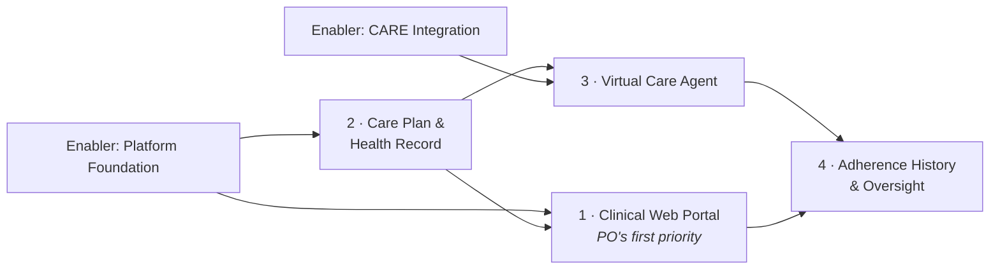
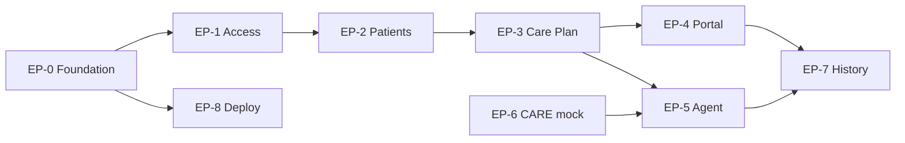

# Product Backlog — draft v1

> [!warning] This is a draft for the team to own, not a finished artefact
> Three things must happen before this becomes the real backlog:
> 1. **The PO prioritises it.** Prioritisation is formally their job. Take the epic list to them and make them rank it.
> 2. **The team estimates it.** Story points are deliberately left blank — planning poker is a team activity, it's assessed, and estimates you didn't make yourselves are worthless for velocity.
> 3. **The team rewrites what doesn't fit.** You know the domain conversation; some of these will be wrong.
>
> The course requires a **DEEP** backlog — Detailed appropriately, Estimated, Emergent, Prioritised. This draft delivers "detailed" and a proposed order. You supply the other two.

---

## Actors

| Actor | Who | Interacts via |
|---|---|---|
| **Healthcare professional** | Doctor, medication specialist — enters medications and exercises | Web portal |
| **Caregiver** | Family member, or hospital/care staff — monitors and helps the patient | Web portal |
| **Admin** | System manager | Web portal |
| **Patient** | Elderly person or child receiving care. **Confirms medication taken / exercise done. Cannot self-register — the account is created for them.** | Phone client |
| **Virtual agent** | Phone acting as the client, standing in for the future robot — one per patient | API |
| **CARE server** | External shared AI hub. **Bidirectional:** we call it for visual ID; it retrieves data from us | API, in and out |

> [!abstract] Clarifications confirmed with the PO, 12 Aug
> - **Client vs portal:** phone client is the patient's confirmation interface; the web app is for professionals (entering medications/exercises) and caregivers (monitoring and assisting).
> - **Platform:** responsive web app across phone and laptop is sufficient. Native Android only as a stretch, if time allows.
> - **"Generic" means:** our system becomes part of the CARE ecosystem, and the **CARE hub must be able to retrieve data from our server layer**. See EP-6.
> - **CARE availability:** provided later in the project. Mock first, always.
> - **Patient accounts:** created by a caregiver or professional. Patients interact with existing data only.
> - **Visual ID:** required, but **must have an alternative method** — it cannot be the only way in.
> - **Exercise** follows the same remind → confirm → history flow as medication.
> - **Out:** emotion and ageing models. Too advanced for this scope.

---

## Four major capabilities

The course asks for 3–4 significant capabilities for the use case diagram. These are they, in the PO's stated priority order:

---

# EPICS

| ID | Epic | Capability | Why it exists |
|---|---|---|---|
| **EP-0** | Platform Foundation | Enabler | Nothing ships without repo, CI, deployment and a running skeleton |
| **EP-1** | Identity & Access Control | 1 | Three roles with different views; PO named this explicitly |
| **EP-2** | Patient & Caregiver Management | 2 | Patients, their caregivers, and agent assignment |
| **EP-3** | Care Plan — Prescriptions, Medication & Exercise | 2 | The clinical content the whole system serves |
| **EP-4** | Clinical Web Portal | 1 | **PO's first priority.** The viewer for professionals, caregivers, admins |
| **EP-5** | Virtual Care Agent | 3 | Phone client: remind, identify, interact, report |
| **EP-6** | CARE Server Integration | Enabler | Visual ID and other AI, called not built |
| **EP-7** | Adherence History & Oversight | 4 | Histories, adherence view, the caregiver's follow-up loop |
| **EP-8** | Deployment & Operability | Enabler | The entire reason this project exists: reachable from outside |

---

# USER STORIES

Format: `As a <role>, I want <capability> so that <benefit>.`
`Pri` = MoSCoW. `SP` = story points — **left blank on purpose.**

---

## EP-0 · Platform Foundation

| ID | Story | Pri | SP |
|---|---|---|---|
| **US-01** | As a **developer**, I want a running front-end and back-end skeleton deployed end to end, so that every later story has somewhere to land. | Must | |
| **US-02** | As a **developer**, I want CI running build, lint and tests on every pull request, so that broken code cannot reach the default branch. | Must | |
| **US-03** | As a **developer**, I want the database schema managed by versioned migrations, so that eight people's local databases stay consistent. | Must | |
| **US-04** | As a **developer**, I want seeded demo data for patients, caregivers and prescriptions, so that every demo has realistic content without hand-entry. | Must | |
| **US-05** | As a **marker**, I want a README that builds and runs the system from a clean machine, so that the software can actually be assessed. | Must | |

> [!note] US-05 is not filler
> "You may receive a zero for the project if we cannot execute your software." Write it in Sprint 2, keep it true every sprint.

**Acceptance criteria — US-02**
- Given a pull request is opened, when CI runs, then build, lint and unit tests all execute and their status is visible on the PR.
- Given any check fails, when a merge is attempted, then the merge is blocked.

---

## EP-1 · Identity & Access Control

| ID | Story | Pri | SP |
|---|---|---|---|
| **US-06** | As a **caregiver or professional**, I want to register my own account, so that I can start using the portal. | Must | |
| **US-06a** | As a **caregiver or professional**, I want to create a patient account on the patient's behalf, so that someone who cannot self-register still gets care. | Must | |
| **US-07** | As a **user of any role**, I want to log in with email and password, so that I can access data belonging to me. | Must | |
| **US-08** | As a **user**, I want my session to expire and to be able to log out, so that an unattended device does not expose patient data. | Must | |
| **US-09** | As an **admin**, I want role-based permissions enforced on every endpoint, so that a caregiver cannot read clinical data they have no right to. | Must | |
| **US-10** | As a **caregiver**, I want to see only the patients assigned to me, so that I am not exposed to unrelated people's health records. | Must | |
| **US-11** | As a **user**, I want to reset a forgotten password, so that I am not locked out permanently. | Should | |
| **US-12** | As an **admin**, I want to deactivate a user, so that departed staff lose access immediately. | Should | |

**Acceptance criteria — US-09**
- Given a caregiver's valid token, when they request a clinical-only endpoint, then the API returns 403 and no data.
- Given no token, when any protected endpoint is called, then the API returns 401.
- Given a professional's token, when they request patient data, then only permitted fields are returned.

**Acceptance criteria — US-10**
- Given a caregiver linked to patients A and B, when they open the patient list, then only A and B appear.
- Given that caregiver requests patient C directly by ID, then access is denied.

---

## EP-2 · Patient & Caregiver Management

| ID | Story | Pri | SP |
|---|---|---|---|
| **US-13** | As a **healthcare professional**, I want to create a patient record with their basic details, so that care can be planned for them. | Must | |
| **US-14** | As a **healthcare professional**, I want to view and edit a patient's profile, so that their details stay current. | Must | |
| **US-15** | As an **admin**, I want to link a caregiver to a patient, so that family members can follow the person they care for. | Must | |
| **US-16** | As an **admin**, I want to assign exactly one virtual agent device to a patient, so that responsibility for a patient is unambiguous. | Must | |
| **US-17** | As a **healthcare professional**, I want to record a patient's visiting and hospital history, so that their care context is visible in one place. | Should | |
| **US-18** | As a **professional**, I want to search and filter the patient list, so that I can find someone quickly in a long list. | Should | |
| **US-19** | As a **professional**, I want to upload a patient photo, so that the agent can show the right person and staff can identify them. | Could | |

> [!important] US-16 encodes the PO's rule
> *One local machine cares for exactly one patient.* This is the constraint that removes the double-dose problem. Enforce it in the data model, not just the UI.

---

## EP-3 · Care Plan — Prescriptions, Medication & Exercise

| ID | Story | Pri | SP |
|---|---|---|---|
| **US-20** | As a **healthcare professional**, I want to create a prescription for a patient, so that their medication plan is recorded in the system. | Must | |
| **US-21** | As a **healthcare professional**, I want to add medications to a prescription with dose and instructions, so that the patient is told exactly what to take. | Must | |
| **US-22** | As a **healthcare professional**, I want to set a schedule for each medication, so that the agent knows when to remind the patient. | Must | |
| **US-23** | As a **healthcare professional**, I want to prescribe regular exercises with their own schedule, so that non-medication care is covered too. | Must | |
| **US-24** | As a **healthcare professional**, I want to amend or stop a prescription, so that the plan reflects the patient's current treatment. | Must | |
| **US-25** | As a **patient**, I want to see a picture of the medication I'm being reminded about, so that I take the right one when I don't recognise the name. | Should | |
| **US-26** | As a **healthcare professional**, I want the system to generate the day's scheduled events from the care plan, so that nobody maintains a second list by hand. | Must | |
| **US-27** | As a **healthcare professional**, I want to be warned when a new prescription conflicts with an existing one, so that obvious errors are caught. | Could | |

**Acceptance criteria — US-22**
- Given a medication, when a professional sets a daily time, then a scheduled event is generated for each day the prescription is active.
- Given a prescription is stopped, then no further events are generated from that point.
- Given an amended schedule, then future events reflect it and past events are unchanged.

**Acceptance criteria — US-26**
- Given a patient with an active care plan, when the agent requests today's schedule, then all medication and exercise events due that day are returned with their times and current status.

---

## EP-4 · Clinical Web Portal — *PO's first priority*

| ID | Story | Pri | SP |
|---|---|---|---|
| **US-28** | As a **healthcare professional**, I want a dashboard of my patients showing today's status at a glance, so that I can see who needs attention. | Must | |
| **US-29** | As a **healthcare professional**, I want a single patient view combining profile, care plan and histories, so that I don't hunt across screens. | Must | |
| **US-30** | As a **caregiver**, I want a simplified view of my family member's adherence and upcoming events, so that I know whether to check in on them. | Must | |
| **US-31** | As an **admin**, I want a management view of users, patients and agent assignments, so that I can keep the system configured correctly. | Must | |
| **US-32** | As a **user on a phone**, I want the portal to work on a small screen, so that I can check on someone without a laptop. | Must | |
| **US-33** | As a **user**, I want clear feedback when something fails or is loading, so that I am never left guessing whether the system worked. | Must | |
| **US-34** | As a **user**, I want form input validated with useful messages, so that I cannot silently save bad clinical data. | Must | |
| **US-35** | As a **user**, I want a consistent visual theme and navigation across the portal, so that the system feels like one professional product. | Must | |
| **US-36** | As a **professional**, I want the portal to be usable with a keyboard and readable at larger text sizes, so that it works for staff and older users. | Should | |

> [!note] Why so many "Must" here
> Code Quality and Professionalism is 15 marks and explicitly names GUI quality, responsiveness, input validation, navigation and transitions. US-32 to US-35 are marked work, not polish.

**Acceptance criteria — US-30**
- Given a caregiver with a linked patient, when they open the portal, then they see today's events, what was confirmed, and what was missed.
- Given a missed event, then it is visually distinct from a confirmed one.
- Given no linked patient, then an empty state explains why rather than showing an error.

---

## EP-5 · Virtual Care Agent (phone client)

| ID | Story | Pri | SP |
|---|---|---|---|
| **US-37** | As an **admin**, I want to pair an agent device to its patient with a one-time code, so that the device is bound to the right person. | Must | |
| **US-38** | As an **agent**, I want to fetch my patient's schedule for the day, so that I can remind them at the right times. | Must | |
| **US-39** | As a **patient**, I want to be reminded when a medication is due, so that I don't forget to take it. | Must | |
| **US-40** | As a **patient**, I want to be reminded when an exercise is due, so that the rest of my care plan happens too. | Must | |
| **US-41** | As a **patient**, I want to confirm that I have taken my medication, so that my caregiver knows I'm on track. | Must | |
| **US-42** | As a **patient**, I want to say that I'm skipping or postponing a dose, so that the record is honest rather than silently empty. | Must | |
| **US-43** | As a **patient**, I want the agent to check my face before it shows my care information, so that my health data isn't shown to whoever picks up the device. | Must | |
| **US-43a** | As a **patient**, I want an alternative way to identify myself when the face check doesn't work, so that poor light, a bad camera or an outage never locks me out of my medication. | Must | |
| **US-44** | As an **agent**, I want to report every interaction back to the server, so that the care team has a complete history. | Must | |
| **US-45** | As a **patient**, I want reminders spoken aloud as well as shown, so that I don't have to read a small screen. | Should | |
| **US-46** | As an **agent**, I want to queue reports while offline and send them when the network returns, so that a dropout doesn't lose a medication record. | Should | |
| **US-47** | As a **patient**, I want a large, simple interface with minimal choices, so that the device is usable if I'm elderly or a child. | Must | |
| **US-48** | As a **patient**, I want to be reminded again if I don't respond, so that a missed notification doesn't become a missed dose. | Should | |

> [!warning] Do not build verification into this epic
> The PO chose a **trust-based** model deliberately — the patient self-confirms, and surveillance was rejected because people dislike being watched. The gap is closed socially by the caregiver (EP-7), not technically. A story that "proves" the pill was swallowed is a misunderstanding of the product.

**Acceptance criteria — US-43 / US-43a**
- Given a due event, when the agent activates, then it performs a visual ID check before any patient data is displayed.
- Given the check fails or CARE is unavailable, then the patient is offered the alternative method rather than being locked out or let straight in.
- Given both methods fail, then no care information is shown and the attempt is logged.

> [!important] US-43a and US-50 are the same mechanism
> The accessibility fallback the PO asked for *is* the outage fallback you need anyway. Build one path, use it for both. It also means no demo can be derailed by CARE being down.

**Acceptance criteria — US-41**
- Given a reminder is showing, when the patient confirms, then the event is marked taken with a timestamp and synced to the server.
- Given the event was already recorded, then a duplicate confirmation does not create a second record.

---

## EP-6 · CARE Server Integration

| ID | Story | Pri | SP |
|---|---|---|---|
| **US-49** | As a **developer**, I want visual ID behind an interface with a mock implementation, so that development never blocks on an external service. | Must | |
| **US-50** | As a **developer**, I want a defined fallback when CARE is unreachable, so that the system degrades predictably instead of failing open. | Must | |
| **US-51** | As a **developer**, I want to call the real CARE endpoint for visual ID, so that identification uses the group's existing models rather than ours. | Must | |
| **US-52** | As a **developer**, I want CARE calls logged with timing and outcome, so that we can show integration works and diagnose it when it doesn't. | Should | |
| **US-53** | As a **developer**, I want the CARE integration covered by tests against the mock, so that our side stays correct regardless of their availability. | Should | |
| **US-66** | As the **CARE hub**, I want to retrieve patient and adherence data from this system through a documented API, so that this project joins the CARE ecosystem rather than standing alone. | Must | |
| **US-67** | As a **developer**, I want CARE's inbound access authenticated and scoped, so that an ecosystem integration is not an open door to patient data. | Must | |
| **US-68** | As a **developer**, I want the outbound API contract published as a spec, so that Jay can build against it before the two systems ever meet. | Should | |

> [!bug] The critical-path risk
> The CARE server is still under development and owned outside the team. **US-49 must be done before US-51 is even planned.** No demo may depend on CARE being up.

> [!warning] The integration runs both ways
> US-66 to US-68 exist because "generic" turned out to mean *CARE retrieves data from us*, not just *we call CARE*. That is an inbound public-facing API with authentication, designed for a consumer we cannot see yet. **Ask Jay whether CARE expects a fixed schema or adapts to ours** — if it's fixed and we guess, this is rework late in the project.

---

## EP-7 · Adherence History & Oversight

| ID | Story | Pri | SP |
|---|---|---|---|
| **US-54** | As a **healthcare professional**, I want a patient's full medication history with timestamps, so that I can see what was actually taken and when. | Must | |
| **US-55** | As a **caregiver**, I want to see which doses were missed, so that I know when to follow up in person. | Must | |
| **US-56** | As a **professional**, I want an adherence summary over a date range, so that I can judge whether the care plan is working. | Should | |
| **US-57** | As a **caregiver**, I want to be notified when my patient misses a dose, so that I can act on the same day rather than at the next visit. | Should | |
| **US-58** | As a **professional**, I want the interaction history from the agent, so that I can see how the patient is engaging with the system. | Should | |
| **US-59** | As a **caregiver**, I want to record that I followed up on a missed dose, so that the team knows it was handled. | Could | |
| **US-60** | As a **professional**, I want to export a patient's history, so that it can go into their wider medical record. | Could | |

> [!note] US-55 and US-57 are the point of the product
> The trust-based model only works because a human closes the loop. This epic *is* that loop — it is not reporting garnish.

---

## EP-8 · Deployment & Operability

| ID | Story | Pri | SP |
|---|---|---|---|
| **US-61** | As a **PO**, I want the system reachable from outside the university network, so that the problem that motivated this project is actually solved. | Must | |
| **US-62** | As a **developer**, I want the whole stack to run with a single command locally, so that onboarding and marking are trivial. | Must | |
| **US-63** | As a **PO**, I want the system deployed somewhere the group controls, so that we are not dependent on university IT. | Must | |
| **US-64** | As a **developer**, I want secrets and configuration kept out of the repository, so that credentials are never committed. | Must | |
| **US-65** | As a **PO**, I want a short operations note covering deploy, restart and backup, so that the system survives after the team leaves. | Should | |

> [!important] US-61 is the project's reason for existing
> Their current system fails precisely because external users can't reach it. If your final demo runs only on localhost, you have rebuilt their problem.

---

# Sequencing — dependencies, not a sprint plan

The team plans sprints; these are the constraints that plan must respect.

Hard constraints:
- **US-26** (schedule generation) blocks the entire agent epic. Do it early.
- **US-49** (CARE mock) must precede any agent ID work. Never wait on the real service.
- **EP-7** needs real history data, so it needs the agent producing events first.
- **US-61/63** (external deployment) must not be left to Sprint 6. Deploy something trivial in Sprint 2 and keep it deployed.

Suggested shape, for the team to accept or reject:

| Sprint | Focus |
|---|---|
| 2 | EP-0, start EP-1, deploy a skeleton externally |
| 3 | Finish EP-1, EP-2, start EP-3 — **first assessed demo, must show something running** |
| 4 | Finish EP-3, EP-4 core screens, EP-6 mock |
| 5 | EP-5 agent, EP-6 real CARE integration |
| 6 | EP-7, EP-4 polish, EP-8 hardening |
| 7 | No new features — defects, docs, final demo |

---

# Explicitly out of scope

State these in the proposal so the boundary is on the record:

- Physical robot hardware integration — the PO replaced it with a phone/local machine
- Building AI models — CARE provides them
- **Emotion recognition and ageing models** — available on CARE, but confirmed too advanced for this scope
- Merging with the group's existing user database — the PO deferred this
- Any verification that medication was physically consumed — deliberately excluded
- Patient self-registration — patient accounts are created by a caregiver or professional
- Native iOS app — Apple approval and registration cost; responsive web accepted by the PO
- Native Android app — stretch only, if the team has capacity

---

# Blocked until the PO answers

These stories cannot be finalised, and two of them may change the whole shape of the work:

| Blocker | Blocks |
|---|---|
| Real, synthetic or anonymised patient data? Ethics obligations? | EP-2, EP-3, and possibly the entire data model |
| Who hosts, and who pays? | US-61, US-63 — and these are Must |
| Is the project confidential? | Whether Sprint Demos can be public |
| **How does a reminder actually reach the patient?** In-app only means it fires solely while the page is open — which defeats reminding someone who forgets. Options: installable PWA + Web Push, native Android, or email/SMS delivery | US-39, US-40, US-48 — the core of EP-5 |
| **Does CARE expect a fixed schema, or adapt to ours?** Ask Jay | US-66, US-68 |
| CARE server interface and availability date | US-51, US-52, US-66 |
| **Who approves a healthcare-professional account?** Self-registration plus a role claim is an open door to clinical data | US-06, US-09 |
| Exactly how the three role views differ | US-28, US-30, US-31 |
| Missed-dose policy — record only, or alert? | US-55, US-57 |
| What the alternative to visual ID should be — PIN, caregiver assist, or device trust | US-43a, US-50 |

---

# Definition of Done — draft for the team to ratify

Required in the Project Proposal. A story is Done when:

1. Acceptance criteria met and demonstrated
2. Code merged to the default branch via a reviewed pull request
3. Automated tests written and passing; CI green
4. No known defects introduced
5. Deployed to the shared environment and working there
6. Documentation and README updated where behaviour changed
7. The author can explain every line of it
