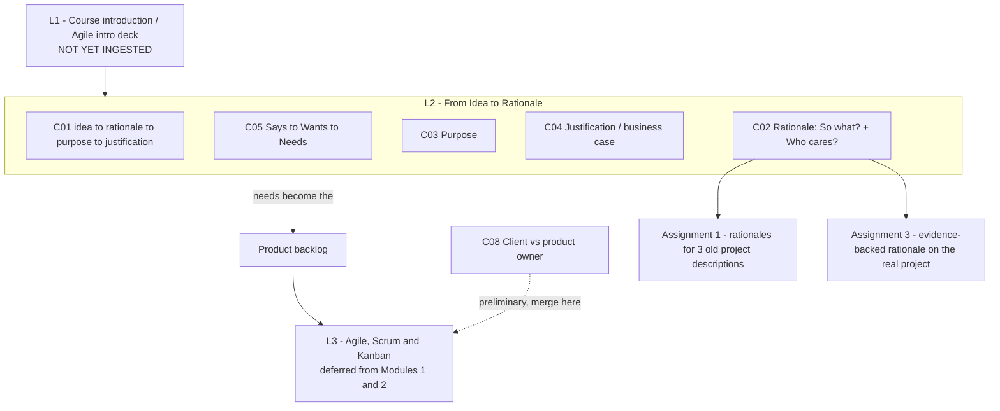

# SE761 (SOFTENG 761) - Syllabus map

Advanced Agile and Lean Software Development. Built up as lectures are ingested.

## Dependency graph

## Lecture index

| Lecture | Topic | Date | Status | Concepts | Resources |
|---|---|---|---|---|---|
| 1 | Course introduction (Agile intro deck) | Mon 20 Jul | **not started** | 0 | deck + transcript, both present |
| 2 | From Idea to Rationale | Wed 22 Jul | **notes written, untested** | 10 (L2-C01…C10) | **no deck**; transcript + 3 Canvas pages |
| 3 | Agile, Scrum and Kanban (expected) | — | not started | 0 | none yet |

## Module structure (from Canvas)

The Canvas page "Contents of Module 1 and 2" lists three topics:

1. **From Idea to Rationale** — covered in L2
2. **Agile** — deferred
3. **Scrum and Kanban** — deferred

So Modules 1 & 2 are only one-third taught as of L2. Expect the remainder next.

## Cross-cutting themes

- **Everything funnels into the product backlog.** The says→wants→needs journey (L2-C05) is explicitly framed as producing the Scrum product backlog. That is the join between this lecture's requirements-elicitation material and the Agile/Scrum content still to come.
- **The client is non-technical by default.** Stated in L1 and relied on throughout L2 — it is what makes the reference-product problem (L2-C07) and the says/wants/needs gap the expected case rather than an edge case.
- **Assignment scaffolding mirrors the concept ladder.** Assignment 1 = rationale only, no evidence, on old descriptions. Assignment 3 = rationale plus research, on the real project. The course teaches the artefact, then re-runs it for real.

## Terminology to lock down

**rationale · purpose · justification (= business case) · says / wants / needs · product backlog · product owner vs client vs user**

⚠ Unresolved: "speed rationales" vs "seed rationales" — see `Lecture2/context/admin-and-dates.md`.

## Not lecture content

`project_pages.zip` / `project_pages/` and `project-index.csv` under Lecture2/resources are the Part IV project catalogue (134 projects, dated 2024). Reference material for project selection and for Assignment 1 practice descriptions. Not quizzable; no concept IDs drawn from it.
