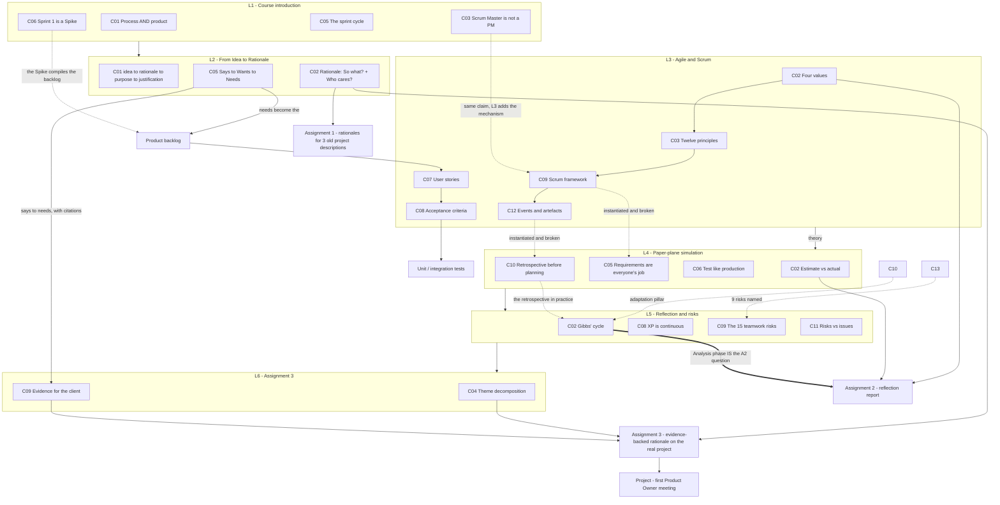

# SE761 (SOFTENG 761) - Syllabus map

Advanced Agile and Lean Software Development. Built up as lectures are ingested.

**Lectures 1-6 ingested (all taught content). 66 concepts, none yet tested.** Assignments A1 and A2 also recorded.

## Dependency graph

## Lecture index

| Lecture | Topic | Date | Status | Concepts | Resources |
|---|---|---|---|---|---|
| 1 | Course introduction (Agile intro deck) | Mon 20 Jul | **notes written, untested** | 10 (L1-C01…C10) | deck + transcript |
| 2 | From Idea to Rationale | Wed 22 Jul | **notes written, untested** | 10 (L2-C01…C10) | **no deck**; transcript + 3 Canvas pages |
| 3 | Agile and Scrum | Mon 27 Jul | **notes written, untested** | 13 (L3-C01…C13) | **no deck**; transcript + **the same Canvas pages as L2** (not duplicated) |
| 4 | Paper-plane Scrum simulation + Assignment 2 brief | Wed 29 Jul | **notes written, untested** | 12 (L4-C01…C12) | **no deck**; transcript only |
| 5 | Reflection models + teamwork risks | Mon 3 Aug | **notes written, untested** | 11 (L5-C01…C11) | **no deck**; **pre-recorded video** transcript + `Models-of-reflection.pdf` + 2 risk PDFs (filed under L6) |
| 6 | Assignment 3 — evidence-backed rationale | Wed 5 Aug | **notes written, untested** | 10 (L6-C01…C10) | **no deck**; transcript only. **Last formal lecture** |

**Total: 66 concepts, 0 ever quizzed.** Ingest is now six lectures ahead of retrieval — i.e. the entire taught course. See `review-queue.json`.

> ⚠ **L6 was the last formal lecture.** From week 4 the course is project work: sprint 1 presents **week 6** (in pairs), final presentation **week 11**. No further taught content is coming.

## Assignment index

| | Topic | Weight | Due | Format | Gen AI | Personal language | Status |
|---|---|---|---|---|---|---|---|
| **A1** | Rationale Investigation 1 ("speed rationales") | 3% | 30 Jul | Bullet points, ~200 w × 3 topics | **Encouraged**, 2 marks for declaring | ⛔ **Banned** | ✅ **Submitted**, mark pending |
| **A2** | Agile Reflection | 10% | **7 Aug** | Full paragraphs, 800–900 w | ⛔ Not for content | ✅ Permitted | 🔴 **In progress** |
| **A3** | Evidence-backed rationale | 7% | ⚠ not stated | Full paragraphs, 800–900 w + attached paper | ⚠ "Limit as much as possible" | ✅ Permitted | Briefed in L6 |

⚠ **The three assignments invert on nearly every axis, one week apart.** A1 trained bullets, impersonal voice and free Gen AI use; A2 requires paragraphs, personal voice and no Gen AI content; A3 keeps paragraphs and personal voice, restricts Gen AI, and adds a mandatory research paper. Carrying habits forward is a live risk — the full comparison lives in `Assignment1/notes/A1-brief.md`.

**Marker feedback so far (one item):** while marking A1, the lecturer told the class that some submissions **mentioned the solution** despite the brief prohibiting it. That same content becomes *permissible* in A3, where **purpose** may be brought in (L2-C03). The boundary moves; knowing where is worth marks.

**Assignment folders** mirror the lecture layout — `resources/` (the brief PDF), `notes/` (the decoded brief), `context/` (progress, session log, admin). ⚠ The **A3 brief PDF is not yet in the repo**; only A1 and A2 are held.

## Module structure (from Canvas) — now fully covered

The Canvas page "Contents of Module 1 and 2" lists three topics:

1. **From Idea to Rationale** — L2
2. **Agile** — L3
3. **Scrum and Kanban** — L3 (Scrum in depth; Kanban named only)

> **Modules 1 & 2 are complete as of L3.** L2's note that "Modules 1 & 2 are only one-third taught" is now resolved.

**Module 3** holds the **Scrum Primer**, which L3 names as the team's standing reference for Scrum. Not yet fetched into the repo — worth doing, it would let the three-pillars material cite exact wording.

## Source-material sharing across lectures

⚠ **`Lecture2/resources/canvas-modules-1-and-2-pages.md` is shared, not duplicated.**

L3 is a walkthrough of the same Canvas module pages that L2 used — it simply delivers topics 2 and 3 of that file's index instead of topic 1. Rather than copying the file into `Lecture3/resources/`, the reference is recorded in three places: the Sources callout at the top of `L3-notes.md`, `resources_seen.supplementary` in L3's `progress.json`, and here.

**If you move or rename that file, three references break.** Grep for `canvas-modules-1-and-2-pages` before touching it.

`Lecture3/resources/` and `Lecture4/resources/` therefore contain only their transcripts.

⚠ **Second shared-resource case: the two risk PDFs.** `Teamwork_Risks_and_Mitigation_Strategies.pdf` and `Project_Risk_Quiz.pdf` sit in `Lecture6/resources/` but are **L5 content** — they were walked through in the L5 video and downloaded during L6. They are referenced from the Sources callout in `L5-notes.md`, from `Lecture5/context/progress.json`, and from `Lecture6/context/progress.json`. **Moving them breaks three references.**

## Cross-cutting themes

- **The requirements spine runs the whole course.** `client says` → `wants` → `needs` (L2-C05) → **product backlog** → **user stories** (L3-C07) → **acceptance criteria** (L3-C08) → **unit/integration tests**. Each lecture adds one link. This is the single most important chain to be able to trace end to end.
- **The client is non-technical by default.** Stated in L1, relied on in L2 (the reference-product problem), and given a protocol in L3-C05 (settle PO availability and the proceed-without-you rule in meeting one).
- **L3 is theory, L4 is the same theory failing.** Every L4 concept instantiates an L3 one — the forgotten logo is the inspection pillar, the untested target is the Code Runner trap in a different costume, the four competing designs are a consensus failure in a leaderless team. The L4 notes cross-link each pairing explicitly. That contrast is the most useful revision structure available for Assignment 2.
- **Assignment scaffolding mirrors the concept ladder.** A1 = rationale only, no evidence, on old descriptions. A2 = reflection on agile/Scrum. A3 = rationale plus research, on the real project.
- **Reflection is the through-line of the second half.** L3-C10 names *adaptation* as a Scrum pillar; L4-C10 shows the retrospective as the mechanism; L5 supplies four formal models and the claim that reflection *is* an agile principle; A2 and A3 are both assessed reflections. ⭐ The single most useful connection in the course: **Gibbs' Analysis phase is what A2 asks for**, and its cue question *"how do past experiences compare to this?"* is the A2 three-mark rubric line almost verbatim.
- **Evidence is the through-line of the rationale strand.** L2 defines rationale as *So what? + Who cares?*; A1 tests it on gut instinct; L6 adds the requirement that **every point presented to a client must have backing evidence**. Research is how you get from what the client **says** to what they **need** (L2-C05) before you have met them.
- **Risks are mitigated; issues are resolved** (L5-C11). The failure mode is not mishandling a risk but failing to recognise a situation as one. Poor communication is the only High-impact/High-likelihood risk on the mapping, and has been named as the most common cause of risks becoming issues since lecture one.
- ⚠ **A1 and A2 have opposite Gen AI policies.** A1 permitted it and awarded 2 marks for a declared reflection; **A2 forbids it outright** because it is a reflective exercise. Recorded in `Lecture4/context/admin-and-dates.md`.

## Superseded and merged concepts

| Concept | Status |
|---|---|
| **L2-C08** (client vs product owner vs user) | **Superseded** by L3-C09 (full role set) and L3-C05 (PO-absence protocol). It was written as explicitly preliminary. Demote to a pointer on the next pass through `L2-notes.md`; quiz the L3 versions instead |
| **L1-C04** (Product Owner vs client) | Still the fuller treatment of the *never-stop* rule; complements rather than duplicates L3-C05 |
| **L1-C03** (Scrum Master is not a PM) | Agrees with L3-C09; L3 adds the mechanism (facilitation, impediment removal) and L4-C11 adds the verb list |

## Terminology to lock down

**L2:** rationale · purpose · justification (= business case) · says / wants / needs · product backlog
**L3:** agile values · agile principles · user story · acceptance criteria · sprint · sprint planning · daily scrum · sprint review · sprint retrospective · product backlog · sprint backlog · increment · definition of done · transparency / inspection / adaptation · corrective / adaptive / perfective maintenance · Scrum Master · Product Owner · self-organising team · continuous integration · Kanban · Scrumban · Extreme Programming
**L4:** story point · velocity · estimate-vs-actual gap · timebox
**L5:** reflection · Gibbs' reflective cycle (description, feelings, evaluation, **analysis**, conclusion, action plan) · Johns' model (look inwards / look outwards) · Kolb's learning cycle (**drawing generalisations**) · Rolfe (what? / so what? / now what?) · Extreme Programming · pair programming · the 15 teamwork risks · **risk vs issue**
**L6:** research theme · sub-theme · divide-and-conquer · idea paper · search string · collective insight · **evidence-backed rationale**

✅ **Resolved 2026-07-30: the term is "speed rationales"** — confirmed against the Assignment 1 brief (`A1.pdf`), which prints it as a section heading. "Seed rationales" was a transcription mis-hearing.

## Not lecture content

`project_pages.zip` / `project_pages/` and `project-index.csv` under `Lecture2/resources` are the Part IV project catalogue (134 projects, dated 2024). Reference material for project selection, for Assignment 1 practice descriptions, and — per L4's brief — as a fallback source of a project to reflect on in Assignment 2 if you have no prior experience. Not quizzable; no concept IDs drawn from it.

The **paper-plane game mechanics** (sheet counts, throwing rules, team letters) are likewise a teaching device, not examinable content. Only the generalisations drawn from them in L4's debrief carry concept IDs.

## Resolved and outstanding

✅ **Resolved:** L3 previewed teamwork-risk research as "next lecture" content and L4 delivered the simulation instead. **L5 delivered it** — the 15 risks, the mitigation mapping with impact and likelihood, and the 20-question quiz.

**Outstanding:**
- **A3's due date** was never stated in L6.
- **A3's brief PDF** is not in the repo.
- **"Agility reflection"** appears as an A3 rubric criterion and was never explained.
- **Risk quiz Q14–Q19** answers were not given on the L5 recording.
- **Module 3's Scrum Primer** — named in L3 as the team's standing Scrum reference, still not fetched into the repo.

## Expected next

**Nothing.** L6 was the last formal lecture; the rest of the course is project work. Future ingest for SE761 will be assignments, project meetings (`Project/`) and sprint artefacts rather than lectures.
