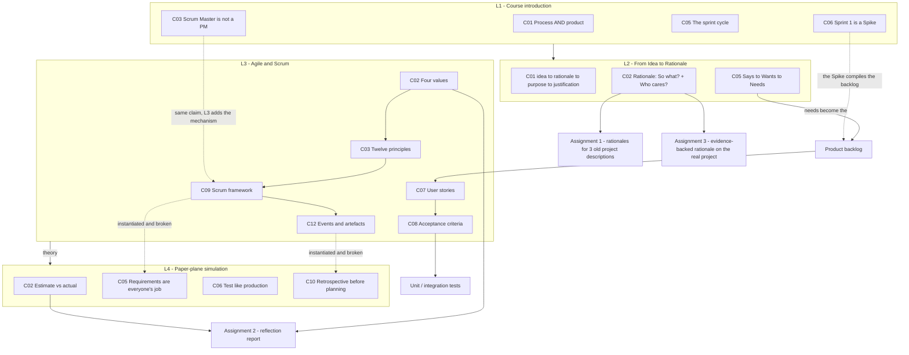

# SE761 (SOFTENG 761) - Syllabus map

Advanced Agile and Lean Software Development. Built up as lectures are ingested.

## Dependency graph

## Lecture index

| Lecture | Topic | Date | Status | Concepts | Resources |
|---|---|---|---|---|---|
| 1 | Course introduction (Agile intro deck) | Mon 20 Jul | **notes written, untested** | 10 (L1-C01…C10) | deck + transcript |
| 2 | From Idea to Rationale | Wed 22 Jul | **notes written, untested** | 10 (L2-C01…C10) | **no deck**; transcript + 3 Canvas pages |
| 3 | Agile and Scrum | Mon 27 Jul | **notes written, untested** | 13 (L3-C01…C13) | **no deck**; transcript + **the same Canvas pages as L2** (not duplicated) |
| 4 | Paper-plane Scrum simulation + Assignment 2 brief | Wed 29 Jul | **notes written, untested** | 12 (L4-C01…C12) | **no deck**; transcript only |

**Total: 45 concepts, 0 ever quizzed.** Ingest is four lectures ahead of retrieval. See `review-queue.json`.

## Module structure (from Canvas) — now fully covered

The Canvas page "Contents of Module 1 and 2" lists three topics:

1. **From Idea to Rationale** — L2
2. **Agile** — L3
3. **Scrum and Kanban** — L3 (Scrum in depth; Kanban named only)

> **Modules 1 & 2 are complete as of L3.** L2's note that "Modules 1 & 2 are only one-third taught" is now resolved.

**Module 3** holds the **Scrum Primer**, which L3 names as the team's standing reference for Scrum. Not yet fetched into the repo — worth doing, it would let the three-pillars material cite exact wording.

## Source-material sharing across lectures

⚠ **`Lecture2/resources/canvas-modules-1-and-2-pages.md` is shared, not duplicated.**

L3 is a walkthrough of the same Canvas module pages that L2 used — it simply delivers topics 2 and 3 of that file's index instead of topic 1. Rather than copying the file into `Lecture3/resources/`, the reference is recorded in three places: the Sources callout at the top of `L3-notes.md`, `resources_seen.supplementary` in L3's `progress.json`, and here.

**If you move or rename that file, three references break.** Grep for `canvas-modules-1-and-2-pages` before touching it.

`Lecture3/resources/` and `Lecture4/resources/` therefore contain only their transcripts.

## Cross-cutting themes

- **The requirements spine runs the whole course.** `client says` → `wants` → `needs` (L2-C05) → **product backlog** → **user stories** (L3-C07) → **acceptance criteria** (L3-C08) → **unit/integration tests**. Each lecture adds one link. This is the single most important chain to be able to trace end to end.
- **The client is non-technical by default.** Stated in L1, relied on in L2 (the reference-product problem), and given a protocol in L3-C05 (settle PO availability and the proceed-without-you rule in meeting one).
- **L3 is theory, L4 is the same theory failing.** Every L4 concept instantiates an L3 one — the forgotten logo is the inspection pillar, the untested target is the Code Runner trap in a different costume, the four competing designs are a consensus failure in a leaderless team. The L4 notes cross-link each pairing explicitly. That contrast is the most useful revision structure available for Assignment 2.
- **Assignment scaffolding mirrors the concept ladder.** A1 = rationale only, no evidence, on old descriptions. A2 = reflection on agile/Scrum. A3 = rationale plus research, on the real project.
- ⚠ **A1 and A2 have opposite Gen AI policies.** A1 permitted it and awarded 2 marks for a declared reflection; **A2 forbids it outright** because it is a reflective exercise. Recorded in `Lecture4/context/admin-and-dates.md`.

## Superseded and merged concepts

| Concept | Status |
|---|---|
| **L2-C08** (client vs product owner vs user) | **Superseded** by L3-C09 (full role set) and L3-C05 (PO-absence protocol). It was written as explicitly preliminary. Demote to a pointer on the next pass through `L2-notes.md`; quiz the L3 versions instead |
| **L1-C04** (Product Owner vs client) | Still the fuller treatment of the *never-stop* rule; complements rather than duplicates L3-C05 |
| **L1-C03** (Scrum Master is not a PM) | Agrees with L3-C09; L3 adds the mechanism (facilitation, impediment removal) and L4-C11 adds the verb list |

## Terminology to lock down

**L2:** rationale · purpose · justification (= business case) · says / wants / needs · product backlog
**L3:** agile values · agile principles · user story · acceptance criteria · sprint · sprint planning · daily scrum · sprint review · sprint retrospective · product backlog · sprint backlog · increment · definition of done · transparency / inspection / adaptation · corrective / adaptive / perfective maintenance · Scrum Master · Product Owner · self-organising team · continuous integration · Kanban · Scrumban · Extreme Programming
**L4:** story point · velocity · estimate-vs-actual gap · timebox

✅ **Resolved 2026-07-30: the term is "speed rationales"** — confirmed against the Assignment 1 brief (`A1.pdf`), which prints it as a section heading. "Seed rationales" was a transcription mis-hearing.

## Not lecture content

`project_pages.zip` / `project_pages/` and `project-index.csv` under `Lecture2/resources` are the Part IV project catalogue (134 projects, dated 2024). Reference material for project selection, for Assignment 1 practice descriptions, and — per L4's brief — as a fallback source of a project to reflect on in Assignment 2 if you have no prior experience. Not quizzable; no concept IDs drawn from it.

The **paper-plane game mechanics** (sheet counts, throwing rules, team letters) are likewise a teaching device, not examinable content. Only the generalisations drawn from them in L4's debrief carry concept IDs.

## Expected next

L3 previewed teamwork-risk research from the lecturer's own work as "next lecture" content; L4 was the simulation instead. **Still outstanding** — logged as an open question in both lectures' `progress.json`.
