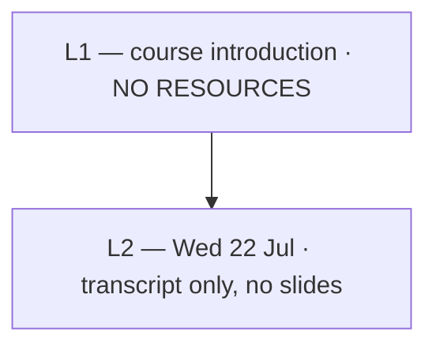

# SE761 (SOFTENG 761) — Syllabus map

How the lectures connect. Built up as lectures are ingested.

## Dependency graph

## Lecture index

| Lecture | Topic | Date | Status | Concepts | Notes |
|---|---|---|---|---|---|
| 1 | — | — | **no resources** | 0 | Nothing dropped. The transcript currently sitting in `Lecture1/resources/` is Lecture **2**'s. |
| 2 | — | Wed 22 Jul | **not started** | 0 | Transcript only, no slide deck. Ingest will be `⚠ thin — transcript only`. |

## Cross-cutting themes

*None identified yet.*

## Known gaps

- No slide deck for any SE761 lecture. Slides carry the precise wording that gets marked; without them the notes cannot be checked against assessable phrasing.
- Lecture 1 material has not been supplied at all.
